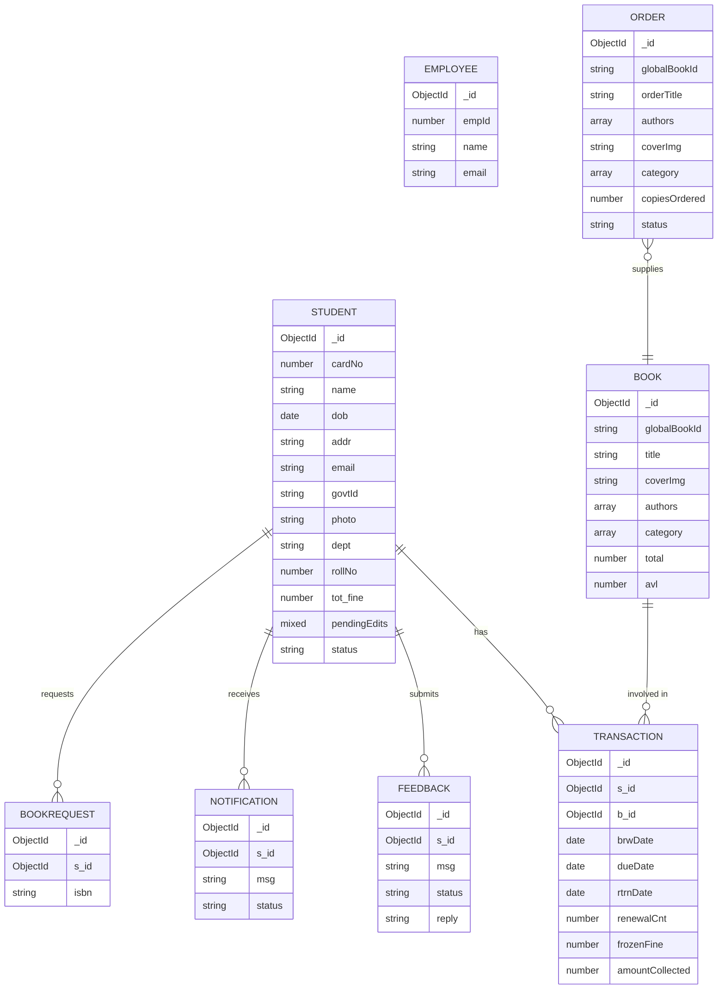

# Library Management System

## 1. Overview
A Library Management System built with the MERN stack (MongoDB, Express, React, Node.js). Features include portals for Students and Library Staff, fine tracking, inventory management, and email notifications.

**Live Demo:**
- [https://library-eight-steel.vercel.app](https://library-eight-steel.vercel.app)


## 2. Core Features
- **Dual Portals:** Separate interfaces for Students and Library Staff.
- **Fine Tracking:** Calculates late fees automatically based on due dates.
- **Inventory Management:** Track book availability and manage waitlists.
- **Email Notifications:** Alerts for registrations and book availability.
- **Administrative CLI:** CLI scripts for seeding the database.

## 3. Entity-Relationship Diagram



## 4. Setup & Usage

### Environment Configuration
Create a `.env` file in the **backend**:
```env
PORT=8000
MONGODB_URI=mongodb+srv://<user>:<password>@cluster.mongodb.net/library
CORS_ORIGIN=http://localhost:5173
ACCESS_TOKEN_SECRET=your_super_secret_key
CLOUDINARY_CLOUD_NAME=your_name
CLOUDINARY_API_KEY=your_api_key
CLOUDINARY_API_SECRET=your_api_secret
SMTP_USER=your_email@gmail.com
SMTP_PASS=your_app_password
```

Create a `.env` file in the **frontend**:
```env
VITE_API_URL=http://localhost:8000/api
VITE_TAWKTO_PROPERTY_ID=your_property_id
```

### Installation & Running
1. Install dependencies for both environments:
   ```bash
   cd backend && npm install
   cd ../frontend && npm install
   ```
2. Start both servers concurrently:
   ```bash
   # Terminal 1
   cd backend && npm run dev
   # Terminal 2
   cd frontend && npm run dev
   ```

### Administrative CLI
The project includes a command-line tool (`backend/src/testing_scripts/adminSetup.js`) to help you manage the database during development:

- `node adminSetup.js --seed` : Populates the database with initial baseline data.
- `node adminSetup.js --bulk-seed` : Loads a massive dataset for stress testing.
- `node adminSetup.js --add-employee '<json>'` : Creates a new employee.
- `node adminSetup.js --remove-employee <id>` : Removes an employee.
- `node adminSetup.js --flush` : Wipes the entire database clean.

## 5. Design & UI
- **Typography:** Plus Jakarta Sans for body text, Roboto Mono for metadata.
- **Icons:** Phosphor Icons.

## 6. Technology Stack
- **Frontend:** React 18, Vite, TypeScript, Tailwind CSS, Framer Motion
- **Backend:** Node.js, Express.js
- **Database:** MongoDB (Mongoose)
- **Authentication:** JWT, bcrypt
- **External Services:** Google Books API, Cloudinary (File Storage), Nodemailer (Emails), Tawk.to (Live Chat)

## 7. Deployment
Deployment setup:
- **Frontend:** Hosted on Vercel.
- **Backend:** Hosted on Render.
- **Database:** MongoDB Atlas cluster.

## 8. Security & Edge Case Handling
This project has been heavily audited and refactored for enterprise-grade resilience:
- **NoSQL Injection Prevention**: Edit payloads are explicitly whitelisted.
- **Resource Leak Protection**: If Cloudinary upload succeeds but Mongoose fails, the orphaned image is instantly deleted. Temporary Multer files on the local disk are aggressively cleaned up during API failures.
- **Race Condition Throttling**: Password reset flows are throttled to prevent spam and token overwrites.
- **Denial of Service (DoS) Mitigation**: All list endpoints enforce a hard `.limit(500)` cap, protecting the backend from memory heap crashes.
- **Collection Scan Prevention**: Robust B-Tree indexes exist on the `Transaction` schema (`dueDate`, `s_id`, etc.) to instantly query overdue ledgers without paralyzing the cluster.
- **Frontend Error Boundaries**: Lazy-loaded route failures are caught by a global React ErrorBoundary, displaying a resilient fallback UI instead of crashing the browser.
- **Data Synchronization**: Complex calculations like `tot_fine` are perfectly synchronized via Mongoose `post` hooks utilizing `$group` aggregations.
