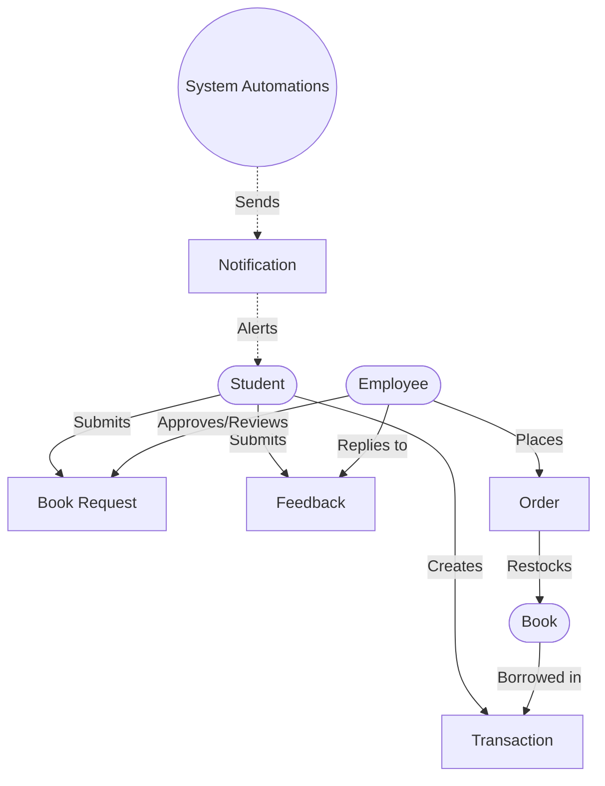
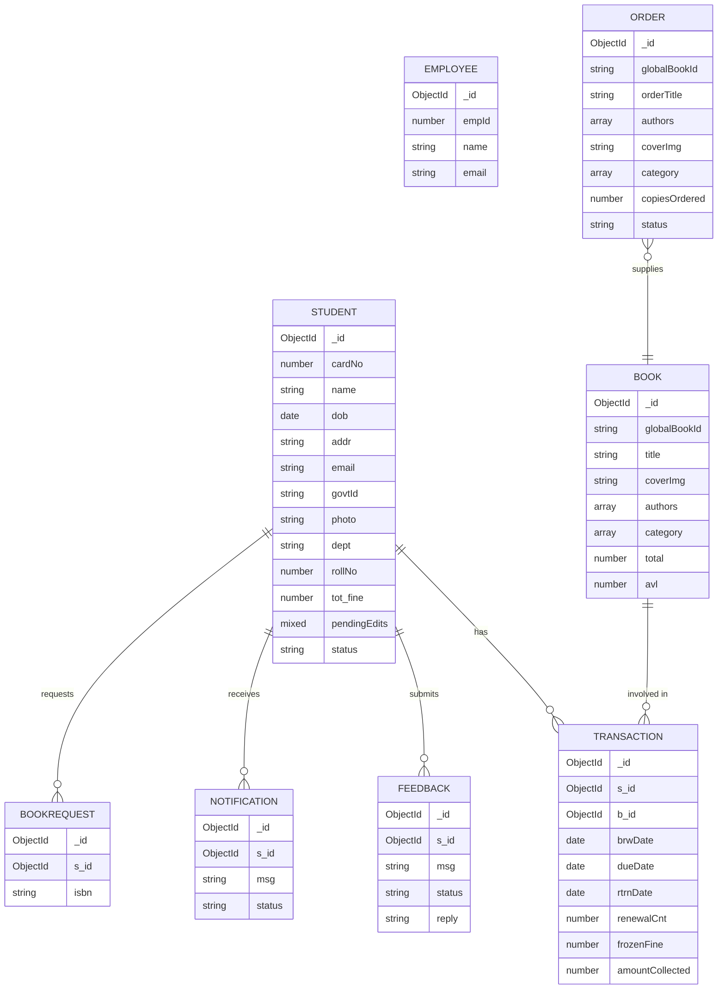

# Library Management System

## 1. Overview
A professional, modern Library Management System built with the MERN stack (MongoDB, Express, React, Node.js). It provides distinct portals for Students and Library Staff, automated fine tracking, real-time inventory management, and email notifications, all wrapped in a clean, user-friendly interface.

## 2. Core Features
- **Dual Portals:** Dedicated, secure interfaces for Students and Library Staff with strict access controls.
- **Automated Fine Tracking:** Dynamic late fee calculations that automatically freeze upon book return, allowing for transparent payments or staff waivers.
- **Inventory Management:** Real-time tracking of book availability, waitlists, and new book orders.
- **Email Notifications:** Automated alerts for successful registrations and book availability.
- **Administrative CLI:** A dedicated testing tool for quick database seeding and bulk data management.

## 3. System Architecture & Data Flow

### High-Level System Flow


### Entity-Relationship Diagram


## 4. Setup & Usage

### Environment Configuration
Create a `.env` file in the **backend**:
```env
PORT=8000
MONGODB_URI=mongodb+srv://<user>:<password>@cluster.mongodb.net/library
CORS_ORIGIN=http://localhost:5173
ACCESS_TOKEN_SECRET=your_super_secret_key
CLOUDINARY_CLOUD_NAME=your_name
CLOUDINARY_API_KEY=your_api_key
CLOUDINARY_API_SECRET=your_api_secret
SMTP_USER=your_email@gmail.com
SMTP_PASS=your_app_password
```

Create a `.env` file in the **frontend**:
```env
VITE_API_URL=http://localhost:8000/api
VITE_TAWKTO_PROPERTY_ID=your_property_id
```

### Installation & Running
1. Install dependencies for both environments:
   ```bash
   cd backend && npm install
   cd ../frontend && npm install
   ```
2. Start both servers concurrently:
   ```bash
   # Terminal 1
   cd backend && npm run dev
   # Terminal 2
   cd frontend && npm run dev
   ```

### Administrative CLI
The project includes a command-line tool (`backend/src/testing_scripts/adminSetup.js`) to help you manage the database during development:

- `node adminSetup.js --seed` : Populates the database with initial baseline data.
- `node adminSetup.js --bulk-seed` : Loads a massive dataset for stress testing.
- `node adminSetup.js --add-employee '<json>'` : Creates a new employee.
- `node adminSetup.js --remove-employee <id>` : Removes an employee.
- `node adminSetup.js --flush` : Wipes the entire database clean.

## 5. Technology Stack
- **Frontend:** React 18, Vite, TypeScript, Tailwind CSS, Framer Motion
- **Backend:** Node.js, Express.js
- **Database:** MongoDB (Mongoose)
- **Authentication:** JWT, bcrypt
- **External Services:** Google Books API, Cloudinary (File Storage), Nodemailer (Emails), Tawk.to (Live Chat)
