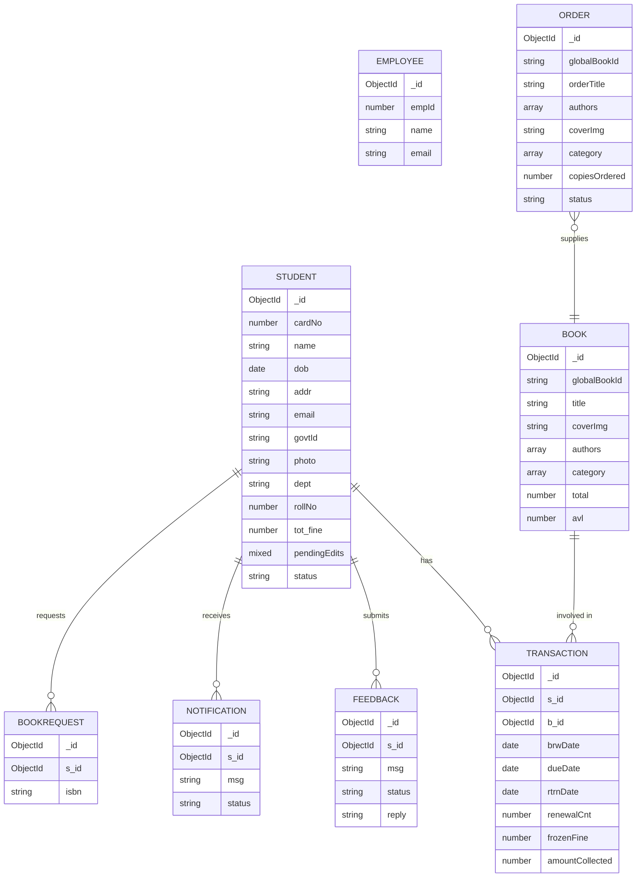

# Library Management System - Codebase Context

This file contains the full structure and source code of the MERN-stack Library Management System.

## Directory Structure

```text
├── backend
│   ├── src
│   │   ├── controllers
│   │   │   ├── auth.controller.js
│   │   │   ├── book.controller.js
│   │   │   ├── employee.controller.js
│   │   │   ├── management.controller.js
│   │   │   ├── student.controller.js
│   │   │   ├── support.controller.js
│   │   │   └── transaction.controller.js
│   │   ├── db
│   │   │   ├── data
│   │   │   │   ├── books.json
│   │   │   │   ├── employees.json
│   │   │   │   ├── students.json
│   │   │   │   └── transactions.json
│   │   │   └── index.js
│   │   ├── middlewares
│   │   │   ├── auth.middleware.js
│   │   │   ├── multer.middleware.js
│   │   │   └── validate.middleware.js
│   │   ├── models
│   │   │   ├── book.model.js
│   │   │   ├── bookRequest.model.js
│   │   │   ├── employee.model.js
│   │   │   ├── order.model.js
│   │   │   ├── student.model.js
│   │   │   └── transaction.model.js
│   │   ├── routes
│   │   │   ├── auth.routes.js
│   │   │   ├── book.routes.js
│   │   │   ├── employee.routes.js
│   │   │   ├── management.routes.js
│   │   │   ├── student.routes.js
│   │   │   ├── support.routes.js
│   │   │   └── transaction.routes.js
│   │   ├── testing_scripts
│   │   │   ├── adminSetup.js
│   │   │   ├── bulkSeed.js
│   │   │   └── seed.js
│   │   ├── utils
│   │   │   ├── ApiError.js
│   │   │   ├── ApiResponse.js
│   │   │   ├── asyncHandler.js
│   │   │   ├── cloudinary.js
│   │   │   ├── googleBooksAPI.js
│   │   │   ├── isbn.js
│   │   │   ├── mailer.js
│   │   │   └── sessionWrapper.js
│   │   ├── validators
│   │   │   ├── auth.validator.js
│   │   │   ├── book.validator.js
│   │   │   ├── employee.validator.js
│   │   │   ├── management.validator.js
│   │   │   ├── student.validator.js
│   │   │   └── transaction.validator.js
│   │   ├── app.js
│   │   ├── constants.js
│   │   └── index.js
│   ├── .env
│   ├── .env.example
│   └── .gitignore
├── frontend
│   ├── dist
│   │   ├── assets
│   │   │   ├── ArrowLeft.es-DALjKVEm.js
│   │   │   ├── BookCard-BDCB4J0p.js
│   │   │   ├── BookOpen.es-Cen6xAY3.js
│   │   │   ├── BookRequestsPage-iZ5Gz7es.js
│   │   │   ├── Books.es-DBtolnRw.js
│   │   │   ├── CataloguePage-DhXKmKmt.js
│   │   │   ├── Check.es-BN0tvutn.js
│   │   │   ├── CheckCircle.es-D87YpLof.js
│   │   │   ├── EmployeeCataloguePage-ChtsI74l.js
│   │   │   ├── EmployeeDashboard-B-HLjbFF.js
│   │   │   ├── EmployeeLayout-BXCAvSh5.js
│   │   │   ├── EmployeeLoginPage-GX8jx9XD.js
│   │   │   ├── ForgotPasswordPage-9M9D_5Ii.js
│   │   │   ├── IconBase.es-fL4Y-S_s.js
│   │   │   ├── index-GLD6Ht4H.css
│   │   │   ├── index-H2QvSvmr.js
│   │   │   ├── LandingPage-dyXfH4Gk.js
│   │   │   ├── OrdersPage-BSHwxH7j.js
│   │   │   ├── PendingEditsPage-CHKfxBAg.js
│   │   │   ├── PendingStudentsPage-DQyKIiBN.js
│   │   │   ├── proxy-BZmSSbcT.js
│   │   │   ├── Receipt.es-Bd5rkXmH.js
│   │   │   ├── RegisterPage-D8Aob4FX.js
│   │   │   ├── ResetPasswordPage-BMaGpQZv.js
│   │   │   ├── schemas-D1iejA5G.js
│   │   │   ├── shared-82e60HI1.js
│   │   │   ├── ShoppingCart.es-DqLzyajP.js
│   │   │   ├── SidebarLayout-D9lufbgb.js
│   │   │   ├── StudentCataloguePage-nMEpytYJ.js
│   │   │   ├── StudentDashboard-DJE1FAX_.js
│   │   │   ├── StudentHistoryPage-9nIaeOur.js
│   │   │   ├── StudentLayout-JHw2S2Bw.js
│   │   │   ├── StudentLoginPage-CWayBAt_.js
│   │   │   ├── useQuery-llZ2Zf_J.js
│   │   │   ├── UserCircle.es-akgryh6p.js
│   │   │   └── WarningCircle.es-CX_3ITiw.js
│   │   ├── _redirects
│   │   ├── favicon.svg
│   │   ├── icons.svg
│   │   └── index.html
│   ├── src
│   │   ├── api
│   │   │   ├── client.ts
│   │   │   └── index.ts
│   │   ├── components
│   │   │   ├── layout
│   │   │   │   ├── EmployeeLayout.tsx
│   │   │   │   ├── SidebarLayout.tsx
│   │   │   │   └── StudentLayout.tsx
│   │   │   ├── ui
│   │   │   │   ├── BookCard.tsx
│   │   │   │   └── Modal.tsx
│   │   │   ├── ErrorBoundary.tsx
│   │   │   └── FloatingContactBtn.tsx
│   │   ├── context
│   │   │   └── AuthContext.tsx
│   │   ├── features
│   │   │   ├── auth
│   │   │   │   ├── EmployeeLoginPage.tsx
│   │   │   │   ├── ForgotPasswordPage.tsx
│   │   │   │   ├── RegisterPage.tsx
│   │   │   │   ├── ResetPasswordPage.tsx
│   │   │   │   └── StudentLoginPage.tsx
│   │   │   ├── employee
│   │   │   │   ├── BookRequestsPage.tsx
│   │   │   │   ├── EmployeeCataloguePage.tsx
│   │   │   │   ├── EmployeeDashboard.tsx
│   │   │   │   ├── OrdersPage.tsx
│   │   │   │   ├── PendingEditsPage.tsx
│   │   │   │   └── PendingStudentsPage.tsx
│   │   │   └── student
│   │   │       ├── StudentCataloguePage.tsx
│   │   │       ├── StudentDashboard.tsx
│   │   │       └── StudentHistoryPage.tsx
│   │   ├── styles
│   │   │   └── shared.ts
│   │   ├── types
│   │   │   └── auth.ts
│   │   ├── App.tsx
│   │   ├── index.css
│   │   └── main.tsx
│   ├── .env
│   ├── .env.example
│   ├── .gitignore
│   ├── .oxlintrc.json
│   ├── index.html
│   ├── package-lock.json
│   ├── package.json
│   ├── tsconfig.app.json
│   ├── tsconfig.json
│   ├── tsconfig.node.json
│   └── vite.config.ts
├── .gitignore
├── codebase_context.md
├── generateContext.cjs
├── package-lock.json
├── package.json
├── README.md
└── refactorStyles.cjs
```

## Source Code

### File: `backend/.env.example`

```text
PORT=8000
MONGODB_URI=mongodb+srv://<username>:<password>@cluster.mongodb.net/library
CORS_ORIGIN=http://localhost:5173

ACCESS_TOKEN_SECRET=your_super_secret_access_token_key_here
ACCESS_TOKEN_EXPIRY=1d
REFRESH_TOKEN_SECRET=your_super_secret_refresh_token_key_here
REFRESH_TOKEN_EXPIRY=10d

CLOUDINARY_CLOUD_NAME=your_cloudinary_cloud_name
CLOUDINARY_API_KEY=your_cloudinary_api_key
CLOUDINARY_API_SECRET=your_cloudinary_api_secret

SMTP_HOST=smtp.gmail.com
SMTP_PORT=587
SMTP_USER=your_smtp_email@example.com
SMTP_PASS=your_smtp_app_password

GOOGLE_BOOKS_API_KEY=your_google_books_api_key

```

### File: `backend/src/app.js`

```javascript
import express from "express"
import cors from "cors"
import cookieParser from "cookie-parser"
import fs from "fs"
import mongoose from "mongoose"

const app = express()

// Trust the reverse proxy (Render) so secure cookies are set correctly
app.set("trust proxy", 1)

app.use(cors({
    origin: function (origin, callback) {
        if (!origin || origin.startsWith("http://localhost:") || origin === process.env.CORS_ORIGIN || origin.endsWith(".vercel.app")) {
            callback(null, true)
        } else {
            callback(new Error("Not allowed by CORS"))
        }
    },
    credentials: true
}))

app.use(express.json({limit: "16kb"}))
app.use(express.urlencoded({extended: true, limit: "16kb"}))
app.use(express.static("public"))
app.use(cookieParser())


import studentRouter from "./routes/student.routes.js"
import employeeRouter from "./routes/employee.routes.js"
import managementRouter from "./routes/management.routes.js"
import bookRouter from "./routes/book.routes.js"
import transactionRouter from "./routes/transaction.routes.js"
import authRouter from "./routes/auth.routes.js"
import supportRouter from "./routes/support.routes.js"

app.use("/api/auth", authRouter)
app.use("/api/students", studentRouter)
app.use("/api/employees", employeeRouter)
app.use("/api/management", managementRouter)
app.use("/api/books", bookRouter)
app.use("/api/transactions", transactionRouter)

app.use("/api/support", supportRouter)


app.use((err, req, res, next) => {
    
    // cleanup uploaded files on error
    if (req.files) {
        Object.values(req.files).forEach(fileArray => {
            fileArray.forEach(file => {
                if (fs.existsSync(file.path)) {
                    fs.unlinkSync(file.path)
                }
            })
        })
    }
    if (req.file && fs.existsSync(req.file.path)) {
        fs.unlinkSync(req.file.path)
    }

    // mongoose OCC VersionError
    if (err instanceof mongoose.Error.VersionError) {
        return res.status(409).json({
            statusCode: 409,
            message: "A concurrency conflict occurred. The record was modified by another request. Please refresh and try again.",
            success: false,
            errors: []
        })
    }

    // Mongoose Validation Error
    if (err.name === 'ValidationError') {
        const messages = Object.values(err.errors).map(val => val.message)
        return res.status(400).json({
            statusCode: 400,
            message: messages.join(', '),
            success: false,
            errors: messages
        })
    }

    // Mongoose CastError (Invalid ID)
    if (err.name === 'CastError') {
        return res.status(400).json({
            statusCode: 400,
            message: `Invalid ${err.path}: ${err.value}`,
            success: false,
            errors: []
        })
    }

    //default ApiError format or fallback
    const statusCode = err.statusCode || 500
    const message = err.message || "Something went wrong on the server"
    
    return res.status(statusCode).json({
        statusCode,
        message,
        success: false,
        errors: err.errors || []
    })
})

export { app }

```

### File: `backend/src/constants.js`

```javascript
export const BORROW_PERIOD_MS = 14 * 24 * 60 * 60 * 1000
export const RENEWAL_PERIOD_MS = 7 * 24 * 60 * 60 * 1000
export const FINE_PER_DAY = 5

```

### File: `backend/src/controllers/auth.controller.js`

```javascript
import { asyncHandler } from "../utils/asyncHandler.js"
import { ApiError } from "../utils/ApiError.js"
import { ApiResponse } from "../utils/ApiResponse.js"
import { Student } from "../models/student.model.js"
import { Employee } from "../models/employee.model.js"
import { sendMail } from "../utils/mailer.js"
import crypto from "crypto"

export const forgotPassword = asyncHandler(async (req, res) => {
    const { email, role } = req.body

    const Model = role === "student" ? Student : Employee
    const user = await Model.findOne({ email })

    if (!user) {
        throw new ApiError(404, "User with this email does not exist")
    }

    if (user.forgotPasswordToken && user.forgotPasswordExpiry > Date.now()) {
        throw new ApiError(429, "A reset link was already sent. Please check your email or wait 15 minutes before requesting a new one.")
    }

    const resetToken = user.createPasswordResetToken()
    
    await user.save({ validateBeforeSave: false })

    const resetUrl = `http://localhost:5173/reset-password/${resetToken}`

    const message = `
        <h2>Password Reset Request</h2>
        <p>You requested a password reset for your Library ${role} account.</p>
        <p>Please click the link below to reset your password. This link is valid for 15 minutes.</p>
        <a href="${resetUrl}" style="padding:10px 20px; background-color:#4f46e5; color:white; text-decoration:none; border-radius:5px;">Reset Password</a>
        <p>If you did not request this, please ignore this email.</p>
    `

    try {
        await sendMail(
            user.email,
            "Password Reset - Library Management System",
            message
        )

        return res.status(200).json(
            new ApiResponse(200, {}, "Token sent to email successfully")
        )
    } catch (error) {
        user.forgotPasswordToken = undefined
        user.forgotPasswordExpiry = undefined
        await user.save({ validateBeforeSave: false })

        throw new ApiError(500, "There was an error sending the email. Try again later.")
    }
})

export const resetPassword = asyncHandler(async (req, res) => {
    const { token } = req.params
    const { password } = req.body

    const hashedToken = crypto.createHash("sha256").update(token).digest("hex")

    let user = await Student.findOne({
        forgotPasswordToken: hashedToken,
        forgotPasswordExpiry: { $gt: Date.now() }
    })

    if (!user) {
        user = await Employee.findOne({
            forgotPasswordToken: hashedToken,
            forgotPasswordExpiry: { $gt: Date.now() }
        })
    }

    if (!user) {
        throw new ApiError(400, "Token is invalid or has expired")
    }

    user.password = password
    
    user.forgotPasswordToken = undefined
    user.forgotPasswordExpiry = undefined
    
    await user.save()

    return res.status(200).json(
        new ApiResponse(200, {}, "Password reset successful! You can now log in.")
    )
})

```

### File: `backend/src/controllers/book.controller.js`

```javascript
import { asyncHandler } from "../utils/asyncHandler.js"
import { sessionWrapper } from "../utils/sessionWrapper.js"
import { ApiError } from "../utils/ApiError.js"
import { ApiResponse } from "../utils/ApiResponse.js"
import { uploadOnCloudinary, deleteFromCloudinary } from "../utils/cloudinary.js"
import { Book } from "../models/book.model.js"
import { Transaction } from "../models/transaction.model.js"
import { BookRequest } from "../models/bookRequest.model.js"
import { Order } from "../models/order.model.js"
import { searchGlobalBook } from "../utils/googleBooksAPI.js"


const requestBook = asyncHandler(async (req, res) => {

    const { isbn } = req.body

    const bookRequest = await BookRequest.findOneAndUpdate(
        { isbn },
        { $inc: { requestCount: 1 } },
        { upsert: true, new: true }
    )
    return res.status(201).json(new ApiResponse(201, bookRequest, "Book request placed successfully"))
})

const getAggregatedRequests = asyncHandler(async (req, res) => {
    const requests = await BookRequest.find().sort({ requestCount: -1 }).limit(500)
    
    const aggregatedRequests = await Promise.all(requests.map(async (r) => {
        let bookDetails = null;
        try {
            const match = await searchGlobalBook(r.isbn)
            if (match) {
                bookDetails = {
                    title: match.orderTitle,
                    author: match.authors.join(", "),
                    coverImg: match.coverImg
                }
            }
        } catch (error) {
            console.error(`Failed to fetch details for ISBN ${r.isbn}:`, error)
        }

        return {
            _id: r.isbn,
            count: r.requestCount,
            bookDetails
        }
    }))

    return res.status(200).json(
        new ApiResponse(200, aggregatedRequests, "Aggregated requests fetched successfully")
    )
})

const rejectBookRequest = asyncHandler(async (req, res) => {
    
    const { isbn } = req.body

    await BookRequest.deleteOne({ isbn })
    return res.status(200).json(
        new ApiResponse(200, null, "Book request rejected successfully")
    )
})

const rejectAllBookRequests = asyncHandler(async (req, res) => {
    await BookRequest.deleteMany({})
    return res.status(200).json(
        new ApiResponse(200, null, "All book requests rejected successfully")
    )
})

const processOrder = asyncHandler(async (req, res) => {

    const { isbn, copiesOrdered } = req.body
    const match = await searchGlobalBook(isbn)
    if (!match)
    throw new ApiError(404, "Book not found in global catalogue")

    const orderResult = await sessionWrapper(async (session) => {
        const order = new Order({
            globalBookId: match.globalBookId,
            orderTitle: match.orderTitle,
            authors: match.authors,
            coverImg: match.coverImg,
            category: match.category,
            copiesOrdered
        })
        await order.save({ session })
        
        await BookRequest.deleteOne({ isbn }).session(session)
        
        return order
    })
    
    return res.status(201).json(new ApiResponse(201, orderResult, "Order placed successfully"))
})

const placeOrder = processOrder
const manualOrder = processOrder

const receiveOrder = asyncHandler(async (req, res) => {

    const {orderId} = req.params
    if(!orderId)
    throw new ApiError(400, "Missing order ID")
    const order = await Order.findById(orderId)
    if(!order)
    throw new ApiError(404, "Order not found")
    const existingBook = await Book.findOne({ globalBookId: order.globalBookId })
    
    await sessionWrapper(async (session) => {

        if (existingBook) {
            existingBook.total += order.copiesOrdered
            existingBook.avl += order.copiesOrdered
            await existingBook.save({ session })
        } 
        else {
            const newBook = new Book({
                globalBookId: order.globalBookId,
                title: order.orderTitle,
                authors: order.authors,
                category: order.category,
                coverImg: order.coverImg,
                total: order.copiesOrdered,
                avl: order.copiesOrdered
            })
            await newBook.save({ session })
        }

        order.status = "Received"
        await order.save({ session })
    })


    
    return res.status(200).json(
        new ApiResponse(200, order, "Order received successfully")
    )
})

const getAllBooks = asyncHandler(async (req, res) => {
    const { search, category } = req.query
    const query = {}
    if (search) {
        query.$or = [
            { title: { $regex: search, $options: "i" } },
            { authors: { $regex: search, $options: "i" } }
        ]
    }
    
    if (category)
    query.category = { $regex: category, $options: "i" }
    let books = await Book.find(query).limit(500).lean()
    if (!books || books.length === 0) {
        throw new ApiError(404, "No books found matching your criteria")
    }
    
    books = await Promise.all(books.map(async (book) => {
        if (book.avl === 0) {
            const activeTransactions = await Transaction.find({ 
                b_id: book._id, 
                rtrnDate: { $exists: false } 
            }).sort({ dueDate: 1 }).limit(1)
            
            if (activeTransactions.length > 0) {
                book.expectedReturnDate = activeTransactions[0].dueDate
            }
        }
        return book
    }))
    
    return res.status(200).json(
        new ApiResponse(200, books, "Books fetched successfully")
    )
})

const getAllCategories = asyncHandler(async (req, res) => {
    const categories = await Book.distinct("category")
    return res.status(200).json(
        new ApiResponse(200, categories, "Categories fetched successfully")
    )
})

const getBookById = asyncHandler(async (req, res) => {
    
    const {bookId} = req.params
    if(!bookId)
    throw new ApiError(400, "Missing book ID")
    const book = await Book.findById(bookId)
    if(!book)
    throw new ApiError(404, "Book not found")
    return res.status(200).json(
        new ApiResponse(200, book, "Book fetched successfully")
    )
})

const getAllOrders = asyncHandler(async (req, res) => {
    const orders = await Order.find({}).sort({ createdAt: -1 }).limit(500)
    return res.status(200).json(
        new ApiResponse(200, orders, "Orders fetched successfully")
    )
})

export {
    requestBook,
    getAggregatedRequests,
    rejectBookRequest,
    rejectAllBookRequests,
    placeOrder,
    manualOrder,
    receiveOrder,
    getAllBooks,
    getBookById,
    getAllOrders,
    getAllCategories
}
```

### File: `backend/src/controllers/employee.controller.js`

```javascript
import { asyncHandler } from "../utils/asyncHandler.js"
import { ApiError } from "../utils/ApiError.js"
import { ApiResponse } from "../utils/ApiResponse.js"
import { Employee } from "../models/employee.model.js"

const generateAccessAndRefereshTokens = async(employeeId)=>{

    try{
        const employee =await Employee.findById(employeeId)

        const accessToken = await employee.generateAccessToken()
        const refreshToken = await employee.generateRefreshToken()

        employee.refreshToken = refreshToken
        await employee.save({validateBeforeSave:false})

        return {accessToken, refreshToken}
    }
    catch(error){
        throw new ApiError(500,"Error while generating refresh and access tokens", error)
    }
}


const loginEmployee= asyncHandler(async(req, res) =>{

    const {empId , password} = req.body

    const employee=await Employee.findOne({empId})
    if(!employee)
    throw new ApiError(404, "Employee not found")
    
    const isPasswordCorrect = await employee.isPasswordCorrect(password)
    if(!isPasswordCorrect)
    throw new ApiError(401, "Invalid password")

    const {accessToken, refreshToken} = await generateAccessAndRefereshTokens(employee._id)

    const loggedInEmployee = await Employee.findById(employee._id).select("-password -refreshToken")
    
    const options = {
        httpOnly: true,
        secure: true,
        sameSite: "none"
    }

    return res
    .status(200)
    .cookie("accessToken", accessToken, options)
    .cookie("refreshToken", refreshToken, options)
    .json(
        new ApiResponse(
            200, 
            {
                employee : loggedInEmployee, accessToken, refreshToken
            },
            "Employee logged In Successfully"
        )
    )
    

})

const logoutEmployee = asyncHandler(async(req,res) =>{
    await Employee.findByIdAndUpdate(
        req.employee._id,
        {
            $unset:{
                refreshToken:1
            }
        },
        {
            new : true
        }
    )

    const options ={
        httpOnly:true,
        secure:true,
        sameSite: "none"
    }

    return res
    .status(200)
    .clearCookie("accessToken", options)
    .clearCookie("refreshToken", options)
    .json(
        new ApiResponse(
            200,
            {},
            "Employee logged out Successfully"
        )
    )
})

const getEmployeeProfile = asyncHandler(async (req, res) => {
    return res.status(200).json(
        new ApiResponse(200, req.employee, "Employee profile fetched successfully")
    )
})

export {
    loginEmployee,
    logoutEmployee,
    getEmployeeProfile
}

```

### File: `backend/src/controllers/management.controller.js`

```javascript
import { asyncHandler } from "../utils/asyncHandler.js"
import { ApiError } from "../utils/ApiError.js"
import { ApiResponse } from "../utils/ApiResponse.js"
import { Student } from "../models/student.model.js"
import { sendMail } from "../utils/mailer.js"

const getPendingStudents = asyncHandler(async (req, res) => {
    const students = await Student.find({ status: "Pending" }).sort({ createdAt: -1 }).select("-password -refreshToken").limit(500)
    
    return res.status(200).json(
        new ApiResponse(200, students, "Pending students fetched successfully")
    )
})

const approveStudent = asyncHandler(async (req, res) => {

    const { studentId } = req.body

    const student = await Student.findById(studentId)
    if (!student) throw new ApiError(404, "Student not found")
    if (student.status === "Approved") throw new ApiError(400, "Student is already approved")

    let cardNo
    let isUnique = false
    while (!isUnique) {
        cardNo = Math.floor( 1000 + Math.random() * 9000)
        const exists = await Student.findOne({ cardNo })
        if (!exists) isUnique = true
    }

    student.cardNo = cardNo
    student.status = "Approved"
    await student.save({ validateBeforeSave: false }) // skip password validation

    const emailHtml = `
        <h2>Welcome to the Library, ${student.name}!</h2>
        <p>Your registration has been officially approved.</p>
        <p>Your Library Card Number is: <strong>${cardNo}</strong></p>
        <p>You can now use this card number to log into your dashboard and borrow books.</p>
    `
    const mailResult = await sendMail(student.email, "Library Registration Approved", emailHtml)

    return res.status(200).json(
        new ApiResponse(200, { cardNo }, mailResult.success ? "Student approved successfully" : "Student approved, but welcome email failed to send")
    )
})

const rejectStudent = asyncHandler(async (req, res) => {

    const { studentId, reason } = req.body


    const student = await Student.findById(studentId)
    if (!student) throw new ApiError(404, "Student not found")

    const emailHtml = `
        <h2>Library Registration Update</h2>
        <p>Dear ${student.name},</p>
        <p>Unfortunately, your library registration request has been declined for the following reason:</p>
        <blockquote style="border-left: 4px solid #ff4444; padding-left: 10px;">
            ${reason}
        </blockquote>
        <p>Please contact the library administration if you have any questions.</p>
    `
    await sendMail(student.email, "Library Registration Declined", emailHtml)

    await Student.findByIdAndDelete(studentId)

    return res.status(200).json(
        new ApiResponse(200, null, "Student registration rejected and deleted successfully")
    )
})

const getPendingProfileEdits = asyncHandler(async (req, res) => {

    const students = await Student.find({ pendingEdits: { $ne: null } }).sort({ updatedAt: -1 }).select("-password -refreshToken").limit(500)
    
    return res.status(200).json(
        new ApiResponse(200, students, "Pending profile edits fetched successfully")
    )
})

const approveProfileEdit = asyncHandler(async (req, res) => {

    const { studentId } = req.body

    const student = await Student.findById(studentId)
    if (!student) throw new ApiError(404, "Student not found")
    if (!student.pendingEdits) throw new ApiError(400, "No pending edits found for this student")

    //merge edits
    const edits = student.pendingEdits
    const allowedFields = ['name', 'dob', 'addr', 'email', 'dept', 'rollNo']
    allowedFields.forEach(key => {
        if (edits[key] !== undefined) {
            student[key] = edits[key]
        }
    })
    
    student.pendingEdits = null
    await student.save({ validateBeforeSave: false })

    const emailHtml = `
        <h2>Profile Update Approved</h2>
        <p>Dear ${student.name},</p>
        <p>Your requested profile updates have been reviewed and approved by management. The changes are now live on your account.</p>
    `
    await sendMail(student.email, "Profile Update Approved", emailHtml)

    return res.status(200).json(
        new ApiResponse(200, student, "Profile edits approved successfully")
    )
})

const rejectProfileEdit = asyncHandler(async (req, res) => {
    const { studentId, reason } = req.body

    const student = await Student.findById(studentId)
    if (!student) throw new ApiError(404, "Student not found")
    if (!student.pendingEdits) throw new ApiError(400, "No pending edits found for this student")

    student.pendingEdits = null
    await student.save({ validateBeforeSave: false })

    const emailHtml = `
        <h2>Profile Update Declined</h2>
        <p>Dear ${student.name},</p>
        <p>Your requested profile updates have been declined by management for the following reason:</p>
        <blockquote style="border-left: 4px solid #ff4444; padding-left: 10px;">
            ${reason}
        </blockquote>
    `
    await sendMail(student.email, "Profile Update Declined", emailHtml)

    return res.status(200).json(
        new ApiResponse(200, null, "Profile edits rejected successfully")
    )
})

export {
    getPendingStudents,
    approveStudent,
    rejectStudent,
    getPendingProfileEdits,
    approveProfileEdit,
    rejectProfileEdit
}

```

### File: `backend/src/controllers/student.controller.js`

```javascript
import { asyncHandler } from "../utils/asyncHandler.js"
import { ApiError } from "../utils/ApiError.js"
import { ApiResponse } from "../utils/ApiResponse.js"
import { uploadOnCloudinary, deleteFromCloudinary } from "../utils/cloudinary.js"
import { Student } from "../models/student.model.js"

const generateAccessAndRefereshTokens = async(studentId)=>{

    try{
        const student =await Student.findById(studentId)

        const accessToken = await student.generateAccessToken()
        const refreshToken = await student.generateRefreshToken()

        student.refreshToken = refreshToken
        await student.save({validateBeforeSave:false})

        return {accessToken, refreshToken}
    }
    catch(error){
        throw new ApiError(500,"Error while generating refresh and access tokens", error)
    }
}

const registerStudent = asyncHandler( async (req, res) => {
    
    const {name, dob, addr, email, dept, rollNo, password } = req.body


    const existingStudent = await Student.findOne({ rollNo })
    if(existingStudent)
    throw new ApiError(409, "Student already registered")
    


    const govtIdLocalPath = req.files?.govtId?.[0]?.path
    let g_id
    if (govtIdLocalPath){
        g_id = await uploadOnCloudinary(govtIdLocalPath)
        if (!g_id?.url)
        throw new ApiError(400, "cloudinary failed to generate g_i")
    }
    else
    throw new ApiError(400, "Government Id is required")


    const student = new Student({
        name,
        govtId: g_id.url,
        dept,
        rollNo,
        dob,
        addr,
        email, 
        password,
    })
    try {
        await student.save()
    } catch (error) {
        if (g_id && g_id.url) {
            await deleteFromCloudinary(g_id.url)
        }
        throw error
    }


    const createdStudent = await Student.findById(student._id).select(
        "-password -refreshToken"
    )
    if (!createdStudent)
    throw new ApiError(500, "Something went wrong while registering the user")


    return res.status(201)
    .json(
        new ApiResponse(200, createdStudent, "Student registered Successfully")
    )

})

const loginStudent= asyncHandler(async(req, res) =>{

    const {cardNo , password} = req.body

    const student=await Student.findOne({cardNo})
    if(!student)
    throw new ApiError(404, "Student not found")
    if (student.status === "Pending")
    throw new ApiError(403, "Your account is pending Admin approval")

    const isPasswordCorrect = await student.isPasswordCorrect(password)
    if(!isPasswordCorrect)
    throw new ApiError(401, "Invalid password")

    const {accessToken, refreshToken} = await generateAccessAndRefereshTokens(student._id)

    const loggedInStudent = await Student.findById(student._id).select("-password -refreshToken")
    
    const options = {
        httpOnly: true,
        secure: true,
        sameSite: "none"
    }

    return res
    .status(200)
    .cookie("accessToken", accessToken, options)
    .cookie("refreshToken", refreshToken, options)
    .json(
        new ApiResponse(
            200, 
            {
                student : loggedInStudent, accessToken, refreshToken
            },
            "Student logged In Successfully"
        )
    )
    

})

const logoutStudent = asyncHandler(async(req,res) =>{
    await Student.findByIdAndUpdate(
        req.student._id,
        {
            $unset:{
                refreshToken:1
            }
        },
        {
            new : true
        }
    )

    const options ={
        httpOnly:true,
        secure:true,
        sameSite: "none"
    }

    return res
    .status(200)
    .clearCookie("accessToken", options)
    .clearCookie("refreshToken", options)
    .json(
        new ApiResponse(
            200,
            {},
            "Student logged out Successfully"
        )
    )
})

const getStudentProfile = asyncHandler(async (req, res) => {
    
    const student = await Student.findById(req.student._id).select("-password -refreshToken")
    if (!student) {
        throw new ApiError(404, "Student not found")
    }

    return res.status(200).json(
        new ApiResponse(200, student, "Student profile loaded successfully")
    )
})

const requestProfileUpdate = asyncHandler(async (req, res) => {
    const updates = req.body

    delete updates.cardNo
    delete updates.status
    delete updates.tot_fine

    const student = await Student.findById(req.student._id)
    if (!student) throw new ApiError(404, "Student not found")
    
    student.pendingEdits = {
        ...(student.pendingEdits || {}),
        ...updates
    }
    await student.save({ validateBeforeSave: false })

    return res.status(200).json(
        new ApiResponse(200, student.pendingEdits, "Profile update requested successfully. Pending admin approval.")
    )
})

const changePassword = asyncHandler(async (req, res) => {
    const { oldPassword, newPassword } = req.body
    
    const student = await Student.findById(req.student._id)
    if (!student) throw new ApiError(404, "Student not found")
    
    const isPasswordCorrect = await student.isPasswordCorrect(oldPassword)
    if (!isPasswordCorrect) throw new ApiError(400, "Invalid old password")
    
    student.password = newPassword
    await student.save({ validateBeforeSave: false })
    
    return res.status(200).json(
        new ApiResponse(200, {}, "Password changed successfully")
    )
})

export {
    registerStudent,
    loginStudent,
    logoutStudent,
    getStudentProfile,
    requestProfileUpdate,
    changePassword
}


```

### File: `backend/src/controllers/support.controller.js`

```javascript
import { asyncHandler } from "../utils/asyncHandler.js"
import { ApiError } from "../utils/ApiError.js"
import { ApiResponse } from "../utils/ApiResponse.js"
import { sendMail } from "../utils/mailer.js"

export const sendSupportMessage = asyncHandler(async (req, res) => {
    const { message } = req.body
    
    if (!message || message.trim().length === 0) {
        throw new ApiError(400, "Message cannot be empty")
    }

    const student = req.student
    if (!student) {
        throw new ApiError(403, "Only authenticated students can send support messages")
    }

    const managementEmail = process.env.MANAGEMENT_EMAIL || 'libraryproj.mgmt@gmail.com'
    const subject = `Support Request from ${student.name} (${student.rollNo})`
    
    const htmlContent = `
        <div style="font-family: sans-serif; max-width: 600px; margin: 0 auto; padding: 20px; border: 1px solid #eee; border-radius: 8px;">
            <h2 style="color: #333; margin-top: 0;">New Support Request</h2>
            <div style="background-color: #f9f9f9; padding: 15px; border-radius: 6px; margin-bottom: 20px;">
                <p style="margin: 0 0 10px 0;"><strong>Student Name:</strong> ${student.name}</p>
                <p style="margin: 0 0 10px 0;"><strong>Roll Number:</strong> ${student.rollNo}</p>
                <p style="margin: 0;"><strong>Email:</strong> ${student.email}</p>
            </div>
            
            <h3 style="color: #444; border-bottom: 1px solid #ccc; padding-bottom: 5px;">Message:</h3>
            <p style="white-space: pre-wrap; color: #111; font-size: 15px; line-height: 1.5;">${message}</p>
            
            <p style="font-size: 12px; color: #888; margin-top: 30px; padding-top: 10px; border-top: 1px solid #eee;">
                You can reply directly to this email to respond to the student.
            </p>
        </div>
    `

    const mailResult = await sendMail(managementEmail, subject, htmlContent, student.email)

    if (!mailResult.success) {
        throw new ApiError(500, "Failed to send message to management. Please try again later.")
    }

    return res.status(200).json(new ApiResponse(200, {}, "Message sent successfully"))
})

```

### File: `backend/src/controllers/transaction.controller.js`

```javascript
import { asyncHandler } from "../utils/asyncHandler.js"
import { BORROW_PERIOD_MS, RENEWAL_PERIOD_MS, FINE_PER_DAY } from "../constants.js"
import { sessionWrapper } from "../utils/sessionWrapper.js"
import { ApiError } from "../utils/ApiError.js"
import { ApiResponse } from "../utils/ApiResponse.js"
import { Transaction } from "../models/transaction.model.js"
import { Book } from "../models/book.model.js"
import { Student } from "../models/student.model.js"
import { findBookByIsbn } from "../utils/isbn.js"

const borrowBook = asyncHandler(async (req, res) => {
    
    const {cardNo, isbn} = req.body
    
    const student = await Student.findOne({ cardNo })
    if (!student) {
        throw new ApiError(404, "Student not found with this Card Number")
    }

    const book = await findBookByIsbn(isbn)
    
    if (!book || book.avl <= 0) {
        throw new ApiError(404, "Book not available or not found")
    }

    const activeTxn = await Transaction.findOne({
        s_id: student._id,
        b_id: book._id,
        rtrnDate: { $exists: false }
    })
    if (activeTxn)
    throw new ApiError(400, "Student already has an active copy of this book.")

    const transactionResult = await sessionWrapper(async (session) => {
        book.avl -= 1
        await book.save({ session })
        
        const transaction = new Transaction({
            s_id: student._id,
            b_id: book._id,
            dueDate: new Date(Date.now() + BORROW_PERIOD_MS)
        })
        await transaction.save({ session })
        
        return transaction
    })
    
    return res.status(201).json(new ApiResponse(201, transactionResult, "Book borrowed successfully"))
})

const returnBook = asyncHandler(async (req, res) => {
    
    const {cardNo, isbn} = req.body
    const student = await Student.findOne({ cardNo })
    if (!student) throw new ApiError(404, "Student not found with this Card Number")

    const book = await findBookByIsbn(isbn)
    if (!book) throw new ApiError(404, "Book not found with this ISBN")

    const transaction = await Transaction.findOne({
        s_id: student._id,
        b_id: book._id,
        rtrnDate: { $exists: false }
    })
    if(!transaction)
    throw new ApiError(404,"Active transaction not found for this student and book")

    transaction.rtrnDate = Date.now()
    const daysLate = Math.max(0, Math.floor((transaction.rtrnDate - transaction.dueDate) / (1000 * 60 * 60 * 24)))
    const activeFine = daysLate * FINE_PER_DAY
    transaction.frozenFine += activeFine
    
    await sessionWrapper(async (session) => {
        book.avl += 1
        await book.save({ session })
        await transaction.save({ session })
    })
    
    return res.status(200).json(new ApiResponse(200, transaction, "Book returned successfully"))
})

const renewBook = asyncHandler(async (req, res) => {
    
    const {transactionId} = req.body
    const transaction = await Transaction.findById(transactionId)
    if(!transaction)
    throw new ApiError(404,"Transaction not found")
    if(transaction.renewalCnt>=2)
    throw new ApiError(400,"Max renewals reached")
    if(transaction.rtrnDate)
    throw new ApiError(400,"Cannot renew a returned book")
    
    const now = Date.now()
    const daysLate = Math.max(0, Math.floor((now - transaction.dueDate) / (1000 * 60 * 60 * 24)))
    const activeFine = daysLate * FINE_PER_DAY
    transaction.frozenFine += activeFine
    transaction.renewalCnt += 1
    transaction.dueDate = new Date(now + RENEWAL_PERIOD_MS)
    await transaction.save()
    return res.status(200).json(new ApiResponse(200, transaction, "Book renewed successfully"))
})

const getTransactionHistory = asyncHandler(async (req, res) => {
    
    const transactions = await Transaction.find({s_id:req.student._id}).limit(500)
    .populate("b_id", "title coverImg") 
    .sort({brwDate:-1})
    const now = Date.now()
    const updatedTransactions = transactions.map(txn => {
        
        const obj = txn.toObject()
        let activeFine = 0
        if (!obj.rtrnDate) {
            const daysLate = Math.max(0, Math.floor((now - obj.dueDate) / (1000 * 60 * 60 * 24)))
            activeFine = daysLate * FINE_PER_DAY
        }
        
        obj.activeFine = activeFine
        obj.totalFine = obj.frozenFine + activeFine
        return obj
    })
    return res.status(200).json(new ApiResponse(200, updatedTransactions, "Transactions fetched successfully"))
})

const payFine = asyncHandler(async (req, res) => {
    const { transactionId, payAll } = req.body
    //pay all fines
    if (payAll) {
        const transactions = await Transaction.find({
            s_id: req.student._id,
            frozenFine: { $gt: 0 }
        }).sort({ createdAt: -1 }).limit(500)
        if (transactions.length === 0) {
            throw new ApiError(400, "No frozen fines pending to be paid.")
        }

        let totalPaid = 0
        await sessionWrapper(async (session) => {
            for (const txn of transactions) {
                const now = Date.now()
                if (!txn.rtrnDate && now > txn.dueDate)
                continue
                totalPaid += txn.frozenFine
                txn.amountCollected += txn.frozenFine
                txn.frozenFine = 0
                await txn.save({ session })
            }

            if (totalPaid === 0) {
                throw new ApiError(400, "Could not pay fines. All books with fines are actively overdue. Please return/renew them first.")
            }
        })
        
        return res.status(200).json(
            new ApiResponse(200, null, `Successfully paid ₹${totalPaid} for all eligible transactions.`)
        )
    }

    // pay single transaction

    const transaction = await Transaction.findById(transactionId)
    if (!transaction)
    throw new ApiError(404, "Transaction not found")

    const now = Date.now()
    
    if (!transaction.rtrnDate && now > transaction.dueDate)
    throw new ApiError(400, "Cannot pay fine on an actively overdue book. Please return or renew the book first.")
    
    const totalOwed = transaction.frozenFine
    if (totalOwed === 0)
    throw new ApiError(400, "No fine pending for this transaction.")
    transaction.amountCollected += totalOwed
    transaction.frozenFine = 0
    await transaction.save()
    return res.status(200).json(
        new ApiResponse(200, transaction, `Successfully paid ₹${totalOwed} for this transaction.`)
    )
})

const waiveFine = asyncHandler(async (req, res) => {
    const { transactionId } = req.body
    if (!transactionId) throw new ApiError(400, "Transaction ID is required")

    const transaction = await Transaction.findById(transactionId)
    if (!transaction) throw new ApiError(404, "Transaction not found")

    const waivedAmount = transaction.frozenFine
    transaction.frozenFine = 0
    await transaction.save()
    
    return res.status(200).json(
        new ApiResponse(200, transaction, `Successfully waived ₹${waivedAmount} for this transaction.`)
    )
})

export {
    borrowBook,
    returnBook,
    renewBook,
    getTransactionHistory,
    payFine,
    waiveFine
}
```

### File: `backend/src/db/data/books.json`

```json
[
  {
    "globalBookId": "OL27329598M",
    "title": "Clean Code: A Handbook of Agile Software Craftsmanship",
    "authors": ["Robert C. Martin"],
    "category": ["Programming", "Software Engineering"],
    "coverImg": "/assets/images/books/clean-code.jpg",
    "total": 5,
    "avl": 5
  },
  {
    "globalBookId": "OL27329599M",
    "title": "Design Patterns: Elements of Reusable Object-Oriented Software",
    "authors": ["Erich Gamma", "Richard Helm", "Ralph Johnson", "John Vlissides"],
    "category": ["Programming", "Design"],
    "coverImg": "/assets/images/books/design-patterns.jpg",
    "total": 3,
    "avl": 3
  },
  {
    "globalBookId": "OL27329600M",
    "title": "The Pragmatic Programmer",
    "authors": ["Andrew Hunt", "David Thomas"],
    "category": ["Programming", "Career"],
    "coverImg": "/assets/images/books/pragmatic-programmer.jpg",
    "total": 4,
    "avl": 4
  }
]

```

### File: `backend/src/db/data/employees.json`

```json
[
  {
    "empId": 1001,
    "name": "Admin User",
    "email": "admin@library.com",
    "password": "password123"
  }
]

```

### File: `backend/src/db/data/students.json`

```json
[
  {
    "cardNo": 4821,
    "name": "Alice Johnson",
    "dob": "2000-01-01T00:00:00.000Z",
    "addr": "123 College St",
    "email": "alice@example.com",
    "password": "password123",
    "dept": "Computer Science",
    "rollNo": 101,
    "photo": "/assets/images/avatars/student1.jpg",
    "govtId": "/assets/images/branding/placeholder-id.jpg",
    "status": "Approved"
  },
  {
    "cardNo": 4822,
    "name": "Bob Smith",
    "dob": "1999-05-15T00:00:00.000Z",
    "addr": "456 History Blvd",
    "email": "bob@example.com",
    "password": "password123",
    "dept": "History",
    "rollNo": 102,
    "photo": "/assets/images/avatars/student2.jpg",
    "govtId": "/assets/images/branding/placeholder-id.jpg",
    "status": "Approved"
  }
]

```

### File: `backend/src/db/data/transactions.json`

```json
[
  {
    "studentRollNo": 101,
    "globalBookId": "OL27329598M",
    "borrowDateOffsetDays": 0,
    "dueDateOffsetDays": 15,
    "status": "Borrowed",
    "renewalCnt": 0
  },
  {
    "studentRollNo": 101,
    "globalBookId": "OL27329599M",
    "borrowDateOffsetDays": -20,
    "dueDateOffsetDays": -5,
    "status": "Borrowed",
    "renewalCnt": 0
  },
  {
    "studentRollNo": 102,
    "globalBookId": "OL27329600M",
    "borrowDateOffsetDays": -30,
    "dueDateOffsetDays": -15,
    "rtrnDateOffsetDays": -10,
    "fine": 50,
    "status": "Returned"
  }
]

```

### File: `backend/src/db/index.js`

```javascript
import mongoose from "mongoose"

const connectDB = async () => {
    try {
        const connectionInstance = await mongoose.connect(process.env.MONGODB_URI)
        console.log(`\n MongoDB connected !! DB HOST: ${connectionInstance.connection.host}`)
    } catch (error) {
        console.log("MONGODB connection FAILED ", error)
        process.exit(1)
    }
}

export default connectDB

```

### File: `backend/src/index.js`

```javascript
import dotenv from "dotenv"
import connectDB from "./db/index.js"
import { app } from "./app.js"

dotenv.config({
    path: './backend/.env',
    override: true
})

connectDB()
.then(() => {
    app.listen(process.env.PORT || 8000, () => {
        console.log(` Server is running at port : ${process.env.PORT || 8000}`)
    })

})
.catch((err) => {
    console.log("MONGO db connection failed !!! ", err)
})


```

### File: `backend/src/middlewares/auth.middleware.js`

```javascript
import {ApiError} from "../utils/ApiError.js"
import { asyncHandler } from "../utils/asyncHandler.js"
import jwt from "jsonwebtoken"
import {Student} from "../models/student.model.js"
import {Employee} from "../models/employee.model.js"

const verifyStudent =  asyncHandler( async ( req,_,next) =>
{
    try{
        const token = req.cookies?.accessToken || req.header("Authorization")?.replace("Bearer ","")

        if(!token)
        throw new ApiError(401,"Unauthorized request")

        const decodedToken =jwt.verify(token,process.env.ACCESS_TOKEN_SECRET)

        const student = await Student.findById(decodedToken?._id).select("-password -refreshToken")

        if(!student)
        throw new ApiError(401,"Invalid Access Token")

        req.student=student
        next()
    }
    catch(error)
    {
        throw new ApiError(401,"Invalid access token", error)
    }
        
})

const verifyEmployee =  asyncHandler( async ( req,_,next) =>
{
    try{
        const token = req.cookies?.accessToken || req.header("Authorization")?.replace("Bearer ","")

        if(!token)
        throw new ApiError(401,"Unauthorized request")

        const decodedToken =jwt.verify(token,process.env.ACCESS_TOKEN_SECRET)

        const employee = await Employee.findById(decodedToken?._id).select("-password -refreshToken")

        if(!employee)
        throw new ApiError(401,"Invalid Access Token")

        req.employee=employee
        next()
    }
    catch(error)
    {
        throw new ApiError(401,"Invalid access token", error)
    }
        
})

export {verifyStudent, verifyEmployee}
```

### File: `backend/src/middlewares/multer.middleware.js`

```javascript
import multer from "multer"
const storage = multer.diskStorage({
    
    destination: 
        function(req,file,cb)
        {
            cb(null,"./public/temp")
        }
    ,
    filename:
        function(req,file,cb)
        {
            const uniqueSuffix = Date.now() + '-' + Math.round(Math.random()* 1E9)
            cb(null, file.fieldname + '-' + uniqueSuffix)
        }
})

const fileFilter = (req, file, cb) => {
    const allowedTypes = ["image/jpeg", "image/png", "image/webp"]
    if (allowedTypes.includes(file.mimetype)) {
        cb(null, true)
    } else {
        cb(new Error("Only .jpeg, .png, and .webp format allowed!"), false)
    }
}

export const upload = multer({ 
    storage: storage,
    fileFilter: fileFilter,
    limits: { fileSize: 5 * 1024 * 1024 } // 5MB limit
})
```

### File: `backend/src/middlewares/validate.middleware.js`

```javascript
import { ApiError } from "../utils/ApiError.js"

export const validate = (schema) => async (req, res, next) => {
    try {
        const parseResult = await schema.parseAsync(req.body)
        req.body = parseResult
        next()
    } catch (error) {
        console.error("VALIDATION ERROR:", error);
        const issues = error.issues || error.errors;
        const errorMessages = issues?.map((err) => `${err.path.join('.')}: ${err.message}`) ?? []
        throw new ApiError(400, errorMessages[0] || "Validation Error", null, errorMessages)
    }
}

```

### File: `backend/src/models/book.model.js`

```javascript
import mongoose, { Schema } from "mongoose"
/*
 Added `index: true` to fields like title, authors, and category because they are frequently searched.
 
 Without an index (Collection Scan): MongoDB has to read every single book in the database one-by-one to find a title.
 With an index: MongoDB creates an optimized B-Tree behind the scenes. It jumps instantly to the correct book, 
 just like using the index at the back of a physical encyclopedia!
 */

const bookSchema= new Schema({
    globalBookId: {
        type: String,
        unique: true,
        sparse: true 
    },
    title:{
        type:String,
        trim:true,
        required:true,
        index:true
    },
    authors:[
        {
            type:String,
            trim:true,
            required:true,
            index:true
        }
    ],
    category:[
        {
            type:String,
            trim:true,
            required:true,
            index:true
        }
    ],
    coverImg:{
        type:String
    },
    total:{
        type:Number,
        default:0
    },
    avl:{
        type:Number,
        default:0
    }
},
{
    timestamps: true,
    optimisticConcurrency: true
})

export const Book= mongoose.model("Book",bookSchema)

```

### File: `backend/src/models/bookRequest.model.js`

```javascript
import mongoose, { Schema } from "mongoose"
const bookRequestSchema= new Schema({
    isbn: {
        type: String,
        required: true,
        trim: true,
        unique: true
    },
    requestCount: {
        type: Number,
        default: 1
    }
}, { timestamps: true })
export const BookRequest = mongoose.model("BookRequest", bookRequestSchema)
```

### File: `backend/src/models/employee.model.js`

```javascript
import mongoose, { Schema } from "mongoose"
import jwt from "jsonwebtoken"
import bcrypt from "bcrypt"
import crypto from "crypto"
const employeeSchema =new Schema({
    name:{
        type:String,
        required:true,
        trim:true
    },
    empId:{
        type:Number,
        unique:true,
        required:true,
    },
    password:{
        type:String,
        required:[true,'Password is required']
    },
    email: {
        type: String,
        unique: true,
        lowercase: true,
        trim: true,
        required: true,
        match: [/^\w+([\.-]?\w+)*@\w+([\.-]?\w+)*(\.\w{2,3})+$/, 'Please fill a valid email address']
    },
    refreshToken: {
        type: String
    },
    forgotPasswordToken: {
        type: String
    },
    forgotPasswordExpiry: {
        type: Date
    }
},
{
    timestamps: true,
    optimisticConcurrency: true
})

employeeSchema.pre("save", async function () {
    if (!this.isModified("password")) return;
    this.password = await bcrypt.hash(this.password, 10)
})
employeeSchema.methods.isPasswordCorrect=async function(password){
    return await bcrypt.compare(password,this.password)
}

employeeSchema.methods.generateAccessToken = function(){
    return jwt.sign(
        {
            _id: this._id,
            empId: this.empId,
            name: this.name,
            email: this.email,
        },
        process.env.ACCESS_TOKEN_SECRET,
        {
            expiresIn: process.env.ACCESS_TOKEN_EXPIRY
        }
    )
}

employeeSchema.methods.generateRefreshToken = function(){
    return jwt.sign(
        {
            _id: this._id,
        },
        process.env.REFRESH_TOKEN_SECRET,
        {
            expiresIn: process.env.REFRESH_TOKEN_EXPIRY
        }
    )
}

employeeSchema.methods.createPasswordResetToken = function() {
    const resetToken = crypto.randomBytes(32).toString("hex")
    this.forgotPasswordToken = crypto.createHash("sha256").update(resetToken).digest("hex")
    this.forgotPasswordExpiry = Date.now() + 15 * 60 * 1000 // 15 minutes
    return resetToken
}

export const Employee= mongoose.model("Employee",employeeSchema)

```

### File: `backend/src/models/order.model.js`

```javascript
import mongoose, { Schema } from "mongoose"
const orderSchema = new Schema({
    globalBookId: {
        type: String, 
        required: true
    },
    orderTitle: {
        type: String,
        trim: true,
        required: true
    },
    authors: [
        {
            type: String,
            trim: true
        }
    ],
    category: [
        {
            type: String,
            trim: true
        }
    ],
    coverImg: {
        type: String
    },
    copiesOrdered: {
        type: Number,
        default: 1
    },

    status: {
        type: String,
        enum: ["Pending Delivery", "Received"],
        default: "Pending Delivery"
    }
}, { 
    timestamps: true,
    optimisticConcurrency: true
})

export const Order = mongoose.model("Order", orderSchema)
```

### File: `backend/src/models/student.model.js`

```javascript
import mongoose, { Schema } from "mongoose"
import jwt from "jsonwebtoken"
import bcrypt from "bcrypt"
import crypto from "crypto"
const studentSchema =new Schema({

    cardNo:{
        type:Number,
        unique:true,
        index:true,
        sparse:true
    },
    name:{
        type:String,
        trim:true,
        required:true
    },
    dob:{
        type:Date,
        required:true,
    },
    addr:{
        type:String,
        trim:true,
        required:true
    },
    email: {
        type: String,
        unique: true,
        lowercase: true,
        required: true,
        match: [/^\w+([\.-]?\w+)*@\w+([\.-]?\w+)*(\.\w{2,3})+$/, 'Please fill a valid email address']
    },

    govtId:{
        type:String,
        required:true
    },
    dept:{
        type:String,
        trim:true,
        required:true
    },
    rollNo:{
        type:Number,
        required:true,
        unique:true
    },
    password:{
        type:String,
        required:[true,'Password is required']
    },
    tot_fine:{
        type:Number,
        default:0
    },
    pendingEdits: {
        type: Schema.Types.Mixed,
        default: null
    },
    status:{
        type:String,
        enum:["Approved","Pending"],
        default:"Pending"
    },
    refreshToken: {
        type: String
    },
    forgotPasswordToken: {
        type: String
    },
    forgotPasswordExpiry: {
        type: Date
    }


},
{
    timestamps: true,
    optimisticConcurrency: true
})

studentSchema.pre("save", async function () {
    if (!this.isModified("password")) return;
    this.password = await bcrypt.hash(this.password, 10)
})

studentSchema.methods.isPasswordCorrect=async function(password){
    return await bcrypt.compare(password,this.password)
}

studentSchema.methods.generateAccessToken = function(){
    if (!this.cardNo) {
        throw new Error("Cannot generate token: Student does not have a Library Card Number yet.")
    }

    return jwt.sign(
        {
            _id: this._id,
            rollNo: this.rollNo,
            cardNo: this.cardNo
        },
        process.env.ACCESS_TOKEN_SECRET,
        {
            expiresIn: process.env.ACCESS_TOKEN_EXPIRY
        }
    )
}

studentSchema.methods.generateRefreshToken = function(){
    return jwt.sign(
        {
            _id: this._id,
        },
        process.env.REFRESH_TOKEN_SECRET,
        {
            expiresIn: process.env.REFRESH_TOKEN_EXPIRY
        }
    )
}

studentSchema.methods.createPasswordResetToken = function() {
    const resetToken = crypto.randomBytes(32).toString("hex")
    this.forgotPasswordToken = crypto.createHash("sha256").update(resetToken).digest("hex")
    this.forgotPasswordExpiry = Date.now() + 15 * 60 * 1000 // 15 minutes
    return resetToken
}

export const Student= mongoose.model("Student",studentSchema)

```

### File: `backend/src/models/transaction.model.js`

```javascript
import mongoose, { Schema } from "mongoose"

const transactionSchema= new Schema({
    s_id:{
        type: mongoose.Schema.Types.ObjectId,
        ref:"Student",
        required:true
    },
    b_id:{
        type: mongoose.Schema.Types.ObjectId,
        ref:"Book",
        required:true
    },
    brwDate:{
        type: Date,
        default:Date.now
    },
    dueDate:{
        type: Date,
        required:true
    },
    renewalCnt:{
        type:Number,
        default:0,
        max:2
    },
    rtrnDate:{
        type:Date
    },
    frozenFine:{
        type:Number,
        default:0
    },
    amountCollected:{
        type:Number,
        default:0
    }
},
{
    timestamps:true,
    optimisticConcurrency: true
})

transactionSchema.index({ dueDate: 1 })
transactionSchema.index({ s_id: 1 })
transactionSchema.index({ rtrnDate: 1 })
transactionSchema.index({ s_id: 1, rtrnDate: 1 })

transactionSchema.post(['save', 'findOneAndUpdate', 'findOneAndDelete'], async function (doc) {
    if (!doc) return
    const s_id = doc.s_id
    const Student = mongoose.model("Student")
    
    // Sum up all frozen fines for this student
    const result = await mongoose.model("Transaction").aggregate([
        { $match: { s_id: new mongoose.Types.ObjectId(s_id) } },
        { $group: { _id: null, totalFine: { $sum: "$frozenFine" } } }
    ])
    
    const tot_fine = result.length > 0 ? result[0].totalFine : 0
    await Student.findByIdAndUpdate(s_id, { tot_fine })
})

export const Transaction= mongoose.model("Transaction",transactionSchema)

```

### File: `backend/src/routes/auth.routes.js`

```javascript
import { Router } from "express"
import { forgotPassword, resetPassword } from "../controllers/auth.controller.js"
import { validate } from "../middlewares/validate.middleware.js"
import { forgotPasswordSchema, resetPasswordSchema } from "../validators/auth.validator.js"

const router = Router()

// Public Routes (Anyone can request a password reset)
router.route("/forgot-password").post(validate(forgotPasswordSchema), forgotPassword)
router.route("/reset-password/:token").post(validate(resetPasswordSchema), resetPassword)

export default router

```

### File: `backend/src/routes/book.routes.js`

```javascript
import { Router } from "express"
import { 
    requestBook, 
    getAggregatedRequests, 
    rejectBookRequest,
    rejectAllBookRequests,
    placeOrder, 
    manualOrder, 
    receiveOrder, 
    getAllBooks, 
    getBookById,
    getAllOrders,
    getAllCategories
} from "../controllers/book.controller.js"
import { verifyStudent, verifyEmployee } from "../middlewares/auth.middleware.js"
import { validate } from "../middlewares/validate.middleware.js"
import { requestBookSchema, rejectRequestSchema, placeOrderSchema, manualOrderSchema } from "../validators/book.validator.js"

const router = Router()


router.route("/search").get(getAllBooks)
router.route("/categories").get(getAllCategories)


router.route("/request").post(verifyStudent, validate(requestBookSchema), requestBook)


router.route("/requests/aggregated").get(verifyEmployee, getAggregatedRequests)
router.route("/requests/reject").post(verifyEmployee, validate(rejectRequestSchema), rejectBookRequest)
router.route("/requests/reject-all").post(verifyEmployee, rejectAllBookRequests)
router.route("/orders").get(verifyEmployee, getAllOrders)
router.route("/orders/place").post(verifyEmployee, validate(placeOrderSchema), placeOrder)
router.route("/orders/manual").post(verifyEmployee, validate(manualOrderSchema), manualOrder)
router.route("/orders/receive/:orderId").post(verifyEmployee, receiveOrder)

router.route("/:bookId").get(getBookById)

export default router

```

### File: `backend/src/routes/employee.routes.js`

```javascript
import { Router } from "express"
import { loginEmployee, logoutEmployee, getEmployeeProfile } from "../controllers/employee.controller.js"
import { verifyEmployee } from "../middlewares/auth.middleware.js"
import { validate } from "../middlewares/validate.middleware.js"
import { loginEmployeeSchema } from "../validators/employee.validator.js"
import rateLimit from "express-rate-limit"

const authLimiter = rateLimit({
    windowMs: 15 * 60 * 1000,
    max: 10,
    message: { success: false, message: "Too many attempts, please try again after 15 minutes" }
})

const router = Router()

router.route("/login").post(authLimiter, validate(loginEmployeeSchema), loginEmployee)


router.route("/logout").post(verifyEmployee, logoutEmployee)
router.route("/profile").get(verifyEmployee, getEmployeeProfile)

export default router

```

### File: `backend/src/routes/management.routes.js`

```javascript
import { Router } from "express"
import { 
    getPendingStudents, 
    approveStudent, 
    rejectStudent, 
    getPendingProfileEdits, 
    approveProfileEdit, 
    rejectProfileEdit 
} from "../controllers/management.controller.js"
import { verifyEmployee } from "../middlewares/auth.middleware.js"
import { validate } from "../middlewares/validate.middleware.js"
import { approveStudentSchema, rejectStudentSchema, approveEditSchema, rejectEditSchema } from "../validators/management.validator.js"

const router = Router()

// All management routes require Employee verification
router.use(verifyEmployee)

router.route("/pending-students").get(getPendingStudents)
router.route("/approve-student").post(validate(approveStudentSchema), approveStudent)
router.route("/reject-student").post(validate(rejectStudentSchema), rejectStudent)

router.route("/edits/pending").get(getPendingProfileEdits)
router.route("/approve-edit").post(validate(approveEditSchema), approveProfileEdit)
router.route("/reject-edit").post(validate(rejectEditSchema), rejectProfileEdit)

export default router

```

### File: `backend/src/routes/student.routes.js`

```javascript
import { Router } from "express"
import { 
    registerStudent, 
    loginStudent, 
    logoutStudent, 
    getStudentProfile, 
    requestProfileUpdate,
    changePassword
} from "../controllers/student.controller.js"

import { upload } from "../middlewares/multer.middleware.js"
import { verifyStudent } from "../middlewares/auth.middleware.js"
import { validate } from "../middlewares/validate.middleware.js"
import { registerStudentSchema, loginStudentSchema, updateProfileSchema, changePasswordSchema } from "../validators/student.validator.js"
import rateLimit from "express-rate-limit"

const authLimiter = rateLimit({
    windowMs: 15 * 60 * 1000,
    max: 10,
    message: { success: false, message: "Too many attempts, please try again after 15 minutes" }
})

const router = Router()

router.route("/register").post(
    upload.fields([
        { name: "govtId", maxCount: 1 }
    ]),
    validate(registerStudentSchema),
    registerStudent
)

router.route("/login").post(authLimiter, validate(loginStudentSchema), loginStudent)


router.route("/logout").post(verifyStudent, logoutStudent)
router.route("/profile").get(verifyStudent, getStudentProfile)
router.route("/update-profile").post(verifyStudent, validate(updateProfileSchema), requestProfileUpdate)
router.route("/change-password").post(verifyStudent, validate(changePasswordSchema), changePassword)

export default router

```

### File: `backend/src/routes/support.routes.js`

```javascript
import { Router } from "express"
import { sendSupportMessage } from "../controllers/support.controller.js"
import { verifyStudent } from "../middlewares/auth.middleware.js"

const router = Router()

// Only authenticated students can send support messages
router.use(verifyStudent)

router.post("/", sendSupportMessage)

export default router

```

### File: `backend/src/routes/transaction.routes.js`

```javascript
import { Router } from "express"
import { 
    borrowBook, 
    returnBook, 
    renewBook, 
    getTransactionHistory, 
    payFine,
    waiveFine
} from "../controllers/transaction.controller.js"
import { verifyStudent, verifyEmployee } from "../middlewares/auth.middleware.js"
import { validate } from "../middlewares/validate.middleware.js"
import { borrowBookSchema, returnBookSchema, renewBookSchema, payFineSchema } from "../validators/transaction.validator.js"

const router = Router()


router.route("/borrow").post(verifyEmployee, validate(borrowBookSchema), borrowBook)
router.route("/return").post(verifyEmployee, validate(returnBookSchema), returnBook)
router.route("/waive-fine").post(verifyEmployee, waiveFine)


router.route("/renew").post(verifyStudent, validate(renewBookSchema), renewBook)
router.route("/history").get(verifyStudent, getTransactionHistory)
router.route("/pay-fine").post(verifyStudent, validate(payFineSchema), payFine)

export default router

```

### File: `backend/src/testing_scripts/adminSetup.js`

```javascript
import mongoose from 'mongoose';
import dotenv from 'dotenv';
import path from 'path';
import { fileURLToPath } from 'url';

import { Employee } from '../models/employee.model.js';
import { Book } from '../models/book.model.js';
import { Student } from '../models/student.model.js';
import { Transaction } from '../models/transaction.model.js';
import { BookRequest } from '../models/bookRequest.model.js';
import { Order } from '../models/order.model.js';
import { seed } from './seed.js';
import { bulkSeed } from './bulkSeed.js';

const __filename = fileURLToPath(import.meta.url);
const __dirname = path.dirname(__filename);
dotenv.config({ path: path.resolve(__dirname, '../../.env') });

async function connectDB() {
  if (mongoose.connection.readyState === 0) {
    await mongoose.connect(process.env.MONGODB_URI);
    console.log('Connected to MongoDB');
  }
}

async function flushDatabase() {
  await connectDB();
  console.warn('⚠️ WARNING: Flushing entire database...');
  await Book.deleteMany({});
  await Student.deleteMany({});
  await Employee.deleteMany({});
  await Transaction.deleteMany({});
  await BookRequest.deleteMany({});
  await Order.deleteMany({});
  console.log('Database flushed successfully.');
}

async function main() {
  const args = process.argv.slice(2);
  if (args.length === 0) {
    console.log(`
Usage:
  node adminSetup.js --seed
  node adminSetup.js --bulk-seed
  node adminSetup.js --add-employee '<json_data>'
  node adminSetup.js --remove-employee <id>
  node adminSetup.js --flush
    `);
    process.exit(0);
  }

  const command = args[0];

  try {
    switch (command) {
      case '--seed':
        await connectDB();
        await seed();
        break;
      case '--bulk-seed':
        await connectDB();
        await bulkSeed();
        break;
      case '--flush':
        await flushDatabase();
        break;
      case '--add-employee':
        if (args.length < 2) throw new Error('Missing JSON argument for --add-employee');
        await connectDB();
        const data = JSON.parse(args[1]);
        const added = await Employee.create(data);
        console.log(`Successfully added employee:`, added._id);
        break;
      case '--remove-employee':
        if (args.length < 2) throw new Error('Missing ID argument for --remove-employee');
        await connectDB();
        const removed = await Employee.findByIdAndDelete(args[1]);
        if (removed) {
          console.log(`Successfully removed employee with ID: ${args[1]}`);
        } else {
          console.log(`Employee with ID ${args[1]} not found.`);
        }
        break;
      default:
        console.error('Unknown command:', command);
    }
  } catch (error) {
    console.error('Error executing command:', error.message);
  } finally {
    await mongoose.disconnect();
    process.exit(0);
  }
}

main();

```

### File: `backend/src/testing_scripts/bulkSeed.js`

```javascript
/**
 * bulkSeed.js — Bulk QA Data Seeder
 * Inserts directly via Mongoose models (no HTTP round-trip).
 * Idempotent: skips records that already exist.
 * Run: node backend/src/scripts/bulkSeed.js
 */

import mongoose from 'mongoose'
import dotenv from 'dotenv'
import bcrypt from 'bcrypt'
import path from 'path'
import { fileURLToPath } from 'url'

import { Book } from '../models/book.model.js'
import { Student } from '../models/student.model.js'
import { Employee } from '../models/employee.model.js'
import { Transaction } from '../models/transaction.model.js'
import { BookRequest } from '../models/bookRequest.model.js'
import { Order } from '../models/order.model.js'
const __filename = fileURLToPath(import.meta.url)
const __dirname = path.dirname(__filename)
dotenv.config({ path: path.resolve(__dirname, '../../.env') })

// ─── helpers ────────────────────────────────────────────────────────────────

const rand = (min, max) => Math.floor(Math.random() * (max - min + 1)) + min
const pick = (arr) => arr[rand(0, arr.length - 1)]
const pickN = (arr, n) => [...arr].sort(() => Math.random() - 0.5).slice(0, n)
const daysAgo = (d) => new Date(Date.now() - d * 86400000)
const daysFromNow = (d) => new Date(Date.now() + d * 86400000)

// ─── static data pools ──────────────────────────────────────────────────────

const firstNames = ['Aarav','Aditya','Akash','Aman','Ananya','Arjun','Arnav','Ayaan','Bhavya','Chetan',
  'Deepak','Dhruv','Divya','Farhan','Gaurav','Harshita','Ishaan','Jatin','Kabir','Kavya',
  'Kritika','Lakshmi','Manav','Mehak','Mihir','Naina','Nikhil','Nisha','Om','Pooja',
  'Pranav','Priya','Rahul','Ravi','Ritika','Rohan','Rohini','Sahil','Sakshi','Sanjay',
  'Sara','Shreya','Shubham','Siddharth','Simran','Sneha','Soham','Sumit','Tanvi','Tushar',
  'Uday','Uma','Varun','Vedant','Vidya','Vikram','Vishal','Yash','Yogesh','Zara',
  'Abhijit','Abhishek','Aditi','Ajay','Alok','Amrita','Ankit','Ankita','Apoorva','Aryan']

const lastNames = ['Sharma','Verma','Singh','Patel','Kumar','Gupta','Joshi','Mehta','Shah','Rao',
  'Nair','Pillai','Iyer','Menon','Chaudhary','Agarwal','Banerjee','Chatterjee','Das','Bose',
  'Reddy','Naidu','Krishnan','Subramaniam','Mishra','Tiwari','Pandey','Shukla','Srivastava','Tripathi',
  'Dubey','Yadav','Saxena','Kapoor','Malhotra','Khanna','Chopra','Bhatia','Arora','Bajaj',
  'Mahajan','Jain','Goel','Goyal','Agarwal','Mathur','Kaur','Gill','Walia','Dhillon']

const depts = ['Computer Science','Electronics','Mechanical','Civil','Chemical','Biotechnology',
  'Mathematics','Physics','Chemistry','Economics','Business Administration','Psychology',
  'English Literature','History','Philosophy','Architecture','Data Science','AI & ML',
  'Electrical Engineering','Information Technology']

const cities = ['Mumbai','Delhi','Bangalore','Chennai','Kolkata','Hyderabad','Pune','Ahmedabad',
  'Jaipur','Lucknow','Surat','Nagpur','Bhopal','Indore','Chandigarh','Patna','Coimbatore',
  'Kochi','Vadodara','Visakhapatnam']

const streets = ['MG Road','Station Road','Gandhi Nagar','Nehru Street','Patel Colony',
  'Subhash Chowk','Tilak Road','Shivaji Nagar','Civil Lines','Model Town',
  'Lajpat Nagar','Rajaji Nagar','Anna Salai','Park Street','Brigade Road']

const BOOKS_DATA = [
  { globalBookId:'gb001', title:'Clean Code', authors:['Robert C. Martin'], category:['Programming','Software Engineering'], total:5, avl:5 },
  { globalBookId:'gb002', title:'The Pragmatic Programmer', authors:['David Thomas','Andrew Hunt'], category:['Programming'], total:4, avl:4 },
  { globalBookId:'gb003', title:'Design Patterns', authors:['Gang of Four'], category:['Programming','Software Engineering'], total:3, avl:3 },
  { globalBookId:'gb004', title:'Introduction to Algorithms', authors:['Thomas H. Cormen'], category:['Computer Science','Algorithms'], total:8, avl:8 },
  { globalBookId:'gb005', title:'The Art of Computer Programming', authors:['Donald E. Knuth'], category:['Computer Science'], total:2, avl:2 },
  { globalBookId:'gb006', title:'Structure and Interpretation of Computer Programs', authors:['Harold Abelson'], category:['Computer Science','Programming'], total:3, avl:3 },
  { globalBookId:'gb007', title:'Operating System Concepts', authors:['Abraham Silberschatz'], category:['Operating Systems','Computer Science'], total:6, avl:6 },
  { globalBookId:'gb008', title:'Computer Networks', authors:['Andrew S. Tanenbaum'], category:['Networking','Computer Science'], total:5, avl:5 },
  { globalBookId:'gb009', title:'Database System Concepts', authors:['Abraham Silberschatz','Henry F. Korth'], category:['Databases','Computer Science'], total:4, avl:4 },
  { globalBookId:'gb010', title:'Artificial Intelligence: A Modern Approach', authors:['Stuart Russell','Peter Norvig'], category:['Artificial Intelligence','Computer Science'], total:7, avl:7 },
  { globalBookId:'gb011', title:'Machine Learning', authors:['Tom M. Mitchell'], category:['Machine Learning','Artificial Intelligence'], total:5, avl:5 },
  { globalBookId:'gb012', title:'Deep Learning', authors:['Ian Goodfellow'], category:['Machine Learning','Deep Learning'], total:4, avl:4 },
  { globalBookId:'gb013', title:'Python Crash Course', authors:['Eric Matthes'], category:['Programming','Python'], total:10, avl:10 },
  { globalBookId:'gb014', title:'Fluent Python', authors:['Luciano Ramalho'], category:['Programming','Python'], total:5, avl:5 },
  { globalBookId:'gb015', title:'JavaScript: The Good Parts', authors:['Douglas Crockford'], category:['Programming','JavaScript'], total:6, avl:6 },
  { globalBookId:'gb016', title:'You Don\'t Know JS', authors:['Kyle Simpson'], category:['Programming','JavaScript'], total:5, avl:5 },
  { globalBookId:'gb017', title:'Learning React', authors:['Alex Banks','Eve Porcello'], category:['Programming','JavaScript','React'], total:4, avl:4 },
  { globalBookId:'gb018', title:'Node.js Design Patterns', authors:['Mario Casciaro'], category:['Programming','JavaScript','Node.js'], total:3, avl:3 },
  { globalBookId:'gb019', title:'The C Programming Language', authors:['Brian W. Kernighan','Dennis M. Ritchie'], category:['Programming','C'], total:5, avl:5 },
  { globalBookId:'gb020', title:'Effective Java', authors:['Joshua Bloch'], category:['Programming','Java'], total:4, avl:4 },
  { globalBookId:'gb021', title:'Head First Java', authors:['Kathy Sierra'], category:['Programming','Java'], total:6, avl:6 },
  { globalBookId:'gb022', title:'Spring Boot in Action', authors:['Craig Walls'], category:['Programming','Java','Spring'], total:3, avl:3 },
  { globalBookId:'gb023', title:'Engineering Mathematics Vol 1', authors:['H.K. Dass'], category:['Mathematics','Engineering'], total:12, avl:12 },
  { globalBookId:'gb024', title:'Higher Engineering Mathematics', authors:['B.S. Grewal'], category:['Mathematics','Engineering'], total:15, avl:15 },
  { globalBookId:'gb025', title:'Discrete Mathematics', authors:['Kenneth H. Rosen'], category:['Mathematics','Computer Science'], total:8, avl:8 },
  { globalBookId:'gb026', title:'Linear Algebra Done Right', authors:['Sheldon Axler'], category:['Mathematics'], total:4, avl:4 },
  { globalBookId:'gb027', title:'Calculus', authors:['James Stewart'], category:['Mathematics'], total:10, avl:10 },
  { globalBookId:'gb028', title:'Probability and Statistics', authors:['Sheldon Ross'], category:['Mathematics','Statistics'], total:7, avl:7 },
  { globalBookId:'gb029', title:'University Physics', authors:['Hugh D. Young'], category:['Physics'], total:8, avl:8 },
  { globalBookId:'gb030', title:'Concepts of Physics Vol 1', authors:['H.C. Verma'], category:['Physics'], total:12, avl:12 },
  { globalBookId:'gb031', title:'Concepts of Physics Vol 2', authors:['H.C. Verma'], category:['Physics'], total:12, avl:12 },
  { globalBookId:'gb032', title:'Organic Chemistry', authors:['Morrison Boyd'], category:['Chemistry'], total:6, avl:6 },
  { globalBookId:'gb033', title:'Physical Chemistry', authors:['P.W. Atkins'], category:['Chemistry'], total:5, avl:5 },
  { globalBookId:'gb034', title:'Inorganic Chemistry', authors:['J.D. Lee'], category:['Chemistry'], total:4, avl:4 },
  { globalBookId:'gb035', title:'Engineering Mechanics', authors:['R.C. Hibbeler'], category:['Mechanical','Engineering'], total:7, avl:7 },
  { globalBookId:'gb036', title:'Strength of Materials', authors:['R.K. Bansal'], category:['Mechanical','Engineering'], total:6, avl:6 },
  { globalBookId:'gb037', title:'Thermodynamics: An Engineering Approach', authors:['Yunus Cengel'], category:['Mechanical','Engineering','Thermodynamics'], total:5, avl:5 },
  { globalBookId:'gb038', title:'Fluid Mechanics', authors:['Frank M. White'], category:['Mechanical','Engineering'], total:5, avl:5 },
  { globalBookId:'gb039', title:'Electrical Circuit Analysis', authors:['Hayt & Kemmerly'], category:['Electrical','Engineering'], total:6, avl:6 },
  { globalBookId:'gb040', title:'Digital Electronics', authors:['Morris Mano'], category:['Electronics','Engineering'], total:7, avl:7 },
  { globalBookId:'gb041', title:'Signals and Systems', authors:['Oppenheim & Schafer'], category:['Electronics','Engineering'], total:4, avl:4 },
  { globalBookId:'gb042', title:'Microprocessors and Microcontrollers', authors:['A.K. Ray'], category:['Electronics','Computer Science'], total:5, avl:5 },
  { globalBookId:'gb043', title:'Principles of Economics', authors:['N. Gregory Mankiw'], category:['Economics'], total:8, avl:8 },
  { globalBookId:'gb044', title:'Microeconomics', authors:['Pindyck & Rubinfeld'], category:['Economics'], total:5, avl:5 },
  { globalBookId:'gb045', title:'Macroeconomics', authors:['Olivier Blanchard'], category:['Economics'], total:4, avl:4 },
  { globalBookId:'gb046', title:'Financial Management', authors:['Prasanna Chandra'], category:['Finance','Business'], total:6, avl:6 },
  { globalBookId:'gb047', title:'Marketing Management', authors:['Philip Kotler'], category:['Marketing','Business'], total:7, avl:7 },
  { globalBookId:'gb048', title:'Organizational Behavior', authors:['Stephen P. Robbins'], category:['Management','Business'], total:5, avl:5 },
  { globalBookId:'gb049', title:'Introduction to Psychology', authors:['James W. Kalat'], category:['Psychology'], total:6, avl:6 },
  { globalBookId:'gb050', title:'Social Psychology', authors:['David Myers'], category:['Psychology'], total:4, avl:4 },
  { globalBookId:'gb051', title:'English Grammar in Use', authors:['Raymond Murphy'], category:['English','Language'], total:10, avl:10 },
  { globalBookId:'gb052', title:'The Elements of Style', authors:['Strunk & White'], category:['English','Writing'], total:8, avl:8 },
  { globalBookId:'gb053', title:'A History of India', authors:['Romila Thapar'], category:['History'], total:5, avl:5 },
  { globalBookId:'gb054', title:'Modern World History', authors:['Norman Lowe'], category:['History'], total:4, avl:4 },
  { globalBookId:'gb055', title:'Civil Engineering Handbook', authors:['Chen & Liew'], category:['Civil','Engineering'], total:5, avl:5 },
  { globalBookId:'gb056', title:'Geotechnical Engineering', authors:['Braja M. Das'], category:['Civil','Engineering'], total:4, avl:4 },
  { globalBookId:'gb057', title:'Data Structures and Algorithms in Python', authors:['Michael T. Goodrich'], category:['Programming','Algorithms','Python'], total:6, avl:6 },
  { globalBookId:'gb058', title:'Computer Organization and Architecture', authors:['William Stallings'], category:['Computer Science','Architecture'], total:5, avl:5 },
  { globalBookId:'gb059', title:'Software Engineering', authors:['Ian Sommerville'], category:['Software Engineering'], total:6, avl:6 },
  { globalBookId:'gb060', title:'Compiler Design', authors:['Alfred V. Aho'], category:['Computer Science','Compilers'], total:4, avl:4 },

  // Edge-case books: zero availability (needed for Book Request flow)
  { globalBookId:'gb061', title:'The Mythical Man Month', authors:['Frederick P. Brooks Jr.'], category:['Software Engineering','Management'], total:3, avl:0 },
  { globalBookId:'gb062', title:'Refactoring', authors:['Martin Fowler'], category:['Programming','Software Engineering'], total:2, avl:0 },
  { globalBookId:'gb063', title:'Domain-Driven Design', authors:['Eric Evans'], category:['Software Engineering','Architecture'], total:2, avl:0 },
  { globalBookId:'gb064', title:'Release It!', authors:['Michael T. Nygard'], category:['Software Engineering'], total:1, avl:0 },

  // Edge-case: exactly 1 copy available
  { globalBookId:'gb065', title:'Grokking Algorithms', authors:['Aditya Y. Bhargava'], category:['Algorithms','Programming'], total:1, avl:1 },

  // High copy count books
  { globalBookId:'gb066', title:'Engineering Physics', authors:['M.N. Avadhanulu'], category:['Physics','Engineering'], total:25, avl:25 },
  { globalBookId:'gb067', title:'Basic Electrical Engineering', authors:['C.L. Wadhwa'], category:['Electrical','Engineering'], total:20, avl:20 },
  { globalBookId:'gb068', title:'Engineering Drawing', authors:['N.D. Bhatt'], category:['Engineering'], total:18, avl:18 },
  { globalBookId:'gb069', title:'Workshop Technology', authors:['W.A.J. Chapman'], category:['Mechanical','Engineering'], total:15, avl:15 },
  { globalBookId:'gb070', title:'Applied Thermodynamics', authors:['Nag'], category:['Mechanical','Engineering'], total:14, avl:14 },

  // More books to pad to ~100+ variety
  { globalBookId:'gb071', title:'Graph Theory', authors:['Narsingh Deo'], category:['Mathematics','Computer Science'], total:5, avl:5 },
  { globalBookId:'gb072', title:'Numerical Methods', authors:['S.S. Sastry'], category:['Mathematics','Engineering'], total:7, avl:7 },
  { globalBookId:'gb073', title:'Digital Image Processing', authors:['Gonzalez & Woods'], category:['Computer Science','Image Processing'], total:4, avl:4 },
  { globalBookId:'gb074', title:'Computer Vision', authors:['Szeliski'], category:['Computer Science','AI'], total:3, avl:3 },
  { globalBookId:'gb075', title:'Natural Language Processing', authors:['Jurafsky & Martin'], category:['Computer Science','AI','NLP'], total:4, avl:4 },
  { globalBookId:'gb076', title:'Reinforcement Learning', authors:['Sutton & Barto'], category:['Machine Learning','AI'], total:3, avl:3 },
  { globalBookId:'gb077', title:'Data Science from Scratch', authors:['Joel Grus'], category:['Data Science','Programming'], total:5, avl:5 },
  { globalBookId:'gb078', title:'Hands-On Machine Learning', authors:['Aurélien Géron'], category:['Machine Learning','Programming'], total:6, avl:6 },
  { globalBookId:'gb079', title:'Pattern Recognition', authors:['Christopher Bishop'], category:['Machine Learning','AI'], total:3, avl:3 },
  { globalBookId:'gb080', title:'Information Theory', authors:['Thomas M. Cover'], category:['Mathematics','Computer Science'], total:3, avl:3 },
  { globalBookId:'gb081', title:'Cryptography and Network Security', authors:['William Stallings'], category:['Security','Computer Science'], total:5, avl:5 },
  { globalBookId:'gb082', title:'Ethical Hacking', authors:['C. Engebretson'], category:['Security','Computer Science'], total:4, avl:4 },
  { globalBookId:'gb083', title:'Cloud Computing', authors:['Thomas Erl'], category:['Cloud','Computer Science'], total:4, avl:4 },
  { globalBookId:'gb084', title:'Distributed Systems', authors:['van Steen & Tanenbaum'], category:['Computer Science','Distributed Systems'], total:4, avl:4 },
  { globalBookId:'gb085', title:'Microservices Patterns', authors:['Chris Richardson'], category:['Software Engineering','Architecture'], total:4, avl:4 },
  { globalBookId:'gb086', title:'The Phoenix Project', authors:['Gene Kim'], category:['Management','DevOps'], total:5, avl:5 },
  { globalBookId:'gb087', title:'Site Reliability Engineering', authors:['Beyer et al.'], category:['DevOps','Engineering'], total:3, avl:3 },
  { globalBookId:'gb088', title:'Docker Deep Dive', authors:['Nigel Poulton'], category:['DevOps','Programming'], total:5, avl:5 },
  { globalBookId:'gb089', title:'Kubernetes in Action', authors:['Marko Luksa'], category:['DevOps','Cloud'], total:4, avl:4 },
  { globalBookId:'gb090', title:'PostgreSQL: Up and Running', authors:['Regina Obe'], category:['Databases','Programming'], total:3, avl:3 },
  { globalBookId:'gb091', title:'MongoDB: The Definitive Guide', authors:['Shannon Bradshaw'], category:['Databases','NoSQL'], total:4, avl:4 },
  { globalBookId:'gb092', title:'Redis in Action', authors:['Josiah L. Carlson'], category:['Databases','Cache'], total:3, avl:3 },
  { globalBookId:'gb093', title:'System Design Interview', authors:['Alex Xu'], category:['Software Engineering','Architecture'], total:7, avl:7 },
  { globalBookId:'gb094', title:'Cracking the Coding Interview', authors:['Gayle Laakmann McDowell'], category:['Programming','Algorithms'], total:10, avl:10 },
  { globalBookId:'gb095', title:'The Lean Startup', authors:['Eric Ries'], category:['Business','Management'], total:5, avl:5 },
  { globalBookId:'gb096', title:'Zero to One', authors:['Peter Thiel'], category:['Business','Entrepreneurship'], total:4, avl:4 },
  { globalBookId:'gb097', title:'Thinking, Fast and Slow', authors:['Daniel Kahneman'], category:['Psychology','Economics'], total:6, avl:6 },
  { globalBookId:'gb098', title:'Sapiens', authors:['Yuval Noah Harari'], category:['History','Anthropology'], total:7, avl:7 },
  { globalBookId:'gb099', title:'Atomic Habits', authors:['James Clear'], category:['Self-Help','Psychology'], total:8, avl:8 },
  { globalBookId:'gb100', title:'Deep Work', authors:['Cal Newport'], category:['Self-Help','Productivity'], total:6, avl:6 },

  // Long title + unicode edge case
  { globalBookId:'gb101', title:'Introduction to Quantum Mechanics: With Applications to Chemistry (प्रवेश)', authors:['Linus Pauling','E. Bright Wilson'], category:['Physics','Chemistry'], total:3, avl:3 },
  { globalBookId:'gb102', title:'Cours d\'Analyse de l\'École Royale Polytechnique — Premier Partie', authors:['Augustin-Louis Cauchy'], category:['Mathematics'], total:2, avl:2 },

  // Book with zero requests/borrows ever (empty-state)
  { globalBookId:'gb103', title:'Rare Manuscripts in Medieval Sanskrit Literature', authors:['Vishwanath Kashinath Rajwade'], category:['History','Literature'], total:1, avl:1 },
]

// ─── Phase 1 — BOOKS ────────────────────────────────────────────────────────

async function seedBooks() {
  console.log('\n📚 Seeding books...')
  let added = 0
  for (const b of BOOKS_DATA) {
    const exists = await Book.findOne({ globalBookId: b.globalBookId })
    if (!exists) {
      await Book.create(b)
      added++
    }
  }
  console.log(`   ✅ Books: ${added} added (${BOOKS_DATA.length - added} already existed)`)
  return await Book.find({})
}

// ─── Phase 1 — EMPLOYEES ────────────────────────────────────────────────────

async function seedEmployees() {
  console.log('\n👔 Seeding employees...')
  const employees = []
  for (let i = 2; i <= 31; i++) {
    const first = pick(firstNames)
    const last = pick(lastNames)
    employees.push({
      name: `${first} ${last}`,
      empId: i,
      email: `emp${i.toString().padStart(3, '0')}@library.edu`,
      password: 'password123'
    })
  }

  let added = 0
  for (const e of employees) {
    const exists = await Employee.findOne({ empId: e.empId })
    if (!exists) {
      await Employee.create(e)
      added++
    }
  }
  console.log(`   ✅ Employees: ${added} added`)
  return await Employee.find({})
}

// ─── Phase 1 — STUDENTS ─────────────────────────────────────────────────────

async function seedStudents() {
  console.log('\n🎓 Seeding students...')

  let added = 0
  const hashedPwd = await bcrypt.hash('password123', 10)

  const makeStudentData = (rollNo, opts = {}) => {
    const first = pick(firstNames)
    const last = pick(lastNames)
    const city = pick(cities)
    const year = rand(1995, 2004)
    const month = rand(1, 12)
    const day = rand(1, 28)
    return {
      name: `${first} ${last}`,
      dob: new Date(year, month - 1, day),
      addr: `${rand(1, 999)}, ${pick(streets)}, ${city} - ${rand(100000, 999999)}`,
      email: `student${rollNo}@college.edu`,
      govtId: `https://res.cloudinary.com/demo/image/upload/sample.jpg`,
      dept: pick(depts),
      rollNo,
      password: hashedPwd,
      status: opts.status || 'Approved',
      cardNo: opts.status === 'Pending' ? undefined : rand(1000, 9999),
      pendingEdits: opts.pendingEdits || null,
      ...opts
    }
  }

  const studentsToInsert = []

  // 1-380: Approved students
  for (let i = 1001; i <= 1380; i++) {
    const existing = await Student.findOne({ rollNo: i })
    if (!existing) studentsToInsert.push(makeStudentData(i, { status: 'Approved', cardNo: rand(1000, 9000) }))
  }

  // 381-430: Approved with zero transactions (empty-state UI)
  for (let i = 1381; i <= 1430; i++) {
    const existing = await Student.findOne({ rollNo: i })
    if (!existing) studentsToInsert.push(makeStudentData(i, { status: 'Approved', cardNo: rand(1000, 9000) }))
  }

  // 431-480: Pending students (untouched registrations)
  for (let i = 1431; i <= 1480; i++) {
    const existing = await Student.findOne({ rollNo: i })
    if (!existing) studentsToInsert.push(makeStudentData(i, { status: 'Pending', cardNo: undefined }))
  }

  // 481-500: Approved with pendingEdits
  for (let i = 1481; i <= 1500; i++) {
    const existing = await Student.findOne({ rollNo: i })
    if (!existing) studentsToInsert.push(makeStudentData(i, {
      status: 'Approved',
      cardNo: rand(1000, 9000),
      pendingEdits: { addr: `Updated Address, ${pick(cities)}`, dept: pick(depts) }
    }))
  }

  const edgeLong = await Student.findOne({ rollNo: 9999 })
  if (!edgeLong) {
    studentsToInsert.push({
      name: 'Venkatanarasimharajuvaripeta Subramaniam Krishnamurthy',
      dob: new Date(2000, 5, 15),
      addr: '42/B, Rajendra Prasad Road, Behind Vishweshwaraiah Industrial Area, Mahadevapura, Bangalore - 560048',
      email: 'student9999@college.edu',
      govtId: 'https://res.cloudinary.com/demo/image/upload/sample.jpg',
      dept: 'Computer Science',
      rollNo: 9999,
      password: hashedPwd,
      status: 'Approved',
      cardNo: rand(1000, 9000)
    })
  }

  // Near-duplicate student (for Phase 2 duplicate roll-no test — unique email, same other fields)
  const dupA = await Student.findOne({ rollNo: 8001 })
  if (!dupA) {
    studentsToInsert.push({
      name: 'Rahul Sharma', dob: new Date(2001, 3, 10),
      addr: '12, Gandhi Nagar, Mumbai - 400001',
      email: 'student8001@college.edu',
      govtId: 'https://res.cloudinary.com/demo/image/upload/sample.jpg',
      dept: 'Computer Science', rollNo: 8001,
      password: hashedPwd, status: 'Approved', cardNo: rand(1000, 9000)
    })
  }
  const dupB = await Student.findOne({ rollNo: 8002 })
  if (!dupB) {
    studentsToInsert.push({
      name: 'Rahul Sharma', dob: new Date(2001, 3, 10),
      addr: '12, Gandhi Nagar, Mumbai - 400001',
      email: 'student8002@college.edu',
      govtId: 'https://res.cloudinary.com/demo/image/upload/sample.jpg',
      dept: 'Computer Science', rollNo: 8002,
      password: hashedPwd, status: 'Approved', cardNo: rand(1000, 9000)
    })
  }

  if (studentsToInsert.length > 0) {
    await Student.insertMany(studentsToInsert, { ordered: false }).catch(e => {
      if (e.code !== 11000) throw e
    })
    added = studentsToInsert.length
  }

  console.log(`   ✅ Students: ${added} added`)
  return await Student.find({ status: 'Approved' })
}

// ─── Phase 1 — TRANSACTIONS ─────────────────────────────────────────────────

async function seedTransactions(approvedStudents, books) {
  console.log('\n📋 Seeding transactions...')

  const borrowableBooks = books.filter(b => b.globalBookId !== 'gb061' && b.globalBookId !== 'gb062' &&
    b.globalBookId !== 'gb063' && b.globalBookId !== 'gb064')

  let added = 0
  const txns = []
  const bookBorrowCounts = {}

  const BORROW_PERIOD_MS = 14 * 24 * 60 * 60 * 1000

  // Helper to compute frozen fine at return time
  const computeFine = (dueDate, rtrnDate) => {
    const daysLate = Math.max(0, Math.floor((rtrnDate - dueDate) / 86400000))
    return daysLate * 5
  }

  // We build a set of transactions per student
  const studentPool = approvedStudents.slice(0, 380) // Use first 380 approved students for transactions

  for (let i = 0; i < studentPool.length; i++) {
    const student = studentPool[i]
    const numBooks = rand(2, 8)
    const pickedBooks = pickN(borrowableBooks, numBooks)

    for (const book of pickedBooks) {
      bookBorrowCounts[book._id] = (bookBorrowCounts[book._id] || 0) + 1

      // Vary dates across past 12 months
      const borrowDaysAgo = rand(10, 365)
      const brwDate = daysAgo(borrowDaysAgo)
      const dueDate = new Date(brwDate.getTime() + BORROW_PERIOD_MS)
      const now = Date.now()

      // Determine transaction type
      const txnType = rand(0, 4)

      if (txnType === 0) {
        // Currently borrowed, not overdue (within 14 days)
        const recentBrw = daysAgo(rand(1, 13))
        const recentDue = new Date(recentBrw.getTime() + BORROW_PERIOD_MS)
        txns.push({ s_id: student._id, b_id: book._id, brwDate: recentBrw, dueDate: recentDue, renewalCnt: 0, frozenFine: 0 })
      } else if (txnType === 1) {
        // Currently borrowed, overdue
        const oldBrw = daysAgo(rand(20, 60))
        const oldDue = new Date(oldBrw.getTime() + BORROW_PERIOD_MS)
        txns.push({ s_id: student._id, b_id: book._id, brwDate: oldBrw, dueDate: oldDue, renewalCnt: rand(0, 1), frozenFine: 0 })
      } else if (txnType === 2) {
        // Returned on time
        const rtrnDate = new Date(dueDate.getTime() - rand(0, 2) * 86400000)
        txns.push({ s_id: student._id, b_id: book._id, brwDate, dueDate, rtrnDate, renewalCnt: rand(0, 2), frozenFine: 0, amountCollected: 0 })
      } else if (txnType === 3) {
        // Returned overdue — fine crystallized
        const rtrnDaysAfterDue = rand(1, 30)
        const rtrnDate = new Date(dueDate.getTime() + rtrnDaysAfterDue * 86400000)
        if (rtrnDate > now) continue // skip future returns
        const fine = rtrnDaysAfterDue * 5
        // 50% chance already paid
        const paid = Math.random() > 0.5
        txns.push({ s_id: student._id, b_id: book._id, brwDate, dueDate, rtrnDate, renewalCnt: rand(0, 2), frozenFine: paid ? 0 : fine, amountCollected: paid ? fine : 0 })
      } else {
        // Returned, fine waived
        const rtrnDate = new Date(dueDate.getTime() + rand(1, 15) * 86400000)
        if (rtrnDate > now) continue
        txns.push({ s_id: student._id, b_id: book._id, brwDate, dueDate, rtrnDate, renewalCnt: 0, frozenFine: 0, amountCollected: 0 })
      }
    }
  }

  // Edge case: renewalCnt=1 transaction
  const edgeStudent1 = studentPool[0]
  const edgeBook1 = borrowableBooks[0]
  const brw1 = daysAgo(20)
  const due1 = new Date(brw1.getTime() + BORROW_PERIOD_MS) // overdue
  txns.push({ s_id: edgeStudent1._id, b_id: edgeBook1._id, brwDate: brw1, dueDate: due1, renewalCnt: 1, frozenFine: 10 })

  // Edge case: renewalCnt=2 transaction (max renewals reached)
  const edgeStudent2 = studentPool[1]
  const edgeBook2 = borrowableBooks[1]
  const brw2 = daysAgo(25)
  const due2 = new Date(brw2.getTime() + BORROW_PERIOD_MS)
  txns.push({ s_id: edgeStudent2._id, b_id: edgeBook2._id, brwDate: brw2, dueDate: due2, renewalCnt: 2, frozenFine: 25 })

  // Edge case: fine boundary — dueDate exactly 1 day + a few seconds ago
  const edgeStudent3 = studentPool[2]
  const edgeBook3 = borrowableBooks[2]
  const exactDue = new Date(Date.now() - (24 * 3600 * 1000) - 10000) // 24h + 10s ago
  const exactBrw = new Date(exactDue.getTime() - BORROW_PERIOD_MS)
  txns.push({ s_id: edgeStudent3._id, b_id: edgeBook3._id, brwDate: exactBrw, dueDate: exactDue, renewalCnt: 0, frozenFine: 0 })

  // Edge case: dueDate NOT yet past (borrowed, fine=0, pay should succeed as no-op)
  const edgeStudent4 = studentPool[3]
  const edgeBook4 = borrowableBooks[3]
  const futureDue = daysFromNow(5)
  const pastBrw = new Date(futureDue.getTime() - BORROW_PERIOD_MS)
  txns.push({ s_id: edgeStudent4._id, b_id: edgeBook4._id, brwDate: pastBrw, dueDate: futureDue, renewalCnt: 0, frozenFine: 0 })

  // Batch insert
  if (txns.length > 0) {
    await Transaction.insertMany(txns, { ordered: false }).catch(e => {
      if (e.code !== 11000) throw e
    })
    added = txns.length
  }

  // Update book availability for currently-borrowed (no rtrnDate)
  console.log('   📊 Updating book availability counts...')
  const activeTxns = await Transaction.find({ rtrnDate: { $exists: false } })
  const activeCounts = {}
  for (const t of activeTxns) {
    const key = t.b_id.toString()
    activeCounts[key] = (activeCounts[key] || 0) + 1
  }
  for (const [bookId, count] of Object.entries(activeCounts)) {
    const book = await Book.findById(bookId)
    if (book) {
      book.avl = Math.max(0, book.total - count)
      await book.save()
    }
  }

  console.log(`   ✅ Transactions: ${added} added`)
}

// ─── Phase 1 — BOOK REQUESTS ────────────────────────────────────────────────

async function seedBookRequests(approvedStudents) {
  console.log('\n📬 Seeding book requests...')

  // Books with 0 avl
  const zeroAvlIsbns = ['gb061','gb062','gb063','gb064']

  const existingCount = await BookRequest.countDocuments({})
  if (existingCount > 30) {
    console.log(`   ⏭️  Book requests already seeded (${existingCount} found), skipping`)
    return
  }

  const requests = []
  const pool = approvedStudents.slice(10, 80) // 70 students for requests

  // High-demand book: gb061 — requested by 15 students
  const highDemandStudents = pickN(pool, 15)
  for (const s of highDemandStudents) {
    requests.push({ s_id: s._id, isbn: 'gb061' })
  }

  // gb062 — 8 students
  const medDemandStudents = pickN(pool, 8)
  for (const s of medDemandStudents) {
    requests.push({ s_id: s._id, isbn: 'gb062' })
  }

  // gb063, gb064 — 3-5 students each
  for (const isbn of ['gb063','gb064']) {
    const n = rand(3, 5)
    for (const s of pickN(pool, n)) {
      requests.push({ s_id: s._id, isbn })
    }
  }

  if (requests.length > 0) {
    await BookRequest.insertMany(requests, { ordered: false }).catch(e => {
      if (e.code !== 11000) throw e
    })
  }

  console.log(`   ✅ Book requests: ${requests.length} added`)
}

// ─── Phase 1 — ORDERS ───────────────────────────────────────────────────────

async function seedOrders(approvedStudents) {
  console.log('\n📦 Seeding orders...')

  const existingCount = await Order.countDocuments({})
  if (existingCount > 20) {
    console.log(`   ⏭️  Orders already seeded (${existingCount} found), skipping`)
    return
  }

  const ordersData = [
    // Pending Delivery (15 orders)
    { globalBookId:'ob001', orderTitle:'Advanced React Patterns', authors:['Kent C. Dodds'], category:['Programming','React'], copiesOrdered:3, status:'Pending Delivery' },
    { globalBookId:'ob002', orderTitle:'TypeScript Handbook', authors:['Microsoft'], category:['Programming','TypeScript'], copiesOrdered:5, status:'Pending Delivery' },
    { globalBookId:'ob003', orderTitle:'GraphQL in Action', authors:['Samer Buna'], category:['Programming','APIs'], copiesOrdered:2, status:'Pending Delivery' },
    { globalBookId:'ob004', orderTitle:'Web Performance in Action', authors:['Jeremy Wagner'], category:['Programming','Web'], copiesOrdered:3, status:'Pending Delivery' },
    { globalBookId:'ob005', orderTitle:'Fullstack GraphQL', authors:['Julian Mayorga'], category:['Programming'], copiesOrdered:2, status:'Pending Delivery' },
    { globalBookId:'ob006', orderTitle:'Advanced Algorithms', authors:['Jeff Erickson'], category:['Algorithms'], copiesOrdered:4, status:'Pending Delivery' },
    { globalBookId:'ob007', orderTitle:'The Staff Engineer Path', authors:['Tanya Reilly'], category:['Management','Engineering'], copiesOrdered:3, status:'Pending Delivery' },
    { globalBookId:'ob008', orderTitle:'An Elegant Puzzle', authors:['Will Larson'], category:['Management'], copiesOrdered:2, status:'Pending Delivery' },
    { globalBookId:'ob009', orderTitle:'Observability Engineering', authors:['Charity Majors'], category:['DevOps'], copiesOrdered:3, status:'Pending Delivery' },
    { globalBookId:'ob010', orderTitle:'Learning Systems Thinking', authors:['Diana Montalion'], category:['Architecture'], copiesOrdered:2, status:'Pending Delivery' },
    { globalBookId:'ob011', orderTitle:'Software Architecture Patterns', authors:['Mark Richards'], category:['Software Engineering','Architecture'], copiesOrdered:3, status:'Pending Delivery' },
    { globalBookId:'ob012', orderTitle:'The Manager\'s Path', authors:['Camille Fournier'], category:['Management'], copiesOrdered:4, status:'Pending Delivery' },
    { globalBookId:'ob013', orderTitle:'Building Microservices', authors:['Sam Newman'], category:['Architecture','Software Engineering'], copiesOrdered:3, status:'Pending Delivery' },
    { globalBookId:'ob014', orderTitle:'Continuous Delivery', authors:['Jez Humble'], category:['DevOps','Engineering'], copiesOrdered:2, status:'Pending Delivery' },
    { globalBookId:'ob015', orderTitle:'Team Topologies', authors:['Skelton & Pais'], category:['Management','Engineering'], copiesOrdered:3, status:'Pending Delivery' },

    // Received (15 orders)
    { globalBookId:'ob016', orderTitle:'Go Programming Language', authors:['Donovan & Kernighan'], category:['Programming','Go'], copiesOrdered:4, status:'Received' },
    { globalBookId:'ob017', orderTitle:'Rust Programming Language', authors:['Steve Klabnik'], category:['Programming','Rust'], copiesOrdered:3, status:'Received' },
    { globalBookId:'ob018', orderTitle:'Designing Data-Intensive Apps', authors:['Martin Kleppmann'], category:['Databases','Architecture'], copiesOrdered:5, status:'Received' },
    { globalBookId:'ob019', orderTitle:'The Clean Coder', authors:['Robert C. Martin'], category:['Programming','Career'], copiesOrdered:4, status:'Received' },
    { globalBookId:'ob020', orderTitle:'Accelerate', authors:['Nicole Forsgren'], category:['DevOps','Management'], copiesOrdered:3, status:'Received' },
    { globalBookId:'ob021', orderTitle:'The DevOps Handbook', authors:['Gene Kim'], category:['DevOps'], copiesOrdered:3, status:'Received' },
    { globalBookId:'ob022', orderTitle:'Working Effectively with Legacy Code', authors:['Michael Feathers'], category:['Programming','Software Engineering'], copiesOrdered:2, status:'Received' },
    { globalBookId:'ob023', orderTitle:'Growing Object-Oriented Software Guided by Tests', authors:['Freeman & Pryce'], category:['Programming','Testing'], copiesOrdered:2, status:'Received' },
    { globalBookId:'ob024', orderTitle:'The Art of Unit Testing', authors:['Roy Osherove'], category:['Programming','Testing'], copiesOrdered:3, status:'Received' },
    { globalBookId:'ob025', orderTitle:'Test Driven Development By Example', authors:['Kent Beck'], category:['Programming','Testing'], copiesOrdered:4, status:'Received' },
    { globalBookId:'ob026', orderTitle:'Extreme Programming Explained', authors:['Kent Beck'], category:['Software Engineering'], copiesOrdered:3, status:'Received' },
    { globalBookId:'ob027', orderTitle:'The Goal', authors:['Eliyahu M. Goldratt'], category:['Management','Business'], copiesOrdered:5, status:'Received' },
    { globalBookId:'ob028', orderTitle:'Effective Python', authors:['Brett Slatkin'], category:['Programming','Python'], copiesOrdered:4, status:'Received' },
    { globalBookId:'ob029', orderTitle:'SQL Performance Explained', authors:['Markus Winand'], category:['Databases'], copiesOrdered:3, status:'Received' },
    { globalBookId:'ob030', orderTitle:'High Performance MySQL', authors:['Schwartz et al.'], category:['Databases'], copiesOrdered:2, status:'Received' },
  ]

  const requestersPool = approvedStudents.slice(80, 120)
  const ordersToInsert = ordersData.map(o => ({
    ...o,
    requesters: pickN(requestersPool, rand(0, 5)).map(s => s._id)
  }))

  await Order.insertMany(ordersToInsert, { ordered: false }).catch(e => {
    if (e.code !== 11000) throw e
  })

  console.log(`   ✅ Orders: ${ordersToInsert.length} added`)
}

// ─── MAIN ────────────────────────────────────────────────────────────────────

export async function bulkSeed() {
  console.log('🚀 BulkSeed starting...')
  await mongoose.connect(process.env.MONGODB_URI)
  console.log('✅ Connected to MongoDB')

  const books = await seedBooks()
  await seedEmployees()
  const approvedStudents = await seedStudents()
  await seedTransactions(approvedStudents, books)
  await seedBookRequests(approvedStudents)
  await seedOrders(approvedStudents)

  console.log('\n📊 Final collection counts:')
  console.log(`   Books:         ${await Book.countDocuments({})}`)
  console.log(`   Students:      ${await Student.countDocuments({})}`)
  console.log(`   Employees:     ${await Employee.countDocuments({})}`)
  console.log(`   Transactions:  ${await Transaction.countDocuments({})}`)
  console.log(`   BookRequests:  ${await BookRequest.countDocuments({})}`)
  console.log(`   Orders:        ${await Order.countDocuments({})}`)

  console.log('\n✅ BulkSeed completed successfully.')
}

if (process.argv[1] === fileURLToPath(import.meta.url)) {
  bulkSeed().then(() => {
    mongoose.disconnect()
    process.exit(0)
  }).catch(err => {
    console.error('❌ Seed failed:', err)
    process.exit(1)
  })
}

```

### File: `backend/src/testing_scripts/seed.js`

```javascript
import mongoose from 'mongoose';
import dotenv from 'dotenv';
import bcrypt from 'bcrypt';
import fs from 'fs';
import path from 'path';
import { fileURLToPath } from 'url';

import { Book } from '../models/book.model.js';
import { Student } from '../models/student.model.js';
import { Employee } from '../models/employee.model.js';
import { Transaction } from '../models/transaction.model.js';

const __filename = fileURLToPath(import.meta.url);
const __dirname = path.dirname(__filename);
dotenv.config({ path: path.resolve(__dirname, '../../.env') });


async function loadJSON(filename) {
  const filePath = path.join(__dirname, '..', 'db', 'data', filename);
  if (!fs.existsSync(filePath)) return [];
  const data = fs.readFileSync(filePath, 'utf-8');
  return JSON.parse(data);
}

export async function seed() {
  try {
    if (mongoose.connection.readyState === 0) {
      await mongoose.connect(process.env.MONGODB_URI);
      console.log('Connected to MongoDB for seeding...');
    }

    // 1. Seed Employees (Append Only)
    const employeesData = await loadJSON('employees.json');
    for (const empData of employeesData) {
      const exists = await Employee.findOne({ empId: empData.empId });
      if (!exists) {
        const hashedPassword = await bcrypt.hash(empData.password, 10);
        await Employee.create({ ...empData, password: hashedPassword });
        console.log(`Appended Employee: ${empData.empId}`);
      }
    }

    // 2. Seed Students (Append Only)
    const studentsData = await loadJSON('students.json');
    for (const stuData of studentsData) {
      const exists = await Student.findOne({ rollNo: stuData.rollNo });
      if (!exists) {
        const hashedPassword = await bcrypt.hash(stuData.password, 10);
        await Student.create({ ...stuData, password: hashedPassword });
        console.log(`Appended Student: ${stuData.rollNo}`);
      }
    }

    // 3. Seed Books (Append Only)
    const booksData = await loadJSON('books.json');
    for (const bookData of booksData) {
      const exists = await Book.findOne({ globalBookId: bookData.globalBookId });
      if (!exists) {
        await Book.create(bookData);
        console.log(`Appended Book: ${bookData.globalBookId}`);
      }
    }

    // 4. Seed Transactions (Append Only, Mapping refs)
    const txnsData = await loadJSON('transactions.json');
    for (const txnData of txnsData) {
      const student = await Student.findOne({ rollNo: txnData.studentRollNo });
      const book = await Book.findOne({ globalBookId: txnData.globalBookId });

      if (student && book) {
        // Prevent duplicate seed transactions by checking if one exists for this student+book
        const exists = await Transaction.findOne({ s_id: student._id, b_id: book._id });
        if (!exists) {
          const now = Date.now();
          const newTxn = new Transaction({
            s_id: student._id,
            b_id: book._id,
            brwDate: new Date(now + txnData.borrowDateOffsetDays * 86400000),
            dueDate: new Date(now + txnData.dueDateOffsetDays * 86400000),
            status: txnData.status,
            renewalCnt: txnData.renewalCnt
          });

          if (txnData.rtrnDateOffsetDays) {
            newTxn.rtrnDate = new Date(now + txnData.rtrnDateOffsetDays * 86400000);
            newTxn.frozenFine = txnData.fine || 0;
          }

          await newTxn.save();
          // Decrease availability
          book.avl = Math.max(0, book.avl - 1);
          await book.save();
          console.log(`Appended Transaction for Student: ${txnData.studentRollNo}`);
        }
      }
    }

    console.log('Seed process completed successfully (Append-Only mode).');
  } catch (error) {
    console.error('Seed error:', error);
  }
}

// Execute if run directly
if (process.argv[1] === fileURLToPath(import.meta.url)) {
  seed().then(() => process.exit(0)).catch(() => process.exit(1));
}

```

### File: `backend/src/utils/ApiError.js`

```javascript
class ApiError extends Error {
    constructor(
        statusCode,
        customMessage = "Something went wrong",
        rawError = null,
        errors = []
    ) {
        const finalMessage = rawError ? `${customMessage}: ${rawError.message}` : customMessage
        super(finalMessage)
        this.statusCode = statusCode
        this.message = finalMessage
        this.errors = errors
        this.success = false
        this.data = null
        if (rawError) {
            console.error(`[ApiError Triggered] ${finalMessage}`)
            console.error(rawError)
        }

        if (rawError && rawError.stack) {
            this.stack = rawError.stack
        } else {
            Error.captureStackTrace(this, this.constructor)
        }
    }
}

export { ApiError }
```

### File: `backend/src/utils/ApiResponse.js`

```javascript
class ApiResponse{
    constructor(
        statusCode,
        data,
        message="Success"
    )
    {
        this.statusCode=statusCode
        this.data=data
        this.message=message
        this.success=statusCode<400
    }
}

export {ApiResponse}
```

### File: `backend/src/utils/asyncHandler.js`

```javascript
const asyncHandler = (fn)=>{
    return (req,res,next) =>{
        Promise.resolve( fn(req,res,next) ).catch( (error)=> next(error) )
    }
}

export {asyncHandler}
```

### File: `backend/src/utils/cloudinary.js`

```javascript
import {v2 as cloudinary} from "cloudinary"
import fs from "fs"

const uploadOnCloudinary = async (localFilePath)=>{
    try {
        cloudinary.config({ 
          cloud_name: process.env.CLOUDINARY_CLOUD_NAME, 
          api_key: process.env.CLOUDINARY_API_KEY, 
          api_secret: process.env.CLOUDINARY_API_SECRET 
        })


        if(!localFilePath) return null
        const response = await cloudinary.uploader.upload(localFilePath,{
            resource_type:"auto"
        })
        console.log("Upload successful",response)

        // delete temp file after upload
        fs.unlinkSync(localFilePath)
        return response

    } catch (error) {

        if (fs.existsSync(localFilePath)) 
        fs.unlinkSync(localFilePath)
        console.error(`[Cloudinary Upload Error] Failed to upload local file: ${localFilePath}`)
        console.error(error)
        return null
    }
}

const getPublicIdFromUrl= (url)=>{
    try{
        if(!url) return null

        const parts=url.split("/")
        const fileName= parts[parts.length-1]
        const publicId = fileName.split(".")[0]
        return publicId
    }
    catch (error) {
        console.error(`[Cloudinary URL Parser Error] Failed to extract ID from URL: ${url}`)
        console.error(error)
        return null
    }
}

const deleteFromCloudinary = async (imageUrl) => {
    try {
        if (!imageUrl) return

        cloudinary.config({ 
          cloud_name: process.env.CLOUDINARY_CLOUD_NAME, 
          api_key: process.env.CLOUDINARY_API_KEY, 
          api_secret: process.env.CLOUDINARY_API_SECRET 
        })

        const publicId = getPublicIdFromUrl(imageUrl)
        if (!publicId) return

        await cloudinary.uploader.destroy(publicId, {
            resource_type: "auto"
        })

    } catch (error) {
        console.error(`[Cloudinary Delete Error] Failed to delete image: ${imageUrl}`)
        console.error(error)
    }
}


export {
    uploadOnCloudinary,
    deleteFromCloudinary
}
```

### File: `backend/src/utils/googleBooksAPI.js`

```javascript
import { ApiError } from "./ApiError.js"
export const searchGlobalBook = async (isbn) => {
    try {
        const queryStr = `isbn:${encodeURIComponent(isbn)}`
        const apiKey = process.env.GOOGLE_BOOKS_API_KEY
        const response = await fetch(`https://www.googleapis.com/books/v1/volumes?q=${queryStr}&maxResults=1&key=${apiKey}`)
        if (!response.ok) throw new Error("Failed to search Google Books")
        const data = await response.json()
        if (!data.items || data.items.length === 0) {
            return null
        }
        
        const match = data.items[0]
        
        let foundIsbn = isbn
        if (match.volumeInfo.industryIdentifiers) {
            const isbn13 = match.volumeInfo.industryIdentifiers.find((i) => i.type === "ISBN_13")
            const isbn10 = match.volumeInfo.industryIdentifiers.find((i) => i.type === "ISBN_10")
            
            const cleanInput = isbn.replace(/-/g, '').toUpperCase()
            const hasIsbn13 = isbn13 && isbn13.identifier.toUpperCase() === cleanInput
            const hasIsbn10 = isbn10 && isbn10.identifier.toUpperCase() === cleanInput

            if (hasIsbn13) foundIsbn = isbn13.identifier
            else if (hasIsbn10) foundIsbn = isbn10.identifier
            else if (isbn13) foundIsbn = isbn13.identifier
            else if (isbn10) foundIsbn = isbn10.identifier
        }

        const categories = match.volumeInfo.categories || ["General"]

        return {
            globalBookId: foundIsbn,
            orderTitle: match.volumeInfo.title,
            authors: match.volumeInfo.authors || [],
            category: categories.slice(0, 3),
            coverImg: match.volumeInfo.imageLinks?.thumbnail?.replace("http:", "https:") || ""
        }
    } catch (error) {
        throw new ApiError(500, "Error searching global catalogue", error)
    }
}
```

### File: `backend/src/utils/isbn.js`

```javascript
import { Book } from "../models/book.model.js"

export const cleanIsbn = (isbn) => {
    if (!isbn) return ''
    return isbn.replace(/^ISBN:\s*/i, '').replace(/-/g, '').trim()
}

export const findBookByIsbn = async (isbn) => {
    if (!isbn) return null
    let book = await Book.findOne({ globalBookId: isbn })
    if (!book) {
        const cleaned = cleanIsbn(isbn)
        book = await Book.findOne({ globalBookId: { $regex: new RegExp(`^${cleaned}$`, "i") } })
    }
    return book
}

```

### File: `backend/src/utils/mailer.js`

```javascript
import nodemailer from 'nodemailer'
import fs from 'fs'
import path from 'path'
import os from 'os'

let transporter = null

export const sendMail = async (to, subject, htmlContent, replyTo = null) => {
    try {
        if (!process.env.SMTP_USER || !process.env.SMTP_PASS) {
            console.log(`\n=== [MAILER MOCK] ===\nTo: ${to}\nSubject: ${subject}\n=====================\n`)
            return { success: true, message: "Mock email sent (Missing SMTP Credentials)" }
        }

        if (!transporter) {
            transporter = nodemailer.createTransport({
                host: process.env.SMTP_HOST || 'smtp.gmail.com',
                port: process.env.SMTP_PORT || 587,
                secure: false, // true for 465, false for other ports
                auth: {
                    user: process.env.SMTP_USER,
                    pass: process.env.SMTP_PASS
                }
            })
        }

        const info = await transporter.sendMail({
            from: `"Library Management System" <${process.env.SMTP_USER}>`,
            to,
            ...(replyTo && { replyTo }),
            subject,
            html: htmlContent
        })
        const logFile = path.resolve(os.tmpdir(), 'mail_log.json')
        fs.appendFileSync(logFile, JSON.stringify({ to, success: true, messageId: info.messageId }) + '\n')
        return { success: true, messageId: info.messageId }
    } catch (error) {
        const logFile = path.resolve(os.tmpdir(), 'mail_log.json')
        fs.appendFileSync(logFile, JSON.stringify({ to, success: false, error: error.message }) + '\n')
        console.error("Error sending email:", error)
        return { success: false, error }
    }
}

```

### File: `backend/src/utils/sessionWrapper.js`

```javascript
import mongoose from "mongoose"

const sessionWrapper = async (callback) => {

    const session = await mongoose.startSession()

    session.startTransaction()
    try {

        const result = await callback(session)
        await session.commitTransaction()
        session.endSession()
        return result
    } 
    catch (error) {

        await session.abortTransaction()
        session.endSession()
        throw error
    }
}

export {sessionWrapper}
```

### File: `backend/src/validators/auth.validator.js`

```javascript
import { z } from "zod"

export const forgotPasswordSchema = z.object({
    email: z.string().email("Invalid email address"),
    role: z.enum(["student", "employee"], {
        required_error: "Role is required (student or employee)"
    })
})

export const resetPasswordSchema = z.object({
    password: z.string().min(6, "Password must be at least 6 characters"),
    confirmPassword: z.string()
}).refine((data) => data.password === data.confirmPassword, {
    message: "Passwords do not match",
    path: ["confirmPassword"],
})

```

### File: `backend/src/validators/book.validator.js`

```javascript
import { z } from "zod"

export const requestBookSchema = z.object({
    isbn: z.string().trim().min(1, "ISBN is required")
})

export const rejectRequestSchema = z.object({
    isbn: z.string().trim().min(1, "ISBN is required")
})

export const placeOrderSchema = z.object({
    isbn: z.string().trim().min(1, "ISBN is required"),
    copiesOrdered: z.number().int().positive("Copies ordered must be a positive integer")
})

export const manualOrderSchema = z.object({
    isbn: z.string().trim().min(1, "ISBN is required"),
    copiesOrdered: z.number().int().positive("Copies ordered must be a positive integer")
})

```

### File: `backend/src/validators/employee.validator.js`

```javascript
import { z } from "zod"

export const loginEmployeeSchema = z.object({
    empId: z.string().min(1, "Employee ID is required"),
    password: z.string().min(1, "Password is required")
})

```

### File: `backend/src/validators/management.validator.js`

```javascript
import { z } from "zod"

export const approveStudentSchema = z.object({
    studentId: z.string().min(1, "Student ID is required")
})

export const rejectStudentSchema = z.object({
    studentId: z.string().min(1, "Student ID is required"),
    reason: z.string().min(1, "Rejection reason is required")
})

export const approveEditSchema = z.object({
    studentId: z.string().min(1, "Student ID is required")
})

export const rejectEditSchema = z.object({
    studentId: z.string().min(1, "Student ID is required"),
    reason: z.string().min(1, "Rejection reason is required")
})

```

### File: `backend/src/validators/student.validator.js`

```javascript
import { z } from "zod"

export const registerStudentSchema = z.object({
    name: z.string().min(1, "Name is required"),
    dob: z.string().min(1, "Date of birth is required"),
    addr: z.string().min(1, "Address is required"),
    email: z.string().email("Invalid email address"),
    dept: z.string().min(1, "Department is required"),
    rollNo: z.string().min(1, "Roll number is required"),
    password: z.string().min(6, "Password must be at least 6 characters")
})

export const loginStudentSchema = z.object({
    cardNo: z.string().min(1, "Card number is required"),
    password: z.string().min(1, "Password is required")
})

export const updateProfileSchema = z.object({
    name: z.string().optional(),
    dob: z.string().optional(),
    addr: z.string().optional(),
    email: z.string().email("Invalid email address").optional(),
    dept: z.string().optional(),
    rollNo: z.union([z.string(), z.number()]).optional()
}).refine(data => Object.keys(data).length > 0, {
    message: "At least one field must be provided for update"
})

export const changePasswordSchema = z.object({
    oldPassword: z.string().min(1, "Old password is required"),
    newPassword: z.string().min(6, "New password must be at least 6 characters")
})

```

### File: `backend/src/validators/transaction.validator.js`

```javascript
import { z } from "zod"

export const borrowBookSchema = z.object({
    cardNo: z.string().trim().min(1, "Card number is required"),
    isbn: z.string().trim().min(1, "ISBN is required")
})

export const returnBookSchema = z.object({
    cardNo: z.string().trim().min(1, "Card number is required"),
    isbn: z.string().trim().min(1, "ISBN is required")
})

export const renewBookSchema = z.object({
    transactionId: z.string().min(1, "Transaction ID is required")
})

export const payFineSchema = z.object({
    transactionId: z.string().optional(),
    payAll: z.boolean({
        invalid_type_error: "payAll must be a boolean"
    }).optional()
})

```

### File: `frontend/.env.example`

```text
VITE_API_URL=http://localhost:8000/api

```

### File: `frontend/.oxlintrc.json`

```json
{
  "$schema": "./node_modules/oxlint/configuration_schema.json",
  "plugins": ["react", "typescript", "oxc"],
  "rules": {
    "react/rules-of-hooks": "error",
    "react/only-export-components": ["warn", { "allowConstantExport": true }]
  }
}

```

### File: `frontend/dist/assets/ArrowLeft.es-DALjKVEm.js`

```javascript
import{c as e,r as t,t as n}from"./IconBase.es-fL4Y-S_s.js";var r=e(t(),1),i=new Map([[`bold`,r.createElement(r.Fragment,null,r.createElement(`path`,{d:`M228,128a12,12,0,0,1-12,12H69l51.52,51.51a12,12,0,0,1-17,17l-72-72a12,12,0,0,1,0-17l72-72a12,12,0,0,1,17,17L69,116H216A12,12,0,0,1,228,128Z`}))],[`duotone`,r.createElement(r.Fragment,null,r.createElement(`path`,{d:`M112,56V200L40,128Z`,opacity:`0.2`}),r.createElement(`path`,{d:`M216,120H120V56a8,8,0,0,0-13.66-5.66l-72,72a8,8,0,0,0,0,11.32l72,72A8,8,0,0,0,120,200V136h96a8,8,0,0,0,0-16ZM104,180.69,51.31,128,104,75.31Z`}))],[`fill`,r.createElement(r.Fragment,null,r.createElement(`path`,{d:`M224,128a8,8,0,0,1-8,8H120v64a8,8,0,0,1-13.66,5.66l-72-72a8,8,0,0,1,0-11.32l72-72A8,8,0,0,1,120,56v64h96A8,8,0,0,1,224,128Z`}))],[`light`,r.createElement(r.Fragment,null,r.createElement(`path`,{d:`M222,128a6,6,0,0,1-6,6H54.49l61.75,61.76a6,6,0,1,1-8.48,8.48l-72-72a6,6,0,0,1,0-8.48l72-72a6,6,0,0,1,8.48,8.48L54.49,122H216A6,6,0,0,1,222,128Z`}))],[`regular`,r.createElement(r.Fragment,null,r.createElement(`path`,{d:`M224,128a8,8,0,0,1-8,8H59.31l58.35,58.34a8,8,0,0,1-11.32,11.32l-72-72a8,8,0,0,1,0-11.32l72-72a8,8,0,0,1,11.32,11.32L59.31,120H216A8,8,0,0,1,224,128Z`}))],[`thin`,r.createElement(r.Fragment,null,r.createElement(`path`,{d:`M220,128a4,4,0,0,1-4,4H49.66l65.17,65.17a4,4,0,0,1-5.66,5.66l-72-72a4,4,0,0,1,0-5.66l72-72a4,4,0,0,1,5.66,5.66L49.66,124H216A4,4,0,0,1,220,128Z`}))]]),a=r.forwardRef((e,t)=>r.createElement(n,{ref:t,...e,weights:i}));a.displayName=`ArrowLeftIcon`;var o=a;export{o as t};
```

### File: `frontend/dist/assets/BookCard-BDCB4J0p.js`

```javascript
import{c as e,n as t,r as n,t as r}from"./IconBase.es-fL4Y-S_s.js";import{t as i}from"./BookOpen.es-Cen6xAY3.js";import{t as a}from"./ShoppingCart.es-DqLzyajP.js";var o=e(n(),1),s=new Map([[`bold`,o.createElement(o.Fragment,null,o.createElement(`path`,{d:`M168.49,199.51a12,12,0,0,1-17,17l-80-80a12,12,0,0,1,0-17l80-80a12,12,0,0,1,17,17L97,128Z`}))],[`duotone`,o.createElement(o.Fragment,null,o.createElement(`path`,{d:`M160,48V208L80,128Z`,opacity:`0.2`}),o.createElement(`path`,{d:`M163.06,40.61a8,8,0,0,0-8.72,1.73l-80,80a8,8,0,0,0,0,11.32l80,80A8,8,0,0,0,168,208V48A8,8,0,0,0,163.06,40.61ZM152,188.69,91.31,128,152,67.31Z`}))],[`fill`,o.createElement(o.Fragment,null,o.createElement(`path`,{d:`M168,48V208a8,8,0,0,1-13.66,5.66l-80-80a8,8,0,0,1,0-11.32l80-80A8,8,0,0,1,168,48Z`}))],[`light`,o.createElement(o.Fragment,null,o.createElement(`path`,{d:`M164.24,203.76a6,6,0,1,1-8.48,8.48l-80-80a6,6,0,0,1,0-8.48l80-80a6,6,0,0,1,8.48,8.48L88.49,128Z`}))],[`regular`,o.createElement(o.Fragment,null,o.createElement(`path`,{d:`M165.66,202.34a8,8,0,0,1-11.32,11.32l-80-80a8,8,0,0,1,0-11.32l80-80a8,8,0,0,1,11.32,11.32L91.31,128Z`}))],[`thin`,o.createElement(o.Fragment,null,o.createElement(`path`,{d:`M162.83,205.17a4,4,0,0,1-5.66,5.66l-80-80a4,4,0,0,1,0-5.66l80-80a4,4,0,1,1,5.66,5.66L85.66,128Z`}))]]),c=new Map([[`bold`,o.createElement(o.Fragment,null,o.createElement(`path`,{d:`M184.49,136.49l-80,80a12,12,0,0,1-17-17L159,128,87.51,56.49a12,12,0,1,1,17-17l80,80A12,12,0,0,1,184.49,136.49Z`}))],[`duotone`,o.createElement(o.Fragment,null,o.createElement(`path`,{d:`M176,128,96,208V48Z`,opacity:`0.2`}),o.createElement(`path`,{d:`M181.66,122.34l-80-80A8,8,0,0,0,88,48V208a8,8,0,0,0,13.66,5.66l80-80A8,8,0,0,0,181.66,122.34ZM104,188.69V67.31L164.69,128Z`}))],[`fill`,o.createElement(o.Fragment,null,o.createElement(`path`,{d:`M181.66,133.66l-80,80A8,8,0,0,1,88,208V48a8,8,0,0,1,13.66-5.66l80,80A8,8,0,0,1,181.66,133.66Z`}))],[`light`,o.createElement(o.Fragment,null,o.createElement(`path`,{d:`M180.24,132.24l-80,80a6,6,0,0,1-8.48-8.48L167.51,128,91.76,52.24a6,6,0,0,1,8.48-8.48l80,80A6,6,0,0,1,180.24,132.24Z`}))],[`regular`,o.createElement(o.Fragment,null,o.createElement(`path`,{d:`M181.66,133.66l-80,80a8,8,0,0,1-11.32-11.32L164.69,128,90.34,53.66a8,8,0,0,1,11.32-11.32l80,80A8,8,0,0,1,181.66,133.66Z`}))],[`thin`,o.createElement(o.Fragment,null,o.createElement(`path`,{d:`M178.83,130.83l-80,80a4,4,0,0,1-5.66-5.66L170.34,128,93.17,50.83a4,4,0,0,1,5.66-5.66l80,80A4,4,0,0,1,178.83,130.83Z`}))]]),l=new Map([[`bold`,o.createElement(o.Fragment,null,o.createElement(`path`,{d:`M232.49,215.51,185,168a92.12,92.12,0,1,0-17,17l47.53,47.54a12,12,0,0,0,17-17ZM44,112a68,68,0,1,1,68,68A68.07,68.07,0,0,1,44,112Z`}))],[`duotone`,o.createElement(o.Fragment,null,o.createElement(`path`,{d:`M192,112a80,80,0,1,1-80-80A80,80,0,0,1,192,112Z`,opacity:`0.2`}),o.createElement(`path`,{d:`M229.66,218.34,179.6,168.28a88.21,88.21,0,1,0-11.32,11.31l50.06,50.07a8,8,0,0,0,11.32-11.32ZM40,112a72,72,0,1,1,72,72A72.08,72.08,0,0,1,40,112Z`}))],[`fill`,o.createElement(o.Fragment,null,o.createElement(`path`,{d:`M168,112a56,56,0,1,1-56-56A56,56,0,0,1,168,112Zm61.66,117.66a8,8,0,0,1-11.32,0l-50.06-50.07a88,88,0,1,1,11.32-11.31l50.06,50.06A8,8,0,0,1,229.66,229.66ZM112,184a72,72,0,1,0-72-72A72.08,72.08,0,0,0,112,184Z`}))],[`light`,o.createElement(o.Fragment,null,o.createElement(`path`,{d:`M228.24,219.76l-51.38-51.38a86.15,86.15,0,1,0-8.48,8.48l51.38,51.38a6,6,0,0,0,8.48-8.48ZM38,112a74,74,0,1,1,74,74A74.09,74.09,0,0,1,38,112Z`}))],[`regular`,o.createElement(o.Fragment,null,o.createElement(`path`,{d:`M229.66,218.34l-50.07-50.06a88.11,88.11,0,1,0-11.31,11.31l50.06,50.07a8,8,0,0,0,11.32-11.32ZM40,112a72,72,0,1,1,72,72A72.08,72.08,0,0,1,40,112Z`}))],[`thin`,o.createElement(o.Fragment,null,o.createElement(`path`,{d:`M226.83,221.17l-52.7-52.7a84.1,84.1,0,1,0-5.66,5.66l52.7,52.7a4,4,0,0,0,5.66-5.66ZM36,112a76,76,0,1,1,76,76A76.08,76.08,0,0,1,36,112Z`}))]]),u=o.forwardRef((e,t)=>o.createElement(r,{ref:t,...e,weights:s}));u.displayName=`CaretLeftIcon`;var d=u,f=o.forwardRef((e,t)=>o.createElement(r,{ref:t,...e,weights:c}));f.displayName=`CaretRightIcon`;var p=f,m=o.forwardRef((e,t)=>o.createElement(r,{ref:t,...e,weights:l}));m.displayName=`MagnifyingGlassIcon`;var h=m,g=t();function _({book:e,role:t,onActionClick:n,isActionDisabled:r,actionText:o}){let s=e.avl<=0;return(0,g.jsxs)(`div`,{className:`card`,style:v.bookCard,children:[e.coverImg?(0,g.jsx)(`img`,{src:e.coverImg,alt:e.title,style:v.bookCover}):(0,g.jsx)(`div`,{style:v.bookCoverPlaceholder,children:(0,g.jsx)(i,{size:32,color:`var(--color-text-muted)`,weight:`light`})}),(0,g.jsxs)(`div`,{style:v.bookInfo,children:[(0,g.jsx)(`h3`,{style:v.bookTitle,children:e.title}),(0,g.jsx)(`p`,{style:v.bookAuthors,children:e.authors?.join(`, `)}),(0,g.jsx)(`div`,{style:v.bookMeta,children:e.category?.map(e=>(0,g.jsx)(`span`,{className:`badge badge-muted`,children:e},e))}),(0,g.jsxs)(`div`,{style:v.bookFooter,children:[(0,g.jsxs)(`div`,{style:v.statusGroup,children:[t===`student`?(0,g.jsxs)(`div`,{style:{display:`flex`,flexDirection:`column`,gap:`4px`},children:[s?(0,g.jsx)(`span`,{className:`badge badge-rose`,children:`Out of Stock`}):(0,g.jsx)(`span`,{className:`badge badge-seafoam`,children:`Available`}),s&&e.expectedReturnDate&&(0,g.jsxs)(`span`,{style:{fontSize:`10px`,color:`var(--color-text-muted)`,fontFamily:`var(--font-sans)`},children:[`Expected Return: `,new Date(e.expectedReturnDate).toLocaleDateString()]})]}):s?(0,g.jsx)(`span`,{className:`badge badge-rose`,children:`Out of Stock`}):(0,g.jsx)(`span`,{className:`badge badge-seafoam`,children:`Available`}),(0,g.jsxs)(`span`,{style:v.copiesText,children:[e.avl,` / `,e.total,` copies`]})]}),(t===`employee`||t===`student`&&s)&&n&&(0,g.jsxs)(`button`,{className:t===`employee`?`btn btn-secondary`:`btn btn-primary`,style:{padding:`6px 12px`,fontSize:t===`student`?`13px`:`12px`},onClick:()=>n(e),disabled:r,children:[t===`employee`&&(0,g.jsx)(a,{size:14,style:{marginRight:`4px`}}),o||(t===`employee`?`Order`:`Request Book`)]})]})]})]})}var v={bookCard:{display:`flex`,flexDirection:`column`,padding:`0`,overflow:`hidden`,height:`100%`},bookCover:{width:`100%`,height:`160px`,objectFit:`cover`,borderBottom:`1px solid var(--color-border)`},bookCoverPlaceholder:{width:`100%`,height:`160px`,backgroundColor:`var(--color-bg-surface)`,borderBottom:`1px solid var(--color-border)`,display:`flex`,alignItems:`center`,justifyContent:`center`},bookInfo:{padding:`1.25rem`,display:`flex`,flexDirection:`column`,flex:1},bookTitle:{fontFamily:`var(--font-sans)`,fontSize:`16px`,fontWeight:600,color:`var(--color-text-primary)`,margin:`0 0 0.25rem 0`,lineHeight:1.4},bookAuthors:{fontFamily:`var(--font-sans)`,fontSize:`13px`,color:`var(--color-text-secondary)`,margin:`0 0 1rem 0`},bookMeta:{display:`flex`,flexWrap:`wrap`,gap:`0.5rem`,marginBottom:`1.5rem`},bookFooter:{marginTop:`auto`,display:`flex`,flexDirection:`column`,gap:`1rem`,paddingTop:`1rem`,borderTop:`1px solid var(--color-border)`},statusGroup:{display:`flex`,alignItems:`flex-start`,justifyContent:`space-between`},copiesText:{fontFamily:`var(--font-mono)`,fontSize:`11px`,color:`var(--color-text-muted)`,marginTop:`4px`}};export{d as i,h as n,p as r,_ as t};
```

### File: `frontend/dist/assets/BookOpen.es-Cen6xAY3.js`

```javascript
import{c as e,r as t,t as n}from"./IconBase.es-fL4Y-S_s.js";var r=e(t(),1),i=new Map([[`bold`,r.createElement(r.Fragment,null,r.createElement(`path`,{d:`M232,44H160a43.86,43.86,0,0,0-32,13.85A43.86,43.86,0,0,0,96,44H24A12,12,0,0,0,12,56V200a12,12,0,0,0,12,12H96a20,20,0,0,1,20,20,12,12,0,0,0,24,0,20,20,0,0,1,20-20h72a12,12,0,0,0,12-12V56A12,12,0,0,0,232,44ZM96,188H36V68H96a20,20,0,0,1,20,20V192.81A43.79,43.79,0,0,0,96,188Zm124,0H160a43.71,43.71,0,0,0-20,4.83V88a20,20,0,0,1,20-20h60Z`}))],[`duotone`,r.createElement(r.Fragment,null,r.createElement(`path`,{d:`M232,56V200H160a32,32,0,0,0-32,32,32,32,0,0,0-32-32H24V56H96a32,32,0,0,1,32,32,32,32,0,0,1,32-32Z`,opacity:`0.2`}),r.createElement(`path`,{d:`M232,48H160a40,40,0,0,0-32,16A40,40,0,0,0,96,48H24a8,8,0,0,0-8,8V200a8,8,0,0,0,8,8H96a24,24,0,0,1,24,24,8,8,0,0,0,16,0,24,24,0,0,1,24-24h72a8,8,0,0,0,8-8V56A8,8,0,0,0,232,48ZM96,192H32V64H96a24,24,0,0,1,24,24V200A39.81,39.81,0,0,0,96,192Zm128,0H160a39.81,39.81,0,0,0-24,8V88a24,24,0,0,1,24-24h64Z`}))],[`fill`,r.createElement(r.Fragment,null,r.createElement(`path`,{d:`M240,56V200a8,8,0,0,1-8,8H160a24,24,0,0,0-24,23.94,7.9,7.9,0,0,1-5.12,7.55A8,8,0,0,1,120,232a24,24,0,0,0-24-24H24a8,8,0,0,1-8-8V56a8,8,0,0,1,8-8H88a32,32,0,0,1,32,32v87.73a8.17,8.17,0,0,0,7.47,8.25,8,8,0,0,0,8.53-8V80a32,32,0,0,1,32-32h64A8,8,0,0,1,240,56Z`}))],[`light`,r.createElement(r.Fragment,null,r.createElement(`path`,{d:`M232,50H160a38,38,0,0,0-32,17.55A38,38,0,0,0,96,50H24a6,6,0,0,0-6,6V200a6,6,0,0,0,6,6H96a26,26,0,0,1,26,26,6,6,0,0,0,12,0,26,26,0,0,1,26-26h72a6,6,0,0,0,6-6V56A6,6,0,0,0,232,50ZM96,194H30V62H96a26,26,0,0,1,26,26V204.31A37.86,37.86,0,0,0,96,194Zm130,0H160a37.87,37.87,0,0,0-26,10.32V88a26,26,0,0,1,26-26h66Z`}))],[`regular`,r.createElement(r.Fragment,null,r.createElement(`path`,{d:`M232,48H160a40,40,0,0,0-32,16A40,40,0,0,0,96,48H24a8,8,0,0,0-8,8V200a8,8,0,0,0,8,8H96a24,24,0,0,1,24,24,8,8,0,0,0,16,0,24,24,0,0,1,24-24h72a8,8,0,0,0,8-8V56A8,8,0,0,0,232,48ZM96,192H32V64H96a24,24,0,0,1,24,24V200A39.81,39.81,0,0,0,96,192Zm128,0H160a39.81,39.81,0,0,0-24,8V88a24,24,0,0,1,24-24h64Z`}))],[`thin`,r.createElement(r.Fragment,null,r.createElement(`path`,{d:`M232,52H160a36,36,0,0,0-32,19.54A36,36,0,0,0,96,52H24a4,4,0,0,0-4,4V200a4,4,0,0,0,4,4H96a28,28,0,0,1,28,28,4,4,0,0,0,8,0,28,28,0,0,1,28-28h72a4,4,0,0,0,4-4V56A4,4,0,0,0,232,52ZM96,196H28V60H96a28,28,0,0,1,28,28V209.4A35.93,35.93,0,0,0,96,196Zm132,0H160a35.94,35.94,0,0,0-28,13.41V88a28,28,0,0,1,28-28h68Z`}))]]),a=r.forwardRef((e,t)=>r.createElement(n,{ref:t,...e,weights:i}));a.displayName=`BookOpenIcon`;var o=a;export{o as t};
```

### File: `frontend/dist/assets/BookRequestsPage-iZ5Gz7es.js`

```javascript
import{c as e,n as t,r as n}from"./IconBase.es-fL4Y-S_s.js";import{t as r}from"./useQuery-llZ2Zf_J.js";import{t as i}from"./BookOpen.es-Cen6xAY3.js";import{t as a}from"./ShoppingCart.es-DqLzyajP.js";import{t as o}from"./WarningCircle.es-CX_3ITiw.js";import{F as s,M as c,P as l,_ as u,b as d,c as f,j as p,x as m}from"./index-H2QvSvmr.js";import{t as h}from"./shared-82e60HI1.js";var g=e(n(),1),_=t();function v(){let e=s(),[t,n]=(0,g.useState)(!1),[h,v]=(0,g.useState)(!1),[b,x]=(0,g.useState)(!1),[S,C]=(0,g.useState)(null),[w,T]=(0,g.useState)(1),{data:E,isLoading:D,isError:O}=r({queryKey:[`aggregatedRequests`],queryFn:f}),k=l({mutationFn:u,onSuccess:()=>{c.success(`Order placed successfully!`),e.invalidateQueries({queryKey:[`aggregatedRequests`]}),x(!1),T(1)},onError:e=>{c.error(e.response?.data?.message||`Failed to place order.`)}}),A=l({mutationFn:m,onSuccess:()=>{c.success(`Requests rejected.`),e.invalidateQueries({queryKey:[`aggregatedRequests`]}),n(!1)},onError:e=>{c.error(e.response?.data?.message||`Failed to reject requests.`)}}),j=l({mutationFn:d,onSuccess:()=>{c.success(`All requests rejected`),e.invalidateQueries({queryKey:[`aggregatedRequests`]}),v(!1)},onError:e=>{c.error(e.response?.data?.message||`Failed to reject all requests`)}}),M=E?.data||[],N=e=>{C(e),T(e.count||1),x(!0)},P=e=>{C(e),n(!0)};return D?(0,_.jsx)(`div`,{style:y.center,children:`Loading book requests...`}):O?(0,_.jsx)(`div`,{style:y.center,children:(0,_.jsx)(o,{size:32,color:`var(--color-accent-rose)`})}):(0,_.jsxs)(`div`,{style:y.page,children:[(0,_.jsxs)(`header`,{style:y.header,children:[(0,_.jsxs)(`div`,{style:{flex:1},children:[(0,_.jsx)(`h1`,{style:y.title,children:`Book Requests`}),(0,_.jsx)(`p`,{style:y.subtitle,children:`Aggregated student requests for out-of-stock books.`})]}),M.length>0&&(0,_.jsx)(`button`,{className:`btn btn-secondary`,style:{padding:`8px 16px`,color:`var(--color-accent-rose)`,borderColor:`var(--color-accent-rose)`},onClick:()=>v(!0),disabled:j.isPending,children:j.isPending?`Rejecting...`:`Reject All`})]}),M.length===0?(0,_.jsx)(`div`,{style:y.emptyState,children:`No pending book requests at the moment.`}):(0,_.jsx)(`div`,{style:y.list,children:M.map((e,t)=>(0,_.jsxs)(`div`,{className:`card`,style:y.card,children:[(0,_.jsxs)(`div`,{style:y.cardHeader,children:[(0,_.jsxs)(`div`,{style:{...y.iconBox,backgroundColor:`rgba(168, 160, 200, 0.1)`,color:`var(--color-accent-lavender)`,position:`relative`},children:[(0,_.jsx)(`span`,{style:{position:`absolute`,top:-8,left:-8,background:`var(--color-accent-lavender)`,color:`white`,borderRadius:`50%`,width:24,height:24,display:`flex`,alignItems:`center`,justifyContent:`center`,fontSize:`12px`,fontWeight:`bold`},children:t+1}),(0,_.jsx)(i,{size:32})]}),(0,_.jsxs)(`div`,{style:y.info,children:[(0,_.jsx)(`h3`,{style:y.name,children:e.bookDetails?.title||`Unknown Title`}),(0,_.jsxs)(`p`,{style:y.subInfo,children:[`ISBN: `,e._id,` • `,e.bookDetails?.author]})]}),(0,_.jsxs)(`div`,{style:y.countBadge,children:[(0,_.jsx)(`span`,{style:y.countNumber,children:e.count}),(0,_.jsx)(`span`,{style:y.countLabel,children:`Requests`})]})]}),(0,_.jsxs)(`div`,{style:y.actions,children:[(0,_.jsxs)(`button`,{className:`btn btn-secondary`,style:{flex:1,justifyContent:`center`},onClick:()=>P(e),children:[(0,_.jsx)(p,{size:16}),` Reject All`]}),(0,_.jsxs)(`button`,{className:`btn btn-primary`,style:{flex:1,justifyContent:`center`},onClick:()=>N(e),children:[(0,_.jsx)(a,{size:16}),` Place Order`]})]})]},e._id))}),t&&(0,_.jsx)(`div`,{className:`modal-overlay`,onClick:()=>n(!1),children:(0,_.jsxs)(`div`,{className:`modal-content`,onClick:e=>e.stopPropagation(),children:[(0,_.jsx)(`h3`,{style:y.modalTitle,children:`Reject Requests`}),(0,_.jsxs)(`p`,{style:y.modalDesc,children:[`Are you sure you want to dismiss `,S?.count,` requests for this book?`]}),(0,_.jsxs)(`div`,{style:y.modalActions,children:[(0,_.jsx)(`button`,{className:`btn btn-secondary`,onClick:()=>n(!1),children:`Cancel`}),(0,_.jsx)(`button`,{className:`btn btn-primary`,onClick:()=>{S&&A.mutate({isbn:S._id})},disabled:A.isPending,style:{backgroundColor:`var(--color-accent-rose)`,borderColor:`var(--color-accent-rose)`},children:A.isPending?`Rejecting...`:`Yes, Reject`})]})]})}),h&&(0,_.jsx)(`div`,{className:`modal-overlay`,onClick:()=>v(!1),children:(0,_.jsxs)(`div`,{className:`modal-content`,onClick:e=>e.stopPropagation(),children:[(0,_.jsx)(`h3`,{style:y.modalTitle,children:`Reject All Requests`}),(0,_.jsx)(`p`,{style:y.modalDesc,children:`Are you sure you want to dismiss ALL pending book requests? This action cannot be undone.`}),(0,_.jsxs)(`div`,{style:y.modalActions,children:[(0,_.jsx)(`button`,{className:`btn btn-secondary`,onClick:()=>v(!1),children:`Cancel`}),(0,_.jsx)(`button`,{className:`btn btn-primary`,onClick:()=>j.mutate(),disabled:j.isPending,style:{backgroundColor:`var(--color-accent-rose)`,borderColor:`var(--color-accent-rose)`},children:j.isPending?`Rejecting...`:`Yes, Reject All`})]})]})}),b&&(0,_.jsx)(`div`,{className:`modal-overlay`,onClick:()=>x(!1),children:(0,_.jsxs)(`div`,{className:`modal-content`,onClick:e=>e.stopPropagation(),children:[(0,_.jsx)(`h3`,{style:y.modalTitle,children:`Place Order`}),(0,_.jsxs)(`p`,{style:y.modalDesc,children:[`How many copies of `,(0,_.jsx)(`strong`,{children:S?.bookDetails?.title||S?._id}),` would you like to order from the publisher?`]}),(0,_.jsxs)(`div`,{style:{marginBottom:`1.5rem`},children:[(0,_.jsx)(`label`,{style:{display:`block`,marginBottom:`0.5rem`,fontWeight:500},children:`Copies`}),(0,_.jsx)(`input`,{className:`input`,type:`number`,min:1,value:w,onChange:e=>T(parseInt(e.target.value)||1)})]}),(0,_.jsxs)(`div`,{style:y.modalActions,children:[(0,_.jsx)(`button`,{className:`btn btn-secondary`,onClick:()=>x(!1),children:`Cancel`}),(0,_.jsx)(`button`,{className:`btn btn-primary`,onClick:()=>{S&&k.mutate({isbn:S._id,copiesOrdered:w})},disabled:k.isPending||w<1,children:k.isPending?`Ordering...`:`Confirm Order`})]})]})})]})}var y={...h,list:{display:`grid`,gridTemplateColumns:`repeat(auto-fill, minmax(350px, 1fr))`,gap:`1.5rem`},cardHeader:{display:`flex`,alignItems:`center`,gap:`1rem`,padding:`1.5rem`,borderBottom:`1px solid var(--color-border)`},iconBox:{width:`48px`,height:`48px`,borderRadius:`var(--radius-sm)`,display:`flex`,alignItems:`center`,justifyContent:`center`,flexShrink:0},info:{display:`flex`,flexDirection:`column`,gap:`4px`,overflow:`hidden`,flex:1},name:{fontFamily:`var(--font-sans)`,fontSize:`16px`,fontWeight:600,color:`var(--color-text-primary)`,margin:0,whiteSpace:`nowrap`,textOverflow:`ellipsis`,overflow:`hidden`},subInfo:{fontFamily:`var(--font-mono)`,fontSize:`12px`,color:`var(--color-text-secondary)`,margin:0,whiteSpace:`nowrap`,textOverflow:`ellipsis`,overflow:`hidden`},countBadge:{display:`flex`,flexDirection:`column`,alignItems:`center`,justifyContent:`center`,backgroundColor:`var(--color-bg-base)`,border:`1px solid var(--color-border)`,borderRadius:`var(--radius-sm)`,padding:`0.5rem`,minWidth:`60px`},countNumber:{fontFamily:`var(--font-sans)`,fontSize:`18px`,fontWeight:700,color:`var(--color-text-primary)`,lineHeight:1},countLabel:{fontFamily:`var(--font-mono)`,fontSize:`10px`,color:`var(--color-text-muted)`,textTransform:`uppercase`,marginTop:`4px`},actions:{display:`flex`,gap:`0.75rem`,padding:`1.5rem`}};export{v as default};
```

### File: `frontend/dist/assets/Books.es-DBtolnRw.js`

```javascript
import{c as e,r as t,t as n}from"./IconBase.es-fL4Y-S_s.js";var r=e(t(),1),i=new Map([[`bold`,r.createElement(r.Fragment,null,r.createElement(`path`,{d:`M235.57,193.73,202.38,35.93a20,20,0,0,0-23.76-15.48L131.81,30.51a19.82,19.82,0,0,0-11,6.65A20,20,0,0,0,104,28H56A20,20,0,0,0,36,48V208a20,20,0,0,0,20,20h48a20,20,0,0,0,20-20V90.25l25.62,121.82A20,20,0,0,0,169.15,228a20.27,20.27,0,0,0,4.23-.45l46.81-10.06A20.1,20.1,0,0,0,235.57,193.73ZM148.19,88.65l39-8.38,2.53,12-39,8.38Zm7.46,35.5,39-8.38,9.16,43.58-39,8.38Zm24.06-79.39,2.53,12-39,8.38-2.53-12ZM60,88h40v80H60Zm40-36V64H60V52ZM60,204V192h40v12Zm112.29-.76-2.53-12,39-8.38,2.53,12Z`}))],[`duotone`,r.createElement(r.Fragment,null,r.createElement(`path`,{d:`M48,72h64V184H48ZM190.64,38.39a8,8,0,0,0-9.5-6.21l-46.81,10a8.07,8.07,0,0,0-6.15,9.57L139.79,107l62.46-13.42Z`,opacity:`0.2`}),r.createElement(`path`,{d:`M231.65,194.55,198.46,36.75a16,16,0,0,0-19-12.39L132.65,34.42a16.08,16.08,0,0,0-12.3,19l33.19,157.8A16,16,0,0,0,169.16,224a16.25,16.25,0,0,0,3.38-.36l46.81-10.06A16.09,16.09,0,0,0,231.65,194.55ZM136,50.15c0-.06,0-.09,0-.09l46.8-10,3.33,15.87L139.33,66Zm6.62,31.47,46.82-10.05,3.34,15.9L146,97.53Zm6.64,31.57,46.82-10.06,13.3,63.24-46.82,10.06ZM216,197.94l-46.8,10-3.33-15.87L212.67,182,216,197.85C216,197.91,216,197.94,216,197.94ZM104,32H56A16,16,0,0,0,40,48V208a16,16,0,0,0,16,16h48a16,16,0,0,0,16-16V48A16,16,0,0,0,104,32ZM56,48h48V64H56Zm0,32h48v96H56Zm48,128H56V192h48v16Z`}))],[`fill`,r.createElement(r.Fragment,null,r.createElement(`path`,{d:`M231.65,194.55,198.46,36.75a16,16,0,0,0-19-12.39L132.65,34.42a16.08,16.08,0,0,0-12.3,19l33.19,157.8A16,16,0,0,0,169.16,224a16.25,16.25,0,0,0,3.38-.36l46.81-10.06A16.09,16.09,0,0,0,231.65,194.55ZM136,50.15c0-.06,0-.09,0-.09l46.8-10,3.33,15.87L139.33,66Zm10,47.38-3.35-15.9,46.82-10.06,3.34,15.9Zm70,100.41-46.8,10-3.33-15.87L212.67,182,216,197.85C216,197.91,216,197.94,216,197.94ZM104,32H56A16,16,0,0,0,40,48V208a16,16,0,0,0,16,16h48a16,16,0,0,0,16-16V48A16,16,0,0,0,104,32ZM56,48h48V64H56Zm48,160H56V192h48v16Z`}))],[`light`,r.createElement(r.Fragment,null,r.createElement(`path`,{d:`M104,34H56A14,14,0,0,0,42,48V208a14,14,0,0,0,14,14h48a14,14,0,0,0,14-14V48A14,14,0,0,0,104,34ZM54,78h52V178H54Zm2-32h48a2,2,0,0,1,2,2V66H54V48A2,2,0,0,1,56,46Zm48,164H56a2,2,0,0,1-2-2V190h52v18A2,2,0,0,1,104,210Zm125.7-15L196.51,37.16a14,14,0,0,0-16.63-10.85L133.07,36.37A14.09,14.09,0,0,0,122.3,53l33.19,157.81a14,14,0,0,0,6.1,8.9,13.85,13.85,0,0,0,7.57,2.26,13.55,13.55,0,0,0,3-.32l46.81-10.05A14.09,14.09,0,0,0,229.7,195Zm-82.81-83.32,50.73-10.9,14.12,67.16L161,178.81Zm-6.63-31.56L191,69.19,195.15,89l-50.73,10.9Zm-4.66-32,46.8-10.05a2.18,2.18,0,0,1,.42,0,1.89,1.89,0,0,1,1.05.32,2,2,0,0,1,.89,1.31l3.75,17.82L137.79,68.34l-3.74-17.78A2.07,2.07,0,0,1,135.6,48.1Zm80.81,151.8L169.6,210a1.92,1.92,0,0,1-1.47-.27,2,2,0,0,1-.89-1.31l-3.75-17.82,50.72-10.9L218,197.43A2.07,2.07,0,0,1,216.41,199.9Z`}))],[`regular`,r.createElement(r.Fragment,null,r.createElement(`path`,{d:`M231.65,194.55,198.46,36.75a16,16,0,0,0-19-12.39L132.65,34.42a16.08,16.08,0,0,0-12.3,19l33.19,157.8A16,16,0,0,0,169.16,224a16.25,16.25,0,0,0,3.38-.36l46.81-10.06A16.09,16.09,0,0,0,231.65,194.55ZM136,50.15c0-.06,0-.09,0-.09l46.8-10,3.33,15.87L139.33,66Zm6.62,31.47,46.82-10.05,3.34,15.9L146,97.53Zm6.64,31.57,46.82-10.06,13.3,63.24-46.82,10.06ZM216,197.94l-46.8,10-3.33-15.87L212.67,182,216,197.85C216,197.91,216,197.94,216,197.94ZM104,32H56A16,16,0,0,0,40,48V208a16,16,0,0,0,16,16h48a16,16,0,0,0,16-16V48A16,16,0,0,0,104,32ZM56,48h48V64H56Zm0,32h48v96H56Zm48,128H56V192h48v16Z`}))],[`thin`,r.createElement(r.Fragment,null,r.createElement(`path`,{d:`M104,36H56A12,12,0,0,0,44,48V208a12,12,0,0,0,12,12h48a12,12,0,0,0,12-12V48A12,12,0,0,0,104,36ZM52,76h56V180H52Zm4-32h48a4,4,0,0,1,4,4V68H52V48A4,4,0,0,1,56,44Zm48,168H56a4,4,0,0,1-4-4V188h56v20A4,4,0,0,1,104,212Zm123.74-16.62L194.55,37.57a12,12,0,0,0-14.25-9.3L133.49,38.32a12.1,12.1,0,0,0-9.23,14.3l33.19,157.81a12,12,0,0,0,14.25,9.3l46.81-10.06h0A12.08,12.08,0,0,0,227.74,195.38Zm-83.21-85.27,54.63-11.73,15,71.07-54.63,11.74Zm-6.64-31.56,54.64-11.74,5,23.74-54.64,11.73Zm-2.71-32.4L182,36.09a4,4,0,0,1,.84-.09,3.94,3.94,0,0,1,2.14.64,4,4,0,0,1,1.76,2.58L190.88,59,136.24,70.72,132.09,51A4.07,4.07,0,0,1,135.18,46.15Zm81.65,155.7L170,211.91a4,4,0,0,1-3-.55,4,4,0,0,1-1.76-2.58L161.12,189l54.64-11.73L219.91,197A4.07,4.07,0,0,1,216.83,201.85Z`}))]]),a=r.forwardRef((e,t)=>r.createElement(n,{ref:t,...e,weights:i}));a.displayName=`BooksIcon`;var o=a;export{o as t};
```

### File: `frontend/dist/assets/CataloguePage-DhXKmKmt.js`

```javascript
import{c as e,n as t,r as n}from"./IconBase.es-fL4Y-S_s.js";import{t as r}from"./useQuery-llZ2Zf_J.js";import{t as i}from"./ArrowLeft.es-DALjKVEm.js";import{i as a,n as o,r as s,t as c}from"./BookCard-BDCB4J0p.js";import{t as l}from"./WarningCircle.es-CX_3ITiw.js";import{O as u,Z as d,u as f}from"./index-H2QvSvmr.js";import{t as p}from"./shared-82e60HI1.js";var m=e(n(),1),h=t();function g(){let e=(0,m.useRef)(null),t=t=>{e.current&&e.current.scrollBy({left:t===`left`?-200:200,behavior:`smooth`})},[n,p]=(0,m.useState)(``),[g,v]=(0,m.useState)(``),{data:y,isLoading:b,isError:x}=r({queryKey:[`books`,n,g],queryFn:()=>u({search:n,category:g})}),{data:S}=r({queryKey:[`categories`],queryFn:f}),C=y?.data||[],w=[``,...S?.data?.filter(e=>e)||[]];return(0,h.jsxs)(`div`,{style:_.page,children:[(0,h.jsx)(`header`,{style:_.header,children:(0,h.jsxs)(`div`,{style:_.headerLeft,children:[(0,h.jsxs)(d,{to:`/`,style:_.backLink,children:[(0,h.jsx)(i,{size:14}),`Library`]}),(0,h.jsx)(`span`,{style:_.headerDivider,children:`/`}),(0,h.jsx)(`span`,{style:_.headerTitle,children:`Catalogue`})]})}),(0,h.jsxs)(`main`,{className:`flex flex-col flex-1 w-full py-8 gap-8 items-start pb-24 pl-8 pr-24`,children:[(0,h.jsxs)(`div`,{className:`w-full flex flex-col md:flex-row items-center justify-between gap-4 border-b border-[var(--color-border)] pb-6`,children:[(0,h.jsxs)(`div`,{className:`flex flex-row items-center gap-2 w-full md:w-auto flex-1 min-w-0 pb-2 md:pb-0`,children:[(0,h.jsx)(`button`,{onClick:()=>t(`left`),className:`p-1 hover:bg-[var(--color-bg-surface)] rounded-full text-[var(--color-text-secondary)] transition-colors flex-shrink-0`,children:(0,h.jsx)(a,{size:20,weight:`bold`})}),(0,h.jsx)(`div`,{ref:e,className:`flex flex-row overflow-x-auto gap-2 items-center flex-1 [&::-webkit-scrollbar]:hidden [-ms-overflow-style:none] [scrollbar-width:none]`,children:w.map(e=>(0,h.jsx)(`button`,{onClick:()=>v(e),style:{..._.filterBtn,padding:`6px 16px`,borderRadius:`999px`,backgroundColor:g===e?`var(--color-bg-surface)`:`transparent`,color:g===e?`var(--color-text-primary)`:`var(--color-text-secondary)`,fontWeight:g===e?600:400,whiteSpace:`nowrap`,border:g===e?`1px solid var(--color-text-primary)`:`1px solid var(--color-border)`},children:e===``?`All`:e},e))}),(0,h.jsx)(`button`,{onClick:()=>t(`right`),className:`p-1 hover:bg-[var(--color-bg-surface)] rounded-full text-[var(--color-text-secondary)] transition-colors flex-shrink-0`,children:(0,h.jsx)(s,{size:20,weight:`bold`})})]}),(0,h.jsxs)(`div`,{style:{..._.searchBox,marginBottom:0},className:`w-full md:w-[300px] flex-shrink-0`,children:[(0,h.jsx)(o,{size:16,color:`var(--color-text-muted)`,style:{position:`absolute`,left:12,top:10}}),(0,h.jsx)(`input`,{type:`text`,placeholder:`Search title or author...`,value:n,onChange:e=>p(e.target.value),style:_.searchInput})]})]}),(0,h.jsx)(`section`,{style:_.content,className:`w-full`,children:b?(0,h.jsx)(`div`,{style:_.stateCenter,children:`Loading...`}):x||C.length===0?(0,h.jsxs)(`div`,{style:_.stateCenter,children:[(0,h.jsx)(l,{size:32,color:`var(--color-text-muted)`,weight:`light`,style:{marginBottom:`1rem`}}),(0,h.jsx)(`p`,{style:{color:`var(--color-text-secondary)`},children:`No books found.`})]}):(0,h.jsx)(`div`,{className:`w-full`,style:_.grid,children:C.map(e=>(0,h.jsx)(c,{book:e,role:`public`},e._id||e.globalBookId))})})]})]})}var _={...p,headerLeft:{display:`flex`,alignItems:`center`,gap:`0.75rem`},backLink:{display:`inline-flex`,alignItems:`center`,gap:`6px`,fontFamily:`var(--font-mono)`,fontSize:`12px`,color:`var(--color-text-muted)`,textDecoration:`none`,letterSpacing:`0.04em`,transition:`color 150ms ease`},headerDivider:{color:`var(--color-border)`,fontFamily:`var(--font-mono)`,fontSize:`12px`},headerTitle:{fontFamily:`var(--font-mono)`,fontSize:`12px`,color:`var(--color-text-primary)`,letterSpacing:`0.04em`},searchBox:{position:`relative`,marginBottom:`2rem`},searchInput:{width:`100%`,backgroundColor:`var(--color-bg-surface)`,border:`1px solid var(--color-border)`,borderRadius:`var(--radius-sm)`,color:`var(--color-text-primary)`,fontFamily:`var(--font-sans)`,fontSize:`14px`,padding:`10px 14px 10px 36px`,outline:`none`,transition:`border-color 150ms ease`},filterTitle:{fontFamily:`var(--font-mono)`,fontSize:`11px`,letterSpacing:`0.12em`,textTransform:`uppercase`,color:`var(--color-text-muted)`,marginBottom:`0.5rem`},filterBtn:{background:`none`,border:`none`,textAlign:`left`,padding:`6px 0`,fontFamily:`var(--font-sans)`,fontSize:`14px`,cursor:`pointer`,transition:`color 150ms ease`},content:{flex:1},grid:{display:`grid`,gridTemplateColumns:`repeat(auto-fill, minmax(260px, 1fr))`,gap:`1.5rem`}};export{g as default};
```

### File: `frontend/dist/assets/Check.es-BN0tvutn.js`

```javascript
import{c as e,r as t,t as n}from"./IconBase.es-fL4Y-S_s.js";var r=e(t(),1),i=new Map([[`bold`,r.createElement(r.Fragment,null,r.createElement(`path`,{d:`M232.49,80.49l-128,128a12,12,0,0,1-17,0l-56-56a12,12,0,1,1,17-17L96,183,215.51,63.51a12,12,0,0,1,17,17Z`}))],[`duotone`,r.createElement(r.Fragment,null,r.createElement(`path`,{d:`M232,56V200a16,16,0,0,1-16,16H40a16,16,0,0,1-16-16V56A16,16,0,0,1,40,40H216A16,16,0,0,1,232,56Z`,opacity:`0.2`}),r.createElement(`path`,{d:`M205.66,85.66l-96,96a8,8,0,0,1-11.32,0l-40-40a8,8,0,0,1,11.32-11.32L104,164.69l90.34-90.35a8,8,0,0,1,11.32,11.32Z`}))],[`fill`,r.createElement(r.Fragment,null,r.createElement(`path`,{d:`M216,40H40A16,16,0,0,0,24,56V200a16,16,0,0,0,16,16H216a16,16,0,0,0,16-16V56A16,16,0,0,0,216,40ZM205.66,85.66l-96,96a8,8,0,0,1-11.32,0l-40-40a8,8,0,0,1,11.32-11.32L104,164.69l90.34-90.35a8,8,0,0,1,11.32,11.32Z`}))],[`light`,r.createElement(r.Fragment,null,r.createElement(`path`,{d:`M228.24,76.24l-128,128a6,6,0,0,1-8.48,0l-56-56a6,6,0,0,1,8.48-8.48L96,191.51,219.76,67.76a6,6,0,0,1,8.48,8.48Z`}))],[`regular`,r.createElement(r.Fragment,null,r.createElement(`path`,{d:`M229.66,77.66l-128,128a8,8,0,0,1-11.32,0l-56-56a8,8,0,0,1,11.32-11.32L96,188.69,218.34,66.34a8,8,0,0,1,11.32,11.32Z`}))],[`thin`,r.createElement(r.Fragment,null,r.createElement(`path`,{d:`M226.83,74.83l-128,128a4,4,0,0,1-5.66,0l-56-56a4,4,0,0,1,5.66-5.66L96,194.34,221.17,69.17a4,4,0,1,1,5.66,5.66Z`}))]]),a=r.forwardRef((e,t)=>r.createElement(n,{ref:t,...e,weights:i}));a.displayName=`CheckIcon`;var o=a;export{o as t};
```

### File: `frontend/dist/assets/CheckCircle.es-D87YpLof.js`

```javascript
import{c as e,r as t,t as n}from"./IconBase.es-fL4Y-S_s.js";var r=e(t(),1),i=new Map([[`bold`,r.createElement(r.Fragment,null,r.createElement(`path`,{d:`M176.49,95.51a12,12,0,0,1,0,17l-56,56a12,12,0,0,1-17,0l-24-24a12,12,0,1,1,17-17L112,143l47.51-47.52A12,12,0,0,1,176.49,95.51ZM236,128A108,108,0,1,1,128,20,108.12,108.12,0,0,1,236,128Zm-24,0a84,84,0,1,0-84,84A84.09,84.09,0,0,0,212,128Z`}))],[`duotone`,r.createElement(r.Fragment,null,r.createElement(`path`,{d:`M224,128a96,96,0,1,1-96-96A96,96,0,0,1,224,128Z`,opacity:`0.2`}),r.createElement(`path`,{d:`M173.66,98.34a8,8,0,0,1,0,11.32l-56,56a8,8,0,0,1-11.32,0l-24-24a8,8,0,0,1,11.32-11.32L112,148.69l50.34-50.35A8,8,0,0,1,173.66,98.34ZM232,128A104,104,0,1,1,128,24,104.11,104.11,0,0,1,232,128Zm-16,0a88,88,0,1,0-88,88A88.1,88.1,0,0,0,216,128Z`}))],[`fill`,r.createElement(r.Fragment,null,r.createElement(`path`,{d:`M128,24A104,104,0,1,0,232,128,104.11,104.11,0,0,0,128,24Zm45.66,85.66-56,56a8,8,0,0,1-11.32,0l-24-24a8,8,0,0,1,11.32-11.32L112,148.69l50.34-50.35a8,8,0,0,1,11.32,11.32Z`}))],[`light`,r.createElement(r.Fragment,null,r.createElement(`path`,{d:`M172.24,99.76a6,6,0,0,1,0,8.48l-56,56a6,6,0,0,1-8.48,0l-24-24a6,6,0,0,1,8.48-8.48L112,151.51l51.76-51.75A6,6,0,0,1,172.24,99.76ZM230,128A102,102,0,1,1,128,26,102.12,102.12,0,0,1,230,128Zm-12,0a90,90,0,1,0-90,90A90.1,90.1,0,0,0,218,128Z`}))],[`regular`,r.createElement(r.Fragment,null,r.createElement(`path`,{d:`M173.66,98.34a8,8,0,0,1,0,11.32l-56,56a8,8,0,0,1-11.32,0l-24-24a8,8,0,0,1,11.32-11.32L112,148.69l50.34-50.35A8,8,0,0,1,173.66,98.34ZM232,128A104,104,0,1,1,128,24,104.11,104.11,0,0,1,232,128Zm-16,0a88,88,0,1,0-88,88A88.1,88.1,0,0,0,216,128Z`}))],[`thin`,r.createElement(r.Fragment,null,r.createElement(`path`,{d:`M170.83,101.17a4,4,0,0,1,0,5.66l-56,56a4,4,0,0,1-5.66,0l-24-24a4,4,0,0,1,5.66-5.66L112,154.34l53.17-53.17A4,4,0,0,1,170.83,101.17ZM228,128A100,100,0,1,1,128,28,100.11,100.11,0,0,1,228,128Zm-8,0a92,92,0,1,0-92,92A92.1,92.1,0,0,0,220,128Z`}))]]),a=r.forwardRef((e,t)=>r.createElement(n,{ref:t,...e,weights:i}));a.displayName=`CheckCircleIcon`;var o=a;export{o as t};
```

### File: `frontend/dist/assets/EmployeeCataloguePage-ChtsI74l.js`

```javascript
import{c as e,n as t,r as n}from"./IconBase.es-fL4Y-S_s.js";import{t as r}from"./useQuery-llZ2Zf_J.js";import{i,n as a,r as o,t as s}from"./BookCard-BDCB4J0p.js";import{t as c}from"./WarningCircle.es-CX_3ITiw.js";import{F as l,M as u,O as d,P as f,h as p,u as m}from"./index-H2QvSvmr.js";import{t as h}from"./shared-82e60HI1.js";var g=e(n(),1),_=t();function v({isOpen:e,onClose:t,children:n}){return e?(0,_.jsx)(`div`,{className:`modal-overlay`,onClick:t,children:(0,_.jsx)(`div`,{className:`modal-content`,onClick:e=>e.stopPropagation(),children:n})}):null}function y(){let e=(0,g.useRef)(null),t=t=>{e.current&&e.current.scrollBy({left:t===`left`?-200:200,behavior:`smooth`})},n=l(),[h,y]=(0,g.useState)(``),[x,S]=(0,g.useState)(``),[C,w]=(0,g.useState)(!1),[T,E]=(0,g.useState)(null),[D,O]=(0,g.useState)(1),[k,A]=(0,g.useState)(!1),[j,M]=(0,g.useState)(``),[N,P]=(0,g.useState)(1),{data:F,isLoading:I,isError:L}=r({queryKey:[`books`,h,x],queryFn:()=>d({search:h,category:x})}),{data:R}=r({queryKey:[`categories`],queryFn:m}),z=f({mutationFn:p,onSuccess:()=>{u.success(`Order placed successfully!`),n.invalidateQueries({queryKey:[`books`]}),w(!1),O(1)},onError:e=>{u.error(e.response?.data?.message||`Failed to place order.`)}}),B=F?.data||[],V=[``,...R?.data?.filter(e=>e)||[]],H=e=>{E(e),O(1),w(!0)},U=()=>{T&&D>0&&z.mutate({isbn:T.globalBookId,copiesOrdered:D})},W=()=>{j&&N>0&&(z.mutate({isbn:j,copiesOrdered:N}),A(!1),M(``),P(1))};return(0,_.jsxs)(`div`,{style:b.page,children:[(0,_.jsx)(`header`,{style:b.header,children:(0,_.jsx)(`div`,{style:b.headerLeft,children:(0,_.jsx)(`h1`,{style:b.headerTitle,children:`Library Catalogue`})})}),(0,_.jsxs)(`main`,{className:`flex flex-col flex-1 w-full py-8 gap-8 items-start pl-8 pr-32`,children:[(0,_.jsxs)(`div`,{className:`w-full flex flex-col md:flex-row items-center justify-between gap-4 border-b border-[var(--color-border)] pb-6`,children:[(0,_.jsxs)(`div`,{className:`flex flex-row items-center gap-2 w-full md:w-auto flex-1 min-w-0 pb-2 md:pb-0`,children:[(0,_.jsx)(`button`,{className:`btn btn-primary flex-shrink-0 mr-4`,onClick:()=>A(!0),children:`New Book`}),(0,_.jsx)(`button`,{onClick:()=>t(`left`),className:`p-1 hover:bg-[var(--color-bg-surface)] rounded-full text-[var(--color-text-secondary)] transition-colors flex-shrink-0`,children:(0,_.jsx)(i,{size:20,weight:`bold`})}),(0,_.jsx)(`div`,{ref:e,className:`flex flex-row overflow-x-auto gap-2 items-center flex-1 [&::-webkit-scrollbar]:hidden [-ms-overflow-style:none] [scrollbar-width:none]`,children:V.map(e=>(0,_.jsx)(`button`,{onClick:()=>S(e),style:{...b.filterBtn,padding:`6px 16px`,borderRadius:`999px`,backgroundColor:x===e?`var(--color-bg-surface)`:`transparent`,color:x===e?`var(--color-text-primary)`:`var(--color-text-secondary)`,fontWeight:x===e?600:400,whiteSpace:`nowrap`,border:x===e?`1px solid var(--color-text-primary)`:`1px solid var(--color-border)`},children:e===``?`All`:e},e))}),(0,_.jsx)(`button`,{onClick:()=>t(`right`),className:`p-1 hover:bg-[var(--color-bg-surface)] rounded-full text-[var(--color-text-secondary)] transition-colors flex-shrink-0`,children:(0,_.jsx)(o,{size:20,weight:`bold`})})]}),(0,_.jsxs)(`div`,{style:{...b.searchBox,marginBottom:0},className:`w-full md:w-[300px] flex-shrink-0`,children:[(0,_.jsx)(a,{size:16,color:`var(--color-text-muted)`,style:{position:`absolute`,left:12,top:10}}),(0,_.jsx)(`input`,{type:`text`,placeholder:`Search title or author...`,value:h,onChange:e=>y(e.target.value),style:b.searchInput})]})]}),(0,_.jsx)(`section`,{style:b.content,className:`w-full`,children:I?(0,_.jsx)(`div`,{style:b.stateCenter,children:`Loading...`}):L||B.length===0?(0,_.jsxs)(`div`,{style:b.stateCenter,children:[(0,_.jsx)(c,{size:32,color:`var(--color-text-muted)`,weight:`light`,style:{marginBottom:`1rem`}}),(0,_.jsx)(`p`,{style:{color:`var(--color-text-secondary)`},children:`No books found.`})]}):(0,_.jsx)(`div`,{className:`w-full`,style:b.grid,children:B.map(e=>(0,_.jsx)(s,{book:e,role:`employee`,onActionClick:H},e._id||e.globalBookId))})})]}),(0,_.jsxs)(v,{isOpen:k,onClose:()=>A(!1),children:[(0,_.jsx)(`h3`,{style:b.modalTitle,children:`New Book`}),(0,_.jsx)(`p`,{style:b.modalDesc,children:`Enter the ISBN (e.g., Google Books ID) to procure a new book.`}),(0,_.jsxs)(`div`,{style:{marginBottom:`1rem`},children:[(0,_.jsx)(`label`,{style:{display:`block`,marginBottom:`0.5rem`,fontWeight:500},children:`ISBN / Book ID`}),(0,_.jsx)(`input`,{className:`input`,type:`text`,value:j,onChange:e=>M(e.target.value),placeholder:`e.g., 9780132350884`})]}),(0,_.jsxs)(`div`,{style:{marginBottom:`1.5rem`},children:[(0,_.jsx)(`label`,{style:{display:`block`,marginBottom:`0.5rem`,fontWeight:500},children:`Copies`}),(0,_.jsx)(`input`,{className:`input`,type:`number`,min:1,value:N,onChange:e=>P(parseInt(e.target.value)||1)})]}),(0,_.jsxs)(`div`,{style:b.modalActions,children:[(0,_.jsx)(`button`,{className:`btn btn-secondary`,onClick:()=>A(!1),children:`Cancel`}),(0,_.jsx)(`button`,{className:`btn btn-primary`,onClick:W,disabled:z.isPending||N<1||!j,children:z.isPending?`Ordering...`:`Confirm Order`})]})]}),(0,_.jsxs)(v,{isOpen:C,onClose:()=>w(!1),children:[(0,_.jsx)(`h3`,{style:b.modalTitle,children:`Order Book`}),(0,_.jsxs)(`p`,{style:b.modalDesc,children:[`How many copies of `,(0,_.jsx)(`strong`,{children:T?.title}),` would you like to order from the publisher?`]}),(0,_.jsxs)(`div`,{style:{marginBottom:`1.5rem`},children:[(0,_.jsx)(`label`,{style:{display:`block`,marginBottom:`0.5rem`,fontWeight:500},children:`Copies`}),(0,_.jsx)(`input`,{className:`input`,type:`number`,min:1,value:D,onChange:e=>O(parseInt(e.target.value)||1)})]}),(0,_.jsxs)(`div`,{style:b.modalActions,children:[(0,_.jsx)(`button`,{className:`btn btn-secondary`,onClick:()=>w(!1),children:`Cancel`}),(0,_.jsx)(`button`,{className:`btn btn-primary`,onClick:U,disabled:z.isPending||D<1,children:z.isPending?`Ordering...`:`Confirm Order`})]})]})]})}var b={...h,headerLeft:{display:`flex`,alignItems:`center`,gap:`0.75rem`},headerTitle:{fontFamily:`var(--font-sans)`,fontSize:`18px`,fontWeight:600,color:`var(--color-text-primary)`,margin:0},searchBox:{position:`relative`,marginBottom:`2rem`},searchInput:{width:`100%`,backgroundColor:`var(--color-bg-surface)`,border:`1px solid var(--color-border)`,borderRadius:`var(--radius-sm)`,color:`var(--color-text-primary)`,fontFamily:`var(--font-sans)`,fontSize:`14px`,padding:`10px 14px 10px 36px`,outline:`none`,transition:`border-color 150ms ease`},filterTitle:{fontFamily:`var(--font-mono)`,fontSize:`11px`,letterSpacing:`0.12em`,textTransform:`uppercase`,color:`var(--color-text-muted)`,marginBottom:`0.5rem`},filterBtn:{background:`none`,border:`none`,textAlign:`left`,padding:`6px 0`,fontFamily:`var(--font-sans)`,fontSize:`14px`,cursor:`pointer`,transition:`color 150ms ease`},content:{flex:1},grid:{display:`grid`,gridTemplateColumns:`repeat(auto-fill, minmax(260px, 1fr))`,gap:`1.5rem`}};export{y as default};
```

### File: `frontend/dist/assets/EmployeeDashboard-B-HLjbFF.js`

```javascript
import{c as e,n as t,r as n,t as r}from"./IconBase.es-fL4Y-S_s.js";import{D as i,M as a,P as o,i as s}from"./index-H2QvSvmr.js";import{t as c}from"./shared-82e60HI1.js";var l=e(n(),1),u=new Map([[`bold`,l.createElement(l.Fragment,null,l.createElement(`path`,{d:`M236,144a68.07,68.07,0,0,1-68,68H80a12,12,0,0,1,0-24h88a44,44,0,0,0,0-88H61l27.52,27.51a12,12,0,0,1-17,17l-48-48a12,12,0,0,1,0-17l48-48a12,12,0,1,1,17,17L61,76H168A68.08,68.08,0,0,1,236,144Z`}))],[`duotone`,l.createElement(l.Fragment,null,l.createElement(`path`,{d:`M80,40v96L32,88Z`,opacity:`0.2`}),l.createElement(`path`,{d:`M168,80H88V40a8,8,0,0,0-13.66-5.66l-48,48a8,8,0,0,0,0,11.32l48,48A8,8,0,0,0,88,136V96h80a48,48,0,0,1,0,96H80a8,8,0,0,0,0,16h88a64,64,0,0,0,0-128ZM72,116.69,43.31,88,72,59.31Z`}))],[`fill`,l.createElement(l.Fragment,null,l.createElement(`path`,{d:`M232,144a64.07,64.07,0,0,1-64,64H80a8,8,0,0,1,0-16h88a48,48,0,0,0,0-96H88v40a8,8,0,0,1-13.66,5.66l-48-48a8,8,0,0,1,0-11.32l48-48A8,8,0,0,1,88,40V80h80A64.07,64.07,0,0,1,232,144Z`}))],[`light`,l.createElement(l.Fragment,null,l.createElement(`path`,{d:`M230,144a62.07,62.07,0,0,1-62,62H80a6,6,0,0,1,0-12h88a50,50,0,0,0,0-100H46.49l37.75,37.76a6,6,0,1,1-8.48,8.48l-48-48a6,6,0,0,1,0-8.48l48-48a6,6,0,0,1,8.48,8.48L46.49,82H168A62.07,62.07,0,0,1,230,144Z`}))],[`regular`,l.createElement(l.Fragment,null,l.createElement(`path`,{d:`M232,144a64.07,64.07,0,0,1-64,64H80a8,8,0,0,1,0-16h88a48,48,0,0,0,0-96H51.31l34.35,34.34a8,8,0,0,1-11.32,11.32l-48-48a8,8,0,0,1,0-11.32l48-48A8,8,0,0,1,85.66,45.66L51.31,80H168A64.07,64.07,0,0,1,232,144Z`}))],[`thin`,l.createElement(l.Fragment,null,l.createElement(`path`,{d:`M228,144a60.07,60.07,0,0,1-60,60H80a4,4,0,0,1,0-8h88a52,52,0,0,0,0-104H41.66l41.17,41.17a4,4,0,0,1-5.66,5.66l-48-48a4,4,0,0,1,0-5.66l48-48a4,4,0,0,1,5.66,5.66L41.66,84H168A60.07,60.07,0,0,1,228,144Z`}))]]),d=new Map([[`bold`,l.createElement(l.Fragment,null,l.createElement(`path`,{d:`M208,20H72A36,36,0,0,0,36,56V224a12,12,0,0,0,12,12H192a12,12,0,0,0,0-24H60v-4a12,12,0,0,1,12-12H208a12,12,0,0,0,12-12V32A12,12,0,0,0,208,20ZM120,44h36v59l-10.51-8.41a12,12,0,0,0-15,0L120,103Zm76,128H72a35.59,35.59,0,0,0-12,2.06V56A12,12,0,0,1,72,44H96v84a12,12,0,0,0,19.5,9.37l22.49-18,22.51,18A12,12,0,0,0,180,128V44h16Z`}))],[`duotone`,l.createElement(l.Fragment,null,l.createElement(`path`,{d:`M208,32V192H72a24,24,0,0,0-24,24V56A24,24,0,0,1,72,32h40v96l32-24,32,24V32Z`,opacity:`0.2`}),l.createElement(`path`,{d:`M208,24H72A32,32,0,0,0,40,56V224a8,8,0,0,0,8,8H192a8,8,0,0,0,0-16H56a16,16,0,0,1,16-16H208a8,8,0,0,0,8-8V32A8,8,0,0,0,208,24ZM120,40h48v72L148.79,97.6a8,8,0,0,0-9.6,0L120,112Zm80,144H72a31.82,31.82,0,0,0-16,4.29V56A16,16,0,0,1,72,40h32v88a8,8,0,0,0,12.8,6.4L144,114l27.21,20.4A8,8,0,0,0,176,136a8.1,8.1,0,0,0,3.58-.84A8,8,0,0,0,184,128V40h16Z`}))],[`fill`,l.createElement(l.Fragment,null,l.createElement(`path`,{d:`M208,24H72A32,32,0,0,0,40,56V224a8,8,0,0,0,8,8H192a8,8,0,0,0,0-16H56a16,16,0,0,1,16-16H208a8,8,0,0,0,8-8V32A8,8,0,0,0,208,24Zm-24,96-25.61-19.2a4,4,0,0,0-4.8,0L128,120V40h56Z`}))],[`light`,l.createElement(l.Fragment,null,l.createElement(`path`,{d:`M208,26H72A30,30,0,0,0,42,56V224a6,6,0,0,0,6,6H192a6,6,0,0,0,0-12H54v-2a18,18,0,0,1,18-18H208a6,6,0,0,0,6-6V32A6,6,0,0,0,208,26ZM118,38h52v78L147.59,99.2a6,6,0,0,0-7.2,0L118,116Zm84,148H72a29.87,29.87,0,0,0-18,6V56A18,18,0,0,1,72,38h34v90a6,6,0,0,0,9.6,4.8L144,111.5l28.41,21.3A6,6,0,0,0,182,128V38h20Z`}))],[`regular`,l.createElement(l.Fragment,null,l.createElement(`path`,{d:`M208,24H72A32,32,0,0,0,40,56V224a8,8,0,0,0,8,8H192a8,8,0,0,0,0-16H56a16,16,0,0,1,16-16H208a8,8,0,0,0,8-8V32A8,8,0,0,0,208,24ZM120,40h48v72L148.79,97.6a8,8,0,0,0-9.6,0L120,112Zm80,144H72a31.82,31.82,0,0,0-16,4.29V56A16,16,0,0,1,72,40h32v88a8,8,0,0,0,12.8,6.4L144,114l27.21,20.4A8,8,0,0,0,176,136a8,8,0,0,0,8-8V40h16Z`}))],[`thin`,l.createElement(l.Fragment,null,l.createElement(`path`,{d:`M208,28H72A28,28,0,0,0,44,56V224a4,4,0,0,0,4,4H192a4,4,0,0,0,0-8H52v-4a20,20,0,0,1,20-20H208a4,4,0,0,0,4-4V32A4,4,0,0,0,208,28Zm-92,8h56v84l-25.61-19.2a4,4,0,0,0-4.8,0L116,120Zm88,152H72a27.94,27.94,0,0,0-20,8.42V56A20,20,0,0,1,72,36h36v92a4,4,0,0,0,6.4,3.2L144,109l29.61,22.2a4,4,0,0,0,2.4.8,4,4,0,0,0,4-4V36h24Z`}))]]),f=l.forwardRef((e,t)=>l.createElement(r,{ref:t,...e,weights:u}));f.displayName=`ArrowUUpLeftIcon`;var p=f,m=l.forwardRef((e,t)=>l.createElement(r,{ref:t,...e,weights:d}));m.displayName=`BookBookmarkIcon`;var h=m,g=t();function _(){return(0,g.jsxs)(`div`,{style:b.page,children:[(0,g.jsxs)(`header`,{style:b.header,children:[(0,g.jsx)(`h1`,{style:b.title,children:`Front Desk`}),(0,g.jsx)(`p`,{style:b.subtitle,children:`Issue and return books for students.`})]}),(0,g.jsxs)(`div`,{style:b.grid,children:[(0,g.jsx)(v,{}),(0,g.jsx)(y,{})]})]})}function v(){let[e,t]=(0,l.useState)({cardNo:``,isbn:``}),n=o({mutationFn:s,onSuccess:()=>{a.success(`Book issued successfully!`),t({cardNo:``,isbn:``})},onError:e=>{a.error(e.response?.data?.message||`Failed to issue book.`)}}),r=t=>{if(t.preventDefault(),!e.cardNo||!e.isbn)return a.error(`Please fill all fields.`);n.mutate(e)};return(0,g.jsxs)(`div`,{className:`card`,style:b.card,children:[(0,g.jsx)(`div`,{style:b.cardHeader,children:(0,g.jsxs)(`div`,{style:{display:`flex`,alignItems:`center`,gap:`0.75rem`},children:[(0,g.jsx)(`div`,{style:{...b.iconBox,backgroundColor:`rgba(168, 160, 200, 0.1)`,color:`var(--color-accent-lavender)`},children:(0,g.jsx)(h,{size:24})}),(0,g.jsx)(`h2`,{style:b.cardTitle,children:`Issue Book`})]})}),(0,g.jsx)(`div`,{style:b.cardBody,children:(0,g.jsxs)(`form`,{onSubmit:r,style:b.form,children:[(0,g.jsxs)(`div`,{style:b.field,children:[(0,g.jsx)(`label`,{children:`Student Card No`}),(0,g.jsx)(`input`,{className:`input`,type:`text`,placeholder:`e.g. 1966`,value:e.cardNo,onChange:n=>t({...e,cardNo:n.target.value})})]}),(0,g.jsxs)(`div`,{style:b.field,children:[(0,g.jsx)(`label`,{children:`Book ISBN`}),(0,g.jsx)(`input`,{className:`input`,type:`text`,placeholder:`e.g. 9781234567897`,value:e.isbn,onChange:n=>t({...e,isbn:n.target.value})})]}),(0,g.jsx)(`button`,{type:`submit`,className:`btn btn-primary`,style:{width:`100%`,marginTop:`0.5rem`,justifyContent:`center`},disabled:n.isPending,children:n.isPending?`Issuing...`:`Issue Book`})]})})]})}function y(){let[e,t]=(0,l.useState)({cardNo:``,isbn:``}),n=o({mutationFn:i,onSuccess:()=>{a.success(`Book returned successfully!`),t({cardNo:``,isbn:``})},onError:e=>{a.error(e.response?.data?.message||`Failed to return book.`)}}),r=t=>{if(t.preventDefault(),!e.cardNo||!e.isbn)return a.error(`Please fill all fields.`);n.mutate(e)};return(0,g.jsxs)(`div`,{className:`card`,style:b.card,children:[(0,g.jsx)(`div`,{style:b.cardHeader,children:(0,g.jsxs)(`div`,{style:{display:`flex`,alignItems:`center`,gap:`0.75rem`},children:[(0,g.jsx)(`div`,{style:{...b.iconBox,backgroundColor:`rgba(143, 191, 176, 0.1)`,color:`var(--color-accent-seafoam)`},children:(0,g.jsx)(p,{size:24})}),(0,g.jsx)(`h2`,{style:b.cardTitle,children:`Return Book`})]})}),(0,g.jsx)(`div`,{style:b.cardBody,children:(0,g.jsxs)(`form`,{onSubmit:r,style:b.form,children:[(0,g.jsxs)(`div`,{style:b.field,children:[(0,g.jsx)(`label`,{children:`Student Card No`}),(0,g.jsx)(`input`,{className:`input`,type:`text`,placeholder:`e.g. 1966`,value:e.cardNo,onChange:n=>t({...e,cardNo:n.target.value})})]}),(0,g.jsxs)(`div`,{style:b.field,children:[(0,g.jsx)(`label`,{children:`Book ISBN`}),(0,g.jsx)(`input`,{className:`input`,type:`text`,placeholder:`e.g. 9781234567897`,value:e.isbn,onChange:n=>t({...e,isbn:n.target.value})})]}),(0,g.jsx)(`button`,{type:`submit`,className:`btn btn-primary`,style:{width:`100%`,marginTop:`0.5rem`,justifyContent:`center`,backgroundColor:`var(--color-bg-surface)`,border:`1px solid var(--color-border)`,color:`var(--color-text-primary)`},disabled:n.isPending,children:n.isPending?`Processing...`:`Process Return`})]})})]})}var b={...c,grid:{display:`grid`,gridTemplateColumns:`repeat(auto-fit, minmax(300px, 1fr))`,gap:`2rem`},cardHeader:{borderBottom:`1px solid var(--color-border)`,paddingBottom:`1rem`,marginBottom:`1.5rem`},cardTitle:{fontFamily:`var(--font-sans)`,fontSize:`18px`,fontWeight:600,color:`var(--color-text-primary)`,margin:0},cardBody:{display:`flex`,flexDirection:`column`},iconBox:{width:`40px`,height:`40px`,borderRadius:`var(--radius-sm)`,display:`flex`,alignItems:`center`,justifyContent:`center`},form:{display:`flex`,flexDirection:`column`,gap:`1.25rem`}};export{_ as default};
```

### File: `frontend/dist/assets/EmployeeLayout-BXCAvSh5.js`

```javascript
import{c as e,n as t,r as n,t as r}from"./IconBase.es-fL4Y-S_s.js";import{t as i}from"./BookOpen.es-Cen6xAY3.js";import{n as a,t as o}from"./SidebarLayout-D9lufbgb.js";import{t as s}from"./Receipt.es-Bd5rkXmH.js";import{t as c}from"./ShoppingCart.es-DqLzyajP.js";import{N as l,et as u,o as d}from"./index-H2QvSvmr.js";var f=e(n(),1),p=new Map([[`bold`,f.createElement(f.Fragment,null,f.createElement(`path`,{d:`M152,80a12,12,0,0,1,12-12h80a12,12,0,0,1,0,24H164A12,12,0,0,1,152,80Zm92,36H164a12,12,0,0,0,0,24h80a12,12,0,0,0,0-24Zm0,48H188a12,12,0,0,0,0,24h56a12,12,0,0,0,0-24Zm-88.38,25a12,12,0,1,1-23.24,6c-5.72-22.23-28.24-39-52.38-39s-46.66,16.76-52.38,39a12,12,0,1,1-23.24-6c5.38-20.9,20.09-38.16,39.11-48a52,52,0,1,1,73,0C135.53,150.85,150.24,168.11,155.62,189ZM80,132a28,28,0,1,0-28-28A28,28,0,0,0,80,132Z`}))],[`duotone`,f.createElement(f.Fragment,null,f.createElement(`path`,{d:`M120,104A40,40,0,1,1,80,64,40,40,0,0,1,120,104Z`,opacity:`0.2`}),f.createElement(`path`,{d:`M152,80a8,8,0,0,1,8-8h88a8,8,0,0,1,0,16H160A8,8,0,0,1,152,80Zm96,40H160a8,8,0,0,0,0,16h88a8,8,0,0,0,0-16Zm0,48H184a8,8,0,0,0,0,16h64a8,8,0,0,0,0-16Zm-96.25,22a8,8,0,0,1-5.76,9.74,7.55,7.55,0,0,1-2,.26,8,8,0,0,1-7.75-6c-6.16-23.94-30.34-42-56.25-42s-50.09,18.05-56.25,42a8,8,0,0,1-15.5-4c5.59-21.71,21.84-39.29,42.46-48a48,48,0,1,1,58.58,0C129.91,150.71,146.16,168.29,151.75,190ZM80,136a32,32,0,1,0-32-32A32,32,0,0,0,80,136Z`}))],[`fill`,f.createElement(f.Fragment,null,f.createElement(`path`,{d:`M152,80a8,8,0,0,1,8-8h88a8,8,0,0,1,0,16H160A8,8,0,0,1,152,80Zm96,40H160a8,8,0,0,0,0,16h88a8,8,0,0,0,0-16Zm0,48H184a8,8,0,0,0,0,16h64a8,8,0,0,0,0-16ZM109.29,142a48,48,0,1,0-58.58,0c-20.62,8.73-36.87,26.3-42.46,48A8,8,0,0,0,16,200H144a8,8,0,0,0,7.75-10C146.16,168.29,129.91,150.72,109.29,142Z`}))],[`light`,f.createElement(f.Fragment,null,f.createElement(`path`,{d:`M154,80a6,6,0,0,1,6-6h88a6,6,0,0,1,0,12H160A6,6,0,0,1,154,80Zm94,42H160a6,6,0,0,0,0,12h88a6,6,0,0,0,0-12Zm0,48H184a6,6,0,0,0,0,12h64a6,6,0,0,0,0-12Zm-98.19,20.5a6,6,0,1,1-11.62,3C131.7,168.29,107.23,150,80,150s-51.7,18.29-58.19,43.49a6,6,0,1,1-11.62-3c5.74-22.28,23-40.07,44.67-48a46,46,0,1,1,50.28,0C126.79,150.43,144.08,168.22,149.81,190.5ZM80,138a34,34,0,1,0-34-34A34,34,0,0,0,80,138Z`}))],[`regular`,f.createElement(f.Fragment,null,f.createElement(`path`,{d:`M152,80a8,8,0,0,1,8-8h88a8,8,0,0,1,0,16H160A8,8,0,0,1,152,80Zm96,40H160a8,8,0,0,0,0,16h88a8,8,0,0,0,0-16Zm0,48H184a8,8,0,0,0,0,16h64a8,8,0,0,0,0-16Zm-96.25,22a8,8,0,0,1-5.76,9.74,7.55,7.55,0,0,1-2,.26,8,8,0,0,1-7.75-6c-6.16-23.94-30.34-42-56.25-42s-50.09,18.05-56.25,42a8,8,0,0,1-15.5-4c5.59-21.71,21.84-39.29,42.46-48a48,48,0,1,1,58.58,0C129.91,150.71,146.16,168.29,151.75,190ZM80,136a32,32,0,1,0-32-32A32,32,0,0,0,80,136Z`}))],[`thin`,f.createElement(f.Fragment,null,f.createElement(`path`,{d:`M156,80a4,4,0,0,1,4-4h88a4,4,0,0,1,0,8H160A4,4,0,0,1,156,80Zm92,44H160a4,4,0,0,0,0,8h88a4,4,0,0,0,0-8Zm0,48H184a4,4,0,0,0,0,8h64a4,4,0,0,0,0-8ZM147.87,191a4,4,0,0,1-2.87,4.87,3.87,3.87,0,0,1-1,.13,4,4,0,0,1-3.87-3c-6.71-26.08-32-45-60.13-45s-53.41,18.92-60.13,45a4,4,0,1,1-7.74-2c5.92-23,24.57-41.14,47.52-48a44,44,0,1,1,40.7,0C123.3,149.86,142,168,147.87,191ZM80,140a36,36,0,1,0-36-36A36,36,0,0,0,80,140Z`}))]]),m=new Map([[`bold`,f.createElement(f.Fragment,null,f.createElement(`path`,{d:`M125.18,156.94a64,64,0,1,0-82.36,0,100.23,100.23,0,0,0-39.49,32,12,12,0,0,0,19.35,14.2,76,76,0,0,1,122.64,0,12,12,0,0,0,19.36-14.2A100.33,100.33,0,0,0,125.18,156.94ZM44,108a40,40,0,1,1,40,40A40,40,0,0,1,44,108Zm206.1,97.67a12,12,0,0,1-16.78-2.57A76.31,76.31,0,0,0,172,172a12,12,0,0,1,0-24,40,40,0,1,0-10.3-78.67,12,12,0,1,1-6.16-23.19,64,64,0,0,1,57.64,110.8,100.23,100.23,0,0,1,39.49,32A12,12,0,0,1,250.1,205.67Z`}))],[`duotone`,f.createElement(f.Fragment,null,f.createElement(`path`,{d:`M136,108A52,52,0,1,1,84,56,52,52,0,0,1,136,108Z`,opacity:`0.2`}),f.createElement(`path`,{d:`M117.25,157.92a60,60,0,1,0-66.5,0A95.83,95.83,0,0,0,3.53,195.63a8,8,0,1,0,13.4,8.74,80,80,0,0,1,134.14,0,8,8,0,0,0,13.4-8.74A95.83,95.83,0,0,0,117.25,157.92ZM40,108a44,44,0,1,1,44,44A44.05,44.05,0,0,1,40,108Zm210.14,98.7a8,8,0,0,1-11.07-2.33A79.83,79.83,0,0,0,172,168a8,8,0,0,1,0-16,44,44,0,1,0-16.34-84.87,8,8,0,1,1-5.94-14.85,60,60,0,0,1,55.53,105.64,95.83,95.83,0,0,1,47.22,37.71A8,8,0,0,1,250.14,206.7Z`}))],[`fill`,f.createElement(f.Fragment,null,f.createElement(`path`,{d:`M164.47,195.63a8,8,0,0,1-6.7,12.37H10.23a8,8,0,0,1-6.7-12.37,95.83,95.83,0,0,1,47.22-37.71,60,60,0,1,1,66.5,0A95.83,95.83,0,0,1,164.47,195.63Zm87.91-.15a95.87,95.87,0,0,0-47.13-37.56A60,60,0,0,0,144.7,54.59a4,4,0,0,0-1.33,6A75.83,75.83,0,0,1,147,150.53a4,4,0,0,0,1.07,5.53,112.32,112.32,0,0,1,29.85,30.83,23.92,23.92,0,0,1,3.65,16.47,4,4,0,0,0,3.95,4.64h60.3a8,8,0,0,0,7.73-5.93A8.22,8.22,0,0,0,252.38,195.48Z`}))],[`light`,f.createElement(f.Fragment,null,f.createElement(`path`,{d:`M112.6,158.43a58,58,0,1,0-57.2,0A93.83,93.83,0,0,0,5.21,196.72a6,6,0,0,0,10.05,6.56,82,82,0,0,1,137.48,0,6,6,0,0,0,10-6.56A93.83,93.83,0,0,0,112.6,158.43ZM38,108a46,46,0,1,1,46,46A46.06,46.06,0,0,1,38,108Zm211,97a6,6,0,0,1-8.3-1.74A81.8,81.8,0,0,0,172,166a6,6,0,0,1,0-12,46,46,0,1,0-17.08-88.73,6,6,0,1,1-4.46-11.14,58,58,0,0,1,50.14,104.3,93.83,93.83,0,0,1,50.19,38.29A6,6,0,0,1,249,205Z`}))],[`regular`,f.createElement(f.Fragment,null,f.createElement(`path`,{d:`M117.25,157.92a60,60,0,1,0-66.5,0A95.83,95.83,0,0,0,3.53,195.63a8,8,0,1,0,13.4,8.74,80,80,0,0,1,134.14,0,8,8,0,0,0,13.4-8.74A95.83,95.83,0,0,0,117.25,157.92ZM40,108a44,44,0,1,1,44,44A44.05,44.05,0,0,1,40,108Zm210.14,98.7a8,8,0,0,1-11.07-2.33A79.83,79.83,0,0,0,172,168a8,8,0,0,1,0-16,44,44,0,1,0-16.34-84.87,8,8,0,1,1-5.94-14.85,60,60,0,0,1,55.53,105.64,95.83,95.83,0,0,1,47.22,37.71A8,8,0,0,1,250.14,206.7Z`}))],[`thin`,f.createElement(f.Fragment,null,f.createElement(`path`,{d:`M107.19,159a56,56,0,1,0-46.38,0A91.83,91.83,0,0,0,6.88,197.81a4,4,0,1,0,6.7,4.37,84,84,0,0,1,140.84,0,4,4,0,1,0,6.7-4.37A91.83,91.83,0,0,0,107.19,159ZM36,108a48,48,0,1,1,48,48A48.05,48.05,0,0,1,36,108Zm212,95.35a4,4,0,0,1-5.53-1.17A83.81,83.81,0,0,0,172,164a4,4,0,0,1,0-8,48,48,0,1,0-17.82-92.58,4,4,0,1,1-3-7.43,56,56,0,0,1,44,103,91.83,91.83,0,0,1,53.93,38.86A4,4,0,0,1,248,203.35Z`}))]]),h=f.forwardRef((e,t)=>f.createElement(r,{ref:t,...e,weights:p}));h.displayName=`UserListIcon`;var g=h,_=f.forwardRef((e,t)=>f.createElement(r,{ref:t,...e,weights:m}));_.displayName=`UsersIcon`;var v=_,y=t();function b(){let{state:e,dispatch:t}=l(),n=u();return(0,y.jsx)(o,{navItems:[{name:`Dashboard`,path:`/employee/dashboard`,icon:(0,y.jsx)(a,{size:20})},{name:`Pending Students`,path:`/employee/students/pending`,icon:(0,y.jsx)(v,{size:20})},{name:`Pending Edits`,path:`/employee/edits/pending`,icon:(0,y.jsx)(g,{size:20})},{name:`Book Requests`,path:`/employee/requests`,icon:(0,y.jsx)(s,{size:20})},{name:`Catalogue`,path:`/employee/catalogue`,icon:(0,y.jsx)(i,{size:20})},{name:`Orders`,path:`/employee/orders`,icon:(0,y.jsx)(c,{size:20})}],brandText:`Employee Portal`,userDisplayName:e.user?.name||e.user?.employee?.name||`Employee`,userSubtext:`ID: ${e.user?.empId||e.user?.employee?.empId||`N/A`}`,onLogout:async()=>{try{await d()}catch(e){console.error(e)}finally{t({type:`LOGOUT`}),n(`/`)}}})}export{b as default};
```

### File: `frontend/dist/assets/EmployeeLoginPage-GX8jx9XD.js`

```javascript
import{n as e}from"./IconBase.es-fL4Y-S_s.js";import{t}from"./ArrowLeft.es-DALjKVEm.js";import{M as n,N as r,P as i,Z as a,a as o,et as s}from"./index-H2QvSvmr.js";import{a as c,i as l,r as u,s as d}from"./schemas-D1iejA5G.js";import{t as f}from"./proxy-BZmSSbcT.js";import{t as p}from"./shared-82e60HI1.js";var m=e(),h=u({empId:l().min(1,`Employee ID is required`),password:l().min(1,`Password is required`)});function g(){let e=s(),{dispatch:l}=r(),{register:u,handleSubmit:p,formState:{errors:g}}=d({resolver:c(h)}),v=i({mutationFn:o,onSuccess:t=>{l({type:`LOGIN`,payload:{...t.data.employee||t.data,role:`employee`}}),n.success(`Login successful!`),e(`/employee/dashboard`)},onError:e=>{n.error(e.response?.data?.message||`Login failed. Please try again.`)}});return(0,m.jsxs)(`div`,{style:_.page,children:[(0,m.jsx)(`div`,{className:`animate-in`,style:_.backRow,children:(0,m.jsxs)(a,{to:`/`,style:_.backLink,children:[(0,m.jsx)(t,{size:14}),`Library`]})}),(0,m.jsxs)(f.div,{initial:{opacity:0,y:20},animate:{opacity:1,y:0},transition:{duration:.45,ease:[.4,0,.2,1]},style:_.card,children:[(0,m.jsxs)(`div`,{style:_.cardHeader,children:[(0,m.jsx)(`p`,{style:_.eyebrow,children:`Employee Portal`}),(0,m.jsx)(`h1`,{style:_.title,children:`Sign in`}),(0,m.jsx)(`p`,{style:_.subtitle,children:`Enter your employee ID and password.`})]}),(0,m.jsxs)(`form`,{onSubmit:p(e=>v.mutate(e)),style:_.form,noValidate:!0,children:[(0,m.jsxs)(`div`,{style:_.field,children:[(0,m.jsx)(`label`,{htmlFor:`empId`,children:`Employee ID`}),(0,m.jsx)(`input`,{id:`empId`,type:`text`,placeholder:`e.g. 1001`,className:`input ${g.empId?`input-error`:``}`,...u(`empId`)}),g.empId&&(0,m.jsx)(`span`,{className:`field-error`,children:g.empId.message})]}),(0,m.jsxs)(`div`,{style:_.field,children:[(0,m.jsx)(`label`,{htmlFor:`password`,children:`Password`}),(0,m.jsx)(`input`,{id:`password`,type:`password`,placeholder:`••••••••`,className:`input ${g.password?`input-error`:``}`,...u(`password`)}),g.password&&(0,m.jsx)(`span`,{className:`field-error`,children:g.password.message})]}),(0,m.jsx)(`button`,{type:`submit`,className:`btn btn-primary`,disabled:v.isPending,style:{width:`100%`,justifyContent:`center`,marginTop:`0.5rem`},children:v.isPending?`Signing in…`:`Sign in →`})]}),(0,m.jsx)(`div`,{style:_.footerLinks,children:(0,m.jsx)(a,{to:`/forgot-password`,style:_.link,children:`Forgot password?`})})]})]})}var _={...p,backRow:{position:`absolute`,top:`1.5rem`,left:`1.5rem`},backLink:{display:`inline-flex`,alignItems:`center`,gap:`6px`,fontFamily:`var(--font-mono)`,fontSize:`12px`,color:`var(--color-text-muted)`,textDecoration:`none`,letterSpacing:`0.04em`},cardHeader:{marginBottom:`2rem`},eyebrow:{fontFamily:`var(--font-mono)`,fontSize:`11px`,letterSpacing:`0.12em`,textTransform:`uppercase`,color:`var(--color-accent-seafoam)`,margin:`0 0 0.75rem 0`},form:{display:`flex`,flexDirection:`column`,gap:`1.25rem`},field:{display:`flex`,flexDirection:`column`},footerLinks:{display:`flex`,justifyContent:`center`,marginTop:`1.75rem`},link:{fontFamily:`var(--font-mono)`,fontSize:`12px`,color:`var(--color-text-muted)`,textDecoration:`none`,letterSpacing:`0.02em`}};export{g as default};
```

### File: `frontend/dist/assets/ForgotPasswordPage-9M9D_5Ii.js`

```javascript
import{c as e,n as t,r as n}from"./IconBase.es-fL4Y-S_s.js";import{t as r}from"./ArrowLeft.es-DALjKVEm.js";import{t as i}from"./CheckCircle.es-D87YpLof.js";import{M as a,P as o,Z as s,s as c}from"./index-H2QvSvmr.js";import{a as l,i as u,o as d,r as f,s as p,t as m}from"./schemas-D1iejA5G.js";import{t as h}from"./shared-82e60HI1.js";var g=e(n(),1),_=t(),v=f({email:u().email(`Valid email is required`),role:m([`student`,`employee`])});function y(){let[e,t]=(0,g.useState)(!1),{register:n,handleSubmit:u,control:f,formState:{errors:m}}=p({resolver:l(v),defaultValues:{role:`student`}}),h=o({mutationFn:c,onSuccess:()=>{t(!0),a.success(`Reset link sent!`)},onError:e=>{a.error(e.response?.data?.message||`Failed to send reset link.`)}});return(0,_.jsxs)(`div`,{style:b.page,children:[(0,_.jsx)(`div`,{className:`animate-in`,style:b.backRow,children:(0,_.jsxs)(s,{to:`/login/student`,style:b.backLink,children:[(0,_.jsx)(r,{size:14}),`Back to login`]})}),(0,_.jsxs)(`div`,{className:`animate-in`,style:b.card,children:[(0,_.jsxs)(`div`,{style:b.cardHeader,children:[(0,_.jsx)(`p`,{style:b.eyebrow,children:`Account Recovery`}),(0,_.jsx)(`h1`,{style:b.title,children:`Forgot password`}),(0,_.jsx)(`p`,{style:b.subtitle,children:`Enter your email and role to receive a reset link.`})]}),e?(0,_.jsxs)(`div`,{style:b.successState,children:[(0,_.jsx)(i,{size:48,color:`var(--color-accent-seafoam)`,weight:`light`}),(0,_.jsx)(`p`,{style:{margin:`1rem 0 0`,fontWeight:500,color:`var(--color-text-primary)`},children:`Check your email`}),(0,_.jsx)(`p`,{style:{margin:`0.5rem 0 0`,fontSize:`13px`,color:`var(--color-text-secondary)`,textAlign:`center`},children:`We've sent a password reset link to your email address. It will expire in 15 minutes.`})]}):(0,_.jsxs)(`form`,{onSubmit:u(e=>h.mutate(e)),style:b.form,noValidate:!0,children:[(0,_.jsxs)(`div`,{style:b.field,children:[(0,_.jsx)(`label`,{children:`Select Role`}),(0,_.jsx)(d,{name:`role`,control:f,render:({field:e})=>(0,_.jsxs)(`div`,{style:b.roleGroup,children:[(0,_.jsx)(`button`,{type:`button`,onClick:()=>e.onChange(`student`),style:{...b.roleBtn,borderColor:e.value===`student`?`var(--color-accent-lavender)`:`var(--color-border)`,color:e.value===`student`?`var(--color-accent-lavender)`:`var(--color-text-secondary)`},children:`Student`}),(0,_.jsx)(`button`,{type:`button`,onClick:()=>e.onChange(`employee`),style:{...b.roleBtn,borderColor:e.value===`employee`?`var(--color-accent-seafoam)`:`var(--color-border)`,color:e.value===`employee`?`var(--color-accent-seafoam)`:`var(--color-text-secondary)`},children:`Employee`})]})}),m.role&&(0,_.jsx)(`span`,{className:`field-error`,children:m.role.message})]}),(0,_.jsxs)(`div`,{style:b.field,children:[(0,_.jsx)(`label`,{htmlFor:`email`,children:`Email Address`}),(0,_.jsx)(`input`,{id:`email`,type:`email`,placeholder:`you@example.com`,className:`input ${m.email?`input-error`:``}`,...n(`email`)}),m.email&&(0,_.jsx)(`span`,{className:`field-error`,children:m.email.message})]}),(0,_.jsx)(`button`,{type:`submit`,className:`btn btn-primary`,disabled:h.isPending,style:{width:`100%`,justifyContent:`center`,marginTop:`0.5rem`},children:h.isPending?`Sending...`:`Send Reset Link →`})]})]})]})}var b={...h,backRow:{position:`absolute`,top:`1.5rem`,left:`1.5rem`},backLink:{display:`inline-flex`,alignItems:`center`,gap:`6px`,fontFamily:`var(--font-mono)`,fontSize:`12px`,color:`var(--color-text-muted)`,textDecoration:`none`,letterSpacing:`0.04em`,transition:`color 150ms ease`},cardHeader:{marginBottom:`2rem`},eyebrow:{fontFamily:`var(--font-mono)`,fontSize:`11px`,letterSpacing:`0.12em`,textTransform:`uppercase`,color:`var(--color-text-muted)`,margin:`0 0 0.75rem 0`},form:{display:`flex`,flexDirection:`column`,gap:`1.25rem`},field:{display:`flex`,flexDirection:`column`},roleGroup:{display:`flex`,gap:`0.5rem`},roleBtn:{flex:1,background:`var(--color-bg-surface)`,border:`1px solid var(--color-border)`,borderRadius:`var(--radius-sm)`,padding:`10px`,fontSize:`13px`,fontWeight:500,cursor:`pointer`,transition:`all 200ms ease`},successState:{display:`flex`,flexDirection:`column`,alignItems:`center`,justifyContent:`center`,padding:`1rem 0`}};export{y as default};
```

### File: `frontend/dist/assets/IconBase.es-fL4Y-S_s.js`

```javascript
var e=Object.create,t=Object.defineProperty,n=Object.getOwnPropertyDescriptor,r=Object.getOwnPropertyNames,i=Object.getPrototypeOf,a=Object.prototype.hasOwnProperty,o=(e,t,n)=>()=>{if(n)throw n[0];try{return e&&(t=e(e=0)),t}catch(e){throw n=[e],e}},s=(e,t)=>()=>(t||(e((t={exports:{}}).exports,t),e=null),t.exports),c=(e,n)=>{let r={};for(var i in e)t(r,i,{get:e[i],enumerable:!0});return n||t(r,Symbol.toStringTag,{value:`Module`}),r},l=(e,i,o,s)=>{if(i&&typeof i==`object`||typeof i==`function`)for(var c=r(i),l=0,u=c.length,d;l<u;l++)d=c[l],!a.call(e,d)&&d!==o&&t(e,d,{get:(e=>i[e]).bind(null,d),enumerable:!(s=n(i,d))||s.enumerable});return e},u=(n,r,a)=>(a=n==null?{}:e(i(n)),l(r||!n||!n.__esModule?t(a,`default`,{value:n,enumerable:!0}):a,n)),d=e=>a.call(e,`module.exports`)?e[`module.exports`]:l(t({},`__esModule`,{value:!0}),e),f=s((e=>{var t=Symbol.for(`react.transitional.element`),n=Symbol.for(`react.portal`),r=Symbol.for(`react.fragment`),i=Symbol.for(`react.strict_mode`),a=Symbol.for(`react.profiler`),o=Symbol.for(`react.consumer`),s=Symbol.for(`react.context`),c=Symbol.for(`react.forward_ref`),l=Symbol.for(`react.suspense`),u=Symbol.for(`react.memo`),d=Symbol.for(`react.lazy`),f=Symbol.for(`react.activity`),p=Symbol.iterator;function m(e){return typeof e!=`object`||!e?null:(e=p&&e[p]||e[`@@iterator`],typeof e==`function`?e:null)}var h={isMounted:function(){return!1},enqueueForceUpdate:function(){},enqueueReplaceState:function(){},enqueueSetState:function(){}},g=Object.assign,_={};function v(e,t,n){this.props=e,this.context=t,this.refs=_,this.updater=n||h}v.prototype.isReactComponent={},v.prototype.setState=function(e,t){if(typeof e!=`object`&&typeof e!=`function`&&e!=null)throw Error(`takes an object of state variables to update or a function which returns an object of state variables.`);this.updater.enqueueSetState(this,e,t,`setState`)},v.prototype.forceUpdate=function(e){this.updater.enqueueForceUpdate(this,e,`forceUpdate`)};function y(){}y.prototype=v.prototype;function b(e,t,n){this.props=e,this.context=t,this.refs=_,this.updater=n||h}var x=b.prototype=new y;x.constructor=b,g(x,v.prototype),x.isPureReactComponent=!0;var S=Array.isArray;function C(){}var w={H:null,A:null,T:null,S:null},T=Object.prototype.hasOwnProperty;function E(e,n,r){var i=r.ref;return{$$typeof:t,type:e,key:n,ref:i===void 0?null:i,props:r}}function D(e,t){return E(e.type,t,e.props)}function O(e){return typeof e==`object`&&!!e&&e.$$typeof===t}function k(e){var t={"=":`=0`,":":`=2`};return`$`+e.replace(/[=:]/g,function(e){return t[e]})}var A=/\/+/g;function j(e,t){return typeof e==`object`&&e&&e.key!=null?k(``+e.key):t.toString(36)}function M(e){switch(e.status){case`fulfilled`:return e.value;case`rejected`:throw e.reason;default:switch(typeof e.status==`string`?e.then(C,C):(e.status=`pending`,e.then(function(t){e.status===`pending`&&(e.status=`fulfilled`,e.value=t)},function(t){e.status===`pending`&&(e.status=`rejected`,e.reason=t)})),e.status){case`fulfilled`:return e.value;case`rejected`:throw e.reason}}throw e}function N(e,r,i,a,o){var s=typeof e;(s===`undefined`||s===`boolean`)&&(e=null);var c=!1;if(e===null)c=!0;else switch(s){case`bigint`:case`string`:case`number`:c=!0;break;case`object`:switch(e.$$typeof){case t:case n:c=!0;break;case d:return c=e._init,N(c(e._payload),r,i,a,o)}}if(c)return o=o(e),c=a===``?`.`+j(e,0):a,S(o)?(i=``,c!=null&&(i=c.replace(A,`$&/`)+`/`),N(o,r,i,``,function(e){return e})):o!=null&&(O(o)&&(o=D(o,i+(o.key==null||e&&e.key===o.key?``:(``+o.key).replace(A,`$&/`)+`/`)+c)),r.push(o)),1;c=0;var l=a===``?`.`:a+`:`;if(S(e))for(var u=0;u<e.length;u++)a=e[u],s=l+j(a,u),c+=N(a,r,i,s,o);else if(u=m(e),typeof u==`function`)for(e=u.call(e),u=0;!(a=e.next()).done;)a=a.value,s=l+j(a,u++),c+=N(a,r,i,s,o);else if(s===`object`){if(typeof e.then==`function`)return N(M(e),r,i,a,o);throw r=String(e),Error(`Objects are not valid as a React child (found: `+(r===`[object Object]`?`object with keys {`+Object.keys(e).join(`, `)+`}`:r)+`). If you meant to render a collection of children, use an array instead.`)}return c}function P(e,t,n){if(e==null)return e;var r=[],i=0;return N(e,r,``,``,function(e){return t.call(n,e,i++)}),r}function F(e){if(e._status===-1){var t=e._result;t=t(),t.then(function(t){(e._status===0||e._status===-1)&&(e._status=1,e._result=t)},function(t){(e._status===0||e._status===-1)&&(e._status=2,e._result=t)}),e._status===-1&&(e._status=0,e._result=t)}if(e._status===1)return e._result.default;throw e._result}var I=typeof reportError==`function`?reportError:function(e){if(typeof window==`object`&&typeof window.ErrorEvent==`function`){var t=new window.ErrorEvent(`error`,{bubbles:!0,cancelable:!0,message:typeof e==`object`&&e&&typeof e.message==`string`?String(e.message):String(e),error:e});if(!window.dispatchEvent(t))return}else if(typeof process==`object`&&typeof process.emit==`function`){process.emit(`uncaughtException`,e);return}console.error(e)},L={map:P,forEach:function(e,t,n){P(e,function(){t.apply(this,arguments)},n)},count:function(e){var t=0;return P(e,function(){t++}),t},toArray:function(e){return P(e,function(e){return e})||[]},only:function(e){if(!O(e))throw Error(`React.Children.only expected to receive a single React element child.`);return e}};e.Activity=f,e.Children=L,e.Component=v,e.Fragment=r,e.Profiler=a,e.PureComponent=b,e.StrictMode=i,e.Suspense=l,e.__CLIENT_INTERNALS_DO_NOT_USE_OR_WARN_USERS_THEY_CANNOT_UPGRADE=w,e.__COMPILER_RUNTIME={__proto__:null,c:function(e){return w.H.useMemoCache(e)}},e.cache=function(e){return function(){return e.apply(null,arguments)}},e.cacheSignal=function(){return null},e.cloneElement=function(e,t,n){if(e==null)throw Error(`The argument must be a React element, but you passed `+e+`.`);var r=g({},e.props),i=e.key;if(t!=null)for(a in t.key!==void 0&&(i=``+t.key),t)!T.call(t,a)||a===`key`||a===`__self`||a===`__source`||a===`ref`&&t.ref===void 0||(r[a]=t[a]);var a=arguments.length-2;if(a===1)r.children=n;else if(1<a){for(var o=Array(a),s=0;s<a;s++)o[s]=arguments[s+2];r.children=o}return E(e.type,i,r)},e.createContext=function(e){return e={$$typeof:s,_currentValue:e,_currentValue2:e,_threadCount:0,Provider:null,Consumer:null},e.Provider=e,e.Consumer={$$typeof:o,_context:e},e},e.createElement=function(e,t,n){var r,i={},a=null;if(t!=null)for(r in t.key!==void 0&&(a=``+t.key),t)T.call(t,r)&&r!==`key`&&r!==`__self`&&r!==`__source`&&(i[r]=t[r]);var o=arguments.length-2;if(o===1)i.children=n;else if(1<o){for(var s=Array(o),c=0;c<o;c++)s[c]=arguments[c+2];i.children=s}if(e&&e.defaultProps)for(r in o=e.defaultProps,o)i[r]===void 0&&(i[r]=o[r]);return E(e,a,i)},e.createRef=function(){return{current:null}},e.forwardRef=function(e){return{$$typeof:c,render:e}},e.isValidElement=O,e.lazy=function(e){return{$$typeof:d,_payload:{_status:-1,_result:e},_init:F}},e.memo=function(e,t){return{$$typeof:u,type:e,compare:t===void 0?null:t}},e.startTransition=function(e){var t=w.T,n={};w.T=n;try{var r=e(),i=w.S;i!==null&&i(n,r),typeof r==`object`&&r&&typeof r.then==`function`&&r.then(C,I)}catch(e){I(e)}finally{t!==null&&n.types!==null&&(t.types=n.types),w.T=t}},e.unstable_useCacheRefresh=function(){return w.H.useCacheRefresh()},e.use=function(e){return w.H.use(e)},e.useActionState=function(e,t,n){return w.H.useActionState(e,t,n)},e.useCallback=function(e,t){return w.H.useCallback(e,t)},e.useContext=function(e){return w.H.useContext(e)},e.useDebugValue=function(){},e.useDeferredValue=function(e,t){return w.H.useDeferredValue(e,t)},e.useEffect=function(e,t){return w.H.useEffect(e,t)},e.useEffectEvent=function(e){return w.H.useEffectEvent(e)},e.useId=function(){return w.H.useId()},e.useImperativeHandle=function(e,t,n){return w.H.useImperativeHandle(e,t,n)},e.useInsertionEffect=function(e,t){return w.H.useInsertionEffect(e,t)},e.useLayoutEffect=function(e,t){return w.H.useLayoutEffect(e,t)},e.useMemo=function(e,t){return w.H.useMemo(e,t)},e.useOptimistic=function(e,t){return w.H.useOptimistic(e,t)},e.useReducer=function(e,t,n){return w.H.useReducer(e,t,n)},e.useRef=function(e){return w.H.useRef(e)},e.useState=function(e){return w.H.useState(e)},e.useSyncExternalStore=function(e,t,n){return w.H.useSyncExternalStore(e,t,n)},e.useTransition=function(){return w.H.useTransition()},e.version=`19.2.7`})),p=s(((e,t)=>{t.exports=f()})),m=s((e=>{var t=Symbol.for(`react.transitional.element`),n=Symbol.for(`react.fragment`);function r(e,n,r){var i=null;if(r!==void 0&&(i=``+r),n.key!==void 0&&(i=``+n.key),`key`in n)for(var a in r={},n)a!==`key`&&(r[a]=n[a]);else r=n;return n=r.ref,{$$typeof:t,type:e,key:i,ref:n===void 0?null:n,props:r}}e.Fragment=n,e.jsx=r,e.jsxs=r})),h=s(((e,t)=>{t.exports=m()})),g=u(p(),1),_=(0,g.createContext)({color:`currentColor`,size:`1em`,weight:`regular`,mirrored:!1}),v=g.forwardRef((e,t)=>{let{alt:n,color:r,size:i,weight:a,mirrored:o,children:s,weights:c,...l}=e,{color:u=`currentColor`,size:d,weight:f=`regular`,mirrored:p=!1,...m}=g.useContext(_);return g.createElement(`svg`,{ref:t,xmlns:`http://www.w3.org/2000/svg`,width:i??d,height:i??d,fill:r??u,viewBox:`0 0 256 256`,transform:o||p?`scale(-1, 1)`:void 0,...m,...l},!!n&&g.createElement(`title`,null,n),s,c.get(a??f))});v.displayName=`IconBase`;export{o as a,u as c,s as i,h as n,c as o,p as r,d as s,v as t};
```

### File: `frontend/dist/assets/index-GLD6Ht4H.css`

```css
/*! tailwindcss v4.3.2 | MIT License | https://tailwindcss.com */
@layer properties{@supports (((-webkit-hyphens:none)) and (not (margin-trim:inline))) or ((-moz-orient:inline) and (not (color:rgb(from red r g b)))){*,:before,:after,::backdrop{--tw-rotate-x:initial;--tw-rotate-y:initial;--tw-rotate-z:initial;--tw-skew-x:initial;--tw-skew-y:initial;--tw-border-style:solid;--tw-outline-style:solid;--tw-blur:initial;--tw-brightness:initial;--tw-contrast:initial;--tw-grayscale:initial;--tw-hue-rotate:initial;--tw-invert:initial;--tw-opacity:initial;--tw-saturate:initial;--tw-sepia:initial;--tw-drop-shadow:initial;--tw-drop-shadow-color:initial;--tw-drop-shadow-alpha:100%;--tw-drop-shadow-size:initial}}}@layer theme{:root,:host{--font-sans:"Plus Jakarta Sans", sans-serif;--font-mono:"Roboto Mono", monospace;--spacing:.25rem;--radius-sm:0px;--radius-md:0px;--radius-lg:0px;--default-transition-duration:.15s;--default-transition-timing-function:cubic-bezier(.4, 0, .2, 1);--default-font-family:var(--font-sans);--default-mono-font-family:var(--font-mono);--color-bg-base:#f5f4ef;--color-bg-surface:#fff;--color-bg-card:#fff;--color-bg-hover:#ebeae5;--color-border:#111;--color-text-primary:#111;--color-text-secondary:#4a4a4a;--color-text-muted:#737373;--color-text-dim:#a3a3a3;--color-accent-rose:#e63946;--color-accent-rose-dim:#ffccd0;--color-accent-seafoam:#2a9d8f;--color-accent-seafoam-dim:#cceae5;--color-accent-lavender:#f97316;--color-accent-lavender-dim:#ffedd5;--color-accent-amber:#e9c46a;--color-accent-amber-dim:#fbf3d3;--shadow-brutal:4px 4px 0px 0px #111;--shadow-brutal-hover:2px 2px 0px 0px #111;--spacing-sm:8px;--spacing-lg:24px;--ease-default:cubic-bezier(0, 0, .2, 1);--duration-fast:75ms;--duration-default:.12s}}@layer base{*,:after,:before,::backdrop{box-sizing:border-box;border:0 solid;margin:0;padding:0}::file-selector-button{box-sizing:border-box;border:0 solid;margin:0;padding:0}html,:host{-webkit-text-size-adjust:100%;tab-size:4;line-height:1.5;font-family:var(--default-font-family,ui-sans-serif, system-ui, sans-serif, "Apple Color Emoji", "Segoe UI Emoji", "Segoe UI Symbol", "Noto Color Emoji");font-feature-settings:var(--default-font-feature-settings,normal);font-variation-settings:var(--default-font-variation-settings,normal);-webkit-tap-highlight-color:transparent}hr{height:0;color:inherit;border-top-width:1px}abbr:where([title]){-webkit-text-decoration:underline dotted;text-decoration:underline dotted}h1,h2,h3,h4,h5,h6{font-size:inherit;font-weight:inherit}a{color:inherit;-webkit-text-decoration:inherit;-webkit-text-decoration:inherit;-webkit-text-decoration:inherit;-webkit-text-decoration:inherit;text-decoration:inherit}b,strong{font-weight:bolder}code,kbd,samp,pre{font-family:var(--default-mono-font-family,ui-monospace, SFMono-Regular, Menlo, Monaco, Consolas, "Liberation Mono", "Courier New", monospace);font-feature-settings:var(--default-mono-font-feature-settings,normal);font-variation-settings:var(--default-mono-font-variation-settings,normal);font-size:1em}small{font-size:80%}sub,sup{vertical-align:baseline;font-size:75%;line-height:0;position:relative}sub{bottom:-.25em}sup{top:-.5em}table{text-indent:0;border-color:inherit;border-collapse:collapse}:-moz-focusring{outline:auto}progress{vertical-align:baseline}summary{display:list-item}ol,ul,menu{list-style:none}img,svg,video,canvas,audio,iframe,embed,object{vertical-align:middle;display:block}img,video{max-width:100%;height:auto}button,input,select,optgroup,textarea{font:inherit;font-feature-settings:inherit;font-variation-settings:inherit;letter-spacing:inherit;color:inherit;opacity:1;background-color:#0000;border-radius:0}::file-selector-button{font:inherit;font-feature-settings:inherit;font-variation-settings:inherit;letter-spacing:inherit;color:inherit;opacity:1;background-color:#0000;border-radius:0}:where(select:is([multiple],[size])) optgroup{font-weight:bolder}:where(select:is([multiple],[size])) optgroup option{padding-inline-start:20px}::file-selector-button{margin-inline-end:4px}::placeholder{opacity:1}@supports (not ((-webkit-appearance:-apple-pay-button))) or (contain-intrinsic-size:1px){::placeholder{color:currentColor}@supports (color:color-mix(in lab, red, red)){::placeholder{color:color-mix(in oklab, currentcolor 50%, transparent)}}}textarea{resize:vertical}::-webkit-search-decoration{-webkit-appearance:none}::-webkit-date-and-time-value{min-height:1lh;text-align:inherit}::-webkit-datetime-edit{display:inline-flex}::-webkit-datetime-edit-fields-wrapper{padding:0}::-webkit-datetime-edit{padding-block:0}::-webkit-datetime-edit-year-field{padding-block:0}::-webkit-datetime-edit-month-field{padding-block:0}::-webkit-datetime-edit-day-field{padding-block:0}::-webkit-datetime-edit-hour-field{padding-block:0}::-webkit-datetime-edit-minute-field{padding-block:0}::-webkit-datetime-edit-second-field{padding-block:0}::-webkit-datetime-edit-millisecond-field{padding-block:0}::-webkit-datetime-edit-meridiem-field{padding-block:0}::-webkit-calendar-picker-indicator{line-height:1}:-moz-ui-invalid{box-shadow:none}button,input:where([type=button],[type=reset],[type=submit]){appearance:button}::file-selector-button{appearance:button}::-webkit-inner-spin-button{height:auto}::-webkit-outer-spin-button{height:auto}[hidden]:where(:not([hidden=until-found])){display:none!important}}@layer components;@layer utilities{.collapse{visibility:collapse}.absolute{position:absolute}.fixed{position:fixed}.relative{position:relative}.static{position:static}.sticky{position:sticky}.container{width:100%}@media (width>=40rem){.container{max-width:40rem}}@media (width>=48rem){.container{max-width:48rem}}@media (width>=64rem){.container{max-width:64rem}}@media (width>=80rem){.container{max-width:80rem}}@media (width>=96rem){.container{max-width:96rem}}.mr-4{margin-right:calc(var(--spacing) * 4)}.block{display:block}.flex{display:flex}.grid{display:grid}.hidden{display:none}.inline-flex{display:inline-flex}.table{display:table}.w-full{width:100%}.min-w-0{min-width:0}.flex-1{flex:1}.flex-shrink-0{flex-shrink:0}.transform{transform:var(--tw-rotate-x,) var(--tw-rotate-y,) var(--tw-rotate-z,) var(--tw-skew-x,) var(--tw-skew-y,)}.resize{resize:both}.\[scrollbar-width\:none\]{scrollbar-width:none}.flex-col{flex-direction:column}.flex-row{flex-direction:row}.items-center{align-items:center}.items-start{align-items:flex-start}.justify-between{justify-content:space-between}.gap-2{gap:calc(var(--spacing) * 2)}.gap-4{gap:calc(var(--spacing) * 4)}.gap-8{gap:calc(var(--spacing) * 8)}.overflow-x-auto{overflow-x:auto}.rounded-full{border-radius:3.40282e38px}.border{border-style:var(--tw-border-style);border-width:1px}.border-b{border-bottom-style:var(--tw-border-style);border-bottom-width:1px}.border-\[var\(--color-border\)\]{border-color:var(--color-border)}.p-1{padding:var(--spacing)}.py-8{padding-block:calc(var(--spacing) * 8)}.pr-24{padding-right:calc(var(--spacing) * 24)}.pr-32{padding-right:calc(var(--spacing) * 32)}.pb-2{padding-bottom:calc(var(--spacing) * 2)}.pb-6{padding-bottom:calc(var(--spacing) * 6)}.pb-24{padding-bottom:calc(var(--spacing) * 24)}.pl-8{padding-left:calc(var(--spacing) * 8)}.text-\[var\(--color-text-secondary\)\]{color:var(--color-text-secondary)}.uppercase{text-transform:uppercase}.line-through{text-decoration-line:line-through}.outline{outline-style:var(--tw-outline-style);outline-width:1px}.filter{filter:var(--tw-blur,) var(--tw-brightness,) var(--tw-contrast,) var(--tw-grayscale,) var(--tw-hue-rotate,) var(--tw-invert,) var(--tw-saturate,) var(--tw-sepia,) var(--tw-drop-shadow,)}.transition{transition-property:color,background-color,border-color,outline-color,text-decoration-color,fill,stroke,--tw-gradient-from,--tw-gradient-via,--tw-gradient-to,opacity,box-shadow,transform,translate,scale,rotate,filter,-webkit-backdrop-filter,backdrop-filter,display,content-visibility,overlay,pointer-events;transition-timing-function:var(--tw-ease,var(--default-transition-timing-function));transition-duration:var(--tw-duration,var(--default-transition-duration))}.transition-colors{transition-property:color,background-color,border-color,outline-color,text-decoration-color,fill,stroke,--tw-gradient-from,--tw-gradient-via,--tw-gradient-to;transition-timing-function:var(--tw-ease,var(--default-transition-timing-function));transition-duration:var(--tw-duration,var(--default-transition-duration))}.\[-ms-overflow-style\:none\]{-ms-overflow-style:none}@media (hover:hover){.hover\:bg-\[var\(--color-bg-surface\)\]:hover{background-color:var(--color-bg-surface)}}@media (width>=48rem){.md\:w-\[300px\]{width:300px}.md\:w-auto{width:auto}.md\:flex-row{flex-direction:row}.md\:pb-0{padding-bottom:0}}.\[\&\:\:-webkit-scrollbar\]\:hidden::-webkit-scrollbar{display:none}}*,:before,:after{box-sizing:border-box;-webkit-font-smoothing:antialiased;-moz-osx-font-smoothing:grayscale}html,body,#root{height:100%;margin:0;padding:0}body{font-family:var(--font-sans);background-color:var(--color-bg-base);color:var(--color-text-primary);background-image:linear-gradient(90deg,#e2e1dc 1px,#0000 1px),linear-gradient(#e2e1dc 1px,#0000 1px);background-size:20px 20px;font-size:15px;line-height:1.6}.font-mono{font-family:var(--font-mono)}.text-primary{color:var(--color-text-primary)}.text-secondary{color:var(--color-text-secondary)}.text-muted{color:var(--color-text-muted)}.text-dim{color:var(--color-text-dim)}.text-rose{color:var(--color-accent-rose)}.text-seafoam{color:var(--color-accent-seafoam)}.text-lavender{color:var(--color-accent-lavender)}.text-amber{color:var(--color-accent-amber)}.card{background-color:var(--color-bg-card);border:2px solid var(--color-border);border-radius:var(--radius-lg);padding:var(--spacing-lg);box-shadow:var(--shadow-brutal);transition:box-shadow var(--duration-fast) var(--ease-default), transform var(--duration-fast) var(--ease-default)}.card:hover{box-shadow:var(--shadow-brutal-hover);transform:translate(2px,2px)}.surface{background-color:var(--color-bg-surface);border:2px solid var(--color-border);border-radius:var(--radius-md)}.btn{align-items:center;gap:var(--spacing-sm);border-radius:var(--radius-sm);font-family:var(--font-sans);letter-spacing:.01em;cursor:pointer;transition:box-shadow var(--duration-fast) var(--ease-default), transform var(--duration-fast) var(--ease-default), background-color var(--duration-fast) var(--ease-default);border:2px solid var(--color-border);white-space:nowrap;padding:9px 18px;font-size:13px;font-weight:500;text-decoration:none;display:inline-flex;box-shadow:2px 2px #111}.btn:hover,.btn:active{transform:translate(2px,2px);box-shadow:0 0 #111}.btn-primary{background-color:var(--color-accent-lavender);color:#111;border-color:var(--color-border)}.btn-primary:hover{background-color:#f79043}.btn-secondary{background-color:var(--color-bg-surface);color:var(--color-text-primary);border-color:var(--color-border)}.btn-secondary:hover{background-color:var(--color-bg-hover)}.btn-danger{background-color:var(--color-bg-surface);color:var(--color-accent-rose);border-color:var(--color-border)}.btn-danger:hover{background-color:var(--color-accent-rose-dim)}.btn-success{background-color:var(--color-bg-surface);color:var(--color-accent-seafoam);border-color:var(--color-border)}.btn-success:hover{background-color:var(--color-accent-seafoam-dim)}.btn-warn{background-color:var(--color-bg-surface);color:var(--color-accent-amber);border-color:var(--color-border)}.btn-warn:hover{background-color:var(--color-accent-amber-dim)}.btn:disabled{opacity:.4;cursor:not-allowed;transform:none!important}.input{background-color:var(--color-bg-surface);border:2px solid var(--color-border);border-radius:var(--radius-sm);width:100%;color:var(--color-text-primary);font-family:var(--font-sans);transition:all var(--duration-fast) var(--ease-default);outline:none;padding:10px 14px;font-size:14px}.input::placeholder{color:var(--color-text-muted)}.input:focus{border-color:var(--color-accent-lavender);box-shadow:2px 2px 0px 0px var(--color-accent-lavender)}.input-error{border-color:var(--color-accent-rose)!important}label{color:var(--color-text-muted);letter-spacing:.06em;text-transform:uppercase;margin-bottom:6px;font-size:12px;font-weight:500;display:block}.field-error{color:var(--color-accent-rose);font-size:12px;font-family:var(--font-mono);margin-top:4px}.badge{font-size:11px;font-weight:500;font-family:var(--font-mono);letter-spacing:.04em;border-radius:999px;align-items:center;gap:4px;padding:3px 9px;display:inline-flex}.badge-seafoam{background:var(--color-accent-seafoam-dim);color:#111;border:1px solid var(--color-border)}.badge-rose{background:var(--color-accent-rose-dim);color:#111;border:1px solid var(--color-border)}.badge-amber{background:var(--color-accent-amber-dim);color:#111;border:1px solid var(--color-border)}.badge-lavender{background:var(--color-accent-lavender-dim);color:#111;border:1px solid var(--color-border)}.badge-muted{background:var(--color-bg-surface);color:var(--color-text-primary);border:1px solid var(--color-border)}hr{border:none;border-top:2px solid var(--color-border);margin:var(--spacing-lg) 0}.table-container{border:2px solid var(--color-border);background:var(--color-bg-surface);width:100%;box-shadow:var(--shadow-brutal);overflow-x:auto}table{border-collapse:collapse;text-align:left;width:100%}th{background-color:var(--color-bg-hover);font-family:var(--font-mono);text-transform:uppercase;border-bottom:2px solid var(--color-border);padding:12px 16px;font-size:12px}td{border-bottom:1px solid var(--color-border);padding:16px}tr:last-child td{border-bottom:none}.modal-overlay{z-index:50;background-color:#f5f4efcc;justify-content:center;align-items:center;padding:1rem;display:flex;position:fixed;inset:0}.modal-content{background-color:var(--color-bg-surface);border:2px solid var(--color-border);box-shadow:8px 8px 0px 0px var(--color-border);width:100%;max-width:500px;padding:2rem}.pagination{align-items:center;gap:var(--spacing-sm);margin-top:var(--spacing-lg);display:flex}.pagination-btn{border-radius:var(--radius-sm);font-family:var(--font-mono);background:var(--color-bg-surface);border:1px solid var(--color-border);color:var(--color-text-secondary);cursor:pointer;transition:all var(--duration-fast) var(--ease-default);padding:6px 12px;font-size:12px}.pagination-btn:hover:not(:disabled){border-color:var(--color-accent-lavender);color:var(--color-accent-lavender)}.pagination-btn:disabled{opacity:.3;cursor:not-allowed}.pagination-info{font-family:var(--font-mono);color:var(--color-text-muted);text-align:center;flex:1;font-size:12px}::-webkit-scrollbar{width:6px;height:6px}::-webkit-scrollbar-track{background:var(--color-bg-base)}::-webkit-scrollbar-thumb{background:var(--color-border);border-radius:999px}::-webkit-scrollbar-thumb:hover{background:#3a3a3d}@keyframes fadeIn{0%{opacity:0;transform:translateY(6px)}to{opacity:1;transform:translateY(0)}}.animate-in{animation:fadeIn var(--duration-default) var(--ease-default) both}@property --tw-rotate-x{syntax:"*";inherits:false}@property --tw-rotate-y{syntax:"*";inherits:false}@property --tw-rotate-z{syntax:"*";inherits:false}@property --tw-skew-x{syntax:"*";inherits:false}@property --tw-skew-y{syntax:"*";inherits:false}@property --tw-border-style{syntax:"*";inherits:false;initial-value:solid}@property --tw-outline-style{syntax:"*";inherits:false;initial-value:solid}@property --tw-blur{syntax:"*";inherits:false}@property --tw-brightness{syntax:"*";inherits:false}@property --tw-contrast{syntax:"*";inherits:false}@property --tw-grayscale{syntax:"*";inherits:false}@property --tw-hue-rotate{syntax:"*";inherits:false}@property --tw-invert{syntax:"*";inherits:false}@property --tw-opacity{syntax:"*";inherits:false}@property --tw-saturate{syntax:"*";inherits:false}@property --tw-sepia{syntax:"*";inherits:false}@property --tw-drop-shadow{syntax:"*";inherits:false}@property --tw-drop-shadow-color{syntax:"*";inherits:false}@property --tw-drop-shadow-alpha{syntax:"<percentage>";inherits:false;initial-value:100%}@property --tw-drop-shadow-size{syntax:"*";inherits:false}

```

### File: `frontend/dist/assets/index-H2QvSvmr.js`

```javascript
const __vite__mapDeps=(i,m=__vite__mapDeps,d=(m.f||(m.f=["assets/LandingPage-dyXfH4Gk.js","assets/IconBase.es-fL4Y-S_s.js","assets/Books.es-DBtolnRw.js","assets/proxy-BZmSSbcT.js","assets/StudentLoginPage-CWayBAt_.js","assets/ArrowLeft.es-DALjKVEm.js","assets/schemas-D1iejA5G.js","assets/shared-82e60HI1.js","assets/EmployeeLoginPage-GX8jx9XD.js","assets/RegisterPage-D8Aob4FX.js","assets/CheckCircle.es-D87YpLof.js","assets/ForgotPasswordPage-9M9D_5Ii.js","assets/ResetPasswordPage-BMaGpQZv.js","assets/CataloguePage-DhXKmKmt.js","assets/useQuery-llZ2Zf_J.js","assets/BookCard-BDCB4J0p.js","assets/BookOpen.es-Cen6xAY3.js","assets/ShoppingCart.es-DqLzyajP.js","assets/WarningCircle.es-CX_3ITiw.js","assets/StudentLayout-JHw2S2Bw.js","assets/SidebarLayout-D9lufbgb.js","assets/StudentDashboard-DJE1FAX_.js","assets/Receipt.es-Bd5rkXmH.js","assets/StudentCataloguePage-nMEpytYJ.js","assets/StudentHistoryPage-9nIaeOur.js","assets/EmployeeLayout-BXCAvSh5.js","assets/EmployeeDashboard-B-HLjbFF.js","assets/PendingStudentsPage-DQyKIiBN.js","assets/Check.es-BN0tvutn.js","assets/UserCircle.es-akgryh6p.js","assets/PendingEditsPage-CHKfxBAg.js","assets/BookRequestsPage-iZ5Gz7es.js","assets/EmployeeCataloguePage-ChtsI74l.js","assets/OrdersPage-BSHwxH7j.js"])))=>i.map(i=>d[i]);
import{c as e,i as t,n,o as r,r as i,t as a}from"./IconBase.es-fL4Y-S_s.js";(function(){let e=document.createElement(`link`).relList;if(e&&e.supports&&e.supports(`modulepreload`))return;for(let e of document.querySelectorAll(`link[rel="modulepreload"]`))n(e);new MutationObserver(e=>{for(let t of e)if(t.type===`childList`)for(let e of t.addedNodes)e.tagName===`LINK`&&e.rel===`modulepreload`&&n(e)}).observe(document,{childList:!0,subtree:!0});function t(e){let t={};return e.integrity&&(t.integrity=e.integrity),e.referrerPolicy&&(t.referrerPolicy=e.referrerPolicy),e.crossOrigin===`use-credentials`?t.credentials=`include`:e.crossOrigin===`anonymous`?t.credentials=`omit`:t.credentials=`same-origin`,t}function n(e){if(e.ep)return;e.ep=!0;let n=t(e);fetch(e.href,n)}})();var o=t((e=>{function t(e,t){var n=e.length;e.push(t);a:for(;0<n;){var r=n-1>>>1,a=e[r];if(0<i(a,t))e[r]=t,e[n]=a,n=r;else break a}}function n(e){return e.length===0?null:e[0]}function r(e){if(e.length===0)return null;var t=e[0],n=e.pop();if(n!==t){e[0]=n;a:for(var r=0,a=e.length,o=a>>>1;r<o;){var s=2*(r+1)-1,c=e[s],l=s+1,u=e[l];if(0>i(c,n))l<a&&0>i(u,c)?(e[r]=u,e[l]=n,r=l):(e[r]=c,e[s]=n,r=s);else if(l<a&&0>i(u,n))e[r]=u,e[l]=n,r=l;else break a}}return t}function i(e,t){var n=e.sortIndex-t.sortIndex;return n===0?e.id-t.id:n}if(e.unstable_now=void 0,typeof performance==`object`&&typeof performance.now==`function`){var a=performance;e.unstable_now=function(){return a.now()}}else{var o=Date,s=o.now();e.unstable_now=function(){return o.now()-s}}var c=[],l=[],u=1,d=null,f=3,p=!1,m=!1,h=!1,g=!1,_=typeof setTimeout==`function`?setTimeout:null,v=typeof clearTimeout==`function`?clearTimeout:null,y=typeof setImmediate<`u`?setImmediate:null;function b(e){for(var i=n(l);i!==null;){if(i.callback===null)r(l);else if(i.startTime<=e)r(l),i.sortIndex=i.expirationTime,t(c,i);else break;i=n(l)}}function x(e){if(h=!1,b(e),!m)if(n(c)!==null)m=!0,ee||(ee=!0,re());else{var t=n(l);t!==null&&T(x,t.startTime-e)}}var ee=!1,S=-1,C=5,w=-1;function te(){return g?!0:!(e.unstable_now()-w<C)}function ne(){if(g=!1,ee){var t=e.unstable_now();w=t;var i=!0;try{a:{m=!1,h&&(h=!1,v(S),S=-1),p=!0;var a=f;try{b:{for(b(t),d=n(c);d!==null&&!(d.expirationTime>t&&te());){var o=d.callback;if(typeof o==`function`){d.callback=null,f=d.priorityLevel;var s=o(d.expirationTime<=t);if(t=e.unstable_now(),typeof s==`function`){d.callback=s,b(t),i=!0;break b}d===n(c)&&r(c),b(t)}else r(c);d=n(c)}if(d!==null)i=!0;else{var u=n(l);u!==null&&T(x,u.startTime-t),i=!1}}break a}finally{d=null,f=a,p=!1}i=void 0}}finally{i?re():ee=!1}}}var re;if(typeof y==`function`)re=function(){y(ne)};else if(typeof MessageChannel<`u`){var ie=new MessageChannel,ae=ie.port2;ie.port1.onmessage=ne,re=function(){ae.postMessage(null)}}else re=function(){_(ne,0)};function T(t,n){S=_(function(){t(e.unstable_now())},n)}e.unstable_IdlePriority=5,e.unstable_ImmediatePriority=1,e.unstable_LowPriority=4,e.unstable_NormalPriority=3,e.unstable_Profiling=null,e.unstable_UserBlockingPriority=2,e.unstable_cancelCallback=function(e){e.callback=null},e.unstable_forceFrameRate=function(e){0>e||125<e?console.error(`forceFrameRate takes a positive int between 0 and 125, forcing frame rates higher than 125 fps is not supported`):C=0<e?Math.floor(1e3/e):5},e.unstable_getCurrentPriorityLevel=function(){return f},e.unstable_next=function(e){switch(f){case 1:case 2:case 3:var t=3;break;default:t=f}var n=f;f=t;try{return e()}finally{f=n}},e.unstable_requestPaint=function(){g=!0},e.unstable_runWithPriority=function(e,t){switch(e){case 1:case 2:case 3:case 4:case 5:break;default:e=3}var n=f;f=e;try{return t()}finally{f=n}},e.unstable_scheduleCallback=function(r,i,a){var o=e.unstable_now();switch(typeof a==`object`&&a?(a=a.delay,a=typeof a==`number`&&0<a?o+a:o):a=o,r){case 1:var s=-1;break;case 2:s=250;break;case 5:s=1073741823;break;case 4:s=1e4;break;default:s=5e3}return s=a+s,r={id:u++,callback:i,priorityLevel:r,startTime:a,expirationTime:s,sortIndex:-1},a>o?(r.sortIndex=a,t(l,r),n(c)===null&&r===n(l)&&(h?(v(S),S=-1):h=!0,T(x,a-o))):(r.sortIndex=s,t(c,r),m||p||(m=!0,ee||(ee=!0,re()))),r},e.unstable_shouldYield=te,e.unstable_wrapCallback=function(e){var t=f;return function(){var n=f;f=t;try{return e.apply(this,arguments)}finally{f=n}}}})),s=t(((e,t)=>{t.exports=o()})),c=t((e=>{var t=i();function n(e){var t=`https://react.dev/errors/`+e;if(1<arguments.length){t+=`?args[]=`+encodeURIComponent(arguments[1]);for(var n=2;n<arguments.length;n++)t+=`&args[]=`+encodeURIComponent(arguments[n])}return`Minified React error #`+e+`; visit `+t+` for the full message or use the non-minified dev environment for full errors and additional helpful warnings.`}function r(){}var a={d:{f:r,r:function(){throw Error(n(522))},D:r,C:r,L:r,m:r,X:r,S:r,M:r},p:0,findDOMNode:null},o=Symbol.for(`react.portal`);function s(e,t,n){var r=3<arguments.length&&arguments[3]!==void 0?arguments[3]:null;return{$$typeof:o,key:r==null?null:``+r,children:e,containerInfo:t,implementation:n}}var c=t.__CLIENT_INTERNALS_DO_NOT_USE_OR_WARN_USERS_THEY_CANNOT_UPGRADE;function l(e,t){if(e===`font`)return``;if(typeof t==`string`)return t===`use-credentials`?t:``}e.__DOM_INTERNALS_DO_NOT_USE_OR_WARN_USERS_THEY_CANNOT_UPGRADE=a,e.createPortal=function(e,t){var r=2<arguments.length&&arguments[2]!==void 0?arguments[2]:null;if(!t||t.nodeType!==1&&t.nodeType!==9&&t.nodeType!==11)throw Error(n(299));return s(e,t,null,r)},e.flushSync=function(e){var t=c.T,n=a.p;try{if(c.T=null,a.p=2,e)return e()}finally{c.T=t,a.p=n,a.d.f()}},e.preconnect=function(e,t){typeof e==`string`&&(t?(t=t.crossOrigin,t=typeof t==`string`?t===`use-credentials`?t:``:void 0):t=null,a.d.C(e,t))},e.prefetchDNS=function(e){typeof e==`string`&&a.d.D(e)},e.preinit=function(e,t){if(typeof e==`string`&&t&&typeof t.as==`string`){var n=t.as,r=l(n,t.crossOrigin),i=typeof t.integrity==`string`?t.integrity:void 0,o=typeof t.fetchPriority==`string`?t.fetchPriority:void 0;n===`style`?a.d.S(e,typeof t.precedence==`string`?t.precedence:void 0,{crossOrigin:r,integrity:i,fetchPriority:o}):n===`script`&&a.d.X(e,{crossOrigin:r,integrity:i,fetchPriority:o,nonce:typeof t.nonce==`string`?t.nonce:void 0})}},e.preinitModule=function(e,t){if(typeof e==`string`)if(typeof t==`object`&&t){if(t.as==null||t.as===`script`){var n=l(t.as,t.crossOrigin);a.d.M(e,{crossOrigin:n,integrity:typeof t.integrity==`string`?t.integrity:void 0,nonce:typeof t.nonce==`string`?t.nonce:void 0})}}else t??a.d.M(e)},e.preload=function(e,t){if(typeof e==`string`&&typeof t==`object`&&t&&typeof t.as==`string`){var n=t.as,r=l(n,t.crossOrigin);a.d.L(e,n,{crossOrigin:r,integrity:typeof t.integrity==`string`?t.integrity:void 0,nonce:typeof t.nonce==`string`?t.nonce:void 0,type:typeof t.type==`string`?t.type:void 0,fetchPriority:typeof t.fetchPriority==`string`?t.fetchPriority:void 0,referrerPolicy:typeof t.referrerPolicy==`string`?t.referrerPolicy:void 0,imageSrcSet:typeof t.imageSrcSet==`string`?t.imageSrcSet:void 0,imageSizes:typeof t.imageSizes==`string`?t.imageSizes:void 0,media:typeof t.media==`string`?t.media:void 0})}},e.preloadModule=function(e,t){if(typeof e==`string`)if(t){var n=l(t.as,t.crossOrigin);a.d.m(e,{as:typeof t.as==`string`&&t.as!==`script`?t.as:void 0,crossOrigin:n,integrity:typeof t.integrity==`string`?t.integrity:void 0})}else a.d.m(e)},e.requestFormReset=function(e){a.d.r(e)},e.unstable_batchedUpdates=function(e,t){return e(t)},e.useFormState=function(e,t,n){return c.H.useFormState(e,t,n)},e.useFormStatus=function(){return c.H.useHostTransitionStatus()},e.version=`19.2.7`})),l=t(((e,t)=>{function n(){if(!(typeof __REACT_DEVTOOLS_GLOBAL_HOOK__>`u`||typeof __REACT_DEVTOOLS_GLOBAL_HOOK__.checkDCE!=`function`))try{__REACT_DEVTOOLS_GLOBAL_HOOK__.checkDCE(n)}catch(e){console.error(e)}}n(),t.exports=c()})),u=t((e=>{var t=s(),n=i(),r=l();function a(e){var t=`https://react.dev/errors/`+e;if(1<arguments.length){t+=`?args[]=`+encodeURIComponent(arguments[1]);for(var n=2;n<arguments.length;n++)t+=`&args[]=`+encodeURIComponent(arguments[n])}return`Minified React error #`+e+`; visit `+t+` for the full message or use the non-minified dev environment for full errors and additional helpful warnings.`}function o(e){return!(!e||e.nodeType!==1&&e.nodeType!==9&&e.nodeType!==11)}function c(e){var t=e,n=e;if(e.alternate)for(;t.return;)t=t.return;else{e=t;do t=e,t.flags&4098&&(n=t.return),e=t.return;while(e)}return t.tag===3?n:null}function u(e){if(e.tag===13){var t=e.memoizedState;if(t===null&&(e=e.alternate,e!==null&&(t=e.memoizedState)),t!==null)return t.dehydrated}return null}function d(e){if(e.tag===31){var t=e.memoizedState;if(t===null&&(e=e.alternate,e!==null&&(t=e.memoizedState)),t!==null)return t.dehydrated}return null}function f(e){if(c(e)!==e)throw Error(a(188))}function p(e){var t=e.alternate;if(!t){if(t=c(e),t===null)throw Error(a(188));return t===e?e:null}for(var n=e,r=t;;){var i=n.return;if(i===null)break;var o=i.alternate;if(o===null){if(r=i.return,r!==null){n=r;continue}break}if(i.child===o.child){for(o=i.child;o;){if(o===n)return f(i),e;if(o===r)return f(i),t;o=o.sibling}throw Error(a(188))}if(n.return!==r.return)n=i,r=o;else{for(var s=!1,l=i.child;l;){if(l===n){s=!0,n=i,r=o;break}if(l===r){s=!0,r=i,n=o;break}l=l.sibling}if(!s){for(l=o.child;l;){if(l===n){s=!0,n=o,r=i;break}if(l===r){s=!0,r=o,n=i;break}l=l.sibling}if(!s)throw Error(a(189))}}if(n.alternate!==r)throw Error(a(190))}if(n.tag!==3)throw Error(a(188));return n.stateNode.current===n?e:t}function m(e){var t=e.tag;if(t===5||t===26||t===27||t===6)return e;for(e=e.child;e!==null;){if(t=m(e),t!==null)return t;e=e.sibling}return null}var h=Object.assign,g=Symbol.for(`react.element`),_=Symbol.for(`react.transitional.element`),v=Symbol.for(`react.portal`),y=Symbol.for(`react.fragment`),b=Symbol.for(`react.strict_mode`),x=Symbol.for(`react.profiler`),ee=Symbol.for(`react.consumer`),S=Symbol.for(`react.context`),C=Symbol.for(`react.forward_ref`),w=Symbol.for(`react.suspense`),te=Symbol.for(`react.suspense_list`),ne=Symbol.for(`react.memo`),re=Symbol.for(`react.lazy`),ie=Symbol.for(`react.activity`),ae=Symbol.for(`react.memo_cache_sentinel`),T=Symbol.iterator;function oe(e){return typeof e!=`object`||!e?null:(e=T&&e[T]||e[`@@iterator`],typeof e==`function`?e:null)}var se=Symbol.for(`react.client.reference`);function ce(e){if(e==null)return null;if(typeof e==`function`)return e.$$typeof===se?null:e.displayName||e.name||null;if(typeof e==`string`)return e;switch(e){case y:return`Fragment`;case x:return`Profiler`;case b:return`StrictMode`;case w:return`Suspense`;case te:return`SuspenseList`;case ie:return`Activity`}if(typeof e==`object`)switch(e.$$typeof){case v:return`Portal`;case S:return e.displayName||`Context`;case ee:return(e._context.displayName||`Context`)+`.Consumer`;case C:var t=e.render;return e=e.displayName,e||=(e=t.displayName||t.name||``,e===``?`ForwardRef`:`ForwardRef(`+e+`)`),e;case ne:return t=e.displayName||null,t===null?ce(e.type)||`Memo`:t;case re:t=e._payload,e=e._init;try{return ce(e(t))}catch{}}return null}var le=Array.isArray,E=n.__CLIENT_INTERNALS_DO_NOT_USE_OR_WARN_USERS_THEY_CANNOT_UPGRADE,D=r.__DOM_INTERNALS_DO_NOT_USE_OR_WARN_USERS_THEY_CANNOT_UPGRADE,ue={pending:!1,data:null,method:null,action:null},de=[],fe=-1;function pe(e){return{current:e}}function me(e){0>fe||(e.current=de[fe],de[fe]=null,fe--)}function O(e,t){fe++,de[fe]=e.current,e.current=t}var he=pe(null),ge=pe(null),_e=pe(null),ve=pe(null);function ye(e,t){switch(O(_e,t),O(ge,e),O(he,null),t.nodeType){case 9:case 11:e=(e=t.documentElement)&&(e=e.namespaceURI)?Vd(e):0;break;default:if(e=t.tagName,t=t.namespaceURI)t=Vd(t),e=Hd(t,e);else switch(e){case`svg`:e=1;break;case`math`:e=2;break;default:e=0}}me(he),O(he,e)}function be(){me(he),me(ge),me(_e)}function xe(e){e.memoizedState!==null&&O(ve,e);var t=he.current,n=Hd(t,e.type);t!==n&&(O(ge,e),O(he,n))}function Se(e){ge.current===e&&(me(he),me(ge)),ve.current===e&&(me(ve),Qf._currentValue=ue)}var Ce,we;function Te(e){if(Ce===void 0)try{throw Error()}catch(e){var t=e.stack.trim().match(/\n( *(at )?)/);Ce=t&&t[1]||``,we=-1<e.stack.indexOf(`
    at`)?` (<anonymous>)`:-1<e.stack.indexOf(`@`)?`@unknown:0:0`:``}return`
`+Ce+e+we}var Ee=!1;function De(e,t){if(!e||Ee)return``;Ee=!0;var n=Error.prepareStackTrace;Error.prepareStackTrace=void 0;try{var r={DetermineComponentFrameRoot:function(){try{if(t){var n=function(){throw Error()};if(Object.defineProperty(n.prototype,"props",{set:function(){throw Error()}}),typeof Reflect==`object`&&Reflect.construct){try{Reflect.construct(n,[])}catch(e){var r=e}Reflect.construct(e,[],n)}else{try{n.call()}catch(e){r=e}e.call(n.prototype)}}else{try{throw Error()}catch(e){r=e}(n=e())&&typeof n.catch==`function`&&n.catch(function(){})}}catch(e){if(e&&r&&typeof e.stack==`string`)return[e.stack,r.stack]}return[null,null]}};r.DetermineComponentFrameRoot.displayName=`DetermineComponentFrameRoot`;var i=Object.getOwnPropertyDescriptor(r.DetermineComponentFrameRoot,`name`);i&&i.configurable&&Object.defineProperty(r.DetermineComponentFrameRoot,"name",{value:`DetermineComponentFrameRoot`});var a=r.DetermineComponentFrameRoot(),o=a[0],s=a[1];if(o&&s){var c=o.split(`
`),l=s.split(`
`);for(i=r=0;r<c.length&&!c[r].includes(`DetermineComponentFrameRoot`);)r++;for(;i<l.length&&!l[i].includes(`DetermineComponentFrameRoot`);)i++;if(r===c.length||i===l.length)for(r=c.length-1,i=l.length-1;1<=r&&0<=i&&c[r]!==l[i];)i--;for(;1<=r&&0<=i;r--,i--)if(c[r]!==l[i]){if(r!==1||i!==1)do if(r--,i--,0>i||c[r]!==l[i]){var u=`
`+c[r].replace(` at new `,` at `);return e.displayName&&u.includes(`<anonymous>`)&&(u=u.replace(`<anonymous>`,e.displayName)),u}while(1<=r&&0<=i);break}}}finally{Ee=!1,Error.prepareStackTrace=n}return(n=e?e.displayName||e.name:``)?Te(n):``}function Oe(e,t){switch(e.tag){case 26:case 27:case 5:return Te(e.type);case 16:return Te(`Lazy`);case 13:return e.child!==t&&t!==null?Te(`Suspense Fallback`):Te(`Suspense`);case 19:return Te(`SuspenseList`);case 0:case 15:return De(e.type,!1);case 11:return De(e.type.render,!1);case 1:return De(e.type,!0);case 31:return Te(`Activity`);default:return``}}function ke(e){try{var t=``,n=null;do t+=Oe(e,n),n=e,e=e.return;while(e);return t}catch(e){return`
Error generating stack: `+e.message+`
`+e.stack}}var Ae=Object.prototype.hasOwnProperty,je=t.unstable_scheduleCallback,Me=t.unstable_cancelCallback,Ne=t.unstable_shouldYield,Pe=t.unstable_requestPaint,Fe=t.unstable_now,Ie=t.unstable_getCurrentPriorityLevel,Le=t.unstable_ImmediatePriority,Re=t.unstable_UserBlockingPriority,ze=t.unstable_NormalPriority,Be=t.unstable_LowPriority,Ve=t.unstable_IdlePriority,He=t.log,Ue=t.unstable_setDisableYieldValue,We=null,Ge=null;function Ke(e){if(typeof He==`function`&&Ue(e),Ge&&typeof Ge.setStrictMode==`function`)try{Ge.setStrictMode(We,e)}catch{}}var qe=Math.clz32?Math.clz32:Xe,Je=Math.log,Ye=Math.LN2;function Xe(e){return e>>>=0,e===0?32:31-(Je(e)/Ye|0)|0}var Ze=256,Qe=262144,$e=4194304;function et(e){var t=e&42;if(t!==0)return t;switch(e&-e){case 1:return 1;case 2:return 2;case 4:return 4;case 8:return 8;case 16:return 16;case 32:return 32;case 64:return 64;case 128:return 128;case 256:case 512:case 1024:case 2048:case 4096:case 8192:case 16384:case 32768:case 65536:case 131072:return e&261888;case 262144:case 524288:case 1048576:case 2097152:return e&3932160;case 4194304:case 8388608:case 16777216:case 33554432:return e&62914560;case 67108864:return 67108864;case 134217728:return 134217728;case 268435456:return 268435456;case 536870912:return 536870912;case 1073741824:return 0;default:return e}}function tt(e,t,n){var r=e.pendingLanes;if(r===0)return 0;var i=0,a=e.suspendedLanes,o=e.pingedLanes;e=e.warmLanes;var s=r&134217727;return s===0?(s=r&~a,s===0?o===0?n||(n=r&~e,n!==0&&(i=et(n))):i=et(o):i=et(s)):(r=s&~a,r===0?(o&=s,o===0?n||(n=s&~e,n!==0&&(i=et(n))):i=et(o)):i=et(r)),i===0?0:t!==0&&t!==i&&(t&a)===0&&(a=i&-i,n=t&-t,a>=n||a===32&&n&4194048)?t:i}function nt(e,t){return(e.pendingLanes&~(e.suspendedLanes&~e.pingedLanes)&t)===0}function rt(e,t){switch(e){case 1:case 2:case 4:case 8:case 64:return t+250;case 16:case 32:case 128:case 256:case 512:case 1024:case 2048:case 4096:case 8192:case 16384:case 32768:case 65536:case 131072:case 262144:case 524288:case 1048576:case 2097152:return t+5e3;case 4194304:case 8388608:case 16777216:case 33554432:return-1;case 67108864:case 134217728:case 268435456:case 536870912:case 1073741824:return-1;default:return-1}}function it(){var e=$e;return $e<<=1,!($e&62914560)&&($e=4194304),e}function at(e){for(var t=[],n=0;31>n;n++)t.push(e);return t}function ot(e,t){e.pendingLanes|=t,t!==268435456&&(e.suspendedLanes=0,e.pingedLanes=0,e.warmLanes=0)}function st(e,t,n,r,i,a){var o=e.pendingLanes;e.pendingLanes=n,e.suspendedLanes=0,e.pingedLanes=0,e.warmLanes=0,e.expiredLanes&=n,e.entangledLanes&=n,e.errorRecoveryDisabledLanes&=n,e.shellSuspendCounter=0;var s=e.entanglements,c=e.expirationTimes,l=e.hiddenUpdates;for(n=o&~n;0<n;){var u=31-qe(n),d=1<<u;s[u]=0,c[u]=-1;var f=l[u];if(f!==null)for(l[u]=null,u=0;u<f.length;u++){var p=f[u];p!==null&&(p.lane&=-536870913)}n&=~d}r!==0&&ct(e,r,0),a!==0&&i===0&&e.tag!==0&&(e.suspendedLanes|=a&~(o&~t))}function ct(e,t,n){e.pendingLanes|=t,e.suspendedLanes&=~t;var r=31-qe(t);e.entangledLanes|=t,e.entanglements[r]=e.entanglements[r]|1073741824|n&261930}function lt(e,t){var n=e.entangledLanes|=t;for(e=e.entanglements;n;){var r=31-qe(n),i=1<<r;i&t|e[r]&t&&(e[r]|=t),n&=~i}}function ut(e,t){var n=t&-t;return n=n&42?1:dt(n),(n&(e.suspendedLanes|t))===0?n:0}function dt(e){switch(e){case 2:e=1;break;case 8:e=4;break;case 32:e=16;break;case 256:case 512:case 1024:case 2048:case 4096:case 8192:case 16384:case 32768:case 65536:case 131072:case 262144:case 524288:case 1048576:case 2097152:case 4194304:case 8388608:case 16777216:case 33554432:e=128;break;case 268435456:e=134217728;break;default:e=0}return e}function ft(e){return e&=-e,2<e?8<e?e&134217727?32:268435456:8:2}function pt(){var e=D.p;return e===0?(e=window.event,e===void 0?32:mp(e.type)):e}function mt(e,t){var n=D.p;try{return D.p=e,t()}finally{D.p=n}}var ht=Math.random().toString(36).slice(2),gt=`__reactFiber$`+ht,_t=`__reactProps$`+ht,vt=`__reactContainer$`+ht,yt=`__reactEvents$`+ht,bt=`__reactListeners$`+ht,xt=`__reactHandles$`+ht,St=`__reactResources$`+ht,Ct=`__reactMarker$`+ht;function wt(e){delete e[gt],delete e[_t],delete e[yt],delete e[bt],delete e[xt]}function Tt(e){var t=e[gt];if(t)return t;for(var n=e.parentNode;n;){if(t=n[vt]||n[gt]){if(n=t.alternate,t.child!==null||n!==null&&n.child!==null)for(e=df(e);e!==null;){if(n=e[gt])return n;e=df(e)}return t}e=n,n=e.parentNode}return null}function Et(e){if(e=e[gt]||e[vt]){var t=e.tag;if(t===5||t===6||t===13||t===31||t===26||t===27||t===3)return e}return null}function Dt(e){var t=e.tag;if(t===5||t===26||t===27||t===6)return e.stateNode;throw Error(a(33))}function Ot(e){var t=e[St];return t||=e[St]={hoistableStyles:new Map,hoistableScripts:new Map},t}function kt(e){e[Ct]=!0}var At=new Set,jt={};function Mt(e,t){Nt(e,t),Nt(e+`Capture`,t)}function Nt(e,t){for(jt[e]=t,e=0;e<t.length;e++)At.add(t[e])}var Pt=RegExp(`^[:A-Z_a-z\\u00C0-\\u00D6\\u00D8-\\u00F6\\u00F8-\\u02FF\\u0370-\\u037D\\u037F-\\u1FFF\\u200C-\\u200D\\u2070-\\u218F\\u2C00-\\u2FEF\\u3001-\\uD7FF\\uF900-\\uFDCF\\uFDF0-\\uFFFD][:A-Z_a-z\\u00C0-\\u00D6\\u00D8-\\u00F6\\u00F8-\\u02FF\\u0370-\\u037D\\u037F-\\u1FFF\\u200C-\\u200D\\u2070-\\u218F\\u2C00-\\u2FEF\\u3001-\\uD7FF\\uF900-\\uFDCF\\uFDF0-\\uFFFD\\-.0-9\\u00B7\\u0300-\\u036F\\u203F-\\u2040]*$`),Ft={},It={};function Lt(e){return Ae.call(It,e)?!0:Ae.call(Ft,e)?!1:Pt.test(e)?It[e]=!0:(Ft[e]=!0,!1)}function Rt(e,t,n){if(Lt(t))if(n===null)e.removeAttribute(t);else{switch(typeof n){case`undefined`:case`function`:case`symbol`:e.removeAttribute(t);return;case`boolean`:var r=t.toLowerCase().slice(0,5);if(r!==`data-`&&r!==`aria-`){e.removeAttribute(t);return}}e.setAttribute(t,``+n)}}function zt(e,t,n){if(n===null)e.removeAttribute(t);else{switch(typeof n){case`undefined`:case`function`:case`symbol`:case`boolean`:e.removeAttribute(t);return}e.setAttribute(t,``+n)}}function Bt(e,t,n,r){if(r===null)e.removeAttribute(n);else{switch(typeof r){case`undefined`:case`function`:case`symbol`:case`boolean`:e.removeAttribute(n);return}e.setAttributeNS(t,n,``+r)}}function Vt(e){switch(typeof e){case`bigint`:case`boolean`:case`number`:case`string`:case`undefined`:return e;case`object`:return e;default:return``}}function Ht(e){var t=e.type;return(e=e.nodeName)&&e.toLowerCase()===`input`&&(t===`checkbox`||t===`radio`)}function Ut(e,t,n){var r=Object.getOwnPropertyDescriptor(e.constructor.prototype,t);if(!e.hasOwnProperty(t)&&r!==void 0&&typeof r.get==`function`&&typeof r.set==`function`){var i=r.get,a=r.set;return Object.defineProperty(e,t,{configurable:!0,get:function(){return i.call(this)},set:function(e){n=``+e,a.call(this,e)}}),Object.defineProperty(e,t,{enumerable:r.enumerable}),{getValue:function(){return n},setValue:function(e){n=``+e},stopTracking:function(){e._valueTracker=null,delete e[t]}}}}function k(e){if(!e._valueTracker){var t=Ht(e)?`checked`:`value`;e._valueTracker=Ut(e,t,``+e[t])}}function Wt(e){if(!e)return!1;var t=e._valueTracker;if(!t)return!0;var n=t.getValue(),r=``;return e&&(r=Ht(e)?e.checked?`true`:`false`:e.value),e=r,e===n?!1:(t.setValue(e),!0)}function Gt(e){if(e||=typeof document<`u`?document:void 0,e===void 0)return null;try{return e.activeElement||e.body}catch{return e.body}}var Kt=/[\n"\\]/g;function qt(e){return e.replace(Kt,function(e){return`\\`+e.charCodeAt(0).toString(16)+` `})}function Jt(e,t,n,r,i,a,o,s){e.name=``,o!=null&&typeof o!=`function`&&typeof o!=`symbol`&&typeof o!=`boolean`?e.type=o:e.removeAttribute(`type`),t==null?o!==`submit`&&o!==`reset`||e.removeAttribute(`value`):o===`number`?(t===0&&e.value===``||e.value!=t)&&(e.value=``+Vt(t)):e.value!==``+Vt(t)&&(e.value=``+Vt(t)),t==null?n==null?r!=null&&e.removeAttribute(`value`):Xt(e,o,Vt(n)):Xt(e,o,Vt(t)),i==null&&a!=null&&(e.defaultChecked=!!a),i!=null&&(e.checked=i&&typeof i!=`function`&&typeof i!=`symbol`),s!=null&&typeof s!=`function`&&typeof s!=`symbol`&&typeof s!=`boolean`?e.name=``+Vt(s):e.removeAttribute(`name`)}function Yt(e,t,n,r,i,a,o,s){if(a!=null&&typeof a!=`function`&&typeof a!=`symbol`&&typeof a!=`boolean`&&(e.type=a),t!=null||n!=null){if(!(a!==`submit`&&a!==`reset`||t!=null)){k(e);return}n=n==null?``:``+Vt(n),t=t==null?n:``+Vt(t),s||t===e.value||(e.value=t),e.defaultValue=t}r??=i,r=typeof r!=`function`&&typeof r!=`symbol`&&!!r,e.checked=s?e.checked:!!r,e.defaultChecked=!!r,o!=null&&typeof o!=`function`&&typeof o!=`symbol`&&typeof o!=`boolean`&&(e.name=o),k(e)}function Xt(e,t,n){t===`number`&&Gt(e.ownerDocument)===e||e.defaultValue===``+n||(e.defaultValue=``+n)}function Zt(e,t,n,r){if(e=e.options,t){t={};for(var i=0;i<n.length;i++)t[`$`+n[i]]=!0;for(n=0;n<e.length;n++)i=t.hasOwnProperty(`$`+e[n].value),e[n].selected!==i&&(e[n].selected=i),i&&r&&(e[n].defaultSelected=!0)}else{for(n=``+Vt(n),t=null,i=0;i<e.length;i++){if(e[i].value===n){e[i].selected=!0,r&&(e[i].defaultSelected=!0);return}t!==null||e[i].disabled||(t=e[i])}t!==null&&(t.selected=!0)}}function Qt(e,t,n){if(t!=null&&(t=``+Vt(t),t!==e.value&&(e.value=t),n==null)){e.defaultValue!==t&&(e.defaultValue=t);return}e.defaultValue=n==null?``:``+Vt(n)}function $t(e,t,n,r){if(t==null){if(r!=null){if(n!=null)throw Error(a(92));if(le(r)){if(1<r.length)throw Error(a(93));r=r[0]}n=r}n??=``,t=n}n=Vt(t),e.defaultValue=n,r=e.textContent,r===n&&r!==``&&r!==null&&(e.value=r),k(e)}function en(e,t){if(t){var n=e.firstChild;if(n&&n===e.lastChild&&n.nodeType===3){n.nodeValue=t;return}}e.textContent=t}var tn=new Set(`animationIterationCount aspectRatio borderImageOutset borderImageSlice borderImageWidth boxFlex boxFlexGroup boxOrdinalGroup columnCount columns flex flexGrow flexPositive flexShrink flexNegative flexOrder gridArea gridRow gridRowEnd gridRowSpan gridRowStart gridColumn gridColumnEnd gridColumnSpan gridColumnStart fontWeight lineClamp lineHeight opacity order orphans scale tabSize widows zIndex zoom fillOpacity floodOpacity stopOpacity strokeDasharray strokeDashoffset strokeMiterlimit strokeOpacity strokeWidth MozAnimationIterationCount MozBoxFlex MozBoxFlexGroup MozLineClamp msAnimationIterationCount msFlex msZoom msFlexGrow msFlexNegative msFlexOrder msFlexPositive msFlexShrink msGridColumn msGridColumnSpan msGridRow msGridRowSpan WebkitAnimationIterationCount WebkitBoxFlex WebKitBoxFlexGroup WebkitBoxOrdinalGroup WebkitColumnCount WebkitColumns WebkitFlex WebkitFlexGrow WebkitFlexPositive WebkitFlexShrink WebkitLineClamp`.split(` `));function nn(e,t,n){var r=t.indexOf(`--`)===0;n==null||typeof n==`boolean`||n===``?r?e.setProperty(t,``):t===`float`?e.cssFloat=``:e[t]=``:r?e.setProperty(t,n):typeof n!=`number`||n===0||tn.has(t)?t===`float`?e.cssFloat=n:e[t]=(``+n).trim():e[t]=n+`px`}function rn(e,t,n){if(t!=null&&typeof t!=`object`)throw Error(a(62));if(e=e.style,n!=null){for(var r in n)!n.hasOwnProperty(r)||t!=null&&t.hasOwnProperty(r)||(r.indexOf(`--`)===0?e.setProperty(r,``):r===`float`?e.cssFloat=``:e[r]=``);for(var i in t)r=t[i],t.hasOwnProperty(i)&&n[i]!==r&&nn(e,i,r)}else for(var o in t)t.hasOwnProperty(o)&&nn(e,o,t[o])}function an(e){if(e.indexOf(`-`)===-1)return!1;switch(e){case`annotation-xml`:case`color-profile`:case`font-face`:case`font-face-src`:case`font-face-uri`:case`font-face-format`:case`font-face-name`:case`missing-glyph`:return!1;default:return!0}}var on=new Map([[`acceptCharset`,`accept-charset`],[`htmlFor`,`for`],[`httpEquiv`,`http-equiv`],[`crossOrigin`,`crossorigin`],[`accentHeight`,`accent-height`],[`alignmentBaseline`,`alignment-baseline`],[`arabicForm`,`arabic-form`],[`baselineShift`,`baseline-shift`],[`capHeight`,`cap-height`],[`clipPath`,`clip-path`],[`clipRule`,`clip-rule`],[`colorInterpolation`,`color-interpolation`],[`colorInterpolationFilters`,`color-interpolation-filters`],[`colorProfile`,`color-profile`],[`colorRendering`,`color-rendering`],[`dominantBaseline`,`dominant-baseline`],[`enableBackground`,`enable-background`],[`fillOpacity`,`fill-opacity`],[`fillRule`,`fill-rule`],[`floodColor`,`flood-color`],[`floodOpacity`,`flood-opacity`],[`fontFamily`,`font-family`],[`fontSize`,`font-size`],[`fontSizeAdjust`,`font-size-adjust`],[`fontStretch`,`font-stretch`],[`fontStyle`,`font-style`],[`fontVariant`,`font-variant`],[`fontWeight`,`font-weight`],[`glyphName`,`glyph-name`],[`glyphOrientationHorizontal`,`glyph-orientation-horizontal`],[`glyphOrientationVertical`,`glyph-orientation-vertical`],[`horizAdvX`,`horiz-adv-x`],[`horizOriginX`,`horiz-origin-x`],[`imageRendering`,`image-rendering`],[`letterSpacing`,`letter-spacing`],[`lightingColor`,`lighting-color`],[`markerEnd`,`marker-end`],[`markerMid`,`marker-mid`],[`markerStart`,`marker-start`],[`overlinePosition`,`overline-position`],[`overlineThickness`,`overline-thickness`],[`paintOrder`,`paint-order`],[`panose-1`,`panose-1`],[`pointerEvents`,`pointer-events`],[`renderingIntent`,`rendering-intent`],[`shapeRendering`,`shape-rendering`],[`stopColor`,`stop-color`],[`stopOpacity`,`stop-opacity`],[`strikethroughPosition`,`strikethrough-position`],[`strikethroughThickness`,`strikethrough-thickness`],[`strokeDasharray`,`stroke-dasharray`],[`strokeDashoffset`,`stroke-dashoffset`],[`strokeLinecap`,`stroke-linecap`],[`strokeLinejoin`,`stroke-linejoin`],[`strokeMiterlimit`,`stroke-miterlimit`],[`strokeOpacity`,`stroke-opacity`],[`strokeWidth`,`stroke-width`],[`textAnchor`,`text-anchor`],[`textDecoration`,`text-decoration`],[`textRendering`,`text-rendering`],[`transformOrigin`,`transform-origin`],[`underlinePosition`,`underline-position`],[`underlineThickness`,`underline-thickness`],[`unicodeBidi`,`unicode-bidi`],[`unicodeRange`,`unicode-range`],[`unitsPerEm`,`units-per-em`],[`vAlphabetic`,`v-alphabetic`],[`vHanging`,`v-hanging`],[`vIdeographic`,`v-ideographic`],[`vMathematical`,`v-mathematical`],[`vectorEffect`,`vector-effect`],[`vertAdvY`,`vert-adv-y`],[`vertOriginX`,`vert-origin-x`],[`vertOriginY`,`vert-origin-y`],[`wordSpacing`,`word-spacing`],[`writingMode`,`writing-mode`],[`xmlnsXlink`,`xmlns:xlink`],[`xHeight`,`x-height`]]),sn=/^[\u0000-\u001F ]*j[\r\n\t]*a[\r\n\t]*v[\r\n\t]*a[\r\n\t]*s[\r\n\t]*c[\r\n\t]*r[\r\n\t]*i[\r\n\t]*p[\r\n\t]*t[\r\n\t]*:/i;function cn(e){return sn.test(``+e)?`javascript:throw new Error('React has blocked a javascript: URL as a security precaution.')`:e}function ln(){}var un=null;function dn(e){return e=e.target||e.srcElement||window,e.correspondingUseElement&&(e=e.correspondingUseElement),e.nodeType===3?e.parentNode:e}var fn=null,pn=null;function mn(e){var t=Et(e);if(t&&(e=t.stateNode)){var n=e[_t]||null;a:switch(e=t.stateNode,t.type){case`input`:if(Jt(e,n.value,n.defaultValue,n.defaultValue,n.checked,n.defaultChecked,n.type,n.name),t=n.name,n.type===`radio`&&t!=null){for(n=e;n.parentNode;)n=n.parentNode;for(n=n.querySelectorAll(`input[name="`+qt(``+t)+`"][type="radio"]`),t=0;t<n.length;t++){var r=n[t];if(r!==e&&r.form===e.form){var i=r[_t]||null;if(!i)throw Error(a(90));Jt(r,i.value,i.defaultValue,i.defaultValue,i.checked,i.defaultChecked,i.type,i.name)}}for(t=0;t<n.length;t++)r=n[t],r.form===e.form&&Wt(r)}break a;case`textarea`:Qt(e,n.value,n.defaultValue);break a;case`select`:t=n.value,t!=null&&Zt(e,!!n.multiple,t,!1)}}}var hn=!1;function gn(e,t,n){if(hn)return e(t,n);hn=!0;try{return e(t)}finally{if(hn=!1,(fn!==null||pn!==null)&&(bu(),fn&&(t=fn,e=pn,pn=fn=null,mn(t),e)))for(t=0;t<e.length;t++)mn(e[t])}}function _n(e,t){var n=e.stateNode;if(n===null)return null;var r=n[_t]||null;if(r===null)return null;n=r[t];a:switch(t){case`onClick`:case`onClickCapture`:case`onDoubleClick`:case`onDoubleClickCapture`:case`onMouseDown`:case`onMouseDownCapture`:case`onMouseMove`:case`onMouseMoveCapture`:case`onMouseUp`:case`onMouseUpCapture`:case`onMouseEnter`:(r=!r.disabled)||(e=e.type,r=!(e===`button`||e===`input`||e===`select`||e===`textarea`)),e=!r;break a;default:e=!1}if(e)return null;if(n&&typeof n!=`function`)throw Error(a(231,t,typeof n));return n}var vn=!(typeof window>`u`||window.document===void 0||window.document.createElement===void 0),yn=!1;if(vn)try{var bn={};Object.defineProperty(bn,"passive",{get:function(){yn=!0}}),window.addEventListener(`test`,bn,bn),window.removeEventListener(`test`,bn,bn)}catch{yn=!1}var xn=null,Sn=null,Cn=null;function wn(){if(Cn)return Cn;var e,t=Sn,n=t.length,r,i=`value`in xn?xn.value:xn.textContent,a=i.length;for(e=0;e<n&&t[e]===i[e];e++);var o=n-e;for(r=1;r<=o&&t[n-r]===i[a-r];r++);return Cn=i.slice(e,1<r?1-r:void 0)}function Tn(e){var t=e.keyCode;return`charCode`in e?(e=e.charCode,e===0&&t===13&&(e=13)):e=t,e===10&&(e=13),32<=e||e===13?e:0}function En(){return!0}function Dn(){return!1}function On(e){function t(t,n,r,i,a){for(var o in this._reactName=t,this._targetInst=r,this.type=n,this.nativeEvent=i,this.target=a,this.currentTarget=null,e)e.hasOwnProperty(o)&&(t=e[o],this[o]=t?t(i):i[o]);return this.isDefaultPrevented=(i.defaultPrevented==null?!1===i.returnValue:i.defaultPrevented)?En:Dn,this.isPropagationStopped=Dn,this}return h(t.prototype,{preventDefault:function(){this.defaultPrevented=!0;var e=this.nativeEvent;e&&(e.preventDefault?e.preventDefault():typeof e.returnValue!=`unknown`&&(e.returnValue=!1),this.isDefaultPrevented=En)},stopPropagation:function(){var e=this.nativeEvent;e&&(e.stopPropagation?e.stopPropagation():typeof e.cancelBubble!=`unknown`&&(e.cancelBubble=!0),this.isPropagationStopped=En)},persist:function(){},isPersistent:En}),t}var kn={eventPhase:0,bubbles:0,cancelable:0,timeStamp:function(e){return e.timeStamp||Date.now()},defaultPrevented:0,isTrusted:0},An=On(kn),jn=h({},kn,{view:0,detail:0}),Mn=On(jn),Nn,Pn,Fn,In=h({},jn,{screenX:0,screenY:0,clientX:0,clientY:0,pageX:0,pageY:0,ctrlKey:0,shiftKey:0,altKey:0,metaKey:0,getModifierState:qn,button:0,buttons:0,relatedTarget:function(e){return e.relatedTarget===void 0?e.fromElement===e.srcElement?e.toElement:e.fromElement:e.relatedTarget},movementX:function(e){return`movementX`in e?e.movementX:(e!==Fn&&(Fn&&e.type===`mousemove`?(Nn=e.screenX-Fn.screenX,Pn=e.screenY-Fn.screenY):Pn=Nn=0,Fn=e),Nn)},movementY:function(e){return`movementY`in e?e.movementY:Pn}}),Ln=On(In),Rn=On(h({},In,{dataTransfer:0})),zn=On(h({},jn,{relatedTarget:0})),Bn=On(h({},kn,{animationName:0,elapsedTime:0,pseudoElement:0})),Vn=On(h({},kn,{clipboardData:function(e){return`clipboardData`in e?e.clipboardData:window.clipboardData}})),Hn=On(h({},kn,{data:0})),Un={Esc:`Escape`,Spacebar:` `,Left:`ArrowLeft`,Up:`ArrowUp`,Right:`ArrowRight`,Down:`ArrowDown`,Del:`Delete`,Win:`OS`,Menu:`ContextMenu`,Apps:`ContextMenu`,Scroll:`ScrollLock`,MozPrintableKey:`Unidentified`},Wn={8:`Backspace`,9:`Tab`,12:`Clear`,13:`Enter`,16:`Shift`,17:`Control`,18:`Alt`,19:`Pause`,20:`CapsLock`,27:`Escape`,32:` `,33:`PageUp`,34:`PageDown`,35:`End`,36:`Home`,37:`ArrowLeft`,38:`ArrowUp`,39:`ArrowRight`,40:`ArrowDown`,45:`Insert`,46:`Delete`,112:`F1`,113:`F2`,114:`F3`,115:`F4`,116:`F5`,117:`F6`,118:`F7`,119:`F8`,120:`F9`,121:`F10`,122:`F11`,123:`F12`,144:`NumLock`,145:`ScrollLock`,224:`Meta`},Gn={Alt:`altKey`,Control:`ctrlKey`,Meta:`metaKey`,Shift:`shiftKey`};function Kn(e){var t=this.nativeEvent;return t.getModifierState?t.getModifierState(e):(e=Gn[e])?!!t[e]:!1}function qn(){return Kn}var Jn=On(h({},jn,{key:function(e){if(e.key){var t=Un[e.key]||e.key;if(t!==`Unidentified`)return t}return e.type===`keypress`?(e=Tn(e),e===13?`Enter`:String.fromCharCode(e)):e.type===`keydown`||e.type===`keyup`?Wn[e.keyCode]||`Unidentified`:``},code:0,location:0,ctrlKey:0,shiftKey:0,altKey:0,metaKey:0,repeat:0,locale:0,getModifierState:qn,charCode:function(e){return e.type===`keypress`?Tn(e):0},keyCode:function(e){return e.type===`keydown`||e.type===`keyup`?e.keyCode:0},which:function(e){return e.type===`keypress`?Tn(e):e.type===`keydown`||e.type===`keyup`?e.keyCode:0}})),Yn=On(h({},In,{pointerId:0,width:0,height:0,pressure:0,tangentialPressure:0,tiltX:0,tiltY:0,twist:0,pointerType:0,isPrimary:0})),Xn=On(h({},jn,{touches:0,targetTouches:0,changedTouches:0,altKey:0,metaKey:0,ctrlKey:0,shiftKey:0,getModifierState:qn})),Zn=On(h({},kn,{propertyName:0,elapsedTime:0,pseudoElement:0})),Qn=On(h({},In,{deltaX:function(e){return`deltaX`in e?e.deltaX:`wheelDeltaX`in e?-e.wheelDeltaX:0},deltaY:function(e){return`deltaY`in e?e.deltaY:`wheelDeltaY`in e?-e.wheelDeltaY:`wheelDelta`in e?-e.wheelDelta:0},deltaZ:0,deltaMode:0})),$n=On(h({},kn,{newState:0,oldState:0})),er=[9,13,27,32],tr=vn&&`CompositionEvent`in window,nr=null;vn&&`documentMode`in document&&(nr=document.documentMode);var rr=vn&&`TextEvent`in window&&!nr,ir=vn&&(!tr||nr&&8<nr&&11>=nr),ar=` `,or=!1;function sr(e,t){switch(e){case`keyup`:return er.indexOf(t.keyCode)!==-1;case`keydown`:return t.keyCode!==229;case`keypress`:case`mousedown`:case`focusout`:return!0;default:return!1}}function cr(e){return e=e.detail,typeof e==`object`&&`data`in e?e.data:null}var lr=!1;function ur(e,t){switch(e){case`compositionend`:return cr(t);case`keypress`:return t.which===32?(or=!0,ar):null;case`textInput`:return e=t.data,e===ar&&or?null:e;default:return null}}function dr(e,t){if(lr)return e===`compositionend`||!tr&&sr(e,t)?(e=wn(),Cn=Sn=xn=null,lr=!1,e):null;switch(e){case`paste`:return null;case`keypress`:if(!(t.ctrlKey||t.altKey||t.metaKey)||t.ctrlKey&&t.altKey){if(t.char&&1<t.char.length)return t.char;if(t.which)return String.fromCharCode(t.which)}return null;case`compositionend`:return ir&&t.locale!==`ko`?null:t.data;default:return null}}var fr={color:!0,date:!0,datetime:!0,"datetime-local":!0,email:!0,month:!0,number:!0,password:!0,range:!0,search:!0,tel:!0,text:!0,time:!0,url:!0,week:!0};function pr(e){var t=e&&e.nodeName&&e.nodeName.toLowerCase();return t===`input`?!!fr[e.type]:t===`textarea`}function mr(e,t,n,r){fn?pn?pn.push(r):pn=[r]:fn=r,t=Ed(t,`onChange`),0<t.length&&(n=new An(`onChange`,`change`,null,n,r),e.push({event:n,listeners:t}))}var hr=null,gr=null;function _r(e){yd(e,0)}function vr(e){if(Wt(Dt(e)))return e}function yr(e,t){if(e===`change`)return t}var br=!1;if(vn){var xr;if(vn){var Sr=`oninput`in document;if(!Sr){var Cr=document.createElement(`div`);Cr.setAttribute(`oninput`,`return;`),Sr=typeof Cr.oninput==`function`}xr=Sr}else xr=!1;br=xr&&(!document.documentMode||9<document.documentMode)}function wr(){hr&&(hr.detachEvent(`onpropertychange`,Tr),gr=hr=null)}function Tr(e){if(e.propertyName===`value`&&vr(gr)){var t=[];mr(t,gr,e,dn(e)),gn(_r,t)}}function Er(e,t,n){e===`focusin`?(wr(),hr=t,gr=n,hr.attachEvent(`onpropertychange`,Tr)):e===`focusout`&&wr()}function Dr(e){if(e===`selectionchange`||e===`keyup`||e===`keydown`)return vr(gr)}function Or(e,t){if(e===`click`)return vr(t)}function kr(e,t){if(e===`input`||e===`change`)return vr(t)}function Ar(e,t){return e===t&&(e!==0||1/e==1/t)||e!==e&&t!==t}var jr=typeof Object.is==`function`?Object.is:Ar;function Mr(e,t){if(jr(e,t))return!0;if(typeof e!=`object`||!e||typeof t!=`object`||!t)return!1;var n=Object.keys(e),r=Object.keys(t);if(n.length!==r.length)return!1;for(r=0;r<n.length;r++){var i=n[r];if(!Ae.call(t,i)||!jr(e[i],t[i]))return!1}return!0}function Nr(e){for(;e&&e.firstChild;)e=e.firstChild;return e}function Pr(e,t){var n=Nr(e);e=0;for(var r;n;){if(n.nodeType===3){if(r=e+n.textContent.length,e<=t&&r>=t)return{node:n,offset:t-e};e=r}a:{for(;n;){if(n.nextSibling){n=n.nextSibling;break a}n=n.parentNode}n=void 0}n=Nr(n)}}function Fr(e,t){return e&&t?e===t?!0:e&&e.nodeType===3?!1:t&&t.nodeType===3?Fr(e,t.parentNode):`contains`in e?e.contains(t):e.compareDocumentPosition?!!(e.compareDocumentPosition(t)&16):!1:!1}function Ir(e){e=e!=null&&e.ownerDocument!=null&&e.ownerDocument.defaultView!=null?e.ownerDocument.defaultView:window;for(var t=Gt(e.document);t instanceof e.HTMLIFrameElement;){try{var n=typeof t.contentWindow.location.href==`string`}catch{n=!1}if(n)e=t.contentWindow;else break;t=Gt(e.document)}return t}function Lr(e){var t=e&&e.nodeName&&e.nodeName.toLowerCase();return t&&(t===`input`&&(e.type===`text`||e.type===`search`||e.type===`tel`||e.type===`url`||e.type===`password`)||t===`textarea`||e.contentEditable===`true`)}var Rr=vn&&`documentMode`in document&&11>=document.documentMode,zr=null,Br=null,Vr=null,Hr=!1;function Ur(e,t,n){var r=n.window===n?n.document:n.nodeType===9?n:n.ownerDocument;Hr||zr==null||zr!==Gt(r)||(r=zr,`selectionStart`in r&&Lr(r)?r={start:r.selectionStart,end:r.selectionEnd}:(r=(r.ownerDocument&&r.ownerDocument.defaultView||window).getSelection(),r={anchorNode:r.anchorNode,anchorOffset:r.anchorOffset,focusNode:r.focusNode,focusOffset:r.focusOffset}),Vr&&Mr(Vr,r)||(Vr=r,r=Ed(Br,`onSelect`),0<r.length&&(t=new An(`onSelect`,`select`,null,t,n),e.push({event:t,listeners:r}),t.target=zr)))}function Wr(e,t){var n={};return n[e.toLowerCase()]=t.toLowerCase(),n[`Webkit`+e]=`webkit`+t,n[`Moz`+e]=`moz`+t,n}var Gr={animationend:Wr(`Animation`,`AnimationEnd`),animationiteration:Wr(`Animation`,`AnimationIteration`),animationstart:Wr(`Animation`,`AnimationStart`),transitionrun:Wr(`Transition`,`TransitionRun`),transitionstart:Wr(`Transition`,`TransitionStart`),transitioncancel:Wr(`Transition`,`TransitionCancel`),transitionend:Wr(`Transition`,`TransitionEnd`)},Kr={},qr={};vn&&(qr=document.createElement(`div`).style,`AnimationEvent`in window||(delete Gr.animationend.animation,delete Gr.animationiteration.animation,delete Gr.animationstart.animation),`TransitionEvent`in window||delete Gr.transitionend.transition);function Jr(e){if(Kr[e])return Kr[e];if(!Gr[e])return e;var t=Gr[e],n;for(n in t)if(t.hasOwnProperty(n)&&n in qr)return Kr[e]=t[n];return e}var Yr=Jr(`animationend`),Xr=Jr(`animationiteration`),Zr=Jr(`animationstart`),Qr=Jr(`transitionrun`),$r=Jr(`transitionstart`),ei=Jr(`transitioncancel`),A=Jr(`transitionend`),ti=new Map,ni=`abort auxClick beforeToggle cancel canPlay canPlayThrough click close contextMenu copy cut drag dragEnd dragEnter dragExit dragLeave dragOver dragStart drop durationChange emptied encrypted ended error gotPointerCapture input invalid keyDown keyPress keyUp load loadedData loadedMetadata loadStart lostPointerCapture mouseDown mouseMove mouseOut mouseOver mouseUp paste pause play playing pointerCancel pointerDown pointerMove pointerOut pointerOver pointerUp progress rateChange reset resize seeked seeking stalled submit suspend timeUpdate touchCancel touchEnd touchStart volumeChange scroll toggle touchMove waiting wheel`.split(` `);ni.push(`scrollEnd`);function ri(e,t){ti.set(e,t),Mt(t,[e])}var ii=typeof reportError==`function`?reportError:function(e){if(typeof window==`object`&&typeof window.ErrorEvent==`function`){var t=new window.ErrorEvent(`error`,{bubbles:!0,cancelable:!0,message:typeof e==`object`&&e&&typeof e.message==`string`?String(e.message):String(e),error:e});if(!window.dispatchEvent(t))return}else if(typeof process==`object`&&typeof process.emit==`function`){process.emit(`uncaughtException`,e);return}console.error(e)},ai=[],oi=0,si=0;function ci(){for(var e=oi,t=si=oi=0;t<e;){var n=ai[t];ai[t++]=null;var r=ai[t];ai[t++]=null;var i=ai[t];ai[t++]=null;var a=ai[t];if(ai[t++]=null,r!==null&&i!==null){var o=r.pending;o===null?i.next=i:(i.next=o.next,o.next=i),r.pending=i}a!==0&&fi(n,i,a)}}function li(e,t,n,r){ai[oi++]=e,ai[oi++]=t,ai[oi++]=n,ai[oi++]=r,si|=r,e.lanes|=r,e=e.alternate,e!==null&&(e.lanes|=r)}function ui(e,t,n,r){return li(e,t,n,r),pi(e)}function di(e,t){return li(e,null,null,t),pi(e)}function fi(e,t,n){e.lanes|=n;var r=e.alternate;r!==null&&(r.lanes|=n);for(var i=!1,a=e.return;a!==null;)a.childLanes|=n,r=a.alternate,r!==null&&(r.childLanes|=n),a.tag===22&&(e=a.stateNode,e===null||e._visibility&1||(i=!0)),e=a,a=a.return;return e.tag===3?(a=e.stateNode,i&&t!==null&&(i=31-qe(n),e=a.hiddenUpdates,r=e[i],r===null?e[i]=[t]:r.push(t),t.lane=n|536870912),a):null}function pi(e){if(50<du)throw du=0,fu=null,Error(a(185));for(var t=e.return;t!==null;)e=t,t=e.return;return e.tag===3?e.stateNode:null}var mi={};function hi(e,t,n,r){this.tag=e,this.key=n,this.sibling=this.child=this.return=this.stateNode=this.type=this.elementType=null,this.index=0,this.refCleanup=this.ref=null,this.pendingProps=t,this.dependencies=this.memoizedState=this.updateQueue=this.memoizedProps=null,this.mode=r,this.subtreeFlags=this.flags=0,this.deletions=null,this.childLanes=this.lanes=0,this.alternate=null}function gi(e,t,n,r){return new hi(e,t,n,r)}function _i(e){return e=e.prototype,!(!e||!e.isReactComponent)}function vi(e,t){var n=e.alternate;return n===null?(n=gi(e.tag,t,e.key,e.mode),n.elementType=e.elementType,n.type=e.type,n.stateNode=e.stateNode,n.alternate=e,e.alternate=n):(n.pendingProps=t,n.type=e.type,n.flags=0,n.subtreeFlags=0,n.deletions=null),n.flags=e.flags&65011712,n.childLanes=e.childLanes,n.lanes=e.lanes,n.child=e.child,n.memoizedProps=e.memoizedProps,n.memoizedState=e.memoizedState,n.updateQueue=e.updateQueue,t=e.dependencies,n.dependencies=t===null?null:{lanes:t.lanes,firstContext:t.firstContext},n.sibling=e.sibling,n.index=e.index,n.ref=e.ref,n.refCleanup=e.refCleanup,n}function yi(e,t){e.flags&=65011714;var n=e.alternate;return n===null?(e.childLanes=0,e.lanes=t,e.child=null,e.subtreeFlags=0,e.memoizedProps=null,e.memoizedState=null,e.updateQueue=null,e.dependencies=null,e.stateNode=null):(e.childLanes=n.childLanes,e.lanes=n.lanes,e.child=n.child,e.subtreeFlags=0,e.deletions=null,e.memoizedProps=n.memoizedProps,e.memoizedState=n.memoizedState,e.updateQueue=n.updateQueue,e.type=n.type,t=n.dependencies,e.dependencies=t===null?null:{lanes:t.lanes,firstContext:t.firstContext}),e}function bi(e,t,n,r,i,o){var s=0;if(r=e,typeof e==`function`)_i(e)&&(s=1);else if(typeof e==`string`)s=Uf(e,n,he.current)?26:e===`html`||e===`head`||e===`body`?27:5;else a:switch(e){case ie:return e=gi(31,n,t,i),e.elementType=ie,e.lanes=o,e;case y:return xi(n.children,i,o,t);case b:s=8,i|=24;break;case x:return e=gi(12,n,t,i|2),e.elementType=x,e.lanes=o,e;case w:return e=gi(13,n,t,i),e.elementType=w,e.lanes=o,e;case te:return e=gi(19,n,t,i),e.elementType=te,e.lanes=o,e;default:if(typeof e==`object`&&e)switch(e.$$typeof){case S:s=10;break a;case ee:s=9;break a;case C:s=11;break a;case ne:s=14;break a;case re:s=16,r=null;break a}s=29,n=Error(a(130,e===null?`null`:typeof e,``)),r=null}return t=gi(s,n,t,i),t.elementType=e,t.type=r,t.lanes=o,t}function xi(e,t,n,r){return e=gi(7,e,r,t),e.lanes=n,e}function Si(e,t,n){return e=gi(6,e,null,t),e.lanes=n,e}function Ci(e){var t=gi(18,null,null,0);return t.stateNode=e,t}function wi(e,t,n){return t=gi(4,e.children===null?[]:e.children,e.key,t),t.lanes=n,t.stateNode={containerInfo:e.containerInfo,pendingChildren:null,implementation:e.implementation},t}var Ti=new WeakMap;function Ei(e,t){if(typeof e==`object`&&e){var n=Ti.get(e);return n===void 0?(t={value:e,source:t,stack:ke(t)},Ti.set(e,t),t):n}return{value:e,source:t,stack:ke(t)}}var Di=[],Oi=0,ki=null,Ai=0,ji=[],Mi=0,Ni=null,Pi=1,Fi=``;function Ii(e,t){Di[Oi++]=Ai,Di[Oi++]=ki,ki=e,Ai=t}function Li(e,t,n){ji[Mi++]=Pi,ji[Mi++]=Fi,ji[Mi++]=Ni,Ni=e;var r=Pi;e=Fi;var i=32-qe(r)-1;r&=~(1<<i),n+=1;var a=32-qe(t)+i;if(30<a){var o=i-i%5;a=(r&(1<<o)-1).toString(32),r>>=o,i-=o,Pi=1<<32-qe(t)+i|n<<i|r,Fi=a+e}else Pi=1<<a|n<<i|r,Fi=e}function Ri(e){e.return!==null&&(Ii(e,1),Li(e,1,0))}function zi(e){for(;e===ki;)ki=Di[--Oi],Di[Oi]=null,Ai=Di[--Oi],Di[Oi]=null;for(;e===Ni;)Ni=ji[--Mi],ji[Mi]=null,Fi=ji[--Mi],ji[Mi]=null,Pi=ji[--Mi],ji[Mi]=null}function Bi(e,t){ji[Mi++]=Pi,ji[Mi++]=Fi,ji[Mi++]=Ni,Pi=t.id,Fi=t.overflow,Ni=e}var Vi=null,j=null,M=!1,N=null,Hi=!1,Ui=Error(a(519));function Wi(e){throw Xi(Ei(Error(a(418,1<arguments.length&&arguments[1]!==void 0&&arguments[1]?`text`:`HTML`,``)),e)),Ui}function Gi(e){var t=e.stateNode,n=e.type,r=e.memoizedProps;switch(t[gt]=e,t[_t]=r,n){case`dialog`:Q(`cancel`,t),Q(`close`,t);break;case`iframe`:case`object`:case`embed`:Q(`load`,t);break;case`video`:case`audio`:for(n=0;n<_d.length;n++)Q(_d[n],t);break;case`source`:Q(`error`,t);break;case`img`:case`image`:case`link`:Q(`error`,t),Q(`load`,t);break;case`details`:Q(`toggle`,t);break;case`input`:Q(`invalid`,t),Yt(t,r.value,r.defaultValue,r.checked,r.defaultChecked,r.type,r.name,!0);break;case`select`:Q(`invalid`,t);break;case`textarea`:Q(`invalid`,t),$t(t,r.value,r.defaultValue,r.children)}n=r.children,typeof n!=`string`&&typeof n!=`number`&&typeof n!=`bigint`||t.textContent===``+n||!0===r.suppressHydrationWarning||Md(t.textContent,n)?(r.popover!=null&&(Q(`beforetoggle`,t),Q(`toggle`,t)),r.onScroll!=null&&Q(`scroll`,t),r.onScrollEnd!=null&&Q(`scrollend`,t),r.onClick!=null&&(t.onclick=ln),t=!0):t=!1,t||Wi(e,!0)}function Ki(e){for(Vi=e.return;Vi;)switch(Vi.tag){case 5:case 31:case 13:Hi=!1;return;case 27:case 3:Hi=!0;return;default:Vi=Vi.return}}function qi(e){if(e!==Vi)return!1;if(!M)return Ki(e),M=!0,!1;var t=e.tag,n;if((n=t!==3&&t!==27)&&((n=t===5)&&(n=e.type,n=!(n!==`form`&&n!==`button`)||Ud(e.type,e.memoizedProps)),n=!n),n&&j&&Wi(e),Ki(e),t===13){if(e=e.memoizedState,e=e===null?null:e.dehydrated,!e)throw Error(a(317));j=uf(e)}else if(t===31){if(e=e.memoizedState,e=e===null?null:e.dehydrated,!e)throw Error(a(317));j=uf(e)}else t===27?(t=j,Zd(e.type)?(e=lf,lf=null,j=e):j=t):j=Vi?cf(e.stateNode.nextSibling):null;return!0}function Ji(){j=Vi=null,M=!1}function Yi(){var e=N;return e!==null&&(Zl===null?Zl=e:Zl.push.apply(Zl,e),N=null),e}function Xi(e){N===null?N=[e]:N.push(e)}var Zi=pe(null),Qi=null,$i=null;function ea(e,t,n){O(Zi,t._currentValue),t._currentValue=n}function ta(e){e._currentValue=Zi.current,me(Zi)}function na(e,t,n){for(;e!==null;){var r=e.alternate;if((e.childLanes&t)===t?r!==null&&(r.childLanes&t)!==t&&(r.childLanes|=t):(e.childLanes|=t,r!==null&&(r.childLanes|=t)),e===n)break;e=e.return}}function ra(e,t,n,r){var i=e.child;for(i!==null&&(i.return=e);i!==null;){var o=i.dependencies;if(o!==null){var s=i.child;o=o.firstContext;a:for(;o!==null;){var c=o;o=i;for(var l=0;l<t.length;l++)if(c.context===t[l]){o.lanes|=n,c=o.alternate,c!==null&&(c.lanes|=n),na(o.return,n,e),r||(s=null);break a}o=c.next}}else if(i.tag===18){if(s=i.return,s===null)throw Error(a(341));s.lanes|=n,o=s.alternate,o!==null&&(o.lanes|=n),na(s,n,e),s=null}else s=i.child;if(s!==null)s.return=i;else for(s=i;s!==null;){if(s===e){s=null;break}if(i=s.sibling,i!==null){i.return=s.return,s=i;break}s=s.return}i=s}}function ia(e,t,n,r){e=null;for(var i=t,o=!1;i!==null;){if(!o){if(i.flags&524288)o=!0;else if(i.flags&262144)break}if(i.tag===10){var s=i.alternate;if(s===null)throw Error(a(387));if(s=s.memoizedProps,s!==null){var c=i.type;jr(i.pendingProps.value,s.value)||(e===null?e=[c]:e.push(c))}}else if(i===ve.current){if(s=i.alternate,s===null)throw Error(a(387));s.memoizedState.memoizedState!==i.memoizedState.memoizedState&&(e===null?e=[Qf]:e.push(Qf))}i=i.return}e!==null&&ra(t,e,n,r),t.flags|=262144}function aa(e){for(e=e.firstContext;e!==null;){if(!jr(e.context._currentValue,e.memoizedValue))return!0;e=e.next}return!1}function oa(e){Qi=e,$i=null,e=e.dependencies,e!==null&&(e.firstContext=null)}function sa(e){return la(Qi,e)}function ca(e,t){return Qi===null&&oa(e),la(e,t)}function la(e,t){var n=t._currentValue;if(t={context:t,memoizedValue:n,next:null},$i===null){if(e===null)throw Error(a(308));$i=t,e.dependencies={lanes:0,firstContext:t},e.flags|=524288}else $i=$i.next=t;return n}var ua=typeof AbortController<`u`?AbortController:function(){var e=[],t=this.signal={aborted:!1,addEventListener:function(t,n){e.push(n)}};this.abort=function(){t.aborted=!0,e.forEach(function(e){return e()})}},da=t.unstable_scheduleCallback,fa=t.unstable_NormalPriority,pa={$$typeof:S,Consumer:null,Provider:null,_currentValue:null,_currentValue2:null,_threadCount:0};function ma(){return{controller:new ua,data:new Map,refCount:0}}function ha(e){e.refCount--,e.refCount===0&&da(fa,function(){e.controller.abort()})}var ga=null,_a=0,va=0,ya=null;function ba(e,t){if(ga===null){var n=ga=[];_a=0,va=dd(),ya={status:`pending`,value:void 0,then:function(e){n.push(e)}}}return _a++,t.then(xa,xa),t}function xa(){if(--_a===0&&ga!==null){ya!==null&&(ya.status=`fulfilled`);var e=ga;ga=null,va=0,ya=null;for(var t=0;t<e.length;t++)(0,e[t])()}}function Sa(e,t){var n=[],r={status:`pending`,value:null,reason:null,then:function(e){n.push(e)}};return e.then(function(){r.status=`fulfilled`,r.value=t;for(var e=0;e<n.length;e++)(0,n[e])(t)},function(e){for(r.status=`rejected`,r.reason=e,e=0;e<n.length;e++)(0,n[e])(void 0)}),r}var Ca=E.S;E.S=function(e,t){eu=Fe(),typeof t==`object`&&t&&typeof t.then==`function`&&ba(e,t),Ca!==null&&Ca(e,t)};var wa=pe(null);function Ta(){var e=wa.current;return e===null?q.pooledCache:e}function Ea(e,t){t===null?O(wa,wa.current):O(wa,t.pool)}function Da(){var e=Ta();return e===null?null:{parent:pa._currentValue,pool:e}}var Oa=Error(a(460)),ka=Error(a(474)),Aa=Error(a(542)),ja={then:function(){}};function Ma(e){return e=e.status,e===`fulfilled`||e===`rejected`}function Na(e,t,n){switch(n=e[n],n===void 0?e.push(t):n!==t&&(t.then(ln,ln),t=n),t.status){case`fulfilled`:return t.value;case`rejected`:throw e=t.reason,La(e),e;default:if(typeof t.status==`string`)t.then(ln,ln);else{if(e=q,e!==null&&100<e.shellSuspendCounter)throw Error(a(482));e=t,e.status=`pending`,e.then(function(e){if(t.status===`pending`){var n=t;n.status=`fulfilled`,n.value=e}},function(e){if(t.status===`pending`){var n=t;n.status=`rejected`,n.reason=e}})}switch(t.status){case`fulfilled`:return t.value;case`rejected`:throw e=t.reason,La(e),e}throw Fa=t,Oa}}function Pa(e){try{var t=e._init;return t(e._payload)}catch(e){throw typeof e==`object`&&e&&typeof e.then==`function`?(Fa=e,Oa):e}}var Fa=null;function Ia(){if(Fa===null)throw Error(a(459));var e=Fa;return Fa=null,e}function La(e){if(e===Oa||e===Aa)throw Error(a(483))}var Ra=null,za=0;function Ba(e){var t=za;return za+=1,Ra===null&&(Ra=[]),Na(Ra,e,t)}function Va(e,t){t=t.props.ref,e.ref=t===void 0?null:t}function Ha(e,t){throw t.$$typeof===g?Error(a(525)):(e=Object.prototype.toString.call(t),Error(a(31,e===`[object Object]`?`object with keys {`+Object.keys(t).join(`, `)+`}`:e)))}function Ua(e){function t(t,n){if(e){var r=t.deletions;r===null?(t.deletions=[n],t.flags|=16):r.push(n)}}function n(n,r){if(!e)return null;for(;r!==null;)t(n,r),r=r.sibling;return null}function r(e){for(var t=new Map;e!==null;)e.key===null?t.set(e.index,e):t.set(e.key,e),e=e.sibling;return t}function i(e,t){return e=vi(e,t),e.index=0,e.sibling=null,e}function o(t,n,r){return t.index=r,e?(r=t.alternate,r===null?(t.flags|=67108866,n):(r=r.index,r<n?(t.flags|=67108866,n):r)):(t.flags|=1048576,n)}function s(t){return e&&t.alternate===null&&(t.flags|=67108866),t}function c(e,t,n,r){return t===null||t.tag!==6?(t=Si(n,e.mode,r),t.return=e,t):(t=i(t,n),t.return=e,t)}function l(e,t,n,r){var a=n.type;return a===y?d(e,t,n.props.children,r,n.key):t!==null&&(t.elementType===a||typeof a==`object`&&a&&a.$$typeof===re&&Pa(a)===t.type)?(t=i(t,n.props),Va(t,n),t.return=e,t):(t=bi(n.type,n.key,n.props,null,e.mode,r),Va(t,n),t.return=e,t)}function u(e,t,n,r){return t===null||t.tag!==4||t.stateNode.containerInfo!==n.containerInfo||t.stateNode.implementation!==n.implementation?(t=wi(n,e.mode,r),t.return=e,t):(t=i(t,n.children||[]),t.return=e,t)}function d(e,t,n,r,a){return t===null||t.tag!==7?(t=xi(n,e.mode,r,a),t.return=e,t):(t=i(t,n),t.return=e,t)}function f(e,t,n){if(typeof t==`string`&&t!==``||typeof t==`number`||typeof t==`bigint`)return t=Si(``+t,e.mode,n),t.return=e,t;if(typeof t==`object`&&t){switch(t.$$typeof){case _:return n=bi(t.type,t.key,t.props,null,e.mode,n),Va(n,t),n.return=e,n;case v:return t=wi(t,e.mode,n),t.return=e,t;case re:return t=Pa(t),f(e,t,n)}if(le(t)||oe(t))return t=xi(t,e.mode,n,null),t.return=e,t;if(typeof t.then==`function`)return f(e,Ba(t),n);if(t.$$typeof===S)return f(e,ca(e,t),n);Ha(e,t)}return null}function p(e,t,n,r){var i=t===null?null:t.key;if(typeof n==`string`&&n!==``||typeof n==`number`||typeof n==`bigint`)return i===null?c(e,t,``+n,r):null;if(typeof n==`object`&&n){switch(n.$$typeof){case _:return n.key===i?l(e,t,n,r):null;case v:return n.key===i?u(e,t,n,r):null;case re:return n=Pa(n),p(e,t,n,r)}if(le(n)||oe(n))return i===null?d(e,t,n,r,null):null;if(typeof n.then==`function`)return p(e,t,Ba(n),r);if(n.$$typeof===S)return p(e,t,ca(e,n),r);Ha(e,n)}return null}function m(e,t,n,r,i){if(typeof r==`string`&&r!==``||typeof r==`number`||typeof r==`bigint`)return e=e.get(n)||null,c(t,e,``+r,i);if(typeof r==`object`&&r){switch(r.$$typeof){case _:return e=e.get(r.key===null?n:r.key)||null,l(t,e,r,i);case v:return e=e.get(r.key===null?n:r.key)||null,u(t,e,r,i);case re:return r=Pa(r),m(e,t,n,r,i)}if(le(r)||oe(r))return e=e.get(n)||null,d(t,e,r,i,null);if(typeof r.then==`function`)return m(e,t,n,Ba(r),i);if(r.$$typeof===S)return m(e,t,n,ca(t,r),i);Ha(t,r)}return null}function h(i,a,s,c){for(var l=null,u=null,d=a,h=a=0,g=null;d!==null&&h<s.length;h++){d.index>h?(g=d,d=null):g=d.sibling;var _=p(i,d,s[h],c);if(_===null){d===null&&(d=g);break}e&&d&&_.alternate===null&&t(i,d),a=o(_,a,h),u===null?l=_:u.sibling=_,u=_,d=g}if(h===s.length)return n(i,d),M&&Ii(i,h),l;if(d===null){for(;h<s.length;h++)d=f(i,s[h],c),d!==null&&(a=o(d,a,h),u===null?l=d:u.sibling=d,u=d);return M&&Ii(i,h),l}for(d=r(d);h<s.length;h++)g=m(d,i,h,s[h],c),g!==null&&(e&&g.alternate!==null&&d.delete(g.key===null?h:g.key),a=o(g,a,h),u===null?l=g:u.sibling=g,u=g);return e&&d.forEach(function(e){return t(i,e)}),M&&Ii(i,h),l}function g(i,s,c,l){if(c==null)throw Error(a(151));for(var u=null,d=null,h=s,g=s=0,_=null,v=c.next();h!==null&&!v.done;g++,v=c.next()){h.index>g?(_=h,h=null):_=h.sibling;var y=p(i,h,v.value,l);if(y===null){h===null&&(h=_);break}e&&h&&y.alternate===null&&t(i,h),s=o(y,s,g),d===null?u=y:d.sibling=y,d=y,h=_}if(v.done)return n(i,h),M&&Ii(i,g),u;if(h===null){for(;!v.done;g++,v=c.next())v=f(i,v.value,l),v!==null&&(s=o(v,s,g),d===null?u=v:d.sibling=v,d=v);return M&&Ii(i,g),u}for(h=r(h);!v.done;g++,v=c.next())v=m(h,i,g,v.value,l),v!==null&&(e&&v.alternate!==null&&h.delete(v.key===null?g:v.key),s=o(v,s,g),d===null?u=v:d.sibling=v,d=v);return e&&h.forEach(function(e){return t(i,e)}),M&&Ii(i,g),u}function b(e,r,o,c){if(typeof o==`object`&&o&&o.type===y&&o.key===null&&(o=o.props.children),typeof o==`object`&&o){switch(o.$$typeof){case _:a:{for(var l=o.key;r!==null;){if(r.key===l){if(l=o.type,l===y){if(r.tag===7){n(e,r.sibling),c=i(r,o.props.children),c.return=e,e=c;break a}}else if(r.elementType===l||typeof l==`object`&&l&&l.$$typeof===re&&Pa(l)===r.type){n(e,r.sibling),c=i(r,o.props),Va(c,o),c.return=e,e=c;break a}n(e,r);break}else t(e,r);r=r.sibling}o.type===y?(c=xi(o.props.children,e.mode,c,o.key),c.return=e,e=c):(c=bi(o.type,o.key,o.props,null,e.mode,c),Va(c,o),c.return=e,e=c)}return s(e);case v:a:{for(l=o.key;r!==null;){if(r.key===l)if(r.tag===4&&r.stateNode.containerInfo===o.containerInfo&&r.stateNode.implementation===o.implementation){n(e,r.sibling),c=i(r,o.children||[]),c.return=e,e=c;break a}else{n(e,r);break}else t(e,r);r=r.sibling}c=wi(o,e.mode,c),c.return=e,e=c}return s(e);case re:return o=Pa(o),b(e,r,o,c)}if(le(o))return h(e,r,o,c);if(oe(o)){if(l=oe(o),typeof l!=`function`)throw Error(a(150));return o=l.call(o),g(e,r,o,c)}if(typeof o.then==`function`)return b(e,r,Ba(o),c);if(o.$$typeof===S)return b(e,r,ca(e,o),c);Ha(e,o)}return typeof o==`string`&&o!==``||typeof o==`number`||typeof o==`bigint`?(o=``+o,r!==null&&r.tag===6?(n(e,r.sibling),c=i(r,o),c.return=e,e=c):(n(e,r),c=Si(o,e.mode,c),c.return=e,e=c),s(e)):n(e,r)}return function(e,t,n,r){try{za=0;var i=b(e,t,n,r);return Ra=null,i}catch(t){if(t===Oa||t===Aa)throw t;var a=gi(29,t,null,e.mode);return a.lanes=r,a.return=e,a}}}var Wa=Ua(!0),Ga=Ua(!1),Ka=!1;function qa(e){e.updateQueue={baseState:e.memoizedState,firstBaseUpdate:null,lastBaseUpdate:null,shared:{pending:null,lanes:0,hiddenCallbacks:null},callbacks:null}}function Ja(e,t){e=e.updateQueue,t.updateQueue===e&&(t.updateQueue={baseState:e.baseState,firstBaseUpdate:e.firstBaseUpdate,lastBaseUpdate:e.lastBaseUpdate,shared:e.shared,callbacks:null})}function Ya(e){return{lane:e,tag:0,payload:null,callback:null,next:null}}function Xa(e,t,n){var r=e.updateQueue;if(r===null)return null;if(r=r.shared,K&2){var i=r.pending;return i===null?t.next=t:(t.next=i.next,i.next=t),r.pending=t,t=pi(e),fi(e,null,n),t}return li(e,r,t,n),pi(e)}function Za(e,t,n){if(t=t.updateQueue,t!==null&&(t=t.shared,n&4194048)){var r=t.lanes;r&=e.pendingLanes,n|=r,t.lanes=n,lt(e,n)}}function Qa(e,t){var n=e.updateQueue,r=e.alternate;if(r!==null&&(r=r.updateQueue,n===r)){var i=null,a=null;if(n=n.firstBaseUpdate,n!==null){do{var o={lane:n.lane,tag:n.tag,payload:n.payload,callback:null,next:null};a===null?i=a=o:a=a.next=o,n=n.next}while(n!==null);a===null?i=a=t:a=a.next=t}else i=a=t;n={baseState:r.baseState,firstBaseUpdate:i,lastBaseUpdate:a,shared:r.shared,callbacks:r.callbacks},e.updateQueue=n;return}e=n.lastBaseUpdate,e===null?n.firstBaseUpdate=t:e.next=t,n.lastBaseUpdate=t}var $a=!1;function eo(){if($a){var e=ya;if(e!==null)throw e}}function to(e,t,n,r){$a=!1;var i=e.updateQueue;Ka=!1;var a=i.firstBaseUpdate,o=i.lastBaseUpdate,s=i.shared.pending;if(s!==null){i.shared.pending=null;var c=s,l=c.next;c.next=null,o===null?a=l:o.next=l,o=c;var u=e.alternate;u!==null&&(u=u.updateQueue,s=u.lastBaseUpdate,s!==o&&(s===null?u.firstBaseUpdate=l:s.next=l,u.lastBaseUpdate=c))}if(a!==null){var d=i.baseState;o=0,u=l=c=null,s=a;do{var f=s.lane&-536870913,p=f!==s.lane;if(p?(Y&f)===f:(r&f)===f){f!==0&&f===va&&($a=!0),u!==null&&(u=u.next={lane:0,tag:s.tag,payload:s.payload,callback:null,next:null});a:{var m=e,g=s;f=t;var _=n;switch(g.tag){case 1:if(m=g.payload,typeof m==`function`){d=m.call(_,d,f);break a}d=m;break a;case 3:m.flags=m.flags&-65537|128;case 0:if(m=g.payload,f=typeof m==`function`?m.call(_,d,f):m,f==null)break a;d=h({},d,f);break a;case 2:Ka=!0}}f=s.callback,f!==null&&(e.flags|=64,p&&(e.flags|=8192),p=i.callbacks,p===null?i.callbacks=[f]:p.push(f))}else p={lane:f,tag:s.tag,payload:s.payload,callback:s.callback,next:null},u===null?(l=u=p,c=d):u=u.next=p,o|=f;if(s=s.next,s===null){if(s=i.shared.pending,s===null)break;p=s,s=p.next,p.next=null,i.lastBaseUpdate=p,i.shared.pending=null}}while(1);u===null&&(c=d),i.baseState=c,i.firstBaseUpdate=l,i.lastBaseUpdate=u,a===null&&(i.shared.lanes=0),Gl|=o,e.lanes=o,e.memoizedState=d}}function no(e,t){if(typeof e!=`function`)throw Error(a(191,e));e.call(t)}function ro(e,t){var n=e.callbacks;if(n!==null)for(e.callbacks=null,e=0;e<n.length;e++)no(n[e],t)}var io=pe(null),ao=pe(0);function oo(e,t){e=Ul,O(ao,e),O(io,t),Ul=e|t.baseLanes}function so(){O(ao,Ul),O(io,io.current)}function co(){Ul=ao.current,me(io),me(ao)}var lo=pe(null),uo=null;function fo(e){var t=e.alternate;O(P,P.current&1),O(lo,e),uo===null&&(t===null||io.current!==null||t.memoizedState!==null)&&(uo=e)}function po(e){O(P,P.current),O(lo,e),uo===null&&(uo=e)}function mo(e){e.tag===22?(O(P,P.current),O(lo,e),uo===null&&(uo=e)):ho(e)}function ho(){O(P,P.current),O(lo,lo.current)}function go(e){me(lo),uo===e&&(uo=null),me(P)}var P=pe(0);function _o(e){for(var t=e;t!==null;){if(t.tag===13){var n=t.memoizedState;if(n!==null&&(n=n.dehydrated,n===null||af(n)||of(n)))return t}else if(t.tag===19&&(t.memoizedProps.revealOrder===`forwards`||t.memoizedProps.revealOrder===`backwards`||t.memoizedProps.revealOrder===`unstable_legacy-backwards`||t.memoizedProps.revealOrder===`together`)){if(t.flags&128)return t}else if(t.child!==null){t.child.return=t,t=t.child;continue}if(t===e)break;for(;t.sibling===null;){if(t.return===null||t.return===e)return null;t=t.return}t.sibling.return=t.return,t=t.sibling}return null}var vo=0,F=null,I=null,yo=null,bo=!1,xo=!1,So=!1,Co=0,wo=0,To=null,Eo=0;function L(){throw Error(a(321))}function Do(e,t){if(t===null)return!1;for(var n=0;n<t.length&&n<e.length;n++)if(!jr(e[n],t[n]))return!1;return!0}function Oo(e,t,n,r,i,a){return vo=a,F=t,t.memoizedState=null,t.updateQueue=null,t.lanes=0,E.H=e===null||e.memoizedState===null?Hs:Us,So=!1,a=n(r,i),So=!1,xo&&(a=Ao(t,n,r,i)),ko(e),a}function ko(e){E.H=Vs;var t=I!==null&&I.next!==null;if(vo=0,yo=I=F=null,bo=!1,wo=0,To=null,t)throw Error(a(300));e===null||V||(e=e.dependencies,e!==null&&aa(e)&&(V=!0))}function Ao(e,t,n,r){F=e;var i=0;do{if(xo&&(To=null),wo=0,xo=!1,25<=i)throw Error(a(301));if(i+=1,yo=I=null,e.updateQueue!=null){var o=e.updateQueue;o.lastEffect=null,o.events=null,o.stores=null,o.memoCache!=null&&(o.memoCache.index=0)}E.H=Ws,o=t(n,r)}while(xo);return o}function jo(){var e=E.H,t=e.useState()[0];return t=typeof t.then==`function`?Lo(t):t,e=e.useState()[0],(I===null?null:I.memoizedState)!==e&&(F.flags|=1024),t}function Mo(){var e=Co!==0;return Co=0,e}function No(e,t,n){t.updateQueue=e.updateQueue,t.flags&=-2053,e.lanes&=~n}function Po(e){if(bo){for(e=e.memoizedState;e!==null;){var t=e.queue;t!==null&&(t.pending=null),e=e.next}bo=!1}vo=0,yo=I=F=null,xo=!1,wo=Co=0,To=null}function Fo(){var e={memoizedState:null,baseState:null,baseQueue:null,queue:null,next:null};return yo===null?F.memoizedState=yo=e:yo=yo.next=e,yo}function R(){if(I===null){var e=F.alternate;e=e===null?null:e.memoizedState}else e=I.next;var t=yo===null?F.memoizedState:yo.next;if(t!==null)yo=t,I=e;else{if(e===null)throw F.alternate===null?Error(a(467)):Error(a(310));I=e,e={memoizedState:I.memoizedState,baseState:I.baseState,baseQueue:I.baseQueue,queue:I.queue,next:null},yo===null?F.memoizedState=yo=e:yo=yo.next=e}return yo}function Io(){return{lastEffect:null,events:null,stores:null,memoCache:null}}function Lo(e){var t=wo;return wo+=1,To===null&&(To=[]),e=Na(To,e,t),t=F,(yo===null?t.memoizedState:yo.next)===null&&(t=t.alternate,E.H=t===null||t.memoizedState===null?Hs:Us),e}function Ro(e){if(typeof e==`object`&&e){if(typeof e.then==`function`)return Lo(e);if(e.$$typeof===S)return sa(e)}throw Error(a(438,String(e)))}function zo(e){var t=null,n=F.updateQueue;if(n!==null&&(t=n.memoCache),t==null){var r=F.alternate;r!==null&&(r=r.updateQueue,r!==null&&(r=r.memoCache,r!=null&&(t={data:r.data.map(function(e){return e.slice()}),index:0})))}if(t??={data:[],index:0},n===null&&(n=Io(),F.updateQueue=n),n.memoCache=t,n=t.data[t.index],n===void 0)for(n=t.data[t.index]=Array(e),r=0;r<e;r++)n[r]=ae;return t.index++,n}function Bo(e,t){return typeof t==`function`?t(e):t}function Vo(e){return z(R(),I,e)}function z(e,t,n){var r=e.queue;if(r===null)throw Error(a(311));r.lastRenderedReducer=n;var i=e.baseQueue,o=r.pending;if(o!==null){if(i!==null){var s=i.next;i.next=o.next,o.next=s}t.baseQueue=i=o,r.pending=null}if(o=e.baseState,i===null)e.memoizedState=o;else{t=i.next;var c=s=null,l=null,u=t,d=!1;do{var f=u.lane&-536870913;if(f===u.lane?(vo&f)===f:(Y&f)===f){var p=u.revertLane;if(p===0)l!==null&&(l=l.next={lane:0,revertLane:0,gesture:null,action:u.action,hasEagerState:u.hasEagerState,eagerState:u.eagerState,next:null}),f===va&&(d=!0);else if((vo&p)===p){u=u.next,p===va&&(d=!0);continue}else f={lane:0,revertLane:u.revertLane,gesture:null,action:u.action,hasEagerState:u.hasEagerState,eagerState:u.eagerState,next:null},l===null?(c=l=f,s=o):l=l.next=f,F.lanes|=p,Gl|=p;f=u.action,So&&n(o,f),o=u.hasEagerState?u.eagerState:n(o,f)}else p={lane:f,revertLane:u.revertLane,gesture:u.gesture,action:u.action,hasEagerState:u.hasEagerState,eagerState:u.eagerState,next:null},l===null?(c=l=p,s=o):l=l.next=p,F.lanes|=f,Gl|=f;u=u.next}while(u!==null&&u!==t);if(l===null?s=o:l.next=c,!jr(o,e.memoizedState)&&(V=!0,d&&(n=ya,n!==null)))throw n;e.memoizedState=o,e.baseState=s,e.baseQueue=l,r.lastRenderedState=o}return i===null&&(r.lanes=0),[e.memoizedState,r.dispatch]}function Ho(e){var t=R(),n=t.queue;if(n===null)throw Error(a(311));n.lastRenderedReducer=e;var r=n.dispatch,i=n.pending,o=t.memoizedState;if(i!==null){n.pending=null;var s=i=i.next;do o=e(o,s.action),s=s.next;while(s!==i);jr(o,t.memoizedState)||(V=!0),t.memoizedState=o,t.baseQueue===null&&(t.baseState=o),n.lastRenderedState=o}return[o,r]}function Uo(e,t,n){var r=F,i=R(),o=M;if(o){if(n===void 0)throw Error(a(407));n=n()}else n=t();var s=!jr((I||i).memoizedState,n);if(s&&(i.memoizedState=n,V=!0),i=i.queue,ps(Ko.bind(null,r,i,e),[e]),i.getSnapshot!==t||s||yo!==null&&yo.memoizedState.tag&1){if(r.flags|=2048,B(9,{destroy:void 0},Go.bind(null,r,i,n,t),null),q===null)throw Error(a(349));o||vo&127||Wo(r,t,n)}return n}function Wo(e,t,n){e.flags|=16384,e={getSnapshot:t,value:n},t=F.updateQueue,t===null?(t=Io(),F.updateQueue=t,t.stores=[e]):(n=t.stores,n===null?t.stores=[e]:n.push(e))}function Go(e,t,n,r){t.value=n,t.getSnapshot=r,qo(t)&&Jo(e)}function Ko(e,t,n){return n(function(){qo(t)&&Jo(e)})}function qo(e){var t=e.getSnapshot;e=e.value;try{var n=t();return!jr(e,n)}catch{return!0}}function Jo(e){var t=di(e,2);t!==null&&hu(t,e,2)}function Yo(e){var t=Fo();if(typeof e==`function`){var n=e;if(e=n(),So){Ke(!0);try{n()}finally{Ke(!1)}}}return t.memoizedState=t.baseState=e,t.queue={pending:null,lanes:0,dispatch:null,lastRenderedReducer:Bo,lastRenderedState:e},t}function Xo(e,t,n,r){return e.baseState=n,z(e,I,typeof r==`function`?r:Bo)}function Zo(e,t,n,r,i){if(Rs(e))throw Error(a(485));if(e=t.action,e!==null){var o={payload:i,action:e,next:null,isTransition:!0,status:`pending`,value:null,reason:null,listeners:[],then:function(e){o.listeners.push(e)}};E.T===null?o.isTransition=!1:n(!0),r(o),n=t.pending,n===null?(o.next=t.pending=o,Qo(t,o)):(o.next=n.next,t.pending=n.next=o)}}function Qo(e,t){var n=t.action,r=t.payload,i=e.state;if(t.isTransition){var a=E.T,o={};E.T=o;try{var s=n(i,r),c=E.S;c!==null&&c(o,s),$o(e,t,s)}catch(n){ts(e,t,n)}finally{a!==null&&o.types!==null&&(a.types=o.types),E.T=a}}else try{a=n(i,r),$o(e,t,a)}catch(n){ts(e,t,n)}}function $o(e,t,n){typeof n==`object`&&n&&typeof n.then==`function`?n.then(function(n){es(e,t,n)},function(n){return ts(e,t,n)}):es(e,t,n)}function es(e,t,n){t.status=`fulfilled`,t.value=n,ns(t),e.state=n,t=e.pending,t!==null&&(n=t.next,n===t?e.pending=null:(n=n.next,t.next=n,Qo(e,n)))}function ts(e,t,n){var r=e.pending;if(e.pending=null,r!==null){r=r.next;do t.status=`rejected`,t.reason=n,ns(t),t=t.next;while(t!==r)}e.action=null}function ns(e){e=e.listeners;for(var t=0;t<e.length;t++)(0,e[t])()}function rs(e,t){return t}function is(e,t){if(M){var n=q.formState;if(n!==null){a:{var r=F;if(M){if(j){b:{for(var i=j,a=Hi;i.nodeType!==8;){if(!a){i=null;break b}if(i=cf(i.nextSibling),i===null){i=null;break b}}a=i.data,i=a===`F!`||a===`F`?i:null}if(i){j=cf(i.nextSibling),r=i.data===`F!`;break a}}Wi(r)}r=!1}r&&(t=n[0])}}return n=Fo(),n.memoizedState=n.baseState=t,r={pending:null,lanes:0,dispatch:null,lastRenderedReducer:rs,lastRenderedState:t},n.queue=r,n=Fs.bind(null,F,r),r.dispatch=n,r=Yo(!1),a=Ls.bind(null,F,!1,r.queue),r=Fo(),i={state:t,dispatch:null,action:e,pending:null},r.queue=i,n=Zo.bind(null,F,i,a,n),i.dispatch=n,r.memoizedState=e,[t,n,!1]}function as(e){return os(R(),I,e)}function os(e,t,n){if(t=z(e,t,rs)[0],e=Vo(Bo)[0],typeof t==`object`&&t&&typeof t.then==`function`)try{var r=Lo(t)}catch(e){throw e===Oa?Aa:e}else r=t;t=R();var i=t.queue,a=i.dispatch;return n!==t.memoizedState&&(F.flags|=2048,B(9,{destroy:void 0},ss.bind(null,i,n),null)),[r,a,e]}function ss(e,t){e.action=t}function cs(e){var t=R(),n=I;if(n!==null)return os(t,n,e);R(),t=t.memoizedState,n=R();var r=n.queue.dispatch;return n.memoizedState=e,[t,r,!1]}function B(e,t,n,r){return e={tag:e,create:n,deps:r,inst:t,next:null},t=F.updateQueue,t===null&&(t=Io(),F.updateQueue=t),n=t.lastEffect,n===null?t.lastEffect=e.next=e:(r=n.next,n.next=e,e.next=r,t.lastEffect=e),e}function ls(){return R().memoizedState}function us(e,t,n,r){var i=Fo();F.flags|=e,i.memoizedState=B(1|t,{destroy:void 0},n,r===void 0?null:r)}function ds(e,t,n,r){var i=R();r=r===void 0?null:r;var a=i.memoizedState.inst;I!==null&&r!==null&&Do(r,I.memoizedState.deps)?i.memoizedState=B(t,a,n,r):(F.flags|=e,i.memoizedState=B(1|t,a,n,r))}function fs(e,t){us(8390656,8,e,t)}function ps(e,t){ds(2048,8,e,t)}function ms(e){F.flags|=4;var t=F.updateQueue;if(t===null)t=Io(),F.updateQueue=t,t.events=[e];else{var n=t.events;n===null?t.events=[e]:n.push(e)}}function hs(e){var t=R().memoizedState;return ms({ref:t,nextImpl:e}),function(){if(K&2)throw Error(a(440));return t.impl.apply(void 0,arguments)}}function gs(e,t){return ds(4,2,e,t)}function _s(e,t){return ds(4,4,e,t)}function vs(e,t){if(typeof t==`function`){e=e();var n=t(e);return function(){typeof n==`function`?n():t(null)}}if(t!=null)return e=e(),t.current=e,function(){t.current=null}}function ys(e,t,n){n=n==null?null:n.concat([e]),ds(4,4,vs.bind(null,t,e),n)}function bs(){}function xs(e,t){var n=R();t=t===void 0?null:t;var r=n.memoizedState;return t!==null&&Do(t,r[1])?r[0]:(n.memoizedState=[e,t],e)}function Ss(e,t){var n=R();t=t===void 0?null:t;var r=n.memoizedState;if(t!==null&&Do(t,r[1]))return r[0];if(r=e(),So){Ke(!0);try{e()}finally{Ke(!1)}}return n.memoizedState=[r,t],r}function Cs(e,t,n){return n===void 0||vo&1073741824&&!(Y&261930)?e.memoizedState=t:(e.memoizedState=n,e=mu(),F.lanes|=e,Gl|=e,n)}function ws(e,t,n,r){return jr(n,t)?n:io.current===null?!(vo&42)||vo&1073741824&&!(Y&261930)?(V=!0,e.memoizedState=n):(e=mu(),F.lanes|=e,Gl|=e,t):(e=Cs(e,n,r),jr(e,t)||(V=!0),e)}function Ts(e,t,n,r,i){var a=D.p;D.p=a!==0&&8>a?a:8;var o=E.T,s={};E.T=s,Ls(e,!1,t,n);try{var c=i(),l=E.S;l!==null&&l(s,c),typeof c==`object`&&c&&typeof c.then==`function`?Is(e,t,Sa(c,r),pu(e)):Is(e,t,r,pu(e))}catch(n){Is(e,t,{then:function(){},status:`rejected`,reason:n},pu())}finally{D.p=a,o!==null&&s.types!==null&&(o.types=s.types),E.T=o}}function Es(){}function Ds(e,t,n,r){if(e.tag!==5)throw Error(a(476));var i=Os(e).queue;Ts(e,i,t,ue,n===null?Es:function(){return ks(e),n(r)})}function Os(e){var t=e.memoizedState;if(t!==null)return t;t={memoizedState:ue,baseState:ue,baseQueue:null,queue:{pending:null,lanes:0,dispatch:null,lastRenderedReducer:Bo,lastRenderedState:ue},next:null};var n={};return t.next={memoizedState:n,baseState:n,baseQueue:null,queue:{pending:null,lanes:0,dispatch:null,lastRenderedReducer:Bo,lastRenderedState:n},next:null},e.memoizedState=t,e=e.alternate,e!==null&&(e.memoizedState=t),t}function ks(e){var t=Os(e);t.next===null&&(t=e.alternate.memoizedState),Is(e,t.next.queue,{},pu())}function As(){return sa(Qf)}function js(){return R().memoizedState}function Ms(){return R().memoizedState}function Ns(e){for(var t=e.return;t!==null;){switch(t.tag){case 24:case 3:var n=pu();e=Ya(n);var r=Xa(t,e,n);r!==null&&(hu(r,t,n),Za(r,t,n)),t={cache:ma()},e.payload=t;return}t=t.return}}function Ps(e,t,n){var r=pu();n={lane:r,revertLane:0,gesture:null,action:n,hasEagerState:!1,eagerState:null,next:null},Rs(e)?zs(t,n):(n=ui(e,t,n,r),n!==null&&(hu(n,e,r),Bs(n,t,r)))}function Fs(e,t,n){Is(e,t,n,pu())}function Is(e,t,n,r){var i={lane:r,revertLane:0,gesture:null,action:n,hasEagerState:!1,eagerState:null,next:null};if(Rs(e))zs(t,i);else{var a=e.alternate;if(e.lanes===0&&(a===null||a.lanes===0)&&(a=t.lastRenderedReducer,a!==null))try{var o=t.lastRenderedState,s=a(o,n);if(i.hasEagerState=!0,i.eagerState=s,jr(s,o))return li(e,t,i,0),q===null&&ci(),!1}catch{}if(n=ui(e,t,i,r),n!==null)return hu(n,e,r),Bs(n,t,r),!0}return!1}function Ls(e,t,n,r){if(r={lane:2,revertLane:dd(),gesture:null,action:r,hasEagerState:!1,eagerState:null,next:null},Rs(e)){if(t)throw Error(a(479))}else t=ui(e,n,r,2),t!==null&&hu(t,e,2)}function Rs(e){var t=e.alternate;return e===F||t!==null&&t===F}function zs(e,t){xo=bo=!0;var n=e.pending;n===null?t.next=t:(t.next=n.next,n.next=t),e.pending=t}function Bs(e,t,n){if(n&4194048){var r=t.lanes;r&=e.pendingLanes,n|=r,t.lanes=n,lt(e,n)}}var Vs={readContext:sa,use:Ro,useCallback:L,useContext:L,useEffect:L,useImperativeHandle:L,useLayoutEffect:L,useInsertionEffect:L,useMemo:L,useReducer:L,useRef:L,useState:L,useDebugValue:L,useDeferredValue:L,useTransition:L,useSyncExternalStore:L,useId:L,useHostTransitionStatus:L,useFormState:L,useActionState:L,useOptimistic:L,useMemoCache:L,useCacheRefresh:L};Vs.useEffectEvent=L;var Hs={readContext:sa,use:Ro,useCallback:function(e,t){return Fo().memoizedState=[e,t===void 0?null:t],e},useContext:sa,useEffect:fs,useImperativeHandle:function(e,t,n){n=n==null?null:n.concat([e]),us(4194308,4,vs.bind(null,t,e),n)},useLayoutEffect:function(e,t){return us(4194308,4,e,t)},useInsertionEffect:function(e,t){us(4,2,e,t)},useMemo:function(e,t){var n=Fo();t=t===void 0?null:t;var r=e();if(So){Ke(!0);try{e()}finally{Ke(!1)}}return n.memoizedState=[r,t],r},useReducer:function(e,t,n){var r=Fo();if(n!==void 0){var i=n(t);if(So){Ke(!0);try{n(t)}finally{Ke(!1)}}}else i=t;return r.memoizedState=r.baseState=i,e={pending:null,lanes:0,dispatch:null,lastRenderedReducer:e,lastRenderedState:i},r.queue=e,e=e.dispatch=Ps.bind(null,F,e),[r.memoizedState,e]},useRef:function(e){var t=Fo();return e={current:e},t.memoizedState=e},useState:function(e){e=Yo(e);var t=e.queue,n=Fs.bind(null,F,t);return t.dispatch=n,[e.memoizedState,n]},useDebugValue:bs,useDeferredValue:function(e,t){return Cs(Fo(),e,t)},useTransition:function(){var e=Yo(!1);return e=Ts.bind(null,F,e.queue,!0,!1),Fo().memoizedState=e,[!1,e]},useSyncExternalStore:function(e,t,n){var r=F,i=Fo();if(M){if(n===void 0)throw Error(a(407));n=n()}else{if(n=t(),q===null)throw Error(a(349));Y&127||Wo(r,t,n)}i.memoizedState=n;var o={value:n,getSnapshot:t};return i.queue=o,fs(Ko.bind(null,r,o,e),[e]),r.flags|=2048,B(9,{destroy:void 0},Go.bind(null,r,o,n,t),null),n},useId:function(){var e=Fo(),t=q.identifierPrefix;if(M){var n=Fi,r=Pi;n=(r&~(1<<32-qe(r)-1)).toString(32)+n,t=`_`+t+`R_`+n,n=Co++,0<n&&(t+=`H`+n.toString(32)),t+=`_`}else n=Eo++,t=`_`+t+`r_`+n.toString(32)+`_`;return e.memoizedState=t},useHostTransitionStatus:As,useFormState:is,useActionState:is,useOptimistic:function(e){var t=Fo();t.memoizedState=t.baseState=e;var n={pending:null,lanes:0,dispatch:null,lastRenderedReducer:null,lastRenderedState:null};return t.queue=n,t=Ls.bind(null,F,!0,n),n.dispatch=t,[e,t]},useMemoCache:zo,useCacheRefresh:function(){return Fo().memoizedState=Ns.bind(null,F)},useEffectEvent:function(e){var t=Fo(),n={impl:e};return t.memoizedState=n,function(){if(K&2)throw Error(a(440));return n.impl.apply(void 0,arguments)}}},Us={readContext:sa,use:Ro,useCallback:xs,useContext:sa,useEffect:ps,useImperativeHandle:ys,useInsertionEffect:gs,useLayoutEffect:_s,useMemo:Ss,useReducer:Vo,useRef:ls,useState:function(){return Vo(Bo)},useDebugValue:bs,useDeferredValue:function(e,t){return ws(R(),I.memoizedState,e,t)},useTransition:function(){var e=Vo(Bo)[0],t=R().memoizedState;return[typeof e==`boolean`?e:Lo(e),t]},useSyncExternalStore:Uo,useId:js,useHostTransitionStatus:As,useFormState:as,useActionState:as,useOptimistic:function(e,t){return Xo(R(),I,e,t)},useMemoCache:zo,useCacheRefresh:Ms};Us.useEffectEvent=hs;var Ws={readContext:sa,use:Ro,useCallback:xs,useContext:sa,useEffect:ps,useImperativeHandle:ys,useInsertionEffect:gs,useLayoutEffect:_s,useMemo:Ss,useReducer:Ho,useRef:ls,useState:function(){return Ho(Bo)},useDebugValue:bs,useDeferredValue:function(e,t){var n=R();return I===null?Cs(n,e,t):ws(n,I.memoizedState,e,t)},useTransition:function(){var e=Ho(Bo)[0],t=R().memoizedState;return[typeof e==`boolean`?e:Lo(e),t]},useSyncExternalStore:Uo,useId:js,useHostTransitionStatus:As,useFormState:cs,useActionState:cs,useOptimistic:function(e,t){var n=R();return I===null?(n.baseState=e,[e,n.queue.dispatch]):Xo(n,I,e,t)},useMemoCache:zo,useCacheRefresh:Ms};Ws.useEffectEvent=hs;function Gs(e,t,n,r){t=e.memoizedState,n=n(r,t),n=n==null?t:h({},t,n),e.memoizedState=n,e.lanes===0&&(e.updateQueue.baseState=n)}var Ks={enqueueSetState:function(e,t,n){e=e._reactInternals;var r=pu(),i=Ya(r);i.payload=t,n!=null&&(i.callback=n),t=Xa(e,i,r),t!==null&&(hu(t,e,r),Za(t,e,r))},enqueueReplaceState:function(e,t,n){e=e._reactInternals;var r=pu(),i=Ya(r);i.tag=1,i.payload=t,n!=null&&(i.callback=n),t=Xa(e,i,r),t!==null&&(hu(t,e,r),Za(t,e,r))},enqueueForceUpdate:function(e,t){e=e._reactInternals;var n=pu(),r=Ya(n);r.tag=2,t!=null&&(r.callback=t),t=Xa(e,r,n),t!==null&&(hu(t,e,n),Za(t,e,n))}};function qs(e,t,n,r,i,a,o){return e=e.stateNode,typeof e.shouldComponentUpdate==`function`?e.shouldComponentUpdate(r,a,o):t.prototype&&t.prototype.isPureReactComponent?!Mr(n,r)||!Mr(i,a):!0}function Js(e,t,n,r){e=t.state,typeof t.componentWillReceiveProps==`function`&&t.componentWillReceiveProps(n,r),typeof t.UNSAFE_componentWillReceiveProps==`function`&&t.UNSAFE_componentWillReceiveProps(n,r),t.state!==e&&Ks.enqueueReplaceState(t,t.state,null)}function Ys(e,t){var n=t;if(`ref`in t)for(var r in n={},t)r!==`ref`&&(n[r]=t[r]);if(e=e.defaultProps)for(var i in n===t&&(n=h({},n)),e)n[i]===void 0&&(n[i]=e[i]);return n}function Xs(e){ii(e)}function Zs(e){console.error(e)}function Qs(e){ii(e)}function $s(e,t){try{var n=e.onUncaughtError;n(t.value,{componentStack:t.stack})}catch(e){setTimeout(function(){throw e})}}function ec(e,t,n){try{var r=e.onCaughtError;r(n.value,{componentStack:n.stack,errorBoundary:t.tag===1?t.stateNode:null})}catch(e){setTimeout(function(){throw e})}}function tc(e,t,n){return n=Ya(n),n.tag=3,n.payload={element:null},n.callback=function(){$s(e,t)},n}function nc(e){return e=Ya(e),e.tag=3,e}function rc(e,t,n,r){var i=n.type.getDerivedStateFromError;if(typeof i==`function`){var a=r.value;e.payload=function(){return i(a)},e.callback=function(){ec(t,n,r)}}var o=n.stateNode;o!==null&&typeof o.componentDidCatch==`function`&&(e.callback=function(){ec(t,n,r),typeof i!=`function`&&(ru===null?ru=new Set([this]):ru.add(this));var e=r.stack;this.componentDidCatch(r.value,{componentStack:e===null?``:e})})}function ic(e,t,n,r,i){if(n.flags|=32768,typeof r==`object`&&r&&typeof r.then==`function`){if(t=n.alternate,t!==null&&ia(t,n,i,!0),n=lo.current,n!==null){switch(n.tag){case 31:case 13:return uo===null?Du():n.alternate===null&&Wl===0&&(Wl=3),n.flags&=-257,n.flags|=65536,n.lanes=i,r===ja?n.flags|=16384:(t=n.updateQueue,t===null?n.updateQueue=new Set([r]):t.add(r),Gu(e,r,i)),!1;case 22:return n.flags|=65536,r===ja?n.flags|=16384:(t=n.updateQueue,t===null?(t={transitions:null,markerInstances:null,retryQueue:new Set([r])},n.updateQueue=t):(n=t.retryQueue,n===null?t.retryQueue=new Set([r]):n.add(r)),Gu(e,r,i)),!1}throw Error(a(435,n.tag))}return Gu(e,r,i),Du(),!1}if(M)return t=lo.current,t===null?(r!==Ui&&(t=Error(a(423),{cause:r}),Xi(Ei(t,n))),e=e.current.alternate,e.flags|=65536,i&=-i,e.lanes|=i,r=Ei(r,n),i=tc(e.stateNode,r,i),Qa(e,i),Wl!==4&&(Wl=2)):(!(t.flags&65536)&&(t.flags|=256),t.flags|=65536,t.lanes=i,r!==Ui&&(e=Error(a(422),{cause:r}),Xi(Ei(e,n)))),!1;var o=Error(a(520),{cause:r});if(o=Ei(o,n),Xl===null?Xl=[o]:Xl.push(o),Wl!==4&&(Wl=2),t===null)return!0;r=Ei(r,n),n=t;do{switch(n.tag){case 3:return n.flags|=65536,e=i&-i,n.lanes|=e,e=tc(n.stateNode,r,e),Qa(n,e),!1;case 1:if(t=n.type,o=n.stateNode,!(n.flags&128)&&(typeof t.getDerivedStateFromError==`function`||o!==null&&typeof o.componentDidCatch==`function`&&(ru===null||!ru.has(o))))return n.flags|=65536,i&=-i,n.lanes|=i,i=nc(i),rc(i,e,n,r),Qa(n,i),!1}n=n.return}while(n!==null);return!1}var ac=Error(a(461)),V=!1;function oc(e,t,n,r){t.child=e===null?Ga(t,null,n,r):Wa(t,e.child,n,r)}function sc(e,t,n,r,i){n=n.render;var a=t.ref;if(`ref`in r){var o={};for(var s in r)s!==`ref`&&(o[s]=r[s])}else o=r;return oa(t),r=Oo(e,t,n,o,a,i),s=Mo(),e!==null&&!V?(No(e,t,i),jc(e,t,i)):(M&&s&&Ri(t),t.flags|=1,oc(e,t,r,i),t.child)}function cc(e,t,n,r,i){if(e===null){var a=n.type;return typeof a==`function`&&!_i(a)&&a.defaultProps===void 0&&n.compare===null?(t.tag=15,t.type=a,lc(e,t,a,r,i)):(e=bi(n.type,null,r,t,t.mode,i),e.ref=t.ref,e.return=t,t.child=e)}if(a=e.child,!Mc(e,i)){var o=a.memoizedProps;if(n=n.compare,n=n===null?Mr:n,n(o,r)&&e.ref===t.ref)return jc(e,t,i)}return t.flags|=1,e=vi(a,r),e.ref=t.ref,e.return=t,t.child=e}function lc(e,t,n,r,i){if(e!==null){var a=e.memoizedProps;if(Mr(a,r)&&e.ref===t.ref)if(V=!1,t.pendingProps=r=a,Mc(e,i))e.flags&131072&&(V=!0);else return t.lanes=e.lanes,jc(e,t,i)}return _c(e,t,n,r,i)}function uc(e,t,n,r){var i=r.children,a=e===null?null:e.memoizedState;if(e===null&&t.stateNode===null&&(t.stateNode={_visibility:1,_pendingMarkers:null,_retryCache:null,_transitions:null}),r.mode===`hidden`){if(t.flags&128){if(a=a===null?n:a.baseLanes|n,e!==null){for(r=t.child=e.child,i=0;r!==null;)i=i|r.lanes|r.childLanes,r=r.sibling;r=i&~a}else r=0,t.child=null;return fc(e,t,a,n,r)}if(n&536870912)t.memoizedState={baseLanes:0,cachePool:null},e!==null&&Ea(t,a===null?null:a.cachePool),a===null?so():oo(t,a),mo(t);else return r=t.lanes=536870912,fc(e,t,a===null?n:a.baseLanes|n,n,r)}else a===null?(e!==null&&Ea(t,null),so(),ho(t)):(Ea(t,a.cachePool),oo(t,a),ho(t),t.memoizedState=null);return oc(e,t,i,n),t.child}function dc(e,t){return e!==null&&e.tag===22||t.stateNode!==null||(t.stateNode={_visibility:1,_pendingMarkers:null,_retryCache:null,_transitions:null}),t.sibling}function fc(e,t,n,r,i){var a=Ta();return a=a===null?null:{parent:pa._currentValue,pool:a},t.memoizedState={baseLanes:n,cachePool:a},e!==null&&Ea(t,null),so(),mo(t),e!==null&&ia(e,t,r,!0),t.childLanes=i,null}function pc(e,t){return t=Ec({mode:t.mode,children:t.children},e.mode),t.ref=e.ref,e.child=t,t.return=e,t}function mc(e,t,n){return Wa(t,e.child,null,n),e=pc(t,t.pendingProps),e.flags|=2,go(t),t.memoizedState=null,e}function hc(e,t,n){var r=t.pendingProps,i=(t.flags&128)!=0;if(t.flags&=-129,e===null){if(M){if(r.mode===`hidden`)return e=pc(t,r),t.lanes=536870912,dc(null,e);if(po(t),(e=j)?(e=rf(e,Hi),e=e!==null&&e.data===`&`?e:null,e!==null&&(t.memoizedState={dehydrated:e,treeContext:Ni===null?null:{id:Pi,overflow:Fi},retryLane:536870912,hydrationErrors:null},n=Ci(e),n.return=t,t.child=n,Vi=t,j=null)):e=null,e===null)throw Wi(t);return t.lanes=536870912,null}return pc(t,r)}var o=e.memoizedState;if(o!==null){var s=o.dehydrated;if(po(t),i)if(t.flags&256)t.flags&=-257,t=mc(e,t,n);else if(t.memoizedState!==null)t.child=e.child,t.flags|=128,t=null;else throw Error(a(558));else if(V||ia(e,t,n,!1),i=(n&e.childLanes)!==0,V||i){if(r=q,r!==null&&(s=ut(r,n),s!==0&&s!==o.retryLane))throw o.retryLane=s,di(e,s),hu(r,e,s),ac;Du(),t=mc(e,t,n)}else e=o.treeContext,j=cf(s.nextSibling),Vi=t,M=!0,N=null,Hi=!1,e!==null&&Bi(t,e),t=pc(t,r),t.flags|=4096;return t}return e=vi(e.child,{mode:r.mode,children:r.children}),e.ref=t.ref,t.child=e,e.return=t,e}function gc(e,t){var n=t.ref;if(n===null)e!==null&&e.ref!==null&&(t.flags|=4194816);else{if(typeof n!=`function`&&typeof n!=`object`)throw Error(a(284));(e===null||e.ref!==n)&&(t.flags|=4194816)}}function _c(e,t,n,r,i){return oa(t),n=Oo(e,t,n,r,void 0,i),r=Mo(),e!==null&&!V?(No(e,t,i),jc(e,t,i)):(M&&r&&Ri(t),t.flags|=1,oc(e,t,n,i),t.child)}function vc(e,t,n,r,i,a){return oa(t),t.updateQueue=null,n=Ao(t,r,n,i),ko(e),r=Mo(),e!==null&&!V?(No(e,t,a),jc(e,t,a)):(M&&r&&Ri(t),t.flags|=1,oc(e,t,n,a),t.child)}function yc(e,t,n,r,i){if(oa(t),t.stateNode===null){var a=mi,o=n.contextType;typeof o==`object`&&o&&(a=sa(o)),a=new n(r,a),t.memoizedState=a.state!==null&&a.state!==void 0?a.state:null,a.updater=Ks,t.stateNode=a,a._reactInternals=t,a=t.stateNode,a.props=r,a.state=t.memoizedState,a.refs={},qa(t),o=n.contextType,a.context=typeof o==`object`&&o?sa(o):mi,a.state=t.memoizedState,o=n.getDerivedStateFromProps,typeof o==`function`&&(Gs(t,n,o,r),a.state=t.memoizedState),typeof n.getDerivedStateFromProps==`function`||typeof a.getSnapshotBeforeUpdate==`function`||typeof a.UNSAFE_componentWillMount!=`function`&&typeof a.componentWillMount!=`function`||(o=a.state,typeof a.componentWillMount==`function`&&a.componentWillMount(),typeof a.UNSAFE_componentWillMount==`function`&&a.UNSAFE_componentWillMount(),o!==a.state&&Ks.enqueueReplaceState(a,a.state,null),to(t,r,a,i),eo(),a.state=t.memoizedState),typeof a.componentDidMount==`function`&&(t.flags|=4194308),r=!0}else if(e===null){a=t.stateNode;var s=t.memoizedProps,c=Ys(n,s);a.props=c;var l=a.context,u=n.contextType;o=mi,typeof u==`object`&&u&&(o=sa(u));var d=n.getDerivedStateFromProps;u=typeof d==`function`||typeof a.getSnapshotBeforeUpdate==`function`,s=t.pendingProps!==s,u||typeof a.UNSAFE_componentWillReceiveProps!=`function`&&typeof a.componentWillReceiveProps!=`function`||(s||l!==o)&&Js(t,a,r,o),Ka=!1;var f=t.memoizedState;a.state=f,to(t,r,a,i),eo(),l=t.memoizedState,s||f!==l||Ka?(typeof d==`function`&&(Gs(t,n,d,r),l=t.memoizedState),(c=Ka||qs(t,n,c,r,f,l,o))?(u||typeof a.UNSAFE_componentWillMount!=`function`&&typeof a.componentWillMount!=`function`||(typeof a.componentWillMount==`function`&&a.componentWillMount(),typeof a.UNSAFE_componentWillMount==`function`&&a.UNSAFE_componentWillMount()),typeof a.componentDidMount==`function`&&(t.flags|=4194308)):(typeof a.componentDidMount==`function`&&(t.flags|=4194308),t.memoizedProps=r,t.memoizedState=l),a.props=r,a.state=l,a.context=o,r=c):(typeof a.componentDidMount==`function`&&(t.flags|=4194308),r=!1)}else{a=t.stateNode,Ja(e,t),o=t.memoizedProps,u=Ys(n,o),a.props=u,d=t.pendingProps,f=a.context,l=n.contextType,c=mi,typeof l==`object`&&l&&(c=sa(l)),s=n.getDerivedStateFromProps,(l=typeof s==`function`||typeof a.getSnapshotBeforeUpdate==`function`)||typeof a.UNSAFE_componentWillReceiveProps!=`function`&&typeof a.componentWillReceiveProps!=`function`||(o!==d||f!==c)&&Js(t,a,r,c),Ka=!1,f=t.memoizedState,a.state=f,to(t,r,a,i),eo();var p=t.memoizedState;o!==d||f!==p||Ka||e!==null&&e.dependencies!==null&&aa(e.dependencies)?(typeof s==`function`&&(Gs(t,n,s,r),p=t.memoizedState),(u=Ka||qs(t,n,u,r,f,p,c)||e!==null&&e.dependencies!==null&&aa(e.dependencies))?(l||typeof a.UNSAFE_componentWillUpdate!=`function`&&typeof a.componentWillUpdate!=`function`||(typeof a.componentWillUpdate==`function`&&a.componentWillUpdate(r,p,c),typeof a.UNSAFE_componentWillUpdate==`function`&&a.UNSAFE_componentWillUpdate(r,p,c)),typeof a.componentDidUpdate==`function`&&(t.flags|=4),typeof a.getSnapshotBeforeUpdate==`function`&&(t.flags|=1024)):(typeof a.componentDidUpdate!=`function`||o===e.memoizedProps&&f===e.memoizedState||(t.flags|=4),typeof a.getSnapshotBeforeUpdate!=`function`||o===e.memoizedProps&&f===e.memoizedState||(t.flags|=1024),t.memoizedProps=r,t.memoizedState=p),a.props=r,a.state=p,a.context=c,r=u):(typeof a.componentDidUpdate!=`function`||o===e.memoizedProps&&f===e.memoizedState||(t.flags|=4),typeof a.getSnapshotBeforeUpdate!=`function`||o===e.memoizedProps&&f===e.memoizedState||(t.flags|=1024),r=!1)}return a=r,gc(e,t),r=(t.flags&128)!=0,a||r?(a=t.stateNode,n=r&&typeof n.getDerivedStateFromError!=`function`?null:a.render(),t.flags|=1,e!==null&&r?(t.child=Wa(t,e.child,null,i),t.child=Wa(t,null,n,i)):oc(e,t,n,i),t.memoizedState=a.state,e=t.child):e=jc(e,t,i),e}function bc(e,t,n,r){return Ji(),t.flags|=256,oc(e,t,n,r),t.child}var xc={dehydrated:null,treeContext:null,retryLane:0,hydrationErrors:null};function Sc(e){return{baseLanes:e,cachePool:Da()}}function Cc(e,t,n){return e=e===null?0:e.childLanes&~n,t&&(e|=Jl),e}function wc(e,t,n){var r=t.pendingProps,i=!1,o=(t.flags&128)!=0,s;if((s=o)||(s=e!==null&&e.memoizedState===null?!1:(P.current&2)!=0),s&&(i=!0,t.flags&=-129),s=(t.flags&32)!=0,t.flags&=-33,e===null){if(M){if(i?fo(t):ho(t),(e=j)?(e=rf(e,Hi),e=e!==null&&e.data!==`&`?e:null,e!==null&&(t.memoizedState={dehydrated:e,treeContext:Ni===null?null:{id:Pi,overflow:Fi},retryLane:536870912,hydrationErrors:null},n=Ci(e),n.return=t,t.child=n,Vi=t,j=null)):e=null,e===null)throw Wi(t);return of(e)?t.lanes=32:t.lanes=536870912,null}var c=r.children;return r=r.fallback,i?(ho(t),i=t.mode,c=Ec({mode:`hidden`,children:c},i),r=xi(r,i,n,null),c.return=t,r.return=t,c.sibling=r,t.child=c,r=t.child,r.memoizedState=Sc(n),r.childLanes=Cc(e,s,n),t.memoizedState=xc,dc(null,r)):(fo(t),Tc(t,c))}var l=e.memoizedState;if(l!==null&&(c=l.dehydrated,c!==null)){if(o)t.flags&256?(fo(t),t.flags&=-257,t=Dc(e,t,n)):t.memoizedState===null?(ho(t),c=r.fallback,i=t.mode,r=Ec({mode:`visible`,children:r.children},i),c=xi(c,i,n,null),c.flags|=2,r.return=t,c.return=t,r.sibling=c,t.child=r,Wa(t,e.child,null,n),r=t.child,r.memoizedState=Sc(n),r.childLanes=Cc(e,s,n),t.memoizedState=xc,t=dc(null,r)):(ho(t),t.child=e.child,t.flags|=128,t=null);else if(fo(t),of(c)){if(s=c.nextSibling&&c.nextSibling.dataset,s)var u=s.dgst;s=u,r=Error(a(419)),r.stack=``,r.digest=s,Xi({value:r,source:null,stack:null}),t=Dc(e,t,n)}else if(V||ia(e,t,n,!1),s=(n&e.childLanes)!==0,V||s){if(s=q,s!==null&&(r=ut(s,n),r!==0&&r!==l.retryLane))throw l.retryLane=r,di(e,r),hu(s,e,r),ac;af(c)||Du(),t=Dc(e,t,n)}else af(c)?(t.flags|=192,t.child=e.child,t=null):(e=l.treeContext,j=cf(c.nextSibling),Vi=t,M=!0,N=null,Hi=!1,e!==null&&Bi(t,e),t=Tc(t,r.children),t.flags|=4096);return t}return i?(ho(t),c=r.fallback,i=t.mode,l=e.child,u=l.sibling,r=vi(l,{mode:`hidden`,children:r.children}),r.subtreeFlags=l.subtreeFlags&65011712,u===null?(c=xi(c,i,n,null),c.flags|=2):c=vi(u,c),c.return=t,r.return=t,r.sibling=c,t.child=r,dc(null,r),r=t.child,c=e.child.memoizedState,c===null?c=Sc(n):(i=c.cachePool,i===null?i=Da():(l=pa._currentValue,i=i.parent===l?i:{parent:l,pool:l}),c={baseLanes:c.baseLanes|n,cachePool:i}),r.memoizedState=c,r.childLanes=Cc(e,s,n),t.memoizedState=xc,dc(e.child,r)):(fo(t),n=e.child,e=n.sibling,n=vi(n,{mode:`visible`,children:r.children}),n.return=t,n.sibling=null,e!==null&&(s=t.deletions,s===null?(t.deletions=[e],t.flags|=16):s.push(e)),t.child=n,t.memoizedState=null,n)}function Tc(e,t){return t=Ec({mode:`visible`,children:t},e.mode),t.return=e,e.child=t}function Ec(e,t){return e=gi(22,e,null,t),e.lanes=0,e}function Dc(e,t,n){return Wa(t,e.child,null,n),e=Tc(t,t.pendingProps.children),e.flags|=2,t.memoizedState=null,e}function Oc(e,t,n){e.lanes|=t;var r=e.alternate;r!==null&&(r.lanes|=t),na(e.return,t,n)}function kc(e,t,n,r,i,a){var o=e.memoizedState;o===null?e.memoizedState={isBackwards:t,rendering:null,renderingStartTime:0,last:r,tail:n,tailMode:i,treeForkCount:a}:(o.isBackwards=t,o.rendering=null,o.renderingStartTime=0,o.last=r,o.tail=n,o.tailMode=i,o.treeForkCount=a)}function Ac(e,t,n){var r=t.pendingProps,i=r.revealOrder,a=r.tail;r=r.children;var o=P.current,s=(o&2)!=0;if(s?(o=o&1|2,t.flags|=128):o&=1,O(P,o),oc(e,t,r,n),r=M?Ai:0,!s&&e!==null&&e.flags&128)a:for(e=t.child;e!==null;){if(e.tag===13)e.memoizedState!==null&&Oc(e,n,t);else if(e.tag===19)Oc(e,n,t);else if(e.child!==null){e.child.return=e,e=e.child;continue}if(e===t)break a;for(;e.sibling===null;){if(e.return===null||e.return===t)break a;e=e.return}e.sibling.return=e.return,e=e.sibling}switch(i){case`forwards`:for(n=t.child,i=null;n!==null;)e=n.alternate,e!==null&&_o(e)===null&&(i=n),n=n.sibling;n=i,n===null?(i=t.child,t.child=null):(i=n.sibling,n.sibling=null),kc(t,!1,i,n,a,r);break;case`backwards`:case`unstable_legacy-backwards`:for(n=null,i=t.child,t.child=null;i!==null;){if(e=i.alternate,e!==null&&_o(e)===null){t.child=i;break}e=i.sibling,i.sibling=n,n=i,i=e}kc(t,!0,n,null,a,r);break;case`together`:kc(t,!1,null,null,void 0,r);break;default:t.memoizedState=null}return t.child}function jc(e,t,n){if(e!==null&&(t.dependencies=e.dependencies),Gl|=t.lanes,(n&t.childLanes)===0)if(e!==null){if(ia(e,t,n,!1),(n&t.childLanes)===0)return null}else return null;if(e!==null&&t.child!==e.child)throw Error(a(153));if(t.child!==null){for(e=t.child,n=vi(e,e.pendingProps),t.child=n,n.return=t;e.sibling!==null;)e=e.sibling,n=n.sibling=vi(e,e.pendingProps),n.return=t;n.sibling=null}return t.child}function Mc(e,t){return(e.lanes&t)===0?(e=e.dependencies,!!(e!==null&&aa(e))):!0}function Nc(e,t,n){switch(t.tag){case 3:ye(t,t.stateNode.containerInfo),ea(t,pa,e.memoizedState.cache),Ji();break;case 27:case 5:xe(t);break;case 4:ye(t,t.stateNode.containerInfo);break;case 10:ea(t,t.type,t.memoizedProps.value);break;case 31:if(t.memoizedState!==null)return t.flags|=128,po(t),null;break;case 13:var r=t.memoizedState;if(r!==null)return r.dehydrated===null?(n&t.child.childLanes)===0?(fo(t),e=jc(e,t,n),e===null?null:e.sibling):wc(e,t,n):(fo(t),t.flags|=128,null);fo(t);break;case 19:var i=(e.flags&128)!=0;if(r=(n&t.childLanes)!==0,r||=(ia(e,t,n,!1),(n&t.childLanes)!==0),i){if(r)return Ac(e,t,n);t.flags|=128}if(i=t.memoizedState,i!==null&&(i.rendering=null,i.tail=null,i.lastEffect=null),O(P,P.current),r)break;return null;case 22:return t.lanes=0,uc(e,t,n,t.pendingProps);case 24:ea(t,pa,e.memoizedState.cache)}return jc(e,t,n)}function Pc(e,t,n){if(e!==null)if(e.memoizedProps!==t.pendingProps)V=!0;else{if(!Mc(e,n)&&!(t.flags&128))return V=!1,Nc(e,t,n);V=!!(e.flags&131072)}else V=!1,M&&t.flags&1048576&&Li(t,Ai,t.index);switch(t.lanes=0,t.tag){case 16:a:{var r=t.pendingProps;if(e=Pa(t.elementType),t.type=e,typeof e==`function`)_i(e)?(r=Ys(e,r),t.tag=1,t=yc(null,t,e,r,n)):(t.tag=0,t=_c(null,t,e,r,n));else{if(e!=null){var i=e.$$typeof;if(i===C){t.tag=11,t=sc(null,t,e,r,n);break a}else if(i===ne){t.tag=14,t=cc(null,t,e,r,n);break a}}throw t=ce(e)||e,Error(a(306,t,``))}}return t;case 0:return _c(e,t,t.type,t.pendingProps,n);case 1:return r=t.type,i=Ys(r,t.pendingProps),yc(e,t,r,i,n);case 3:a:{if(ye(t,t.stateNode.containerInfo),e===null)throw Error(a(387));r=t.pendingProps;var o=t.memoizedState;i=o.element,Ja(e,t),to(t,r,null,n);var s=t.memoizedState;if(r=s.cache,ea(t,pa,r),r!==o.cache&&ra(t,[pa],n,!0),eo(),r=s.element,o.isDehydrated)if(o={element:r,isDehydrated:!1,cache:s.cache},t.updateQueue.baseState=o,t.memoizedState=o,t.flags&256){t=bc(e,t,r,n);break a}else if(r!==i){i=Ei(Error(a(424)),t),Xi(i),t=bc(e,t,r,n);break a}else{switch(e=t.stateNode.containerInfo,e.nodeType){case 9:e=e.body;break;default:e=e.nodeName===`HTML`?e.ownerDocument.body:e}for(j=cf(e.firstChild),Vi=t,M=!0,N=null,Hi=!0,n=Ga(t,null,r,n),t.child=n;n;)n.flags=n.flags&-3|4096,n=n.sibling}else{if(Ji(),r===i){t=jc(e,t,n);break a}oc(e,t,r,n)}t=t.child}return t;case 26:return gc(e,t),e===null?(n=kf(t.type,null,t.pendingProps,null))?t.memoizedState=n:M||(n=t.type,e=t.pendingProps,r=Bd(_e.current).createElement(n),r[gt]=t,r[_t]=e,Pd(r,n,e),kt(r),t.stateNode=r):t.memoizedState=kf(t.type,e.memoizedProps,t.pendingProps,e.memoizedState),null;case 27:return xe(t),e===null&&M&&(r=t.stateNode=ff(t.type,t.pendingProps,_e.current),Vi=t,Hi=!0,i=j,Zd(t.type)?(lf=i,j=cf(r.firstChild)):j=i),oc(e,t,t.pendingProps.children,n),gc(e,t),e===null&&(t.flags|=4194304),t.child;case 5:return e===null&&M&&((i=r=j)&&(r=tf(r,t.type,t.pendingProps,Hi),r===null?i=!1:(t.stateNode=r,Vi=t,j=cf(r.firstChild),Hi=!1,i=!0)),i||Wi(t)),xe(t),i=t.type,o=t.pendingProps,s=e===null?null:e.memoizedProps,r=o.children,Ud(i,o)?r=null:s!==null&&Ud(i,s)&&(t.flags|=32),t.memoizedState!==null&&(i=Oo(e,t,jo,null,null,n),Qf._currentValue=i),gc(e,t),oc(e,t,r,n),t.child;case 6:return e===null&&M&&((e=n=j)&&(n=nf(n,t.pendingProps,Hi),n===null?e=!1:(t.stateNode=n,Vi=t,j=null,e=!0)),e||Wi(t)),null;case 13:return wc(e,t,n);case 4:return ye(t,t.stateNode.containerInfo),r=t.pendingProps,e===null?t.child=Wa(t,null,r,n):oc(e,t,r,n),t.child;case 11:return sc(e,t,t.type,t.pendingProps,n);case 7:return oc(e,t,t.pendingProps,n),t.child;case 8:return oc(e,t,t.pendingProps.children,n),t.child;case 12:return oc(e,t,t.pendingProps.children,n),t.child;case 10:return r=t.pendingProps,ea(t,t.type,r.value),oc(e,t,r.children,n),t.child;case 9:return i=t.type._context,r=t.pendingProps.children,oa(t),i=sa(i),r=r(i),t.flags|=1,oc(e,t,r,n),t.child;case 14:return cc(e,t,t.type,t.pendingProps,n);case 15:return lc(e,t,t.type,t.pendingProps,n);case 19:return Ac(e,t,n);case 31:return hc(e,t,n);case 22:return uc(e,t,n,t.pendingProps);case 24:return oa(t),r=sa(pa),e===null?(i=Ta(),i===null&&(i=q,o=ma(),i.pooledCache=o,o.refCount++,o!==null&&(i.pooledCacheLanes|=n),i=o),t.memoizedState={parent:r,cache:i},qa(t),ea(t,pa,i)):((e.lanes&n)!==0&&(Ja(e,t),to(t,null,null,n),eo()),i=e.memoizedState,o=t.memoizedState,i.parent===r?(r=o.cache,ea(t,pa,r),r!==i.cache&&ra(t,[pa],n,!0)):(i={parent:r,cache:r},t.memoizedState=i,t.lanes===0&&(t.memoizedState=t.updateQueue.baseState=i),ea(t,pa,r))),oc(e,t,t.pendingProps.children,n),t.child;case 29:throw t.pendingProps}throw Error(a(156,t.tag))}function Fc(e){e.flags|=4}function Ic(e,t,n,r,i){if((t=(e.mode&32)!=0)&&(t=!1),t){if(e.flags|=16777216,(i&335544128)===i)if(e.stateNode.complete)e.flags|=8192;else if(wu())e.flags|=8192;else throw Fa=ja,ka}else e.flags&=-16777217}function Lc(e,t){if(t.type!==`stylesheet`||t.state.loading&4)e.flags&=-16777217;else if(e.flags|=16777216,!Wf(t))if(wu())e.flags|=8192;else throw Fa=ja,ka}function Rc(e,t){t!==null&&(e.flags|=4),e.flags&16384&&(t=e.tag===22?536870912:it(),e.lanes|=t,Yl|=t)}function zc(e,t){if(!M)switch(e.tailMode){case`hidden`:t=e.tail;for(var n=null;t!==null;)t.alternate!==null&&(n=t),t=t.sibling;n===null?e.tail=null:n.sibling=null;break;case`collapsed`:n=e.tail;for(var r=null;n!==null;)n.alternate!==null&&(r=n),n=n.sibling;r===null?t||e.tail===null?e.tail=null:e.tail.sibling=null:r.sibling=null}}function H(e){var t=e.alternate!==null&&e.alternate.child===e.child,n=0,r=0;if(t)for(var i=e.child;i!==null;)n|=i.lanes|i.childLanes,r|=i.subtreeFlags&65011712,r|=i.flags&65011712,i.return=e,i=i.sibling;else for(i=e.child;i!==null;)n|=i.lanes|i.childLanes,r|=i.subtreeFlags,r|=i.flags,i.return=e,i=i.sibling;return e.subtreeFlags|=r,e.childLanes=n,t}function Bc(e,t,n){var r=t.pendingProps;switch(zi(t),t.tag){case 16:case 15:case 0:case 11:case 7:case 8:case 12:case 9:case 14:return H(t),null;case 1:return H(t),null;case 3:return n=t.stateNode,r=null,e!==null&&(r=e.memoizedState.cache),t.memoizedState.cache!==r&&(t.flags|=2048),ta(pa),be(),n.pendingContext&&(n.context=n.pendingContext,n.pendingContext=null),(e===null||e.child===null)&&(qi(t)?Fc(t):e===null||e.memoizedState.isDehydrated&&!(t.flags&256)||(t.flags|=1024,Yi())),H(t),null;case 26:var i=t.type,o=t.memoizedState;return e===null?(Fc(t),o===null?(H(t),Ic(t,i,null,r,n)):(H(t),Lc(t,o))):o?o===e.memoizedState?(H(t),t.flags&=-16777217):(Fc(t),H(t),Lc(t,o)):(e=e.memoizedProps,e!==r&&Fc(t),H(t),Ic(t,i,e,r,n)),null;case 27:if(Se(t),n=_e.current,i=t.type,e!==null&&t.stateNode!=null)e.memoizedProps!==r&&Fc(t);else{if(!r){if(t.stateNode===null)throw Error(a(166));return H(t),null}e=he.current,qi(t)?Gi(t,e):(e=ff(i,r,n),t.stateNode=e,Fc(t))}return H(t),null;case 5:if(Se(t),i=t.type,e!==null&&t.stateNode!=null)e.memoizedProps!==r&&Fc(t);else{if(!r){if(t.stateNode===null)throw Error(a(166));return H(t),null}if(o=he.current,qi(t))Gi(t,o);else{var s=Bd(_e.current);switch(o){case 1:o=s.createElementNS(`http://www.w3.org/2000/svg`,i);break;case 2:o=s.createElementNS(`http://www.w3.org/1998/Math/MathML`,i);break;default:switch(i){case`svg`:o=s.createElementNS(`http://www.w3.org/2000/svg`,i);break;case`math`:o=s.createElementNS(`http://www.w3.org/1998/Math/MathML`,i);break;case`script`:o=s.createElement(`div`),o.innerHTML=`<script><\/script>`,o=o.removeChild(o.firstChild);break;case`select`:o=typeof r.is==`string`?s.createElement(`select`,{is:r.is}):s.createElement(`select`),r.multiple?o.multiple=!0:r.size&&(o.size=r.size);break;default:o=typeof r.is==`string`?s.createElement(i,{is:r.is}):s.createElement(i)}}o[gt]=t,o[_t]=r;a:for(s=t.child;s!==null;){if(s.tag===5||s.tag===6)o.appendChild(s.stateNode);else if(s.tag!==4&&s.tag!==27&&s.child!==null){s.child.return=s,s=s.child;continue}if(s===t)break a;for(;s.sibling===null;){if(s.return===null||s.return===t)break a;s=s.return}s.sibling.return=s.return,s=s.sibling}t.stateNode=o;a:switch(Pd(o,i,r),i){case`button`:case`input`:case`select`:case`textarea`:r=!!r.autoFocus;break a;case`img`:r=!0;break a;default:r=!1}r&&Fc(t)}}return H(t),Ic(t,t.type,e===null?null:e.memoizedProps,t.pendingProps,n),null;case 6:if(e&&t.stateNode!=null)e.memoizedProps!==r&&Fc(t);else{if(typeof r!=`string`&&t.stateNode===null)throw Error(a(166));if(e=_e.current,qi(t)){if(e=t.stateNode,n=t.memoizedProps,r=null,i=Vi,i!==null)switch(i.tag){case 27:case 5:r=i.memoizedProps}e[gt]=t,e=!!(e.nodeValue===n||r!==null&&!0===r.suppressHydrationWarning||Md(e.nodeValue,n)),e||Wi(t,!0)}else e=Bd(e).createTextNode(r),e[gt]=t,t.stateNode=e}return H(t),null;case 31:if(n=t.memoizedState,e===null||e.memoizedState!==null){if(r=qi(t),n!==null){if(e===null){if(!r)throw Error(a(318));if(e=t.memoizedState,e=e===null?null:e.dehydrated,!e)throw Error(a(557));e[gt]=t}else Ji(),!(t.flags&128)&&(t.memoizedState=null),t.flags|=4;H(t),e=!1}else n=Yi(),e!==null&&e.memoizedState!==null&&(e.memoizedState.hydrationErrors=n),e=!0;if(!e)return t.flags&256?(go(t),t):(go(t),null);if(t.flags&128)throw Error(a(558))}return H(t),null;case 13:if(r=t.memoizedState,e===null||e.memoizedState!==null&&e.memoizedState.dehydrated!==null){if(i=qi(t),r!==null&&r.dehydrated!==null){if(e===null){if(!i)throw Error(a(318));if(i=t.memoizedState,i=i===null?null:i.dehydrated,!i)throw Error(a(317));i[gt]=t}else Ji(),!(t.flags&128)&&(t.memoizedState=null),t.flags|=4;H(t),i=!1}else i=Yi(),e!==null&&e.memoizedState!==null&&(e.memoizedState.hydrationErrors=i),i=!0;if(!i)return t.flags&256?(go(t),t):(go(t),null)}return go(t),t.flags&128?(t.lanes=n,t):(n=r!==null,e=e!==null&&e.memoizedState!==null,n&&(r=t.child,i=null,r.alternate!==null&&r.alternate.memoizedState!==null&&r.alternate.memoizedState.cachePool!==null&&(i=r.alternate.memoizedState.cachePool.pool),o=null,r.memoizedState!==null&&r.memoizedState.cachePool!==null&&(o=r.memoizedState.cachePool.pool),o!==i&&(r.flags|=2048)),n!==e&&n&&(t.child.flags|=8192),Rc(t,t.updateQueue),H(t),null);case 4:return be(),e===null&&Sd(t.stateNode.containerInfo),H(t),null;case 10:return ta(t.type),H(t),null;case 19:if(me(P),r=t.memoizedState,r===null)return H(t),null;if(i=(t.flags&128)!=0,o=r.rendering,o===null)if(i)zc(r,!1);else{if(Wl!==0||e!==null&&e.flags&128)for(e=t.child;e!==null;){if(o=_o(e),o!==null){for(t.flags|=128,zc(r,!1),e=o.updateQueue,t.updateQueue=e,Rc(t,e),t.subtreeFlags=0,e=n,n=t.child;n!==null;)yi(n,e),n=n.sibling;return O(P,P.current&1|2),M&&Ii(t,r.treeForkCount),t.child}e=e.sibling}r.tail!==null&&Fe()>tu&&(t.flags|=128,i=!0,zc(r,!1),t.lanes=4194304)}else{if(!i)if(e=_o(o),e!==null){if(t.flags|=128,i=!0,e=e.updateQueue,t.updateQueue=e,Rc(t,e),zc(r,!0),r.tail===null&&r.tailMode===`hidden`&&!o.alternate&&!M)return H(t),null}else 2*Fe()-r.renderingStartTime>tu&&n!==536870912&&(t.flags|=128,i=!0,zc(r,!1),t.lanes=4194304);r.isBackwards?(o.sibling=t.child,t.child=o):(e=r.last,e===null?t.child=o:e.sibling=o,r.last=o)}return r.tail===null?(H(t),null):(e=r.tail,r.rendering=e,r.tail=e.sibling,r.renderingStartTime=Fe(),e.sibling=null,n=P.current,O(P,i?n&1|2:n&1),M&&Ii(t,r.treeForkCount),e);case 22:case 23:return go(t),co(),r=t.memoizedState!==null,e===null?r&&(t.flags|=8192):e.memoizedState!==null!==r&&(t.flags|=8192),r?n&536870912&&!(t.flags&128)&&(H(t),t.subtreeFlags&6&&(t.flags|=8192)):H(t),n=t.updateQueue,n!==null&&Rc(t,n.retryQueue),n=null,e!==null&&e.memoizedState!==null&&e.memoizedState.cachePool!==null&&(n=e.memoizedState.cachePool.pool),r=null,t.memoizedState!==null&&t.memoizedState.cachePool!==null&&(r=t.memoizedState.cachePool.pool),r!==n&&(t.flags|=2048),e!==null&&me(wa),null;case 24:return n=null,e!==null&&(n=e.memoizedState.cache),t.memoizedState.cache!==n&&(t.flags|=2048),ta(pa),H(t),null;case 25:return null;case 30:return null}throw Error(a(156,t.tag))}function Vc(e,t){switch(zi(t),t.tag){case 1:return e=t.flags,e&65536?(t.flags=e&-65537|128,t):null;case 3:return ta(pa),be(),e=t.flags,e&65536&&!(e&128)?(t.flags=e&-65537|128,t):null;case 26:case 27:case 5:return Se(t),null;case 31:if(t.memoizedState!==null){if(go(t),t.alternate===null)throw Error(a(340));Ji()}return e=t.flags,e&65536?(t.flags=e&-65537|128,t):null;case 13:if(go(t),e=t.memoizedState,e!==null&&e.dehydrated!==null){if(t.alternate===null)throw Error(a(340));Ji()}return e=t.flags,e&65536?(t.flags=e&-65537|128,t):null;case 19:return me(P),null;case 4:return be(),null;case 10:return ta(t.type),null;case 22:case 23:return go(t),co(),e!==null&&me(wa),e=t.flags,e&65536?(t.flags=e&-65537|128,t):null;case 24:return ta(pa),null;case 25:return null;default:return null}}function Hc(e,t){switch(zi(t),t.tag){case 3:ta(pa),be();break;case 26:case 27:case 5:Se(t);break;case 4:be();break;case 31:t.memoizedState!==null&&go(t);break;case 13:go(t);break;case 19:me(P);break;case 10:ta(t.type);break;case 22:case 23:go(t),co(),e!==null&&me(wa);break;case 24:ta(pa)}}function Uc(e,t){try{var n=t.updateQueue,r=n===null?null:n.lastEffect;if(r!==null){var i=r.next;n=i;do{if((n.tag&e)===e){r=void 0;var a=n.create,o=n.inst;r=a(),o.destroy=r}n=n.next}while(n!==i)}}catch(e){Z(t,t.return,e)}}function Wc(e,t,n){try{var r=t.updateQueue,i=r===null?null:r.lastEffect;if(i!==null){var a=i.next;r=a;do{if((r.tag&e)===e){var o=r.inst,s=o.destroy;if(s!==void 0){o.destroy=void 0,i=t;var c=n,l=s;try{l()}catch(e){Z(i,c,e)}}}r=r.next}while(r!==a)}}catch(e){Z(t,t.return,e)}}function Gc(e){var t=e.updateQueue;if(t!==null){var n=e.stateNode;try{ro(t,n)}catch(t){Z(e,e.return,t)}}}function U(e,t,n){n.props=Ys(e.type,e.memoizedProps),n.state=e.memoizedState;try{n.componentWillUnmount()}catch(n){Z(e,t,n)}}function Kc(e,t){try{var n=e.ref;if(n!==null){switch(e.tag){case 26:case 27:case 5:var r=e.stateNode;break;case 30:r=e.stateNode;break;default:r=e.stateNode}typeof n==`function`?e.refCleanup=n(r):n.current=r}}catch(n){Z(e,t,n)}}function W(e,t){var n=e.ref,r=e.refCleanup;if(n!==null)if(typeof r==`function`)try{r()}catch(n){Z(e,t,n)}finally{e.refCleanup=null,e=e.alternate,e!=null&&(e.refCleanup=null)}else if(typeof n==`function`)try{n(null)}catch(n){Z(e,t,n)}else n.current=null}function qc(e){var t=e.type,n=e.memoizedProps,r=e.stateNode;try{a:switch(t){case`button`:case`input`:case`select`:case`textarea`:n.autoFocus&&r.focus();break a;case`img`:n.src?r.src=n.src:n.srcSet&&(r.srcset=n.srcSet)}}catch(t){Z(e,e.return,t)}}function Jc(e,t,n){try{var r=e.stateNode;Fd(r,e.type,n,t),r[_t]=t}catch(t){Z(e,e.return,t)}}function Yc(e){return e.tag===5||e.tag===3||e.tag===26||e.tag===27&&Zd(e.type)||e.tag===4}function Xc(e){a:for(;;){for(;e.sibling===null;){if(e.return===null||Yc(e.return))return null;e=e.return}for(e.sibling.return=e.return,e=e.sibling;e.tag!==5&&e.tag!==6&&e.tag!==18;){if(e.tag===27&&Zd(e.type)||e.flags&2||e.child===null||e.tag===4)continue a;e.child.return=e,e=e.child}if(!(e.flags&2))return e.stateNode}}function Zc(e,t,n){var r=e.tag;if(r===5||r===6)e=e.stateNode,t?(n.nodeType===9?n.body:n.nodeName===`HTML`?n.ownerDocument.body:n).insertBefore(e,t):(t=n.nodeType===9?n.body:n.nodeName===`HTML`?n.ownerDocument.body:n,t.appendChild(e),n=n._reactRootContainer,n!=null||t.onclick!==null||(t.onclick=ln));else if(r!==4&&(r===27&&Zd(e.type)&&(n=e.stateNode,t=null),e=e.child,e!==null))for(Zc(e,t,n),e=e.sibling;e!==null;)Zc(e,t,n),e=e.sibling}function Qc(e,t,n){var r=e.tag;if(r===5||r===6)e=e.stateNode,t?n.insertBefore(e,t):n.appendChild(e);else if(r!==4&&(r===27&&Zd(e.type)&&(n=e.stateNode),e=e.child,e!==null))for(Qc(e,t,n),e=e.sibling;e!==null;)Qc(e,t,n),e=e.sibling}function $c(e){var t=e.stateNode,n=e.memoizedProps;try{for(var r=e.type,i=t.attributes;i.length;)t.removeAttributeNode(i[0]);Pd(t,r,n),t[gt]=e,t[_t]=n}catch(t){Z(e,e.return,t)}}var el=!1,tl=!1,nl=!1,rl=typeof WeakSet==`function`?WeakSet:Set,il=null;function al(e,t){if(e=e.containerInfo,Rd=sp,e=Ir(e),Lr(e)){if(`selectionStart`in e)var n={start:e.selectionStart,end:e.selectionEnd};else a:{n=(n=e.ownerDocument)&&n.defaultView||window;var r=n.getSelection&&n.getSelection();if(r&&r.rangeCount!==0){n=r.anchorNode;var i=r.anchorOffset,o=r.focusNode;r=r.focusOffset;try{n.nodeType,o.nodeType}catch{n=null;break a}var s=0,c=-1,l=-1,u=0,d=0,f=e,p=null;b:for(;;){for(var m;f!==n||i!==0&&f.nodeType!==3||(c=s+i),f!==o||r!==0&&f.nodeType!==3||(l=s+r),f.nodeType===3&&(s+=f.nodeValue.length),(m=f.firstChild)!==null;)p=f,f=m;for(;;){if(f===e)break b;if(p===n&&++u===i&&(c=s),p===o&&++d===r&&(l=s),(m=f.nextSibling)!==null)break;f=p,p=f.parentNode}f=m}n=c===-1||l===-1?null:{start:c,end:l}}else n=null}n||={start:0,end:0}}else n=null;for(zd={focusedElem:e,selectionRange:n},sp=!1,il=t;il!==null;)if(t=il,e=t.child,t.subtreeFlags&1028&&e!==null)e.return=t,il=e;else for(;il!==null;){switch(t=il,o=t.alternate,e=t.flags,t.tag){case 0:if(e&4&&(e=t.updateQueue,e=e===null?null:e.events,e!==null))for(n=0;n<e.length;n++)i=e[n],i.ref.impl=i.nextImpl;break;case 11:case 15:break;case 1:if(e&1024&&o!==null){e=void 0,n=t,i=o.memoizedProps,o=o.memoizedState,r=n.stateNode;try{var h=Ys(n.type,i);e=r.getSnapshotBeforeUpdate(h,o),r.__reactInternalSnapshotBeforeUpdate=e}catch(e){Z(n,n.return,e)}}break;case 3:if(e&1024){if(e=t.stateNode.containerInfo,n=e.nodeType,n===9)ef(e);else if(n===1)switch(e.nodeName){case`HEAD`:case`HTML`:case`BODY`:ef(e);break;default:e.textContent=``}}break;case 5:case 26:case 27:case 6:case 4:case 17:break;default:if(e&1024)throw Error(a(163))}if(e=t.sibling,e!==null){e.return=t.return,il=e;break}il=t.return}}function ol(e,t,n){var r=n.flags;switch(n.tag){case 0:case 11:case 15:bl(e,n),r&4&&Uc(5,n);break;case 1:if(bl(e,n),r&4)if(e=n.stateNode,t===null)try{e.componentDidMount()}catch(e){Z(n,n.return,e)}else{var i=Ys(n.type,t.memoizedProps);t=t.memoizedState;try{e.componentDidUpdate(i,t,e.__reactInternalSnapshotBeforeUpdate)}catch(e){Z(n,n.return,e)}}r&64&&Gc(n),r&512&&Kc(n,n.return);break;case 3:if(bl(e,n),r&64&&(e=n.updateQueue,e!==null)){if(t=null,n.child!==null)switch(n.child.tag){case 27:case 5:t=n.child.stateNode;break;case 1:t=n.child.stateNode}try{ro(e,t)}catch(e){Z(n,n.return,e)}}break;case 27:t===null&&r&4&&$c(n);case 26:case 5:bl(e,n),t===null&&r&4&&qc(n),r&512&&Kc(n,n.return);break;case 12:bl(e,n);break;case 31:bl(e,n),r&4&&dl(e,n);break;case 13:bl(e,n),r&4&&fl(e,n),r&64&&(e=n.memoizedState,e!==null&&(e=e.dehydrated,e!==null&&(n=Ju.bind(null,n),sf(e,n))));break;case 22:if(r=n.memoizedState!==null||el,!r){t=t!==null&&t.memoizedState!==null||tl,i=el;var a=tl;el=r,(tl=t)&&!a?Sl(e,n,(n.subtreeFlags&8772)!=0):bl(e,n),el=i,tl=a}break;case 30:break;default:bl(e,n)}}function sl(e){var t=e.alternate;t!==null&&(e.alternate=null,sl(t)),e.child=null,e.deletions=null,e.sibling=null,e.tag===5&&(t=e.stateNode,t!==null&&wt(t)),e.stateNode=null,e.return=null,e.dependencies=null,e.memoizedProps=null,e.memoizedState=null,e.pendingProps=null,e.stateNode=null,e.updateQueue=null}var G=null,cl=!1;function ll(e,t,n){for(n=n.child;n!==null;)ul(e,t,n),n=n.sibling}function ul(e,t,n){if(Ge&&typeof Ge.onCommitFiberUnmount==`function`)try{Ge.onCommitFiberUnmount(We,n)}catch{}switch(n.tag){case 26:tl||W(n,t),ll(e,t,n),n.memoizedState?n.memoizedState.count--:n.stateNode&&(n=n.stateNode,n.parentNode.removeChild(n));break;case 27:tl||W(n,t);var r=G,i=cl;Zd(n.type)&&(G=n.stateNode,cl=!1),ll(e,t,n),pf(n.stateNode),G=r,cl=i;break;case 5:tl||W(n,t);case 6:if(r=G,i=cl,G=null,ll(e,t,n),G=r,cl=i,G!==null)if(cl)try{(G.nodeType===9?G.body:G.nodeName===`HTML`?G.ownerDocument.body:G).removeChild(n.stateNode)}catch(e){Z(n,t,e)}else try{G.removeChild(n.stateNode)}catch(e){Z(n,t,e)}break;case 18:G!==null&&(cl?(e=G,Qd(e.nodeType===9?e.body:e.nodeName===`HTML`?e.ownerDocument.body:e,n.stateNode),Np(e)):Qd(G,n.stateNode));break;case 4:r=G,i=cl,G=n.stateNode.containerInfo,cl=!0,ll(e,t,n),G=r,cl=i;break;case 0:case 11:case 14:case 15:Wc(2,n,t),tl||Wc(4,n,t),ll(e,t,n);break;case 1:tl||(W(n,t),r=n.stateNode,typeof r.componentWillUnmount==`function`&&U(n,t,r)),ll(e,t,n);break;case 21:ll(e,t,n);break;case 22:tl=(r=tl)||n.memoizedState!==null,ll(e,t,n),tl=r;break;default:ll(e,t,n)}}function dl(e,t){if(t.memoizedState===null&&(e=t.alternate,e!==null&&(e=e.memoizedState,e!==null))){e=e.dehydrated;try{Np(e)}catch(e){Z(t,t.return,e)}}}function fl(e,t){if(t.memoizedState===null&&(e=t.alternate,e!==null&&(e=e.memoizedState,e!==null&&(e=e.dehydrated,e!==null))))try{Np(e)}catch(e){Z(t,t.return,e)}}function pl(e){switch(e.tag){case 31:case 13:case 19:var t=e.stateNode;return t===null&&(t=e.stateNode=new rl),t;case 22:return e=e.stateNode,t=e._retryCache,t===null&&(t=e._retryCache=new rl),t;default:throw Error(a(435,e.tag))}}function ml(e,t){var n=pl(e);t.forEach(function(t){if(!n.has(t)){n.add(t);var r=Yu.bind(null,e,t);t.then(r,r)}})}function hl(e,t){var n=t.deletions;if(n!==null)for(var r=0;r<n.length;r++){var i=n[r],o=e,s=t,c=s;a:for(;c!==null;){switch(c.tag){case 27:if(Zd(c.type)){G=c.stateNode,cl=!1;break a}break;case 5:G=c.stateNode,cl=!1;break a;case 3:case 4:G=c.stateNode.containerInfo,cl=!0;break a}c=c.return}if(G===null)throw Error(a(160));ul(o,s,i),G=null,cl=!1,o=i.alternate,o!==null&&(o.return=null),i.return=null}if(t.subtreeFlags&13886)for(t=t.child;t!==null;)_l(t,e),t=t.sibling}var gl=null;function _l(e,t){var n=e.alternate,r=e.flags;switch(e.tag){case 0:case 11:case 14:case 15:hl(t,e),vl(e),r&4&&(Wc(3,e,e.return),Uc(3,e),Wc(5,e,e.return));break;case 1:hl(t,e),vl(e),r&512&&(tl||n===null||W(n,n.return)),r&64&&el&&(e=e.updateQueue,e!==null&&(r=e.callbacks,r!==null&&(n=e.shared.hiddenCallbacks,e.shared.hiddenCallbacks=n===null?r:n.concat(r))));break;case 26:var i=gl;if(hl(t,e),vl(e),r&512&&(tl||n===null||W(n,n.return)),r&4){var o=n===null?null:n.memoizedState;if(r=e.memoizedState,n===null)if(r===null)if(e.stateNode===null){a:{r=e.type,n=e.memoizedProps,i=i.ownerDocument||i;b:switch(r){case`title`:o=i.getElementsByTagName(`title`)[0],(!o||o[Ct]||o[gt]||o.namespaceURI===`http://www.w3.org/2000/svg`||o.hasAttribute(`itemprop`))&&(o=i.createElement(r),i.head.insertBefore(o,i.querySelector(`head > title`))),Pd(o,r,n),o[gt]=e,kt(o),r=o;break a;case`link`:var s=Vf(`link`,`href`,i).get(r+(n.href||``));if(s){for(var c=0;c<s.length;c++)if(o=s[c],o.getAttribute(`href`)===(n.href==null||n.href===``?null:n.href)&&o.getAttribute(`rel`)===(n.rel==null?null:n.rel)&&o.getAttribute(`title`)===(n.title==null?null:n.title)&&o.getAttribute(`crossorigin`)===(n.crossOrigin==null?null:n.crossOrigin)){s.splice(c,1);break b}}o=i.createElement(r),Pd(o,r,n),i.head.appendChild(o);break;case`meta`:if(s=Vf(`meta`,`content`,i).get(r+(n.content||``))){for(c=0;c<s.length;c++)if(o=s[c],o.getAttribute(`content`)===(n.content==null?null:``+n.content)&&o.getAttribute(`name`)===(n.name==null?null:n.name)&&o.getAttribute(`property`)===(n.property==null?null:n.property)&&o.getAttribute(`http-equiv`)===(n.httpEquiv==null?null:n.httpEquiv)&&o.getAttribute(`charset`)===(n.charSet==null?null:n.charSet)){s.splice(c,1);break b}}o=i.createElement(r),Pd(o,r,n),i.head.appendChild(o);break;default:throw Error(a(468,r))}o[gt]=e,kt(o),r=o}e.stateNode=r}else Hf(i,e.type,e.stateNode);else e.stateNode=If(i,r,e.memoizedProps);else o===r?r===null&&e.stateNode!==null&&Jc(e,e.memoizedProps,n.memoizedProps):(o===null?n.stateNode!==null&&(n=n.stateNode,n.parentNode.removeChild(n)):o.count--,r===null?Hf(i,e.type,e.stateNode):If(i,r,e.memoizedProps))}break;case 27:hl(t,e),vl(e),r&512&&(tl||n===null||W(n,n.return)),n!==null&&r&4&&Jc(e,e.memoizedProps,n.memoizedProps);break;case 5:if(hl(t,e),vl(e),r&512&&(tl||n===null||W(n,n.return)),e.flags&32){i=e.stateNode;try{en(i,``)}catch(t){Z(e,e.return,t)}}r&4&&e.stateNode!=null&&(i=e.memoizedProps,Jc(e,i,n===null?i:n.memoizedProps)),r&1024&&(nl=!0);break;case 6:if(hl(t,e),vl(e),r&4){if(e.stateNode===null)throw Error(a(162));r=e.memoizedProps,n=e.stateNode;try{n.nodeValue=r}catch(t){Z(e,e.return,t)}}break;case 3:if(Bf=null,i=gl,gl=gf(t.containerInfo),hl(t,e),gl=i,vl(e),r&4&&n!==null&&n.memoizedState.isDehydrated)try{Np(t.containerInfo)}catch(t){Z(e,e.return,t)}nl&&(nl=!1,yl(e));break;case 4:r=gl,gl=gf(e.stateNode.containerInfo),hl(t,e),vl(e),gl=r;break;case 12:hl(t,e),vl(e);break;case 31:hl(t,e),vl(e),r&4&&(r=e.updateQueue,r!==null&&(e.updateQueue=null,ml(e,r)));break;case 13:hl(t,e),vl(e),e.child.flags&8192&&e.memoizedState!==null!=(n!==null&&n.memoizedState!==null)&&($l=Fe()),r&4&&(r=e.updateQueue,r!==null&&(e.updateQueue=null,ml(e,r)));break;case 22:i=e.memoizedState!==null;var l=n!==null&&n.memoizedState!==null,u=el,d=tl;if(el=u||i,tl=d||l,hl(t,e),tl=d,el=u,vl(e),r&8192)a:for(t=e.stateNode,t._visibility=i?t._visibility&-2:t._visibility|1,i&&(n===null||l||el||tl||xl(e)),n=null,t=e;;){if(t.tag===5||t.tag===26){if(n===null){l=n=t;try{if(o=l.stateNode,i)s=o.style,typeof s.setProperty==`function`?s.setProperty(`display`,`none`,`important`):s.display=`none`;else{c=l.stateNode;var f=l.memoizedProps.style,p=f!=null&&f.hasOwnProperty(`display`)?f.display:null;c.style.display=p==null||typeof p==`boolean`?``:(``+p).trim()}}catch(e){Z(l,l.return,e)}}}else if(t.tag===6){if(n===null){l=t;try{l.stateNode.nodeValue=i?``:l.memoizedProps}catch(e){Z(l,l.return,e)}}}else if(t.tag===18){if(n===null){l=t;try{var m=l.stateNode;i?$d(m,!0):$d(l.stateNode,!1)}catch(e){Z(l,l.return,e)}}}else if((t.tag!==22&&t.tag!==23||t.memoizedState===null||t===e)&&t.child!==null){t.child.return=t,t=t.child;continue}if(t===e)break a;for(;t.sibling===null;){if(t.return===null||t.return===e)break a;n===t&&(n=null),t=t.return}n===t&&(n=null),t.sibling.return=t.return,t=t.sibling}r&4&&(r=e.updateQueue,r!==null&&(n=r.retryQueue,n!==null&&(r.retryQueue=null,ml(e,n))));break;case 19:hl(t,e),vl(e),r&4&&(r=e.updateQueue,r!==null&&(e.updateQueue=null,ml(e,r)));break;case 30:break;case 21:break;default:hl(t,e),vl(e)}}function vl(e){var t=e.flags;if(t&2){try{for(var n,r=e.return;r!==null;){if(Yc(r)){n=r;break}r=r.return}if(n==null)throw Error(a(160));switch(n.tag){case 27:var i=n.stateNode;Qc(e,Xc(e),i);break;case 5:var o=n.stateNode;n.flags&32&&(en(o,``),n.flags&=-33),Qc(e,Xc(e),o);break;case 3:case 4:var s=n.stateNode.containerInfo;Zc(e,Xc(e),s);break;default:throw Error(a(161))}}catch(t){Z(e,e.return,t)}e.flags&=-3}t&4096&&(e.flags&=-4097)}function yl(e){if(e.subtreeFlags&1024)for(e=e.child;e!==null;){var t=e;yl(t),t.tag===5&&t.flags&1024&&t.stateNode.reset(),e=e.sibling}}function bl(e,t){if(t.subtreeFlags&8772)for(t=t.child;t!==null;)ol(e,t.alternate,t),t=t.sibling}function xl(e){for(e=e.child;e!==null;){var t=e;switch(t.tag){case 0:case 11:case 14:case 15:Wc(4,t,t.return),xl(t);break;case 1:W(t,t.return);var n=t.stateNode;typeof n.componentWillUnmount==`function`&&U(t,t.return,n),xl(t);break;case 27:pf(t.stateNode);case 26:case 5:W(t,t.return),xl(t);break;case 22:t.memoizedState===null&&xl(t);break;case 30:xl(t);break;default:xl(t)}e=e.sibling}}function Sl(e,t,n){for(n&&=(t.subtreeFlags&8772)!=0,t=t.child;t!==null;){var r=t.alternate,i=e,a=t,o=a.flags;switch(a.tag){case 0:case 11:case 15:Sl(i,a,n),Uc(4,a);break;case 1:if(Sl(i,a,n),r=a,i=r.stateNode,typeof i.componentDidMount==`function`)try{i.componentDidMount()}catch(e){Z(r,r.return,e)}if(r=a,i=r.updateQueue,i!==null){var s=r.stateNode;try{var c=i.shared.hiddenCallbacks;if(c!==null)for(i.shared.hiddenCallbacks=null,i=0;i<c.length;i++)no(c[i],s)}catch(e){Z(r,r.return,e)}}n&&o&64&&Gc(a),Kc(a,a.return);break;case 27:$c(a);case 26:case 5:Sl(i,a,n),n&&r===null&&o&4&&qc(a),Kc(a,a.return);break;case 12:Sl(i,a,n);break;case 31:Sl(i,a,n),n&&o&4&&dl(i,a);break;case 13:Sl(i,a,n),n&&o&4&&fl(i,a);break;case 22:a.memoizedState===null&&Sl(i,a,n),Kc(a,a.return);break;case 30:break;default:Sl(i,a,n)}t=t.sibling}}function Cl(e,t){var n=null;e!==null&&e.memoizedState!==null&&e.memoizedState.cachePool!==null&&(n=e.memoizedState.cachePool.pool),e=null,t.memoizedState!==null&&t.memoizedState.cachePool!==null&&(e=t.memoizedState.cachePool.pool),e!==n&&(e!=null&&e.refCount++,n!=null&&ha(n))}function wl(e,t){e=null,t.alternate!==null&&(e=t.alternate.memoizedState.cache),t=t.memoizedState.cache,t!==e&&(t.refCount++,e!=null&&ha(e))}function Tl(e,t,n,r){if(t.subtreeFlags&10256)for(t=t.child;t!==null;)El(e,t,n,r),t=t.sibling}function El(e,t,n,r){var i=t.flags;switch(t.tag){case 0:case 11:case 15:Tl(e,t,n,r),i&2048&&Uc(9,t);break;case 1:Tl(e,t,n,r);break;case 3:Tl(e,t,n,r),i&2048&&(e=null,t.alternate!==null&&(e=t.alternate.memoizedState.cache),t=t.memoizedState.cache,t!==e&&(t.refCount++,e!=null&&ha(e)));break;case 12:if(i&2048){Tl(e,t,n,r),e=t.stateNode;try{var a=t.memoizedProps,o=a.id,s=a.onPostCommit;typeof s==`function`&&s(o,t.alternate===null?`mount`:`update`,e.passiveEffectDuration,-0)}catch(e){Z(t,t.return,e)}}else Tl(e,t,n,r);break;case 31:Tl(e,t,n,r);break;case 13:Tl(e,t,n,r);break;case 23:break;case 22:a=t.stateNode,o=t.alternate,t.memoizedState===null?a._visibility&2?Tl(e,t,n,r):(a._visibility|=2,Dl(e,t,n,r,(t.subtreeFlags&10256)!=0||!1)):a._visibility&2?Tl(e,t,n,r):Ol(e,t),i&2048&&Cl(o,t);break;case 24:Tl(e,t,n,r),i&2048&&wl(t.alternate,t);break;default:Tl(e,t,n,r)}}function Dl(e,t,n,r,i){for(i&&=(t.subtreeFlags&10256)!=0||!1,t=t.child;t!==null;){var a=e,o=t,s=n,c=r,l=o.flags;switch(o.tag){case 0:case 11:case 15:Dl(a,o,s,c,i),Uc(8,o);break;case 23:break;case 22:var u=o.stateNode;o.memoizedState===null?(u._visibility|=2,Dl(a,o,s,c,i)):u._visibility&2?Dl(a,o,s,c,i):Ol(a,o),i&&l&2048&&Cl(o.alternate,o);break;case 24:Dl(a,o,s,c,i),i&&l&2048&&wl(o.alternate,o);break;default:Dl(a,o,s,c,i)}t=t.sibling}}function Ol(e,t){if(t.subtreeFlags&10256)for(t=t.child;t!==null;){var n=e,r=t,i=r.flags;switch(r.tag){case 22:Ol(n,r),i&2048&&Cl(r.alternate,r);break;case 24:Ol(n,r),i&2048&&wl(r.alternate,r);break;default:Ol(n,r)}t=t.sibling}}var kl=8192;function Al(e,t,n){if(e.subtreeFlags&kl)for(e=e.child;e!==null;)jl(e,t,n),e=e.sibling}function jl(e,t,n){switch(e.tag){case 26:Al(e,t,n),e.flags&kl&&e.memoizedState!==null&&Gf(n,gl,e.memoizedState,e.memoizedProps);break;case 5:Al(e,t,n);break;case 3:case 4:var r=gl;gl=gf(e.stateNode.containerInfo),Al(e,t,n),gl=r;break;case 22:e.memoizedState===null&&(r=e.alternate,r!==null&&r.memoizedState!==null?(r=kl,kl=16777216,Al(e,t,n),kl=r):Al(e,t,n));break;default:Al(e,t,n)}}function Ml(e){var t=e.alternate;if(t!==null&&(e=t.child,e!==null)){t.child=null;do t=e.sibling,e.sibling=null,e=t;while(e!==null)}}function Nl(e){var t=e.deletions;if(e.flags&16){if(t!==null)for(var n=0;n<t.length;n++){var r=t[n];il=r,Il(r,e)}Ml(e)}if(e.subtreeFlags&10256)for(e=e.child;e!==null;)Pl(e),e=e.sibling}function Pl(e){switch(e.tag){case 0:case 11:case 15:Nl(e),e.flags&2048&&Wc(9,e,e.return);break;case 3:Nl(e);break;case 12:Nl(e);break;case 22:var t=e.stateNode;e.memoizedState!==null&&t._visibility&2&&(e.return===null||e.return.tag!==13)?(t._visibility&=-3,Fl(e)):Nl(e);break;default:Nl(e)}}function Fl(e){var t=e.deletions;if(e.flags&16){if(t!==null)for(var n=0;n<t.length;n++){var r=t[n];il=r,Il(r,e)}Ml(e)}for(e=e.child;e!==null;){switch(t=e,t.tag){case 0:case 11:case 15:Wc(8,t,t.return),Fl(t);break;case 22:n=t.stateNode,n._visibility&2&&(n._visibility&=-3,Fl(t));break;default:Fl(t)}e=e.sibling}}function Il(e,t){for(;il!==null;){var n=il;switch(n.tag){case 0:case 11:case 15:Wc(8,n,t);break;case 23:case 22:if(n.memoizedState!==null&&n.memoizedState.cachePool!==null){var r=n.memoizedState.cachePool.pool;r!=null&&r.refCount++}break;case 24:ha(n.memoizedState.cache)}if(r=n.child,r!==null)r.return=n,il=r;else a:for(n=e;il!==null;){r=il;var i=r.sibling,a=r.return;if(sl(r),r===n){il=null;break a}if(i!==null){i.return=a,il=i;break a}il=a}}}var Ll={getCacheForType:function(e){var t=sa(pa),n=t.data.get(e);return n===void 0&&(n=e(),t.data.set(e,n)),n},cacheSignal:function(){return sa(pa).controller.signal}},Rl=typeof WeakMap==`function`?WeakMap:Map,K=0,q=null,J=null,Y=0,X=0,zl=null,Bl=!1,Vl=!1,Hl=!1,Ul=0,Wl=0,Gl=0,Kl=0,ql=0,Jl=0,Yl=0,Xl=null,Zl=null,Ql=!1,$l=0,eu=0,tu=1/0,nu=null,ru=null,iu=0,au=null,ou=null,su=0,cu=0,lu=null,uu=null,du=0,fu=null;function pu(){return K&2&&Y!==0?Y&-Y:E.T===null?pt():dd()}function mu(){if(Jl===0)if(!(Y&536870912)||M){var e=Qe;Qe<<=1,!(Qe&3932160)&&(Qe=262144),Jl=e}else Jl=536870912;return e=lo.current,e!==null&&(e.flags|=32),Jl}function hu(e,t,n){(e===q&&(X===2||X===9)||e.cancelPendingCommit!==null)&&(Su(e,0),yu(e,Y,Jl,!1)),ot(e,n),(!(K&2)||e!==q)&&(e===q&&(!(K&2)&&(Kl|=n),Wl===4&&yu(e,Y,Jl,!1)),rd(e))}function gu(e,t,n){if(K&6)throw Error(a(327));var r=!n&&(t&127)==0&&(t&e.expiredLanes)===0||nt(e,t),i=r?Au(e,t):Ou(e,t,!0),o=r;do{if(i===0){Vl&&!r&&yu(e,t,0,!1);break}else{if(n=e.current.alternate,o&&!vu(n)){i=Ou(e,t,!1),o=!1;continue}if(i===2){if(o=t,e.errorRecoveryDisabledLanes&o)var s=0;else s=e.pendingLanes&-536870913,s=s===0?s&536870912?536870912:0:s;if(s!==0){t=s;a:{var c=e;i=Xl;var l=c.current.memoizedState.isDehydrated;if(l&&(Su(c,s).flags|=256),s=Ou(c,s,!1),s!==2){if(Hl&&!l){c.errorRecoveryDisabledLanes|=o,Kl|=o,i=4;break a}o=Zl,Zl=i,o!==null&&(Zl===null?Zl=o:Zl.push.apply(Zl,o))}i=s}if(o=!1,i!==2)continue}}if(i===1){Su(e,0),yu(e,t,0,!0);break}a:{switch(r=e,o=i,o){case 0:case 1:throw Error(a(345));case 4:if((t&4194048)!==t)break;case 6:yu(r,t,Jl,!Bl);break a;case 2:Zl=null;break;case 3:case 5:break;default:throw Error(a(329))}if((t&62914560)===t&&(i=$l+300-Fe(),10<i)){if(yu(r,t,Jl,!Bl),tt(r,0,!0)!==0)break a;su=t,r.timeoutHandle=Kd(_u.bind(null,r,n,Zl,nu,Ql,t,Jl,Kl,Yl,Bl,o,`Throttled`,-0,0),i);break a}_u(r,n,Zl,nu,Ql,t,Jl,Kl,Yl,Bl,o,null,-0,0)}}break}while(1);rd(e)}function _u(e,t,n,r,i,a,o,s,c,l,u,d,f,p){if(e.timeoutHandle=-1,d=t.subtreeFlags,d&8192||(d&16785408)==16785408){d={stylesheets:null,count:0,imgCount:0,imgBytes:0,suspenseyImages:[],waitingForImages:!0,waitingForViewTransition:!1,unsuspend:ln},jl(t,a,d);var m=(a&62914560)===a?$l-Fe():(a&4194048)===a?eu-Fe():0;if(m=qf(d,m),m!==null){su=a,e.cancelPendingCommit=m(Lu.bind(null,e,t,a,n,r,i,o,s,c,u,d,null,f,p)),yu(e,a,o,!l);return}}Lu(e,t,a,n,r,i,o,s,c)}function vu(e){for(var t=e;;){var n=t.tag;if((n===0||n===11||n===15)&&t.flags&16384&&(n=t.updateQueue,n!==null&&(n=n.stores,n!==null)))for(var r=0;r<n.length;r++){var i=n[r],a=i.getSnapshot;i=i.value;try{if(!jr(a(),i))return!1}catch{return!1}}if(n=t.child,t.subtreeFlags&16384&&n!==null)n.return=t,t=n;else{if(t===e)break;for(;t.sibling===null;){if(t.return===null||t.return===e)return!0;t=t.return}t.sibling.return=t.return,t=t.sibling}}return!0}function yu(e,t,n,r){t&=~ql,t&=~Kl,e.suspendedLanes|=t,e.pingedLanes&=~t,r&&(e.warmLanes|=t),r=e.expirationTimes;for(var i=t;0<i;){var a=31-qe(i),o=1<<a;r[a]=-1,i&=~o}n!==0&&ct(e,n,t)}function bu(){return K&6?!0:(id(0,!1),!1)}function xu(){if(J!==null){if(X===0)var e=J.return;else e=J,$i=Qi=null,Po(e),Ra=null,za=0,e=J;for(;e!==null;)Hc(e.alternate,e),e=e.return;J=null}}function Su(e,t){var n=e.timeoutHandle;n!==-1&&(e.timeoutHandle=-1,qd(n)),n=e.cancelPendingCommit,n!==null&&(e.cancelPendingCommit=null,n()),su=0,xu(),q=e,J=n=vi(e.current,null),Y=t,X=0,zl=null,Bl=!1,Vl=nt(e,t),Hl=!1,Yl=Jl=ql=Kl=Gl=Wl=0,Zl=Xl=null,Ql=!1,t&8&&(t|=t&32);var r=e.entangledLanes;if(r!==0)for(e=e.entanglements,r&=t;0<r;){var i=31-qe(r),a=1<<i;t|=e[i],r&=~a}return Ul=t,ci(),n}function Cu(e,t){F=null,E.H=Vs,t===Oa||t===Aa?(t=Ia(),X=3):t===ka?(t=Ia(),X=4):X=t===ac?8:typeof t==`object`&&t&&typeof t.then==`function`?6:1,zl=t,J===null&&(Wl=1,$s(e,Ei(t,e.current)))}function wu(){var e=lo.current;return e===null?!0:(Y&4194048)===Y?uo===null:(Y&62914560)===Y||Y&536870912?e===uo:!1}function Tu(){var e=E.H;return E.H=Vs,e===null?Vs:e}function Eu(){var e=E.A;return E.A=Ll,e}function Du(){Wl=4,Bl||(Y&4194048)!==Y&&lo.current!==null||(Vl=!0),!(Gl&134217727)&&!(Kl&134217727)||q===null||yu(q,Y,Jl,!1)}function Ou(e,t,n){var r=K;K|=2;var i=Tu(),a=Eu();(q!==e||Y!==t)&&(nu=null,Su(e,t)),t=!1;var o=Wl;a:do try{if(X!==0&&J!==null){var s=J,c=zl;switch(X){case 8:xu(),o=6;break a;case 3:case 2:case 9:case 6:lo.current===null&&(t=!0);var l=X;if(X=0,zl=null,Pu(e,s,c,l),n&&Vl){o=0;break a}break;default:l=X,X=0,zl=null,Pu(e,s,c,l)}}ku(),o=Wl;break}catch(t){Cu(e,t)}while(1);return t&&e.shellSuspendCounter++,$i=Qi=null,K=r,E.H=i,E.A=a,J===null&&(q=null,Y=0,ci()),o}function ku(){for(;J!==null;)Mu(J)}function Au(e,t){var n=K;K|=2;var r=Tu(),i=Eu();q!==e||Y!==t?(nu=null,tu=Fe()+500,Su(e,t)):Vl=nt(e,t);a:do try{if(X!==0&&J!==null){t=J;var o=zl;b:switch(X){case 1:X=0,zl=null,Pu(e,t,o,1);break;case 2:case 9:if(Ma(o)){X=0,zl=null,Nu(t);break}t=function(){X!==2&&X!==9||q!==e||(X=7),rd(e)},o.then(t,t);break a;case 3:X=7;break a;case 4:X=5;break a;case 7:Ma(o)?(X=0,zl=null,Nu(t)):(X=0,zl=null,Pu(e,t,o,7));break;case 5:var s=null;switch(J.tag){case 26:s=J.memoizedState;case 5:case 27:var c=J;if(s?Wf(s):c.stateNode.complete){X=0,zl=null;var l=c.sibling;if(l!==null)J=l;else{var u=c.return;u===null?J=null:(J=u,Fu(u))}break b}}X=0,zl=null,Pu(e,t,o,5);break;case 6:X=0,zl=null,Pu(e,t,o,6);break;case 8:xu(),Wl=6;break a;default:throw Error(a(462))}}ju();break}catch(t){Cu(e,t)}while(1);return $i=Qi=null,E.H=r,E.A=i,K=n,J===null?(q=null,Y=0,ci(),Wl):0}function ju(){for(;J!==null&&!Ne();)Mu(J)}function Mu(e){var t=Pc(e.alternate,e,Ul);e.memoizedProps=e.pendingProps,t===null?Fu(e):J=t}function Nu(e){var t=e,n=t.alternate;switch(t.tag){case 15:case 0:t=vc(n,t,t.pendingProps,t.type,void 0,Y);break;case 11:t=vc(n,t,t.pendingProps,t.type.render,t.ref,Y);break;case 5:Po(t);default:Hc(n,t),t=J=yi(t,Ul),t=Pc(n,t,Ul)}e.memoizedProps=e.pendingProps,t===null?Fu(e):J=t}function Pu(e,t,n,r){$i=Qi=null,Po(t),Ra=null,za=0;var i=t.return;try{if(ic(e,i,t,n,Y)){Wl=1,$s(e,Ei(n,e.current)),J=null;return}}catch(t){if(i!==null)throw J=i,t;Wl=1,$s(e,Ei(n,e.current)),J=null;return}t.flags&32768?(M||r===1?e=!0:Vl||Y&536870912?e=!1:(Bl=e=!0,(r===2||r===9||r===3||r===6)&&(r=lo.current,r!==null&&r.tag===13&&(r.flags|=16384))),Iu(t,e)):Fu(t)}function Fu(e){var t=e;do{if(t.flags&32768){Iu(t,Bl);return}e=t.return;var n=Bc(t.alternate,t,Ul);if(n!==null){J=n;return}if(t=t.sibling,t!==null){J=t;return}J=t=e}while(t!==null);Wl===0&&(Wl=5)}function Iu(e,t){do{var n=Vc(e.alternate,e);if(n!==null){n.flags&=32767,J=n;return}if(n=e.return,n!==null&&(n.flags|=32768,n.subtreeFlags=0,n.deletions=null),!t&&(e=e.sibling,e!==null)){J=e;return}J=e=n}while(e!==null);Wl=6,J=null}function Lu(e,t,n,r,i,o,s,c,l){e.cancelPendingCommit=null;do Hu();while(iu!==0);if(K&6)throw Error(a(327));if(t!==null){if(t===e.current)throw Error(a(177));if(o=t.lanes|t.childLanes,o|=si,st(e,n,o,s,c,l),e===q&&(J=q=null,Y=0),ou=t,au=e,su=n,cu=o,lu=i,uu=r,t.subtreeFlags&10256||t.flags&10256?(e.callbackNode=null,e.callbackPriority=0,Xu(ze,function(){return Uu(),null})):(e.callbackNode=null,e.callbackPriority=0),r=(t.flags&13878)!=0,t.subtreeFlags&13878||r){r=E.T,E.T=null,i=D.p,D.p=2,s=K,K|=4;try{al(e,t,n)}finally{K=s,D.p=i,E.T=r}}iu=1,Ru(),zu(),Bu()}}function Ru(){if(iu===1){iu=0;var e=au,t=ou,n=(t.flags&13878)!=0;if(t.subtreeFlags&13878||n){n=E.T,E.T=null;var r=D.p;D.p=2;var i=K;K|=4;try{_l(t,e);var a=zd,o=Ir(e.containerInfo),s=a.focusedElem,c=a.selectionRange;if(o!==s&&s&&s.ownerDocument&&Fr(s.ownerDocument.documentElement,s)){if(c!==null&&Lr(s)){var l=c.start,u=c.end;if(u===void 0&&(u=l),`selectionStart`in s)s.selectionStart=l,s.selectionEnd=Math.min(u,s.value.length);else{var d=s.ownerDocument||document,f=d&&d.defaultView||window;if(f.getSelection){var p=f.getSelection(),m=s.textContent.length,h=Math.min(c.start,m),g=c.end===void 0?h:Math.min(c.end,m);!p.extend&&h>g&&(o=g,g=h,h=o);var _=Pr(s,h),v=Pr(s,g);if(_&&v&&(p.rangeCount!==1||p.anchorNode!==_.node||p.anchorOffset!==_.offset||p.focusNode!==v.node||p.focusOffset!==v.offset)){var y=d.createRange();y.setStart(_.node,_.offset),p.removeAllRanges(),h>g?(p.addRange(y),p.extend(v.node,v.offset)):(y.setEnd(v.node,v.offset),p.addRange(y))}}}}for(d=[],p=s;p=p.parentNode;)p.nodeType===1&&d.push({element:p,left:p.scrollLeft,top:p.scrollTop});for(typeof s.focus==`function`&&s.focus(),s=0;s<d.length;s++){var b=d[s];b.element.scrollLeft=b.left,b.element.scrollTop=b.top}}sp=!!Rd,zd=Rd=null}finally{K=i,D.p=r,E.T=n}}e.current=t,iu=2}}function zu(){if(iu===2){iu=0;var e=au,t=ou,n=(t.flags&8772)!=0;if(t.subtreeFlags&8772||n){n=E.T,E.T=null;var r=D.p;D.p=2;var i=K;K|=4;try{ol(e,t.alternate,t)}finally{K=i,D.p=r,E.T=n}}iu=3}}function Bu(){if(iu===4||iu===3){iu=0,Pe();var e=au,t=ou,n=su,r=uu;t.subtreeFlags&10256||t.flags&10256?iu=5:(iu=0,ou=au=null,Vu(e,e.pendingLanes));var i=e.pendingLanes;if(i===0&&(ru=null),ft(n),t=t.stateNode,Ge&&typeof Ge.onCommitFiberRoot==`function`)try{Ge.onCommitFiberRoot(We,t,void 0,(t.current.flags&128)==128)}catch{}if(r!==null){t=E.T,i=D.p,D.p=2,E.T=null;try{for(var a=e.onRecoverableError,o=0;o<r.length;o++){var s=r[o];a(s.value,{componentStack:s.stack})}}finally{E.T=t,D.p=i}}su&3&&Hu(),rd(e),i=e.pendingLanes,n&261930&&i&42?e===fu?du++:(du=0,fu=e):du=0,id(0,!1)}}function Vu(e,t){(e.pooledCacheLanes&=t)===0&&(t=e.pooledCache,t!=null&&(e.pooledCache=null,ha(t)))}function Hu(){return Ru(),zu(),Bu(),Uu()}function Uu(){if(iu!==5)return!1;var e=au,t=cu;cu=0;var n=ft(su),r=E.T,i=D.p;try{D.p=32>n?32:n,E.T=null,n=lu,lu=null;var o=au,s=su;if(iu=0,ou=au=null,su=0,K&6)throw Error(a(331));var c=K;if(K|=4,Pl(o.current),El(o,o.current,s,n),K=c,id(0,!1),Ge&&typeof Ge.onPostCommitFiberRoot==`function`)try{Ge.onPostCommitFiberRoot(We,o)}catch{}return!0}finally{D.p=i,E.T=r,Vu(e,t)}}function Wu(e,t,n){t=Ei(n,t),t=tc(e.stateNode,t,2),e=Xa(e,t,2),e!==null&&(ot(e,2),rd(e))}function Z(e,t,n){if(e.tag===3)Wu(e,e,n);else for(;t!==null;){if(t.tag===3){Wu(t,e,n);break}else if(t.tag===1){var r=t.stateNode;if(typeof t.type.getDerivedStateFromError==`function`||typeof r.componentDidCatch==`function`&&(ru===null||!ru.has(r))){e=Ei(n,e),n=nc(2),r=Xa(t,n,2),r!==null&&(rc(n,r,t,e),ot(r,2),rd(r));break}}t=t.return}}function Gu(e,t,n){var r=e.pingCache;if(r===null){r=e.pingCache=new Rl;var i=new Set;r.set(t,i)}else i=r.get(t),i===void 0&&(i=new Set,r.set(t,i));i.has(n)||(Hl=!0,i.add(n),e=Ku.bind(null,e,t,n),t.then(e,e))}function Ku(e,t,n){var r=e.pingCache;r!==null&&r.delete(t),e.pingedLanes|=e.suspendedLanes&n,e.warmLanes&=~n,q===e&&(Y&n)===n&&(Wl===4||Wl===3&&(Y&62914560)===Y&&300>Fe()-$l?!(K&2)&&Su(e,0):ql|=n,Yl===Y&&(Yl=0)),rd(e)}function qu(e,t){t===0&&(t=it()),e=di(e,t),e!==null&&(ot(e,t),rd(e))}function Ju(e){var t=e.memoizedState,n=0;t!==null&&(n=t.retryLane),qu(e,n)}function Yu(e,t){var n=0;switch(e.tag){case 31:case 13:var r=e.stateNode,i=e.memoizedState;i!==null&&(n=i.retryLane);break;case 19:r=e.stateNode;break;case 22:r=e.stateNode._retryCache;break;default:throw Error(a(314))}r!==null&&r.delete(t),qu(e,n)}function Xu(e,t){return je(e,t)}var Zu=null,Qu=null,$u=!1,ed=!1,td=!1,nd=0;function rd(e){e!==Qu&&e.next===null&&(Qu===null?Zu=Qu=e:Qu=Qu.next=e),ed=!0,$u||($u=!0,ud())}function id(e,t){if(!td&&ed){td=!0;do for(var n=!1,r=Zu;r!==null;){if(!t)if(e!==0){var i=r.pendingLanes;if(i===0)var a=0;else{var o=r.suspendedLanes,s=r.pingedLanes;a=(1<<31-qe(42|e)+1)-1,a&=i&~(o&~s),a=a&201326741?a&201326741|1:a?a|2:0}a!==0&&(n=!0,ld(r,a))}else a=Y,a=tt(r,r===q?a:0,r.cancelPendingCommit!==null||r.timeoutHandle!==-1),!(a&3)||nt(r,a)||(n=!0,ld(r,a));r=r.next}while(n);td=!1}}function ad(){od()}function od(){ed=$u=!1;var e=0;nd!==0&&Gd()&&(e=nd);for(var t=Fe(),n=null,r=Zu;r!==null;){var i=r.next,a=sd(r,t);a===0?(r.next=null,n===null?Zu=i:n.next=i,i===null&&(Qu=n)):(n=r,(e!==0||a&3)&&(ed=!0)),r=i}iu!==0&&iu!==5||id(e,!1),nd!==0&&(nd=0)}function sd(e,t){for(var n=e.suspendedLanes,r=e.pingedLanes,i=e.expirationTimes,a=e.pendingLanes&-62914561;0<a;){var o=31-qe(a),s=1<<o,c=i[o];c===-1?((s&n)===0||(s&r)!==0)&&(i[o]=rt(s,t)):c<=t&&(e.expiredLanes|=s),a&=~s}if(t=q,n=Y,n=tt(e,e===t?n:0,e.cancelPendingCommit!==null||e.timeoutHandle!==-1),r=e.callbackNode,n===0||e===t&&(X===2||X===9)||e.cancelPendingCommit!==null)return r!==null&&r!==null&&Me(r),e.callbackNode=null,e.callbackPriority=0;if(!(n&3)||nt(e,n)){if(t=n&-n,t===e.callbackPriority)return t;switch(r!==null&&Me(r),ft(n)){case 2:case 8:n=Re;break;case 32:n=ze;break;case 268435456:n=Ve;break;default:n=ze}return r=cd.bind(null,e),n=je(n,r),e.callbackPriority=t,e.callbackNode=n,t}return r!==null&&r!==null&&Me(r),e.callbackPriority=2,e.callbackNode=null,2}function cd(e,t){if(iu!==0&&iu!==5)return e.callbackNode=null,e.callbackPriority=0,null;var n=e.callbackNode;if(Hu()&&e.callbackNode!==n)return null;var r=Y;return r=tt(e,e===q?r:0,e.cancelPendingCommit!==null||e.timeoutHandle!==-1),r===0?null:(gu(e,r,t),sd(e,Fe()),e.callbackNode!=null&&e.callbackNode===n?cd.bind(null,e):null)}function ld(e,t){if(Hu())return null;gu(e,t,!0)}function ud(){Yd(function(){K&6?je(Le,ad):od()})}function dd(){if(nd===0){var e=va;e===0&&(e=Ze,Ze<<=1,!(Ze&261888)&&(Ze=256)),nd=e}return nd}function fd(e){return e==null||typeof e==`symbol`||typeof e==`boolean`?null:typeof e==`function`?e:cn(``+e)}function pd(e,t){var n=t.ownerDocument.createElement(`input`);return n.name=t.name,n.value=t.value,e.id&&n.setAttribute(`form`,e.id),t.parentNode.insertBefore(n,t),e=new FormData(e),n.parentNode.removeChild(n),e}function md(e,t,n,r,i){if(t===`submit`&&n&&n.stateNode===i){var a=fd((i[_t]||null).action),o=r.submitter;o&&(t=(t=o[_t]||null)?fd(t.formAction):o.getAttribute(`formAction`),t!==null&&(a=t,o=null));var s=new An(`action`,`action`,null,r,i);e.push({event:s,listeners:[{instance:null,listener:function(){if(r.defaultPrevented){if(nd!==0){var e=o?pd(i,o):new FormData(i);Ds(n,{pending:!0,data:e,method:i.method,action:a},null,e)}}else typeof a==`function`&&(s.preventDefault(),e=o?pd(i,o):new FormData(i),Ds(n,{pending:!0,data:e,method:i.method,action:a},a,e))},currentTarget:i}]})}}for(var hd=0;hd<ni.length;hd++){var gd=ni[hd];ri(gd.toLowerCase(),`on`+(gd[0].toUpperCase()+gd.slice(1)))}ri(Yr,`onAnimationEnd`),ri(Xr,`onAnimationIteration`),ri(Zr,`onAnimationStart`),ri(`dblclick`,`onDoubleClick`),ri(`focusin`,`onFocus`),ri(`focusout`,`onBlur`),ri(Qr,`onTransitionRun`),ri($r,`onTransitionStart`),ri(ei,`onTransitionCancel`),ri(A,`onTransitionEnd`),Nt(`onMouseEnter`,[`mouseout`,`mouseover`]),Nt(`onMouseLeave`,[`mouseout`,`mouseover`]),Nt(`onPointerEnter`,[`pointerout`,`pointerover`]),Nt(`onPointerLeave`,[`pointerout`,`pointerover`]),Mt(`onChange`,`change click focusin focusout input keydown keyup selectionchange`.split(` `)),Mt(`onSelect`,`focusout contextmenu dragend focusin keydown keyup mousedown mouseup selectionchange`.split(` `)),Mt(`onBeforeInput`,[`compositionend`,`keypress`,`textInput`,`paste`]),Mt(`onCompositionEnd`,`compositionend focusout keydown keypress keyup mousedown`.split(` `)),Mt(`onCompositionStart`,`compositionstart focusout keydown keypress keyup mousedown`.split(` `)),Mt(`onCompositionUpdate`,`compositionupdate focusout keydown keypress keyup mousedown`.split(` `));var _d=`abort canplay canplaythrough durationchange emptied encrypted ended error loadeddata loadedmetadata loadstart pause play playing progress ratechange resize seeked seeking stalled suspend timeupdate volumechange waiting`.split(` `),vd=new Set(`beforetoggle cancel close invalid load scroll scrollend toggle`.split(` `).concat(_d));function yd(e,t){t=(t&4)!=0;for(var n=0;n<e.length;n++){var r=e[n],i=r.event;r=r.listeners;a:{var a=void 0;if(t)for(var o=r.length-1;0<=o;o--){var s=r[o],c=s.instance,l=s.currentTarget;if(s=s.listener,c!==a&&i.isPropagationStopped())break a;a=s,i.currentTarget=l;try{a(i)}catch(e){ii(e)}i.currentTarget=null,a=c}else for(o=0;o<r.length;o++){if(s=r[o],c=s.instance,l=s.currentTarget,s=s.listener,c!==a&&i.isPropagationStopped())break a;a=s,i.currentTarget=l;try{a(i)}catch(e){ii(e)}i.currentTarget=null,a=c}}}}function Q(e,t){var n=t[yt];n===void 0&&(n=t[yt]=new Set);var r=e+`__bubble`;n.has(r)||(Cd(t,e,2,!1),n.add(r))}function bd(e,t,n){var r=0;t&&(r|=4),Cd(n,e,r,t)}var xd=`_reactListening`+Math.random().toString(36).slice(2);function Sd(e){if(!e[xd]){e[xd]=!0,At.forEach(function(t){t!==`selectionchange`&&(vd.has(t)||bd(t,!1,e),bd(t,!0,e))});var t=e.nodeType===9?e:e.ownerDocument;t===null||t[xd]||(t[xd]=!0,bd(`selectionchange`,!1,t))}}function Cd(e,t,n,r){switch(mp(t)){case 2:var i=cp;break;case 8:i=lp;break;default:i=up}n=i.bind(null,t,n,e),i=void 0,!yn||t!==`touchstart`&&t!==`touchmove`&&t!==`wheel`||(i=!0),r?i===void 0?e.addEventListener(t,n,!0):e.addEventListener(t,n,{capture:!0,passive:i}):i===void 0?e.addEventListener(t,n,!1):e.addEventListener(t,n,{passive:i})}function wd(e,t,n,r,i){var a=r;if(!(t&1)&&!(t&2)&&r!==null)a:for(;;){if(r===null)return;var o=r.tag;if(o===3||o===4){var s=r.stateNode.containerInfo;if(s===i)break;if(o===4)for(o=r.return;o!==null;){var l=o.tag;if((l===3||l===4)&&o.stateNode.containerInfo===i)return;o=o.return}for(;s!==null;){if(o=Tt(s),o===null)return;if(l=o.tag,l===5||l===6||l===26||l===27){r=a=o;continue a}s=s.parentNode}}r=r.return}gn(function(){var r=a,i=dn(n),o=[];a:{var s=ti.get(e);if(s!==void 0){var l=An,u=e;switch(e){case`keypress`:if(Tn(n)===0)break a;case`keydown`:case`keyup`:l=Jn;break;case`focusin`:u=`focus`,l=zn;break;case`focusout`:u=`blur`,l=zn;break;case`beforeblur`:case`afterblur`:l=zn;break;case`click`:if(n.button===2)break a;case`auxclick`:case`dblclick`:case`mousedown`:case`mousemove`:case`mouseup`:case`mouseout`:case`mouseover`:case`contextmenu`:l=Ln;break;case`drag`:case`dragend`:case`dragenter`:case`dragexit`:case`dragleave`:case`dragover`:case`dragstart`:case`drop`:l=Rn;break;case`touchcancel`:case`touchend`:case`touchmove`:case`touchstart`:l=Xn;break;case Yr:case Xr:case Zr:l=Bn;break;case A:l=Zn;break;case`scroll`:case`scrollend`:l=Mn;break;case`wheel`:l=Qn;break;case`copy`:case`cut`:case`paste`:l=Vn;break;case`gotpointercapture`:case`lostpointercapture`:case`pointercancel`:case`pointerdown`:case`pointermove`:case`pointerout`:case`pointerover`:case`pointerup`:l=Yn;break;case`toggle`:case`beforetoggle`:l=$n}var d=(t&4)!=0,f=!d&&(e===`scroll`||e===`scrollend`),p=d?s===null?null:s+`Capture`:s;d=[];for(var m=r,h;m!==null;){var g=m;if(h=g.stateNode,g=g.tag,g!==5&&g!==26&&g!==27||h===null||p===null||(g=_n(m,p),g!=null&&d.push(Td(m,g,h))),f)break;m=m.return}0<d.length&&(s=new l(s,u,null,n,i),o.push({event:s,listeners:d}))}}if(!(t&7)){a:{if(s=e===`mouseover`||e===`pointerover`,l=e===`mouseout`||e===`pointerout`,s&&n!==un&&(u=n.relatedTarget||n.fromElement)&&(Tt(u)||u[vt]))break a;if((l||s)&&(s=i.window===i?i:(s=i.ownerDocument)?s.defaultView||s.parentWindow:window,l?(u=n.relatedTarget||n.toElement,l=r,u=u?Tt(u):null,u!==null&&(f=c(u),d=u.tag,u!==f||d!==5&&d!==27&&d!==6)&&(u=null)):(l=null,u=r),l!==u)){if(d=Ln,g=`onMouseLeave`,p=`onMouseEnter`,m=`mouse`,(e===`pointerout`||e===`pointerover`)&&(d=Yn,g=`onPointerLeave`,p=`onPointerEnter`,m=`pointer`),f=l==null?s:Dt(l),h=u==null?s:Dt(u),s=new d(g,m+`leave`,l,n,i),s.target=f,s.relatedTarget=h,g=null,Tt(i)===r&&(d=new d(p,m+`enter`,u,n,i),d.target=h,d.relatedTarget=f,g=d),f=g,l&&u)b:{for(d=Dd,p=l,m=u,h=0,g=p;g;g=d(g))h++;g=0;for(var _=m;_;_=d(_))g++;for(;0<h-g;)p=d(p),h--;for(;0<g-h;)m=d(m),g--;for(;h--;){if(p===m||m!==null&&p===m.alternate){d=p;break b}p=d(p),m=d(m)}d=null}else d=null;l!==null&&Od(o,s,l,d,!1),u!==null&&f!==null&&Od(o,f,u,d,!0)}}a:{if(s=r?Dt(r):window,l=s.nodeName&&s.nodeName.toLowerCase(),l===`select`||l===`input`&&s.type===`file`)var v=yr;else if(pr(s))if(br)v=kr;else{v=Dr;var y=Er}else l=s.nodeName,!l||l.toLowerCase()!==`input`||s.type!==`checkbox`&&s.type!==`radio`?r&&an(r.elementType)&&(v=yr):v=Or;if(v&&=v(e,r)){mr(o,v,n,i);break a}y&&y(e,s,r),e===`focusout`&&r&&s.type===`number`&&r.memoizedProps.value!=null&&Xt(s,`number`,s.value)}switch(y=r?Dt(r):window,e){case`focusin`:(pr(y)||y.contentEditable===`true`)&&(zr=y,Br=r,Vr=null);break;case`focusout`:Vr=Br=zr=null;break;case`mousedown`:Hr=!0;break;case`contextmenu`:case`mouseup`:case`dragend`:Hr=!1,Ur(o,n,i);break;case`selectionchange`:if(Rr)break;case`keydown`:case`keyup`:Ur(o,n,i)}var b;if(tr)b:{switch(e){case`compositionstart`:var x=`onCompositionStart`;break b;case`compositionend`:x=`onCompositionEnd`;break b;case`compositionupdate`:x=`onCompositionUpdate`;break b}x=void 0}else lr?sr(e,n)&&(x=`onCompositionEnd`):e===`keydown`&&n.keyCode===229&&(x=`onCompositionStart`);x&&(ir&&n.locale!==`ko`&&(lr||x!==`onCompositionStart`?x===`onCompositionEnd`&&lr&&(b=wn()):(xn=i,Sn=`value`in xn?xn.value:xn.textContent,lr=!0)),y=Ed(r,x),0<y.length&&(x=new Hn(x,e,null,n,i),o.push({event:x,listeners:y}),b?x.data=b:(b=cr(n),b!==null&&(x.data=b)))),(b=rr?ur(e,n):dr(e,n))&&(x=Ed(r,`onBeforeInput`),0<x.length&&(y=new Hn(`onBeforeInput`,`beforeinput`,null,n,i),o.push({event:y,listeners:x}),y.data=b)),md(o,e,r,n,i)}yd(o,t)})}function Td(e,t,n){return{instance:e,listener:t,currentTarget:n}}function Ed(e,t){for(var n=t+`Capture`,r=[];e!==null;){var i=e,a=i.stateNode;if(i=i.tag,i!==5&&i!==26&&i!==27||a===null||(i=_n(e,n),i!=null&&r.unshift(Td(e,i,a)),i=_n(e,t),i!=null&&r.push(Td(e,i,a))),e.tag===3)return r;e=e.return}return[]}function Dd(e){if(e===null)return null;do e=e.return;while(e&&e.tag!==5&&e.tag!==27);return e||null}function Od(e,t,n,r,i){for(var a=t._reactName,o=[];n!==null&&n!==r;){var s=n,c=s.alternate,l=s.stateNode;if(s=s.tag,c!==null&&c===r)break;s!==5&&s!==26&&s!==27||l===null||(c=l,i?(l=_n(n,a),l!=null&&o.unshift(Td(n,l,c))):i||(l=_n(n,a),l!=null&&o.push(Td(n,l,c)))),n=n.return}o.length!==0&&e.push({event:t,listeners:o})}var kd=/\r\n?/g,Ad=/\u0000|\uFFFD/g;function jd(e){return(typeof e==`string`?e:``+e).replace(kd,`
`).replace(Ad,``)}function Md(e,t){return t=jd(t),jd(e)===t}function $(e,t,n,r,i,o){switch(n){case`children`:typeof r==`string`?t===`body`||t===`textarea`&&r===``||en(e,r):(typeof r==`number`||typeof r==`bigint`)&&t!==`body`&&en(e,``+r);break;case`className`:zt(e,`class`,r);break;case`tabIndex`:zt(e,`tabindex`,r);break;case`dir`:case`role`:case`viewBox`:case`width`:case`height`:zt(e,n,r);break;case`style`:rn(e,r,o);break;case`data`:if(t!==`object`){zt(e,`data`,r);break}case`src`:case`href`:if(r===``&&(t!==`a`||n!==`href`)){e.removeAttribute(n);break}if(r==null||typeof r==`function`||typeof r==`symbol`||typeof r==`boolean`){e.removeAttribute(n);break}r=cn(``+r),e.setAttribute(n,r);break;case`action`:case`formAction`:if(typeof r==`function`){e.setAttribute(n,`javascript:throw new Error('A React form was unexpectedly submitted. If you called form.submit() manually, consider using form.requestSubmit() instead. If you\\'re trying to use event.stopPropagation() in a submit event handler, consider also calling event.preventDefault().')`);break}else typeof o==`function`&&(n===`formAction`?(t!==`input`&&$(e,t,`name`,i.name,i,null),$(e,t,`formEncType`,i.formEncType,i,null),$(e,t,`formMethod`,i.formMethod,i,null),$(e,t,`formTarget`,i.formTarget,i,null)):($(e,t,`encType`,i.encType,i,null),$(e,t,`method`,i.method,i,null),$(e,t,`target`,i.target,i,null)));if(r==null||typeof r==`symbol`||typeof r==`boolean`){e.removeAttribute(n);break}r=cn(``+r),e.setAttribute(n,r);break;case`onClick`:r!=null&&(e.onclick=ln);break;case`onScroll`:r!=null&&Q(`scroll`,e);break;case`onScrollEnd`:r!=null&&Q(`scrollend`,e);break;case`dangerouslySetInnerHTML`:if(r!=null){if(typeof r!=`object`||!(`__html`in r))throw Error(a(61));if(n=r.__html,n!=null){if(i.children!=null)throw Error(a(60));e.innerHTML=n}}break;case`multiple`:e.multiple=r&&typeof r!=`function`&&typeof r!=`symbol`;break;case`muted`:e.muted=r&&typeof r!=`function`&&typeof r!=`symbol`;break;case`suppressContentEditableWarning`:case`suppressHydrationWarning`:case`defaultValue`:case`defaultChecked`:case`innerHTML`:case`ref`:break;case`autoFocus`:break;case`xlinkHref`:if(r==null||typeof r==`function`||typeof r==`boolean`||typeof r==`symbol`){e.removeAttribute(`xlink:href`);break}n=cn(``+r),e.setAttributeNS(`http://www.w3.org/1999/xlink`,`xlink:href`,n);break;case`contentEditable`:case`spellCheck`:case`draggable`:case`value`:case`autoReverse`:case`externalResourcesRequired`:case`focusable`:case`preserveAlpha`:r!=null&&typeof r!=`function`&&typeof r!=`symbol`?e.setAttribute(n,``+r):e.removeAttribute(n);break;case`inert`:case`allowFullScreen`:case`async`:case`autoPlay`:case`controls`:case`default`:case`defer`:case`disabled`:case`disablePictureInPicture`:case`disableRemotePlayback`:case`formNoValidate`:case`hidden`:case`loop`:case`noModule`:case`noValidate`:case`open`:case`playsInline`:case`readOnly`:case`required`:case`reversed`:case`scoped`:case`seamless`:case`itemScope`:r&&typeof r!=`function`&&typeof r!=`symbol`?e.setAttribute(n,``):e.removeAttribute(n);break;case`capture`:case`download`:!0===r?e.setAttribute(n,``):!1!==r&&r!=null&&typeof r!=`function`&&typeof r!=`symbol`?e.setAttribute(n,r):e.removeAttribute(n);break;case`cols`:case`rows`:case`size`:case`span`:r!=null&&typeof r!=`function`&&typeof r!=`symbol`&&!isNaN(r)&&1<=r?e.setAttribute(n,r):e.removeAttribute(n);break;case`rowSpan`:case`start`:r==null||typeof r==`function`||typeof r==`symbol`||isNaN(r)?e.removeAttribute(n):e.setAttribute(n,r);break;case`popover`:Q(`beforetoggle`,e),Q(`toggle`,e),Rt(e,`popover`,r);break;case`xlinkActuate`:Bt(e,`http://www.w3.org/1999/xlink`,`xlink:actuate`,r);break;case`xlinkArcrole`:Bt(e,`http://www.w3.org/1999/xlink`,`xlink:arcrole`,r);break;case`xlinkRole`:Bt(e,`http://www.w3.org/1999/xlink`,`xlink:role`,r);break;case`xlinkShow`:Bt(e,`http://www.w3.org/1999/xlink`,`xlink:show`,r);break;case`xlinkTitle`:Bt(e,`http://www.w3.org/1999/xlink`,`xlink:title`,r);break;case`xlinkType`:Bt(e,`http://www.w3.org/1999/xlink`,`xlink:type`,r);break;case`xmlBase`:Bt(e,`http://www.w3.org/XML/1998/namespace`,`xml:base`,r);break;case`xmlLang`:Bt(e,`http://www.w3.org/XML/1998/namespace`,`xml:lang`,r);break;case`xmlSpace`:Bt(e,`http://www.w3.org/XML/1998/namespace`,`xml:space`,r);break;case`is`:Rt(e,`is`,r);break;case`innerText`:case`textContent`:break;default:(!(2<n.length)||n[0]!==`o`&&n[0]!==`O`||n[1]!==`n`&&n[1]!==`N`)&&(n=on.get(n)||n,Rt(e,n,r))}}function Nd(e,t,n,r,i,o){switch(n){case`style`:rn(e,r,o);break;case`dangerouslySetInnerHTML`:if(r!=null){if(typeof r!=`object`||!(`__html`in r))throw Error(a(61));if(n=r.__html,n!=null){if(i.children!=null)throw Error(a(60));e.innerHTML=n}}break;case`children`:typeof r==`string`?en(e,r):(typeof r==`number`||typeof r==`bigint`)&&en(e,``+r);break;case`onScroll`:r!=null&&Q(`scroll`,e);break;case`onScrollEnd`:r!=null&&Q(`scrollend`,e);break;case`onClick`:r!=null&&(e.onclick=ln);break;case`suppressContentEditableWarning`:case`suppressHydrationWarning`:case`innerHTML`:case`ref`:break;case`innerText`:case`textContent`:break;default:if(!jt.hasOwnProperty(n))a:{if(n[0]===`o`&&n[1]===`n`&&(i=n.endsWith(`Capture`),t=n.slice(2,i?n.length-7:void 0),o=e[_t]||null,o=o==null?null:o[n],typeof o==`function`&&e.removeEventListener(t,o,i),typeof r==`function`)){typeof o!=`function`&&o!==null&&(n in e?e[n]=null:e.hasAttribute(n)&&e.removeAttribute(n)),e.addEventListener(t,r,i);break a}n in e?e[n]=r:!0===r?e.setAttribute(n,``):Rt(e,n,r)}}}function Pd(e,t,n){switch(t){case`div`:case`span`:case`svg`:case`path`:case`a`:case`g`:case`p`:case`li`:break;case`img`:Q(`error`,e),Q(`load`,e);var r=!1,i=!1,o;for(o in n)if(n.hasOwnProperty(o)){var s=n[o];if(s!=null)switch(o){case`src`:r=!0;break;case`srcSet`:i=!0;break;case`children`:case`dangerouslySetInnerHTML`:throw Error(a(137,t));default:$(e,t,o,s,n,null)}}i&&$(e,t,`srcSet`,n.srcSet,n,null),r&&$(e,t,`src`,n.src,n,null);return;case`input`:Q(`invalid`,e);var c=o=s=i=null,l=null,u=null;for(r in n)if(n.hasOwnProperty(r)){var d=n[r];if(d!=null)switch(r){case`name`:i=d;break;case`type`:s=d;break;case`checked`:l=d;break;case`defaultChecked`:u=d;break;case`value`:o=d;break;case`defaultValue`:c=d;break;case`children`:case`dangerouslySetInnerHTML`:if(d!=null)throw Error(a(137,t));break;default:$(e,t,r,d,n,null)}}Yt(e,o,c,l,u,s,i,!1);return;case`select`:for(i in Q(`invalid`,e),r=s=o=null,n)if(n.hasOwnProperty(i)&&(c=n[i],c!=null))switch(i){case`value`:o=c;break;case`defaultValue`:s=c;break;case`multiple`:r=c;default:$(e,t,i,c,n,null)}t=o,n=s,e.multiple=!!r,t==null?n!=null&&Zt(e,!!r,n,!0):Zt(e,!!r,t,!1);return;case`textarea`:for(s in Q(`invalid`,e),o=i=r=null,n)if(n.hasOwnProperty(s)&&(c=n[s],c!=null))switch(s){case`value`:r=c;break;case`defaultValue`:i=c;break;case`children`:o=c;break;case`dangerouslySetInnerHTML`:if(c!=null)throw Error(a(91));break;default:$(e,t,s,c,n,null)}$t(e,r,i,o);return;case`option`:for(l in n)if(n.hasOwnProperty(l)&&(r=n[l],r!=null))switch(l){case`selected`:e.selected=r&&typeof r!=`function`&&typeof r!=`symbol`;break;default:$(e,t,l,r,n,null)}return;case`dialog`:Q(`beforetoggle`,e),Q(`toggle`,e),Q(`cancel`,e),Q(`close`,e);break;case`iframe`:case`object`:Q(`load`,e);break;case`video`:case`audio`:for(r=0;r<_d.length;r++)Q(_d[r],e);break;case`image`:Q(`error`,e),Q(`load`,e);break;case`details`:Q(`toggle`,e);break;case`embed`:case`source`:case`link`:Q(`error`,e),Q(`load`,e);case`area`:case`base`:case`br`:case`col`:case`hr`:case`keygen`:case`meta`:case`param`:case`track`:case`wbr`:case`menuitem`:for(u in n)if(n.hasOwnProperty(u)&&(r=n[u],r!=null))switch(u){case`children`:case`dangerouslySetInnerHTML`:throw Error(a(137,t));default:$(e,t,u,r,n,null)}return;default:if(an(t)){for(d in n)n.hasOwnProperty(d)&&(r=n[d],r!==void 0&&Nd(e,t,d,r,n,void 0));return}}for(c in n)n.hasOwnProperty(c)&&(r=n[c],r!=null&&$(e,t,c,r,n,null))}function Fd(e,t,n,r){switch(t){case`div`:case`span`:case`svg`:case`path`:case`a`:case`g`:case`p`:case`li`:break;case`input`:var i=null,o=null,s=null,c=null,l=null,u=null,d=null;for(m in n){var f=n[m];if(n.hasOwnProperty(m)&&f!=null)switch(m){case`checked`:break;case`value`:break;case`defaultValue`:l=f;default:r.hasOwnProperty(m)||$(e,t,m,null,r,f)}}for(var p in r){var m=r[p];if(f=n[p],r.hasOwnProperty(p)&&(m!=null||f!=null))switch(p){case`type`:o=m;break;case`name`:i=m;break;case`checked`:u=m;break;case`defaultChecked`:d=m;break;case`value`:s=m;break;case`defaultValue`:c=m;break;case`children`:case`dangerouslySetInnerHTML`:if(m!=null)throw Error(a(137,t));break;default:m!==f&&$(e,t,p,m,r,f)}}Jt(e,s,c,l,u,d,o,i);return;case`select`:for(o in m=s=c=p=null,n)if(l=n[o],n.hasOwnProperty(o)&&l!=null)switch(o){case`value`:break;case`multiple`:m=l;default:r.hasOwnProperty(o)||$(e,t,o,null,r,l)}for(i in r)if(o=r[i],l=n[i],r.hasOwnProperty(i)&&(o!=null||l!=null))switch(i){case`value`:p=o;break;case`defaultValue`:c=o;break;case`multiple`:s=o;default:o!==l&&$(e,t,i,o,r,l)}t=c,n=s,r=m,p==null?!!r!=!!n&&(t==null?Zt(e,!!n,n?[]:``,!1):Zt(e,!!n,t,!0)):Zt(e,!!n,p,!1);return;case`textarea`:for(c in m=p=null,n)if(i=n[c],n.hasOwnProperty(c)&&i!=null&&!r.hasOwnProperty(c))switch(c){case`value`:break;case`children`:break;default:$(e,t,c,null,r,i)}for(s in r)if(i=r[s],o=n[s],r.hasOwnProperty(s)&&(i!=null||o!=null))switch(s){case`value`:p=i;break;case`defaultValue`:m=i;break;case`children`:break;case`dangerouslySetInnerHTML`:if(i!=null)throw Error(a(91));break;default:i!==o&&$(e,t,s,i,r,o)}Qt(e,p,m);return;case`option`:for(var h in n)if(p=n[h],n.hasOwnProperty(h)&&p!=null&&!r.hasOwnProperty(h))switch(h){case`selected`:e.selected=!1;break;default:$(e,t,h,null,r,p)}for(l in r)if(p=r[l],m=n[l],r.hasOwnProperty(l)&&p!==m&&(p!=null||m!=null))switch(l){case`selected`:e.selected=p&&typeof p!=`function`&&typeof p!=`symbol`;break;default:$(e,t,l,p,r,m)}return;case`img`:case`link`:case`area`:case`base`:case`br`:case`col`:case`embed`:case`hr`:case`keygen`:case`meta`:case`param`:case`source`:case`track`:case`wbr`:case`menuitem`:for(var g in n)p=n[g],n.hasOwnProperty(g)&&p!=null&&!r.hasOwnProperty(g)&&$(e,t,g,null,r,p);for(u in r)if(p=r[u],m=n[u],r.hasOwnProperty(u)&&p!==m&&(p!=null||m!=null))switch(u){case`children`:case`dangerouslySetInnerHTML`:if(p!=null)throw Error(a(137,t));break;default:$(e,t,u,p,r,m)}return;default:if(an(t)){for(var _ in n)p=n[_],n.hasOwnProperty(_)&&p!==void 0&&!r.hasOwnProperty(_)&&Nd(e,t,_,void 0,r,p);for(d in r)p=r[d],m=n[d],!r.hasOwnProperty(d)||p===m||p===void 0&&m===void 0||Nd(e,t,d,p,r,m);return}}for(var v in n)p=n[v],n.hasOwnProperty(v)&&p!=null&&!r.hasOwnProperty(v)&&$(e,t,v,null,r,p);for(f in r)p=r[f],m=n[f],!r.hasOwnProperty(f)||p===m||p==null&&m==null||$(e,t,f,p,r,m)}function Id(e){switch(e){case`css`:case`script`:case`font`:case`img`:case`image`:case`input`:case`link`:return!0;default:return!1}}function Ld(){if(typeof performance.getEntriesByType==`function`){for(var e=0,t=0,n=performance.getEntriesByType(`resource`),r=0;r<n.length;r++){var i=n[r],a=i.transferSize,o=i.initiatorType,s=i.duration;if(a&&s&&Id(o)){for(o=0,s=i.responseEnd,r+=1;r<n.length;r++){var c=n[r],l=c.startTime;if(l>s)break;var u=c.transferSize,d=c.initiatorType;u&&Id(d)&&(c=c.responseEnd,o+=u*(c<s?1:(s-l)/(c-l)))}if(--r,t+=8*(a+o)/(i.duration/1e3),e++,10<e)break}}if(0<e)return t/e/1e6}return navigator.connection&&(e=navigator.connection.downlink,typeof e==`number`)?e:5}var Rd=null,zd=null;function Bd(e){return e.nodeType===9?e:e.ownerDocument}function Vd(e){switch(e){case`http://www.w3.org/2000/svg`:return 1;case`http://www.w3.org/1998/Math/MathML`:return 2;default:return 0}}function Hd(e,t){if(e===0)switch(t){case`svg`:return 1;case`math`:return 2;default:return 0}return e===1&&t===`foreignObject`?0:e}function Ud(e,t){return e===`textarea`||e===`noscript`||typeof t.children==`string`||typeof t.children==`number`||typeof t.children==`bigint`||typeof t.dangerouslySetInnerHTML==`object`&&t.dangerouslySetInnerHTML!==null&&t.dangerouslySetInnerHTML.__html!=null}var Wd=null;function Gd(){var e=window.event;return e&&e.type===`popstate`?e===Wd?!1:(Wd=e,!0):(Wd=null,!1)}var Kd=typeof setTimeout==`function`?setTimeout:void 0,qd=typeof clearTimeout==`function`?clearTimeout:void 0,Jd=typeof Promise==`function`?Promise:void 0,Yd=typeof queueMicrotask==`function`?queueMicrotask:Jd===void 0?Kd:function(e){return Jd.resolve(null).then(e).catch(Xd)};function Xd(e){setTimeout(function(){throw e})}function Zd(e){return e===`head`}function Qd(e,t){var n=t,r=0;do{var i=n.nextSibling;if(e.removeChild(n),i&&i.nodeType===8)if(n=i.data,n===`/$`||n===`/&`){if(r===0){e.removeChild(i),Np(t);return}r--}else if(n===`$`||n===`$?`||n===`$~`||n===`$!`||n===`&`)r++;else if(n===`html`)pf(e.ownerDocument.documentElement);else if(n===`head`){n=e.ownerDocument.head,pf(n);for(var a=n.firstChild;a;){var o=a.nextSibling,s=a.nodeName;a[Ct]||s===`SCRIPT`||s===`STYLE`||s===`LINK`&&a.rel.toLowerCase()===`stylesheet`||n.removeChild(a),a=o}}else n===`body`&&pf(e.ownerDocument.body);n=i}while(n);Np(t)}function $d(e,t){var n=e;e=0;do{var r=n.nextSibling;if(n.nodeType===1?t?(n._stashedDisplay=n.style.display,n.style.display=`none`):(n.style.display=n._stashedDisplay||``,n.getAttribute(`style`)===``&&n.removeAttribute(`style`)):n.nodeType===3&&(t?(n._stashedText=n.nodeValue,n.nodeValue=``):n.nodeValue=n._stashedText||``),r&&r.nodeType===8)if(n=r.data,n===`/$`){if(e===0)break;e--}else n!==`$`&&n!==`$?`&&n!==`$~`&&n!==`$!`||e++;n=r}while(n)}function ef(e){var t=e.firstChild;for(t&&t.nodeType===10&&(t=t.nextSibling);t;){var n=t;switch(t=t.nextSibling,n.nodeName){case`HTML`:case`HEAD`:case`BODY`:ef(n),wt(n);continue;case`SCRIPT`:case`STYLE`:continue;case`LINK`:if(n.rel.toLowerCase()===`stylesheet`)continue}e.removeChild(n)}}function tf(e,t,n,r){for(;e.nodeType===1;){var i=n;if(e.nodeName.toLowerCase()!==t.toLowerCase()){if(!r&&(e.nodeName!==`INPUT`||e.type!==`hidden`))break}else if(!r)if(t===`input`&&e.type===`hidden`){var a=i.name==null?null:``+i.name;if(i.type===`hidden`&&e.getAttribute(`name`)===a)return e}else return e;else if(!e[Ct])switch(t){case`meta`:if(!e.hasAttribute(`itemprop`))break;return e;case`link`:if(a=e.getAttribute(`rel`),a===`stylesheet`&&e.hasAttribute(`data-precedence`)||a!==i.rel||e.getAttribute(`href`)!==(i.href==null||i.href===``?null:i.href)||e.getAttribute(`crossorigin`)!==(i.crossOrigin==null?null:i.crossOrigin)||e.getAttribute(`title`)!==(i.title==null?null:i.title))break;return e;case`style`:if(e.hasAttribute(`data-precedence`))break;return e;case`script`:if(a=e.getAttribute(`src`),(a!==(i.src==null?null:i.src)||e.getAttribute(`type`)!==(i.type==null?null:i.type)||e.getAttribute(`crossorigin`)!==(i.crossOrigin==null?null:i.crossOrigin))&&a&&e.hasAttribute(`async`)&&!e.hasAttribute(`itemprop`))break;return e;default:return e}if(e=cf(e.nextSibling),e===null)break}return null}function nf(e,t,n){if(t===``)return null;for(;e.nodeType!==3;)if((e.nodeType!==1||e.nodeName!==`INPUT`||e.type!==`hidden`)&&!n||(e=cf(e.nextSibling),e===null))return null;return e}function rf(e,t){for(;e.nodeType!==8;)if((e.nodeType!==1||e.nodeName!==`INPUT`||e.type!==`hidden`)&&!t||(e=cf(e.nextSibling),e===null))return null;return e}function af(e){return e.data===`$?`||e.data===`$~`}function of(e){return e.data===`$!`||e.data===`$?`&&e.ownerDocument.readyState!==`loading`}function sf(e,t){var n=e.ownerDocument;if(e.data===`$~`)e._reactRetry=t;else if(e.data!==`$?`||n.readyState!==`loading`)t();else{var r=function(){t(),n.removeEventListener(`DOMContentLoaded`,r)};n.addEventListener(`DOMContentLoaded`,r),e._reactRetry=r}}function cf(e){for(;e!=null;e=e.nextSibling){var t=e.nodeType;if(t===1||t===3)break;if(t===8){if(t=e.data,t===`$`||t===`$!`||t===`$?`||t===`$~`||t===`&`||t===`F!`||t===`F`)break;if(t===`/$`||t===`/&`)return null}}return e}var lf=null;function uf(e){e=e.nextSibling;for(var t=0;e;){if(e.nodeType===8){var n=e.data;if(n===`/$`||n===`/&`){if(t===0)return cf(e.nextSibling);t--}else n!==`$`&&n!==`$!`&&n!==`$?`&&n!==`$~`&&n!==`&`||t++}e=e.nextSibling}return null}function df(e){e=e.previousSibling;for(var t=0;e;){if(e.nodeType===8){var n=e.data;if(n===`$`||n===`$!`||n===`$?`||n===`$~`||n===`&`){if(t===0)return e;t--}else n!==`/$`&&n!==`/&`||t++}e=e.previousSibling}return null}function ff(e,t,n){switch(t=Bd(n),e){case`html`:if(e=t.documentElement,!e)throw Error(a(452));return e;case`head`:if(e=t.head,!e)throw Error(a(453));return e;case`body`:if(e=t.body,!e)throw Error(a(454));return e;default:throw Error(a(451))}}function pf(e){for(var t=e.attributes;t.length;)e.removeAttributeNode(t[0]);wt(e)}var mf=new Map,hf=new Set;function gf(e){return typeof e.getRootNode==`function`?e.getRootNode():e.nodeType===9?e:e.ownerDocument}var _f=D.d;D.d={f:vf,r:yf,D:Sf,C:Cf,L:wf,m:Tf,X:Df,S:Ef,M:Of};function vf(){var e=_f.f(),t=bu();return e||t}function yf(e){var t=Et(e);t!==null&&t.tag===5&&t.type===`form`?ks(t):_f.r(e)}var bf=typeof document>`u`?null:document;function xf(e,t,n){var r=bf;if(r&&typeof t==`string`&&t){var i=qt(t);i=`link[rel="`+e+`"][href="`+i+`"]`,typeof n==`string`&&(i+=`[crossorigin="`+n+`"]`),hf.has(i)||(hf.add(i),e={rel:e,crossOrigin:n,href:t},r.querySelector(i)===null&&(t=r.createElement(`link`),Pd(t,`link`,e),kt(t),r.head.appendChild(t)))}}function Sf(e){_f.D(e),xf(`dns-prefetch`,e,null)}function Cf(e,t){_f.C(e,t),xf(`preconnect`,e,t)}function wf(e,t,n){_f.L(e,t,n);var r=bf;if(r&&e&&t){var i=`link[rel="preload"][as="`+qt(t)+`"]`;t===`image`&&n&&n.imageSrcSet?(i+=`[imagesrcset="`+qt(n.imageSrcSet)+`"]`,typeof n.imageSizes==`string`&&(i+=`[imagesizes="`+qt(n.imageSizes)+`"]`)):i+=`[href="`+qt(e)+`"]`;var a=i;switch(t){case`style`:a=Af(e);break;case`script`:a=Pf(e)}mf.has(a)||(e=h({rel:`preload`,href:t===`image`&&n&&n.imageSrcSet?void 0:e,as:t},n),mf.set(a,e),r.querySelector(i)!==null||t===`style`&&r.querySelector(jf(a))||t===`script`&&r.querySelector(Ff(a))||(t=r.createElement(`link`),Pd(t,`link`,e),kt(t),r.head.appendChild(t)))}}function Tf(e,t){_f.m(e,t);var n=bf;if(n&&e){var r=t&&typeof t.as==`string`?t.as:`script`,i=`link[rel="modulepreload"][as="`+qt(r)+`"][href="`+qt(e)+`"]`,a=i;switch(r){case`audioworklet`:case`paintworklet`:case`serviceworker`:case`sharedworker`:case`worker`:case`script`:a=Pf(e)}if(!mf.has(a)&&(e=h({rel:`modulepreload`,href:e},t),mf.set(a,e),n.querySelector(i)===null)){switch(r){case`audioworklet`:case`paintworklet`:case`serviceworker`:case`sharedworker`:case`worker`:case`script`:if(n.querySelector(Ff(a)))return}r=n.createElement(`link`),Pd(r,`link`,e),kt(r),n.head.appendChild(r)}}}function Ef(e,t,n){_f.S(e,t,n);var r=bf;if(r&&e){var i=Ot(r).hoistableStyles,a=Af(e);t||=`default`;var o=i.get(a);if(!o){var s={loading:0,preload:null};if(o=r.querySelector(jf(a)))s.loading=5;else{e=h({rel:`stylesheet`,href:e,"data-precedence":t},n),(n=mf.get(a))&&Rf(e,n);var c=o=r.createElement(`link`);kt(c),Pd(c,`link`,e),c._p=new Promise(function(e,t){c.onload=e,c.onerror=t}),c.addEventListener(`load`,function(){s.loading|=1}),c.addEventListener(`error`,function(){s.loading|=2}),s.loading|=4,Lf(o,t,r)}o={type:`stylesheet`,instance:o,count:1,state:s},i.set(a,o)}}}function Df(e,t){_f.X(e,t);var n=bf;if(n&&e){var r=Ot(n).hoistableScripts,i=Pf(e),a=r.get(i);a||(a=n.querySelector(Ff(i)),a||(e=h({src:e,async:!0},t),(t=mf.get(i))&&zf(e,t),a=n.createElement(`script`),kt(a),Pd(a,`link`,e),n.head.appendChild(a)),a={type:`script`,instance:a,count:1,state:null},r.set(i,a))}}function Of(e,t){_f.M(e,t);var n=bf;if(n&&e){var r=Ot(n).hoistableScripts,i=Pf(e),a=r.get(i);a||(a=n.querySelector(Ff(i)),a||(e=h({src:e,async:!0,type:`module`},t),(t=mf.get(i))&&zf(e,t),a=n.createElement(`script`),kt(a),Pd(a,`link`,e),n.head.appendChild(a)),a={type:`script`,instance:a,count:1,state:null},r.set(i,a))}}function kf(e,t,n,r){var i=(i=_e.current)?gf(i):null;if(!i)throw Error(a(446));switch(e){case`meta`:case`title`:return null;case`style`:return typeof n.precedence==`string`&&typeof n.href==`string`?(t=Af(n.href),n=Ot(i).hoistableStyles,r=n.get(t),r||(r={type:`style`,instance:null,count:0,state:null},n.set(t,r)),r):{type:`void`,instance:null,count:0,state:null};case`link`:if(n.rel===`stylesheet`&&typeof n.href==`string`&&typeof n.precedence==`string`){e=Af(n.href);var o=Ot(i).hoistableStyles,s=o.get(e);if(s||(i=i.ownerDocument||i,s={type:`stylesheet`,instance:null,count:0,state:{loading:0,preload:null}},o.set(e,s),(o=i.querySelector(jf(e)))&&!o._p&&(s.instance=o,s.state.loading=5),mf.has(e)||(n={rel:`preload`,as:`style`,href:n.href,crossOrigin:n.crossOrigin,integrity:n.integrity,media:n.media,hrefLang:n.hrefLang,referrerPolicy:n.referrerPolicy},mf.set(e,n),o||Nf(i,e,n,s.state))),t&&r===null)throw Error(a(528,``));return s}if(t&&r!==null)throw Error(a(529,``));return null;case`script`:return t=n.async,n=n.src,typeof n==`string`&&t&&typeof t!=`function`&&typeof t!=`symbol`?(t=Pf(n),n=Ot(i).hoistableScripts,r=n.get(t),r||(r={type:`script`,instance:null,count:0,state:null},n.set(t,r)),r):{type:`void`,instance:null,count:0,state:null};default:throw Error(a(444,e))}}function Af(e){return`href="`+qt(e)+`"`}function jf(e){return`link[rel="stylesheet"][`+e+`]`}function Mf(e){return h({},e,{"data-precedence":e.precedence,precedence:null})}function Nf(e,t,n,r){e.querySelector(`link[rel="preload"][as="style"][`+t+`]`)?r.loading=1:(t=e.createElement(`link`),r.preload=t,t.addEventListener(`load`,function(){return r.loading|=1}),t.addEventListener(`error`,function(){return r.loading|=2}),Pd(t,`link`,n),kt(t),e.head.appendChild(t))}function Pf(e){return`[src="`+qt(e)+`"]`}function Ff(e){return`script[async]`+e}function If(e,t,n){if(t.count++,t.instance===null)switch(t.type){case`style`:var r=e.querySelector(`style[data-href~="`+qt(n.href)+`"]`);if(r)return t.instance=r,kt(r),r;var i=h({},n,{"data-href":n.href,"data-precedence":n.precedence,href:null,precedence:null});return r=(e.ownerDocument||e).createElement(`style`),kt(r),Pd(r,`style`,i),Lf(r,n.precedence,e),t.instance=r;case`stylesheet`:i=Af(n.href);var o=e.querySelector(jf(i));if(o)return t.state.loading|=4,t.instance=o,kt(o),o;r=Mf(n),(i=mf.get(i))&&Rf(r,i),o=(e.ownerDocument||e).createElement(`link`),kt(o);var s=o;return s._p=new Promise(function(e,t){s.onload=e,s.onerror=t}),Pd(o,`link`,r),t.state.loading|=4,Lf(o,n.precedence,e),t.instance=o;case`script`:return o=Pf(n.src),(i=e.querySelector(Ff(o)))?(t.instance=i,kt(i),i):(r=n,(i=mf.get(o))&&(r=h({},n),zf(r,i)),e=e.ownerDocument||e,i=e.createElement(`script`),kt(i),Pd(i,`link`,r),e.head.appendChild(i),t.instance=i);case`void`:return null;default:throw Error(a(443,t.type))}else t.type===`stylesheet`&&!(t.state.loading&4)&&(r=t.instance,t.state.loading|=4,Lf(r,n.precedence,e));return t.instance}function Lf(e,t,n){for(var r=n.querySelectorAll(`link[rel="stylesheet"][data-precedence],style[data-precedence]`),i=r.length?r[r.length-1]:null,a=i,o=0;o<r.length;o++){var s=r[o];if(s.dataset.precedence===t)a=s;else if(a!==i)break}a?a.parentNode.insertBefore(e,a.nextSibling):(t=n.nodeType===9?n.head:n,t.insertBefore(e,t.firstChild))}function Rf(e,t){e.crossOrigin??=t.crossOrigin,e.referrerPolicy??=t.referrerPolicy,e.title??=t.title}function zf(e,t){e.crossOrigin??=t.crossOrigin,e.referrerPolicy??=t.referrerPolicy,e.integrity??=t.integrity}var Bf=null;function Vf(e,t,n){if(Bf===null){var r=new Map,i=Bf=new Map;i.set(n,r)}else i=Bf,r=i.get(n),r||(r=new Map,i.set(n,r));if(r.has(e))return r;for(r.set(e,null),n=n.getElementsByTagName(e),i=0;i<n.length;i++){var a=n[i];if(!(a[Ct]||a[gt]||e===`link`&&a.getAttribute(`rel`)===`stylesheet`)&&a.namespaceURI!==`http://www.w3.org/2000/svg`){var o=a.getAttribute(t)||``;o=e+o;var s=r.get(o);s?s.push(a):r.set(o,[a])}}return r}function Hf(e,t,n){e=e.ownerDocument||e,e.head.insertBefore(n,t===`title`?e.querySelector(`head > title`):null)}function Uf(e,t,n){if(n===1||t.itemProp!=null)return!1;switch(e){case`meta`:case`title`:return!0;case`style`:if(typeof t.precedence!=`string`||typeof t.href!=`string`||t.href===``)break;return!0;case`link`:if(typeof t.rel!=`string`||typeof t.href!=`string`||t.href===``||t.onLoad||t.onError)break;switch(t.rel){case`stylesheet`:return e=t.disabled,typeof t.precedence==`string`&&e==null;default:return!0}case`script`:if(t.async&&typeof t.async!=`function`&&typeof t.async!=`symbol`&&!t.onLoad&&!t.onError&&t.src&&typeof t.src==`string`)return!0}return!1}function Wf(e){return!(e.type===`stylesheet`&&!(e.state.loading&3))}function Gf(e,t,n,r){if(n.type===`stylesheet`&&(typeof r.media!=`string`||!1!==matchMedia(r.media).matches)&&!(n.state.loading&4)){if(n.instance===null){var i=Af(r.href),a=t.querySelector(jf(i));if(a){t=a._p,typeof t==`object`&&t&&typeof t.then==`function`&&(e.count++,e=Jf.bind(e),t.then(e,e)),n.state.loading|=4,n.instance=a,kt(a);return}a=t.ownerDocument||t,r=Mf(r),(i=mf.get(i))&&Rf(r,i),a=a.createElement(`link`),kt(a);var o=a;o._p=new Promise(function(e,t){o.onload=e,o.onerror=t}),Pd(a,`link`,r),n.instance=a}e.stylesheets===null&&(e.stylesheets=new Map),e.stylesheets.set(n,t),(t=n.state.preload)&&!(n.state.loading&3)&&(e.count++,n=Jf.bind(e),t.addEventListener(`load`,n),t.addEventListener(`error`,n))}}var Kf=0;function qf(e,t){return e.stylesheets&&e.count===0&&Xf(e,e.stylesheets),0<e.count||0<e.imgCount?function(n){var r=setTimeout(function(){if(e.stylesheets&&Xf(e,e.stylesheets),e.unsuspend){var t=e.unsuspend;e.unsuspend=null,t()}},6e4+t);0<e.imgBytes&&Kf===0&&(Kf=62500*Ld());var i=setTimeout(function(){if(e.waitingForImages=!1,e.count===0&&(e.stylesheets&&Xf(e,e.stylesheets),e.unsuspend)){var t=e.unsuspend;e.unsuspend=null,t()}},(e.imgBytes>Kf?50:800)+t);return e.unsuspend=n,function(){e.unsuspend=null,clearTimeout(r),clearTimeout(i)}}:null}function Jf(){if(this.count--,this.count===0&&(this.imgCount===0||!this.waitingForImages)){if(this.stylesheets)Xf(this,this.stylesheets);else if(this.unsuspend){var e=this.unsuspend;this.unsuspend=null,e()}}}var Yf=null;function Xf(e,t){e.stylesheets=null,e.unsuspend!==null&&(e.count++,Yf=new Map,t.forEach(Zf,e),Yf=null,Jf.call(e))}function Zf(e,t){if(!(t.state.loading&4)){var n=Yf.get(e);if(n)var r=n.get(null);else{n=new Map,Yf.set(e,n);for(var i=e.querySelectorAll(`link[data-precedence],style[data-precedence]`),a=0;a<i.length;a++){var o=i[a];(o.nodeName===`LINK`||o.getAttribute(`media`)!==`not all`)&&(n.set(o.dataset.precedence,o),r=o)}r&&n.set(null,r)}i=t.instance,o=i.getAttribute(`data-precedence`),a=n.get(o)||r,a===r&&n.set(null,i),n.set(o,i),this.count++,r=Jf.bind(this),i.addEventListener(`load`,r),i.addEventListener(`error`,r),a?a.parentNode.insertBefore(i,a.nextSibling):(e=e.nodeType===9?e.head:e,e.insertBefore(i,e.firstChild)),t.state.loading|=4}}var Qf={$$typeof:S,Provider:null,Consumer:null,_currentValue:ue,_currentValue2:ue,_threadCount:0};function $f(e,t,n,r,i,a,o,s,c){this.tag=1,this.containerInfo=e,this.pingCache=this.current=this.pendingChildren=null,this.timeoutHandle=-1,this.callbackNode=this.next=this.pendingContext=this.context=this.cancelPendingCommit=null,this.callbackPriority=0,this.expirationTimes=at(-1),this.entangledLanes=this.shellSuspendCounter=this.errorRecoveryDisabledLanes=this.expiredLanes=this.warmLanes=this.pingedLanes=this.suspendedLanes=this.pendingLanes=0,this.entanglements=at(0),this.hiddenUpdates=at(null),this.identifierPrefix=r,this.onUncaughtError=i,this.onCaughtError=a,this.onRecoverableError=o,this.pooledCache=null,this.pooledCacheLanes=0,this.formState=c,this.incompleteTransitions=new Map}function ep(e,t,n,r,i,a,o,s,c,l,u,d){return e=new $f(e,t,n,o,c,l,u,d,s),t=1,!0===a&&(t|=24),a=gi(3,null,null,t),e.current=a,a.stateNode=e,t=ma(),t.refCount++,e.pooledCache=t,t.refCount++,a.memoizedState={element:r,isDehydrated:n,cache:t},qa(a),e}function tp(e){return e?(e=mi,e):mi}function np(e,t,n,r,i,a){i=tp(i),r.context===null?r.context=i:r.pendingContext=i,r=Ya(t),r.payload={element:n},a=a===void 0?null:a,a!==null&&(r.callback=a),n=Xa(e,r,t),n!==null&&(hu(n,e,t),Za(n,e,t))}function rp(e,t){if(e=e.memoizedState,e!==null&&e.dehydrated!==null){var n=e.retryLane;e.retryLane=n!==0&&n<t?n:t}}function ip(e,t){rp(e,t),(e=e.alternate)&&rp(e,t)}function ap(e){if(e.tag===13||e.tag===31){var t=di(e,67108864);t!==null&&hu(t,e,67108864),ip(e,67108864)}}function op(e){if(e.tag===13||e.tag===31){var t=pu();t=dt(t);var n=di(e,t);n!==null&&hu(n,e,t),ip(e,t)}}var sp=!0;function cp(e,t,n,r){var i=E.T;E.T=null;var a=D.p;try{D.p=2,up(e,t,n,r)}finally{D.p=a,E.T=i}}function lp(e,t,n,r){var i=E.T;E.T=null;var a=D.p;try{D.p=8,up(e,t,n,r)}finally{D.p=a,E.T=i}}function up(e,t,n,r){if(sp){var i=dp(r);if(i===null)wd(e,t,r,fp,n),Cp(e,r);else if(Tp(i,e,t,n,r))r.stopPropagation();else if(Cp(e,r),t&4&&-1<Sp.indexOf(e)){for(;i!==null;){var a=Et(i);if(a!==null)switch(a.tag){case 3:if(a=a.stateNode,a.current.memoizedState.isDehydrated){var o=et(a.pendingLanes);if(o!==0){var s=a;for(s.pendingLanes|=2,s.entangledLanes|=2;o;){var c=1<<31-qe(o);s.entanglements[1]|=c,o&=~c}rd(a),!(K&6)&&(tu=Fe()+500,id(0,!1))}}break;case 31:case 13:s=di(a,2),s!==null&&hu(s,a,2),bu(),ip(a,2)}if(a=dp(r),a===null&&wd(e,t,r,fp,n),a===i)break;i=a}i!==null&&r.stopPropagation()}else wd(e,t,r,null,n)}}function dp(e){return e=dn(e),pp(e)}var fp=null;function pp(e){if(fp=null,e=Tt(e),e!==null){var t=c(e);if(t===null)e=null;else{var n=t.tag;if(n===13){if(e=u(t),e!==null)return e;e=null}else if(n===31){if(e=d(t),e!==null)return e;e=null}else if(n===3){if(t.stateNode.current.memoizedState.isDehydrated)return t.tag===3?t.stateNode.containerInfo:null;e=null}else t!==e&&(e=null)}}return fp=e,null}function mp(e){switch(e){case`beforetoggle`:case`cancel`:case`click`:case`close`:case`contextmenu`:case`copy`:case`cut`:case`auxclick`:case`dblclick`:case`dragend`:case`dragstart`:case`drop`:case`focusin`:case`focusout`:case`input`:case`invalid`:case`keydown`:case`keypress`:case`keyup`:case`mousedown`:case`mouseup`:case`paste`:case`pause`:case`play`:case`pointercancel`:case`pointerdown`:case`pointerup`:case`ratechange`:case`reset`:case`resize`:case`seeked`:case`submit`:case`toggle`:case`touchcancel`:case`touchend`:case`touchstart`:case`volumechange`:case`change`:case`selectionchange`:case`textInput`:case`compositionstart`:case`compositionend`:case`compositionupdate`:case`beforeblur`:case`afterblur`:case`beforeinput`:case`blur`:case`fullscreenchange`:case`focus`:case`hashchange`:case`popstate`:case`select`:case`selectstart`:return 2;case`drag`:case`dragenter`:case`dragexit`:case`dragleave`:case`dragover`:case`mousemove`:case`mouseout`:case`mouseover`:case`pointermove`:case`pointerout`:case`pointerover`:case`scroll`:case`touchmove`:case`wheel`:case`mouseenter`:case`mouseleave`:case`pointerenter`:case`pointerleave`:return 8;case`message`:switch(Ie()){case Le:return 2;case Re:return 8;case ze:case Be:return 32;case Ve:return 268435456;default:return 32}default:return 32}}var hp=!1,gp=null,_p=null,vp=null,yp=new Map,bp=new Map,xp=[],Sp=`mousedown mouseup touchcancel touchend touchstart auxclick dblclick pointercancel pointerdown pointerup dragend dragstart drop compositionend compositionstart keydown keypress keyup input textInput copy cut paste click change contextmenu reset`.split(` `);function Cp(e,t){switch(e){case`focusin`:case`focusout`:gp=null;break;case`dragenter`:case`dragleave`:_p=null;break;case`mouseover`:case`mouseout`:vp=null;break;case`pointerover`:case`pointerout`:yp.delete(t.pointerId);break;case`gotpointercapture`:case`lostpointercapture`:bp.delete(t.pointerId)}}function wp(e,t,n,r,i,a){return e===null||e.nativeEvent!==a?(e={blockedOn:t,domEventName:n,eventSystemFlags:r,nativeEvent:a,targetContainers:[i]},t!==null&&(t=Et(t),t!==null&&ap(t)),e):(e.eventSystemFlags|=r,t=e.targetContainers,i!==null&&t.indexOf(i)===-1&&t.push(i),e)}function Tp(e,t,n,r,i){switch(t){case`focusin`:return gp=wp(gp,e,t,n,r,i),!0;case`dragenter`:return _p=wp(_p,e,t,n,r,i),!0;case`mouseover`:return vp=wp(vp,e,t,n,r,i),!0;case`pointerover`:var a=i.pointerId;return yp.set(a,wp(yp.get(a)||null,e,t,n,r,i)),!0;case`gotpointercapture`:return a=i.pointerId,bp.set(a,wp(bp.get(a)||null,e,t,n,r,i)),!0}return!1}function Ep(e){var t=Tt(e.target);if(t!==null){var n=c(t);if(n!==null){if(t=n.tag,t===13){if(t=u(n),t!==null){e.blockedOn=t,mt(e.priority,function(){op(n)});return}}else if(t===31){if(t=d(n),t!==null){e.blockedOn=t,mt(e.priority,function(){op(n)});return}}else if(t===3&&n.stateNode.current.memoizedState.isDehydrated){e.blockedOn=n.tag===3?n.stateNode.containerInfo:null;return}}}e.blockedOn=null}function Dp(e){if(e.blockedOn!==null)return!1;for(var t=e.targetContainers;0<t.length;){var n=dp(e.nativeEvent);if(n===null){n=e.nativeEvent;var r=new n.constructor(n.type,n);un=r,n.target.dispatchEvent(r),un=null}else return t=Et(n),t!==null&&ap(t),e.blockedOn=n,!1;t.shift()}return!0}function Op(e,t,n){Dp(e)&&n.delete(t)}function kp(){hp=!1,gp!==null&&Dp(gp)&&(gp=null),_p!==null&&Dp(_p)&&(_p=null),vp!==null&&Dp(vp)&&(vp=null),yp.forEach(Op),bp.forEach(Op)}function Ap(e,n){e.blockedOn===n&&(e.blockedOn=null,hp||(hp=!0,t.unstable_scheduleCallback(t.unstable_NormalPriority,kp)))}var jp=null;function Mp(e){jp!==e&&(jp=e,t.unstable_scheduleCallback(t.unstable_NormalPriority,function(){jp===e&&(jp=null);for(var t=0;t<e.length;t+=3){var n=e[t],r=e[t+1],i=e[t+2];if(typeof r!=`function`){if(pp(r||n)===null)continue;break}var a=Et(n);a!==null&&(e.splice(t,3),t-=3,Ds(a,{pending:!0,data:i,method:n.method,action:r},r,i))}}))}function Np(e){function t(t){return Ap(t,e)}gp!==null&&Ap(gp,e),_p!==null&&Ap(_p,e),vp!==null&&Ap(vp,e),yp.forEach(t),bp.forEach(t);for(var n=0;n<xp.length;n++){var r=xp[n];r.blockedOn===e&&(r.blockedOn=null)}for(;0<xp.length&&(n=xp[0],n.blockedOn===null);)Ep(n),n.blockedOn===null&&xp.shift();if(n=(e.ownerDocument||e).$$reactFormReplay,n!=null)for(r=0;r<n.length;r+=3){var i=n[r],a=n[r+1],o=i[_t]||null;if(typeof a==`function`)o||Mp(n);else if(o){var s=null;if(a&&a.hasAttribute(`formAction`)){if(i=a,o=a[_t]||null)s=o.formAction;else if(pp(i)!==null)continue}else s=o.action;typeof s==`function`?n[r+1]=s:(n.splice(r,3),r-=3),Mp(n)}}}function Pp(){function e(e){e.canIntercept&&e.info===`react-transition`&&e.intercept({handler:function(){return new Promise(function(e){return i=e})},focusReset:`manual`,scroll:`manual`})}function t(){i!==null&&(i(),i=null),r||setTimeout(n,20)}function n(){if(!r&&!navigation.transition){var e=navigation.currentEntry;e&&e.url!=null&&navigation.navigate(e.url,{state:e.getState(),info:`react-transition`,history:`replace`})}}if(typeof navigation==`object`){var r=!1,i=null;return navigation.addEventListener(`navigate`,e),navigation.addEventListener(`navigatesuccess`,t),navigation.addEventListener(`navigateerror`,t),setTimeout(n,100),function(){r=!0,navigation.removeEventListener(`navigate`,e),navigation.removeEventListener(`navigatesuccess`,t),navigation.removeEventListener(`navigateerror`,t),i!==null&&(i(),i=null)}}}function Fp(e){this._internalRoot=e}Ip.prototype.render=Fp.prototype.render=function(e){var t=this._internalRoot;if(t===null)throw Error(a(409));var n=t.current;np(n,pu(),e,t,null,null)},Ip.prototype.unmount=Fp.prototype.unmount=function(){var e=this._internalRoot;if(e!==null){this._internalRoot=null;var t=e.containerInfo;np(e.current,2,null,e,null,null),bu(),t[vt]=null}};function Ip(e){this._internalRoot=e}Ip.prototype.unstable_scheduleHydration=function(e){if(e){var t=pt();e={blockedOn:null,target:e,priority:t};for(var n=0;n<xp.length&&t!==0&&t<xp[n].priority;n++);xp.splice(n,0,e),n===0&&Ep(e)}};var Lp=n.version;if(Lp!==`19.2.7`)throw Error(a(527,Lp,`19.2.7`));D.findDOMNode=function(e){var t=e._reactInternals;if(t===void 0)throw typeof e.render==`function`?Error(a(188)):(e=Object.keys(e).join(`,`),Error(a(268,e)));return e=p(t),e=e===null?null:m(e),e=e===null?null:e.stateNode,e};var Rp={bundleType:0,version:`19.2.7`,rendererPackageName:`react-dom`,currentDispatcherRef:E,reconcilerVersion:`19.2.7`};if(typeof __REACT_DEVTOOLS_GLOBAL_HOOK__<`u`){var zp=__REACT_DEVTOOLS_GLOBAL_HOOK__;if(!zp.isDisabled&&zp.supportsFiber)try{We=zp.inject(Rp),Ge=zp}catch{}}e.createRoot=function(e,t){if(!o(e))throw Error(a(299));var n=!1,r=``,i=Xs,s=Zs,c=Qs;return t!=null&&(!0===t.unstable_strictMode&&(n=!0),t.identifierPrefix!==void 0&&(r=t.identifierPrefix),t.onUncaughtError!==void 0&&(i=t.onUncaughtError),t.onCaughtError!==void 0&&(s=t.onCaughtError),t.onRecoverableError!==void 0&&(c=t.onRecoverableError)),t=ep(e,1,!1,null,null,n,r,null,i,s,c,Pp),e[vt]=t.current,Sd(e),new Fp(t)}})),d=t(((e,t)=>{function n(){if(!(typeof __REACT_DEVTOOLS_GLOBAL_HOOK__>`u`||typeof __REACT_DEVTOOLS_GLOBAL_HOOK__.checkDCE!=`function`))try{__REACT_DEVTOOLS_GLOBAL_HOOK__.checkDCE(n)}catch(e){console.error(e)}}n(),t.exports=u()})),f=e(i(),1),p=e(d(),1),m=`modulepreload`,h=function(e){return`/`+e},g={},_=function(e,t,n){let r=Promise.resolve();if(t&&t.length>0){let e=document.getElementsByTagName(`link`),i=document.querySelector(`meta[property=csp-nonce]`),a=i?.nonce||i?.getAttribute(`nonce`);function o(e){return Promise.all(e.map(e=>Promise.resolve(e).then(e=>({status:`fulfilled`,value:e}),e=>({status:`rejected`,reason:e}))))}function s(e){return import.meta.resolve?import.meta.resolve(e):new URL(e,import.meta.url).href}r=o(t.map(t=>{if(t=h(t,n),t=s(t),t in g)return;g[t]=!0;let r=t.endsWith(`.css`);for(let n=e.length-1;n>=0;n--){let i=e[n];if(i.href===t&&(!r||i.rel===`stylesheet`))return}let i=document.createElement(`link`);if(i.rel=r?`stylesheet`:m,r||(i.as=`script`),i.crossOrigin=``,i.href=t,a&&i.setAttribute(`nonce`,a),document.head.appendChild(i),r)return new Promise((e,n)=>{i.addEventListener(`load`,e),i.addEventListener(`error`,()=>n(Error(`Unable to preload CSS for ${t}`)))})}))}function i(e){let t=new Event(`vite:preloadError`,{cancelable:!0});if(t.payload=e,window.dispatchEvent(t),!t.defaultPrevented)throw e}return r.then(t=>{for(let e of t||[])e.status===`rejected`&&i(e.reason);return e().catch(i)})},v=/^(?:[a-z][a-z0-9+.-]*:|[\\/]{2})/i,y=/^[\\/]{2}/;function b(e,t){return t+e.replace(/\\/g,`/`)}var x=`popstate`;function ee(e){return typeof e==`object`&&!!e&&`pathname`in e&&`search`in e&&`hash`in e&&`state`in e&&`key`in e}function S(e={}){function t(e,t){let n=t.state?.masked,{pathname:r,search:i,hash:a}=n||e.location;return re(``,{pathname:r,search:i,hash:a},t.state&&t.state.usr||null,t.state&&t.state.key||`default`,n?{pathname:e.location.pathname,search:e.location.search,hash:e.location.hash}:void 0)}function n(e,t){return typeof t==`string`?t:ie(t)}return T(t,n,null,e)}function C(e,t){if(e===!1||e==null)throw Error(t)}function w(e,t){if(!e){typeof console<`u`&&console.warn(t);try{throw Error(t)}catch{}}}function te(){return Math.random().toString(36).substring(2,10)}function ne(e,t){return{usr:e.state,key:e.key,idx:t,masked:e.mask?{pathname:e.pathname,search:e.search,hash:e.hash}:void 0}}function re(e,t,n=null,r,i){return{pathname:typeof e==`string`?e:e.pathname,search:``,hash:``,...typeof t==`string`?ae(t):t,state:n,key:t&&t.key||r||te(),mask:i}}function ie({pathname:e=`/`,search:t=``,hash:n=``}){return t&&t!==`?`&&(e+=t.charAt(0)===`?`?t:`?`+t),n&&n!==`#`&&(e+=n.charAt(0)===`#`?n:`#`+n),e}function ae(e){let t={};if(e){let n=e.indexOf(`#`);n>=0&&(t.hash=e.substring(n),e=e.substring(0,n));let r=e.indexOf(`?`);r>=0&&(t.search=e.substring(r),e=e.substring(0,r)),e&&(t.pathname=e)}return t}function T(e,t,n,r={}){let{window:i=document.defaultView,v5Compat:a=!1}=r,o=i.history,s=`POP`,c=null,l=u();l??(l=0,o.replaceState({...o.state,idx:l},``));function u(){return(o.state||{idx:null}).idx}function d(){s=`POP`;let e=u(),t=e==null?null:e-l;l=e,c&&c({action:s,location:h.location,delta:t})}function f(e,t){s=`PUSH`;let r=ee(e)?e:re(h.location,e,t);n&&n(r,e),l=u()+1;let d=ne(r,l),f=h.createHref(r.mask||r);try{o.pushState(d,``,f)}catch(e){if(e instanceof DOMException&&e.name===`DataCloneError`)throw e;i.location.assign(f)}a&&c&&c({action:s,location:h.location,delta:1})}function p(e,t){s=`REPLACE`;let r=ee(e)?e:re(h.location,e,t);n&&n(r,e),l=u();let i=ne(r,l),d=h.createHref(r.mask||r);o.replaceState(i,``,d),a&&c&&c({action:s,location:h.location,delta:0})}function m(e){return oe(i,e)}let h={get action(){return s},get location(){return e(i,o)},listen(e){if(c)throw Error(`A history only accepts one active listener`);return i.addEventListener(x,d),c=e,()=>{i.removeEventListener(x,d),c=null}},createHref(e){return t(i,e)},createURL:m,encodeLocation(e){let t=m(e);return{pathname:t.pathname,search:t.search,hash:t.hash}},push:f,replace:p,go(e){return o.go(e)}};return h}function oe(e,t,n=!1){let r=`http://localhost`;e&&(r=e.location.origin===`null`?e.location.href:e.location.origin),C(r,`No window.location.(origin|href) available to create URL`);let i=typeof t==`string`?t:ie(t);return i=i.replace(/ $/,`%20`),!n&&y.test(i)&&(i=r+i),new URL(i,r)}function se(e,t,n=`/`){return ce(e,t,n,!1)}function ce(e,t,n,r,i){let a=Te((typeof t==`string`?ae(t):t).pathname||`/`,n);if(a==null)return null;let o=i??E(e),s=null,c=we(a);for(let e=0;s==null&&e<o.length;++e)s=be(o[e],c,r);return s}function le(e,t){let{route:n,pathname:r,params:i}=e;return{id:n.id,pathname:r,params:i,data:t[n.id],loaderData:t[n.id],handle:n.handle}}function E(e){let t=D(e);return de(t),t}function D(e,t=[],n=[],r=``,i=!1){let a=(e,a,o=i,s)=>{let c={relativePath:s===void 0?e.path||``:s,caseSensitive:e.caseSensitive===!0,childrenIndex:a,route:e};if(c.relativePath.startsWith(`/`)){if(!c.relativePath.startsWith(r)&&o)return;C(c.relativePath.startsWith(r),`Absolute route path "${c.relativePath}" nested under path "${r}" is not valid. An absolute child route path must start with the combined path of all its parent routes.`),c.relativePath=c.relativePath.slice(r.length)}let l=Ne([r,c.relativePath]),u=n.concat(c);e.children&&e.children.length>0&&(C(e.index!==!0,`Index routes must not have child routes. Please remove all child routes from route path "${l}".`),D(e.children,t,u,l,o)),!(e.path==null&&!e.index)&&t.push({path:l,score:ve(l,e.index),routesMeta:u.map((e,t)=>{let[n,r]=Ce(e.relativePath,e.caseSensitive,t===u.length-1);return{...e,matcher:n,compiledParams:r}})})};return e.forEach((e,t)=>{if(e.path===``||!e.path?.includes(`?`))a(e,t);else for(let n of ue(e.path))a(e,t,!0,n)}),t}function ue(e){let t=e.split(`/`);if(t.length===0)return[];let[n,...r]=t,i=n.endsWith(`?`),a=n.replace(/\?$/,``);if(r.length===0)return i?[a,``]:[a];let o=ue(r.join(`/`)),s=[];return s.push(...o.map(e=>e===``?a:[a,e].join(`/`))),i&&s.push(...o),s.map(t=>e.startsWith(`/`)&&t===``?`/`:t)}function de(e){e.sort((e,t)=>e.score===t.score?ye(e.routesMeta.map(e=>e.childrenIndex),t.routesMeta.map(e=>e.childrenIndex)):t.score-e.score)}var fe=/^:[\w-]+$/,pe=3,me=2,O=1,he=10,ge=-2,_e=e=>e===`*`;function ve(e,t){let n=e.split(`/`),r=n.length;return n.some(_e)&&(r+=ge),t&&(r+=me),n.filter(e=>!_e(e)).reduce((e,t)=>e+(fe.test(t)?pe:t===``?O:he),r)}function ye(e,t){return e.length===t.length&&e.slice(0,-1).every((e,n)=>e===t[n])?e[e.length-1]-t[t.length-1]:0}function be(e,t,n=!1){let{routesMeta:r}=e,i={},a=`/`,o=[];for(let e=0;e<r.length;++e){let s=r[e],c=e===r.length-1,l=a===`/`?t:t.slice(a.length)||`/`,u={path:s.relativePath,caseSensitive:s.caseSensitive,end:c},d=s.matcher&&s.compiledParams?Se(u,l,s.matcher,s.compiledParams):xe(u,l),f=s.route;if(!d&&c&&n&&!r[r.length-1].route.index&&(d=xe({path:s.relativePath,caseSensitive:s.caseSensitive,end:!1},l)),!d)return null;Object.assign(i,d.params),o.push({params:i,pathname:Ne([a,d.pathname]),pathnameBase:Fe(Ne([a,d.pathnameBase])),route:f}),d.pathnameBase!==`/`&&(a=Ne([a,d.pathnameBase]))}return o}function xe(e,t){typeof e==`string`&&(e={path:e,caseSensitive:!1,end:!0});let[n,r]=Ce(e.path,e.caseSensitive,e.end);return Se(e,t,n,r)}function Se(e,t,n,r){let i=t.match(n);if(!i)return null;let a=i[0],o=a.replace(/(.)\/+$/,`$1`),s=i.slice(1);return{params:r.reduce((e,{paramName:t,isOptional:n},r)=>{if(t===`*`){let e=s[r]||``;o=a.slice(0,a.length-e.length).replace(/(.)\/+$/,`$1`)}let i=s[r];return n&&!i?e[t]=void 0:e[t]=(i||``).replace(/%2F/g,`/`),e},{}),pathname:a,pathnameBase:o,pattern:e}}function Ce(e,t=!1,n=!0){w(e===`*`||!e.endsWith(`*`)||e.endsWith(`/*`),`Route path "${e}" will be treated as if it were "${e.replace(/\*$/,`/*`)}" because the \`*\` character must always follow a \`/\` in the pattern. To get rid of this warning, please change the route path to "${e.replace(/\*$/,`/*`)}".`);let r=[],i=`^`+e.replace(/\/*\*?$/,``).replace(/^\/*/,`/`).replace(/[\\.*+^${}|()[\]]/g,`\\$&`).replace(/\/:([\w-]+)(\?)?/g,(e,t,n,i,a)=>{if(r.push({paramName:t,isOptional:n!=null}),n){let t=a.charAt(i+e.length);return t&&t!==`/`?`/([^\\/]*)`:`(?:/([^\\/]*))?`}return`/([^\\/]+)`}).replace(/\/([\w-]+)\?(\/|$)/g,`(/$1)?$2`);return e.endsWith(`*`)?(r.push({paramName:`*`}),i+=e===`*`||e===`/*`?`(.*)$`:`(?:\\/(.+)|\\/*)$`):n?i+=`\\/*$`:e!==``&&e!==`/`&&(i+=`(?:(?=\\/|$))`),[new RegExp(i,t?void 0:`i`),r]}function we(e){try{return e.split(`/`).map(e=>decodeURIComponent(e).replace(/\//g,`%2F`)).join(`/`)}catch(t){return w(!1,`The URL path "${e}" could not be decoded because it is a malformed URL segment. This is probably due to a bad percent encoding (${t}).`),e}}function Te(e,t){if(t===`/`)return e;if(!e.toLowerCase().startsWith(t.toLowerCase()))return null;let n=t.endsWith(`/`)?t.length-1:t.length,r=e.charAt(n);return r&&r!==`/`?null:e.slice(n)||`/`}function Ee(e,t=`/`){let{pathname:n,search:r=``,hash:i=``}=typeof e==`string`?ae(e):e,a;return n?(n=Me(n),a=n.startsWith(`/`)?De(n.substring(1),`/`):De(n,t)):a=t,{pathname:a,search:Ie(r),hash:Le(i)}}function De(e,t){let n=Pe(t).split(`/`);return e.split(`/`).forEach(e=>{e===`..`?n.length>1&&n.pop():e!==`.`&&n.push(e)}),n.length>1?n.join(`/`):`/`}function Oe(e,t,n,r){return`Cannot include a '${e}' character in a manually specified \`to.${t}\` field [${JSON.stringify(r)}].  Please separate it out to the \`to.${n}\` field. Alternatively you may provide the full path as a string in <Link to="..."> and the router will parse it for you.`}function ke(e){return e.filter((e,t)=>t===0||e.route.path&&e.route.path.length>0)}function Ae(e){let t=ke(e);return t.map((e,n)=>n===t.length-1?e.pathname:e.pathnameBase)}function je(e,t,n,r=!1){let i;typeof e==`string`?i=ae(e):(i={...e},C(!i.pathname||!i.pathname.includes(`?`),Oe(`?`,`pathname`,`search`,i)),C(!i.pathname||!i.pathname.includes(`#`),Oe(`#`,`pathname`,`hash`,i)),C(!i.search||!i.search.includes(`#`),Oe(`#`,`search`,`hash`,i)));let a=e===``||i.pathname===``,o=a?`/`:i.pathname,s;if(o==null)s=n;else{let e=t.length-1;if(!r&&o.startsWith(`..`)){let t=o.split(`/`);for(;t[0]===`..`;)t.shift(),--e;i.pathname=t.join(`/`)}s=e>=0?t[e]:`/`}let c=Ee(i,s),l=o&&o!==`/`&&o.endsWith(`/`),u=(a||o===`.`)&&n.endsWith(`/`);return!c.pathname.endsWith(`/`)&&(l||u)&&(c.pathname+=`/`),c}var Me=e=>e.replace(/[\\/]{2,}/g,`/`),Ne=e=>Me(e.join(`/`)),Pe=e=>e.replace(/\/+$/,``),Fe=e=>Pe(e).replace(/^\/*/,`/`),Ie=e=>!e||e===`?`?``:e.startsWith(`?`)?e:`?`+e,Le=e=>!e||e===`#`?``:e.startsWith(`#`)?e:`#`+e,Re=class{constructor(e,t,n,r=!1){this.status=e,this.statusText=t||``,this.internal=r,n instanceof Error?(this.data=n.toString(),this.error=n):this.data=n}};function ze(e){return e!=null&&typeof e.status==`number`&&typeof e.statusText==`string`&&typeof e.internal==`boolean`&&`data`in e}function Be(e){return Ne(e.map(e=>e.route.path).filter(Boolean))||`/`}var Ve=typeof window<`u`&&window.document!==void 0&&window.document.createElement!==void 0;function He(e,t){let n=e;if(typeof n!=`string`||!v.test(n))return{absoluteURL:void 0,isExternal:!1,to:n};let r=n,i=!1;if(Ve)try{let e=new URL(window.location.href),r=y.test(n)?new URL(b(n,e.protocol)):new URL(n),a=Te(r.pathname,t);r.origin===e.origin&&a!=null?n=a+r.search+r.hash:i=!0}catch{w(!1,`<Link to="${n}"> contains an invalid URL which will probably break when clicked - please update to a valid URL path.`)}return{absoluteURL:r,isExternal:i,to:n}}Object.getOwnPropertyNames(Object.prototype).sort().join(`\0`);var Ue=[`POST`,`PUT`,`PATCH`,`DELETE`];new Set(Ue);var We=[`GET`,...Ue];new Set(We);var Ge=[`about:`,`blob:`,`chrome:`,`chrome-untrusted:`,`content:`,`data:`,`devtools:`,`file:`,`filesystem:`,`javascript:`];function Ke(e){try{return Ge.includes(new URL(e).protocol)}catch{return!1}}var qe=f.createContext(null);qe.displayName=`DataRouter`;var Je=f.createContext(null);Je.displayName=`DataRouterState`;var Ye=f.createContext(!1);function Xe(){return f.useContext(Ye)}var Ze=f.createContext({isTransitioning:!1});Ze.displayName=`ViewTransition`;var Qe=f.createContext(new Map);Qe.displayName=`Fetchers`;var $e=f.createContext(null);$e.displayName=`Await`;var et=f.createContext(null);et.displayName=`Navigation`;var tt=f.createContext(null);tt.displayName=`Location`;var nt=f.createContext({outlet:null,matches:[],isDataRoute:!1});nt.displayName=`Route`;var rt=f.createContext(null);rt.displayName=`RouteError`;var it=`REACT_ROUTER_ERROR`,at=`REDIRECT`,ot=`ROUTE_ERROR_RESPONSE`;function st(e){if(e.startsWith(`${it}:${at}:{`))try{let t=JSON.parse(e.slice(28));if(typeof t==`object`&&t&&typeof t.status==`number`&&typeof t.statusText==`string`&&typeof t.location==`string`&&typeof t.reloadDocument==`boolean`&&typeof t.replace==`boolean`)return t}catch{}}function ct(e){if(e.startsWith(`${it}:${ot}:{`))try{let t=JSON.parse(e.slice(40));if(typeof t==`object`&&t&&typeof t.status==`number`&&typeof t.statusText==`string`)return new Re(t.status,t.statusText,t.data)}catch{}}function lt(e,{relative:t}={}){C(ut(),`useHref() may be used only in the context of a <Router> component.`);let{basename:n,navigator:r}=f.useContext(et),{hash:i,pathname:a,search:o}=yt(e,{relative:t}),s=a;return n!==`/`&&(s=a===`/`?n:Ne([n,a])),r.createHref({pathname:s,search:o,hash:i})}function ut(){return f.useContext(tt)!=null}function dt(){return C(ut(),`useLocation() may be used only in the context of a <Router> component.`),f.useContext(tt).location}var ft=`You should call navigate() in a React.useEffect(), not when your component is first rendered.`;function pt(e){f.useContext(et).static||f.useLayoutEffect(e)}function mt(){let{isDataRoute:e}=f.useContext(nt);return e?Rt():ht()}function ht(){C(ut(),`useNavigate() may be used only in the context of a <Router> component.`);let e=f.useContext(qe),{basename:t,navigator:n}=f.useContext(et),{matches:r}=f.useContext(nt),{pathname:i}=dt(),a=JSON.stringify(Ae(r)),o=f.useRef(!1);return pt(()=>{o.current=!0}),f.useCallback((r,s={})=>{if(w(o.current,ft),!o.current)return;if(typeof r==`number`){n.go(r);return}let c=je(r,JSON.parse(a),i,s.relative===`path`);e==null&&t!==`/`&&(c.pathname=c.pathname===`/`?t:Ne([t,c.pathname])),(s.replace?n.replace:n.push)(c,s.state,s)},[t,n,a,i,e])}var gt=f.createContext(null);function _t(e){let t=f.useContext(nt).outlet;return f.useMemo(()=>t&&f.createElement(gt.Provider,{value:e},t),[t,e])}function vt(){let{matches:e}=f.useContext(nt);return e[e.length-1]?.params??{}}function yt(e,{relative:t}={}){let{matches:n}=f.useContext(nt),{pathname:r}=dt(),i=JSON.stringify(Ae(n));return f.useMemo(()=>je(e,JSON.parse(i),r,t===`path`),[e,i,r,t])}function bt(e,t){return xt(e,t)}function xt(e,t,n){C(ut(),`useRoutes() may be used only in the context of a <Router> component.`);let{navigator:r}=f.useContext(et),{matches:i}=f.useContext(nt),a=i[i.length-1],o=a?a.params:{},s=a?a.pathname:`/`,c=a?a.pathnameBase:`/`,l=a&&a.route;{let e=l&&l.path||``;Bt(s,!l||e.endsWith(`*`)||e.endsWith(`*?`),`You rendered descendant <Routes> (or called \`useRoutes()\`) at "${s}" (under <Route path="${e}">) but the parent route path has no trailing "*". This means if you navigate deeper, the parent won't match anymore and therefore the child routes will never render.

Please change the parent <Route path="${e}"> to <Route path="${e===`/`?`*`:`${e}/*`}">.`)}let u=dt(),d;if(t){let e=typeof t==`string`?ae(t):t;C(c===`/`||e.pathname?.startsWith(c),`When overriding the location using \`<Routes location>\` or \`useRoutes(routes, location)\`, the location pathname must begin with the portion of the URL pathname that was matched by all parent routes. The current pathname base is "${c}" but pathname "${e.pathname}" was given in the \`location\` prop.`),d=e}else d=u;let p=d.pathname||`/`,m=p;if(c!==`/`){let e=c.replace(/^\//,``).split(`/`);m=`/`+p.replace(/^\//,``).split(`/`).slice(e.length).join(`/`)}let h=n&&n.state.matches.length?n.state.matches.map(e=>Object.assign(e,{route:n.manifest[e.route.id]||e.route})):se(e,{pathname:m});w(l||h!=null,`No routes matched location "${d.pathname}${d.search}${d.hash}" `),w(h==null||h[h.length-1].route.element!==void 0||h[h.length-1].route.Component!==void 0||h[h.length-1].route.lazy!==void 0,`Matched leaf route at location "${d.pathname}${d.search}${d.hash}" does not have an element or Component. This means it will render an <Outlet /> with a null value by default resulting in an "empty" page.`);let g=Ot(h&&h.map(e=>Object.assign({},e,{params:Object.assign({},o,e.params),pathname:Ne([c,r.encodeLocation?r.encodeLocation(e.pathname.replace(/%/g,`%25`).replace(/\?/g,`%3F`).replace(/#/g,`%23`)).pathname:e.pathname]),pathnameBase:e.pathnameBase===`/`?c:Ne([c,r.encodeLocation?r.encodeLocation(e.pathnameBase.replace(/%/g,`%25`).replace(/\?/g,`%3F`).replace(/#/g,`%23`)).pathname:e.pathnameBase])})),i,n);return t&&g?f.createElement(tt.Provider,{value:{location:{pathname:`/`,search:``,hash:``,state:null,key:`default`,mask:void 0,...d},navigationType:`POP`}},g):g}function St(){let e=Lt(),t=ze(e)?`${e.status} ${e.statusText}`:e instanceof Error?e.message:JSON.stringify(e),n=e instanceof Error?e.stack:null,r=`rgba(200,200,200, 0.5)`,i={padding:`0.5rem`,backgroundColor:r},a={padding:`2px 4px`,backgroundColor:r},o=null;return console.error(`Error handled by React Router default ErrorBoundary:`,e),o=f.createElement(f.Fragment,null,f.createElement(`p`,null,`💿 Hey developer 👋`),f.createElement(`p`,null,`You can provide a way better UX than this when your app throws errors by providing your own `,f.createElement(`code`,{style:a},`ErrorBoundary`),` or`,` `,f.createElement(`code`,{style:a},`errorElement`),` prop on your route.`)),f.createElement(f.Fragment,null,f.createElement(`h2`,null,`Unexpected Application Error!`),f.createElement(`h3`,{style:{fontStyle:`italic`}},t),n?f.createElement(`pre`,{style:i},n):null,o)}var Ct=f.createElement(St,null),wt=class extends f.Component{constructor(e){super(e),this.state={location:e.location,revalidation:e.revalidation,error:e.error}}static getDerivedStateFromError(e){return{error:e}}static getDerivedStateFromProps(e,t){return t.location!==e.location||t.revalidation!==`idle`&&e.revalidation===`idle`?{error:e.error,location:e.location,revalidation:e.revalidation}:{error:e.error===void 0?t.error:e.error,location:t.location,revalidation:e.revalidation||t.revalidation}}componentDidCatch(e,t){this.props.onError?this.props.onError(e,t):console.error(`React Router caught the following error during render`,e)}render(){let e=this.state.error;if(this.context&&typeof e==`object`&&e&&`digest`in e&&typeof e.digest==`string`){let t=ct(e.digest);t&&(e=t)}let t=e===void 0?this.props.children:f.createElement(nt.Provider,{value:this.props.routeContext},f.createElement(rt.Provider,{value:e,children:this.props.component}));return this.context?f.createElement(Et,{error:e},t):t}};wt.contextType=Ye;var Tt=new WeakMap;function Et({children:e,error:t}){let{basename:n}=f.useContext(et);if(typeof t==`object`&&t&&`digest`in t&&typeof t.digest==`string`){let e=st(t.digest);if(e){let r=Tt.get(t);if(r)throw r;let i=He(e.location,n),a=i.absoluteURL||i.to;if(Ke(a))throw Error(`Invalid redirect location`);if(Ve&&!Tt.get(t))if(i.isExternal||e.reloadDocument)window.location.href=a;else{let n=Promise.resolve().then(()=>window.__reactRouterDataRouter.navigate(i.to,{replace:e.replace}));throw Tt.set(t,n),n}return f.createElement(`meta`,{httpEquiv:`refresh`,content:`0;url=${a}`})}}return e}function Dt({routeContext:e,match:t,children:n}){let r=f.useContext(qe);return r&&r.static&&r.staticContext&&(t.route.errorElement||t.route.ErrorBoundary)&&(r.staticContext._deepestRenderedBoundaryId=t.route.id),f.createElement(nt.Provider,{value:e},n)}function Ot(e,t=[],n){let r=n?.state;if(e==null){if(!r)return null;if(r.errors)e=r.matches;else if(t.length===0&&!r.initialized&&r.matches.length>0)e=r.matches;else return null}let i=e,a=r?.errors;if(a!=null){let e=i.findIndex(e=>e.route.id&&a?.[e.route.id]!==void 0);C(e>=0,`Could not find a matching route for errors on route IDs: ${Object.keys(a).join(`,`)}`),i=i.slice(0,Math.min(i.length,e+1))}let o=!1,s=-1;if(n&&r){o=r.renderFallback;for(let e=0;e<i.length;e++){let t=i[e];if((t.route.HydrateFallback||t.route.hydrateFallbackElement)&&(s=e),t.route.id){let{loaderData:e,errors:a}=r,c=t.route.loader&&!e.hasOwnProperty(t.route.id)&&(!a||a[t.route.id]===void 0);if(t.route.lazy||c){n.isStatic&&(o=!0),i=s>=0?i.slice(0,s+1):[i[0]];break}}}}let c=n?.onError,l=r&&c?(e,t)=>{c(e,{location:r.location,params:r.matches?.[0]?.params??{},pattern:Be(r.matches),errorInfo:t})}:void 0;return i.reduceRight((e,n,c)=>{let u,d=!1,p=null,m=null;r&&(u=a&&n.route.id?a[n.route.id]:void 0,p=n.route.errorElement||Ct,o&&(s<0&&c===0?(Bt(`route-fallback`,!1,"No `HydrateFallback` element provided to render during initial hydration"),d=!0,m=null):s===c&&(d=!0,m=n.route.hydrateFallbackElement||null)));let h=t.concat(i.slice(0,c+1)),g=()=>{let t;return t=u?p:d?m:n.route.Component?f.createElement(n.route.Component,null):n.route.element?n.route.element:e,f.createElement(Dt,{match:n,routeContext:{outlet:e,matches:h,isDataRoute:r!=null},children:t})};return r&&(n.route.ErrorBoundary||n.route.errorElement||c===0)?f.createElement(wt,{location:r.location,revalidation:r.revalidation,component:p,error:u,children:g(),routeContext:{outlet:null,matches:h,isDataRoute:!0},onError:l}):g()},null)}function kt(e){return`${e} must be used within a data router.  See https://reactrouter.com/en/main/routers/picking-a-router.`}function At(e){let t=f.useContext(qe);return C(t,kt(e)),t}function jt(e){let t=f.useContext(Je);return C(t,kt(e)),t}function Mt(e){let t=f.useContext(nt);return C(t,kt(e)),t}function Nt(e){let t=Mt(e),n=t.matches[t.matches.length-1];return C(n.route.id,`${e} can only be used on routes that contain a unique "id"`),n.route.id}function Pt(){return Nt(`useRouteId`)}function Ft(){let e=jt(`useNavigation`);return f.useMemo(()=>{let{matches:t,historyAction:n,...r}=e.navigation;return r},[e.navigation])}function It(){let{matches:e,loaderData:t}=jt(`useMatches`);return f.useMemo(()=>e.map(e=>le(e,t)),[e,t])}function Lt(){let e=f.useContext(rt),t=jt(`useRouteError`),n=Nt(`useRouteError`);return e===void 0?t.errors?.[n]:e}function Rt(){let{router:e}=At(`useNavigate`),t=Nt(`useNavigate`),n=f.useRef(!1);return pt(()=>{n.current=!0}),f.useCallback(async(r,i={})=>{w(n.current,ft),n.current&&(typeof r==`number`?await e.navigate(r):await e.navigate(r,{fromRouteId:t,...i}))},[e,t])}var zt={};function Bt(e,t,n){!t&&!zt[e]&&(zt[e]=!0,w(!1,n))}f.memo(Vt);function Vt({routes:e,manifest:t,future:n,state:r,isStatic:i,onError:a}){return xt(e,void 0,{manifest:t,state:r,isStatic:i,onError:a,future:n})}function Ht({to:e,replace:t,state:n,relative:r}){C(ut(),`<Navigate> may be used only in the context of a <Router> component.`);let{static:i}=f.useContext(et);w(!i,`<Navigate> must not be used on the initial render in a <StaticRouter>. This is a no-op, but you should modify your code so the <Navigate> is only ever rendered in response to some user interaction or state change.`);let{matches:a}=f.useContext(nt),{pathname:o}=dt(),s=mt(),c=je(e,Ae(a),o,r===`path`),l=JSON.stringify(c);return f.useEffect(()=>{s(JSON.parse(l),{replace:t,state:n,relative:r})},[s,l,r,t,n]),null}function Ut(e){return _t(e.context)}function k(e){C(!1,`A <Route> is only ever to be used as the child of <Routes> element, never rendered directly. Please wrap your <Route> in a <Routes>.`)}function Wt({basename:e=`/`,children:t=null,location:n,navigationType:r=`POP`,navigator:i,static:a=!1,useTransitions:o}){C(!ut(),`You cannot render a <Router> inside another <Router>. You should never have more than one in your app.`);let s=e.replace(/^\/*/,`/`),c=f.useMemo(()=>({basename:s,navigator:i,static:a,useTransitions:o,future:{}}),[s,i,a,o]);typeof n==`string`&&(n=ae(n));let{pathname:l=`/`,search:u=``,hash:d=``,state:p=null,key:m=`default`,mask:h}=n,g=f.useMemo(()=>{let e=Te(l,s);return e==null?null:{location:{pathname:e,search:u,hash:d,state:p,key:m,mask:h},navigationType:r}},[s,l,u,d,p,m,r,h]);return w(g!=null,`<Router basename="${s}"> is not able to match the URL "${l}${u}${d}" because it does not start with the basename, so the <Router> won't render anything.`),g==null?null:f.createElement(et.Provider,{value:c},f.createElement(tt.Provider,{children:t,value:g}))}function Gt({children:e,location:t}){return bt(Kt(e),t)}f.Component;function Kt(e,t=[]){let n=[];return f.Children.forEach(e,(e,r)=>{if(!f.isValidElement(e))return;let i=[...t,r];if(e.type===f.Fragment){n.push.apply(n,Kt(e.props.children,i));return}C(e.type===k,`[${typeof e.type==`string`?e.type:e.type.name}] is not a <Route> component. All component children of <Routes> must be a <Route> or <React.Fragment>`),C(!e.props.index||!e.props.children,`An index route cannot have child routes.`);let a={id:e.props.id||i.join(`-`),caseSensitive:e.props.caseSensitive,element:e.props.element,Component:e.props.Component,index:e.props.index,path:e.props.path,middleware:e.props.middleware,loader:e.props.loader,action:e.props.action,hydrateFallbackElement:e.props.hydrateFallbackElement,HydrateFallback:e.props.HydrateFallback,errorElement:e.props.errorElement,ErrorBoundary:e.props.ErrorBoundary,hasErrorBoundary:e.props.hasErrorBoundary===!0||e.props.ErrorBoundary!=null||e.props.errorElement!=null,shouldRevalidate:e.props.shouldRevalidate,handle:e.props.handle,lazy:e.props.lazy};e.props.children&&(a.children=Kt(e.props.children,i)),n.push(a)}),n}var qt=`get`,Jt=`application/x-www-form-urlencoded`;function Yt(e){return typeof HTMLElement<`u`&&e instanceof HTMLElement}function Xt(e){return Yt(e)&&e.tagName.toLowerCase()===`button`}function Zt(e){return Yt(e)&&e.tagName.toLowerCase()===`form`}function Qt(e){return Yt(e)&&e.tagName.toLowerCase()===`input`}function $t(e){return!!(e.metaKey||e.altKey||e.ctrlKey||e.shiftKey)}function en(e,t){return e.button===0&&(!t||t===`_self`)&&!$t(e)}var tn=null;function nn(){if(tn===null)try{new FormData(document.createElement(`form`),0),tn=!1}catch{tn=!0}return tn}var rn=new Set([`application/x-www-form-urlencoded`,`multipart/form-data`,`text/plain`]);function an(e){return e!=null&&!rn.has(e)?(w(!1,`"${e}" is not a valid \`encType\` for \`<Form>\`/\`<fetcher.Form>\` and will default to "${Jt}"`),null):e}function on(e,t){let n,r,i,a,o;if(Zt(e)){let o=e.getAttribute(`action`);r=o?Te(o,t):null,n=e.getAttribute(`method`)||qt,i=an(e.getAttribute(`enctype`))||Jt,a=new FormData(e)}else if(Xt(e)||Qt(e)&&(e.type===`submit`||e.type===`image`)){let o=e.form;if(o==null)throw Error(`Cannot submit a <button> or <input type="submit"> without a <form>`);let s=e.getAttribute(`formaction`)||o.getAttribute(`action`);if(r=s?Te(s,t):null,n=e.getAttribute(`formmethod`)||o.getAttribute(`method`)||qt,i=an(e.getAttribute(`formenctype`))||an(o.getAttribute(`enctype`))||Jt,a=new FormData(o,e),!nn()){let{name:t,type:n,value:r}=e;if(n===`image`){let e=t?`${t}.`:``;a.append(`${e}x`,`0`),a.append(`${e}y`,`0`)}else t&&a.append(t,r)}}else if(Yt(e))throw Error(`Cannot submit element that is not <form>, <button>, or <input type="submit|image">`);else n=qt,r=null,i=Jt,o=e;return a&&i===`text/plain`&&(o=a,a=void 0),{action:r,method:n.toLowerCase(),encType:i,formData:a,body:o}}Object.getOwnPropertyNames(Object.prototype).sort().join(`\0`);var sn={"&":`\\u0026`,">":`\\u003e`,"<":`\\u003c`,"\u2028":`\\u2028`,"\u2029":`\\u2029`},cn=/[&><\u2028\u2029]/g;function ln(e){return e.replace(cn,e=>sn[e])}function un(e,t){if(e===!1||e==null)throw Error(t)}function dn(e,t,n,r){let i=typeof e==`string`?new URL(e,typeof window>`u`?`server://singlefetch/`:window.location.origin):e;return n?i.pathname.endsWith(`/`)?i.pathname=`${i.pathname}_.${r}`:i.pathname=`${i.pathname}.${r}`:i.pathname===`/`?i.pathname=`_root.${r}`:t&&Te(i.pathname,t)===`/`?i.pathname=`${Pe(t)}/_root.${r}`:i.pathname=`${Pe(i.pathname)}.${r}`,i}async function fn(e,t){if(e.id in t)return t[e.id];try{let n=await _(()=>import(e.module),[]);return t[e.id]=n,n}catch(t){return console.error(`Error loading route module \`${e.module}\`, reloading page...`),console.error(t),window.__reactRouterContext&&window.__reactRouterContext.isSpaMode,window.location.reload(),new Promise(()=>{})}}function pn(e){return e!=null&&typeof e.page==`string`}function mn(e){return e==null?!1:e.href==null?e.rel===`preload`&&typeof e.imageSrcSet==`string`&&typeof e.imageSizes==`string`:typeof e.rel==`string`&&typeof e.href==`string`}async function hn(e,t,n){return bn((await Promise.all(e.map(async e=>{let r=t.routes[e.route.id];if(r){let e=await fn(r,n);return e.links?e.links():[]}return[]}))).flat(1).filter(mn).filter(e=>e.rel===`stylesheet`||e.rel===`preload`).map(e=>e.rel===`stylesheet`?{...e,rel:`prefetch`,as:`style`}:{...e,rel:`prefetch`}))}function gn(e,t,n,r,i,a){let o=(e,t)=>!n[t]||e.route.id!==n[t].route.id,s=(e,t)=>n[t].pathname!==e.pathname||n[t].route.path?.endsWith(`*`)&&n[t].params[`*`]!==e.params[`*`];return a===`assets`?t.filter((e,t)=>o(e,t)||s(e,t)):a===`data`?t.filter((t,a)=>{let c=r.routes[t.route.id];if(!c||!c.hasLoader)return!1;if(o(t,a)||s(t,a))return!0;if(t.route.shouldRevalidate){let r=t.route.shouldRevalidate({currentUrl:new URL(i.pathname+i.search+i.hash,window.origin),currentParams:n[0]?.params||{},nextUrl:new URL(e,window.origin),nextParams:t.params,defaultShouldRevalidate:!0});if(typeof r==`boolean`)return r}return!0}):[]}function _n(e,t,{includeHydrateFallback:n}={}){return vn(e.map(e=>{let r=t.routes[e.route.id];if(!r)return[];let i=[r.module];return r.clientActionModule&&(i=i.concat(r.clientActionModule)),r.clientLoaderModule&&(i=i.concat(r.clientLoaderModule)),n&&r.hydrateFallbackModule&&(i=i.concat(r.hydrateFallbackModule)),r.imports&&(i=i.concat(r.imports)),i}).flat(1))}function vn(e){return[...new Set(e)]}function yn(e){let t={},n=Object.keys(e).sort();for(let r of n)t[r]=e[r];return t}function bn(e,t){let n=new Set,r=new Set(t);return e.reduce((e,i)=>{if(t&&!pn(i)&&i.as===`script`&&i.href&&r.has(i.href))return e;let a=JSON.stringify(yn(i));return n.has(a)||(n.add(a),e.push({key:a,link:i})),e},[])}function xn(){let e=f.useContext(qe);return un(e,`You must render this element inside a <DataRouterContext.Provider> element`),e}function Sn(){let e=f.useContext(Je);return un(e,`You must render this element inside a <DataRouterStateContext.Provider> element`),e}var Cn=f.createContext(void 0);Cn.displayName=`FrameworkContext`;function wn(){let e=f.useContext(Cn);return un(e,`You must render this element inside a <HydratedRouter> element`),e}function Tn(e,t){let n=f.useContext(Cn),[r,i]=f.useState(!1),[a,o]=f.useState(!1),{onFocus:s,onBlur:c,onMouseEnter:l,onMouseLeave:u,onTouchStart:d}=t,p=f.useRef(null);f.useEffect(()=>{if(e===`render`&&o(!0),e===`viewport`){let e=new IntersectionObserver(e=>{e.forEach(e=>{o(e.isIntersecting)})},{threshold:.5});return p.current&&e.observe(p.current),()=>{e.disconnect()}}},[e]),f.useEffect(()=>{if(r){let e=setTimeout(()=>{o(!0)},100);return()=>{clearTimeout(e)}}},[r]);let m=()=>{i(!0)},h=()=>{i(!1),o(!1)};return n?e===`intent`?[a,p,{onFocus:En(s,m),onBlur:En(c,h),onMouseEnter:En(l,m),onMouseLeave:En(u,h),onTouchStart:En(d,m)}]:[a,p,{}]:[!1,p,{}]}function En(e,t){return n=>{e&&e(n),n.defaultPrevented||t(n)}}function Dn({page:e,...t}){let n=Xe(),{nonce:r}=wn(),{router:i}=xn(),a=f.useMemo(()=>se(i.routes,e,i.basename),[i.routes,e,i.basename]);return a?(t.nonce==null&&r&&(t={...t,nonce:r}),n?f.createElement(kn,{page:e,matches:a,...t}):f.createElement(An,{page:e,matches:a,...t})):null}function On(e){let{manifest:t,routeModules:n}=wn(),[r,i]=f.useState([]);return f.useEffect(()=>{let r=!1;return hn(e,t,n).then(e=>{r||i(e)}),()=>{r=!0}},[e,t,n]),r}function kn({page:e,matches:t,...n}){let r=dt(),{future:i}=wn(),{basename:a}=xn(),o=f.useMemo(()=>{if(e===r.pathname+r.search+r.hash)return[];let n=dn(e,a,i.v8_trailingSlashAwareDataRequests,`rsc`),o=!1,s=[];for(let e of t)typeof e.route.shouldRevalidate==`function`?o=!0:s.push(e.route.id);return o&&s.length>0&&n.searchParams.set(`_routes`,s.join(`,`)),[n.pathname+n.search]},[a,i.v8_trailingSlashAwareDataRequests,e,r,t]);return f.createElement(f.Fragment,null,o.map(e=>f.createElement(`link`,{key:e,rel:`prefetch`,as:`fetch`,href:e,...n})))}function An({page:e,matches:t,...n}){let r=dt(),{future:i,manifest:a,routeModules:o}=wn(),{basename:s}=xn(),{loaderData:c,matches:l}=Sn(),u=f.useMemo(()=>gn(e,t,l,a,r,`data`),[e,t,l,a,r]),d=f.useMemo(()=>gn(e,t,l,a,r,`assets`),[e,t,l,a,r]),p=f.useMemo(()=>{if(e===r.pathname+r.search+r.hash)return[];let n=new Set,l=!1;if(t.forEach(e=>{let t=a.routes[e.route.id];!t||!t.hasLoader||(!u.some(t=>t.route.id===e.route.id)&&e.route.id in c&&o[e.route.id]?.shouldRevalidate||t.hasClientLoader?l=!0:n.add(e.route.id))}),n.size===0)return[];let d=dn(e,s,i.v8_trailingSlashAwareDataRequests,`data`);return l&&n.size>0&&d.searchParams.set(`_routes`,t.filter(e=>n.has(e.route.id)).map(e=>e.route.id).join(`,`)),[d.pathname+d.search]},[s,i.v8_trailingSlashAwareDataRequests,c,r,a,u,t,e,o]),m=f.useMemo(()=>_n(d,a),[d,a]),h=On(d);return f.createElement(f.Fragment,null,p.map(e=>f.createElement(`link`,{key:e,rel:`prefetch`,as:`fetch`,href:e,...n})),m.map(e=>f.createElement(`link`,{key:e,rel:`modulepreload`,href:e,...n})),h.map(({key:e,link:t})=>f.createElement(`link`,{key:e,nonce:n.nonce,...t,crossOrigin:t.crossOrigin??n.crossOrigin})))}function jn(...e){return t=>{e.forEach(e=>{typeof e==`function`?e(t):e!=null&&(e.current=t)})}}f.Component;var Mn=typeof window<`u`&&window.document!==void 0&&window.document.createElement!==void 0;try{Mn&&(window.__reactRouterVersion=`7.18.1`)}catch{}function Nn({basename:e,children:t,useTransitions:n,window:r}){let i=f.useRef();i.current??=S({window:r,v5Compat:!0});let a=i.current,[o,s]=f.useState({action:a.action,location:a.location}),c=f.useCallback(e=>{n===!1?s(e):f.startTransition(()=>s(e))},[n]);return f.useLayoutEffect(()=>a.listen(c),[a,c]),f.createElement(Wt,{basename:e,children:t,location:o.location,navigationType:o.action,navigator:a,useTransitions:n})}function Pn({basename:e,children:t,history:n,useTransitions:r}){let[i,a]=f.useState({action:n.action,location:n.location}),o=f.useCallback(e=>{r===!1?a(e):f.startTransition(()=>a(e))},[r]);return f.useLayoutEffect(()=>n.listen(o),[n,o]),f.createElement(Wt,{basename:e,children:t,location:i.location,navigationType:i.action,navigator:n,useTransitions:r})}Pn.displayName=`unstable_HistoryRouter`;var Fn=f.forwardRef(function({onClick:e,discover:t=`render`,prefetch:n=`none`,relative:r,reloadDocument:i,replace:a,mask:o,state:s,target:c,to:l,preventScrollReset:u,viewTransition:d,defaultShouldRevalidate:p,...m},h){let{basename:g,navigator:_,useTransitions:y}=f.useContext(et),b=typeof l==`string`&&v.test(l),x=He(l,g);l=x.to;let ee=lt(l,{relative:r}),S=dt(),C=null;if(o){let e=je(o,[],S.mask?S.mask.pathname:`/`,!0);g!==`/`&&(e.pathname=e.pathname===`/`?g:Ne([g,e.pathname])),C=_.createHref(e)}let[w,te,ne]=Tn(n,m),re=Hn(l,{replace:a,mask:o,state:s,target:c,preventScrollReset:u,relative:r,viewTransition:d,defaultShouldRevalidate:p,useTransitions:y});function ie(t){e&&e(t),t.defaultPrevented||re(t)}let ae=!(x.isExternal||i),T=f.createElement(`a`,{...m,...ne,href:(ae?C:void 0)||x.absoluteURL||ee,onClick:ae?ie:e,ref:jn(h,te),target:c,"data-discover":!b&&t===`render`?`true`:void 0});return w&&!b?f.createElement(f.Fragment,null,T,f.createElement(Dn,{page:ee})):T});Fn.displayName=`Link`;var In=f.forwardRef(function({"aria-current":e=`page`,caseSensitive:t=!1,className:n=``,end:r=!1,style:i,to:a,viewTransition:o,children:s,...c},l){let u=yt(a,{relative:c.relative}),d=dt(),p=f.useContext(Je),{navigator:m,basename:h}=f.useContext(et),g=p!=null&&Qn(u)&&o===!0,_=m.encodeLocation?m.encodeLocation(u).pathname:u.pathname,v=d.pathname,y=p&&p.navigation&&p.navigation.location?p.navigation.location.pathname:null;t||(v=v.toLowerCase(),y=y?y.toLowerCase():null,_=_.toLowerCase()),y&&h&&(y=Te(y,h)||y);let b=_!==`/`&&_.endsWith(`/`)?_.length-1:_.length,x=v===_||!r&&v.startsWith(_)&&v.charAt(b)===`/`,ee=y!=null&&(y===_||!r&&y.startsWith(_)&&y.charAt(_.length)===`/`),S={isActive:x,isPending:ee,isTransitioning:g},C=x?e:void 0,w;w=typeof n==`function`?n(S):[n,x?`active`:null,ee?`pending`:null,g?`transitioning`:null].filter(Boolean).join(` `);let te=typeof i==`function`?i(S):i;return f.createElement(Fn,{...c,"aria-current":C,className:w,ref:l,style:te,to:a,viewTransition:o},typeof s==`function`?s(S):s)});In.displayName=`NavLink`;var Ln=f.forwardRef(({discover:e=`render`,fetcherKey:t,navigate:n,reloadDocument:r,replace:i,state:a,method:o=qt,action:s,onSubmit:c,relative:l,preventScrollReset:u,viewTransition:d,defaultShouldRevalidate:p,...m},h)=>{let{useTransitions:g}=f.useContext(et),_=Gn(),y=Kn(s,{relative:l}),b=o.toLowerCase()===`get`?`get`:`post`,x=typeof s==`string`&&v.test(s);return f.createElement(`form`,{ref:h,method:b,action:y,onSubmit:r?c:e=>{if(c&&c(e),e.defaultPrevented)return;e.preventDefault();let r=e.nativeEvent.submitter,s=r?.getAttribute(`formmethod`)||o,m=()=>_(r||e.currentTarget,{fetcherKey:t,method:s,navigate:n,replace:i,state:a,relative:l,preventScrollReset:u,viewTransition:d,defaultShouldRevalidate:p});g&&n!==!1?f.startTransition(()=>m()):m()},...m,"data-discover":!x&&e===`render`?`true`:void 0})});Ln.displayName=`Form`;function Rn({getKey:e,storageKey:t,...n}){let r=f.useContext(Cn),{basename:i}=f.useContext(et),a=dt(),o=It();Xn({getKey:e,storageKey:t});let s=f.useMemo(()=>{if(!r||!e)return null;let t=Yn(a,o,i,e);return t===a.key?null:t},[]);if(!r||r.isSpaMode)return null;let c=((e,t)=>{if(!window.history.state||!window.history.state.key){let e=Math.random().toString(32).slice(2);window.history.replaceState({key:e},``)}try{let n=JSON.parse(sessionStorage.getItem(e)||`{}`)[t||window.history.state.key];typeof n==`number`&&window.scrollTo(0,n)}catch(t){console.error(t),sessionStorage.removeItem(e)}}).toString();return n.nonce==null&&r?.nonce&&(n.nonce=r.nonce),f.createElement(`script`,{...n,suppressHydrationWarning:!0,dangerouslySetInnerHTML:{__html:`(${c})(${ln(JSON.stringify(t||qn))}, ${ln(JSON.stringify(s))})`}})}Rn.displayName=`ScrollRestoration`;function zn(e){return`${e} must be used within a data router.  See https://reactrouter.com/en/main/routers/picking-a-router.`}function Bn(e){let t=f.useContext(qe);return C(t,zn(e)),t}function Vn(e){let t=f.useContext(Je);return C(t,zn(e)),t}function Hn(e,{target:t,replace:n,mask:r,state:i,preventScrollReset:a,relative:o,viewTransition:s,defaultShouldRevalidate:c,useTransitions:l}={}){let u=mt(),d=dt(),p=yt(e,{relative:o});return f.useCallback(m=>{if(en(m,t)){m.preventDefault();let t=n===void 0?ie(d)===ie(p):n,h=()=>u(e,{replace:t,mask:r,state:i,preventScrollReset:a,relative:o,viewTransition:s,defaultShouldRevalidate:c});l?f.startTransition(()=>h()):h()}},[d,u,p,n,r,i,t,e,a,o,s,c,l])}var Un=0,Wn=()=>`__${String(++Un)}__`;function Gn(){let{router:e}=Bn(`useSubmit`),{basename:t}=f.useContext(et),n=Pt(),r=e.fetch,i=e.navigate;return f.useCallback(async(e,a={})=>{let{action:o,method:s,encType:c,formData:l,body:u}=on(e,t);if(a.navigate===!1){let e=a.fetcherKey||Wn();await r(e,n,a.action||o,{defaultShouldRevalidate:a.defaultShouldRevalidate,preventScrollReset:a.preventScrollReset,formData:l,body:u,formMethod:a.method||s,formEncType:a.encType||c,flushSync:a.flushSync})}else await i(a.action||o,{defaultShouldRevalidate:a.defaultShouldRevalidate,preventScrollReset:a.preventScrollReset,formData:l,body:u,formMethod:a.method||s,formEncType:a.encType||c,replace:a.replace,state:a.state,fromRouteId:n,flushSync:a.flushSync,viewTransition:a.viewTransition})},[r,i,t,n])}function Kn(e,{relative:t}={}){let{basename:n}=f.useContext(et),r=f.useContext(nt);C(r,`useFormAction must be used inside a RouteContext`);let[i]=r.matches.slice(-1),a={...yt(e||`.`,{relative:t})},o=dt();if(e==null){a.search=o.search;let e=new URLSearchParams(a.search),t=e.getAll(`index`);if(t.some(e=>e===``)){e.delete(`index`),t.filter(e=>e).forEach(t=>e.append(`index`,t));let n=e.toString();a.search=n?`?${n}`:``}}return(!e||e===`.`)&&i.route.index&&(a.search=a.search?a.search.replace(/^\?/,`?index&`):`?index`),n!==`/`&&(a.pathname=a.pathname===`/`?n:Ne([n,a.pathname])),ie(a)}var qn=`react-router-scroll-positions`,Jn={};function Yn(e,t,n,r){let i=null;return r&&(i=r(n===`/`?e:{...e,pathname:Te(e.pathname,n)||e.pathname},t)),i??=e.key,i}function Xn({getKey:e,storageKey:t}={}){let{router:n}=Bn(`useScrollRestoration`),{restoreScrollPosition:r,preventScrollReset:i}=Vn(`useScrollRestoration`),{basename:a}=f.useContext(et),o=dt(),s=It(),c=Ft();f.useEffect(()=>(window.history.scrollRestoration=`manual`,()=>{window.history.scrollRestoration=`auto`}),[]),Zn(f.useCallback(()=>{if(c.state===`idle`){let t=Yn(o,s,a,e);Jn[t]=window.scrollY}try{sessionStorage.setItem(t||qn,JSON.stringify(Jn))}catch(e){w(!1,`Failed to save scroll positions in sessionStorage, <ScrollRestoration /> will not work properly (${e}).`)}window.history.scrollRestoration=`auto`},[c.state,e,a,o,s,t])),typeof document<`u`&&(f.useLayoutEffect(()=>{try{let e=sessionStorage.getItem(t||qn);e&&(Jn=JSON.parse(e))}catch{}},[t]),f.useLayoutEffect(()=>{let t=n?.enableScrollRestoration(Jn,()=>window.scrollY,e?(t,n)=>Yn(t,n,a,e):void 0);return()=>t&&t()},[n,a,e]),f.useLayoutEffect(()=>{if(r!==!1){if(typeof r==`number`){window.scrollTo(0,r);return}try{if(o.hash){let e=document.getElementById(decodeURIComponent(o.hash.slice(1)));if(e){e.scrollIntoView();return}}}catch{w(!1,`"${o.hash.slice(1)}" is not a decodable element ID. The view will not scroll to it.`)}i!==!0&&window.scrollTo(0,0)}},[o,r,i]))}function Zn(e,t){let{capture:n}=t||{};f.useEffect(()=>{let t=n==null?void 0:{capture:n};return window.addEventListener(`pagehide`,e,t),()=>{window.removeEventListener(`pagehide`,e,t)}},[e,n])}function Qn(e,{relative:t}={}){let n=f.useContext(Ze);C(n!=null,"`useViewTransitionState` must be used within `react-router-dom`'s `RouterProvider`.  Did you accidentally import `RouterProvider` from `react-router`?");let{basename:r}=Bn(`useViewTransitionState`),i=yt(e,{relative:t});if(!n.isTransitioning)return!1;let a=Te(n.currentLocation.pathname,r)||n.currentLocation.pathname,o=Te(n.nextLocation.pathname,r)||n.nextLocation.pathname;return xe(i.pathname,o)!=null||xe(i.pathname,a)!=null}var $n=class{constructor(){this.listeners=new Set,this.subscribe=this.subscribe.bind(this)}subscribe(e){return this.listeners.add(e),this.onSubscribe(),()=>{this.listeners.delete(e),this.onUnsubscribe()}}hasListeners(){return this.listeners.size>0}onSubscribe(){}onUnsubscribe(){}},er=new class extends $n{#e;#t;#n;constructor(){super(),this.#n=e=>{if(typeof window<`u`&&window.addEventListener){let t=()=>e();return window.addEventListener(`visibilitychange`,t,!1),()=>{window.removeEventListener(`visibilitychange`,t)}}}}onSubscribe(){this.#t||this.setEventListener(this.#n)}onUnsubscribe(){this.hasListeners()||(this.#t?.(),this.#t=void 0)}setEventListener(e){this.#n=e,this.#t?.(),this.#t=e(e=>{typeof e==`boolean`?this.setFocused(e):this.onFocus()})}setFocused(e){this.#e!==e&&(this.#e=e,this.onFocus())}onFocus(){let e=this.isFocused();this.listeners.forEach(t=>{t(e)})}isFocused(){return typeof this.#e==`boolean`?this.#e:globalThis.document?.visibilityState!==`hidden`}},tr={setTimeout:(e,t)=>setTimeout(e,t),clearTimeout:e=>clearTimeout(e),setInterval:(e,t)=>setInterval(e,t),clearInterval:e=>clearInterval(e)},nr=new class{#e=tr;setTimeoutProvider(e){this.#e=e}setTimeout(e,t){return this.#e.setTimeout(e,t)}clearTimeout(e){this.#e.clearTimeout(e)}setInterval(e,t){return this.#e.setInterval(e,t)}clearInterval(e){this.#e.clearInterval(e)}};function rr(e){setTimeout(e,0)}var ir=typeof window>`u`||`Deno`in globalThis;function ar(){}function or(e,t){return typeof e==`function`?e(t):e}function sr(e){return typeof e==`number`&&e>=0&&e!==1/0}function cr(e,t){return Math.max(e+(t||0)-Date.now(),0)}function lr(e,t){return typeof e==`function`?e(t):e}function ur(e,t){return typeof e==`function`?e(t):e}function dr(e,t){let{type:n=`all`,exact:r,fetchStatus:i,predicate:a,queryKey:o,stale:s}=e;if(o){if(r){if(t.queryHash!==pr(o,t.options))return!1}else if(!hr(t.queryKey,o))return!1}if(n!==`all`){let e=t.isActive();if(n===`active`&&!e||n===`inactive`&&e)return!1}return!(typeof s==`boolean`&&t.isStale()!==s||i&&i!==t.state.fetchStatus||a&&!a(t))}function fr(e,t){let{exact:n,status:r,predicate:i,mutationKey:a}=e;if(a){if(!t.options.mutationKey)return!1;if(n){if(mr(t.options.mutationKey)!==mr(a))return!1}else if(!hr(t.options.mutationKey,a))return!1}return!(r&&t.state.status!==r||i&&!i(t))}function pr(e,t){return(t?.queryKeyHashFn||mr)(e)}function mr(e){return JSON.stringify(e,(e,t)=>br(t)?Object.keys(t).sort().reduce((e,n)=>(e[n]=t[n],e),{}):t)}function hr(e,t){return e===t?!0:typeof e==typeof t&&e&&t&&typeof e==`object`&&typeof t==`object`?Object.keys(t).every(n=>hr(e[n],t[n])):!1}var gr=Object.prototype.hasOwnProperty;function _r(e,t,n=0){if(e===t)return e;if(n>500)return t;let r=yr(e)&&yr(t);if(!r&&!(br(e)&&br(t)))return t;let i=(r?e:Object.keys(e)).length,a=r?t:Object.keys(t),o=a.length,s=r?Array(o):{},c=0;for(let l=0;l<o;l++){let o=r?l:a[l],u=e[o],d=t[o];if(u===d){s[o]=u,(r?l<i:gr.call(e,o))&&c++;continue}if(u===null||d===null||typeof u!=`object`||typeof d!=`object`){s[o]=d;continue}let f=_r(u,d,n+1);s[o]=f,f===u&&c++}return i===o&&c===i?e:s}function vr(e,t){if(!t||Object.keys(e).length!==Object.keys(t).length)return!1;for(let n in e)if(e[n]!==t[n])return!1;return!0}function yr(e){return Array.isArray(e)&&e.length===Object.keys(e).length}function br(e){if(!xr(e))return!1;let t=e.constructor;if(t===void 0)return!0;let n=t.prototype;return!(!xr(n)||!n.hasOwnProperty(`isPrototypeOf`)||Object.getPrototypeOf(e)!==Object.prototype)}function xr(e){return Object.prototype.toString.call(e)===`[object Object]`}function Sr(e){return new Promise(t=>{nr.setTimeout(t,e)})}function Cr(e,t,n){return typeof n.structuralSharing==`function`?n.structuralSharing(e,t):n.structuralSharing===!1?t:_r(e,t)}function wr(e,t,n=0){let r=[...e,t];return n&&r.length>n?r.slice(1):r}function Tr(e,t,n=0){let r=[t,...e];return n&&r.length>n?r.slice(0,-1):r}var Er=Symbol();function Dr(e,t){return!e.queryFn&&t?.initialPromise?()=>t.initialPromise:!e.queryFn||e.queryFn===Er?()=>Promise.reject(Error(`Missing queryFn: '${e.queryHash}'`)):e.queryFn}function Or(e,t){return typeof e==`function`?e(...t):!!e}function kr(e,t,n){let r=!1,i;return Object.defineProperty(e,"signal",{enumerable:!0,get:()=>(i??=t(),r?i:(r=!0,i.aborted?n():i.addEventListener(`abort`,n,{once:!0}),i))}),e}var Ar=(()=>{let e=()=>ir;return{isServer(){return e()},setIsServer(t){e=t}}})();function jr(){let e,t,n=new Promise((n,r)=>{e=n,t=r});n.status=`pending`,n.catch(()=>{});function r(e){Object.assign(n,e),delete n.resolve,delete n.reject}return n.resolve=t=>{r({status:`fulfilled`,value:t}),e(t)},n.reject=e=>{r({status:`rejected`,reason:e}),t(e)},n}var Mr=rr;function Nr(){let e=[],t=0,n=e=>{e()},r=e=>{e()},i=Mr,a=r=>{t?e.push(r):i(()=>{n(r)})},o=()=>{let t=e;e=[],t.length&&i(()=>{r(()=>{t.forEach(e=>{n(e)})})})};return{batch:e=>{let n;t++;try{n=e()}finally{t--,t||o()}return n},batchCalls:e=>(...t)=>{a(()=>{e(...t)})},schedule:a,setNotifyFunction:e=>{n=e},setBatchNotifyFunction:e=>{r=e},setScheduler:e=>{i=e}}}var Pr=Nr(),Fr=new class extends $n{#e=!0;#t;#n;constructor(){super(),this.#n=e=>{if(typeof window<`u`&&window.addEventListener){let t=()=>e(!0),n=()=>e(!1);return window.addEventListener(`online`,t,!1),window.addEventListener(`offline`,n,!1),()=>{window.removeEventListener(`online`,t),window.removeEventListener(`offline`,n)}}}}onSubscribe(){this.#t||this.setEventListener(this.#n)}onUnsubscribe(){this.hasListeners()||(this.#t?.(),this.#t=void 0)}setEventListener(e){this.#n=e,this.#t?.(),this.#t=e(this.setOnline.bind(this))}setOnline(e){this.#e!==e&&(this.#e=e,this.listeners.forEach(t=>{t(e)}))}isOnline(){return this.#e}};function Ir(e){return Math.min(1e3*2**e,3e4)}function Lr(e){return(e??`online`)!==`online`||Fr.isOnline()}var Rr=class extends Error{constructor(e){super(`CancelledError`),this.revert=e?.revert,this.silent=e?.silent}};function zr(e){let t=!1,n=0,r,i=jr(),a=()=>i.status!==`pending`,o=t=>{if(!a()){let n=new Rr(t);f(n),e.onCancel?.(n)}},s=()=>{t=!0},c=()=>{t=!1},l=()=>er.isFocused()&&(e.networkMode===`always`||Fr.isOnline())&&e.canRun(),u=()=>Lr(e.networkMode)&&e.canRun(),d=e=>{a()||(r?.(),i.resolve(e))},f=e=>{a()||(r?.(),i.reject(e))},p=()=>new Promise(t=>{r=e=>{(a()||l())&&t(e)},e.onPause?.()}).then(()=>{r=void 0,a()||e.onContinue?.()}),m=()=>{if(a())return;let r,i=n===0?e.initialPromise:void 0;try{r=i??e.fn()}catch(e){r=Promise.reject(e)}Promise.resolve(r).then(d).catch(r=>{if(a())return;let i=e.retry??(Ar.isServer()?0:3),o=e.retryDelay??Ir,s=typeof o==`function`?o(n,r):o,c=i===!0||typeof i==`number`&&n<i||typeof i==`function`&&i(n,r);if(t||!c){f(r);return}n++,e.onFail?.(n,r),Sr(s).then(()=>l()?void 0:p()).then(()=>{t?f(r):m()})})};return{promise:i,status:()=>i.status,cancel:o,continue:()=>(r?.(),i),cancelRetry:s,continueRetry:c,canStart:u,start:()=>(u()?m():p().then(m),i)}}var Br=class{#e;destroy(){this.clearGcTimeout()}scheduleGc(){this.clearGcTimeout(),sr(this.gcTime)&&(this.#e=nr.setTimeout(()=>{this.optionalRemove()},this.gcTime))}updateGcTime(e){this.gcTime=Math.max(this.gcTime||0,e??(Ar.isServer()?1/0:300*1e3))}clearGcTimeout(){this.#e!==void 0&&(nr.clearTimeout(this.#e),this.#e=void 0)}};function Vr(e){return{onFetch:(t,n)=>{let r=t.options,i=t.fetchOptions?.meta?.fetchMore?.direction,a=t.state.data?.pages||[],o=t.state.data?.pageParams||[],s={pages:[],pageParams:[]},c=0,l=async()=>{let n=!1,l=e=>{kr(e,()=>t.signal,()=>n=!0)},u=Dr(t.options,t.fetchOptions),d=async(e,r,i)=>{if(n)return Promise.reject(t.signal.reason);if(r==null&&e.pages.length)return Promise.resolve(e);let a=(()=>{let e={client:t.client,queryKey:t.queryKey,pageParam:r,direction:i?`backward`:`forward`,meta:t.options.meta};return l(e),e})(),o=await u(a),{maxPages:s}=t.options,c=i?Tr:wr;return{pages:c(e.pages,o,s),pageParams:c(e.pageParams,r,s)}};if(i&&a.length){let e=i===`backward`,t=e?Ur:Hr,n={pages:a,pageParams:o};s=await d(n,t(r,n),e)}else{let t=e??a.length;do{let e=c===0?o[0]??r.initialPageParam:Hr(r,s);if(c>0&&e==null)break;s=await d(s,e),c++}while(c<t)}return s};t.options.persister?t.fetchFn=()=>t.options.persister?.(l,{client:t.client,queryKey:t.queryKey,meta:t.options.meta,signal:t.signal},n):t.fetchFn=l}}}function Hr(e,{pages:t,pageParams:n}){let r=t.length-1;return t.length>0?e.getNextPageParam(t[r],t,n[r],n):void 0}function Ur(e,{pages:t,pageParams:n}){return t.length>0?e.getPreviousPageParam?.(t[0],t,n[0],n):void 0}var Wr=class extends Br{#e;#t;#n;#r;#i;#a;#o;#s;constructor(e){super(),this.#s=!1,this.#o=e.defaultOptions,this.setOptions(e.options),this.observers=[],this.#i=e.client,this.#r=this.#i.getQueryCache(),this.queryKey=e.queryKey,this.queryHash=e.queryHash,this.#t=qr(this.options),this.state=e.state??this.#t,this.scheduleGc()}get meta(){return this.options.meta}get queryType(){return this.#e}get promise(){return this.#a?.promise}setOptions(e){if(this.options={...this.#o,...e},e?._type&&(this.#e=e._type),this.updateGcTime(this.options.gcTime),this.state&&this.state.data===void 0){let e=qr(this.options);e.data!==void 0&&(this.setState(Kr(e.data,e.dataUpdatedAt)),this.#t=e)}}optionalRemove(){!this.observers.length&&this.state.fetchStatus===`idle`&&this.#r.remove(this)}setData(e,t){let n=Cr(this.state.data,e,this.options);return this.#l({data:n,type:`success`,dataUpdatedAt:t?.updatedAt,manual:t?.manual}),n}setState(e){this.#l({type:`setState`,state:e})}cancel(e){let t=this.#a?.promise;return this.#a?.cancel(e),t?t.then(ar).catch(ar):Promise.resolve()}destroy(){super.destroy(),this.cancel({silent:!0})}get resetState(){return this.#t}reset(){this.destroy(),this.setState(this.resetState)}isActive(){return this.observers.some(e=>ur(e.options.enabled,this)!==!1)}isDisabled(){return this.getObserversCount()>0?!this.isActive():this.options.queryFn===Er||!this.isFetched()}isFetched(){return this.state.dataUpdateCount+this.state.errorUpdateCount>0}isStatic(){return this.getObserversCount()>0&&this.observers.some(e=>lr(e.options.staleTime,this)===`static`)}isStale(){return this.getObserversCount()>0?this.observers.some(e=>e.getCurrentResult().isStale):this.state.data===void 0||this.state.isInvalidated}isStaleByTime(e=0){return this.state.data===void 0?!0:e===`static`?!1:this.state.isInvalidated?!0:!cr(this.state.dataUpdatedAt,e)}onFocus(){this.observers.find(e=>e.shouldFetchOnWindowFocus())?.refetch({cancelRefetch:!1}),this.#a?.continue()}onOnline(){this.observers.find(e=>e.shouldFetchOnReconnect())?.refetch({cancelRefetch:!1}),this.#a?.continue()}addObserver(e){this.observers.includes(e)||(this.observers.push(e),this.clearGcTimeout(),this.#r.notify({type:`observerAdded`,query:this,observer:e}))}removeObserver(e){this.observers.includes(e)&&(this.observers=this.observers.filter(t=>t!==e),this.observers.length||(this.#a&&(this.#s||this.#c()?this.#a.cancel({revert:!0}):this.#a.cancelRetry()),this.scheduleGc()),this.#r.notify({type:`observerRemoved`,query:this,observer:e}))}getObserversCount(){return this.observers.length}#c(){return this.state.fetchStatus===`paused`&&this.state.status===`pending`}invalidate(){this.state.isInvalidated||this.#l({type:`invalidate`})}async fetch(e,t){if(this.state.fetchStatus!==`idle`&&this.#a?.status()!==`rejected`){if(this.state.data!==void 0&&t?.cancelRefetch)this.cancel({silent:!0});else if(this.#a)return this.#a.continueRetry(),this.#a.promise}if(e&&this.setOptions(e),!this.options.queryFn){let e=this.observers.find(e=>e.options.queryFn);e&&this.setOptions(e.options)}let n=new AbortController,r=e=>{Object.defineProperty(e,"signal",{enumerable:!0,get:()=>(this.#s=!0,n.signal)})},i=()=>{let e=Dr(this.options,t),n=(()=>{let e={client:this.#i,queryKey:this.queryKey,meta:this.meta};return r(e),e})();return this.#s=!1,this.options.persister?this.options.persister(e,n,this):e(n)},a=(()=>{let e={fetchOptions:t,options:this.options,queryKey:this.queryKey,client:this.#i,state:this.state,fetchFn:i};return r(e),e})();(this.#e===`infinite`?Vr(this.options.pages):this.options.behavior)?.onFetch(a,this),this.#n=this.state,(this.state.fetchStatus===`idle`||this.state.fetchMeta!==a.fetchOptions?.meta)&&this.#l({type:`fetch`,meta:a.fetchOptions?.meta}),this.#a=zr({initialPromise:t?.initialPromise,fn:a.fetchFn,onCancel:e=>{e instanceof Rr&&e.revert&&this.setState({...this.#n,fetchStatus:`idle`}),n.abort()},onFail:(e,t)=>{this.#l({type:`failed`,failureCount:e,error:t})},onPause:()=>{this.#l({type:`pause`})},onContinue:()=>{this.#l({type:`continue`})},retry:a.options.retry,retryDelay:a.options.retryDelay,networkMode:a.options.networkMode,canRun:()=>!0});try{let e=await this.#a.start();if(e===void 0)throw Error(`${this.queryHash} data is undefined`);return this.setData(e),this.#r.config.onSuccess?.(e,this),this.#r.config.onSettled?.(e,this.state.error,this),e}catch(e){if(e instanceof Rr){if(e.silent)return this.#a.promise;if(e.revert){if(this.state.data===void 0)throw e;return this.state.data}}throw this.#l({type:`error`,error:e}),this.#r.config.onError?.(e,this),this.#r.config.onSettled?.(this.state.data,e,this),e}finally{this.scheduleGc()}}#l(e){let t=t=>{switch(e.type){case`failed`:return{...t,fetchFailureCount:e.failureCount,fetchFailureReason:e.error};case`pause`:return{...t,fetchStatus:`paused`};case`continue`:return{...t,fetchStatus:`fetching`};case`fetch`:return{...t,...Gr(t.data,this.options),fetchMeta:e.meta??null};case`success`:let n={...t,...Kr(e.data,e.dataUpdatedAt),dataUpdateCount:t.dataUpdateCount+1,...!e.manual&&{fetchStatus:`idle`,fetchFailureCount:0,fetchFailureReason:null}};return this.#n=e.manual?n:void 0,n;case`error`:let r=e.error;return{...t,error:r,errorUpdateCount:t.errorUpdateCount+1,errorUpdatedAt:Date.now(),fetchFailureCount:t.fetchFailureCount+1,fetchFailureReason:r,fetchStatus:`idle`,status:`error`,isInvalidated:!0};case`invalidate`:return{...t,isInvalidated:!0};case`setState`:return{...t,...e.state}}};this.state=t(this.state),Pr.batch(()=>{this.observers.forEach(e=>{e.onQueryUpdate()}),this.#r.notify({query:this,type:`updated`,action:e})})}};function Gr(e,t){return{fetchFailureCount:0,fetchFailureReason:null,fetchStatus:Lr(t.networkMode)?`fetching`:`paused`,...e===void 0&&{error:null,status:`pending`}}}function Kr(e,t){return{data:e,dataUpdatedAt:t??Date.now(),error:null,isInvalidated:!1,status:`success`}}function qr(e){let t=typeof e.initialData==`function`?e.initialData():e.initialData,n=t!==void 0,r=n?typeof e.initialDataUpdatedAt==`function`?e.initialDataUpdatedAt():e.initialDataUpdatedAt:0;return{data:t,dataUpdateCount:0,dataUpdatedAt:n?r??Date.now():0,error:null,errorUpdateCount:0,errorUpdatedAt:0,fetchFailureCount:0,fetchFailureReason:null,fetchMeta:null,isInvalidated:!1,status:n?`success`:`pending`,fetchStatus:`idle`}}var Jr=class extends Br{#e;#t;#n;#r;constructor(e){super(),this.#e=e.client,this.mutationId=e.mutationId,this.#n=e.mutationCache,this.#t=[],this.state=e.state||Yr(),this.setOptions(e.options),this.scheduleGc()}setOptions(e){this.options=e,this.updateGcTime(this.options.gcTime)}get meta(){return this.options.meta}addObserver(e){this.#t.includes(e)||(this.#t.push(e),this.clearGcTimeout(),this.#n.notify({type:`observerAdded`,mutation:this,observer:e}))}removeObserver(e){this.#t=this.#t.filter(t=>t!==e),this.scheduleGc(),this.#n.notify({type:`observerRemoved`,mutation:this,observer:e})}optionalRemove(){this.#t.length||(this.state.status===`pending`?this.scheduleGc():this.#n.remove(this))}continue(){return this.#r?.continue()??this.execute(this.state.variables)}async execute(e){let t=()=>{this.#i({type:`continue`})},n={client:this.#e,meta:this.options.meta,mutationKey:this.options.mutationKey};this.#r=zr({fn:()=>this.options.mutationFn?this.options.mutationFn(e,n):Promise.reject(Error(`No mutationFn found`)),onFail:(e,t)=>{this.#i({type:`failed`,failureCount:e,error:t})},onPause:()=>{this.#i({type:`pause`})},onContinue:t,retry:this.options.retry??0,retryDelay:this.options.retryDelay,networkMode:this.options.networkMode,canRun:()=>this.#n.canRun(this)});let r=this.state.status===`pending`,i=!this.#r.canStart();try{if(r)t();else{this.#i({type:`pending`,variables:e,isPaused:i}),this.#n.config.onMutate&&await this.#n.config.onMutate(e,this,n);let t=await this.options.onMutate?.(e,n);t!==this.state.context&&this.#i({type:`pending`,context:t,variables:e,isPaused:i})}let a=await this.#r.start();return await this.#n.config.onSuccess?.(a,e,this.state.context,this,n),await this.options.onSuccess?.(a,e,this.state.context,n),await this.#n.config.onSettled?.(a,null,this.state.variables,this.state.context,this,n),await this.options.onSettled?.(a,null,e,this.state.context,n),this.#i({type:`success`,data:a}),a}catch(t){try{await this.#n.config.onError?.(t,e,this.state.context,this,n)}catch(e){Promise.reject(e)}try{await this.options.onError?.(t,e,this.state.context,n)}catch(e){Promise.reject(e)}try{await this.#n.config.onSettled?.(void 0,t,this.state.variables,this.state.context,this,n)}catch(e){Promise.reject(e)}try{await this.options.onSettled?.(void 0,t,e,this.state.context,n)}catch(e){Promise.reject(e)}throw this.#i({type:`error`,error:t}),t}finally{this.#n.runNext(this)}}#i(e){let t=t=>{switch(e.type){case`failed`:return{...t,failureCount:e.failureCount,failureReason:e.error};case`pause`:return{...t,isPaused:!0};case`continue`:return{...t,isPaused:!1};case`pending`:return{...t,context:e.context,data:void 0,failureCount:0,failureReason:null,error:null,isPaused:e.isPaused,status:`pending`,variables:e.variables,submittedAt:Date.now()};case`success`:return{...t,data:e.data,failureCount:0,failureReason:null,error:null,status:`success`,isPaused:!1};case`error`:return{...t,data:void 0,error:e.error,failureCount:t.failureCount+1,failureReason:e.error,isPaused:!1,status:`error`}}};this.state=t(this.state),Pr.batch(()=>{this.#t.forEach(t=>{t.onMutationUpdate(e)}),this.#n.notify({mutation:this,type:`updated`,action:e})})}};function Yr(){return{context:void 0,data:void 0,error:null,failureCount:0,failureReason:null,isPaused:!1,status:`idle`,variables:void 0,submittedAt:0}}var Xr=class extends $n{constructor(e={}){super(),this.config=e,this.#e=new Set,this.#t=new Map,this.#n=0}#e;#t;#n;build(e,t,n){let r=new Jr({client:e,mutationCache:this,mutationId:++this.#n,options:e.defaultMutationOptions(t),state:n});return this.add(r),r}add(e){this.#e.add(e);let t=Zr(e);if(typeof t==`string`){let n=this.#t.get(t);n?n.push(e):this.#t.set(t,[e])}this.notify({type:`added`,mutation:e})}remove(e){if(this.#e.delete(e)){let t=Zr(e);if(typeof t==`string`){let n=this.#t.get(t);if(n)if(n.length>1){let t=n.indexOf(e);t!==-1&&n.splice(t,1)}else n[0]===e&&this.#t.delete(t)}}this.notify({type:`removed`,mutation:e})}canRun(e){let t=Zr(e);if(typeof t==`string`){let n=this.#t.get(t)?.find(e=>e.state.status===`pending`);return!n||n===e}else return!0}runNext(e){let t=Zr(e);return typeof t==`string`?(this.#t.get(t)?.find(t=>t!==e&&t.state.isPaused))?.continue()??Promise.resolve():Promise.resolve()}clear(){Pr.batch(()=>{this.#e.forEach(e=>{this.notify({type:`removed`,mutation:e})}),this.#e.clear(),this.#t.clear()})}getAll(){return Array.from(this.#e)}find(e){let t={exact:!0,...e};return this.getAll().find(e=>fr(t,e))}findAll(e={}){return this.getAll().filter(t=>fr(e,t))}notify(e){Pr.batch(()=>{this.listeners.forEach(t=>{t(e)})})}resumePausedMutations(){let e=this.getAll().filter(e=>e.state.isPaused);return Pr.batch(()=>Promise.all(e.map(e=>e.continue().catch(ar))))}};function Zr(e){return e.options.scope?.id}var Qr=class extends $n{#e;#t=void 0;#n;#r;constructor(e,t){super(),this.#e=e,this.setOptions(t),this.bindMethods(),this.#i()}bindMethods(){this.mutate=this.mutate.bind(this),this.reset=this.reset.bind(this)}setOptions(e){let t=this.options;this.options=this.#e.defaultMutationOptions(e),vr(this.options,t)||this.#e.getMutationCache().notify({type:`observerOptionsUpdated`,mutation:this.#n,observer:this}),t?.mutationKey&&this.options.mutationKey&&mr(t.mutationKey)!==mr(this.options.mutationKey)?this.reset():this.#n?.state.status===`pending`&&this.#n.setOptions(this.options)}onUnsubscribe(){this.hasListeners()||this.#n?.removeObserver(this)}onMutationUpdate(e){this.#i(),this.#a(e)}getCurrentResult(){return this.#t}reset(){this.#n?.removeObserver(this),this.#n=void 0,this.#i(),this.#a()}mutate(e,t){return this.#r=t,this.#n?.removeObserver(this),this.#n=this.#e.getMutationCache().build(this.#e,this.options),this.#n.addObserver(this),this.#n.execute(e)}#i(){let e=this.#n?.state??Yr();this.#t={...e,isPending:e.status===`pending`,isSuccess:e.status===`success`,isError:e.status===`error`,isIdle:e.status===`idle`,mutate:this.mutate,reset:this.reset}}#a(e){Pr.batch(()=>{if(this.#r&&this.hasListeners()){let t=this.#t.variables,n=this.#t.context,r={client:this.#e,meta:this.options.meta,mutationKey:this.options.mutationKey};if(e?.type===`success`){try{this.#r.onSuccess?.(e.data,t,n,r)}catch(e){Promise.reject(e)}try{this.#r.onSettled?.(e.data,null,t,n,r)}catch(e){Promise.reject(e)}}else if(e?.type===`error`){try{this.#r.onError?.(e.error,t,n,r)}catch(e){Promise.reject(e)}try{this.#r.onSettled?.(void 0,e.error,t,n,r)}catch(e){Promise.reject(e)}}}this.listeners.forEach(e=>{e(this.#t)})})}},$r=class extends $n{constructor(e={}){super(),this.config=e,this.#e=new Map}#e;build(e,t,n){let r=t.queryKey,i=t.queryHash??pr(r,t),a=this.get(i);return a||(a=new Wr({client:e,queryKey:r,queryHash:i,options:e.defaultQueryOptions(t),state:n,defaultOptions:e.getQueryDefaults(r)}),this.add(a)),a}add(e){this.#e.has(e.queryHash)||(this.#e.set(e.queryHash,e),this.notify({type:`added`,query:e}))}remove(e){let t=this.#e.get(e.queryHash);t&&(e.destroy(),t===e&&this.#e.delete(e.queryHash),this.notify({type:`removed`,query:e}))}clear(){Pr.batch(()=>{this.getAll().forEach(e=>{this.remove(e)})})}get(e){return this.#e.get(e)}getAll(){return[...this.#e.values()]}find(e){let t={exact:!0,...e};return this.getAll().find(e=>dr(t,e))}findAll(e={}){let t=this.getAll();return Object.keys(e).length>0?t.filter(t=>dr(e,t)):t}notify(e){Pr.batch(()=>{this.listeners.forEach(t=>{t(e)})})}onFocus(){Pr.batch(()=>{this.getAll().forEach(e=>{e.onFocus()})})}onOnline(){Pr.batch(()=>{this.getAll().forEach(e=>{e.onOnline()})})}},ei=class{#e;#t;#n;#r;#i;#a;#o;#s;constructor(e={}){this.#e=e.queryCache||new $r,this.#t=e.mutationCache||new Xr,this.#n=e.defaultOptions||{},this.#r=new Map,this.#i=new Map,this.#a=0}mount(){this.#a++,this.#a===1&&(this.#o=er.subscribe(async e=>{e&&(await this.resumePausedMutations(),this.#e.onFocus())}),this.#s=Fr.subscribe(async e=>{e&&(await this.resumePausedMutations(),this.#e.onOnline())}))}unmount(){this.#a--,this.#a===0&&(this.#o?.(),this.#o=void 0,this.#s?.(),this.#s=void 0)}isFetching(e){return this.#e.findAll({...e,fetchStatus:`fetching`}).length}isMutating(e){return this.#t.findAll({...e,status:`pending`}).length}getQueryData(e){let t=this.defaultQueryOptions({queryKey:e});return this.#e.get(t.queryHash)?.state.data}ensureQueryData(e){let t=this.defaultQueryOptions(e),n=this.#e.build(this,t),r=n.state.data;return r===void 0?this.fetchQuery(e):(e.revalidateIfStale&&n.isStaleByTime(lr(t.staleTime,n))&&this.prefetchQuery(t),Promise.resolve(r))}getQueriesData(e){return this.#e.findAll(e).map(({queryKey:e,state:t})=>[e,t.data])}setQueryData(e,t,n){let r=this.defaultQueryOptions({queryKey:e}),i=this.#e.get(r.queryHash)?.state.data,a=or(t,i);if(a!==void 0)return this.#e.build(this,r).setData(a,{...n,manual:!0})}setQueriesData(e,t,n){return Pr.batch(()=>this.#e.findAll(e).map(({queryKey:e})=>[e,this.setQueryData(e,t,n)]))}getQueryState(e){let t=this.defaultQueryOptions({queryKey:e});return this.#e.get(t.queryHash)?.state}removeQueries(e){let t=this.#e;Pr.batch(()=>{t.findAll(e).forEach(e=>{t.remove(e)})})}resetQueries(e,t){let n=this.#e;return Pr.batch(()=>(n.findAll(e).forEach(e=>{e.reset()}),this.refetchQueries({type:`active`,...e},t)))}cancelQueries(e,t={}){let n={revert:!0,...t},r=Pr.batch(()=>this.#e.findAll(e).map(e=>e.cancel(n)));return Promise.all(r).then(ar).catch(ar)}invalidateQueries(e,t={}){return Pr.batch(()=>(this.#e.findAll(e).forEach(e=>{e.invalidate()}),e?.refetchType===`none`?Promise.resolve():this.refetchQueries({...e,type:e?.refetchType??e?.type??`active`},t)))}refetchQueries(e,t={}){let n={...t,cancelRefetch:t.cancelRefetch??!0},r=Pr.batch(()=>this.#e.findAll(e).filter(e=>!e.isDisabled()&&!e.isStatic()).map(e=>{let t=e.fetch(void 0,n);return n.throwOnError||(t=t.catch(ar)),e.state.fetchStatus===`paused`?Promise.resolve():t}));return Promise.all(r).then(ar)}fetchQuery(e){let t=this.defaultQueryOptions(e);t.retry===void 0&&(t.retry=!1);let n=this.#e.build(this,t);return n.isStaleByTime(lr(t.staleTime,n))?n.fetch(t):Promise.resolve(n.state.data)}prefetchQuery(e){return this.fetchQuery(e).then(ar).catch(ar)}fetchInfiniteQuery(e){return e._type=`infinite`,this.fetchQuery(e)}prefetchInfiniteQuery(e){return this.fetchInfiniteQuery(e).then(ar).catch(ar)}ensureInfiniteQueryData(e){return e._type=`infinite`,this.ensureQueryData(e)}resumePausedMutations(){return Fr.isOnline()?this.#t.resumePausedMutations():Promise.resolve()}getQueryCache(){return this.#e}getMutationCache(){return this.#t}getDefaultOptions(){return this.#n}setDefaultOptions(e){this.#n=e}setQueryDefaults(e,t){this.#r.set(mr(e),{queryKey:e,defaultOptions:t})}getQueryDefaults(e){let t=[...this.#r.values()],n={};return t.forEach(t=>{hr(e,t.queryKey)&&Object.assign(n,t.defaultOptions)}),n}setMutationDefaults(e,t){this.#i.set(mr(e),{mutationKey:e,defaultOptions:t})}getMutationDefaults(e){let t=[...this.#i.values()],n={};return t.forEach(t=>{hr(e,t.mutationKey)&&Object.assign(n,t.defaultOptions)}),n}defaultQueryOptions(e){if(e._defaulted)return e;let t={...this.#n.queries,...this.getQueryDefaults(e.queryKey),...e,_defaulted:!0};return t.queryHash||=pr(t.queryKey,t),t.refetchOnReconnect===void 0&&(t.refetchOnReconnect=t.networkMode!==`always`),t.throwOnError===void 0&&(t.throwOnError=!!t.suspense),!t.networkMode&&t.persister&&(t.networkMode=`offlineFirst`),t.queryFn===Er&&(t.enabled=!1),t}defaultMutationOptions(e){return e?._defaulted?e:{...this.#n.mutations,...e?.mutationKey&&this.getMutationDefaults(e.mutationKey),...e,_defaulted:!0}}clear(){this.#e.clear(),this.#t.clear()}},A=n(),ti=f.createContext(void 0),ni=e=>{let t=f.useContext(ti);if(e)return e;if(!t)throw Error(`No QueryClient set, use QueryClientProvider to set one`);return t},ri=({client:e,children:t})=>(f.useEffect(()=>(e.mount(),()=>{e.unmount()}),[e]),(0,A.jsx)(ti.Provider,{value:e,children:t}));function ii(e,t){let n=ni(t),[r]=f.useState(()=>new Qr(n,e));f.useEffect(()=>{r.setOptions(e)},[r,e]);let i=f.useSyncExternalStore(f.useCallback(e=>r.subscribe(Pr.batchCalls(e)),[r]),()=>r.getCurrentResult(),()=>r.getCurrentResult()),a=f.useCallback((e,t)=>{r.mutate(e,t).catch(ar)},[r]);if(i.error&&Or(r.options.throwOnError,[i.error]))throw i.error;return{...i,mutate:a,mutateAsync:i.mutate}}function ai(e,t){switch(t.type){case`LOGIN`:return{user:t.payload,isAuthenticated:!0,isLoading:!1};case`LOGOUT`:return{user:null,isAuthenticated:!1,isLoading:!1};case`SET_LOADING`:return{...e,isLoading:t.payload};default:return e}}var oi=(0,f.createContext)(void 0);function si({children:e}){let[t,n]=(0,f.useReducer)(ai,{user:null,isAuthenticated:!1,isLoading:!0});return f.useEffect(()=>{(async()=>{try{let{default:e}=await _(async()=>{let{default:e}=await Promise.resolve().then(()=>Kc);return{default:e}},void 0);try{let t=await e.get(`/students/profile`);if(t.data?.data){n({type:`LOGIN`,payload:{...t.data.data,role:`student`}});return}}catch{try{let t=await e.get(`/employees/profile`);if(t.data?.data){n({type:`LOGIN`,payload:{...t.data.data,role:`employee`}});return}}catch{}}}finally{n({type:`SET_LOADING`,payload:!1})}})()},[]),t.isLoading?(0,A.jsx)(`div`,{style:{height:`100vh`,display:`flex`,alignItems:`center`,justifyContent:`center`},children:`Loading session...`}):(0,A.jsx)(oi.Provider,{value:{state:t,dispatch:n},children:e})}function ci(){let e=(0,f.useContext)(oi);if(!e)throw Error(`useAuth must be used within AuthProvider`);return e}var li={data:``},ui=e=>{if(typeof window==`object`){let t=(e?e.querySelector(`#_goober`):window._goober)||Object.assign(document.createElement(`style`),{innerHTML:` `,id:`_goober`});return t.nonce=window.__nonce__,t.parentNode||(e||document.head).appendChild(t),t.firstChild}return e||li},di=/(?:([\u0080-\uFFFF\w-%@]+) *:? *([^{;]+?);|([^;}{]*?) *{)|(}\s*)/g,fi=/\/\*[^]*?\*\/|  +/g,pi=/\n+/g,mi=(e,t)=>{let n=``,r=``,i=``;for(let a in e){let o=e[a];a[0]==`@`?a[1]==`i`?n=a+` `+o+`;`:r+=a[1]==`f`?mi(o,a):a+`{`+mi(o,a[1]==`k`?``:t)+`}`:typeof o==`object`?r+=mi(o,t?t.replace(/([^,])+/g,e=>a.replace(/([^,]*:\S+\([^)]*\))|([^,])+/g,t=>/&/.test(t)?t.replace(/&/g,e):e?e+` `+t:t)):a):o!=null&&(a=a[1]==`-`?a:a.replace(/[A-Z]/g,`-$&`).toLowerCase(),i+=mi.p?mi.p(a,o):a+`:`+o+`;`)}return n+(t&&i?t+`{`+i+`}`:i)+r},hi={},gi=e=>{if(typeof e==`object`){let t=``;for(let n in e)t+=n+gi(e[n]);return t}return e},_i=(e,t,n,r,i)=>{let a=gi(e),o=hi[a]||(hi[a]=(e=>{let t=0,n=11;for(;t<e.length;)n=101*n+e.charCodeAt(t++)>>>0;return`go`+n})(a));if(!hi[o]){let t=a===e?(e=>{let t,n,r=[{}];for(;t=di.exec(e.replace(fi,``));)t[4]?r.shift():t[3]?(n=t[3].replace(pi,` `).trim(),r.unshift(r[0][n]=r[0][n]||{})):r[0][t[1]]=t[2].replace(pi,` `).trim();return r[0]})(e):e;hi[o]=mi(i?{[`@keyframes `+o]:t}:t,n?``:`.`+o)}let s=n&&hi.g;return n&&(hi.g=hi[o]),((e,t,n,r)=>{r?t.data=t.data.replace(r,e):t.data.indexOf(e)===-1&&(t.data=n?e+t.data:t.data+e)})(hi[o],t,r,s),o},vi=(e,t,n)=>e.reduce((e,r,i)=>{let a=t[i];if(a&&a.call){let e=a(n),t=e&&e.props&&e.props.className||/^go/.test(e)&&e;a=t?`.`+t:e&&typeof e==`object`?e.props?``:mi(e,``):!1===e?``:e}return e+r+(a??``)},``);function yi(e){let t=this||{},n=e.call?e(t.p):e;return _i(n.unshift?n.raw?vi(n,[].slice.call(arguments,1),t.p):n.reduce((e,n)=>Object.assign(e,n&&n.call?n(t.p):n),{}):n,ui(t.target),t.g,t.o,t.k)}var bi,xi,Si;yi.bind({g:1});var Ci=yi.bind({k:1});function wi(e,t,n,r){mi.p=t,bi=e,xi=n,Si=r}function Ti(e,t){let n=this||{};return function(){let r=arguments;function i(a,o){let s=Object.assign({},a),c=s.className||i.className;n.p=Object.assign({theme:xi&&xi()},s),n.o=/go\d/.test(c),s.className=yi.apply(n,r)+(c?` `+c:``),t&&(s.ref=o);let l=e;return e[0]&&(l=s.as||e,delete s.as),Si&&l[0]&&Si(s),bi(l,s)}return t?t(i):i}}var Ei=e=>typeof e==`function`,Di=(e,t)=>Ei(e)?e(t):e,Oi=(()=>{let e=0;return()=>(++e).toString()})(),ki=(()=>{let e;return()=>{if(e===void 0&&typeof window<`u`){let t=matchMedia(`(prefers-reduced-motion: reduce)`);e=!t||t.matches}return e}})(),Ai=20,ji=`default`,Mi=(e,t)=>{let{toastLimit:n}=e.settings;switch(t.type){case 0:return{...e,toasts:[t.toast,...e.toasts].slice(0,n)};case 1:return{...e,toasts:e.toasts.map(e=>e.id===t.toast.id?{...e,...t.toast}:e)};case 2:let{toast:r}=t;return Mi(e,{type:+!!e.toasts.find(e=>e.id===r.id),toast:r});case 3:let{toastId:i}=t;return{...e,toasts:e.toasts.map(e=>e.id===i||i===void 0?{...e,dismissed:!0,visible:!1}:e)};case 4:return t.toastId===void 0?{...e,toasts:[]}:{...e,toasts:e.toasts.filter(e=>e.id!==t.toastId)};case 5:return{...e,pausedAt:t.time};case 6:let a=t.time-(e.pausedAt||0);return{...e,pausedAt:void 0,toasts:e.toasts.map(e=>({...e,pauseDuration:e.pauseDuration+a}))}}},Ni=[],Pi={toasts:[],pausedAt:void 0,settings:{toastLimit:Ai}},Fi={},Ii=(e,t=ji)=>{Fi[t]=Mi(Fi[t]||Pi,e),Ni.forEach(([e,n])=>{e===t&&n(Fi[t])})},Li=e=>Object.keys(Fi).forEach(t=>Ii(e,t)),Ri=e=>Object.keys(Fi).find(t=>Fi[t].toasts.some(t=>t.id===e)),zi=(e=ji)=>t=>{Ii(t,e)},Bi={blank:4e3,error:4e3,success:2e3,loading:1/0,custom:4e3},Vi=(e={},t=ji)=>{let[n,r]=(0,f.useState)(Fi[t]||Pi),i=(0,f.useRef)(Fi[t]);(0,f.useEffect)(()=>(i.current!==Fi[t]&&r(Fi[t]),Ni.push([t,r]),()=>{let e=Ni.findIndex(([e])=>e===t);e>-1&&Ni.splice(e,1)}),[t]);let a=n.toasts.map(t=>({...e,...e[t.type],...t,removeDelay:t.removeDelay||e[t.type]?.removeDelay||e?.removeDelay,duration:t.duration||e[t.type]?.duration||e?.duration||Bi[t.type],style:{...e.style,...e[t.type]?.style,...t.style}}));return{...n,toasts:a}},j=(e,t=`blank`,n)=>({createdAt:Date.now(),visible:!0,dismissed:!1,type:t,ariaProps:{role:`status`,"aria-live":`polite`},message:e,pauseDuration:0,...n,id:n?.id||Oi()}),M=e=>(t,n)=>{let r=j(t,e,n);return zi(r.toasterId||Ri(r.id))({type:2,toast:r}),r.id},N=(e,t)=>M(`blank`)(e,t);N.error=M(`error`),N.success=M(`success`),N.loading=M(`loading`),N.custom=M(`custom`),N.dismiss=(e,t)=>{let n={type:3,toastId:e};t?zi(t)(n):Li(n)},N.dismissAll=e=>N.dismiss(void 0,e),N.remove=(e,t)=>{let n={type:4,toastId:e};t?zi(t)(n):Li(n)},N.removeAll=e=>N.remove(void 0,e),N.promise=(e,t,n)=>{let r=N.loading(t.loading,{...n,...n?.loading});return typeof e==`function`&&(e=e()),e.then(e=>{let i=t.success?Di(t.success,e):void 0;return i?N.success(i,{id:r,...n,...n?.success}):N.dismiss(r),e}).catch(e=>{let i=t.error?Di(t.error,e):void 0;i?N.error(i,{id:r,...n,...n?.error}):N.dismiss(r)}),e};var Hi=1e3,Ui=(e,t=`default`)=>{let{toasts:n,pausedAt:r}=Vi(e,t),i=(0,f.useRef)(new Map).current,a=(0,f.useCallback)((e,t=Hi)=>{if(i.has(e))return;let n=setTimeout(()=>{i.delete(e),o({type:4,toastId:e})},t);i.set(e,n)},[]);(0,f.useEffect)(()=>{if(r)return;let e=Date.now(),i=n.map(n=>{if(n.duration===1/0)return;let r=(n.duration||0)+n.pauseDuration-(e-n.createdAt);if(r<0){n.visible&&N.dismiss(n.id);return}return setTimeout(()=>N.dismiss(n.id,t),r)});return()=>{i.forEach(e=>e&&clearTimeout(e))}},[n,r,t]);let o=(0,f.useCallback)(zi(t),[t]),s=(0,f.useCallback)(()=>{o({type:5,time:Date.now()})},[o]),c=(0,f.useCallback)((e,t)=>{o({type:1,toast:{id:e,height:t}})},[o]),l=(0,f.useCallback)(()=>{r&&o({type:6,time:Date.now()})},[r,o]),u=(0,f.useCallback)((e,t)=>{let{reverseOrder:r=!1,gutter:i=8,defaultPosition:a}=t||{},o=n.filter(t=>(t.position||a)===(e.position||a)&&t.height),s=o.findIndex(t=>t.id===e.id),c=o.filter((e,t)=>t<s&&e.visible).length;return o.filter(e=>e.visible).slice(...r?[c+1]:[0,c]).reduce((e,t)=>e+(t.height||0)+i,0)},[n]);return(0,f.useEffect)(()=>{n.forEach(e=>{if(e.dismissed)a(e.id,e.removeDelay);else{let t=i.get(e.id);t&&(clearTimeout(t),i.delete(e.id))}})},[n,a]),{toasts:n,handlers:{updateHeight:c,startPause:s,endPause:l,calculateOffset:u}}},Wi=Ci`
from {
  transform: scale(0) rotate(45deg);
	opacity: 0;
}
to {
 transform: scale(1) rotate(45deg);
  opacity: 1;
}`,Gi=Ci`
from {
  transform: scale(0);
  opacity: 0;
}
to {
  transform: scale(1);
  opacity: 1;
}`,Ki=Ci`
from {
  transform: scale(0) rotate(90deg);
	opacity: 0;
}
to {
  transform: scale(1) rotate(90deg);
	opacity: 1;
}`,qi=Ti(`div`)`
  width: 20px;
  opacity: 0;
  height: 20px;
  border-radius: 10px;
  background: ${e=>e.primary||`#ff4b4b`};
  position: relative;
  transform: rotate(45deg);

  animation: ${Wi} 0.3s cubic-bezier(0.175, 0.885, 0.32, 1.275)
    forwards;
  animation-delay: 100ms;

  &:after,
  &:before {
    content: '';
    animation: ${Gi} 0.15s ease-out forwards;
    animation-delay: 150ms;
    position: absolute;
    border-radius: 3px;
    opacity: 0;
    background: ${e=>e.secondary||`#fff`};
    bottom: 9px;
    left: 4px;
    height: 2px;
    width: 12px;
  }

  &:before {
    animation: ${Ki} 0.15s ease-out forwards;
    animation-delay: 180ms;
    transform: rotate(90deg);
  }
`,Ji=Ci`
  from {
    transform: rotate(0deg);
  }
  to {
    transform: rotate(360deg);
  }
`,Yi=Ti(`div`)`
  width: 12px;
  height: 12px;
  box-sizing: border-box;
  border: 2px solid;
  border-radius: 100%;
  border-color: ${e=>e.secondary||`#e0e0e0`};
  border-right-color: ${e=>e.primary||`#616161`};
  animation: ${Ji} 1s linear infinite;
`,Xi=Ci`
from {
  transform: scale(0) rotate(45deg);
	opacity: 0;
}
to {
  transform: scale(1) rotate(45deg);
	opacity: 1;
}`,Zi=Ci`
0% {
	height: 0;
	width: 0;
	opacity: 0;
}
40% {
  height: 0;
	width: 6px;
	opacity: 1;
}
100% {
  opacity: 1;
  height: 10px;
}`,Qi=Ti(`div`)`
  width: 20px;
  opacity: 0;
  height: 20px;
  border-radius: 10px;
  background: ${e=>e.primary||`#61d345`};
  position: relative;
  transform: rotate(45deg);

  animation: ${Xi} 0.3s cubic-bezier(0.175, 0.885, 0.32, 1.275)
    forwards;
  animation-delay: 100ms;
  &:after {
    content: '';
    box-sizing: border-box;
    animation: ${Zi} 0.2s ease-out forwards;
    opacity: 0;
    animation-delay: 200ms;
    position: absolute;
    border-right: 2px solid;
    border-bottom: 2px solid;
    border-color: ${e=>e.secondary||`#fff`};
    bottom: 6px;
    left: 6px;
    height: 10px;
    width: 6px;
  }
`,$i=Ti(`div`)`
  position: absolute;
`,ea=Ti(`div`)`
  position: relative;
  display: flex;
  justify-content: center;
  align-items: center;
  min-width: 20px;
  min-height: 20px;
`,ta=Ci`
from {
  transform: scale(0.6);
  opacity: 0.4;
}
to {
  transform: scale(1);
  opacity: 1;
}`,na=Ti(`div`)`
  position: relative;
  transform: scale(0.6);
  opacity: 0.4;
  min-width: 20px;
  animation: ${ta} 0.3s 0.12s cubic-bezier(0.175, 0.885, 0.32, 1.275)
    forwards;
`,ra=({toast:e})=>{let{icon:t,type:n,iconTheme:r}=e;return t===void 0?n===`blank`?null:f.createElement(ea,null,f.createElement(Yi,{...r}),n!==`loading`&&f.createElement($i,null,n===`error`?f.createElement(qi,{...r}):f.createElement(Qi,{...r}))):typeof t==`string`?f.createElement(na,null,t):t},ia=e=>`
0% {transform: translate3d(0,${e*-200}%,0) scale(.6); opacity:.5;}
100% {transform: translate3d(0,0,0) scale(1); opacity:1;}
`,aa=e=>`
0% {transform: translate3d(0,0,-1px) scale(1); opacity:1;}
100% {transform: translate3d(0,${e*-150}%,-1px) scale(.6); opacity:0;}
`,oa=`0%{opacity:0;} 100%{opacity:1;}`,sa=`0%{opacity:1;} 100%{opacity:0;}`,ca=Ti(`div`)`
  display: flex;
  align-items: center;
  background: #fff;
  color: #363636;
  line-height: 1.3;
  will-change: transform;
  box-shadow: 0 3px 10px rgba(0, 0, 0, 0.1), 0 3px 3px rgba(0, 0, 0, 0.05);
  max-width: 350px;
  pointer-events: auto;
  padding: 8px 10px;
  border-radius: 8px;
`,la=Ti(`div`)`
  display: flex;
  justify-content: center;
  margin: 4px 10px;
  color: inherit;
  flex: 1 1 auto;
  white-space: pre-line;
`,ua=(e,t)=>{let n=e.includes(`top`)?1:-1,[r,i]=ki()?[oa,sa]:[ia(n),aa(n)];return{animation:t?`${Ci(r)} 0.35s cubic-bezier(.21,1.02,.73,1) forwards`:`${Ci(i)} 0.4s forwards cubic-bezier(.06,.71,.55,1)`}},da=f.memo(({toast:e,position:t,style:n,children:r})=>{let i=e.height?ua(e.position||t||`top-center`,e.visible):{opacity:0},a=f.createElement(ra,{toast:e}),o=f.createElement(la,{...e.ariaProps},Di(e.message,e));return f.createElement(ca,{className:e.className,style:{...i,...n,...e.style}},typeof r==`function`?r({icon:a,message:o}):f.createElement(f.Fragment,null,a,o))});wi(f.createElement);var fa=({id:e,className:t,style:n,onHeightUpdate:r,children:i})=>{let a=f.useCallback(t=>{if(t){let n=()=>{let n=t.getBoundingClientRect().height;r(e,n)};n(),new MutationObserver(n).observe(t,{subtree:!0,childList:!0,characterData:!0})}},[e,r]);return f.createElement(`div`,{ref:a,className:t,style:n},i)},pa=(e,t)=>{let n=e.includes(`top`),r=n?{top:0}:{bottom:0},i=e.includes(`center`)?{justifyContent:`center`}:e.includes(`right`)?{justifyContent:`flex-end`}:{};return{left:0,right:0,display:`flex`,position:`absolute`,transition:ki()?void 0:`all 230ms cubic-bezier(.21,1.02,.73,1)`,transform:`translateY(${t*(n?1:-1)}px)`,...r,...i}},ma=yi`
  z-index: 9999;
  > * {
    pointer-events: auto;
  }
`,ha=16,ga=({reverseOrder:e,position:t=`top-center`,toastOptions:n,gutter:r,children:i,toasterId:a,containerStyle:o,containerClassName:s})=>{let{toasts:c,handlers:l}=Ui(n,a);return f.createElement(`div`,{"data-rht-toaster":a||``,style:{position:`fixed`,zIndex:9999,top:ha,left:ha,right:ha,bottom:ha,pointerEvents:`none`,...o},className:s,onMouseEnter:l.startPause,onMouseLeave:l.endPause},c.map(n=>{let a=n.position||t,o=pa(a,l.calculateOffset(n,{reverseOrder:e,gutter:r,defaultPosition:t}));return f.createElement(fa,{id:n.id,key:n.id,onHeightUpdate:l.updateHeight,className:n.visible?ma:``,style:o},n.type===`custom`?Di(n.message,n):i?i(n):f.createElement(da,{toast:n,position:a}))}))},_a=N,va=new Map([[`bold`,f.createElement(f.Fragment,null,f.createElement(`path`,{d:`M120,128a16,16,0,1,1-16-16A16,16,0,0,1,120,128Zm32-16a16,16,0,1,0,16,16A16,16,0,0,0,152,112Zm84,16A108,108,0,0,1,78.77,224.15L46.34,235A20,20,0,0,1,21,209.66l10.81-32.43A108,108,0,1,1,236,128Zm-24,0A84,84,0,1,0,55.27,170.06a12,12,0,0,1,1,9.81l-9.93,29.79,29.79-9.93a12.1,12.1,0,0,1,3.8-.62,12,12,0,0,1,6,1.62A84,84,0,0,0,212,128Z`}))],[`duotone`,f.createElement(f.Fragment,null,f.createElement(`path`,{d:`M224,128A96,96,0,0,1,79.93,211.11h0L42.54,223.58a8,8,0,0,1-10.12-10.12l12.47-37.39h0A96,96,0,1,1,224,128Z`,opacity:`0.2`}),f.createElement(`path`,{d:`M128,24A104,104,0,0,0,36.18,176.88L24.83,210.93a16,16,0,0,0,20.24,20.24l34.05-11.35A104,104,0,1,0,128,24Zm0,192a87.87,87.87,0,0,1-44.06-11.81,8,8,0,0,0-4-1.08,7.85,7.85,0,0,0-2.53.42L40,216,52.47,178.6a8,8,0,0,0-.66-6.54A88,88,0,1,1,128,216Zm12-88a12,12,0,1,1-12-12A12,12,0,0,1,140,128Zm-44,0a12,12,0,1,1-12-12A12,12,0,0,1,96,128Zm88,0a12,12,0,1,1-12-12A12,12,0,0,1,184,128Z`}))],[`fill`,f.createElement(f.Fragment,null,f.createElement(`path`,{d:`M128,24A104,104,0,0,0,36.18,176.88L24.83,210.93a16,16,0,0,0,20.24,20.24l34.05-11.35A104,104,0,1,0,128,24ZM84,140a12,12,0,1,1,12-12A12,12,0,0,1,84,140Zm44,0a12,12,0,1,1,12-12A12,12,0,0,1,128,140Zm44,0a12,12,0,1,1,12-12A12,12,0,0,1,172,140Z`}))],[`light`,f.createElement(f.Fragment,null,f.createElement(`path`,{d:`M138,128a10,10,0,1,1-10-10A10,10,0,0,1,138,128ZM84,118a10,10,0,1,0,10,10A10,10,0,0,0,84,118Zm88,0a10,10,0,1,0,10,10A10,10,0,0,0,172,118Zm58,10A102,102,0,0,1,79.31,217.65L44.44,229.27a14,14,0,0,1-17.71-17.71l11.62-34.87A102,102,0,1,1,230,128Zm-12,0A90,90,0,1,0,50.08,173.06a6,6,0,0,1,.5,4.91L38.12,215.35a2,2,0,0,0,2.53,2.53L78,205.42a6.2,6.2,0,0,1,1.9-.31,6.09,6.09,0,0,1,3,.81A90,90,0,0,0,218,128Z`}))],[`regular`,f.createElement(f.Fragment,null,f.createElement(`path`,{d:`M140,128a12,12,0,1,1-12-12A12,12,0,0,1,140,128ZM84,116a12,12,0,1,0,12,12A12,12,0,0,0,84,116Zm88,0a12,12,0,1,0,12,12A12,12,0,0,0,172,116Zm60,12A104,104,0,0,1,79.12,219.82L45.07,231.17a16,16,0,0,1-20.24-20.24l11.35-34.05A104,104,0,1,1,232,128Zm-16,0A88,88,0,1,0,51.81,172.06a8,8,0,0,1,.66,6.54L40,216,77.4,203.53a7.85,7.85,0,0,1,2.53-.42,8,8,0,0,1,4,1.08A88,88,0,0,0,216,128Z`}))],[`thin`,f.createElement(f.Fragment,null,f.createElement(`path`,{d:`M136,128a8,8,0,1,1-8-8A8,8,0,0,1,136,128Zm-52-8a8,8,0,1,0,8,8A8,8,0,0,0,84,120Zm88,0a8,8,0,1,0,8,8A8,8,0,0,0,172,120Zm56,8A100,100,0,0,1,79.5,215.47l-35.69,11.9a12,12,0,0,1-15.18-15.18l11.9-35.69A100,100,0,1,1,228,128Zm-8,0A92,92,0,1,0,48.35,174.07a4,4,0,0,1,.33,3.27L36.22,214.72a4,4,0,0,0,5.06,5.06l37.38-12.46a3.93,3.93,0,0,1,1.27-.21,4.05,4.05,0,0,1,2,.54A92,92,0,0,0,220,128Z`}))]]),ya=new Map([[`bold`,f.createElement(f.Fragment,null,f.createElement(`path`,{d:`M224,44H32A12,12,0,0,0,20,56V192a20,20,0,0,0,20,20H216a20,20,0,0,0,20-20V56A12,12,0,0,0,224,44ZM193.15,68,128,127.72,62.85,68ZM44,188V83.28l75.89,69.57a12,12,0,0,0,16.22,0L212,83.28V188Z`}))],[`duotone`,f.createElement(f.Fragment,null,f.createElement(`path`,{d:`M224,56l-96,88L32,56Z`,opacity:`0.2`}),f.createElement(`path`,{d:`M224,48H32a8,8,0,0,0-8,8V192a16,16,0,0,0,16,16H216a16,16,0,0,0,16-16V56A8,8,0,0,0,224,48ZM203.43,64,128,133.15,52.57,64ZM216,192H40V74.19l82.59,75.71a8,8,0,0,0,10.82,0L216,74.19V192Z`}))],[`fill`,f.createElement(f.Fragment,null,f.createElement(`path`,{d:`M224,48H32a8,8,0,0,0-8,8V192a16,16,0,0,0,16,16H216a16,16,0,0,0,16-16V56A8,8,0,0,0,224,48Zm-8,144H40V74.19l82.59,75.71a8,8,0,0,0,10.82,0L216,74.19V192Z`}))],[`light`,f.createElement(f.Fragment,null,f.createElement(`path`,{d:`M224,50H32a6,6,0,0,0-6,6V192a14,14,0,0,0,14,14H216a14,14,0,0,0,14-14V56A6,6,0,0,0,224,50ZM208.58,62,128,135.86,47.42,62ZM216,194H40a2,2,0,0,1-2-2V69.64l86,78.78a6,6,0,0,0,8.1,0L218,69.64V192A2,2,0,0,1,216,194Z`}))],[`regular`,f.createElement(f.Fragment,null,f.createElement(`path`,{d:`M224,48H32a8,8,0,0,0-8,8V192a16,16,0,0,0,16,16H216a16,16,0,0,0,16-16V56A8,8,0,0,0,224,48ZM203.43,64,128,133.15,52.57,64ZM216,192H40V74.19l82.59,75.71a8,8,0,0,0,10.82,0L216,74.19V192Z`}))],[`thin`,f.createElement(f.Fragment,null,f.createElement(`path`,{d:`M224,52H32a4,4,0,0,0-4,4V192a12,12,0,0,0,12,12H216a12,12,0,0,0,12-12V56A4,4,0,0,0,224,52Zm-10.28,8L128,138.57,42.28,60ZM216,196H40a4,4,0,0,1-4-4V65.09L125.3,147a4,4,0,0,0,5.4,0L220,65.09V192A4,4,0,0,1,216,196Z`}))]]),ba=new Map([[`bold`,f.createElement(f.Fragment,null,f.createElement(`path`,{d:`M233.86,110.48,65.8,14.58A20,20,0,0,0,37.15,38.64L67.33,128,37.15,217.36A20,20,0,0,0,56,244a20.1,20.1,0,0,0,9.81-2.58l.09-.06,168-96.07a20,20,0,0,0,0-34.81ZM63.19,215.26,88.61,140H144a12,12,0,0,0,0-24H88.61L63.18,40.72l152.76,87.17Z`}))],[`duotone`,f.createElement(f.Fragment,null,f.createElement(`path`,{d:`M227.91,134.86,59.93,231a8,8,0,0,1-11.44-9.67L80,128,48.49,34.72a8,8,0,0,1,11.44-9.67l168,95.85A8,8,0,0,1,227.91,134.86Z`,opacity:`0.2`}),f.createElement(`path`,{d:`M231.87,114l-168-95.89A16,16,0,0,0,40.92,37.34L71.55,128,40.92,218.67A16,16,0,0,0,56,240a16.15,16.15,0,0,0,7.93-2.1l167.92-96.05a16,16,0,0,0,.05-27.89ZM56,224a.56.56,0,0,0,0-.12L85.74,136H144a8,8,0,0,0,0-16H85.74L56.06,32.16A.46.46,0,0,0,56,32l168,95.83Z`}))],[`fill`,f.createElement(f.Fragment,null,f.createElement(`path`,{d:`M240,127.89a16,16,0,0,1-8.18,14L63.9,237.9A16.15,16.15,0,0,1,56,240a16,16,0,0,1-15-21.33l27-79.95A4,4,0,0,1,71.72,136H144a8,8,0,0,0,8-8.53,8.19,8.19,0,0,0-8.26-7.47h-72a4,4,0,0,1-3.79-2.72l-27-79.94A16,16,0,0,1,63.84,18.07l168,95.89A16,16,0,0,1,240,127.89Z`}))],[`light`,f.createElement(f.Fragment,null,f.createElement(`path`,{d:`M230.88,115.69l-168-95.88a14,14,0,0,0-20,16.87L73.66,128,42.81,219.33A14,14,0,0,0,56,238a14.15,14.15,0,0,0,6.93-1.83L230.84,140.1a14,14,0,0,0,0-24.41Zm-5.95,14L57,225.73a2,2,0,0,1-2.86-2.42.42.42,0,0,0,0-.1L84.3,134H144a6,6,0,0,0,0-12H84.3L54.17,32.8a.3.3,0,0,0,0-.1,1.87,1.87,0,0,1,.6-2.2A1.85,1.85,0,0,1,57,30.25l168,95.89a1.93,1.93,0,0,1,1,1.74A2,2,0,0,1,224.93,129.66Z`}))],[`regular`,f.createElement(f.Fragment,null,f.createElement(`path`,{d:`M231.87,114l-168-95.89A16,16,0,0,0,40.92,37.34L71.55,128,40.92,218.67A16,16,0,0,0,56,240a16.15,16.15,0,0,0,7.93-2.1l167.92-96.05a16,16,0,0,0,.05-27.89ZM56,224a.56.56,0,0,0,0-.12L85.74,136H144a8,8,0,0,0,0-16H85.74L56.06,32.16A.46.46,0,0,0,56,32l168,95.83Z`}))],[`thin`,f.createElement(f.Fragment,null,f.createElement(`path`,{d:`M229.89,117.43l-168-95.88A12,12,0,0,0,44.7,36l31.08,92L44.71,220A12,12,0,0,0,56,236a12.13,12.13,0,0,0,5.93-1.57l167.94-96.08a12,12,0,0,0,0-20.92Zm-4,14L58,227.47a4,4,0,0,1-5.72-4.83l0-.07L82.87,132H144a4,4,0,0,0,0-8H82.87L52.26,33.37A3.89,3.89,0,0,1,53.44,29,4.13,4.13,0,0,1,56,28a3.88,3.88,0,0,1,1.93.54l168,95.87a4,4,0,0,1,0,7Z`}))]]),xa=new Map([[`bold`,f.createElement(f.Fragment,null,f.createElement(`path`,{d:`M208.49,191.51a12,12,0,0,1-17,17L128,145,64.49,208.49a12,12,0,0,1-17-17L111,128,47.51,64.49a12,12,0,0,1,17-17L128,111l63.51-63.52a12,12,0,0,1,17,17L145,128Z`}))],[`duotone`,f.createElement(f.Fragment,null,f.createElement(`path`,{d:`M216,56V200a16,16,0,0,1-16,16H56a16,16,0,0,1-16-16V56A16,16,0,0,1,56,40H200A16,16,0,0,1,216,56Z`,opacity:`0.2`}),f.createElement(`path`,{d:`M205.66,194.34a8,8,0,0,1-11.32,11.32L128,139.31,61.66,205.66a8,8,0,0,1-11.32-11.32L116.69,128,50.34,61.66A8,8,0,0,1,61.66,50.34L128,116.69l66.34-66.35a8,8,0,0,1,11.32,11.32L139.31,128Z`}))],[`fill`,f.createElement(f.Fragment,null,f.createElement(`path`,{d:`M208,32H48A16,16,0,0,0,32,48V208a16,16,0,0,0,16,16H208a16,16,0,0,0,16-16V48A16,16,0,0,0,208,32ZM181.66,170.34a8,8,0,0,1-11.32,11.32L128,139.31,85.66,181.66a8,8,0,0,1-11.32-11.32L116.69,128,74.34,85.66A8,8,0,0,1,85.66,74.34L128,116.69l42.34-42.35a8,8,0,0,1,11.32,11.32L139.31,128Z`}))],[`light`,f.createElement(f.Fragment,null,f.createElement(`path`,{d:`M204.24,195.76a6,6,0,1,1-8.48,8.48L128,136.49,60.24,204.24a6,6,0,0,1-8.48-8.48L119.51,128,51.76,60.24a6,6,0,0,1,8.48-8.48L128,119.51l67.76-67.75a6,6,0,0,1,8.48,8.48L136.49,128Z`}))],[`regular`,f.createElement(f.Fragment,null,f.createElement(`path`,{d:`M205.66,194.34a8,8,0,0,1-11.32,11.32L128,139.31,61.66,205.66a8,8,0,0,1-11.32-11.32L116.69,128,50.34,61.66A8,8,0,0,1,61.66,50.34L128,116.69l66.34-66.35a8,8,0,0,1,11.32,11.32L139.31,128Z`}))],[`thin`,f.createElement(f.Fragment,null,f.createElement(`path`,{d:`M202.83,197.17a4,4,0,0,1-5.66,5.66L128,133.66,58.83,202.83a4,4,0,0,1-5.66-5.66L122.34,128,53.17,58.83a4,4,0,0,1,5.66-5.66L128,122.34l69.17-69.17a4,4,0,1,1,5.66,5.66L133.66,128Z`}))]]),Sa=f.forwardRef((e,t)=>f.createElement(a,{ref:t,...e,weights:va}));Sa.displayName=`ChatCircleDotsIcon`;var Ca=Sa,wa=f.forwardRef((e,t)=>f.createElement(a,{ref:t,...e,weights:ya}));wa.displayName=`EnvelopeSimpleIcon`;var Ta=wa,Ea=f.forwardRef((e,t)=>f.createElement(a,{ref:t,...e,weights:ba}));Ea.displayName=`PaperPlaneRightIcon`;var Da=Ea,Oa=f.forwardRef((e,t)=>f.createElement(a,{ref:t,...e,weights:xa}));Oa.displayName=`XIcon`;var ka=Oa;function Aa(e,t){return function(){return e.apply(t,arguments)}}var{toString:ja}=Object.prototype,{getPrototypeOf:Ma}=Object,{iterator:Na,toStringTag:Pa}=Symbol,Fa=(({hasOwnProperty:e})=>(t,n)=>e.call(t,n))(Object.prototype),Ia=(e,t)=>{let n=e,r=[];for(;n!=null&&n!==Object.prototype;){if(r.indexOf(n)!==-1)return!1;if(r.push(n),Fa(n,t))return!0;n=Ma(n)}return!1},La=(e,t)=>e!=null&&Ia(e,t)?e[t]:void 0,Ra=(e=>t=>{let n=ja.call(t);return e[n]||(e[n]=n.slice(8,-1).toLowerCase())})(Object.create(null)),za=e=>(e=e.toLowerCase(),t=>Ra(t)===e),Ba=e=>t=>typeof t===e,{isArray:Va}=Array,Ha=Ba(`undefined`);function Ua(e){return e!==null&&!Ha(e)&&e.constructor!==null&&!Ha(e.constructor)&&qa(e.constructor.isBuffer)&&e.constructor.isBuffer(e)}var Wa=za(`ArrayBuffer`);function Ga(e){let t;return t=typeof ArrayBuffer<`u`&&ArrayBuffer.isView?ArrayBuffer.isView(e):e&&e.buffer&&Wa(e.buffer),t}var Ka=Ba(`string`),qa=Ba(`function`),Ja=Ba(`number`),Ya=e=>typeof e==`object`&&!!e,Xa=e=>e===!0||e===!1,Za=e=>{if(!Ya(e))return!1;let t=Ma(e);return(t===null||t===Object.prototype||Ma(t)===null)&&!Ia(e,Pa)&&!Ia(e,Na)},Qa=e=>{if(!Ya(e)||Ua(e))return!1;try{return Object.keys(e).length===0&&Object.getPrototypeOf(e)===Object.prototype}catch{return!1}},$a=za(`Date`),eo=za(`File`),to=e=>!!(e&&e.uri!==void 0),no=e=>e&&e.getParts!==void 0,ro=za(`Blob`),io=za(`FileList`),ao=e=>Ya(e)&&qa(e.pipe);function oo(){return typeof globalThis<`u`?globalThis:typeof self<`u`?self:typeof window<`u`?window:typeof global<`u`?global:{}}var so=oo(),co=so.FormData===void 0?void 0:so.FormData,lo=e=>{if(!e)return!1;if(co&&e instanceof co)return!0;let t=Ma(e);if(!t||t===Object.prototype||!qa(e.append))return!1;let n=Ra(e);return n===`formdata`||n===`object`&&qa(e.toString)&&e.toString()===`[object FormData]`},uo=za(`URLSearchParams`),[fo,po,mo,ho]=[`ReadableStream`,`Request`,`Response`,`Headers`].map(za),go=e=>e.trim?e.trim():e.replace(/^[\s\uFEFF\xA0]+|[\s\uFEFF\xA0]+$/g,``);function P(e,t,{allOwnKeys:n=!1}={}){if(e==null)return;let r,i;if(typeof e!=`object`&&(e=[e]),Va(e))for(r=0,i=e.length;r<i;r++)t.call(null,e[r],r,e);else{if(Ua(e))return;let i=n?Object.getOwnPropertyNames(e):Object.keys(e),a=i.length,o;for(r=0;r<a;r++)o=i[r],t.call(null,e[o],o,e)}}function _o(e,t){if(Ua(e))return null;t=t.toLowerCase();let n=Object.keys(e),r=n.length,i;for(;r-->0;)if(i=n[r],t===i.toLowerCase())return i;return null}var vo=typeof globalThis<`u`?globalThis:typeof self<`u`?self:typeof window<`u`?window:global,F=e=>!Ha(e)&&e!==vo;function I(...e){let{caseless:t,skipUndefined:n}=F(this)&&this||{},r={},i=(e,i)=>{if(i===`__proto__`||i===`constructor`||i===`prototype`)return;let a=t&&typeof i==`string`&&_o(r,i)||i,o=Fa(r,a)?r[a]:void 0;Za(o)&&Za(e)?r[a]=I(o,e):Za(e)?r[a]=I({},e):Va(e)?r[a]=e.slice():(!n||!Ha(e))&&(r[a]=e)};for(let t=0,n=e.length;t<n;t++){let n=e[t];if(!n||Ua(n)||(P(n,i),typeof n!=`object`||Va(n)))continue;let r=Object.getOwnPropertySymbols(n);for(let e=0;e<r.length;e++){let t=r[e];ko.call(n,t)&&i(n[t],t)}}return r}var yo=(e,t,n,{allOwnKeys:r}={})=>(P(t,(t,r)=>{n&&qa(t)?Object.defineProperty(e,r,{__proto__:null,value:Aa(t,n),writable:!0,enumerable:!0,configurable:!0}):Object.defineProperty(e,r,{__proto__:null,value:t,writable:!0,enumerable:!0,configurable:!0})},{allOwnKeys:r}),e),bo=e=>(e.charCodeAt(0)===65279&&(e=e.slice(1)),e),xo=(e,t,n,r)=>{e.prototype=Object.create(t.prototype,r),Object.defineProperty(e.prototype,"constructor",{__proto__:null,value:e,writable:!0,enumerable:!1,configurable:!0}),Object.defineProperty(e,"super",{__proto__:null,value:t.prototype}),n&&Object.assign(e.prototype,n)},So=(e,t,n,r)=>{let i,a,o,s={};if(t||={},e==null)return t;do{for(i=Object.getOwnPropertyNames(e),a=i.length;a-->0;)o=i[a],(!r||r(o,e,t))&&!s[o]&&(t[o]=e[o],s[o]=!0);e=n!==!1&&Ma(e)}while(e&&(!n||n(e,t))&&e!==Object.prototype);return t},Co=(e,t,n)=>{e=String(e),(n===void 0||n>e.length)&&(n=e.length),n-=t.length;let r=e.indexOf(t,n);return r!==-1&&r===n},wo=e=>{if(!e)return null;if(Va(e))return e;let t=e.length;if(!Ja(t))return null;let n=Array(t);for(;t-->0;)n[t]=e[t];return n},To=(e=>t=>e&&t instanceof e)(typeof Uint8Array<`u`&&Ma(Uint8Array)),Eo=(e,t)=>{let n=(e&&e[Na]).call(e),r;for(;(r=n.next())&&!r.done;){let n=r.value;t.call(e,n[0],n[1])}},L=(e,t)=>{let n,r=[];for(;(n=e.exec(t))!==null;)r.push(n);return r},Do=za(`HTMLFormElement`),Oo=e=>e.toLowerCase().replace(/[-_\s]([a-z\d])(\w*)/g,function(e,t,n){return t.toUpperCase()+n}),{propertyIsEnumerable:ko}=Object.prototype,Ao=za(`RegExp`),jo=(e,t)=>{let n=Object.getOwnPropertyDescriptors(e),r={};P(n,(n,i)=>{let a;(a=t(n,i,e))!==!1&&(r[i]=a||n)}),Object.defineProperties(e,r)},Mo=e=>{jo(e,(t,n)=>{if(qa(e)&&[`arguments`,`caller`,`callee`].includes(n))return!1;let r=e[n];if(qa(r)){if(t.enumerable=!1,`writable`in t){t.writable=!1;return}t.set||=()=>{throw Error(`Can not rewrite read-only method '`+n+`'`)}}})},No=(e,t)=>{let n={},r=e=>{e.forEach(e=>{n[e]=!0})};return Va(e)?r(e):r(String(e).split(t)),n},Po=()=>{},Fo=(e,t)=>e!=null&&Number.isFinite(e=+e)?e:t;function R(e){return!!(e&&qa(e.append)&&e[Pa]===`FormData`&&e[Na])}var Io=e=>{let t=new WeakSet,n=e=>{if(Ya(e)){if(t.has(e))return;if(Ua(e))return e;if(!(`toJSON`in e)){t.add(e);let r=Va(e)?[]:{};return P(e,(e,t)=>{let i=n(e);!Ha(i)&&(r[t]=i)}),t.delete(e),r}}return e};return n(e)},Lo=za(`AsyncFunction`),Ro=e=>e&&(Ya(e)||qa(e))&&qa(e.then)&&qa(e.catch),zo=((e,t)=>e?setImmediate:t?((e,t)=>(vo.addEventListener(`message`,({source:n,data:r})=>{n===vo&&r===e&&t.length&&t.shift()()},!1),n=>{t.push(n),vo.postMessage(e,`*`)}))(`axios@${Math.random()}`,[]):e=>setTimeout(e))(typeof setImmediate==`function`,qa(vo.postMessage)),Bo=typeof queueMicrotask<`u`?queueMicrotask.bind(vo):typeof process<`u`&&process.nextTick||zo,Vo=e=>e!=null&&qa(e[Na]),z={isArray:Va,isArrayBuffer:Wa,isBuffer:Ua,isFormData:lo,isArrayBufferView:Ga,isString:Ka,isNumber:Ja,isBoolean:Xa,isObject:Ya,isPlainObject:Za,isEmptyObject:Qa,isReadableStream:fo,isRequest:po,isResponse:mo,isHeaders:ho,isUndefined:Ha,isDate:$a,isFile:eo,isReactNativeBlob:to,isReactNative:no,isBlob:ro,isRegExp:Ao,isFunction:qa,isStream:ao,isURLSearchParams:uo,isTypedArray:To,isFileList:io,forEach:P,merge:I,extend:yo,trim:go,stripBOM:bo,inherits:xo,toFlatObject:So,kindOf:Ra,kindOfTest:za,endsWith:Co,toArray:wo,forEachEntry:Eo,matchAll:L,isHTMLForm:Do,hasOwnProperty:Fa,hasOwnProp:Fa,hasOwnInPrototypeChain:Ia,getSafeProp:La,reduceDescriptors:jo,freezeMethods:Mo,toObjectSet:No,toCamelCase:Oo,noop:Po,toFiniteNumber:Fo,findKey:_o,global:vo,isContextDefined:F,isSpecCompliantForm:R,toJSONObject:Io,isAsyncFn:Lo,isThenable:Ro,setImmediate:zo,asap:Bo,isIterable:Vo,isSafeIterable:e=>e!=null&&Ia(e,Na)&&Vo(e)},Ho=z.toObjectSet([`age`,`authorization`,`content-length`,`content-type`,`etag`,`expires`,`from`,`host`,`if-modified-since`,`if-unmodified-since`,`last-modified`,`location`,`max-forwards`,`proxy-authorization`,`referer`,`retry-after`,`user-agent`]),Uo=e=>{let t={},n,r,i;return e&&e.split(`
`).forEach(function(e){i=e.indexOf(`:`),n=e.substring(0,i).trim().toLowerCase(),r=e.substring(i+1).trim(),!(!n||t[n]&&Ho[n])&&(n===`set-cookie`?t[n]?t[n].push(r):t[n]=[r]:t[n]=t[n]?t[n]+`, `+r:r)}),t};function Wo(e){let t=0,n=e.length;for(;t<n;){let n=e.charCodeAt(t);if(n!==9&&n!==32)break;t+=1}for(;n>t;){let t=e.charCodeAt(n-1);if(t!==9&&t!==32)break;--n}return t===0&&n===e.length?e:e.slice(t,n)}var Go=RegExp(`[\\u0000-\\u0008\\u000a-\\u001f\\u007f]+`,`g`),Ko=RegExp(`[^\\u0009\\u0020-\\u007e\\u0080-\\u00ff]+`,`g`);function qo(e,t){return z.isArray(e)?e.map(e=>qo(e,t)):Wo(String(e).replace(t,``))}var Jo=e=>qo(e,Go),Yo=e=>qo(e,Ko);function Xo(e){let t=Object.create(null);return z.forEach(e.toJSON(),(e,n)=>{t[n]=Yo(e)}),t}var Zo=Symbol(`internals`);function Qo(e){return e&&String(e).trim().toLowerCase()}function $o(e){return e===!1||e==null?e:z.isArray(e)?e.map($o):Jo(String(e))}function es(e){let t=Object.create(null),n=/([^\s,;=]+)\s*(?:=\s*([^,;]+))?/g,r;for(;r=n.exec(e);)t[r[1]]=r[2];return t}var ts=e=>/^[-_a-zA-Z0-9^`|~,!#$%&'*+.]+$/.test(e.trim());function ns(e,t,n,r,i){if(z.isFunction(r))return r.call(this,t,n);if(i&&(t=n),z.isString(t)){if(z.isString(r))return t.indexOf(r)!==-1;if(z.isRegExp(r))return r.test(t)}}function rs(e){return e.trim().toLowerCase().replace(/([a-z\d])(\w*)/g,(e,t,n)=>t.toUpperCase()+n)}function is(e,t){let n=z.toCamelCase(` `+t);[`get`,`set`,`has`].forEach(r=>{Object.defineProperty(e,r+n,{__proto__:null,value:function(e,n,i){return this[r].call(this,t,e,n,i)},configurable:!0})})}var as=class{constructor(e){e&&this.set(e)}set(e,t,n){let r=this;function i(e,t,n){let i=Qo(t);if(!i)return;let a=z.findKey(r,i);(!a||r[a]===void 0||n===!0||n===void 0&&r[a]!==!1)&&(r[a||t]=$o(e))}let a=(e,t)=>z.forEach(e,(e,n)=>i(e,n,t));if(z.isPlainObject(e)||e instanceof this.constructor)a(e,t);else if(z.isString(e)&&(e=e.trim())&&!ts(e))a(Uo(e),t);else if(z.isObject(e)&&z.isSafeIterable(e)){let n=Object.create(null),r,i;for(let t of e){if(!z.isArray(t))throw TypeError(`Object iterator must return a key-value pair`);i=t[0],z.hasOwnProp(n,i)?(r=n[i],n[i]=z.isArray(r)?[...r,t[1]]:[r,t[1]]):n[i]=t[1]}a(n,t)}else e!=null&&i(t,e,n);return this}get(e,t){if(e=Qo(e),e){let n=z.findKey(this,e);if(n){let e=this[n];if(!t)return e;if(t===!0)return es(e);if(z.isFunction(t))return t.call(this,e,n);if(z.isRegExp(t))return t.exec(e);throw TypeError(`parser must be boolean|regexp|function`)}}}has(e,t){if(e=Qo(e),e){let n=z.findKey(this,e);return!!(n&&this[n]!==void 0&&(!t||ns(this,this[n],n,t)))}return!1}delete(e,t){let n=this,r=!1;function i(e){if(e=Qo(e),e){let i=z.findKey(n,e);i&&(!t||ns(n,n[i],i,t))&&(delete n[i],r=!0)}}return z.isArray(e)?e.forEach(i):i(e),r}clear(e){let t=Object.keys(this),n=t.length,r=!1;for(;n--;){let i=t[n];(!e||ns(this,this[i],i,e,!0))&&(delete this[i],r=!0)}return r}normalize(e){let t=this,n={};return z.forEach(this,(r,i)=>{let a=z.findKey(n,i);if(a){t[a]=$o(r),delete t[i];return}let o=e?rs(i):String(i).trim();o!==i&&delete t[i],t[o]=$o(r),n[o]=!0}),this}concat(...e){return this.constructor.concat(this,...e)}toJSON(e){let t=Object.create(null);return z.forEach(this,(n,r)=>{n!=null&&n!==!1&&(t[r]=e&&z.isArray(n)?n.join(`, `):n)}),t}[Symbol.iterator](){return Object.entries(this.toJSON())[Symbol.iterator]()}toString(){return Object.entries(this.toJSON()).map(([e,t])=>e+`: `+t).join(`
`)}getSetCookie(){return this.get(`set-cookie`)||[]}get[Symbol.toStringTag](){return`AxiosHeaders`}static from(e){return e instanceof this?e:new this(e)}static concat(e,...t){let n=new this(e);return t.forEach(e=>n.set(e)),n}static accessor(e){let t=(this[Zo]=this[Zo]={accessors:{}}).accessors,n=this.prototype;function r(e){let r=Qo(e);t[r]||(is(n,e),t[r]=!0)}return z.isArray(e)?e.forEach(r):r(e),this}};as.accessor([`Content-Type`,`Content-Length`,`Accept`,`Accept-Encoding`,`User-Agent`,`Authorization`]),z.reduceDescriptors(as.prototype,({value:e},t)=>{let n=t[0].toUpperCase()+t.slice(1);return{get:()=>e,set(e){this[n]=e}}}),z.freezeMethods(as);var os=`[REDACTED ****]`;function ss(e){if(z.hasOwnProp(e,`toJSON`))return!0;let t=Object.getPrototypeOf(e);for(;t&&t!==Object.prototype;){if(z.hasOwnProp(t,`toJSON`))return!0;t=Object.getPrototypeOf(t)}return!1}function cs(e,t){let n=new Set(t.map(e=>String(e).toLowerCase())),r=[],i=e=>{if(typeof e!=`object`||!e||z.isBuffer(e))return e;if(r.indexOf(e)!==-1)return;e instanceof as&&(e=e.toJSON()),r.push(e);let t;if(z.isArray(e))t=[],e.forEach((e,n)=>{let r=i(e);z.isUndefined(r)||(t[n]=r)});else{if(!z.isPlainObject(e)&&ss(e))return r.pop(),e;t=Object.create(null);for(let[r,a]of Object.entries(e)){let e=n.has(r.toLowerCase())?os:i(a);z.isUndefined(e)||(t[r]=e)}}return r.pop(),t};return i(e)}var B=class e extends Error{static from(t,n,r,i,a,o){let s=new e(t.message,n||t.code,r,i,a);return Object.defineProperty(s,"cause",{__proto__:null,value:t,writable:!0,enumerable:!1,configurable:!0}),s.name=t.name,t.status!=null&&s.status==null&&(s.status=t.status),o&&Object.assign(s,o),s}constructor(e,t,n,r,i){super(e),Object.defineProperty(this,"message",{__proto__:null,value:e,enumerable:!0,writable:!0,configurable:!0}),this.name=`AxiosError`,this.isAxiosError=!0,t&&(this.code=t),n&&(this.config=n),r&&(this.request=r),i&&(this.response=i,this.status=i.status)}toJSON(){let e=this.config,t=e&&z.hasOwnProp(e,`redact`)?e.redact:void 0,n=z.isArray(t)&&t.length>0?cs(e,t):z.toJSONObject(e);return{message:this.message,name:this.name,description:this.description,number:this.number,fileName:this.fileName,lineNumber:this.lineNumber,columnNumber:this.columnNumber,stack:this.stack,config:n,code:this.code,status:this.status}}};B.ERR_BAD_OPTION_VALUE=`ERR_BAD_OPTION_VALUE`,B.ERR_BAD_OPTION=`ERR_BAD_OPTION`,B.ECONNABORTED=`ECONNABORTED`,B.ETIMEDOUT=`ETIMEDOUT`,B.ECONNREFUSED=`ECONNREFUSED`,B.ERR_NETWORK=`ERR_NETWORK`,B.ERR_FR_TOO_MANY_REDIRECTS=`ERR_FR_TOO_MANY_REDIRECTS`,B.ERR_DEPRECATED=`ERR_DEPRECATED`,B.ERR_BAD_RESPONSE=`ERR_BAD_RESPONSE`,B.ERR_BAD_REQUEST=`ERR_BAD_REQUEST`,B.ERR_CANCELED=`ERR_CANCELED`,B.ERR_NOT_SUPPORT=`ERR_NOT_SUPPORT`,B.ERR_INVALID_URL=`ERR_INVALID_URL`,B.ERR_FORM_DATA_DEPTH_EXCEEDED=`ERR_FORM_DATA_DEPTH_EXCEEDED`;function ls(e){return z.isPlainObject(e)||z.isArray(e)}function us(e){return z.endsWith(e,`[]`)?e.slice(0,-2):e}function ds(e,t,n){return e?e.concat(t).map(function(e,t){return e=us(e),!n&&t?`[`+e+`]`:e}).join(n?`.`:``):t}function fs(e){return z.isArray(e)&&!e.some(ls)}var ps=z.toFlatObject(z,{},null,function(e){return/^is[A-Z]/.test(e)});function ms(e,t,n){if(!z.isObject(e))throw TypeError(`target must be an object`);t||=new FormData,n=z.toFlatObject(n,{metaTokens:!0,dots:!1,indexes:!1},!1,function(e,t){return!z.isUndefined(t[e])});let r=n.metaTokens,i=n.visitor||m,a=n.dots,o=n.indexes,s=n.Blob||typeof Blob<`u`&&Blob,c=n.maxDepth===void 0?100:n.maxDepth,l=s&&z.isSpecCompliantForm(t),u=[];if(!z.isFunction(i))throw TypeError(`visitor must be a function`);function d(e){if(e===null)return``;if(z.isDate(e))return e.toISOString();if(z.isBoolean(e))return e.toString();if(!l&&z.isBlob(e))throw new B(`Blob is not supported. Use a Buffer instead.`);if(z.isArrayBuffer(e)||z.isTypedArray(e)){if(l&&typeof s==`function`)return new s([e]);if(typeof Buffer<`u`)return Buffer.from(e);throw new B(`Blob is not supported. Use a Buffer instead.`,B.ERR_NOT_SUPPORT)}return e}function f(e){if(e>c)throw new B(`Object is too deeply nested (`+e+` levels). Max depth: `+c,B.ERR_FORM_DATA_DEPTH_EXCEEDED)}function p(e,t){if(c===1/0)return JSON.stringify(e);let n=[];return JSON.stringify(e,function(e,r){if(!z.isObject(r))return r;for(;n.length&&n[n.length-1]!==this;)n.pop();return n.push(r),f(t+n.length-1),r})}function m(e,n,i){let s=e;if(z.isReactNative(t)&&z.isReactNativeBlob(e))return t.append(ds(i,n,a),d(e)),!1;if(e&&!i&&typeof e==`object`){if(z.endsWith(n,`{}`))n=r?n:n.slice(0,-2),e=p(e,1);else if(z.isArray(e)&&fs(e)||(z.isFileList(e)||z.endsWith(n,`[]`))&&(s=z.toArray(e)))return n=us(n),s.forEach(function(e,r){!(z.isUndefined(e)||e===null)&&t.append(o===!0?ds([n],r,a):o===null?n:n+`[]`,d(e))}),!1}return ls(e)?!0:(t.append(ds(i,n,a),d(e)),!1)}let h=Object.assign(ps,{defaultVisitor:m,convertValue:d,isVisitable:ls});function g(e,n,r=0){if(!z.isUndefined(e)){if(f(r),u.indexOf(e)!==-1)throw Error(`Circular reference detected in `+n.join(`.`));u.push(e),z.forEach(e,function(e,a){(!(z.isUndefined(e)||e===null)&&i.call(t,e,z.isString(a)?a.trim():a,n,h))===!0&&g(e,n?n.concat(a):[a],r+1)}),u.pop()}}if(!z.isObject(e))throw TypeError(`data must be an object`);return g(e),t}function hs(e){let t={"!":`%21`,"'":`%27`,"(":`%28`,")":`%29`,"~":`%7E`,"%20":`+`};return encodeURIComponent(e).replace(/[!'()~]|%20/g,function(e){return t[e]})}function gs(e,t){this._pairs=[],e&&ms(e,this,t)}var _s=gs.prototype;_s.append=function(e,t){this._pairs.push([e,t])},_s.toString=function(e){let t=e?t=>e.call(this,t,hs):hs;return this._pairs.map(function(e){return t(e[0])+`=`+t(e[1])},``).join(`&`)};function vs(e){return encodeURIComponent(e).replace(/%3A/gi,`:`).replace(/%24/g,`$`).replace(/%2C/gi,`,`).replace(/%20/g,`+`)}function ys(e,t,n){if(!t)return e;e||=``;let r=z.isFunction(n)?{serialize:n}:n,i=z.getSafeProp(r,`encode`)||vs,a=z.getSafeProp(r,`serialize`),o;if(o=a?a(t,r):z.isURLSearchParams(t)?t.toString():new gs(t,r).toString(i),o){let t=e.indexOf(`#`);t!==-1&&(e=e.slice(0,t)),e+=(e.indexOf(`?`)===-1?`?`:`&`)+o}return e}var bs=class{constructor(){this.handlers=[]}use(e,t,n){return this.handlers.push({fulfilled:e,rejected:t,synchronous:n?n.synchronous:!1,runWhen:n?n.runWhen:null}),this.handlers.length-1}eject(e){this.handlers[e]&&(this.handlers[e]=null)}clear(){this.handlers&&=[]}forEach(e){z.forEach(this.handlers,function(t){t!==null&&e(t)})}},xs={silentJSONParsing:!0,forcedJSONParsing:!0,clarifyTimeoutError:!1,legacyInterceptorReqResOrdering:!0,advertiseZstdAcceptEncoding:!1,validateStatusUndefinedResolves:!0},Ss={isBrowser:!0,classes:{URLSearchParams:typeof URLSearchParams<`u`?URLSearchParams:gs,FormData:typeof FormData<`u`?FormData:null,Blob:typeof Blob<`u`?Blob:null},protocols:[`http`,`https`,`file`,`blob`,`url`,`data`]},Cs=r({hasBrowserEnv:()=>ws,hasStandardBrowserEnv:()=>Es,hasStandardBrowserWebWorkerEnv:()=>Ds,navigator:()=>Ts,origin:()=>Os}),ws=typeof window<`u`&&typeof document<`u`,Ts=typeof navigator==`object`&&navigator||void 0,Es=ws&&(!Ts||[`ReactNative`,`NativeScript`,`NS`].indexOf(Ts.product)<0),Ds=typeof WorkerGlobalScope<`u`&&self instanceof WorkerGlobalScope&&typeof self.importScripts==`function`,Os=ws&&window.location.href||`http://localhost`,ks={...Cs,...Ss};function As(e,t){return ms(e,new ks.classes.URLSearchParams,{visitor:function(e,t,n,r){return ks.isNode&&z.isBuffer(e)?(this.append(t,e.toString(`base64`)),!1):r.defaultVisitor.apply(this,arguments)},...t})}var js=100;function Ms(e){if(e>js)throw new B(`FormData field is too deeply nested (`+e+` levels). Max depth: `+js,B.ERR_FORM_DATA_DEPTH_EXCEEDED)}function Ns(e){let t=[],n=/\w+|\[(\w*)]/g,r;for(;(r=n.exec(e))!==null;)Ms(t.length),t.push(r[0]===`[]`?``:r[1]||r[0]);return t}function Ps(e){let t={},n=Object.keys(e),r,i=n.length,a;for(r=0;r<i;r++)a=n[r],t[a]=e[a];return t}function Fs(e){function t(e,n,r,i){Ms(i);let a=e[i++];if(a===`__proto__`)return!0;let o=Number.isFinite(+a),s=i>=e.length;return a=!a&&z.isArray(r)?r.length:a,s?(z.hasOwnProp(r,a)?r[a]=z.isArray(r[a])?r[a].concat(n):[r[a],n]:r[a]=n,!o):((!z.hasOwnProp(r,a)||!z.isObject(r[a]))&&(r[a]=[]),t(e,n,r[a],i)&&z.isArray(r[a])&&(r[a]=Ps(r[a])),!o)}if(z.isFormData(e)&&z.isFunction(e.entries)){let n={};return z.forEachEntry(e,(e,r)=>{t(Ns(e),r,n,0)}),n}return null}var Is=(e,t)=>e!=null&&z.hasOwnProp(e,t)?e[t]:void 0;function Ls(e,t,n){if(z.isString(e))try{return(t||JSON.parse)(e),z.trim(e)}catch(e){if(e.name!==`SyntaxError`)throw e}return(n||JSON.stringify)(e)}var Rs={transitional:xs,adapter:[`xhr`,`http`,`fetch`],transformRequest:[function(e,t){let n=t.getContentType()||``,r=n.indexOf(`application/json`)>-1,i=z.isObject(e);if(i&&z.isHTMLForm(e)&&(e=new FormData(e)),z.isFormData(e))return r?JSON.stringify(Fs(e)):e;if(z.isArrayBuffer(e)||z.isBuffer(e)||z.isStream(e)||z.isFile(e)||z.isBlob(e)||z.isReadableStream(e))return e;if(z.isArrayBufferView(e))return e.buffer;if(z.isURLSearchParams(e))return t.setContentType(`application/x-www-form-urlencoded;charset=utf-8`,!1),e.toString();let a;if(i){let t=Is(this,`formSerializer`);if(n.indexOf(`application/x-www-form-urlencoded`)>-1)return As(e,t).toString();if((a=z.isFileList(e))||n.indexOf(`multipart/form-data`)>-1){let n=Is(this,`env`),r=n&&n.FormData;return ms(a?{"files[]":e}:e,r&&new r,t)}}return i||r?(t.setContentType(`application/json`,!1),Ls(e)):e}],transformResponse:[function(e){let t=Is(this,`transitional`)||Rs.transitional,n=t&&t.forcedJSONParsing,r=Is(this,`responseType`),i=r===`json`;if(z.isResponse(e)||z.isReadableStream(e))return e;if(e&&z.isString(e)&&(n&&!r||i)){let n=!(t&&t.silentJSONParsing)&&i;try{return JSON.parse(e,Is(this,`parseReviver`))}catch(e){if(n)throw e.name===`SyntaxError`?B.from(e,B.ERR_BAD_RESPONSE,this,null,Is(this,`response`)):e}}return e}],timeout:0,xsrfCookieName:`XSRF-TOKEN`,xsrfHeaderName:`X-XSRF-TOKEN`,maxContentLength:-1,maxBodyLength:-1,env:{FormData:ks.classes.FormData,Blob:ks.classes.Blob},validateStatus:function(e){return e>=200&&e<300},headers:{common:{Accept:`application/json, text/plain, */*`,"Content-Type":void 0}}};z.forEach([`delete`,`get`,`head`,`post`,`put`,`patch`,`query`],e=>{Rs.headers[e]={}});function zs(e,t){let n=this||Rs,r=t||n,i=as.from(r.headers),a=r.data;return z.forEach(e,function(e){a=e.call(n,a,i.normalize(),t?t.status:void 0)}),i.normalize(),a}function Bs(e){return!!(e&&e.__CANCEL__)}var Vs=class extends B{constructor(e,t,n){super(e??`canceled`,B.ERR_CANCELED,t,n),this.name=`CanceledError`,this.__CANCEL__=!0}};function Hs(e,t,n){let r=n.config.validateStatus;!n.status||!r||r(n.status)?e(n):t(new B(`Request failed with status code `+n.status,n.status>=400&&n.status<500?B.ERR_BAD_REQUEST:B.ERR_BAD_RESPONSE,n.config,n.request,n))}function Us(e){let t=/^([-+\w]{1,25}):(?:\/\/)?/.exec(e);return t&&t[1]||``}function Ws(e,t){e||=10;let n=Array(e),r=Array(e),i=0,a=0,o;return t=t===void 0?1e3:t,function(s){let c=Date.now(),l=r[a];o||=c,n[i]=s,r[i]=c;let u=a,d=0;for(;u!==i;)d+=n[u++],u%=e;if(i=(i+1)%e,i===a&&(a=(a+1)%e),c-o<t)return;let f=l&&c-l;return f?Math.round(d*1e3/f):void 0}}function Gs(e,t){let n=0,r=1e3/t,i,a,o=(t,r=Date.now())=>{n=r,i=null,a&&=(clearTimeout(a),null),e(...t)};return[(...e)=>{let t=Date.now(),s=t-n;s>=r?o(e,t):(i=e,a||=setTimeout(()=>{a=null,o(i)},r-s))},()=>i&&o(i)]}var Ks=(e,t,n=3)=>{let r=0,i=Ws(50,250);return Gs(n=>{if(!n||typeof n.loaded!=`number`)return;let a=n.loaded,o=n.lengthComputable?n.total:void 0,s=o==null?a:Math.min(a,o),c=Math.max(0,s-r),l=i(c);r=Math.max(r,s),e({loaded:s,total:o,progress:o?s/o:void 0,bytes:c,rate:l||void 0,estimated:l&&o?(o-s)/l:void 0,event:n,lengthComputable:o!=null,[t?`download`:`upload`]:!0})},n)},qs=(e,t)=>{let n=e!=null;return[r=>t[0]({lengthComputable:n,total:e,loaded:r}),t[1]]},Js=e=>(...t)=>z.asap(()=>e(...t)),Ys=ks.hasStandardBrowserEnv?((e,t)=>n=>(n=new URL(n,ks.origin),e.protocol===n.protocol&&e.host===n.host&&(t||e.port===n.port)))(new URL(ks.origin),ks.navigator&&/(msie|trident)/i.test(ks.navigator.userAgent)):()=>!0,Xs=ks.hasStandardBrowserEnv?{write(e,t,n,r,i,a,o){if(typeof document>`u`)return;let s=[`${e}=${encodeURIComponent(t)}`];z.isNumber(n)&&s.push(`expires=${new Date(n).toUTCString()}`),z.isString(r)&&s.push(`path=${r}`),z.isString(i)&&s.push(`domain=${i}`),a===!0&&s.push(`secure`),z.isString(o)&&s.push(`SameSite=${o}`),document.cookie=s.join(`; `)},read(e){if(typeof document>`u`)return null;let t=document.cookie.split(`;`);for(let n=0;n<t.length;n++){let r=t[n].replace(/^\s+/,``),i=r.indexOf(`=`);if(i!==-1&&r.slice(0,i)===e)try{return decodeURIComponent(r.slice(i+1))}catch{return r.slice(i+1)}}return null},remove(e){this.write(e,``,Date.now()-864e5,`/`)}}:{write(){},read(){return null},remove(){}};function Zs(e){return typeof e==`string`&&/^([a-z][a-z\d+\-.]*:)?\/\//i.test(e)}function Qs(e,t){return t?e.replace(/\/?\/$/,``)+`/`+t.replace(/^\/+/,``):e}var $s=/^https?:(?!\/\/)/i,ec=/[\t\n\r]/g;function tc(e){let t=0;for(;t<e.length&&e.charCodeAt(t)<=32;)t++;return e.slice(t)}function nc(e){return tc(e).replace(ec,``)}function rc(e,t){if(typeof e==`string`&&$s.test(nc(e)))throw new B(`Invalid URL: missing "//" after protocol`,B.ERR_INVALID_URL,t)}function ic(e,t,n,r){rc(t,r);let i=!Zs(t);return e&&(i||n===!1)?(rc(e,r),Qs(e,t)):t}var ac=e=>e instanceof as?{...e}:e;function V(e,t){e||={},t||={};let n=Object.create(null);Object.defineProperty(n,"hasOwnProperty",{__proto__:null,value:Object.prototype.hasOwnProperty,enumerable:!1,writable:!0,configurable:!0});function r(e,t,n,r){return z.isPlainObject(e)&&z.isPlainObject(t)?z.merge.call({caseless:r},e,t):z.isPlainObject(t)?z.merge({},t):z.isArray(t)?t.slice():t}function i(e,t,n,i){if(!z.isUndefined(t))return r(e,t,n,i);if(!z.isUndefined(e))return r(void 0,e,n,i)}function a(e,t){if(!z.isUndefined(t))return r(void 0,t)}function o(e,t){if(!z.isUndefined(t))return r(void 0,t);if(!z.isUndefined(e))return r(void 0,e)}function s(n){let r=z.hasOwnProp(t,`transitional`)?t.transitional:void 0;if(!z.isUndefined(r))if(z.isPlainObject(r)){if(z.hasOwnProp(r,n))return r[n]}else return;let i=z.hasOwnProp(e,`transitional`)?e.transitional:void 0;if(z.isPlainObject(i)&&z.hasOwnProp(i,n))return i[n]}function c(n,i,a){if(z.hasOwnProp(t,a))return r(n,i);if(z.hasOwnProp(e,a))return r(void 0,n)}let l={url:a,method:a,data:a,baseURL:o,transformRequest:o,transformResponse:o,paramsSerializer:o,timeout:o,timeoutMessage:o,withCredentials:o,withXSRFToken:o,adapter:o,responseType:o,xsrfCookieName:o,xsrfHeaderName:o,onUploadProgress:o,onDownloadProgress:o,decompress:o,maxContentLength:o,maxBodyLength:o,beforeRedirect:o,transport:o,httpAgent:o,httpsAgent:o,cancelToken:o,socketPath:o,allowedSocketPaths:o,responseEncoding:o,validateStatus:c,headers:(e,t,n)=>i(ac(e),ac(t),n,!0)};return z.forEach(Object.keys({...e,...t}),function(r){if(r===`__proto__`||r===`constructor`||r===`prototype`)return;let a=z.hasOwnProp(l,r)?l[r]:i,o=a(z.hasOwnProp(e,r)?e[r]:void 0,z.hasOwnProp(t,r)?t[r]:void 0,r);z.isUndefined(o)&&a!==c||(n[r]=o)}),z.hasOwnProp(t,`validateStatus`)&&z.isUndefined(t.validateStatus)&&s(`validateStatusUndefinedResolves`)===!1&&(z.hasOwnProp(e,`validateStatus`)?n.validateStatus=r(void 0,e.validateStatus):delete n.validateStatus),n}var oc=[`content-type`,`content-length`];function sc(e,t,n){if(n!==`content-only`){e.set(t);return}Object.entries(t||{}).forEach(([t,n])=>{oc.includes(t.toLowerCase())&&e.set(t,n)})}var cc=e=>encodeURIComponent(e).replace(/%([0-9A-F]{2})/gi,(e,t)=>String.fromCharCode(parseInt(t,16)));function lc(e){let t=V({},e),n=e=>z.hasOwnProp(t,e)?t[e]:void 0,r=n(`data`),i=n(`withXSRFToken`),a=n(`xsrfHeaderName`),o=n(`xsrfCookieName`),s=n(`headers`),c=n(`auth`),l=n(`baseURL`),u=n(`allowAbsoluteUrls`),d=n(`url`);if(t.headers=s=as.from(s),t.url=ys(ic(l,d,u,t),n(`params`),n(`paramsSerializer`)),c){let t=z.getSafeProp(c,`username`)||``,n=z.getSafeProp(c,`password`)||``;try{s.set(`Authorization`,`Basic `+btoa(t+`:`+(n?cc(n):``)))}catch(t){throw B.from(t,B.ERR_BAD_OPTION_VALUE,e)}}if(z.isFormData(r)&&(ks.hasStandardBrowserEnv||ks.hasStandardBrowserWebWorkerEnv||z.isReactNative(r)?s.setContentType(void 0):z.isFunction(r.getHeaders)&&sc(s,r.getHeaders(),n(`formDataHeaderPolicy`))),ks.hasStandardBrowserEnv&&(z.isFunction(i)&&(i=i(t)),i===!0||i==null&&Ys(t.url))){let e=a&&o&&Xs.read(o);e&&s.set(a,e)}return t}var uc=typeof XMLHttpRequest<`u`&&function(e){return new Promise(function(t,n){let r=lc(e),i=r.data,a=as.from(r.headers).normalize(),{responseType:o,onUploadProgress:s,onDownloadProgress:c}=r,l,u,d,f,p;function m(){f&&f(),p&&p(),r.cancelToken&&r.cancelToken.unsubscribe(l),r.signal&&r.signal.removeEventListener(`abort`,l)}let h=new XMLHttpRequest;h.open(r.method.toUpperCase(),r.url,!0),h.timeout=r.timeout;function g(){if(!h)return;let r=as.from(`getAllResponseHeaders`in h&&h.getAllResponseHeaders());Hs(function(e){t(e),m()},function(e){n(e),m()},{data:!o||o===`text`||o===`json`?h.responseText:h.response,status:h.status,statusText:h.statusText,headers:r,config:e,request:h}),h=null}`onloadend`in h?h.onloadend=g:h.onreadystatechange=function(){!h||h.readyState!==4||h.status===0&&!(h.responseURL&&h.responseURL.startsWith(`file:`))||setTimeout(g)},h.onabort=function(){h&&=(n(new B(`Request aborted`,B.ECONNABORTED,e,h)),m(),null)},h.onerror=function(t){let r=new B(t&&t.message?t.message:`Network Error`,B.ERR_NETWORK,e,h);r.event=t||null,n(r),m(),h=null},h.ontimeout=function(){let t=r.timeout?`timeout of `+r.timeout+`ms exceeded`:`timeout exceeded`,i=r.transitional||xs;r.timeoutErrorMessage&&(t=r.timeoutErrorMessage),n(new B(t,i.clarifyTimeoutError?B.ETIMEDOUT:B.ECONNABORTED,e,h)),m(),h=null},i===void 0&&a.setContentType(null),`setRequestHeader`in h&&z.forEach(Xo(a),function(e,t){h.setRequestHeader(t,e)}),z.isUndefined(r.withCredentials)||(h.withCredentials=!!r.withCredentials),o&&o!==`json`&&(h.responseType=r.responseType),c&&([d,p]=Ks(c,!0),h.addEventListener(`progress`,d)),s&&h.upload&&([u,f]=Ks(s),h.upload.addEventListener(`progress`,u),h.upload.addEventListener(`loadend`,f)),(r.cancelToken||r.signal)&&(l=t=>{h&&=(n(!t||t.type?new Vs(null,e,h):t),h.abort(),m(),null)},r.cancelToken&&r.cancelToken.subscribe(l),r.signal&&(r.signal.aborted?l():r.signal.addEventListener(`abort`,l)));let _=Us(r.url);if(_&&!ks.protocols.includes(_)){n(new B(`Unsupported protocol `+_+`:`,B.ERR_BAD_REQUEST,e)),m();return}h.send(i||null)})},dc=(e,t)=>{if(e=e?e.filter(Boolean):[],!t&&!e.length)return;let n=new AbortController,r=!1,i=function(e){if(!r){r=!0,o();let t=e instanceof Error?e:this.reason;n.abort(t instanceof B?t:new Vs(t instanceof Error?t.message:t))}},a=t&&setTimeout(()=>{a=null,i(new B(`timeout of ${t}ms exceeded`,B.ETIMEDOUT))},t),o=()=>{e&&=(a&&clearTimeout(a),a=null,e.forEach(e=>{e.unsubscribe?e.unsubscribe(i):e.removeEventListener(`abort`,i)}),null)};e.forEach(e=>e.addEventListener(`abort`,i,{once:!0}));let{signal:s}=n;return s.unsubscribe=()=>z.asap(o),s},fc=function*(e,t){let n=e.byteLength;if(!t||n<t){yield e;return}let r=0,i;for(;r<n;)i=r+t,yield e.slice(r,i),r=i},pc=async function*(e,t){for await(let n of mc(e))yield*fc(n,t)},mc=async function*(e){if(e[Symbol.asyncIterator]){yield*e;return}let t=e.getReader();try{for(;;){let{done:e,value:n}=await t.read();if(e)break;yield n}}finally{await t.cancel()}},hc=(e,t,n,r)=>{let i=pc(e,t),a=0,o,s=e=>{o||(o=!0,r&&r(e))};return new ReadableStream({async pull(e){try{let{done:t,value:r}=await i.next();if(t){s(),e.close();return}let o=r.byteLength;n&&n(a+=o),e.enqueue(new Uint8Array(r))}catch(e){throw s(e),e}},cancel(e){return s(e),i.return()}},{highWaterMark:2})},gc=e=>e>=48&&e<=57||e>=65&&e<=70||e>=97&&e<=102,_c=(e,t,n)=>t+2<n&&gc(e.charCodeAt(t+1))&&gc(e.charCodeAt(t+2));function vc(e){if(!e||typeof e!=`string`||!e.startsWith(`data:`))return 0;let t=e.indexOf(`,`);if(t<0)return 0;let n=e.slice(5,t),r=e.slice(t+1);if(/;base64/i.test(n)){let e=r.length,t=r.length;for(let n=0;n<t;n++)if(r.charCodeAt(n)===37&&n+2<t){let t=r.charCodeAt(n+1),i=r.charCodeAt(n+2);gc(t)&&gc(i)&&(e-=2,n+=2)}let n=0,i=t-1,a=e=>e>=2&&r.charCodeAt(e-2)===37&&r.charCodeAt(e-1)===51&&(r.charCodeAt(e)===68||r.charCodeAt(e)===100);i>=0&&(r.charCodeAt(i)===61?(n++,i--):a(i)&&(n++,i-=3)),n===1&&i>=0&&(r.charCodeAt(i)===61||a(i))&&n++;let o=Math.floor(e/4)*3-(n||0);return o>0?o:0}let i=0;for(let e=0,t=r.length;e<t;e++){let n=r.charCodeAt(e);if(n===37&&_c(r,e,t))i+=1,e+=2;else if(n<128)i+=1;else if(n<2048)i+=2;else if(n>=55296&&n<=56319&&e+1<t){let t=r.charCodeAt(e+1);t>=56320&&t<=57343?(i+=4,e++):i+=3}else i+=3}return i}var yc=`1.18.1`,bc=64*1024,{isFunction:xc}=z,Sc=e=>encodeURIComponent(e).replace(/%([0-9A-F]{2})/gi,(e,t)=>String.fromCharCode(parseInt(t,16))),Cc=e=>{if(!z.isString(e))return e;try{return decodeURIComponent(e)}catch{return e}},wc=(e,...t)=>{try{return!!e(...t)}catch{return!1}},Tc=e=>{let t=e.indexOf(`://`),n=e;return t!==-1&&(n=n.slice(t+3)),n.includes(`@`)||n.includes(`:`)},Ec=e=>{let t=z.global!==void 0&&z.global!==null?z.global:globalThis,{ReadableStream:n,TextEncoder:r}=t;e=z.merge.call({skipUndefined:!0},{Request:t.Request,Response:t.Response},e);let{fetch:i,Request:a,Response:o}=e,s=i?xc(i):typeof fetch==`function`,c=xc(a),l=xc(o);if(!s)return!1;let u=s&&xc(n),d=s&&(typeof r==`function`?(e=>t=>e.encode(t))(new r):async e=>new Uint8Array(await new a(e).arrayBuffer())),f=c&&u&&wc(()=>{let e=!1,t=new a(ks.origin,{body:new n,method:`POST`,get duplex(){return e=!0,`half`}}),r=t.headers.has(`Content-Type`);return t.body!=null&&t.body.cancel(),e&&!r}),p=l&&u&&wc(()=>z.isReadableStream(new o(``).body)),m={stream:p&&(e=>e.body)};s&&[`text`,`arrayBuffer`,`blob`,`formData`,`stream`].forEach(e=>{!m[e]&&(m[e]=(t,n)=>{let r=t&&t[e];if(r)return r.call(t);throw new B(`Response type '${e}' is not supported`,B.ERR_NOT_SUPPORT,n)})});let h=async e=>{if(e==null)return 0;if(z.isBlob(e))return e.size;if(z.isSpecCompliantForm(e))return(await new a(ks.origin,{method:`POST`,body:e}).arrayBuffer()).byteLength;if(z.isArrayBufferView(e)||z.isArrayBuffer(e))return e.byteLength;if(z.isURLSearchParams(e)&&(e+=``),z.isString(e))return(await d(e)).byteLength},g=async(e,t)=>z.toFiniteNumber(e.getContentLength())??h(t);return async e=>{let{url:t,method:n,data:s,signal:l,cancelToken:d,timeout:_,onDownloadProgress:v,onUploadProgress:y,responseType:b,headers:x,withCredentials:ee=`same-origin`,fetchOptions:S,maxContentLength:C,maxBodyLength:w}=lc(e),te=z.isNumber(C)&&C>-1,ne=z.isNumber(w)&&w>-1,re=t=>z.hasOwnProp(e,t)?e[t]:void 0,ie=i||fetch;b=b?(b+``).toLowerCase():`text`;let ae=dc([l,d&&d.toAbortSignal()],_),T=null,oe=ae&&ae.unsubscribe&&(()=>{ae.unsubscribe()}),se,ce=null,le=()=>new B(`Request body larger than maxBodyLength limit`,B.ERR_BAD_REQUEST,e,T);try{let i,l=re(`auth`);if(l&&(i={username:z.getSafeProp(l,`username`)||``,password:z.getSafeProp(l,`password`)||``}),Tc(t)){let e=new URL(t,ks.origin);!i&&(e.username||e.password)&&(i={username:Cc(e.username),password:Cc(e.password)}),(e.username||e.password)&&(e.username=``,e.password=``,t=e.href)}if(i&&(x.delete(`authorization`),x.set(`Authorization`,`Basic `+btoa(Sc((i.username||``)+`:`+(i.password||``))))),te&&typeof t==`string`&&t.startsWith(`data:`)&&vc(t)>C)throw new B(`maxContentLength size of `+C+` exceeded`,B.ERR_BAD_RESPONSE,e,T);if(ne&&n!==`get`&&n!==`head`){let e=await h(s);if(typeof e==`number`&&isFinite(e)&&(se=e,e>w))throw le()}let d=ne&&(z.isReadableStream(s)||z.isStream(s)),_=(e,t,n)=>hc(e,bc,e=>{if(ne&&e>w)throw ce=le();t&&t(e)},n);if(f&&n!==`get`&&n!==`head`&&(y||d)){if(se??=await g(x,s),se!==0||d){let e=new a(t,{method:`POST`,body:s,duplex:`half`}),n;if(z.isFormData(s)&&(n=e.headers.get(`content-type`))&&x.setContentType(n),e.body){let[t,n]=y&&qs(se,Ks(Js(y)))||[];s=_(e.body,t,n)}}}else if(d&&!c&&u&&n!==`get`&&n!==`head`)s=_(s);else if(d&&c&&!f&&n!==`get`&&n!==`head`)throw new B(`Stream request bodies are not supported by the current fetch implementation`,B.ERR_NOT_SUPPORT,e,T);z.isString(ee)||(ee=ee?`include`:`omit`);let E=c&&`credentials`in a.prototype;if(z.isFormData(s)){let e=x.getContentType();e&&/^multipart\/form-data/i.test(e)&&!/boundary=/i.test(e)&&x.delete(`content-type`)}x.set(`User-Agent`,`axios/`+yc,!1);let D={...S,signal:ae,method:n.toUpperCase(),headers:Xo(x.normalize()),body:s,duplex:`half`,credentials:E?ee:void 0};T=c&&new a(t,D);let ue=await(c?ie(T,S):ie(t,D)),de=as.from(ue.headers);if(te){let t=z.toFiniteNumber(de.getContentLength());if(t!=null&&t>C)throw new B(`maxContentLength size of `+C+` exceeded`,B.ERR_BAD_RESPONSE,e,T)}let fe=p&&(b===`stream`||b===`response`);if(p&&ue.body&&(v||te||fe&&oe)){let t={};[`status`,`statusText`,`headers`].forEach(e=>{t[e]=ue[e]});let n=z.toFiniteNumber(de.getContentLength()),[r,i]=v&&qs(n,Ks(Js(v),!0))||[],a=0;ue=new o(hc(ue.body,bc,t=>{if(te&&(a=t,a>C))throw new B(`maxContentLength size of `+C+` exceeded`,B.ERR_BAD_RESPONSE,e,T);r&&r(t)},()=>{i&&i(),oe&&oe()}),t)}b||=`text`;let pe=await m[z.findKey(m,b)||`text`](ue,e);if(te&&!p&&!fe){let t;if(pe!=null&&(typeof pe.byteLength==`number`?t=pe.byteLength:typeof pe.size==`number`?t=pe.size:typeof pe==`string`&&(t=typeof r==`function`?new r().encode(pe).byteLength:pe.length)),typeof t==`number`&&t>C)throw new B(`maxContentLength size of `+C+` exceeded`,B.ERR_BAD_RESPONSE,e,T)}return!fe&&oe&&oe(),await new Promise((t,n)=>{Hs(t,n,{data:pe,headers:as.from(ue.headers),status:ue.status,statusText:ue.statusText,config:e,request:T})})}catch(t){if(oe&&oe(),ae&&ae.aborted&&ae.reason instanceof B){let n=ae.reason;throw n.config=e,T&&(n.request=T),t!==n&&Object.defineProperty(n,"cause",{__proto__:null,value:t,writable:!0,enumerable:!1,configurable:!0}),n}if(ce)throw T&&!ce.request&&(ce.request=T),ce;if(t instanceof B)throw T&&!t.request&&(t.request=T),t;if(t&&t.name===`TypeError`&&/Load failed|fetch/i.test(t.message)){let n=new B(`Network Error`,B.ERR_NETWORK,e,T,t&&t.response);throw Object.defineProperty(n,"cause",{__proto__:null,value:t.cause||t,writable:!0,enumerable:!1,configurable:!0}),n}throw B.from(t,t&&t.code,e,T,t&&t.response)}}},Dc=new Map,Oc=e=>{let t=e&&e.env||{},{fetch:n,Request:r,Response:i}=t,a=[r,i,n],o=a.length,s,c,l=Dc;for(;o--;)s=a[o],c=l.get(s),c===void 0&&l.set(s,c=o?new Map:Ec(t)),l=c;return c};Oc();var kc={http:null,xhr:uc,fetch:{get:Oc}};z.forEach(kc,(e,t)=>{if(e){try{Object.defineProperty(e,"name",{__proto__:null,value:t})}catch{}Object.defineProperty(e,"adapterName",{__proto__:null,value:t})}});var Ac=e=>`- ${e}`,jc=e=>z.isFunction(e)||e===null||e===!1;function Mc(e,t){e=z.isArray(e)?e:[e];let{length:n}=e,r,i,a={};for(let o=0;o<n;o++){r=e[o];let n;if(i=r,!jc(r)&&(i=kc[(n=String(r)).toLowerCase()],i===void 0))throw new B(`Unknown adapter '${n}'`);if(i&&(z.isFunction(i)||(i=i.get(t))))break;a[n||`#`+o]=i}if(!i){let e=Object.entries(a).map(([e,t])=>`adapter ${e} `+(t===!1?`is not supported by the environment`:`is not available in the build`));throw new B(`There is no suitable adapter to dispatch the request `+(n?e.length>1?`since :
`+e.map(Ac).join(`
`):` `+Ac(e[0]):`as no adapter specified`),B.ERR_NOT_SUPPORT)}return i}var Nc={getAdapter:Mc,adapters:kc};function Pc(e){if(e.cancelToken&&e.cancelToken.throwIfRequested(),e.signal&&e.signal.aborted)throw new Vs(null,e)}function Fc(e){return Pc(e),e.headers=as.from(e.headers),e.data=zs.call(e,e.transformRequest),[`post`,`put`,`patch`].indexOf(e.method)!==-1&&e.headers.setContentType(`application/x-www-form-urlencoded`,!1),Nc.getAdapter(e.adapter||Rs.adapter,e)(e).then(function(t){Pc(e),e.response=t;try{t.data=zs.call(e,e.transformResponse,t)}finally{delete e.response}return t.headers=as.from(t.headers),t},function(t){if(!Bs(t)&&(Pc(e),t&&t.response)){e.response=t.response;try{t.response.data=zs.call(e,e.transformResponse,t.response)}finally{delete e.response}t.response.headers=as.from(t.response.headers)}return Promise.reject(t)})}var Ic={};[`object`,`boolean`,`number`,`function`,`string`,`symbol`].forEach((e,t)=>{Ic[e]=function(n){return typeof n===e||`a`+(t<1?`n `:` `)+e}});var Lc={};Ic.transitional=function(e,t,n){function r(e,t){return`[Axios v`+yc+`] Transitional option '`+e+`'`+t+(n?`. `+n:``)}return(n,i,a)=>{if(e===!1)throw new B(r(i,` has been removed`+(t?` in `+t:``)),B.ERR_DEPRECATED);return t&&!Lc[i]&&(Lc[i]=!0,console.warn(r(i,` has been deprecated since v`+t+` and will be removed in the near future`))),!e||e(n,i,a)}},Ic.spelling=function(e){return(t,n)=>(console.warn(`${n} is likely a misspelling of ${e}`),!0)};function Rc(e,t,n){if(typeof e!=`object`||!e)throw new B(`options must be an object`,B.ERR_BAD_OPTION_VALUE);let r=Object.keys(e),i=r.length;for(;i-->0;){let a=r[i],o=Object.prototype.hasOwnProperty.call(t,a)?t[a]:void 0;if(o){let t=e[a],n=t===void 0||o(t,a,e);if(n!==!0)throw new B(`option `+a+` must be `+n,B.ERR_BAD_OPTION_VALUE);continue}if(n!==!0)throw new B(`Unknown option `+a,B.ERR_BAD_OPTION)}}var zc={assertOptions:Rc,validators:Ic},H=zc.validators,Bc=class{constructor(e){this.defaults=e||{},this.interceptors={request:new bs,response:new bs}}async request(e,t){try{return await this._request(e,t)}catch(e){if(e instanceof Error){let t={};Error.captureStackTrace?Error.captureStackTrace(t):t=Error();let n=(()=>{if(!t.stack)return``;let e=t.stack.indexOf(`
`);return e===-1?``:t.stack.slice(e+1)})();try{if(!e.stack)e.stack=n;else if(n){let t=n.indexOf(`
`),r=t===-1?-1:n.indexOf(`
`,t+1),i=r===-1?``:n.slice(r+1);String(e.stack).endsWith(i)||(e.stack+=`
`+n)}}catch{}}throw e}}_request(e,t){typeof e==`string`?(t||={},t.url=e):t=e||{},t=V(this.defaults,t);let{transitional:n,paramsSerializer:r,headers:i}=t;n!==void 0&&zc.assertOptions(n,{silentJSONParsing:H.transitional(H.boolean),forcedJSONParsing:H.transitional(H.boolean),clarifyTimeoutError:H.transitional(H.boolean),legacyInterceptorReqResOrdering:H.transitional(H.boolean),advertiseZstdAcceptEncoding:H.transitional(H.boolean),validateStatusUndefinedResolves:H.transitional(H.boolean)},!1),r!=null&&(z.isFunction(r)?t.paramsSerializer={serialize:r}:zc.assertOptions(r,{encode:H.function,serialize:H.function},!0)),t.allowAbsoluteUrls!==void 0||(this.defaults.allowAbsoluteUrls===void 0?t.allowAbsoluteUrls=!0:t.allowAbsoluteUrls=this.defaults.allowAbsoluteUrls),zc.assertOptions(t,{baseUrl:H.spelling(`baseURL`),withXsrfToken:H.spelling(`withXSRFToken`)},!0),t.method=(t.method||this.defaults.method||`get`).toLowerCase();let a=i&&z.merge(i.common,i[t.method]);i&&z.forEach([`delete`,`get`,`head`,`post`,`put`,`patch`,`query`,`common`],e=>{delete i[e]}),t.headers=as.concat(a,i);let o=[],s=!0;this.interceptors.request.forEach(function(e){if(typeof e.runWhen==`function`&&e.runWhen(t)===!1)return;s&&=e.synchronous;let n=t.transitional||xs;n&&n.legacyInterceptorReqResOrdering?o.unshift(e.fulfilled,e.rejected):o.push(e.fulfilled,e.rejected)});let c=[];this.interceptors.response.forEach(function(e){c.push(e.fulfilled,e.rejected)});let l,u=0,d;if(!s){let e=[Fc.bind(this),void 0];for(e.unshift(...o),e.push(...c),d=e.length,l=Promise.resolve(t);u<d;)l=l.then(e[u++],e[u++]);return l}d=o.length;let f=t;for(;u<d;){let e=o[u++],t=o[u++];try{f=e(f)}catch(e){t.call(this,e);break}}try{l=Fc.call(this,f)}catch(e){return Promise.reject(e)}for(u=0,d=c.length;u<d;)l=l.then(c[u++],c[u++]);return l}getUri(e){return e=V(this.defaults,e),ys(ic(e.baseURL,e.url,e.allowAbsoluteUrls,e),e.params,e.paramsSerializer)}};z.forEach([`delete`,`get`,`head`,`options`],function(e){Bc.prototype[e]=function(t,n){return this.request(V(n||{},{method:e,url:t,data:n&&z.hasOwnProp(n,`data`)?n.data:void 0}))}}),z.forEach([`post`,`put`,`patch`,`query`],function(e){function t(t){return function(n,r,i){return this.request(V(i||{},{method:e,headers:t?{"Content-Type":`multipart/form-data`}:{},url:n,data:r}))}}Bc.prototype[e]=t(),e!==`query`&&(Bc.prototype[e+`Form`]=t(!0))});var Vc=class e{constructor(e){if(typeof e!=`function`)throw TypeError(`executor must be a function.`);let t;this.promise=new Promise(function(e){t=e});let n=this;this.promise.then(e=>{if(!n._listeners)return;let t=n._listeners.length;for(;t-->0;)n._listeners[t](e);n._listeners=null}),this.promise.then=e=>{let t,r=new Promise(e=>{n.subscribe(e),t=e}).then(e);return r.cancel=function(){n.unsubscribe(t)},r},e(function(e,r,i){n.reason||(n.reason=new Vs(e,r,i),t(n.reason))})}throwIfRequested(){if(this.reason)throw this.reason}subscribe(e){if(this.reason){e(this.reason);return}this._listeners?this._listeners.push(e):this._listeners=[e]}unsubscribe(e){if(!this._listeners)return;let t=this._listeners.indexOf(e);t!==-1&&this._listeners.splice(t,1)}toAbortSignal(){let e=new AbortController,t=t=>{e.abort(t)};return this.subscribe(t),e.signal.unsubscribe=()=>this.unsubscribe(t),e.signal}static source(){let t;return{token:new e(function(e){t=e}),cancel:t}}};function Hc(e){return function(t){return e.apply(null,t)}}function Uc(e){return z.isObject(e)&&e.isAxiosError===!0}var Wc={Continue:100,SwitchingProtocols:101,Processing:102,EarlyHints:103,Ok:200,Created:201,Accepted:202,NonAuthoritativeInformation:203,NoContent:204,ResetContent:205,PartialContent:206,MultiStatus:207,AlreadyReported:208,ImUsed:226,MultipleChoices:300,MovedPermanently:301,Found:302,SeeOther:303,NotModified:304,UseProxy:305,Unused:306,TemporaryRedirect:307,PermanentRedirect:308,BadRequest:400,Unauthorized:401,PaymentRequired:402,Forbidden:403,NotFound:404,MethodNotAllowed:405,NotAcceptable:406,ProxyAuthenticationRequired:407,RequestTimeout:408,Conflict:409,Gone:410,LengthRequired:411,PreconditionFailed:412,PayloadTooLarge:413,UriTooLong:414,UnsupportedMediaType:415,RangeNotSatisfiable:416,ExpectationFailed:417,ImATeapot:418,MisdirectedRequest:421,UnprocessableEntity:422,Locked:423,FailedDependency:424,TooEarly:425,UpgradeRequired:426,PreconditionRequired:428,TooManyRequests:429,RequestHeaderFieldsTooLarge:431,UnavailableForLegalReasons:451,InternalServerError:500,NotImplemented:501,BadGateway:502,ServiceUnavailable:503,GatewayTimeout:504,HttpVersionNotSupported:505,VariantAlsoNegotiates:506,InsufficientStorage:507,LoopDetected:508,NotExtended:510,NetworkAuthenticationRequired:511,WebServerIsDown:521,ConnectionTimedOut:522,OriginIsUnreachable:523,TimeoutOccurred:524,SslHandshakeFailed:525,InvalidSslCertificate:526};Object.entries(Wc).forEach(([e,t])=>{Wc[t]=e});function Gc(e){let t=new Bc(e),n=Aa(Bc.prototype.request,t);return z.extend(n,Bc.prototype,t,{allOwnKeys:!0}),z.extend(n,t,null,{allOwnKeys:!0}),n.create=function(t){return Gc(V(e,t))},n}var U=Gc(Rs);U.Axios=Bc,U.CanceledError=Vs,U.CancelToken=Vc,U.isCancel=Bs,U.VERSION=yc,U.toFormData=ms,U.AxiosError=B,U.Cancel=U.CanceledError,U.all=function(e){return Promise.all(e)},U.spread=Hc,U.isAxiosError=Uc,U.mergeConfig=V,U.AxiosHeaders=as,U.formToJSON=e=>Fs(z.isHTMLForm(e)?new FormData(e):e),U.getAdapter=Nc.getAdapter,U.HttpStatusCode=Wc,U.default=U;var Kc=r({default:()=>W}),W=U.create({baseURL:`https://libproj.onrender.com/api`,withCredentials:!0}),qc=r({approveEdit:()=>gl,approveStudent:()=>fl,borrowBook:()=>ll,changePassword:()=>$c,employeeLogin:()=>el,employeeLogout:()=>tl,forgotPassword:()=>nl,getAggregatedRequests:()=>vl,getAllOrders:()=>xl,getCategories:()=>al,getPendingEdits:()=>ml,getPendingStudents:()=>dl,getStudentProfile:()=>Xc,getTransactionHistory:()=>sl,manualOrder:()=>Cl,payFine:()=>cl,placeOrder:()=>Sl,receiveOrder:()=>wl,registerStudent:()=>Zc,rejectAllBookRequests:()=>bl,rejectBookRequest:()=>yl,rejectEdit:()=>_l,rejectStudent:()=>pl,renewBook:()=>G,requestBook:()=>ol,requestProfileUpdate:()=>Qc,resetPassword:()=>rl,returnBook:()=>ul,searchBooks:()=>il,sendSupportMessage:()=>hl,studentLogin:()=>Jc,studentLogout:()=>Yc}),Jc=e=>W.post(`/students/login`,e).then(e=>e.data),Yc=()=>W.post(`/students/logout`).then(e=>e.data),Xc=()=>W.get(`/students/profile`).then(e=>e.data),Zc=e=>W.post(`/students/register`,e,{headers:{"Content-Type":`multipart/form-data`}}).then(e=>e.data),Qc=e=>W.post(`/students/update-profile`,e).then(e=>e.data),$c=e=>W.post(`/students/change-password`,e).then(e=>e.data),el=e=>W.post(`/employees/login`,e).then(e=>e.data),tl=()=>W.post(`/employees/logout`).then(e=>e.data),nl=e=>W.post(`/auth/forgot-password`,e).then(e=>e.data),rl=(e,t)=>W.post(`/auth/reset-password/${e}`,t).then(e=>e.data),il=e=>W.get(`/books/search`,{params:e}).then(e=>e.data),al=()=>W.get(`/books/categories`).then(e=>e.data),ol=e=>W.post(`/books/request`,e).then(e=>e.data),sl=()=>W.get(`/transactions/history`).then(e=>e.data),G=e=>W.post(`/transactions/renew`,e).then(e=>e.data),cl=e=>W.post(`/transactions/pay-fine`,e).then(e=>e.data),ll=e=>W.post(`/transactions/borrow`,e).then(e=>e.data),ul=e=>W.post(`/transactions/return`,e).then(e=>e.data),dl=()=>W.get(`/management/pending-students`).then(e=>e.data),fl=e=>W.post(`/management/approve-student`,e).then(e=>e.data),pl=e=>W.post(`/management/reject-student`,e).then(e=>e.data),ml=()=>W.get(`/management/edits/pending`).then(e=>e.data),hl=e=>W.post(`/support`,e).then(e=>e.data),gl=e=>W.post(`/management/approve-edit`,e).then(e=>e.data),_l=e=>W.post(`/management/reject-edit`,e).then(e=>e.data),vl=()=>W.get(`/books/requests/aggregated`).then(e=>e.data),yl=e=>W.post(`/books/requests/reject`,e).then(e=>e.data),bl=()=>W.post(`/books/requests/reject-all`).then(e=>e.data),xl=()=>W.get(`/books/orders`).then(e=>e.data),Sl=e=>W.post(`/books/orders/place`,e).then(e=>e.data),Cl=e=>W.post(`/books/orders/manual`,e).then(e=>e.data),wl=e=>W.post(`/books/orders/receive/${e}`).then(e=>e.data);function Tl(){let{state:e}=ci(),t=e.user?.role===`employee`,[n,r]=(0,f.useState)(!1),[i,a]=(0,f.useState)(``),o=ii({mutationFn:hl,onSuccess:()=>{_a.success(`Message sent! Management will reply to your email.`),r(!1),a(``)},onError:e=>{_a.error(e.response?.data?.message||`Failed to send message`)}});return!e.user||t?null:(0,A.jsxs)(A.Fragment,{children:[n&&(0,A.jsx)(`div`,{style:El.modalOverlay,onClick:()=>r(!1),children:(0,A.jsxs)(`div`,{style:El.modalContent,onClick:e=>e.stopPropagation(),children:[(0,A.jsxs)(`div`,{style:El.modalHeader,children:[(0,A.jsxs)(`div`,{style:El.modalTitleContainer,children:[(0,A.jsx)(Ta,{size:24,color:`var(--color-text-primary)`,weight:`duotone`}),(0,A.jsx)(`h3`,{style:El.modalTitle,children:`Contact Library`})]}),(0,A.jsx)(`button`,{style:El.closeButton,onClick:()=>r(!1),children:(0,A.jsx)(ka,{size:20})})]}),(0,A.jsxs)(`form`,{onSubmit:e=>{e.preventDefault(),i.trim()&&o.mutate({message:i.trim()})},style:El.form,children:[(0,A.jsxs)(`p`,{style:El.helperText,children:[`Send a direct message to the library management. They will reply to your registered email address (`,e.user.email,`).`]}),(0,A.jsx)(`textarea`,{value:i,onChange:e=>a(e.target.value),placeholder:`How can we help you?`,style:El.textarea,rows:5,disabled:o.isPending,autoFocus:!0}),(0,A.jsxs)(`button`,{type:`submit`,style:{...El.submitButton,opacity:o.isPending||!i.trim()?.5:1,cursor:o.isPending||!i.trim()?`not-allowed`:`pointer`},disabled:o.isPending||!i.trim(),children:[o.isPending?`Sending...`:`Send Message`,!o.isPending&&(0,A.jsx)(Da,{size:18,weight:`bold`})]})]})]})}),!n&&(0,A.jsx)(`button`,{onClick:()=>r(!0),className:`floating-contact-btn`,style:{position:`fixed`,bottom:`2rem`,right:`2rem`,backgroundColor:`var(--color-bg-inverse)`,color:`var(--color-text-inverse)`,width:`56px`,height:`56px`,borderRadius:`50%`,display:`flex`,alignItems:`center`,justifyContent:`center`,boxShadow:`4px 4px 0px 0px #111111`,border:`2px solid #111111`,cursor:`pointer`,transition:`transform 150ms ease, box-shadow 150ms ease`,zIndex:1e3},title:`Contact Support`,onMouseEnter:e=>{e.currentTarget.style.transform=`translate(-2px, -2px)`,e.currentTarget.style.boxShadow=`6px 6px 0px 0px #111111`},onMouseLeave:e=>{e.currentTarget.style.transform=`translate(0px, 0px)`,e.currentTarget.style.boxShadow=`4px 4px 0px 0px #111111`},children:(0,A.jsx)(Ca,{size:24,weight:`bold`})})]})}var El={modalOverlay:{position:`fixed`,top:0,left:0,right:0,bottom:0,backgroundColor:`rgba(0, 0, 0, 0.4)`,backdropFilter:`blur(4px)`,display:`flex`,alignItems:`flex-end`,justifyContent:`flex-end`,padding:`2rem`,zIndex:2e3},modalContent:{backgroundColor:`var(--color-bg-surface)`,border:`2px solid var(--color-border)`,boxShadow:`8px 8px 0px 0px #111111`,width:`100%`,maxWidth:`400px`,borderRadius:`12px`,display:`flex`,flexDirection:`column`,overflow:`hidden`,animation:`slideUp 0.3s ease`},modalHeader:{padding:`1.25rem 1.5rem`,borderBottom:`2px solid var(--color-border)`,display:`flex`,justifyContent:`space-between`,alignItems:`center`,backgroundColor:`var(--color-bg-base)`},modalTitleContainer:{display:`flex`,alignItems:`center`,gap:`0.5rem`},modalTitle:{fontFamily:`var(--font-sans)`,fontSize:`18px`,fontWeight:600,color:`var(--color-text-primary)`,margin:0},closeButton:{background:`none`,border:`none`,cursor:`pointer`,color:`var(--color-text-muted)`,display:`flex`,alignItems:`center`,justifyContent:`center`,padding:`4px`,borderRadius:`50%`,transition:`background-color 150ms ease, color 150ms ease`},form:{padding:`1.5rem`,display:`flex`,flexDirection:`column`,gap:`1rem`},helperText:{fontFamily:`var(--font-sans)`,fontSize:`13px`,color:`var(--color-text-secondary)`,margin:`0 0 0.5rem 0`,lineHeight:1.5},textarea:{width:`100%`,padding:`1rem`,borderRadius:`8px`,border:`2px solid var(--color-border)`,backgroundColor:`var(--color-bg-base)`,fontFamily:`var(--font-sans)`,fontSize:`14px`,color:`var(--color-text-primary)`,outline:`none`,resize:`none`,transition:`border-color 150ms ease`},submitButton:{display:`flex`,alignItems:`center`,justifyContent:`center`,gap:`0.5rem`,padding:`0.875rem`,backgroundColor:`var(--color-bg-inverse)`,color:`var(--color-text-inverse)`,border:`2px solid #111111`,borderRadius:`8px`,fontFamily:`var(--font-sans)`,fontSize:`15px`,fontWeight:600,boxShadow:`2px 2px 0px 0px #111111`,transition:`transform 100ms ease, box-shadow 100ms ease`}},Dl=class extends f.Component{state={hasError:!1,error:null};static getDerivedStateFromError(e){return{hasError:!0,error:e}}componentDidCatch(e,t){console.error(`Uncaught error:`,e,t)}render(){return this.state.hasError?(0,A.jsxs)(`div`,{style:{display:`flex`,flexDirection:`column`,height:`100vh`,alignItems:`center`,justifyContent:`center`,backgroundColor:`var(--color-bg-base)`},children:[(0,A.jsx)(`h1`,{style:{color:`var(--color-accent-rose)`,marginBottom:`1rem`,fontFamily:`var(--font-sans)`,fontSize:`1.5rem`,fontWeight:600},children:`Something went wrong.`}),(0,A.jsx)(`p`,{style:{color:`var(--color-text-secondary)`,marginBottom:`2rem`,fontFamily:`var(--font-sans)`},children:`The application encountered an unexpected error.`}),(0,A.jsx)(`button`,{onClick:()=>window.location.reload(),style:{padding:`0.75rem 1.5rem`,backgroundColor:`var(--color-bg-surface)`,color:`var(--color-text-primary)`,border:`2px solid var(--color-border)`,cursor:`pointer`,fontWeight:600,fontFamily:`var(--font-sans)`},children:`Reload Application`})]}):this.props.children}},Ol=(0,f.lazy)(()=>_(()=>import(`./LandingPage-dyXfH4Gk.js`),__vite__mapDeps([0,1,2,3]))),kl=(0,f.lazy)(()=>_(()=>import(`./StudentLoginPage-CWayBAt_.js`),__vite__mapDeps([4,1,5,6,3,7]))),Al=(0,f.lazy)(()=>_(()=>import(`./EmployeeLoginPage-GX8jx9XD.js`),__vite__mapDeps([8,1,5,6,3,7]))),jl=(0,f.lazy)(()=>_(()=>import(`./RegisterPage-D8Aob4FX.js`),__vite__mapDeps([9,1,5,10,6,7]))),Ml=(0,f.lazy)(()=>_(()=>import(`./ForgotPasswordPage-9M9D_5Ii.js`),__vite__mapDeps([11,1,5,10,6,7]))),Nl=(0,f.lazy)(()=>_(()=>import(`./ResetPasswordPage-BMaGpQZv.js`),__vite__mapDeps([12,1,10,6,7]))),Pl=(0,f.lazy)(()=>_(()=>import(`./CataloguePage-DhXKmKmt.js`),__vite__mapDeps([13,1,14,5,15,16,17,18,7]))),Fl=(0,f.lazy)(()=>_(()=>import(`./StudentLayout-JHw2S2Bw.js`),__vite__mapDeps([19,1,16,20]))),Il=(0,f.lazy)(()=>_(()=>import(`./StudentDashboard-DJE1FAX_.js`),__vite__mapDeps([21,1,14,16,2,22,7]))),Ll=(0,f.lazy)(()=>_(()=>import(`./StudentCataloguePage-nMEpytYJ.js`),__vite__mapDeps([23,1,14,15,16,17,18,7]))),Rl=(0,f.lazy)(()=>_(()=>import(`./StudentHistoryPage-9nIaeOur.js`),__vite__mapDeps([24,1,14,18,7]))),K=(0,f.lazy)(()=>_(()=>import(`./EmployeeLayout-BXCAvSh5.js`),__vite__mapDeps([25,1,16,20,22,17]))),q=(0,f.lazy)(()=>_(()=>import(`./EmployeeDashboard-B-HLjbFF.js`),__vite__mapDeps([26,1,7]))),J=(0,f.lazy)(()=>_(()=>import(`./PendingStudentsPage-DQyKIiBN.js`),__vite__mapDeps([27,1,14,28,29,18,7]))),Y=(0,f.lazy)(()=>_(()=>import(`./PendingEditsPage-CHKfxBAg.js`),__vite__mapDeps([30,1,14,28,29,18,7]))),X=(0,f.lazy)(()=>_(()=>import(`./BookRequestsPage-iZ5Gz7es.js`),__vite__mapDeps([31,1,14,16,17,18,7]))),zl=(0,f.lazy)(()=>_(()=>import(`./EmployeeCataloguePage-ChtsI74l.js`),__vite__mapDeps([32,1,14,15,16,17,18,7]))),Bl=(0,f.lazy)(()=>_(()=>import(`./OrdersPage-BSHwxH7j.js`),__vite__mapDeps([33,1,14,28,18,7])));function Vl({children:e,role:t}){let{state:n}=ci();return!n.isAuthenticated||n.user?.role!==t?(0,A.jsx)(Ht,{to:`/`,replace:!0}):(0,A.jsx)(A.Fragment,{children:e})}function Hl(){return(0,A.jsxs)(A.Fragment,{children:[(0,A.jsx)(Dl,{children:(0,A.jsx)(f.Suspense,{fallback:(0,A.jsx)(`div`,{style:{display:`flex`,height:`100vh`,alignItems:`center`,justifyContent:`center`,color:`var(--color-text-secondary)`},children:`Loading...`}),children:(0,A.jsxs)(Gt,{children:[(0,A.jsx)(k,{path:`/`,element:(0,A.jsx)(Ol,{})}),(0,A.jsx)(k,{path:`/login/student`,element:(0,A.jsx)(kl,{})}),(0,A.jsx)(k,{path:`/login/employee`,element:(0,A.jsx)(Al,{})}),(0,A.jsx)(k,{path:`/register`,element:(0,A.jsx)(jl,{})}),(0,A.jsx)(k,{path:`/forgot-password`,element:(0,A.jsx)(Ml,{})}),(0,A.jsx)(k,{path:`/reset-password/:token`,element:(0,A.jsx)(Nl,{})}),(0,A.jsx)(k,{path:`/catalogue`,element:(0,A.jsx)(Pl,{})}),(0,A.jsxs)(k,{path:`/student/*`,element:(0,A.jsx)(Vl,{role:`student`,children:(0,A.jsx)(Fl,{})}),children:[(0,A.jsx)(k,{index:!0,element:(0,A.jsx)(Ht,{to:`dashboard`,replace:!0})}),(0,A.jsx)(k,{path:`dashboard`,element:(0,A.jsx)(Il,{})}),(0,A.jsx)(k,{path:`catalogue`,element:(0,A.jsx)(Ll,{})}),(0,A.jsx)(k,{path:`history`,element:(0,A.jsx)(Rl,{})})]}),(0,A.jsxs)(k,{path:`/employee/*`,element:(0,A.jsx)(Vl,{role:`employee`,children:(0,A.jsx)(K,{})}),children:[(0,A.jsx)(k,{index:!0,element:(0,A.jsx)(Ht,{to:`dashboard`,replace:!0})}),(0,A.jsx)(k,{path:`dashboard`,element:(0,A.jsx)(q,{})}),(0,A.jsx)(k,{path:`students/pending`,element:(0,A.jsx)(J,{})}),(0,A.jsx)(k,{path:`edits/pending`,element:(0,A.jsx)(Y,{})}),(0,A.jsx)(k,{path:`requests`,element:(0,A.jsx)(X,{})}),(0,A.jsx)(k,{path:`catalogue`,element:(0,A.jsx)(zl,{})}),(0,A.jsx)(k,{path:`orders`,element:(0,A.jsx)(Bl,{})})]}),(0,A.jsx)(k,{path:`*`,element:(0,A.jsx)(Ht,{to:`/`,replace:!0})})]})})}),(0,A.jsx)(ga,{position:`bottom-right`,toastOptions:{style:{background:`var(--color-bg-surface)`,color:`var(--color-text-primary)`,border:`2px solid var(--color-border)`,borderRadius:`0px`,boxShadow:`4px 4px 0px 0px #111111`,fontFamily:`var(--font-sans)`,fontWeight:500},success:{iconTheme:{primary:`var(--color-accent-seafoam)`,secondary:`#111111`}},error:{iconTheme:{primary:`var(--color-accent-rose)`,secondary:`#111111`}}}}),(0,A.jsx)(Tl,{})]})}var Ul=new ei({defaultOptions:{queries:{retry:1,staleTime:1e3*60*2}}});p.createRoot(document.getElementById(`root`)).render((0,A.jsx)(f.StrictMode,{children:(0,A.jsx)(Nn,{children:(0,A.jsx)(ri,{client:Ul,children:(0,A.jsx)(si,{children:(0,A.jsx)(Hl,{})})})})}));export{Ut as $,Yc as A,sr as B,pl as C,ul as D,rl as E,ni as F,vr as G,Cr as H,Gr as I,nr as J,Or as K,Pr as L,_a as M,ci as N,il as O,ii as P,In as Q,jr as R,_l as S,ol as T,ur as U,ar as V,lr as W,$n as X,er as Y,Fn as Z,Sl as _,el as a,bl as b,vl as c,ml as d,mt as et,dl as f,cl as g,Cl as h,ll as i,ka as j,Jc as k,xl as l,sl as m,gl as n,_ as nt,tl as o,Xc as p,cr as q,fl as r,nl as s,qc as t,vt as tt,al as u,wl as v,G as w,yl as x,Zc as y,Ar as z};
```

### File: `frontend/dist/assets/LandingPage-dyXfH4Gk.js`

```javascript
import{c as e,n as t,r as n,t as r}from"./IconBase.es-fL4Y-S_s.js";import{t as i}from"./Books.es-DBtolnRw.js";import{et as a}from"./index-H2QvSvmr.js";import{t as o}from"./proxy-BZmSSbcT.js";var s=e(n(),1),c=new Map([[`bold`,s.createElement(s.Fragment,null,s.createElement(`path`,{d:`M200,20H56A20,20,0,0,0,36,40V216a20,20,0,0,0,20,20H200a20,20,0,0,0,20-20V40A20,20,0,0,0,200,20Zm-4,192H60V44H196ZM84,68A12,12,0,0,1,96,56h64a12,12,0,0,1,0,24H96A12,12,0,0,1,84,68Zm8.8,127.37a48,48,0,0,1,70.4,0,12,12,0,0,0,17.6-16.32,72,72,0,0,0-19.21-14.68,44,44,0,1,0-67.19,0,72.12,72.12,0,0,0-19.2,14.68,12,12,0,0,0,17.6,16.32ZM128,116a20,20,0,1,1-20,20A20,20,0,0,1,128,116Z`}))],[`duotone`,s.createElement(s.Fragment,null,s.createElement(`path`,{d:`M200,32H56a8,8,0,0,0-8,8V216a8,8,0,0,0,8,8H200a8,8,0,0,0,8-8V40A8,8,0,0,0,200,32ZM128,168a32,32,0,1,1,32-32A32,32,0,0,1,128,168Z`,opacity:`0.2`}),s.createElement(`path`,{d:`M75.19,198.4a8,8,0,0,0,11.21-1.6,52,52,0,0,1,83.2,0,8,8,0,1,0,12.8-9.6A67.88,67.88,0,0,0,155,165.51a40,40,0,1,0-53.94,0A67.88,67.88,0,0,0,73.6,187.2,8,8,0,0,0,75.19,198.4ZM128,112a24,24,0,1,1-24,24A24,24,0,0,1,128,112Zm72-88H56A16,16,0,0,0,40,40V216a16,16,0,0,0,16,16H200a16,16,0,0,0,16-16V40A16,16,0,0,0,200,24Zm0,192H56V40H200ZM88,64a8,8,0,0,1,8-8h64a8,8,0,0,1,0,16H96A8,8,0,0,1,88,64Z`}))],[`fill`,s.createElement(s.Fragment,null,s.createElement(`path`,{d:`M200,24H56A16,16,0,0,0,40,40V216a16,16,0,0,0,16,16H200a16,16,0,0,0,16-16V40A16,16,0,0,0,200,24ZM96,48h64a8,8,0,0,1,0,16H96a8,8,0,0,1,0-16Zm84.81,150.4a8,8,0,0,1-11.21-1.6,52,52,0,0,0-83.2,0,8,8,0,1,1-12.8-9.6A67.88,67.88,0,0,1,101,165.51a40,40,0,1,1,53.94,0A67.88,67.88,0,0,1,182.4,187.2,8,8,0,0,1,180.81,198.4ZM152,136a24,24,0,1,1-24-24A24,24,0,0,1,152,136Z`}))],[`light`,s.createElement(s.Fragment,null,s.createElement(`path`,{d:`M151.11,166.13a38,38,0,1,0-46.22,0A65.75,65.75,0,0,0,75.2,188.4a6,6,0,0,0,9.6,7.2,54,54,0,0,1,86.4,0,6,6,0,0,0,9.6-7.2A65.75,65.75,0,0,0,151.11,166.13ZM128,110a26,26,0,1,1-26,26A26,26,0,0,1,128,110Zm72-84H56A14,14,0,0,0,42,40V216a14,14,0,0,0,14,14H200a14,14,0,0,0,14-14V40A14,14,0,0,0,200,26Zm2,190a2,2,0,0,1-2,2H56a2,2,0,0,1-2-2V40a2,2,0,0,1,2-2H200a2,2,0,0,1,2,2ZM90,64a6,6,0,0,1,6-6h64a6,6,0,0,1,0,12H96A6,6,0,0,1,90,64Z`}))],[`regular`,s.createElement(s.Fragment,null,s.createElement(`path`,{d:`M75.19,198.4a8,8,0,0,0,11.21-1.6,52,52,0,0,1,83.2,0,8,8,0,1,0,12.8-9.6A67.88,67.88,0,0,0,155,165.51a40,40,0,1,0-53.94,0A67.88,67.88,0,0,0,73.6,187.2,8,8,0,0,0,75.19,198.4ZM128,112a24,24,0,1,1-24,24A24,24,0,0,1,128,112Zm72-88H56A16,16,0,0,0,40,40V216a16,16,0,0,0,16,16H200a16,16,0,0,0,16-16V40A16,16,0,0,0,200,24Zm0,192H56V40H200ZM88,64a8,8,0,0,1,8-8h64a8,8,0,0,1,0,16H96A8,8,0,0,1,88,64Z`}))],[`thin`,s.createElement(s.Fragment,null,s.createElement(`path`,{d:`M146.7,166.75a36,36,0,1,0-37.4,0A63.61,63.61,0,0,0,76.8,189.6a4,4,0,0,0,6.4,4.8,56,56,0,0,1,89.6,0,4,4,0,0,0,6.4-4.8A63.65,63.65,0,0,0,146.7,166.75ZM100,136a28,28,0,1,1,28,28A28,28,0,0,1,100,136ZM200,28H56A12,12,0,0,0,44,40V216a12,12,0,0,0,12,12H200a12,12,0,0,0,12-12V40A12,12,0,0,0,200,28Zm4,188a4,4,0,0,1-4,4H56a4,4,0,0,1-4-4V40a4,4,0,0,1,4-4H200a4,4,0,0,1,4,4ZM92,64a4,4,0,0,1,4-4h64a4,4,0,0,1,0,8H96A4,4,0,0,1,92,64Z`}))]]),l=new Map([[`bold`,s.createElement(s.Fragment,null,s.createElement(`path`,{d:`M227.79,52.62l-96-32a11.85,11.85,0,0,0-7.58,0l-96,32A12,12,0,0,0,20,63.37,6.05,6.05,0,0,0,20,64v80a12,12,0,0,0,24,0V80.65l23.71,7.9a67.92,67.92,0,0,0,18.42,85A100.36,100.36,0,0,0,46,209.44a12,12,0,1,0,20.1,13.11C80.37,200.59,103,188,128,188s47.63,12.59,61.95,34.55a12,12,0,1,0,20.1-13.11,100.36,100.36,0,0,0-40.18-35.92,67.92,67.92,0,0,0,18.42-85l39.5-13.17a12,12,0,0,0,0-22.76Zm-99.79-8L186.05,64,128,83.35,70,64ZM172,120A44,44,0,1,1,90.94,96.29l33.27,11.09a11.89,11.89,0,0,0,7.58,0l33.27-11.09A43.85,43.85,0,0,1,172,120Z`}))],[`duotone`,s.createElement(s.Fragment,null,s.createElement(`path`,{d:`M224,64,128,96,32,64l96-32Z`,opacity:`0.2`}),s.createElement(`path`,{d:`M226.53,56.41l-96-32a8,8,0,0,0-5.06,0l-96,32a8,8,0,0,0-5.4,6.75A5,5,0,0,0,24,64v80a8,8,0,0,0,16,0V75.1L73.59,86.29a64,64,0,0,0,20.65,88.05c-18,7.06-33.56,19.83-44.94,37.29a8,8,0,1,0,13.4,8.74C77.77,197.25,101.57,184,128,184s50.23,13.25,65.3,36.37a8,8,0,0,0,13.4-8.74c-11.38-17.46-27-30.23-44.94-37.29a64,64,0,0,0,20.65-88l44.12-14.7a8,8,0,0,0,0-15.18ZM176,120A48,48,0,1,1,89.35,91.55l36.12,12a8,8,0,0,0,5.06,0l36.12-12A47.89,47.89,0,0,1,176,120ZM128,87.57,57.3,64,128,40.43,198.7,64Z`}))],[`fill`,s.createElement(s.Fragment,null,s.createElement(`path`,{d:`M226.53,56.41l-96-32a8,8,0,0,0-5.06,0l-96,32A8,8,0,0,0,24,64v80a8,8,0,0,0,16,0V75.1L73.59,86.29a64,64,0,0,0,20.65,88.05c-18,7.06-33.56,19.83-44.94,37.29a8,8,0,1,0,13.4,8.74C77.77,197.25,101.57,184,128,184s50.23,13.25,65.3,36.37a8,8,0,0,0,13.4-8.74c-11.38-17.46-27-30.23-44.94-37.29a64,64,0,0,0,20.65-88l44.12-14.7a8,8,0,0,0,0-15.18ZM176,120A48,48,0,1,1,89.35,91.55l36.12,12a8,8,0,0,0,5.06,0l36.12-12A47.89,47.89,0,0,1,176,120Z`}))],[`light`,s.createElement(s.Fragment,null,s.createElement(`path`,{d:`M225.9,58.31l-96-32a6,6,0,0,0-3.8,0l-96,32A6,6,0,0,0,26,64v80a6,6,0,0,0,12,0V72.32l38.68,12.9A62,62,0,0,0,99,174.75c-19.25,6.53-36,19.59-48,38A6,6,0,0,0,61,219.28C76.47,195.59,100.88,182,128,182s51.53,13.59,67,37.28A6,6,0,0,0,205,212.72c-12-18.38-28.73-31.44-48-38a62,62,0,0,0,22.27-89.53L225.9,69.69a6,6,0,0,0,0-11.38ZM178,120A50,50,0,1,1,88.63,89.2l37.47,12.49a6,6,0,0,0,3.8,0L167.37,89.2A49.78,49.78,0,0,1,178,120ZM128,89.68,51,64l77-25.68L205,64Z`}))],[`regular`,s.createElement(s.Fragment,null,s.createElement(`path`,{d:`M226.53,56.41l-96-32a8,8,0,0,0-5.06,0l-96,32A8,8,0,0,0,24,64v80a8,8,0,0,0,16,0V75.1L73.59,86.29a64,64,0,0,0,20.65,88.05c-18,7.06-33.56,19.83-44.94,37.29a8,8,0,1,0,13.4,8.74C77.77,197.25,101.57,184,128,184s50.23,13.25,65.3,36.37a8,8,0,0,0,13.4-8.74c-11.38-17.46-27-30.23-44.94-37.29a64,64,0,0,0,20.65-88l44.12-14.7a8,8,0,0,0,0-15.18ZM176,120A48,48,0,1,1,89.35,91.55l36.12,12a8,8,0,0,0,5.06,0l36.12-12A47.89,47.89,0,0,1,176,120ZM128,87.57,57.3,64,128,40.43,198.7,64Z`}))],[`thin`,s.createElement(s.Fragment,null,s.createElement(`path`,{d:`M225.27,60.21l-96-32a4,4,0,0,0-2.54,0l-96,32A4,4,0,0,0,28,64v80a4,4,0,0,0,8,0V69.55L79.88,84.18a60,60,0,0,0,24.54,91c-20.86,5.74-39,19.13-51.77,38.65a4,4,0,0,0,6.7,4.36C75.17,193.92,100.2,180,128,180s52.83,13.92,68.65,38.18a4,4,0,0,0,6.7-4.36c-12.72-19.52-30.91-32.91-51.77-38.65a60,60,0,0,0,24.54-91l49.15-16.39a4,4,0,0,0,0-7.58ZM180,120A52,52,0,1,1,87.93,86.86l38.8,12.93a3.95,3.95,0,0,0,2.54,0l38.8-12.93A51.85,51.85,0,0,1,180,120ZM128,91.78,44.65,64,128,36.22,211.35,64Z`}))]]),u=s.forwardRef((e,t)=>s.createElement(r,{ref:t,...e,weights:c}));u.displayName=`IdentificationBadgeIcon`;var d=u,f=s.forwardRef((e,t)=>s.createElement(r,{ref:t,...e,weights:l}));f.displayName=`StudentIcon`;var p=f,m=t(),h=[{id:`student`,label:`Student`,description:`Access your dashboard, borrow books, track fines, and manage your profile.`,icon:p,accent:`var(--color-accent-lavender)`,accentDim:`var(--color-accent-lavender-dim)`,href:`/login/student`},{id:`employee`,label:`Employee`,description:`Manage approvals, desk operations, inventory orders, and student records.`,icon:d,accent:`var(--color-accent-seafoam)`,accentDim:`var(--color-accent-seafoam-dim)`,href:`/login/employee`},{id:`catalogue`,label:`Browse Catalogue`,description:`Explore the full book collection. No account required.`,icon:i,accent:`var(--color-accent-amber)`,accentDim:`var(--color-accent-amber-dim)`,href:`/catalogue`}],g={hidden:{},show:{transition:{staggerChildren:.1}}},_={hidden:{opacity:0,y:16},show:{opacity:1,y:0,transition:{duration:.6,ease:[.16,1,.3,1]}}};function v(){let e=a();return(0,m.jsxs)(`div`,{style:{minHeight:`100vh`,backgroundColor:`var(--color-bg-base)`,display:`flex`,flexDirection:`column`,alignItems:`center`,justifyContent:`center`,padding:`2rem`},children:[(0,m.jsxs)(o.div,{initial:{opacity:0,y:-12},animate:{opacity:1,y:0},transition:{duration:.5,ease:[.4,0,.2,1]},style:{textAlign:`center`,marginBottom:`4rem`},children:[(0,m.jsx)(`p`,{style:{fontFamily:`var(--font-mono)`,fontSize:`11px`,letterSpacing:`0.18em`,textTransform:`uppercase`,color:`var(--color-text-muted)`,marginBottom:`1rem`},children:`Library Management System`}),(0,m.jsx)(`h1`,{style:{fontFamily:`var(--font-sans)`,fontSize:`clamp(3rem, 8vw, 6rem)`,fontWeight:800,letterSpacing:`-0.05em`,textTransform:`uppercase`,color:`var(--color-text-primary)`,lineHeight:1,margin:0},children:`Library`}),(0,m.jsx)(`div`,{style:{width:`40px`,height:`1px`,backgroundColor:`var(--color-border)`,margin:`1.5rem auto 0`}})]}),(0,m.jsx)(o.div,{variants:g,initial:`hidden`,animate:`show`,style:{display:`grid`,gridTemplateColumns:`repeat(auto-fit, minmax(260px, 1fr))`,gap:`2rem`,width:`100%`,maxWidth:`900px`},children:h.map(t=>{let n=t.icon;return(0,m.jsxs)(o.button,{variants:_,onClick:()=>e(t.href),whileHover:{x:2,y:2,boxShadow:`0px 0px 0px 0px #111111`},transition:{duration:.075,ease:[0,0,.2,1]},style:{backgroundColor:`var(--color-bg-card)`,border:`2px solid var(--color-border)`,boxShadow:`4px 4px 0px 0px #111111`,padding:`2.5rem 2rem`,cursor:`pointer`,textAlign:`left`,display:`flex`,flexDirection:`column`,gap:`1rem`},children:[(0,m.jsx)(`div`,{style:{width:`40px`,height:`40px`,display:`flex`,alignItems:`center`,justifyContent:`center`,backgroundColor:t.accentDim,borderRadius:`var(--radius-sm)`},children:(0,m.jsx)(n,{size:20,color:t.accent,weight:`light`})}),(0,m.jsx)(`p`,{style:{fontFamily:`var(--font-sans)`,fontSize:`16px`,fontWeight:600,color:`var(--color-text-primary)`,margin:0,letterSpacing:`-0.01em`},children:t.label}),(0,m.jsx)(`p`,{style:{fontFamily:`var(--font-sans)`,fontSize:`13px`,color:`var(--color-text-secondary)`,margin:0,lineHeight:1.6},children:t.description}),(0,m.jsx)(`span`,{style:{fontFamily:`var(--font-mono)`,fontSize:`12px`,color:t.accent,marginTop:`auto`,paddingTop:`0.5rem`},children:`Enter →`})]},t.id)})}),(0,m.jsx)(o.p,{initial:{opacity:0},animate:{opacity:1},transition:{delay:.6,duration:.4},style:{fontFamily:`var(--font-mono)`,fontSize:`11px`,color:`var(--color-text-dim)`,marginTop:`3rem`,letterSpacing:`0.06em`},children:`v1.0 · Enterprise Library Management`})]})}export{v as default};
```

### File: `frontend/dist/assets/OrdersPage-BSHwxH7j.js`

```javascript
import{c as e,n as t,r as n,t as r}from"./IconBase.es-fL4Y-S_s.js";import{t as i}from"./useQuery-llZ2Zf_J.js";import{t as a}from"./Check.es-BN0tvutn.js";import{t as o}from"./WarningCircle.es-CX_3ITiw.js";import{F as s,M as c,P as l,l as u,v as d}from"./index-H2QvSvmr.js";import{t as f}from"./shared-82e60HI1.js";var p=e(n(),1),m=new Map([[`bold`,p.createElement(p.Fragment,null,p.createElement(`path`,{d:`M225.6,62.64l-88-48.17a19.91,19.91,0,0,0-19.2,0l-88,48.17A20,20,0,0,0,20,80.19v95.62a20,20,0,0,0,10.4,17.55l88,48.17a19.89,19.89,0,0,0,19.2,0l88-48.17A20,20,0,0,0,236,175.81V80.19A20,20,0,0,0,225.6,62.64ZM128,36.57,200,76,178.57,87.73l-72-39.42Zm0,78.83L56,76,81.56,62l72,39.41ZM44,96.79l72,39.4v76.67L44,173.44Zm96,116.07V136.19l24-13.13V152a12,12,0,0,0,24,0V109.92l24-13.13v76.65Z`}))],[`duotone`,p.createElement(p.Fragment,null,p.createElement(`path`,{d:`M128,129.09V232a8,8,0,0,1-3.84-1l-88-48.18a8,8,0,0,1-4.16-7V80.18a8,8,0,0,1,.7-3.25Z`,opacity:`0.2`}),p.createElement(`path`,{d:`M223.68,66.15,135.68,18a15.88,15.88,0,0,0-15.36,0l-88,48.17a16,16,0,0,0-8.32,14v95.64a16,16,0,0,0,8.32,14l88,48.17a15.88,15.88,0,0,0,15.36,0l88-48.17a16,16,0,0,0,8.32-14V80.18A16,16,0,0,0,223.68,66.15ZM128,32l80.34,44-29.77,16.3-80.35-44ZM128,120,47.66,76l33.9-18.56,80.34,44ZM40,90l80,43.78v85.79L40,175.82Zm176,85.78h0l-80,43.79V133.82l32-17.51V152a8,8,0,0,0,16,0V107.55L216,90v85.77Z`}))],[`fill`,p.createElement(p.Fragment,null,p.createElement(`path`,{d:`M223.68,66.15,135.68,18a15.88,15.88,0,0,0-15.36,0l-88,48.17a16,16,0,0,0-8.32,14v95.64a16,16,0,0,0,8.32,14l88,48.17a15.88,15.88,0,0,0,15.36,0l88-48.17a16,16,0,0,0,8.32-14V80.18A16,16,0,0,0,223.68,66.15ZM128,32l80.35,44L178.57,92.29l-80.35-44Zm0,88L47.65,76,81.56,57.43l80.35,44Zm88,55.85h0l-80,43.79V133.83l32-17.51V152a8,8,0,0,0,16,0V107.56l32-17.51v85.76Z`}))],[`light`,p.createElement(p.Fragment,null,p.createElement(`path`,{d:`M222.72,67.91l-88-48.18a13.9,13.9,0,0,0-13.44,0l-88,48.18A14,14,0,0,0,26,80.18v95.64a14,14,0,0,0,7.28,12.27l88,48.18a13.92,13.92,0,0,0,13.44,0l88-48.18A14,14,0,0,0,230,175.82V80.18A14,14,0,0,0,222.72,67.91ZM127,30.25a2,2,0,0,1,1.92,0L212.51,76,178.57,94.57,94.05,48.31ZM122,223,39,177.57a2,2,0,0,1-1-1.75V86.66l84,46ZM43.49,76,81.56,55.15l84.51,46.26L128,122.24ZM218,175.82a2,2,0,0,1-1,1.75h0L134,223V132.64l36-19.71V152a6,6,0,0,0,12,0V106.37l36-19.71Z`}))],[`regular`,p.createElement(p.Fragment,null,p.createElement(`path`,{d:`M223.68,66.15,135.68,18a15.88,15.88,0,0,0-15.36,0l-88,48.17a16,16,0,0,0-8.32,14v95.64a16,16,0,0,0,8.32,14l88,48.17a15.88,15.88,0,0,0,15.36,0l88-48.17a16,16,0,0,0,8.32-14V80.18A16,16,0,0,0,223.68,66.15ZM128,32l80.34,44-29.77,16.3-80.35-44ZM128,120,47.66,76l33.9-18.56,80.34,44ZM40,90l80,43.78v85.79L40,175.82Zm176,85.78h0l-80,43.79V133.82l32-17.51V152a8,8,0,0,0,16,0V107.55L216,90v85.77Z`}))],[`thin`,p.createElement(p.Fragment,null,p.createElement(`path`,{d:`M221.76,69.66l-88-48.18a12,12,0,0,0-11.52,0l-88,48.18A12,12,0,0,0,28,80.18v95.64a12,12,0,0,0,6.24,10.52l88,48.18a11.95,11.95,0,0,0,11.52,0l88-48.18A12,12,0,0,0,228,175.82V80.18A12,12,0,0,0,221.76,69.66ZM126.08,28.5a3.94,3.94,0,0,1,3.84,0L216.67,76,178.5,96.89a4,4,0,0,0-.58-.4l-88-48.18Zm1.92,96L39.33,76,81.56,52.87l88.67,48.54Zm-89.92,54.8a4,4,0,0,1-2.08-3.5V83.29l88,48.16v94.91Zm179.84,0h0l-85.92,47V131.45l40-21.89V152a4,4,0,0,0,8,0V105.18l40-21.89v92.53A4,4,0,0,1,217.92,179.32Z`}))]]),h=new Map([[`bold`,p.createElement(p.Fragment,null,p.createElement(`path`,{d:`M255.14,115.54l-14-35A19.89,19.89,0,0,0,222.58,68H196V64a12,12,0,0,0-12-12H32A20,20,0,0,0,12,72V184a20,20,0,0,0,20,20H46.06a36,36,0,0,0,67.88,0h44.12a36,36,0,0,0,67.88,0H236a20,20,0,0,0,20-20V120A21.7,21.7,0,0,0,255.14,115.54ZM196,92h23.88l6.4,16H196ZM80,204a12,12,0,1,1,12-12A12,12,0,0,1,80,204Zm92-41.92A36.32,36.32,0,0,0,158.06,180H113.94a36,36,0,0,0-67.88,0H36V140H172ZM172,116H36V76H172Zm20,88a12,12,0,1,1,12-12A12,12,0,0,1,192,204Zm40-24h-6.06A36.09,36.09,0,0,0,196,156.23V132h36Z`}))],[`duotone`,p.createElement(p.Fragment,null,p.createElement(`path`,{d:`M248,120v64a8,8,0,0,1-8,8H216a24,24,0,0,0-48,0H104a24,24,0,0,0-48,0H32a8,8,0,0,1-8-8V144H184V120Z`,opacity:`0.2`}),p.createElement(`path`,{d:`M255.42,117l-14-35A15.93,15.93,0,0,0,226.58,72H192V64a8,8,0,0,0-8-8H32A16,16,0,0,0,16,72V184a16,16,0,0,0,16,16H49a32,32,0,0,0,62,0h50a32,32,0,0,0,62,0h17a16,16,0,0,0,16-16V120A7.94,7.94,0,0,0,255.42,117ZM192,88h34.58l9.6,24H192ZM32,72H176v64H32ZM80,208a16,16,0,1,1,16-16A16,16,0,0,1,80,208Zm81-24H111a32,32,0,0,0-62,0H32V152H176v12.31A32.11,32.11,0,0,0,161,184Zm31,24a16,16,0,1,1,16-16A16,16,0,0,1,192,208Zm48-24H223a32.06,32.06,0,0,0-31-24V128h48Z`}))],[`fill`,p.createElement(p.Fragment,null,p.createElement(`path`,{d:`M255.43,117l-14-35A15.93,15.93,0,0,0,226.58,72H192V64a8,8,0,0,0-8-8H32A16,16,0,0,0,16,72V184a16,16,0,0,0,16,16H49a32,32,0,0,0,62,0h50a32,32,0,0,0,62,0h17a16,16,0,0,0,16-16V120A8.13,8.13,0,0,0,255.43,117ZM80,208a16,16,0,1,1,16-16A16,16,0,0,1,80,208ZM32,136V72H176v64Zm160,72a16,16,0,1,1,16-16A16,16,0,0,1,192,208Zm0-96V88h34.58l9.6,24Z`}))],[`light`,p.createElement(p.Fragment,null,p.createElement(`path`,{d:`M253.57,117.78l-14-35a13.93,13.93,0,0,0-13-8.8H190V64a6,6,0,0,0-6-6H32A14,14,0,0,0,18,72V184a14,14,0,0,0,14,14H50.6a30,30,0,0,0,58.8,0h53.2a30,30,0,0,0,58.8,0H240a14,14,0,0,0,14-14V120A6,6,0,0,0,253.57,117.78ZM190,86h36.58a2,2,0,0,1,1.86,1.26L239.14,114H190ZM30,72a2,2,0,0,1,2-2H178v68H30ZM80,210a18,18,0,1,1,18-18A18,18,0,0,1,80,210Zm82.6-24H109.4a30,30,0,0,0-58.8,0H32a2,2,0,0,1-2-2V150H178v15.48A30.1,30.1,0,0,0,162.6,186ZM192,210a18,18,0,1,1,18-18A18,18,0,0,1,192,210Zm50-26a2,2,0,0,1-2,2H221.4A30.05,30.05,0,0,0,192,162c-.67,0-1.34,0-2,.07V126h52Z`}))],[`regular`,p.createElement(p.Fragment,null,p.createElement(`path`,{d:`M255.42,117l-14-35A15.93,15.93,0,0,0,226.58,72H192V64a8,8,0,0,0-8-8H32A16,16,0,0,0,16,72V184a16,16,0,0,0,16,16H49a32,32,0,0,0,62,0h50a32,32,0,0,0,62,0h17a16,16,0,0,0,16-16V120A7.94,7.94,0,0,0,255.42,117ZM192,88h34.58l9.6,24H192ZM32,72H176v64H32ZM80,208a16,16,0,1,1,16-16A16,16,0,0,1,80,208Zm81-24H111a32,32,0,0,0-62,0H32V152H176v12.31A32.11,32.11,0,0,0,161,184Zm31,24a16,16,0,1,1,16-16A16,16,0,0,1,192,208Zm48-24H223a32.06,32.06,0,0,0-31-24V128h48Z`}))],[`thin`,p.createElement(p.Fragment,null,p.createElement(`path`,{d:`M251.71,118.52l-14-35A12,12,0,0,0,226.58,76H188V64a4,4,0,0,0-4-4H32A12,12,0,0,0,20,72V184a12,12,0,0,0,12,12H52.29a28,28,0,0,0,55.42,0h56.58a28,28,0,0,0,55.42,0H240a12,12,0,0,0,12-12V120A4,4,0,0,0,251.71,118.52ZM188,84h38.58a4,4,0,0,1,3.72,2.51L242.09,116H188ZM28,72a4,4,0,0,1,4-4H180v72H28ZM80,212a20,20,0,1,1,20-20A20,20,0,0,1,80,212Zm84.29-24H107.71a28,28,0,0,0-55.42,0H32a4,4,0,0,1-4-4V148H180v18.71A28.05,28.05,0,0,0,164.29,188ZM192,212a20,20,0,1,1,20-20A20,20,0,0,1,192,212Zm52-28a4,4,0,0,1-4,4H219.71A28,28,0,0,0,188,164.29V124h56Z`}))]]),g=p.forwardRef((e,t)=>p.createElement(r,{ref:t,...e,weights:m}));g.displayName=`PackageIcon`;var _=g,v=p.forwardRef((e,t)=>p.createElement(r,{ref:t,...e,weights:h}));v.displayName=`TruckIcon`;var y=v,b=t();function x(){let e=s(),{data:t,isLoading:n,isError:r,error:f}=i({queryKey:[`orders`],queryFn:u}),p=l({mutationFn:d,onSuccess:()=>{c.success(`Order marked as received!`),e.invalidateQueries({queryKey:[`orders`]})},onError:e=>{c.error(e.response?.data?.message||`Failed to receive order.`)}}),m=t?.data||[],h=e=>{p.mutate(e)};return n?(0,b.jsx)(`div`,{style:S.center,children:`Loading orders...`}):r?(0,b.jsxs)(`div`,{style:S.center,children:[(0,b.jsx)(o,{size:32,color:`var(--color-accent-rose)`}),(0,b.jsx)(`p`,{children:f?.response?.data?.message||f?.message})]}):(0,b.jsxs)(`div`,{style:S.page,children:[(0,b.jsxs)(`header`,{style:S.header,children:[(0,b.jsx)(`h1`,{style:S.title,children:`Book Orders`}),(0,b.jsx)(`p`,{style:S.subtitle,children:`Track and receive publisher orders.`})]}),m.length===0?(0,b.jsx)(`div`,{style:S.emptyState,children:`No book orders found.`}):(0,b.jsx)(`div`,{style:S.timeline,children:m.map(e=>{let t=e.status===`Received`;return(0,b.jsxs)(`div`,{className:`card`,style:{...S.card,opacity:t?.6:1},children:[(0,b.jsxs)(`div`,{style:S.cardHeader,children:[(0,b.jsx)(`div`,{style:{...S.iconBox,backgroundColor:t?`var(--color-bg-surface)`:`rgba(196, 168, 90, 0.1)`,color:t?`var(--color-text-muted)`:`var(--color-accent-amber)`},children:t?(0,b.jsx)(_,{size:24}):(0,b.jsx)(y,{size:24})}),(0,b.jsxs)(`div`,{style:S.info,children:[(0,b.jsx)(`h3`,{style:S.name,children:e.orderTitle||`Unknown Title`}),(0,b.jsxs)(`p`,{style:S.subInfo,children:[`ISBN: `,e.globalBookId,` • `,e.copiesOrdered,` copies ordered`]})]}),(0,b.jsxs)(`div`,{style:S.statusBox,children:[(0,b.jsx)(`span`,{className:`badge ${t?`badge-muted`:`badge-amber`}`,children:e.status}),(0,b.jsx)(`span`,{style:S.dateText,children:new Date(e.createdAt).toLocaleDateString()})]})]}),!t&&(0,b.jsx)(`div`,{style:S.actions,children:(0,b.jsx)(`button`,{className:`btn btn-primary`,style:{padding:`6px 12px`,fontSize:`13px`,marginLeft:`auto`},onClick:()=>h(e._id),disabled:p.isPending&&p.variables===e._id,children:p.isPending&&p.variables===e._id?`Receiving...`:(0,b.jsxs)(b.Fragment,{children:[(0,b.jsx)(a,{size:16}),` Mark as Received`]})})})]},e._id)})})]})}var S={...f,timeline:{display:`flex`,flexDirection:`column`,gap:`1rem`},cardHeader:{display:`flex`,alignItems:`center`,gap:`1rem`,padding:`1.25rem`},iconBox:{width:`40px`,height:`40px`,borderRadius:`var(--radius-sm)`,display:`flex`,alignItems:`center`,justifyContent:`center`,flexShrink:0},info:{display:`flex`,flexDirection:`column`,gap:`4px`,overflow:`hidden`,flex:1},name:{fontFamily:`var(--font-sans)`,fontSize:`15px`,fontWeight:600,color:`var(--color-text-primary)`,margin:0,whiteSpace:`nowrap`,textOverflow:`ellipsis`,overflow:`hidden`},subInfo:{fontFamily:`var(--font-mono)`,fontSize:`12px`,color:`var(--color-text-secondary)`,margin:0,whiteSpace:`nowrap`,textOverflow:`ellipsis`,overflow:`hidden`},statusBox:{display:`flex`,flexDirection:`column`,alignItems:`flex-end`,gap:`6px`},dateText:{fontFamily:`var(--font-mono)`,fontSize:`11px`,color:`var(--color-text-muted)`},actions:{display:`flex`,padding:`1rem 1.25rem`,borderTop:`1px dashed var(--color-border)`,backgroundColor:`var(--color-bg-base)`}};export{x as default};
```

### File: `frontend/dist/assets/PendingEditsPage-CHKfxBAg.js`

```javascript
import{c as e,n as t,r as n,t as r}from"./IconBase.es-fL4Y-S_s.js";import{t as i}from"./useQuery-llZ2Zf_J.js";import{t as a}from"./Check.es-BN0tvutn.js";import{t as o}from"./UserCircle.es-akgryh6p.js";import{t as s}from"./WarningCircle.es-CX_3ITiw.js";import{F as c,M as l,P as u,S as d,d as f,j as p,n as m}from"./index-H2QvSvmr.js";import{t as h}from"./shared-82e60HI1.js";var g=e(n(),1),_=new Map([[`bold`,g.createElement(g.Fragment,null,g.createElement(`path`,{d:`M224.49,136.49l-72,72a12,12,0,0,1-17-17L187,140H40a12,12,0,0,1,0-24H187L135.51,64.48a12,12,0,0,1,17-17l72,72A12,12,0,0,1,224.49,136.49Z`}))],[`duotone`,g.createElement(g.Fragment,null,g.createElement(`path`,{d:`M216,128l-72,72V56Z`,opacity:`0.2`}),g.createElement(`path`,{d:`M221.66,122.34l-72-72A8,8,0,0,0,136,56v64H40a8,8,0,0,0,0,16h96v64a8,8,0,0,0,13.66,5.66l72-72A8,8,0,0,0,221.66,122.34ZM152,180.69V75.31L204.69,128Z`}))],[`fill`,g.createElement(g.Fragment,null,g.createElement(`path`,{d:`M221.66,133.66l-72,72A8,8,0,0,1,136,200V136H40a8,8,0,0,1,0-16h96V56a8,8,0,0,1,13.66-5.66l72,72A8,8,0,0,1,221.66,133.66Z`}))],[`light`,g.createElement(g.Fragment,null,g.createElement(`path`,{d:`M220.24,132.24l-72,72a6,6,0,0,1-8.48-8.48L201.51,134H40a6,6,0,0,1,0-12H201.51L139.76,60.24a6,6,0,0,1,8.48-8.48l72,72A6,6,0,0,1,220.24,132.24Z`}))],[`regular`,g.createElement(g.Fragment,null,g.createElement(`path`,{d:`M221.66,133.66l-72,72a8,8,0,0,1-11.32-11.32L196.69,136H40a8,8,0,0,1,0-16H196.69L138.34,61.66a8,8,0,0,1,11.32-11.32l72,72A8,8,0,0,1,221.66,133.66Z`}))],[`thin`,g.createElement(g.Fragment,null,g.createElement(`path`,{d:`M218.83,130.83l-72,72a4,4,0,0,1-5.66-5.66L206.34,132H40a4,4,0,0,1,0-8H206.34L141.17,58.83a4,4,0,0,1,5.66-5.66l72,72A4,4,0,0,1,218.83,130.83Z`}))]]),v=g.forwardRef((e,t)=>g.createElement(r,{ref:t,...e,weights:_}));v.displayName=`ArrowRightIcon`;var y=v,b=t();function x(){let e=c(),[t,n]=(0,g.useState)(!1),[r,h]=(0,g.useState)(null),[_,v]=(0,g.useState)(``),{data:x,isLoading:C,isError:w}=i({queryKey:[`pendingEdits`],queryFn:f}),T=u({mutationFn:m,onSuccess:()=>{l.success(`Edits approved successfully!`),e.invalidateQueries({queryKey:[`pendingEdits`]})},onError:e=>{l.error(e.response?.data?.message||`Failed to approve edits.`)}}),E=u({mutationFn:d,onSuccess:()=>{l.success(`Edits rejected.`),e.invalidateQueries({queryKey:[`pendingEdits`]}),n(!1),v(``)},onError:e=>{l.error(e.response?.data?.message||`Failed to reject edits.`)}}),D=x?.data||[],O=e=>{T.mutate({studentId:e})},k=e=>{h(e),n(!0)};return C?(0,b.jsx)(`div`,{style:S.center,children:`Loading pending edits...`}):w?(0,b.jsx)(`div`,{style:S.center,children:(0,b.jsx)(s,{size:32,color:`var(--color-accent-rose)`})}):(0,b.jsxs)(`div`,{style:S.page,children:[(0,b.jsxs)(`header`,{style:S.header,children:[(0,b.jsx)(`h1`,{style:S.title,children:`Pending Profile Edits`}),(0,b.jsx)(`p`,{style:S.subtitle,children:`Review requested changes to student profiles.`})]}),D.length===0?(0,b.jsx)(`div`,{style:S.emptyState,children:`No pending profile edits at the moment.`}):(0,b.jsx)(`div`,{style:S.list,children:D.map(e=>{let t=e.pendingEdits,n=[{field:`Name`,old:e.name,new:t.name},{field:`Email`,old:e.email,new:t.email},{field:`Address`,old:e.addr,new:t.addr}].filter(e=>e.old!==e.new);return(0,b.jsxs)(`div`,{className:`card`,style:S.card,children:[(0,b.jsxs)(`div`,{style:S.cardHeader,children:[(0,b.jsx)(`div`,{style:S.avatar,children:(0,b.jsx)(o,{size:40,color:`var(--color-text-muted)`,weight:`light`})}),(0,b.jsxs)(`div`,{style:S.info,children:[(0,b.jsx)(`h3`,{style:S.name,children:e.name}),(0,b.jsxs)(`p`,{style:S.subInfo,children:[e.rollNo,` • `,e.cardNo]})]})]}),(0,b.jsxs)(`div`,{style:S.cardBody,children:[(0,b.jsx)(`h4`,{style:S.diffTitle,children:`Requested Changes:`}),(0,b.jsx)(`div`,{style:S.diffList,children:n.map((e,t)=>(0,b.jsxs)(`div`,{style:S.diffRow,children:[(0,b.jsx)(`span`,{style:S.diffField,children:e.field}),(0,b.jsxs)(`div`,{style:S.diffValues,children:[(0,b.jsx)(`span`,{style:S.oldValue,children:e.old||`(empty)`}),(0,b.jsx)(y,{size:14,color:`var(--color-text-muted)`}),(0,b.jsx)(`span`,{style:S.newValue,children:e.new||`(empty)`})]})]},t))})]}),(0,b.jsxs)(`div`,{style:S.actions,children:[(0,b.jsxs)(`button`,{className:`btn btn-secondary`,style:{flex:1,justifyContent:`center`},onClick:()=>k(e._id),disabled:T.isPending&&T.variables?.studentId===e._id,children:[(0,b.jsx)(p,{size:16}),` Reject`]}),(0,b.jsx)(`button`,{className:`btn btn-primary`,style:{flex:1,justifyContent:`center`},onClick:()=>O(e._id),disabled:T.isPending&&T.variables?.studentId===e._id,children:T.isPending&&T.variables?.studentId===e._id?`Approving...`:(0,b.jsxs)(b.Fragment,{children:[(0,b.jsx)(a,{size:16}),` Approve`]})})]})]},e._id)})}),t&&(0,b.jsx)(`div`,{className:`modal-overlay`,onClick:()=>n(!1),children:(0,b.jsxs)(`div`,{className:`modal-content`,onClick:e=>e.stopPropagation(),children:[(0,b.jsx)(`h3`,{style:S.modalTitle,children:`Reject Edits`}),(0,b.jsx)(`p`,{style:S.modalDesc,children:`Please provide a reason for rejecting these edits.`}),(0,b.jsx)(`textarea`,{className:`input`,style:{minHeight:`100px`,resize:`vertical`,width:`100%`,marginBottom:`1rem`},placeholder:`Reason for rejection...`,value:_,onChange:e=>v(e.target.value)}),(0,b.jsxs)(`div`,{style:S.modalActions,children:[(0,b.jsx)(`button`,{className:`btn btn-secondary`,onClick:()=>n(!1),children:`Cancel`}),(0,b.jsx)(`button`,{className:`btn btn-primary`,onClick:()=>{r&&_.trim()&&E.mutate({studentId:r,reason:_})},disabled:!_.trim()||E.isPending,style:{backgroundColor:`var(--color-accent-rose)`,borderColor:`var(--color-accent-rose)`},children:E.isPending?`Rejecting...`:`Confirm Reject`})]})]})})]})}var S={...h,list:{display:`flex`,flexDirection:`column`,gap:`1.5rem`},cardHeader:{display:`flex`,gap:`1rem`,padding:`1.5rem`,borderBottom:`1px solid var(--color-border)`},avatar:{display:`flex`,alignItems:`flex-start`},info:{display:`flex`,flexDirection:`column`,gap:`4px`,overflow:`hidden`},name:{fontFamily:`var(--font-sans)`,fontSize:`16px`,fontWeight:600,color:`var(--color-text-primary)`,margin:0},subInfo:{fontFamily:`var(--font-mono)`,fontSize:`12px`,color:`var(--color-text-secondary)`,margin:0},cardBody:{padding:`1.5rem`},diffTitle:{fontFamily:`var(--font-mono)`,fontSize:`11px`,textTransform:`uppercase`,color:`var(--color-text-muted)`,margin:`0 0 1rem 0`,letterSpacing:`0.05em`},diffList:{display:`flex`,flexDirection:`column`,gap:`0.75rem`},diffRow:{display:`flex`,alignItems:`center`,justifyContent:`space-between`,padding:`0.75rem`,backgroundColor:`var(--color-bg-base)`,borderRadius:`4px`,border:`1px solid var(--color-border)`},diffField:{fontFamily:`var(--font-sans)`,fontSize:`13px`,fontWeight:500,color:`var(--color-text-primary)`,width:`100px`},diffValues:{display:`flex`,alignItems:`center`,gap:`1rem`,flex:1},oldValue:{fontFamily:`var(--font-mono)`,fontSize:`13px`,color:`var(--color-text-secondary)`,textDecoration:`line-through`,flex:1,textAlign:`right`},newValue:{fontFamily:`var(--font-mono)`,fontSize:`13px`,color:`var(--color-accent-seafoam)`,flex:1},actions:{display:`flex`,gap:`0.75rem`,padding:`1.5rem`,borderTop:`1px solid var(--color-border)`}};export{x as default};
```

### File: `frontend/dist/assets/PendingStudentsPage-DQyKIiBN.js`

```javascript
import{c as e,n as t,r as n,t as r}from"./IconBase.es-fL4Y-S_s.js";import{t as i}from"./useQuery-llZ2Zf_J.js";import{t as a}from"./Check.es-BN0tvutn.js";import{t as o}from"./UserCircle.es-akgryh6p.js";import{t as s}from"./WarningCircle.es-CX_3ITiw.js";import{C as c,F as l,M as u,P as d,f,j as p,r as m}from"./index-H2QvSvmr.js";import{t as h}from"./shared-82e60HI1.js";var g=e(n(),1),_=new Map([[`bold`,g.createElement(g.Fragment,null,g.createElement(`path`,{d:`M148,108a12,12,0,0,1,12-12h28a12,12,0,0,1,0,24H160A12,12,0,0,1,148,108Zm40,28H168a12,12,0,0,0,0,24h20a12,12,0,0,0,0-24Zm48-80V200a20,20,0,0,1-20,20H40a20,20,0,0,1-20-20V56A20,20,0,0,1,40,36H216A20,20,0,0,1,236,56Zm-24,4H44V196H212ZM58.28,159.37A43.82,43.82,0,0,1,71.53,142a36,36,0,1,1,56.94,0,43.84,43.84,0,0,1,13.26,17.37,12,12,0,0,1-22.15,9.26C116.48,161.19,108.42,156,100,156s-16.47,5.2-19.59,12.63a12,12,0,1,1-22.13-9.26ZM88,120a12,12,0,1,0,12-12A12,12,0,0,0,88,120Z`}))],[`duotone`,g.createElement(g.Fragment,null,g.createElement(`path`,{d:`M216,48H40a8,8,0,0,0-8,8V200a8,8,0,0,0,8,8H216a8,8,0,0,0,8-8V56A8,8,0,0,0,216,48ZM96,144a24,24,0,1,1,24-24A24,24,0,0,1,96,144Z`,opacity:`0.2`}),g.createElement(`path`,{d:`M200,112a8,8,0,0,1-8,8H152a8,8,0,0,1,0-16h40A8,8,0,0,1,200,112Zm-8,24H152a8,8,0,0,0,0,16h40a8,8,0,0,0,0-16Zm40-80V200a16,16,0,0,1-16,16H40a16,16,0,0,1-16-16V56A16,16,0,0,1,40,40H216A16,16,0,0,1,232,56ZM216,200V56H40V200H216Zm-80.26-34a8,8,0,1,1-15.5,4c-2.63-10.26-13.06-18-24.25-18s-21.61,7.74-24.25,18a8,8,0,1,1-15.5-4,39.84,39.84,0,0,1,17.19-23.34,32,32,0,1,1,45.12,0A39.76,39.76,0,0,1,135.75,166ZM96,136a16,16,0,1,0-16-16A16,16,0,0,0,96,136Z`}))],[`fill`,g.createElement(g.Fragment,null,g.createElement(`path`,{d:`M112,120a16,16,0,1,1-16-16A16,16,0,0,1,112,120ZM232,56V200a16,16,0,0,1-16,16H40a16,16,0,0,1-16-16V56A16,16,0,0,1,40,40H216A16,16,0,0,1,232,56ZM135.75,166a39.76,39.76,0,0,0-17.19-23.34,32,32,0,1,0-45.12,0A39.84,39.84,0,0,0,56.25,166a8,8,0,0,0,15.5,4c2.64-10.25,13.06-18,24.25-18s21.62,7.73,24.25,18a8,8,0,1,0,15.5-4ZM200,144a8,8,0,0,0-8-8H152a8,8,0,0,0,0,16h40A8,8,0,0,0,200,144Zm0-32a8,8,0,0,0-8-8H152a8,8,0,0,0,0,16h40A8,8,0,0,0,200,112Z`}))],[`light`,g.createElement(g.Fragment,null,g.createElement(`path`,{d:`M198,112a6,6,0,0,1-6,6H152a6,6,0,0,1,0-12h40A6,6,0,0,1,198,112Zm-6,26H152a6,6,0,0,0,0,12h40a6,6,0,0,0,0-12Zm38-82V200a14,14,0,0,1-14,14H40a14,14,0,0,1-14-14V56A14,14,0,0,1,40,42H216A14,14,0,0,1,230,56Zm-12,0a2,2,0,0,0-2-2H40a2,2,0,0,0-2,2V200a2,2,0,0,0,2,2H216a2,2,0,0,0,2-2ZM133.81,166.51a6,6,0,0,1-11.62,3C119.34,158.38,108.08,150,96,150s-23.33,8.38-26.19,19.5a6,6,0,0,1-11.62-3A38,38,0,0,1,76.78,143a30,30,0,1,1,38.45,0A38,38,0,0,1,133.81,166.51ZM96,138a18,18,0,1,0-18-18A18,18,0,0,0,96,138Z`}))],[`regular`,g.createElement(g.Fragment,null,g.createElement(`path`,{d:`M200,112a8,8,0,0,1-8,8H152a8,8,0,0,1,0-16h40A8,8,0,0,1,200,112Zm-8,24H152a8,8,0,0,0,0,16h40a8,8,0,0,0,0-16Zm40-80V200a16,16,0,0,1-16,16H40a16,16,0,0,1-16-16V56A16,16,0,0,1,40,40H216A16,16,0,0,1,232,56ZM216,200V56H40V200H216Zm-80.26-34a8,8,0,1,1-15.5,4c-2.63-10.26-13.06-18-24.25-18s-21.61,7.74-24.25,18a8,8,0,1,1-15.5-4,39.84,39.84,0,0,1,17.19-23.34,32,32,0,1,1,45.12,0A39.76,39.76,0,0,1,135.75,166ZM96,136a16,16,0,1,0-16-16A16,16,0,0,0,96,136Z`}))],[`thin`,g.createElement(g.Fragment,null,g.createElement(`path`,{d:`M196,112a4,4,0,0,1-4,4H152a4,4,0,0,1,0-8h40A4,4,0,0,1,196,112Zm-4,28H152a4,4,0,0,0,0,8h40a4,4,0,0,0,0-8Zm36-84V200a12,12,0,0,1-12,12H40a12,12,0,0,1-12-12V56A12,12,0,0,1,40,44H216A12,12,0,0,1,228,56Zm-8,0a4,4,0,0,0-4-4H40a4,4,0,0,0-4,4V200a4,4,0,0,0,4,4H216a4,4,0,0,0,4-4ZM131.87,167a4,4,0,1,1-7.74,2C121.06,157,109,148,96,148s-25,9-28.13,21A4,4,0,0,1,64,172a3.87,3.87,0,0,1-1-.13A4,4,0,0,1,60.13,167a36.28,36.28,0,0,1,20.43-23.66,28,28,0,1,1,30.88,0A36.2,36.2,0,0,1,131.87,167ZM96,140a20,20,0,1,0-20-20A20,20,0,0,0,96,140Z`}))]]),v=g.forwardRef((e,t)=>g.createElement(r,{ref:t,...e,weights:_}));v.displayName=`IdentificationCardIcon`;var y=v,b=t();function x(){let e=l(),[t,n]=(0,g.useState)(!1),[r,h]=(0,g.useState)(null),[_,v]=(0,g.useState)(``),{data:x,isLoading:C,isError:w}=i({queryKey:[`pendingStudents`],queryFn:f}),T=d({mutationFn:m,onSuccess:()=>{u.success(`Student approved successfully!`),e.invalidateQueries({queryKey:[`pendingStudents`]})},onError:e=>{u.error(e.response?.data?.message||`Failed to approve student.`)}}),E=d({mutationFn:c,onSuccess:()=>{u.success(`Student rejected.`),e.invalidateQueries({queryKey:[`pendingStudents`]}),n(!1),v(``)},onError:e=>{u.error(e.response?.data?.message||`Failed to reject student.`)}}),D=x?.data||[],O=e=>{T.mutate({studentId:e})},k=e=>{h(e),n(!0)};return C?(0,b.jsx)(`div`,{style:S.center,children:`Loading pending students...`}):w?(0,b.jsx)(`div`,{style:S.center,children:(0,b.jsx)(s,{size:32,color:`var(--color-accent-rose)`})}):(0,b.jsxs)(`div`,{style:S.page,children:[(0,b.jsxs)(`header`,{style:S.header,children:[(0,b.jsx)(`h1`,{style:S.title,children:`Pending Approvals`}),(0,b.jsx)(`p`,{style:S.subtitle,children:`Review new student registrations.`})]}),D.length===0?(0,b.jsx)(`div`,{style:S.emptyState,children:`No pending students at the moment.`}):(0,b.jsx)(`div`,{style:S.grid,children:D.map(e=>(0,b.jsxs)(`div`,{className:`card`,style:S.card,children:[(0,b.jsxs)(`div`,{style:S.cardHeader,children:[(0,b.jsx)(`div`,{style:S.avatar,children:(0,b.jsx)(o,{size:40,color:`var(--color-text-muted)`,weight:`light`})}),(0,b.jsxs)(`div`,{style:S.info,children:[(0,b.jsx)(`h3`,{style:S.name,children:e.name}),(0,b.jsxs)(`p`,{style:S.subInfo,children:[e.rollNo,` • `,e.dept]}),(0,b.jsx)(`p`,{style:S.subInfo,children:e.email})]})]}),(0,b.jsx)(`div`,{style:S.cardBody,children:(0,b.jsxs)(`a`,{href:e.govtId,target:`_blank`,rel:`noreferrer`,style:S.idLink,children:[(0,b.jsx)(y,{size:18}),` View Govt ID`]})}),(0,b.jsxs)(`div`,{style:S.actions,children:[(0,b.jsxs)(`button`,{className:`btn btn-secondary`,style:{flex:1,justifyContent:`center`},onClick:()=>k(e._id),disabled:T.isPending&&T.variables?.studentId===e._id,children:[(0,b.jsx)(p,{size:16}),` Reject`]}),(0,b.jsx)(`button`,{className:`btn btn-primary`,style:{flex:1,justifyContent:`center`},onClick:()=>O(e._id),disabled:T.isPending&&T.variables?.studentId===e._id,children:T.isPending&&T.variables?.studentId===e._id?`Approving...`:(0,b.jsxs)(b.Fragment,{children:[(0,b.jsx)(a,{size:16}),` Approve`]})})]})]},e._id))}),t&&(0,b.jsx)(`div`,{className:`modal-overlay`,onClick:()=>n(!1),children:(0,b.jsxs)(`div`,{className:`modal-content`,onClick:e=>e.stopPropagation(),children:[(0,b.jsx)(`h3`,{style:S.modalTitle,children:`Reject Application`}),(0,b.jsx)(`p`,{style:S.modalText,children:`Please provide a reason for rejecting this application. This will be emailed to the student.`}),(0,b.jsx)(`textarea`,{className:`input`,style:{minHeight:`100px`,resize:`vertical`},placeholder:`Reason for rejection...`,value:_,onChange:e=>v(e.target.value)}),(0,b.jsxs)(`div`,{style:S.modalActions,children:[(0,b.jsx)(`button`,{className:`btn btn-secondary`,onClick:()=>n(!1),children:`Cancel`}),(0,b.jsx)(`button`,{className:`btn btn-primary`,onClick:()=>{r&&_.trim()&&E.mutate({studentId:r,reason:_})},disabled:!_.trim()||E.isPending,style:{backgroundColor:`var(--color-accent-rose)`,borderColor:`var(--color-accent-rose)`},children:E.isPending?`Rejecting...`:`Confirm Reject`})]})]})})]})}var S={...h,grid:{display:`grid`,gridTemplateColumns:`repeat(auto-fill, minmax(300px, 1fr))`,gap:`1.5rem`},cardHeader:{display:`flex`,gap:`1rem`,padding:`1.5rem`,borderBottom:`1px solid var(--color-border)`},avatar:{display:`flex`,alignItems:`flex-start`},info:{display:`flex`,flexDirection:`column`,gap:`4px`,overflow:`hidden`},name:{fontFamily:`var(--font-sans)`,fontSize:`16px`,fontWeight:600,color:`var(--color-text-primary)`,margin:0,whiteSpace:`nowrap`,textOverflow:`ellipsis`,overflow:`hidden`},subInfo:{fontFamily:`var(--font-mono)`,fontSize:`12px`,color:`var(--color-text-secondary)`,margin:0,whiteSpace:`nowrap`,textOverflow:`ellipsis`,overflow:`hidden`},cardBody:{padding:`1.5rem`,flex:1},idLink:{display:`inline-flex`,alignItems:`center`,gap:`0.5rem`,color:`var(--color-accent-lavender)`,textDecoration:`none`,fontFamily:`var(--font-sans)`,fontSize:`13px`,fontWeight:500,padding:`8px 12px`,backgroundColor:`rgba(168, 160, 200, 0.1)`,borderRadius:`4px`,transition:`background-color 200ms ease`},actions:{display:`flex`,gap:`0.75rem`,padding:`1.5rem`,borderTop:`1px solid var(--color-border)`}};export{x as default};
```

### File: `frontend/dist/assets/proxy-BZmSSbcT.js`

```javascript
import{a as e,c as t,n,o as r,r as i,s as a}from"./IconBase.es-fL4Y-S_s.js";var o=n(),s=t(i(),1),c=(0,s.createContext)({});function l(e){let t=(0,s.useRef)(null);return t.current===null&&(t.current=e()),t.current}var u=typeof window<`u`?s.useLayoutEffect:s.useEffect,d=(0,s.createContext)(null);function f(e,t){e.indexOf(t)===-1&&e.push(t)}function p(e,t){let n=e.indexOf(t);n>-1&&e.splice(n,1)}var m=(e,t,n)=>n>t?t:n<e?e:n,h={},g=e=>/^-?(?:\d+(?:\.\d+)?|\.\d+)$/u.test(e),_=e=>typeof e==`object`&&!!e,v=e=>/^0[^.\s]+$/u.test(e);function y(e){let t;return()=>(t===void 0&&(t=e()),t)}var b=e=>e,x=(...e)=>e.reduce((e,t)=>n=>t(e(n))),S=(e,t,n)=>{let r=t-e;return r?(n-e)/r:1},C=class{constructor(){this.subscriptions=[]}add(e){return f(this.subscriptions,e),()=>p(this.subscriptions,e)}notify(e,t,n){let r=this.subscriptions.length;if(r)if(r===1)this.subscriptions[0](e,t,n);else for(let i=0;i<r;i++){let r=this.subscriptions[i];r&&r(e,t,n)}}getSize(){return this.subscriptions.length}clear(){this.subscriptions.length=0}},w=e=>e*1e3,T=e=>e/1e3,ee=(e,t)=>t?1e3/t*e:0,E=(e,t,n)=>(((1-3*n+3*t)*e+(3*n-6*t))*e+3*t)*e,te=1e-7,ne=12;function re(e,t,n,r,i){let a,o,s=0;do o=t+(n-t)/2,a=E(o,r,i)-e,a>0?n=o:t=o;while(Math.abs(a)>te&&++s<ne);return o}function ie(e,t,n,r){if(e===t&&n===r)return b;let i=t=>re(t,0,1,e,n);return e=>e===0||e===1?e:E(i(e),t,r)}var ae=e=>t=>t<=.5?e(2*t)/2:(2-e(2*(1-t)))/2,oe=e=>t=>1-e(1-t),se=ie(.33,1.53,.69,.99),ce=oe(se),le=ae(ce),ue=e=>e>=1?1:(e*=2)<1?.5*ce(e):.5*(2-2**(-10*(e-1))),de=e=>1-Math.sin(Math.acos(e)),fe=oe(de),pe=ae(de),me=ie(.42,0,1,1),he=ie(0,0,.58,1),ge=ie(.42,0,.58,1),_e=e=>Array.isArray(e)&&typeof e[0]!=`number`,ve=e=>Array.isArray(e)&&typeof e[0]==`number`,ye={linear:b,easeIn:me,easeInOut:ge,easeOut:he,circIn:de,circInOut:pe,circOut:fe,backIn:ce,backInOut:le,backOut:se,anticipate:ue},be=e=>typeof e==`string`,xe=e=>{if(ve(e)){e.length;let[t,n,r,i]=e;return ie(t,n,r,i)}else if(be(e))return ye[e],`${e}`,ye[e];return e},Se=[`setup`,`read`,`resolveKeyframes`,`preUpdate`,`update`,`preRender`,`render`,`postRender`];function Ce(e){let t=new Set,n=new Set,r=!1,i=!1,a=new WeakSet,o={delta:0,timestamp:0,isProcessing:!1};function s(t){a.has(t)&&(c.schedule(t),e()),t(o)}let c={schedule:(e,i=!1,o=!1)=>{let s=o&&r?t:n;return i&&a.add(e),s.add(e),e},cancel:e=>{n.delete(e),a.delete(e)},process:e=>{if(o=e,r){i=!0;return}r=!0;let a=t;t=n,n=a,t.forEach(s),t.clear(),r=!1,i&&(i=!1,c.process(e))}};return c}var we=40;function Te(e,t){let n=!1,r=!0,i={delta:0,timestamp:0,isProcessing:!1},a=()=>n=!0,o=Se.reduce((e,t)=>(e[t]=Ce(a),e),{}),{setup:s,read:c,resolveKeyframes:l,preUpdate:u,update:d,preRender:f,render:p,postRender:m}=o,g=()=>{let a=h.useManualTiming,o=a?i.timestamp:performance.now();n=!1,a||(i.delta=r?1e3/60:Math.max(Math.min(o-i.timestamp,we),1)),i.timestamp=o,i.isProcessing=!0,s.process(i),c.process(i),l.process(i),u.process(i),d.process(i),f.process(i),p.process(i),m.process(i),i.isProcessing=!1,n&&t&&(r=!1,e(g))},_=()=>{n=!0,r=!0,i.isProcessing||e(g)};return{schedule:Se.reduce((e,t)=>{let r=o[t];return e[t]=(e,t=!1,i=!1)=>(n||_(),r.schedule(e,t,i)),e},{}),cancel:e=>{for(let t=0;t<Se.length;t++)o[Se[t]].cancel(e)},state:i,steps:o}}var{schedule:D,cancel:O,state:k,steps:Ee}=Te(typeof requestAnimationFrame<`u`?requestAnimationFrame:b,!0),De;function Oe(){De=void 0}var A={now:()=>(De===void 0&&A.set(k.isProcessing||h.useManualTiming?k.timestamp:performance.now()),De),set:e=>{De=e,queueMicrotask(Oe)}},ke=e=>t=>typeof t==`string`&&t.startsWith(e),Ae=ke(`--`),je=ke(`var(--`),Me=e=>je(e)?Ne.test(e.split(`/*`)[0].trim()):!1,Ne=/var\(--(?:[\w-]+\s*|[\w-]+\s*,(?:\s*[^)(\s]|\s*\((?:[^)(]|\([^)(]*\))*\))+\s*)\)$/iu;function Pe(e){return typeof e==`string`&&e.split(`/*`)[0].includes(`var(--`)}var Fe={test:e=>typeof e==`number`,parse:parseFloat,transform:e=>e},Ie={...Fe,transform:e=>m(0,1,e)},Le={...Fe,default:1},Re=e=>Math.round(e*1e5)/1e5,ze=/-?(?:\d+(?:\.\d+)?|\.\d+)/gu;function Be(e){return e==null}var Ve=/^(?:#[\da-f]{3,8}|(?:rgb|hsl)a?\((?:-?[\d.]+%?[,\s]+){2}-?[\d.]+%?\s*(?:[,/]\s*)?(?:\b\d+(?:\.\d+)?|\.\d+)?%?\))$/iu,He=(e,t)=>n=>!!(typeof n==`string`&&Ve.test(n)&&n.startsWith(e)||t&&!Be(n)&&Object.prototype.hasOwnProperty.call(n,t)),Ue=(e,t,n)=>r=>{if(typeof r!=`string`)return r;let[i,a,o,s]=r.match(ze);return{[e]:parseFloat(i),[t]:parseFloat(a),[n]:parseFloat(o),alpha:s===void 0?1:parseFloat(s)}},We=e=>m(0,255,e),Ge={...Fe,transform:e=>Math.round(We(e))},j={test:He(`rgb`,`red`),parse:Ue(`red`,`green`,`blue`),transform:({red:e,green:t,blue:n,alpha:r=1})=>`rgba(`+Ge.transform(e)+`, `+Ge.transform(t)+`, `+Ge.transform(n)+`, `+Re(Ie.transform(r))+`)`};function Ke(e){let t=``,n=``,r=``,i=``;return e.length>5?(t=e.substring(1,3),n=e.substring(3,5),r=e.substring(5,7),i=e.substring(7,9)):(t=e.substring(1,2),n=e.substring(2,3),r=e.substring(3,4),i=e.substring(4,5),t+=t,n+=n,r+=r,i+=i),{red:parseInt(t,16),green:parseInt(n,16),blue:parseInt(r,16),alpha:i?parseInt(i,16)/255:1}}var qe={test:He(`#`),parse:Ke,transform:j.transform},Je=e=>({test:t=>typeof t==`string`&&t.endsWith(e)&&t.split(` `).length===1,parse:parseFloat,transform:t=>`${t}${e}`}),M=Je(`deg`),N=Je(`%`),P=Je(`px`),Ye=Je(`vh`),Xe=Je(`vw`),Ze={...N,parse:e=>N.parse(e)/100,transform:e=>N.transform(e*100)},Qe={test:He(`hsl`,`hue`),parse:Ue(`hue`,`saturation`,`lightness`),transform:({hue:e,saturation:t,lightness:n,alpha:r=1})=>`hsla(`+Math.round(e)+`, `+N.transform(Re(t))+`, `+N.transform(Re(n))+`, `+Re(Ie.transform(r))+`)`},F={test:e=>j.test(e)||qe.test(e)||Qe.test(e),parse:e=>j.test(e)?j.parse(e):Qe.test(e)?Qe.parse(e):qe.parse(e),transform:e=>typeof e==`string`?e:e.hasOwnProperty(`red`)?j.transform(e):Qe.transform(e),getAnimatableNone:e=>{let t=F.parse(e);return t.alpha=0,F.transform(t)}},$e=/(?:#[\da-f]{3,8}|(?:rgb|hsl)a?\((?:-?[\d.]+%?[,\s]+){2}-?[\d.]+%?\s*(?:[,/]\s*)?(?:\b\d+(?:\.\d+)?|\.\d+)?%?\))/giu;function et(e){return isNaN(e)&&typeof e==`string`&&(e.match(ze)?.length||0)+(e.match($e)?.length||0)>0}var tt=`number`,nt=`color`,rt=`var`,it=`var(`,at="${}",ot=/var\s*\(\s*--(?:[\w-]+\s*|[\w-]+\s*,(?:\s*[^)(\s]|\s*\((?:[^)(]|\([^)(]*\))*\))+\s*)\)|#[\da-f]{3,8}|(?:rgb|hsl)a?\((?:-?[\d.]+%?[,\s]+){2}-?[\d.]+%?\s*(?:[,/]\s*)?(?:\b\d+(?:\.\d+)?|\.\d+)?%?\)|-?(?:\d+(?:\.\d+)?|\.\d+)/giu;function st(e){let t=e.toString(),n=[],r={color:[],number:[],var:[]},i=[],a=0;return{values:n,split:t.replace(ot,e=>(F.test(e)?(r.color.push(a),i.push(nt),n.push(F.parse(e))):e.startsWith(it)?(r.var.push(a),i.push(rt),n.push(e)):(r.number.push(a),i.push(tt),n.push(parseFloat(e))),++a,at)).split(at),indexes:r,types:i}}function ct(e){return st(e).values}function lt({split:e,types:t}){let n=e.length;return r=>{let i=``;for(let a=0;a<n;a++)if(i+=e[a],r[a]!==void 0){let e=t[a];e===tt?i+=Re(r[a]):e===nt?i+=F.transform(r[a]):i+=r[a]}return i}}function ut(e){return lt(st(e))}var dt=e=>typeof e==`number`?0:F.test(e)?F.getAnimatableNone(e):e,ft=(e,t)=>typeof e==`number`?t?.trim().endsWith(`/`)?e:0:dt(e);function pt(e){let t=st(e);return lt(t)(t.values.map((e,n)=>ft(e,t.split[n])))}var I={test:et,parse:ct,createTransformer:ut,getAnimatableNone:pt};function mt(e,t,n){return n<0&&(n+=1),n>1&&--n,n<1/6?e+(t-e)*6*n:n<1/2?t:n<2/3?e+(t-e)*(2/3-n)*6:e}function ht({hue:e,saturation:t,lightness:n,alpha:r}){e/=360,t/=100,n/=100;let i=0,a=0,o=0;if(!t)i=a=o=n;else{let r=n<.5?n*(1+t):n+t-n*t,s=2*n-r;i=mt(s,r,e+1/3),a=mt(s,r,e),o=mt(s,r,e-1/3)}return{red:Math.round(i*255),green:Math.round(a*255),blue:Math.round(o*255),alpha:r}}function gt(e,t){return n=>n>0?t:e}var L=(e,t,n)=>e+(t-e)*n,_t=(e,t,n)=>{let r=e*e,i=n*(t*t-r)+r;return i<0?0:Math.sqrt(i)},vt=[qe,j,Qe],yt=e=>vt.find(t=>t.test(e));function bt(e){let t=yt(e);if(`${e}`,!t)return!1;let n=t.parse(e);return t===Qe&&(n=ht(n)),n}var xt=(e,t)=>{let n=bt(e),r=bt(t);if(!n||!r)return gt(e,t);let i={...n};return e=>(i.red=_t(n.red,r.red,e),i.green=_t(n.green,r.green,e),i.blue=_t(n.blue,r.blue,e),i.alpha=L(n.alpha,r.alpha,e),j.transform(i))},St=new Set([`none`,`hidden`]);function Ct(e,t){return St.has(e)?n=>n<=0?e:t:n=>n>=1?t:e}function wt(e,t){return n=>L(e,t,n)}function Tt(e){return typeof e==`number`?wt:typeof e==`string`?Me(e)?gt:F.test(e)?xt:kt:Array.isArray(e)?Et:typeof e==`object`?F.test(e)?xt:Dt:gt}function Et(e,t){let n=[...e],r=n.length,i=e.map((e,n)=>Tt(e)(e,t[n]));return e=>{for(let t=0;t<r;t++)n[t]=i[t](e);return n}}function Dt(e,t){let n={...e,...t},r={};for(let i in n)e[i]!==void 0&&t[i]!==void 0&&(r[i]=Tt(e[i])(e[i],t[i]));return e=>{for(let t in r)n[t]=r[t](e);return n}}function Ot(e,t){let n=[],r={color:0,var:0,number:0};for(let i=0;i<t.values.length;i++){let a=t.types[i],o=e.indexes[a][r[a]];n[i]=e.values[o]??0,r[a]++}return n}var kt=(e,t)=>{let n=I.createTransformer(t),r=st(e),i=st(t);return r.indexes.var.length===i.indexes.var.length&&r.indexes.color.length===i.indexes.color.length&&r.indexes.number.length>=i.indexes.number.length?St.has(e)&&!i.values.length||St.has(t)&&!r.values.length?Ct(e,t):x(Et(Ot(r,i),i.values),n):(`${e}${t}`,gt(e,t))};function At(e,t,n){return typeof e==`number`&&typeof t==`number`&&typeof n==`number`?L(e,t,n):Tt(e)(e,t)}var jt=e=>{let t=({timestamp:t})=>e(t);return{start:(e=!0)=>D.update(t,e),stop:()=>O(t),now:()=>k.isProcessing?k.timestamp:A.now()}},Mt=(e,t,n=10)=>{let r=``,i=Math.max(Math.round(t/n),2);for(let t=0;t<i;t++)r+=Math.round(e(t/(i-1))*1e4)/1e4+`, `;return`linear(${r.substring(0,r.length-2)})`},Nt=2e4;function Pt(e){let t=0,n=e.next(t);for(;!n.done&&t<2e4;)t+=50,n=e.next(t);return t>=2e4?1/0:t}function Ft(e,t=100,n){let r=n({...e,keyframes:[0,t]}),i=Math.min(Pt(r),Nt);return{type:`keyframes`,ease:e=>r.next(i*e).value/t,duration:T(i)}}var R={stiffness:100,damping:10,mass:1,velocity:0,duration:800,bounce:.3,visualDuration:.3,restSpeed:{granular:.01,default:2},restDelta:{granular:.005,default:.5},minDuration:.01,maxDuration:10,minDamping:.05,maxDamping:1};function It(e,t){return e*Math.sqrt(1-t*t)}var Lt=12;function Rt(e,t,n){let r=n;for(let n=1;n<Lt;n++)r-=e(r)/t(r);return r}var zt=.001;function Bt({duration:e=R.duration,bounce:t=R.bounce,velocity:n=R.velocity,mass:r=R.mass}){let i,a;R.maxDuration;let o=1-t;o=m(R.minDamping,R.maxDamping,o),e=m(R.minDuration,R.maxDuration,T(e)),o<1?(i=t=>{let r=t*o,i=r*e,a=r-n,s=It(t,o),c=Math.exp(-i);return zt-a/s*c},a=t=>{let r=t*o*e,a=r*n+n,s=o**2*t**2*e,c=Math.exp(-r),l=It(t**2,o);return(-i(t)+zt>0?-1:1)*((a-s)*c)/l}):(i=t=>-.001+Math.exp(-t*e)*((t-n)*e+1),a=t=>Math.exp(-t*e)*((n-t)*(e*e)));let s=5/e,c=Rt(i,a,s);if(e=w(e),isNaN(c))return{stiffness:R.stiffness,damping:R.damping,duration:e};{let t=c**2*r;return{stiffness:t,damping:o*2*Math.sqrt(r*t),duration:e}}}var Vt=[`duration`,`bounce`],Ht=[`stiffness`,`damping`,`mass`];function Ut(e,t){return t.some(t=>e[t]!==void 0)}function Wt(e){let t={velocity:R.velocity,stiffness:R.stiffness,damping:R.damping,mass:R.mass,isResolvedFromDuration:!1,...e};if(!Ut(e,Ht)&&Ut(e,Vt))if(t.velocity=0,e.visualDuration){let n=e.visualDuration,r=2*Math.PI/(n*1.2),i=r*r,a=2*m(.05,1,1-(e.bounce||0))*Math.sqrt(i);t={...t,mass:R.mass,stiffness:i,damping:a}}else{let n=Bt({...e,velocity:0});t={...t,...n,mass:R.mass},t.isResolvedFromDuration=!0}return t}function Gt(e=R.visualDuration,t=R.bounce){let n=typeof e==`object`?e:{visualDuration:e,keyframes:[0,1],bounce:t},{restSpeed:r,restDelta:i}=n,a=n.keyframes[0],o=n.keyframes[n.keyframes.length-1],s={done:!1,value:a},{stiffness:c,damping:l,mass:u,duration:d,velocity:f,isResolvedFromDuration:p}=Wt({...n,velocity:-T(n.velocity||0)}),m=f||0,h=l/(2*Math.sqrt(c*u)),g=o-a,_=T(Math.sqrt(c/u)),v=Math.abs(g)<5;r||=v?R.restSpeed.granular:R.restSpeed.default,i||=v?R.restDelta.granular:R.restDelta.default;let y,b,x,S,C,ee;if(h<1)x=It(_,h),S=(m+h*_*g)/x,y=e=>{let t=Math.exp(-h*_*e);return o-t*(S*Math.sin(x*e)+g*Math.cos(x*e))},C=h*_*S+g*x,ee=h*_*g-S*x,b=e=>Math.exp(-h*_*e)*(C*Math.sin(x*e)+ee*Math.cos(x*e));else if(h===1){y=e=>o-Math.exp(-_*e)*(g+(m+_*g)*e);let e=m+_*g;b=t=>Math.exp(-_*t)*(_*e*t-m)}else{let e=_*Math.sqrt(h*h-1);y=t=>{let n=Math.exp(-h*_*t),r=Math.min(e*t,300);return o-n*((m+h*_*g)*Math.sinh(r)+e*g*Math.cosh(r))/e};let t=(m+h*_*g)/e,n=h*_*t-g*e,r=h*_*g-t*e;b=t=>{let i=Math.exp(-h*_*t),a=Math.min(e*t,300);return i*(n*Math.sinh(a)+r*Math.cosh(a))}}let E={calculatedDuration:p&&d||null,velocity:e=>w(b(e)),next:e=>{if(!p&&h<1){let t=Math.exp(-h*_*e),n=Math.sin(x*e),a=Math.cos(x*e),c=o-t*(S*n+g*a),l=w(t*(C*n+ee*a));return s.done=Math.abs(l)<=r&&Math.abs(o-c)<=i,s.value=s.done?o:c,s}let t=y(e);if(p)s.done=e>=d;else{let n=w(b(e));s.done=Math.abs(n)<=r&&Math.abs(o-t)<=i}return s.value=s.done?o:t,s},toString:()=>{let e=Math.min(Pt(E),Nt),t=Mt(t=>E.next(e*t).value,e,30);return e+`ms `+t},toTransition:()=>{}};return E}Gt.applyToOptions=e=>{let t=Ft(e,100,Gt);return e.ease=t.ease,e.duration=w(t.duration),e.type=`keyframes`,e};var Kt=5;function qt(e,t,n){let r=Math.max(t-Kt,0);return ee(n-e(r),t-r)}function Jt({keyframes:e,velocity:t=0,power:n=.8,timeConstant:r=325,bounceDamping:i=10,bounceStiffness:a=500,modifyTarget:o,min:s,max:c,restDelta:l=.5,restSpeed:u}){let d=e[0],f={done:!1,value:d},p=e=>s!==void 0&&e<s||c!==void 0&&e>c,m=e=>s===void 0?c:c===void 0||Math.abs(s-e)<Math.abs(c-e)?s:c,h=n*t,g=d+h,_=o===void 0?g:o(g);_!==g&&(h=_-d);let v=e=>-h*Math.exp(-e/r),y=e=>_+v(e),b=e=>{let t=v(e),n=y(e);f.done=Math.abs(t)<=l,f.value=f.done?_:n},x,S,C=e=>{p(f.value)&&(x=e,S=Gt({keyframes:[f.value,m(f.value)],velocity:qt(y,e,f.value),damping:i,stiffness:a,restDelta:l,restSpeed:u}))};return C(0),{calculatedDuration:null,next:e=>{let t=!1;return!S&&x===void 0&&(t=!0,b(e),C(e)),x!==void 0&&e>=x?S.next(e-x):(!t&&b(e),f)}}}function Yt(e,t,n){let r=[],i=n||h.mix||At,a=e.length-1;for(let n=0;n<a;n++){let a=i(e[n],e[n+1]);t&&(a=x(Array.isArray(t)?t[n]||b:t,a)),r.push(a)}return r}function Xt(e,t,{clamp:n=!0,ease:r,mixer:i}={}){let a=e.length;if(t.length,a===1)return()=>t[0];if(a===2&&t[0]===t[1])return()=>t[1];let o=e[0]===e[1];e[0]>e[a-1]&&(e=[...e].reverse(),t=[...t].reverse());let s=Yt(t,r,i),c=s.length,l=n=>{if(o&&n<e[0])return t[0];let r=0;if(c>1)for(;r<e.length-2&&!(n<e[r+1]);r++);let i=S(e[r],e[r+1],n);return s[r](i)};return n?t=>l(m(e[0],e[a-1],t)):l}function Zt(e,t){let n=e[e.length-1];for(let r=1;r<=t;r++){let i=S(0,t,r);e.push(L(n,1,i))}}function Qt(e){let t=[0];return Zt(t,e.length-1),t}function $t(e,t){return e.map(e=>e*t)}function en(e,t){return e.map(()=>t||ge).splice(0,e.length-1)}function tn({duration:e=300,keyframes:t,times:n,ease:r=`easeInOut`}){let i=_e(r)?r.map(xe):xe(r),a={done:!1,value:t[0]},o=Xt($t(n&&n.length===t.length?n:Qt(t),e),t,{ease:Array.isArray(i)?i:en(t,i)});return{calculatedDuration:e,next:t=>(a.value=o(t),a.done=t>=e,a)}}var nn=e=>e!==null;function rn(e,{repeat:t,repeatType:n=`loop`},r,i=1){let a=e.filter(nn),o=i<0||t&&n!==`loop`&&t%2==1?0:a.length-1;return!o||r===void 0?a[o]:r}var an={decay:Jt,inertia:Jt,tween:tn,keyframes:tn,spring:Gt};function on(e){typeof e.type==`string`&&(e.type=an[e.type])}var sn=class{constructor(){this.updateFinished()}get finished(){return this._finished}updateFinished(){this._finished=new Promise(e=>{this.resolve=e})}notifyFinished(){this.resolve()}then(e,t){return this.finished.then(e,t)}},cn=e=>e/100,ln=class extends sn{constructor(e){super(),this.state=`idle`,this.startTime=null,this.isStopped=!1,this.currentTime=0,this.holdTime=null,this.playbackSpeed=1,this.delayState={done:!1,value:void 0},this.stop=()=>{let{motionValue:e}=this.options;e&&e.updatedAt!==A.now()&&this.tick(A.now()),this.isStopped=!0,this.state!==`idle`&&(this.teardown(),this.options.onStop?.())},this.options=e,this.initAnimation(),this.play(),e.autoplay===!1&&this.pause()}initAnimation(){let{options:e}=this;on(e);let{type:t=tn,repeat:n=0,repeatDelay:r=0,repeatType:i,velocity:a=0}=e,{keyframes:o}=e,s=t||tn;s!==tn&&typeof o[0]!=`number`&&(this.mixKeyframes=x(cn,At(o[0],o[1])),o=[0,100]);let c=s({...e,keyframes:o});i===`mirror`&&(this.mirroredGenerator=s({...e,keyframes:[...o].reverse(),velocity:-a})),c.calculatedDuration===null&&(c.calculatedDuration=Pt(c));let{calculatedDuration:l}=c;this.calculatedDuration=l,this.resolvedDuration=l+r,this.totalDuration=this.resolvedDuration*(n+1)-r,this.generator=c}updateTime(e){let t=Math.round(e-this.startTime)*this.playbackSpeed;this.holdTime===null?this.currentTime=t:this.currentTime=this.holdTime}tick(e,t=!1){let{generator:n,totalDuration:r,mixKeyframes:i,mirroredGenerator:a,resolvedDuration:o,calculatedDuration:s}=this;if(this.startTime===null)return n.next(0);let{delay:c=0,keyframes:l,repeat:u,repeatType:d,repeatDelay:f,type:p,onUpdate:h,finalKeyframe:g}=this.options;this.speed>0?this.startTime=Math.min(this.startTime,e):this.speed<0&&(this.startTime=Math.min(e-r/this.speed,this.startTime)),t?this.currentTime=e:this.updateTime(e);let _=this.currentTime-c*(this.playbackSpeed>=0?1:-1),v=this.playbackSpeed>=0?_<0:_>r;this.currentTime=Math.max(_,0),this.state===`finished`&&this.holdTime===null&&(this.currentTime=r);let y=this.currentTime,b=n;if(u){let e=Math.min(this.currentTime,r)/o,t=Math.floor(e),n=e%1;!n&&e>=1&&(n=1),n===1&&t--,t=Math.min(t,u+1),t%2&&(d===`reverse`?(n=1-n,f&&(n-=f/o)):d===`mirror`&&(b=a)),y=m(0,1,n)*o}let x;v?(this.delayState.value=l[0],x=this.delayState):x=b.next(y),i&&!v&&(x.value=i(x.value));let{done:S}=x;!v&&s!==null&&(S=this.playbackSpeed>=0?this.currentTime>=r:this.currentTime<=0);let C=this.holdTime===null&&(this.state===`finished`||this.state===`running`&&S);return C&&p!==Jt&&(x.value=rn(l,this.options,g,this.speed)),h&&h(x.value),C&&this.finish(),x}then(e,t){return this.finished.then(e,t)}get duration(){return T(this.calculatedDuration)}get iterationDuration(){let{delay:e=0}=this.options||{};return this.duration+T(e)}get time(){return T(this.currentTime)}set time(e){e=w(e),this.currentTime=e,this.startTime===null||this.holdTime!==null||this.playbackSpeed===0?this.holdTime=e:this.driver&&(this.startTime=this.driver.now()-e/this.playbackSpeed),this.driver?this.driver.start(!1):(this.startTime=0,this.state=`paused`,this.holdTime=e,this.tick(e))}getGeneratorVelocity(){let e=this.currentTime;if(e<=0)return this.options.velocity||0;if(this.generator.velocity)return this.generator.velocity(e);let t=this.generator.next(e).value;return qt(e=>this.generator.next(e).value,e,t)}get speed(){return this.playbackSpeed}set speed(e){let t=this.playbackSpeed!==e;t&&this.driver&&this.updateTime(A.now()),this.playbackSpeed=e,t&&this.driver&&(this.time=T(this.currentTime))}play(){if(this.isStopped)return;let{driver:e=jt,startTime:t}=this.options;this.driver||=e(e=>this.tick(e)),this.options.onPlay?.();let n=this.driver.now();this.state===`finished`?(this.updateFinished(),this.startTime=n):this.holdTime===null?this.startTime||=t??n:this.startTime=n-this.holdTime,this.state===`finished`&&this.speed<0&&(this.startTime+=this.calculatedDuration),this.holdTime=null,this.state=`running`,this.driver.start()}pause(){this.state=`paused`,this.updateTime(A.now()),this.holdTime=this.currentTime}complete(){this.state!==`running`&&this.play(),this.state=`finished`,this.holdTime=null}finish(){this.notifyFinished(),this.teardown(),this.state=`finished`,this.options.onComplete?.()}cancel(){this.holdTime=null,this.startTime=0,this.tick(0),this.teardown(),this.options.onCancel?.()}teardown(){this.state=`idle`,this.stopDriver(),this.startTime=this.holdTime=null}stopDriver(){this.driver&&=(this.driver.stop(),void 0)}sample(e){return this.startTime=0,this.tick(e,!0)}attachTimeline(e){return this.options.allowFlatten&&(this.options.type=`keyframes`,this.options.ease=`linear`,this.initAnimation()),this.driver?.stop(),e.observe(this)}};function un(e){for(let t=1;t<e.length;t++)e[t]??(e[t]=e[t-1])}var z=e=>e*180/Math.PI,dn=e=>pn(z(Math.atan2(e[1],e[0]))),fn={x:4,y:5,translateX:4,translateY:5,scaleX:0,scaleY:3,scale:e=>(Math.abs(e[0])+Math.abs(e[3]))/2,rotate:dn,rotateZ:dn,skewX:e=>z(Math.atan(e[1])),skewY:e=>z(Math.atan(e[2])),skew:e=>(Math.abs(e[1])+Math.abs(e[2]))/2},pn=e=>(e%=360,e<0&&(e+=360),e),mn=dn,hn=e=>Math.sqrt(e[0]*e[0]+e[1]*e[1]),gn=e=>Math.sqrt(e[4]*e[4]+e[5]*e[5]),_n={x:12,y:13,z:14,translateX:12,translateY:13,translateZ:14,scaleX:hn,scaleY:gn,scale:e=>(hn(e)+gn(e))/2,rotateX:e=>pn(z(Math.atan2(e[6],e[5]))),rotateY:e=>pn(z(Math.atan2(-e[2],e[0]))),rotateZ:mn,rotate:mn,skewX:e=>z(Math.atan(e[4])),skewY:e=>z(Math.atan(e[1])),skew:e=>(Math.abs(e[1])+Math.abs(e[4]))/2};function vn(e){return+!!e.includes(`scale`)}function yn(e,t){if(!e||e===`none`)return vn(t);let n=e.match(/^matrix3d\(([-\d.e\s,]+)\)$/u),r,i;if(n)r=_n,i=n;else{let t=e.match(/^matrix\(([-\d.e\s,]+)\)$/u);r=fn,i=t}if(!i)return vn(t);let a=r[t],o=i[1].split(`,`).map(xn);return typeof a==`function`?a(o):o[a]}var bn=(e,t)=>{let{transform:n=`none`}=getComputedStyle(e);return yn(n,t)};function xn(e){return parseFloat(e.trim())}var Sn=[`transformPerspective`,`x`,`y`,`z`,`translateX`,`translateY`,`translateZ`,`scale`,`scaleX`,`scaleY`,`rotate`,`rotateX`,`rotateY`,`rotateZ`,`skew`,`skewX`,`skewY`],Cn=new Set([...Sn,`pathRotation`]),wn=e=>e===Fe||e===P,Tn=new Set([`x`,`y`,`z`]),En=Sn.filter(e=>!Tn.has(e));function Dn(e){let t=[];return En.forEach(n=>{let r=e.getValue(n);r!==void 0&&(t.push([n,r.get()]),r.set(+!!n.startsWith(`scale`)))}),t}var B={width:({x:e},{paddingLeft:t=`0`,paddingRight:n=`0`,boxSizing:r})=>{let i=e.max-e.min;return r===`border-box`?i:i-parseFloat(t)-parseFloat(n)},height:({y:e},{paddingTop:t=`0`,paddingBottom:n=`0`,boxSizing:r})=>{let i=e.max-e.min;return r===`border-box`?i:i-parseFloat(t)-parseFloat(n)},top:(e,{top:t})=>parseFloat(t),left:(e,{left:t})=>parseFloat(t),bottom:({y:e},{top:t})=>parseFloat(t)+(e.max-e.min),right:({x:e},{left:t})=>parseFloat(t)+(e.max-e.min),x:(e,{transform:t})=>yn(t,`x`),y:(e,{transform:t})=>yn(t,`y`)};B.translateX=B.x,B.translateY=B.y;var V=new Set,On=!1,kn=!1,An=!1;function jn(){if(kn){let e=Array.from(V).filter(e=>e.needsMeasurement),t=new Set(e.map(e=>e.element)),n=new Map;t.forEach(e=>{let t=Dn(e);t.length&&(n.set(e,t),e.render())}),e.forEach(e=>e.measureInitialState()),t.forEach(e=>{e.render();let t=n.get(e);t&&t.forEach(([t,n])=>{e.getValue(t)?.set(n)})}),e.forEach(e=>e.measureEndState()),e.forEach(e=>{e.suspendedScrollY!==void 0&&window.scrollTo(0,e.suspendedScrollY)})}kn=!1,On=!1,V.forEach(e=>e.complete(An)),V.clear()}function Mn(){V.forEach(e=>{e.readKeyframes(),e.needsMeasurement&&(kn=!0)})}function Nn(){An=!0,Mn(),jn(),An=!1}var Pn=class{constructor(e,t,n,r,i,a=!1){this.state=`pending`,this.isAsync=!1,this.needsMeasurement=!1,this.unresolvedKeyframes=[...e],this.onComplete=t,this.name=n,this.motionValue=r,this.element=i,this.isAsync=a}scheduleResolve(){this.state=`scheduled`,this.isAsync?(V.add(this),On||(On=!0,D.read(Mn),D.resolveKeyframes(jn))):(this.readKeyframes(),this.complete())}readKeyframes(){let{unresolvedKeyframes:e,name:t,element:n,motionValue:r}=this;if(e[0]===null){let i=r?.get(),a=e[e.length-1];if(i!==void 0)e[0]=i;else if(n&&t){let r=n.readValue(t,a);r!=null&&(e[0]=r)}e[0]===void 0&&(e[0]=a),r&&i===void 0&&r.set(e[0])}un(e)}setFinalKeyframe(){}measureInitialState(){}renderEndStyles(){}measureEndState(){}complete(e=!1){this.state=`complete`,this.onComplete(this.unresolvedKeyframes,this.finalKeyframe,e),V.delete(this)}cancel(){this.state===`scheduled`&&(V.delete(this),this.state=`pending`)}resume(){this.state===`pending`&&this.scheduleResolve()}},Fn=e=>e.startsWith(`--`);function In(e,t,n){Fn(t)?e.style.setProperty(t,n):e.style[t]=n}var Ln={};function Rn(e,t){let n=y(e);return()=>Ln[t]??n()}var zn=Rn(()=>window.ScrollTimeline!==void 0,`scrollTimeline`),Bn=Rn(()=>{try{document.createElement(`div`).animate({opacity:0},{easing:`linear(0, 1)`})}catch{return!1}return!0},`linearEasing`),Vn=([e,t,n,r])=>`cubic-bezier(${e}, ${t}, ${n}, ${r})`,Hn={linear:`linear`,ease:`ease`,easeIn:`ease-in`,easeOut:`ease-out`,easeInOut:`ease-in-out`,circIn:Vn([0,.65,.55,1]),circOut:Vn([.55,0,1,.45]),backIn:Vn([.31,.01,.66,-.59]),backOut:Vn([.33,1.53,.69,.99])};function Un(e,t){if(e)return typeof e==`function`?Bn()?Mt(e,t):`ease-out`:ve(e)?Vn(e):Array.isArray(e)?e.map(e=>Un(e,t)||Hn.easeOut):Hn[e]}function Wn(e,t,n,{delay:r=0,duration:i=300,repeat:a=0,repeatType:o=`loop`,ease:s=`easeOut`,times:c}={},l=void 0){let u={[t]:n};c&&(u.offset=c);let d=Un(s,i);Array.isArray(d)&&(u.easing=d);let f={delay:r,duration:i,easing:Array.isArray(d)?`linear`:d,fill:`both`,iterations:a+1,direction:o===`reverse`?`alternate`:`normal`};return l&&(f.pseudoElement=l),e.animate(u,f)}function Gn(e){return typeof e==`function`&&`applyToOptions`in e}function Kn({type:e,...t}){return Gn(e)&&Bn()?e.applyToOptions(t):(t.duration??=300,t.ease??=`easeOut`,t)}var qn=class extends sn{constructor(e){if(super(),this.finishedTime=null,this.isStopped=!1,this.manualStartTime=null,!e)return;let{element:t,name:n,keyframes:r,pseudoElement:i,allowFlatten:a=!1,finalKeyframe:o,onComplete:s}=e;this.isPseudoElement=!!i,this.allowFlatten=a,this.options=e,e.type;let c=Kn(e);this.animation=Wn(t,n,r,c,i),c.autoplay===!1&&this.animation.pause(),this.animation.onfinish=()=>{if(this.finishedTime=this.time,!i){let e=rn(r,this.options,o,this.speed);this.updateMotionValue&&this.updateMotionValue(e),In(t,n,e),this.animation.cancel()}s?.(),this.notifyFinished()}}play(){this.isStopped||(this.manualStartTime=null,this.animation.play(),this.state===`finished`&&this.updateFinished())}pause(){this.animation.pause()}complete(){this.animation.finish?.()}cancel(){try{this.animation.cancel()}catch{}}stop(){if(this.isStopped)return;this.isStopped=!0;let{state:e}=this;e===`idle`||e===`finished`||(this.updateMotionValue?this.updateMotionValue():this.commitStyles(),this.isPseudoElement||this.cancel())}commitStyles(){let e=this.options?.element;!this.isPseudoElement&&e?.isConnected&&this.animation.commitStyles?.()}get duration(){let e=this.animation.effect?.getComputedTiming?.().duration||0;return T(Number(e))}get iterationDuration(){let{delay:e=0}=this.options||{};return this.duration+T(e)}get time(){return T(Number(this.animation.currentTime)||0)}set time(e){let t=this.finishedTime!==null;this.manualStartTime=null,this.finishedTime=null,this.animation.currentTime=w(e),t&&this.animation.pause()}get speed(){return this.animation.playbackRate}set speed(e){e<0&&(this.finishedTime=null),this.animation.playbackRate=e}get state(){return this.finishedTime===null?this.animation.playState:`finished`}get startTime(){return this.manualStartTime??Number(this.animation.startTime)}set startTime(e){this.manualStartTime=this.animation.startTime=e}attachTimeline({timeline:e,rangeStart:t,rangeEnd:n,observe:r}){return this.allowFlatten&&this.animation.effect?.updateTiming({easing:`linear`}),this.animation.onfinish=null,e&&zn()?(this.animation.timeline=e,t&&(this.animation.rangeStart=t),n&&(this.animation.rangeEnd=n),b):r(this)}},Jn={anticipate:ue,backInOut:le,circInOut:pe};function Yn(e){return e in Jn}function Xn(e){typeof e.ease==`string`&&Yn(e.ease)&&(e.ease=Jn[e.ease])}var Zn=10,Qn=class extends qn{constructor(e){Xn(e),on(e),super(e),e.startTime!==void 0&&e.autoplay!==!1&&(this.startTime=e.startTime),this.options=e}updateMotionValue(e){let{motionValue:t,onUpdate:n,onComplete:r,element:i,...a}=this.options;if(!t)return;if(e!==void 0){t.set(e);return}let o=new ln({...a,autoplay:!1}),s=Math.max(Zn,A.now()-this.startTime),c=m(0,Zn,s-Zn),l=o.sample(s).value,{name:u}=this.options;i&&u&&In(i,u,l),t.setWithVelocity(o.sample(Math.max(0,s-c)).value,l,c),o.stop()}},$n=(e,t)=>t!==`zIndex`&&!!(typeof e==`number`||Array.isArray(e)||typeof e==`string`&&(I.test(e)||e===`0`)&&!e.startsWith(`url(`));function er(e){let t=e[0];if(e.length===1)return!0;for(let n=0;n<e.length;n++)if(e[n]!==t)return!0}function tr(e,t,n,r){let i=e[0];if(i===null)return!1;if(t===`display`||t===`visibility`)return!0;let a=e[e.length-1],o=$n(i,t),s=$n(a,t);return`${t}${i}${a}${o?a:i}`,!o||!s?!1:er(e)||(n===`spring`||Gn(n))&&r}function nr(e){e.duration=0,e.type=`keyframes`}var rr=new Set([`opacity`,`clipPath`,`filter`,`transform`]),ir=/^(?:oklch|oklab|lab|lch|color|color-mix|light-dark)\(/;function ar(e){for(let t=0;t<e.length;t++)if(typeof e[t]==`string`&&ir.test(e[t]))return!0;return!1}var or=new Set([`color`,`backgroundColor`,`outlineColor`,`fill`,`stroke`,`borderColor`,`borderTopColor`,`borderRightColor`,`borderBottomColor`,`borderLeftColor`]),sr=y(()=>Object.hasOwnProperty.call(Element.prototype,`animate`));function cr(e){let{motionValue:t,name:n,repeatDelay:r,repeatType:i,damping:a,type:o,keyframes:s}=e;if(!(t?.owner?.current instanceof HTMLElement))return!1;let{onUpdate:c,transformTemplate:l}=t.owner.getProps();return sr()&&n&&(rr.has(n)||or.has(n)&&ar(s))&&(n!==`transform`||!l)&&!c&&!r&&i!==`mirror`&&a!==0&&o!==`inertia`}var lr=40,ur=class extends sn{constructor({autoplay:e=!0,delay:t=0,type:n=`keyframes`,repeat:r=0,repeatDelay:i=0,repeatType:a=`loop`,keyframes:o,name:s,motionValue:c,element:l,...u}){super(),this.stop=()=>{this._animation&&(this._animation.stop(),this.stopTimeline?.()),this.keyframeResolver?.cancel()},this.createdAt=A.now();let d={autoplay:e,delay:t,type:n,repeat:r,repeatDelay:i,repeatType:a,name:s,motionValue:c,element:l,...u},f=l?.KeyframeResolver||Pn;this.keyframeResolver=new f(o,(e,t,n)=>this.onKeyframesResolved(e,t,d,!n),s,c,l),this.keyframeResolver?.scheduleResolve()}onKeyframesResolved(e,t,n,r){this.keyframeResolver=void 0;let{name:i,type:a,velocity:o,delay:s,isHandoff:c,onUpdate:l}=n;this.resolvedAt=A.now();let u=!0;tr(e,i,a,o)||(u=!1,(h.instantAnimations||!s)&&l?.(rn(e,n,t)),e[0]=e[e.length-1],nr(n),n.repeat=0);let d={startTime:r?this.resolvedAt&&this.resolvedAt-this.createdAt>lr?this.resolvedAt:this.createdAt:void 0,finalKeyframe:t,...n,keyframes:e},f=u&&!c&&cr(d),p=d.motionValue?.owner?.current,m;if(f)try{m=new Qn({...d,element:p})}catch{m=new ln(d)}else m=new ln(d);m.finished.then(()=>{this.notifyFinished()}).catch(b),this.pendingTimeline&&=(this.stopTimeline=m.attachTimeline(this.pendingTimeline),void 0),this._animation=m}get finished(){return this._animation?this.animation.finished:this._finished}then(e,t){return this.finished.finally(e).then(()=>{})}get animation(){return this._animation||(this.keyframeResolver?.resume(),Nn()),this._animation}get duration(){return this.animation.duration}get iterationDuration(){return this.animation.iterationDuration}get time(){return this.animation.time}set time(e){this.animation.time=e}get speed(){return this.animation.speed}get state(){return this.animation.state}set speed(e){this.animation.speed=e}get startTime(){return this.animation.startTime}attachTimeline(e){return this._animation?this.stopTimeline=this.animation.attachTimeline(e):this.pendingTimeline=e,()=>this.stop()}play(){this.animation.play()}pause(){this.animation.pause()}complete(){this.animation.complete()}cancel(){this._animation&&this.animation.cancel(),this.keyframeResolver?.cancel()}};function dr(e,t,n,r=0,i=1){let a=Array.from(e).sort((e,t)=>e.sortNodePosition(t)).indexOf(t),o=e.size,s=(o-1)*r;return typeof n==`function`?n(a,o):i===1?a*r:s-a*r}var fr=30,pr=e=>!isNaN(parseFloat(e)),mr={current:void 0},hr=class{constructor(e,t={}){this.canTrackVelocity=null,this.events={},this.updateAndNotify=e=>{let t=A.now();if(this.updatedAt!==t&&this.setPrevFrameValue(),this.prev=this.current,this.setCurrent(e),this.current!==this.prev&&(this.events.change?.notify(this.current),this.dependents))for(let e of this.dependents)e.dirty()},this.hasAnimated=!1,this.setCurrent(e),this.owner=t.owner}setCurrent(e){this.current=e,this.updatedAt=A.now(),this.canTrackVelocity===null&&e!==void 0&&(this.canTrackVelocity=pr(this.current))}setPrevFrameValue(e=this.current){this.prevFrameValue=e,this.prevUpdatedAt=this.updatedAt}onChange(e){return this.on(`change`,e)}on(e,t){this.events[e]||(this.events[e]=new C);let n=this.events[e].add(t);return e===`change`?()=>{n(),D.read(()=>{this.events.change.getSize()||this.stop()})}:n}clearListeners(){for(let e in this.events)this.events[e].clear()}attach(e,t){this.passiveEffect=e,this.stopPassiveEffect=t}set(e){this.passiveEffect?this.passiveEffect(e,this.updateAndNotify):this.updateAndNotify(e)}setWithVelocity(e,t,n){this.set(t),this.prev=void 0,this.prevFrameValue=e,this.prevUpdatedAt=this.updatedAt-n}jump(e,t=!0){this.updateAndNotify(e),this.prev=e,this.prevUpdatedAt=this.prevFrameValue=void 0,t&&this.stop(),this.stopPassiveEffect&&this.stopPassiveEffect()}dirty(){this.events.change?.notify(this.current)}addDependent(e){this.dependents||=new Set,this.dependents.add(e)}removeDependent(e){this.dependents&&this.dependents.delete(e)}get(){return mr.current&&mr.current.push(this),this.current}getPrevious(){return this.prev}getVelocity(){let e=A.now();if(!this.canTrackVelocity||this.prevFrameValue===void 0||e-this.updatedAt>fr)return 0;let t=Math.min(this.updatedAt-this.prevUpdatedAt,fr);return ee(parseFloat(this.current)-parseFloat(this.prevFrameValue),t)}start(e){return this.stop(),new Promise(t=>{this.hasAnimated=!0,this.animation=e(t),this.events.animationStart&&this.events.animationStart.notify()}).then(()=>{this.events.animationComplete&&this.events.animationComplete.notify(),this.clearAnimation()})}stop(){this.animation&&(this.animation.stop(),this.events.animationCancel&&this.events.animationCancel.notify()),this.clearAnimation()}isAnimating(){return!!this.animation}clearAnimation(){delete this.animation}destroy(){this.dependents?.clear(),this.events.destroy?.notify(),this.clearListeners(),this.stop(),this.stopPassiveEffect&&this.stopPassiveEffect()}};function gr(e,t){return new hr(e,t)}function _r(e,t){if(e?.inherit&&t){let{inherit:n,...r}=e;return{...t,...r}}return e}function vr(e,t){let n=e?.[t]??e?.default??e;return n===e?n:_r(n,e)}var yr={type:`spring`,stiffness:500,damping:25,restSpeed:10},br=e=>({type:`spring`,stiffness:550,damping:e===0?2*Math.sqrt(550):30,restSpeed:10}),xr={type:`keyframes`,duration:.8},Sr={type:`keyframes`,ease:[.25,.1,.35,1],duration:.3},Cr=(e,{keyframes:t})=>t.length>2?xr:Cn.has(e)?e.startsWith(`scale`)?br(t[1]):yr:Sr,wr=new Set([`when`,`delay`,`delayChildren`,`staggerChildren`,`staggerDirection`,`repeat`,`repeatType`,`repeatDelay`,`from`,`elapsed`]);function Tr(e){for(let t in e)if(!wr.has(t))return!0;return!1}var Er=(e,t,n,r={},i,a)=>o=>{let s=vr(r,e)||{},c=s.delay||r.delay||0,{elapsed:l=0}=r;l-=w(c);let u={keyframes:Array.isArray(n)?n:[null,n],ease:`easeOut`,velocity:t.getVelocity(),...s,delay:-l,onUpdate:e=>{t.set(e),s.onUpdate&&s.onUpdate(e)},onComplete:()=>{o(),s.onComplete&&s.onComplete()},name:e,motionValue:t,element:a?void 0:i};Tr(s)||Object.assign(u,Cr(e,u)),u.duration&&=w(u.duration),u.repeatDelay&&=w(u.repeatDelay),u.from!==void 0&&(u.keyframes[0]=u.from);let d=!1;if((u.type===!1||u.duration===0&&!u.repeatDelay)&&(nr(u),u.delay===0&&(d=!0)),(h.instantAnimations||h.skipAnimations||i?.shouldSkipAnimations||s.skipAnimations)&&(d=!0,nr(u),u.delay=0),u.allowFlatten=!s.type&&!s.ease,d&&!a&&t.get()!==void 0){let e=rn(u.keyframes,s);if(e!==void 0){D.update(()=>{u.onUpdate(e),u.onComplete()});return}}return s.isSync?new ln(u):new ur(u)},Dr=/^var\(--(?:([\w-]+)|([\w-]+), ?([a-zA-Z\d ()%#.,-]+))\)/u;function Or(e){let t=Dr.exec(e);if(!t)return[,];let[,n,r,i]=t;return[`--${n??r}`,i]}function kr(e,t,n=1){`${e}`;let[r,i]=Or(e);if(!r)return;let a=window.getComputedStyle(t).getPropertyValue(r);if(a){let e=a.trim();return g(e)?parseFloat(e):e}return Me(i)?kr(i,t,n+1):i}function Ar(e){let t=[{},{}];return e?.values.forEach((e,n)=>{t[0][n]=e.get(),t[1][n]=e.getVelocity()}),t}function jr(e,t,n,r){if(typeof t==`function`){let[i,a]=Ar(r);t=t(n===void 0?e.custom:n,i,a)}if(typeof t==`string`&&(t=e.variants&&e.variants[t]),typeof t==`function`){let[i,a]=Ar(r);t=t(n===void 0?e.custom:n,i,a)}return t}function H(e,t,n){let r=e.getProps();return jr(r,t,n===void 0?r.custom:n,e)}var Mr=new Set([`width`,`height`,`top`,`left`,`right`,`bottom`,...Sn]),Nr=e=>Array.isArray(e);function Pr(e,t,n){e.hasValue(t)?e.getValue(t).set(n):e.addValue(t,gr(n))}function Fr(e){return Nr(e)?e[e.length-1]||0:e}function Ir(e,t){let{transitionEnd:n={},transition:r={},...i}=H(e,t)||{};i={...i,...n};for(let t in i)Pr(e,t,Fr(i[t]))}var U=e=>!!(e&&e.getVelocity);function Lr(e){return!!(U(e)&&e.add)}function Rr(e,t){let n=e.getValue(`willChange`);if(Lr(n))return n.add(t);if(!n&&h.WillChange){let n=new h.WillChange(`auto`);e.addValue(`willChange`,n),n.add(t)}}function zr(e){return e.replace(/([A-Z])/g,e=>`-${e.toLowerCase()}`)}var Br=`data-`+zr(`framerAppearId`);function Vr(e){return e.props[Br]}function Hr({protectedKeys:e,needsAnimating:t},n){let r=e.hasOwnProperty(n)&&t[n]!==!0;return t[n]=!1,r}function Ur(e,t,{delay:n=0,transitionOverride:r,type:i}={}){let{transition:a,transitionEnd:o,...s}=t,c=e.getDefaultTransition();a=a?_r(a,c):c;let l=a?.reduceMotion,u=a?.skipAnimations;r&&(a=r);let d=[],f=i&&e.animationState&&e.animationState.getState()[i],p=a?.path;p&&p.animateVisualElement(e,s,a,n,d);for(let t in s){let r=e.getValue(t,e.latestValues[t]??null),i=s[t];if(i===void 0||f&&Hr(f,t))continue;let o={delay:n,...vr(a||{},t)};u&&(o.skipAnimations=!0);let c=r.get();if(c!==void 0&&!r.isAnimating()&&!Array.isArray(i)&&i===c&&!o.velocity){D.update(()=>r.set(i));continue}let p=!1;if(window.MotionHandoffAnimation){let n=Vr(e);if(n){let e=window.MotionHandoffAnimation(n,t,D);e!==null&&(o.startTime=e,p=!0)}}Rr(e,t);let m=l??e.shouldReduceMotion;r.start(Er(t,r,i,m&&Mr.has(t)?{type:!1}:o,e,p));let h=r.animation;h&&d.push(h)}if(o){let t=()=>D.update(()=>{o&&Ir(e,o)});d.length?Promise.all(d).then(t):t()}return d}function Wr(e,t,n={}){let r=H(e,t,n.type===`exit`?e.presenceContext?.custom:void 0),{transition:i=e.getDefaultTransition()||{}}=r||{};n.transitionOverride&&(i=n.transitionOverride);let a=r?()=>Promise.all(Ur(e,r,n)):()=>Promise.resolve(),o=e.variantChildren&&e.variantChildren.size?(r=0)=>{let{delayChildren:a=0,staggerChildren:o,staggerDirection:s}=i;return Gr(e,t,r,a,o,s,n)}:()=>Promise.resolve(),{when:s}=i;if(s){let[e,t]=s===`beforeChildren`?[a,o]:[o,a];return e().then(()=>t())}else return Promise.all([a(),o(n.delay)])}function Gr(e,t,n=0,r=0,i=0,a=1,o){let s=[];for(let c of e.variantChildren)c.notify(`AnimationStart`,t),s.push(Wr(c,t,{...o,delay:n+(typeof r==`function`?0:r)+dr(e.variantChildren,c,r,i,a)}).then(()=>c.notify(`AnimationComplete`,t)));return Promise.all(s)}function Kr(e,t,n={}){e.notify(`AnimationStart`,t);let r;if(Array.isArray(t)){let i=t.map(t=>Wr(e,t,n));r=Promise.all(i)}else if(typeof t==`string`)r=Wr(e,t,n);else{let i=typeof t==`function`?H(e,t,n.custom):t;r=Promise.all(Ur(e,i,n))}return r.then(()=>{e.notify(`AnimationComplete`,t)})}var qr={test:e=>e===`auto`,parse:e=>e},Jr=e=>t=>t.test(e),Yr=[Fe,P,N,M,Xe,Ye,qr],Xr=e=>Yr.find(Jr(e));function Zr(e){return typeof e==`number`?e===0:e===null||e===`none`||e===`0`||v(e)}var Qr=new Set([`brightness`,`contrast`,`saturate`,`opacity`]);function $r(e){let[t,n]=e.slice(0,-1).split(`(`);if(t===`drop-shadow`)return e;let[r]=n.match(ze)||[];if(!r)return e;let i=n.replace(r,``),a=+!!Qr.has(t);return r!==n&&(a*=100),t+`(`+a+i+`)`}var ei=/\b([a-z-]*)\(.*?\)/gu,ti={...I,getAnimatableNone:e=>{let t=e.match(ei);return t?t.map($r).join(` `):e}},ni={...I,getAnimatableNone:e=>{let t=I.parse(e);return I.createTransformer(e)(t.map(e=>typeof e==`number`?0:typeof e==`object`?{...e,alpha:1}:e))}},ri={...Fe,transform:Math.round},ii={borderWidth:P,borderTopWidth:P,borderRightWidth:P,borderBottomWidth:P,borderLeftWidth:P,borderRadius:P,borderTopLeftRadius:P,borderTopRightRadius:P,borderBottomRightRadius:P,borderBottomLeftRadius:P,width:P,maxWidth:P,height:P,maxHeight:P,top:P,right:P,bottom:P,left:P,inset:P,insetBlock:P,insetBlockStart:P,insetBlockEnd:P,insetInline:P,insetInlineStart:P,insetInlineEnd:P,padding:P,paddingTop:P,paddingRight:P,paddingBottom:P,paddingLeft:P,paddingBlock:P,paddingBlockStart:P,paddingBlockEnd:P,paddingInline:P,paddingInlineStart:P,paddingInlineEnd:P,margin:P,marginTop:P,marginRight:P,marginBottom:P,marginLeft:P,marginBlock:P,marginBlockStart:P,marginBlockEnd:P,marginInline:P,marginInlineStart:P,marginInlineEnd:P,fontSize:P,backgroundPositionX:P,backgroundPositionY:P,rotate:M,pathRotation:M,rotateX:M,rotateY:M,rotateZ:M,scale:Le,scaleX:Le,scaleY:Le,scaleZ:Le,skew:M,skewX:M,skewY:M,distance:P,translateX:P,translateY:P,translateZ:P,x:P,y:P,z:P,perspective:P,transformPerspective:P,opacity:Ie,originX:Ze,originY:Ze,originZ:P,zIndex:ri,fillOpacity:Ie,strokeOpacity:Ie,numOctaves:ri},ai={...ii,color:F,backgroundColor:F,outlineColor:F,fill:F,stroke:F,borderColor:F,borderTopColor:F,borderRightColor:F,borderBottomColor:F,borderLeftColor:F,filter:ti,WebkitFilter:ti,mask:ni,WebkitMask:ni},oi=e=>ai[e],si=new Set([ti,ni]);function ci(e,t){let n=oi(e);return si.has(n)||(n=I),n.getAnimatableNone?n.getAnimatableNone(t):void 0}var li=new Set([`auto`,`none`,`0`]);function ui(e,t,n){let r=0,i;for(;r<e.length&&!i;){let t=e[r];typeof t==`string`&&!li.has(t)&&st(t).values.length&&(i=e[r]),r++}if(i&&n)for(let r of t)e[r]=ci(n,i)}var di=class extends Pn{constructor(e,t,n,r,i){super(e,t,n,r,i,!0)}readKeyframes(){let{unresolvedKeyframes:e,element:t,name:n}=this;if(!t||!t.current)return;super.readKeyframes();for(let n=0;n<e.length;n++){let r=e[n];if(typeof r==`string`&&(r=r.trim(),Me(r))){let i=kr(r,t.current);i!==void 0&&(e[n]=i),n===e.length-1&&(this.finalKeyframe=r)}}if(this.resolveNoneKeyframes(),!Mr.has(n)||e.length!==2)return;let[r,i]=e,a=Xr(r),o=Xr(i);if(Pe(r)!==Pe(i)&&B[n]){this.needsMeasurement=!0;return}if(a!==o)if(wn(a)&&wn(o))for(let t=0;t<e.length;t++){let n=e[t];typeof n==`string`&&(e[t]=parseFloat(n))}else B[n]&&(this.needsMeasurement=!0)}resolveNoneKeyframes(){let{unresolvedKeyframes:e,name:t}=this,n=[];for(let t=0;t<e.length;t++)(e[t]===null||Zr(e[t]))&&n.push(t);n.length&&ui(e,n,t)}measureInitialState(){let{element:e,unresolvedKeyframes:t,name:n}=this;if(!e||!e.current)return;n===`height`&&(this.suspendedScrollY=window.pageYOffset),this.measuredOrigin=B[n](e.measureViewportBox(),window.getComputedStyle(e.current)),t[0]=this.measuredOrigin;let r=t[t.length-1];r!==void 0&&e.getValue(n,r).jump(r,!1)}measureEndState(){let{element:e,name:t,unresolvedKeyframes:n}=this;if(!e||!e.current)return;let r=e.getValue(t);r&&r.jump(this.measuredOrigin,!1);let i=n.length-1,a=n[i];n[i]=B[t](e.measureViewportBox(),window.getComputedStyle(e.current)),a!==null&&this.finalKeyframe===void 0&&(this.finalKeyframe=a),this.removedTransforms?.length&&this.removedTransforms.forEach(([t,n])=>{e.getValue(t).set(n)}),this.resolveNoneKeyframes()}},fi=[`borderTopLeftRadius`,`borderTopRightRadius`,`borderBottomRightRadius`,`borderBottomLeftRadius`];function pi(e,t,n){if(e==null)return[];if(e instanceof EventTarget)return[e];if(typeof e==`string`){let r=document;t&&(r=t.current);let i=n?.[e]??r.querySelectorAll(e);return i?Array.from(i):[]}return Array.from(e).filter(e=>e!=null)}var mi=(e,t)=>t&&typeof e==`number`?t.transform(e):e;function hi(e){return _(e)&&`offsetHeight`in e&&!(`ownerSVGElement`in e)}var{schedule:gi,cancel:_i}=Te(queueMicrotask,!1),W={x:!1,y:!1};function vi(){return W.x||W.y}function yi(e){return e===`x`||e===`y`?W[e]?null:(W[e]=!0,()=>{W[e]=!1}):W.x||W.y?null:(W.x=W.y=!0,()=>{W.x=W.y=!1})}function bi(e,t){let n=pi(e),r=new AbortController;return[n,{passive:!0,...t,signal:r.signal},()=>r.abort()]}function xi(e){return!(e.pointerType===`touch`||vi())}function Si(e,t,n={}){let[r,i,a]=bi(e,n);return r.forEach(e=>{let n=!1,r=!1,a,o=()=>{e.removeEventListener(`pointerleave`,u)},s=e=>{a&&=(a(e),void 0),o()},c=e=>{n=!1,window.removeEventListener(`pointerup`,c),window.removeEventListener(`pointercancel`,c),r&&(r=!1,s(e))},l=()=>{n=!0,window.addEventListener(`pointerup`,c,i),window.addEventListener(`pointercancel`,c,i)},u=e=>{if(e.pointerType!==`touch`){if(n){r=!0;return}s(e)}};e.addEventListener(`pointerenter`,n=>{if(!xi(n))return;r=!1;let o=t(e,n);typeof o==`function`&&(a=o,e.addEventListener(`pointerleave`,u,i))},i),e.addEventListener(`pointerdown`,l,i)}),a}var Ci=(e,t)=>t?e===t||Ci(e,t.parentElement):!1,wi=e=>e.pointerType===`mouse`?typeof e.button!=`number`||e.button<=0:e.isPrimary!==!1,Ti=new Set([`BUTTON`,`INPUT`,`SELECT`,`TEXTAREA`,`A`]);function Ei(e){return Ti.has(e.tagName)||e.isContentEditable===!0}var Di=new Set([`INPUT`,`SELECT`,`TEXTAREA`]);function Oi(e){return Di.has(e.tagName)||e.isContentEditable===!0}var ki=new WeakSet;function Ai(e){return t=>{t.key===`Enter`&&e(t)}}function ji(e,t){e.dispatchEvent(new PointerEvent(`pointer`+t,{isPrimary:!0,bubbles:!0}))}var Mi=(e,t)=>{let n=e.currentTarget;if(!n)return;let r=Ai(()=>{if(ki.has(n))return;ji(n,`down`);let e=Ai(()=>{ji(n,`up`)});n.addEventListener(`keyup`,e,t),n.addEventListener(`blur`,()=>ji(n,`cancel`),t)});n.addEventListener(`keydown`,r,t),n.addEventListener(`blur`,()=>n.removeEventListener(`keydown`,r),t)};function Ni(e){return wi(e)&&!vi()}var Pi=new WeakSet;function Fi(e,t,n={}){let[r,i,a]=bi(e,n),o=e=>{let r=e.currentTarget;if(!Ni(e)||Pi.has(e))return;ki.add(r),n.stopPropagation&&Pi.add(e);let a=t(r,e),o={...i,capture:!0},s=(e,t)=>{window.removeEventListener(`pointerup`,c,o),window.removeEventListener(`pointercancel`,l,o),ki.has(r)&&ki.delete(r),Ni(e)&&typeof a==`function`&&a(e,{success:t})},c=e=>{s(e,r===window||r===document||n.useGlobalTarget||Ci(r,e.target))},l=e=>{s(e,!1)};window.addEventListener(`pointerup`,c,o),window.addEventListener(`pointercancel`,l,o)};return r.forEach(e=>{(n.useGlobalTarget?window:e).addEventListener(`pointerdown`,o,i),hi(e)&&(e.addEventListener(`focus`,e=>Mi(e,i)),!Ei(e)&&!e.hasAttribute(`tabindex`)&&(e.tabIndex=0))}),a}function Ii(e){return _(e)&&`ownerSVGElement`in e}var Li=new WeakMap,Ri,zi=(e,t,n)=>(r,i)=>i&&i[0]?i[0][e+`Size`]:Ii(r)&&`getBBox`in r?r.getBBox()[t]:r[n],Bi=zi(`inline`,`width`,`offsetWidth`),Vi=zi(`block`,`height`,`offsetHeight`);function Hi({target:e,borderBoxSize:t}){Li.get(e)?.forEach(n=>{n(e,{get width(){return Bi(e,t)},get height(){return Vi(e,t)}})})}function Ui(e){e.forEach(Hi)}function Wi(){typeof ResizeObserver>`u`||(Ri=new ResizeObserver(Ui))}function Gi(e,t){Ri||Wi();let n=pi(e);return n.forEach(e=>{let n=Li.get(e);n||(n=new Set,Li.set(e,n)),n.add(t),Ri?.observe(e)}),()=>{n.forEach(e=>{let n=Li.get(e);n?.delete(t),n?.size||Ri?.unobserve(e)})}}var Ki=new Set,qi;function Ji(){qi=()=>{let e={get width(){return window.innerWidth},get height(){return window.innerHeight}};Ki.forEach(t=>t(e))},window.addEventListener(`resize`,qi)}function Yi(e){return Ki.add(e),qi||Ji(),()=>{Ki.delete(e),!Ki.size&&typeof qi==`function`&&(window.removeEventListener(`resize`,qi),qi=void 0)}}function Xi(e,t){return typeof e==`function`?Yi(e):Gi(e,t)}var Zi={value:null,addProjectionMetrics:null};function Qi(e){return Ii(e)&&e.tagName===`svg`}var $i=[...Yr,F,I],ea=e=>$i.find(Jr(e)),ta=()=>({translate:0,scale:1,origin:0,originPoint:0}),na=()=>({x:ta(),y:ta()}),ra=()=>({min:0,max:0}),G=()=>({x:ra(),y:ra()}),ia=new WeakMap;function aa(e){return typeof e==`object`&&!!e&&typeof e.start==`function`}function oa(e){return typeof e==`string`||Array.isArray(e)}var sa=[`animate`,`whileInView`,`whileFocus`,`whileHover`,`whileTap`,`whileDrag`,`exit`],ca=[`initial`,...sa];function la(e){return aa(e.animate)||ca.some(t=>oa(e[t]))}function ua(e){return!!(la(e)||e.variants)}function da(e,t,n){for(let r in t){let i=t[r],a=n[r];if(U(i))e.addValue(r,i);else if(U(a))e.addValue(r,gr(i,{owner:e}));else if(a!==i)if(e.hasValue(r)){let t=e.getValue(r);t.liveStyle===!0?t.jump(i):t.hasAnimated||t.set(i)}else{let t=e.getStaticValue(r);e.addValue(r,gr(t===void 0?i:t,{owner:e}))}}for(let r in n)t[r]===void 0&&e.removeValue(r);return t}var fa={current:null},pa={current:!1},ma=typeof window<`u`;function ha(){if(pa.current=!0,ma)if(window.matchMedia){let e=window.matchMedia(`(prefers-reduced-motion)`),t=()=>fa.current=e.matches;e.addEventListener(`change`,t),t()}else fa.current=!1}var ga=[`AnimationStart`,`AnimationComplete`,`Update`,`BeforeLayoutMeasure`,`LayoutMeasure`,`LayoutAnimationStart`,`LayoutAnimationComplete`],_a={};function va(e){_a=e}function ya(){return _a}var ba=class{scrapeMotionValuesFromProps(e,t,n){return{}}constructor({parent:e,props:t,presenceContext:n,reducedMotionConfig:r,skipAnimations:i,blockInitialAnimation:a,visualState:o},s={}){this.current=null,this.children=new Set,this.isVariantNode=!1,this.isControllingVariants=!1,this.shouldReduceMotion=null,this.shouldSkipAnimations=!1,this.values=new Map,this.KeyframeResolver=Pn,this.features={},this.valueSubscriptions=new Map,this.prevMotionValues={},this.hasBeenMounted=!1,this.events={},this.propEventSubscriptions={},this.notifyUpdate=()=>this.notify(`Update`,this.latestValues),this.render=()=>{this.current&&(this.triggerBuild(),this.renderInstance(this.current,this.renderState,this.props.style,this.projection))},this.renderScheduledAt=0,this.scheduleRender=()=>{let e=A.now();this.renderScheduledAt<e&&(this.renderScheduledAt=e,D.render(this.render,!1,!0))};let{latestValues:c,renderState:l}=o;this.latestValues=c,this.baseTarget={...c},this.initialValues=t.initial?{...c}:{},this.renderState=l,this.parent=e,this.props=t,this.presenceContext=n,this.depth=e?e.depth+1:0,this.reducedMotionConfig=r,this.skipAnimationsConfig=i,this.options=s,this.blockInitialAnimation=!!a,this.isControllingVariants=la(t),this.isVariantNode=ua(t),this.isVariantNode&&(this.variantChildren=new Set),this.manuallyAnimateOnMount=!!(e&&e.current);let{willChange:u,...d}=this.scrapeMotionValuesFromProps(t,{},this);for(let e in d){let t=d[e];c[e]!==void 0&&U(t)&&t.set(c[e])}}mount(e){if(this.hasBeenMounted)for(let e in this.initialValues)this.values.get(e)?.jump(this.initialValues[e]),this.latestValues[e]=this.initialValues[e];this.current=e,ia.set(e,this),this.projection&&!this.projection.instance&&this.projection.mount(e),this.parent&&this.isVariantNode&&!this.isControllingVariants&&(this.removeFromVariantTree=this.parent.addVariantChild(this)),this.values.forEach((e,t)=>this.bindToMotionValue(t,e)),this.reducedMotionConfig===`never`?this.shouldReduceMotion=!1:this.reducedMotionConfig===`always`?this.shouldReduceMotion=!0:(pa.current||ha(),this.shouldReduceMotion=fa.current),this.shouldSkipAnimations=this.skipAnimationsConfig??!1,this.parent?.addChild(this),this.update(this.props,this.presenceContext),this.hasBeenMounted=!0}unmount(){this.projection&&this.projection.unmount(),O(this.notifyUpdate),O(this.render),this.valueSubscriptions.forEach(e=>e()),this.valueSubscriptions.clear(),this.removeFromVariantTree&&this.removeFromVariantTree(),this.parent?.removeChild(this);for(let e in this.events)this.events[e].clear();for(let e in this.features){let t=this.features[e];t&&(t.unmount(),t.isMounted=!1)}this.current=null}addChild(e){this.children.add(e),this.enteringChildren??=new Set,this.enteringChildren.add(e)}removeChild(e){this.children.delete(e),this.enteringChildren&&this.enteringChildren.delete(e)}bindToMotionValue(e,t){if(this.valueSubscriptions.has(e)&&this.valueSubscriptions.get(e)(),t.accelerate&&rr.has(e)&&this.current instanceof HTMLElement){let{factory:n,keyframes:r,times:i,ease:a,duration:o}=t.accelerate,s=new qn({element:this.current,name:e,keyframes:r,times:i,ease:a,duration:w(o)}),c=n(s);this.valueSubscriptions.set(e,()=>{c(),s.cancel()});return}let n=Cn.has(e);n&&this.onBindTransform&&this.onBindTransform();let r=t.on(`change`,t=>{this.latestValues[e]=t,this.props.onUpdate&&D.preRender(this.notifyUpdate),n&&this.projection&&(this.projection.isTransformDirty=!0),this.scheduleRender()}),i;typeof window<`u`&&window.MotionCheckAppearSync&&(i=window.MotionCheckAppearSync(this,e,t)),this.valueSubscriptions.set(e,()=>{r(),i&&i()})}sortNodePosition(e){return!this.current||!this.sortInstanceNodePosition||this.type!==e.type?0:this.sortInstanceNodePosition(this.current,e.current)}updateFeatures(){let e=`animation`;for(e in _a){let t=_a[e];if(!t)continue;let{isEnabled:n,Feature:r}=t;if(!this.features[e]&&r&&n(this.props)&&(this.features[e]=new r(this)),this.features[e]){let t=this.features[e];t.isMounted?t.update():(t.mount(),t.isMounted=!0)}}}triggerBuild(){this.build(this.renderState,this.latestValues,this.props)}measureViewportBox(){return this.current?this.measureInstanceViewportBox(this.current,this.props):G()}getStaticValue(e){return this.latestValues[e]}setStaticValue(e,t){this.latestValues[e]=t}update(e,t){(e.transformTemplate||this.props.transformTemplate)&&this.scheduleRender(),this.prevProps=this.props,this.props=e,this.prevPresenceContext=this.presenceContext,this.presenceContext=t;for(let t=0;t<ga.length;t++){let n=ga[t];this.propEventSubscriptions[n]&&(this.propEventSubscriptions[n](),delete this.propEventSubscriptions[n]);let r=e[`on`+n];r&&(this.propEventSubscriptions[n]=this.on(n,r))}this.prevMotionValues=da(this,this.scrapeMotionValuesFromProps(e,this.prevProps||{},this),this.prevMotionValues),this.handleChildMotionValue&&this.handleChildMotionValue()}getProps(){return this.props}getVariant(e){return this.props.variants?this.props.variants[e]:void 0}getDefaultTransition(){return this.props.transition}getTransformPagePoint(){return this.props.transformPagePoint}getClosestVariantNode(){return this.isVariantNode?this:this.parent?this.parent.getClosestVariantNode():void 0}addVariantChild(e){let t=this.getClosestVariantNode();if(t)return t.variantChildren&&t.variantChildren.add(e),()=>t.variantChildren.delete(e)}addValue(e,t){let n=this.values.get(e);t!==n&&(n&&this.removeValue(e),this.bindToMotionValue(e,t),this.values.set(e,t),this.latestValues[e]=t.get())}removeValue(e){this.values.delete(e);let t=this.valueSubscriptions.get(e);t&&(t(),this.valueSubscriptions.delete(e)),delete this.latestValues[e],this.removeValueFromRenderState(e,this.renderState)}hasValue(e){return this.values.has(e)}getValue(e,t){if(this.props.values&&this.props.values[e])return this.props.values[e];let n=this.values.get(e);return n===void 0&&t!==void 0&&(n=gr(t===null?void 0:t,{owner:this}),this.addValue(e,n)),n}readValue(e,t){let n=this.latestValues[e]!==void 0||!this.current?this.latestValues[e]:this.getBaseTargetFromProps(this.props,e)??this.readValueFromInstance(this.current,e,this.options);return n!=null&&(typeof n==`string`&&(g(n)||v(n))?n=parseFloat(n):!ea(n)&&I.test(t)&&(n=ci(e,t)),this.setBaseTarget(e,U(n)?n.get():n)),U(n)?n.get():n}setBaseTarget(e,t){this.baseTarget[e]=t}getBaseTarget(e){let{initial:t}=this.props,n;if(typeof t==`string`||typeof t==`object`){let r=jr(this.props,t,this.presenceContext?.custom);r&&(n=r[e])}if(t&&n!==void 0)return n;let r=this.getBaseTargetFromProps(this.props,e);return r!==void 0&&!U(r)?r:this.initialValues[e]!==void 0&&n===void 0?void 0:this.baseTarget[e]}on(e,t){return this.events[e]||(this.events[e]=new C),this.events[e].add(t)}notify(e,...t){this.events[e]&&this.events[e].notify(...t)}scheduleRenderMicrotask(){gi.render(this.render)}},xa=class extends ba{constructor(){super(...arguments),this.KeyframeResolver=di}sortInstanceNodePosition(e,t){return e.compareDocumentPosition(t)&2?1:-1}getBaseTargetFromProps(e,t){let n=e.style;return n?n[t]:void 0}removeValueFromRenderState(e,{vars:t,style:n}){delete t[e],delete n[e]}handleChildMotionValue(){this.childSubscription&&(this.childSubscription(),delete this.childSubscription);let{children:e}=this.props;U(e)&&(this.childSubscription=e.on(`change`,e=>{this.current&&(this.current.textContent=`${e}`)}))}},K=class{constructor(e){this.isMounted=!1,this.node=e}update(){}};function Sa({top:e,left:t,right:n,bottom:r}){return{x:{min:t,max:n},y:{min:e,max:r}}}function Ca({x:e,y:t}){return{top:t.min,right:e.max,bottom:t.max,left:e.min}}function wa(e,t){if(!t)return e;let n=t({x:e.left,y:e.top}),r=t({x:e.right,y:e.bottom});return{top:n.y,left:n.x,bottom:r.y,right:r.x}}function Ta(e){return e===void 0||e===1}function Ea({scale:e,scaleX:t,scaleY:n}){return!Ta(e)||!Ta(t)||!Ta(n)}function q(e){return Ea(e)||Da(e)||e.z||e.rotate||e.rotateX||e.rotateY||e.skewX||e.skewY}function Da(e){return Oa(e.x)||Oa(e.y)}function Oa(e){return e&&e!==`0%`}function ka(e,t,n){return n+t*(e-n)}function Aa(e,t,n,r,i){return i!==void 0&&(e=ka(e,i,r)),ka(e,n,r)+t}function ja(e,t=0,n=1,r,i){e.min=Aa(e.min,t,n,r,i),e.max=Aa(e.max,t,n,r,i)}function Ma(e,{x:t,y:n}){ja(e.x,t.translate,t.scale,t.originPoint),ja(e.y,n.translate,n.scale,n.originPoint)}var Na=.999999999999,Pa=1.0000000000001;function Fa(e,t,n,r=!1){let i=n.length;if(!i)return;t.x=t.y=1;let a,o;for(let s=0;s<i;s++){a=n[s],o=a.projectionDelta;let{visualElement:i}=a.options;i&&i.props.style&&i.props.style.display===`contents`||(r&&a.options.layoutScroll&&a.scroll&&a!==a.root&&(J(e.x,-a.scroll.offset.x),J(e.y,-a.scroll.offset.y)),o&&(t.x*=o.x.scale,t.y*=o.y.scale,Ma(e,o)),r&&q(a.latestValues)&&Ra(e,a.latestValues,a.layout?.layoutBox))}t.x<Pa&&t.x>Na&&(t.x=1),t.y<Pa&&t.y>Na&&(t.y=1)}function J(e,t){e.min+=t,e.max+=t}function Ia(e,t,n,r,i=.5){ja(e,t,n,L(e.min,e.max,i),r)}function La(e,t){return typeof e==`string`?parseFloat(e)/100*(t.max-t.min):e}function Ra(e,t,n){let r=n??e;Ia(e.x,La(t.x,r.x),t.scaleX,t.scale,t.originX),Ia(e.y,La(t.y,r.y),t.scaleY,t.scale,t.originY)}function za(e,t){return Sa(wa(e.getBoundingClientRect(),t))}function Ba(e,t,n){let r=za(e,n),{scroll:i}=t;return i&&(J(r.x,i.offset.x),J(r.y,i.offset.y)),r}var Va={x:`translateX`,y:`translateY`,z:`translateZ`,transformPerspective:`perspective`},Ha=Sn.length;function Ua(e,t,n){let r=``,i=!0;for(let a=0;a<Ha;a++){let o=Sn[a],s=e[o];if(s===void 0)continue;let c=!0;if(typeof s==`number`)c=s===+!!o.startsWith(`scale`);else{let e=parseFloat(s);c=o.startsWith(`scale`)?e===1:e===0}if(!c||n){let e=mi(s,ii[o]);if(!c){i=!1;let t=Va[o]||o;r+=`${t}(${e}) `}n&&(t[o]=e)}}let a=e.pathRotation;return a&&(i=!1,r+=`rotate(${mi(a,ii.pathRotation)}) `),r=r.trim(),n?r=n(t,i?``:r):i&&(r=`none`),r}function Wa(e,t,n){let{style:r,vars:i,transformOrigin:a}=e,o=!1,s=!1;for(let e in t){let n=t[e];if(Cn.has(e)){o=!0;continue}else if(Ae(e)){i[e]=n;continue}else{let t=mi(n,ii[e]);e.startsWith(`origin`)?(s=!0,a[e]=t):r[e]=t}}if(t.transform||(o||n?r.transform=Ua(t,e.transform,n):r.transform&&=`none`),s){let{originX:e=`50%`,originY:t=`50%`,originZ:n=0}=a;r.transformOrigin=`${e} ${t} ${n}`}}function Ga(e,{style:t,vars:n},r,i){let a=e.style,o;for(o in t)a[o]=t[o];for(o in i?.applyProjectionStyles(a,r),n)a.setProperty(o,n[o])}function Ka(e,t){return t.max===t.min?0:e/(t.max-t.min)*100}var qa={correct:(e,t)=>{if(!t.target)return e;if(typeof e==`string`)if(P.test(e))e=parseFloat(e);else return e;return`${Ka(e,t.target.x)}% ${Ka(e,t.target.y)}%`}},Ja={correct:(e,{treeScale:t,projectionDelta:n})=>{let r=e,i=I.parse(e);if(i.length>5)return r;let a=I.createTransformer(e),o=typeof i[0]==`number`?0:1,s=n.x.scale*t.x,c=n.y.scale*t.y;i[0+o]/=s,i[1+o]/=c;let l=L(s,c,.5);return typeof i[2+o]==`number`&&(i[2+o]/=l),typeof i[3+o]==`number`&&(i[3+o]/=l),a(i)}},Ya={borderRadius:{...qa,applyTo:[...fi]},borderTopLeftRadius:qa,borderTopRightRadius:qa,borderBottomLeftRadius:qa,borderBottomRightRadius:qa,boxShadow:Ja};function Xa(e,{layout:t,layoutId:n}){return Cn.has(e)||e.startsWith(`origin`)||(t||n!==void 0)&&(!!Ya[e]||e===`opacity`)}function Za(e,t,n){let r=e.style,i=t?.style,a={};if(!r)return a;for(let t in r)(U(r[t])||i&&U(i[t])||Xa(t,e)||n?.getValue(t)?.liveStyle!==void 0)&&(a[t]=r[t]);return a}function Qa(e){return window.getComputedStyle(e)}var $a=class extends xa{constructor(){super(...arguments),this.type=`html`,this.renderInstance=Ga}readValueFromInstance(e,t){if(Cn.has(t))return this.projection?.isProjecting?vn(t):bn(e,t);{let n=Qa(e),r=(Ae(t)?n.getPropertyValue(t):n[t])||0;return typeof r==`string`?r.trim():r}}measureInstanceViewportBox(e,{transformPagePoint:t}){return za(e,t)}build(e,t,n){Wa(e,t,n.transformTemplate)}scrapeMotionValuesFromProps(e,t,n){return Za(e,t,n)}},eo={offset:`stroke-dashoffset`,array:`stroke-dasharray`},to={offset:`strokeDashoffset`,array:`strokeDasharray`};function no(e,t,n=1,r=0,i=!0){e.pathLength=1;let a=i?eo:to;e[a.offset]=`${-r}`,e[a.array]=`${t} ${n}`}var ro=[`offsetDistance`,`offsetPath`,`offsetRotate`,`offsetAnchor`];function io(e,{attrX:t,attrY:n,attrScale:r,pathLength:i,pathSpacing:a=1,pathOffset:o=0,...s},c,l,u){if(Wa(e,s,l),c){e.style.viewBox&&(e.attrs.viewBox=e.style.viewBox);return}e.attrs=e.style,e.style={};let{attrs:d,style:f}=e;d.transform&&(f.transform=d.transform,delete d.transform),(f.transform||d.transformOrigin)&&(f.transformOrigin=d.transformOrigin??`50% 50%`,delete d.transformOrigin),f.transform&&(f.transformBox=u?.transformBox??`fill-box`,delete d.transformBox);for(let e of ro)d[e]!==void 0&&(f[e]=d[e],delete d[e]);t!==void 0&&(d.x=t),n!==void 0&&(d.y=n),r!==void 0&&(d.scale=r),i!==void 0&&no(d,i,a,o,!1)}var ao=new Set([`baseFrequency`,`diffuseConstant`,`kernelMatrix`,`kernelUnitLength`,`keySplines`,`keyTimes`,`limitingConeAngle`,`markerHeight`,`markerWidth`,`numOctaves`,`targetX`,`targetY`,`surfaceScale`,`specularConstant`,`specularExponent`,`stdDeviation`,`tableValues`,`viewBox`,`gradientTransform`,`pathLength`,`startOffset`,`textLength`,`lengthAdjust`]),oo=e=>typeof e==`string`&&e.toLowerCase()===`svg`;function so(e,t,n,r){Ga(e,t,void 0,r);for(let n in t.attrs)e.setAttribute(ao.has(n)?n:zr(n),t.attrs[n])}function co(e,t,n){let r=Za(e,t,n);for(let n in e)if(U(e[n])||U(t[n])){let t=Sn.indexOf(n)===-1?n:`attr`+n.charAt(0).toUpperCase()+n.substring(1);r[t]=e[n]}return r}var lo=class extends xa{constructor(){super(...arguments),this.type=`svg`,this.isSVGTag=!1,this.measureInstanceViewportBox=G}getBaseTargetFromProps(e,t){return e[t]}readValueFromInstance(e,t){if(Cn.has(t)){let e=oi(t);return e&&e.default||0}return t=ao.has(t)?t:zr(t),e.getAttribute(t)}scrapeMotionValuesFromProps(e,t,n){return co(e,t,n)}build(e,t,n){io(e,t,this.isSVGTag,n.transformTemplate,n.style)}renderInstance(e,t,n,r){so(e,t,n,r)}mount(e){this.isSVGTag=oo(e.tagName),super.mount(e)}},uo=ca.length;function fo(e){if(!e)return;if(!e.isControllingVariants){let t=e.parent&&fo(e.parent)||{};return e.props.initial!==void 0&&(t.initial=e.props.initial),t}let t={};for(let n=0;n<uo;n++){let r=ca[n],i=e.props[r];(oa(i)||i===!1)&&(t[r]=i)}return t}function po(e,t){if(!Array.isArray(t))return!1;let n=t.length;if(n!==e.length)return!1;for(let r=0;r<n;r++)if(t[r]!==e[r])return!1;return!0}var mo=[...sa].reverse(),ho=sa.length;function go(e){return t=>Promise.all(t.map(({animation:t,options:n})=>Kr(e,t,n)))}function _o(e){let t=go(e),n=yo(),r=!0,i=!1,a=t=>(n,r)=>{let i=H(e,r,t===`exit`?e.presenceContext?.custom:void 0);if(i){let{transition:e,transitionEnd:t,...r}=i;n={...n,...r,...t}}return n};function o(n){t=n(e)}function s(o){let{props:s}=e,c=fo(e.parent)||{},l=[],u=new Set,d={},f=1/0;for(let t=0;t<ho;t++){let p=mo[t],m=n[p],h=s[p]===void 0?c[p]:s[p],g=oa(h),_=p===o?m.isActive:null;_===!1&&(f=t);let v=h===c[p]&&h!==s[p]&&g;if(v&&(r||i)&&e.manuallyAnimateOnMount&&(v=!1),m.protectedKeys={...d},!m.isActive&&_===null||!h&&!m.prevProp||aa(h)||typeof h==`boolean`)continue;if(p===`exit`&&m.isActive&&_!==!0){m.prevResolvedValues&&(d={...d,...m.prevResolvedValues});continue}let y=vo(m.prevProp,h),b=y||p===o&&m.isActive&&!v&&g||t>f&&g,x=!1,S=Array.isArray(h)?h:[h],C=S.reduce(a(p),{});_===!1&&(C={});let{prevResolvedValues:w={}}=m,T={...w,...C},ee=t=>{b=!0,u.has(t)&&(x=!0,u.delete(t)),m.needsAnimating[t]=!0;let n=e.getValue(t);n&&(n.liveStyle=!1)};for(let e in T){let t=C[e],n=w[e];if(d.hasOwnProperty(e))continue;let r=!1;r=Nr(t)&&Nr(n)?!po(t,n)||y:t!==n,r?t==null?u.add(e):ee(e):t!==void 0&&u.has(e)?ee(e):m.protectedKeys[e]=!0}m.prevProp=h,m.prevResolvedValues=C,m.isActive&&(d={...d,...C}),(r||i)&&e.blockInitialAnimation&&(b=!1);let E=v&&y;b&&(!E||x)&&l.push(...S.map(t=>{let n={type:p};if(typeof t==`string`&&(r||i)&&!E&&e.manuallyAnimateOnMount&&e.parent){let{parent:r}=e,i=H(r,t);if(r.enteringChildren&&i){let{delayChildren:t}=i.transition||{};n.delay=dr(r.enteringChildren,e,t)}}return{animation:t,options:n}}))}if(u.size){let t={};if(typeof s.initial!=`boolean`){let n=H(e,Array.isArray(s.initial)?s.initial[0]:s.initial);n&&n.transition&&(t.transition=n.transition)}u.forEach(n=>{let r=e.getBaseTarget(n),i=e.getValue(n);i&&(i.liveStyle=!0),t[n]=r??null}),l.push({animation:t})}let p=!!l.length;return r&&(s.initial===!1||s.initial===s.animate)&&!e.manuallyAnimateOnMount&&(p=!1),r=!1,i=!1,p?t(l):Promise.resolve()}function c(t,r){if(n[t].isActive===r)return Promise.resolve();e.variantChildren?.forEach(e=>e.animationState?.setActive(t,r)),n[t].isActive=r;let i=s(t);for(let e in n)n[e].protectedKeys={};return i}return{animateChanges:s,setActive:c,setAnimateFunction:o,getState:()=>n,reset:()=>{n=yo(),i=!0}}}function vo(e,t){return typeof t==`string`?t!==e:Array.isArray(t)?!po(t,e):!1}function Y(e=!1){return{isActive:e,protectedKeys:{},needsAnimating:{},prevResolvedValues:{}}}function yo(){return{animate:Y(!0),whileInView:Y(),whileHover:Y(),whileTap:Y(),whileDrag:Y(),whileFocus:Y(),exit:Y()}}function bo(e,t){e.min=t.min,e.max=t.max}function X(e,t){bo(e.x,t.x),bo(e.y,t.y)}function xo(e,t){e.translate=t.translate,e.scale=t.scale,e.originPoint=t.originPoint,e.origin=t.origin}var So=.9999,Co=1.0001,wo=-.01,To=.01;function Z(e){return e.max-e.min}function Eo(e,t,n){return Math.abs(e-t)<=n}function Do(e,t,n,r=.5){e.origin=r,e.originPoint=L(t.min,t.max,e.origin),e.scale=Z(n)/Z(t),e.translate=L(n.min,n.max,e.origin)-e.originPoint,(e.scale>=So&&e.scale<=Co||isNaN(e.scale))&&(e.scale=1),(e.translate>=wo&&e.translate<=To||isNaN(e.translate))&&(e.translate=0)}function Oo(e,t,n,r){Do(e.x,t.x,n.x,r?r.originX:void 0),Do(e.y,t.y,n.y,r?r.originY:void 0)}function ko(e,t,n,r=0){e.min=(r?L(n.min,n.max,r):n.min)+t.min,e.max=e.min+Z(t)}function Ao(e,t,n,r){ko(e.x,t.x,n.x,r?.x),ko(e.y,t.y,n.y,r?.y)}function jo(e,t,n,r=0){let i=r?L(n.min,n.max,r):n.min;e.min=t.min-i,e.max=e.min+Z(t)}function Mo(e,t,n,r){jo(e.x,t.x,n.x,r?.x),jo(e.y,t.y,n.y,r?.y)}function No(e,t,n,r,i){return e-=t,e=ka(e,1/n,r),i!==void 0&&(e=ka(e,1/i,r)),e}function Po(e,t=0,n=1,r=.5,i,a=e,o=e){if(N.test(t)&&(t=parseFloat(t),t=L(o.min,o.max,t/100)-o.min),typeof t!=`number`)return;let s=L(a.min,a.max,r);e===a&&(s-=t),e.min=No(e.min,t,n,s,i),e.max=No(e.max,t,n,s,i)}function Fo(e,t,[n,r,i],a,o){Po(e,t[n],t[r],t[i],t.scale,a,o)}var Io=[`x`,`scaleX`,`originX`],Lo=[`y`,`scaleY`,`originY`];function Ro(e,t,n,r){Fo(e.x,t,Io,n?n.x:void 0,r?r.x:void 0),Fo(e.y,t,Lo,n?n.y:void 0,r?r.y:void 0)}function zo(e){return e.translate===0&&e.scale===1}function Bo(e){return zo(e.x)&&zo(e.y)}function Vo(e,t){return e.min===t.min&&e.max===t.max}function Ho(e,t){return Vo(e.x,t.x)&&Vo(e.y,t.y)}function Uo(e,t){return Math.round(e.min)===Math.round(t.min)&&Math.round(e.max)===Math.round(t.max)}function Wo(e,t){return Uo(e.x,t.x)&&Uo(e.y,t.y)}function Go(e){return Z(e.x)/Z(e.y)}function Ko(e,t){return e.translate===t.translate&&e.scale===t.scale&&e.originPoint===t.originPoint}function Q(e){return[e(`x`),e(`y`)]}function qo(e,t,n){let r=``,i=e.x.translate/t.x,a=e.y.translate/t.y,o=n?.z||0;if((i||a||o)&&(r=`translate3d(${i}px, ${a}px, ${o}px) `),(t.x!==1||t.y!==1)&&(r+=`scale(${1/t.x}, ${1/t.y}) `),n){let{transformPerspective:e,rotate:t,pathRotation:i,rotateX:a,rotateY:o,skewX:s,skewY:c}=n;e&&(r=`perspective(${e}px) ${r}`),t&&(r+=`rotate(${t}deg) `),i&&(r+=`rotate(${i}deg) `),a&&(r+=`rotateX(${a}deg) `),o&&(r+=`rotateY(${o}deg) `),s&&(r+=`skewX(${s}deg) `),c&&(r+=`skewY(${c}deg) `)}let s=e.x.scale*t.x,c=e.y.scale*t.y;return(s!==1||c!==1)&&(r+=`scale(${s}, ${c})`),r||`none`}var Jo=fi.length,Yo=e=>typeof e==`string`?parseFloat(e):e,Xo=e=>typeof e==`number`||P.test(e);function Zo(e,t,n,r,i,a){i?(e.opacity=L(0,n.opacity??1,$o(r)),e.opacityExit=L(t.opacity??1,0,es(r))):a&&(e.opacity=L(t.opacity??1,n.opacity??1,r));for(let i=0;i<Jo;i++){let a=fi[i],o=Qo(t,a),s=Qo(n,a);o===void 0&&s===void 0||(o||=0,s||=0,o===0||s===0||Xo(o)===Xo(s)?(e[a]=Math.max(L(Yo(o),Yo(s),r),0),(N.test(s)||N.test(o))&&(e[a]+=`%`)):e[a]=s)}(t.rotate||n.rotate)&&(e.rotate=L(t.rotate||0,n.rotate||0,r))}function Qo(e,t){return e[t]===void 0?e.borderRadius:e[t]}var $o=ts(0,.5,fe),es=ts(.5,.95,b);function ts(e,t,n){return r=>r<e?0:r>t?1:n(S(e,t,r))}function ns(e,t,n){let r=U(e)?e:gr(e);return r.start(Er(``,r,t,n)),r.animation}function rs(e,t,n,r={passive:!0}){return e.addEventListener(t,n,r),()=>e.removeEventListener(t,n,r)}var is=(e,t)=>e.depth-t.depth,as=class{constructor(){this.children=[],this.isDirty=!1}add(e){f(this.children,e),this.isDirty=!0}remove(e){p(this.children,e),this.isDirty=!0}forEach(e){this.isDirty&&this.children.sort(is),this.isDirty=!1,this.children.forEach(e)}};function os(e,t){let n=A.now(),r=({timestamp:i})=>{let a=i-n;a>=t&&(O(r),e(a-t))};return D.setup(r,!0),()=>O(r)}function ss(e){return U(e)?e.get():e}var cs=class{constructor(){this.members=[]}add(e){f(this.members,e);for(let t=this.members.length-1;t>=0;t--){let n=this.members[t];if(n===e||n===this.lead||n===this.prevLead)continue;let r=n.instance;(!r||r.isConnected===!1)&&!n.snapshot&&(p(this.members,n),n.unmount())}e.scheduleRender()}remove(e){if(p(this.members,e),e===this.prevLead&&(this.prevLead=void 0),e===this.lead){let e=this.members[this.members.length-1];e&&this.promote(e)}}relegate(e){for(let t=this.members.indexOf(e)-1;t>=0;t--){let e=this.members[t];if(e.isPresent!==!1&&e.instance?.isConnected!==!1)return this.promote(e),!0}return!1}promote(e,t){let n=this.lead;if(e!==n&&(this.prevLead=n,this.lead=e,e.show(),n)){n.updateSnapshot(),e.scheduleRender();let{layoutDependency:r}=n.options,{layoutDependency:i}=e.options;(r===void 0||r!==i)&&(e.resumeFrom=n,t&&(n.preserveOpacity=!0),n.snapshot&&(e.snapshot=n.snapshot,e.snapshot.latestValues=n.animationValues||n.latestValues),e.root?.isUpdating&&(e.isLayoutDirty=!0)),e.options.crossfade===!1&&n.hide()}}exitAnimationComplete(){this.members.forEach(e=>{e.options.onExitComplete?.(),e.resumingFrom?.options.onExitComplete?.()})}scheduleRender(){this.members.forEach(e=>e.instance&&e.scheduleRender(!1))}removeLeadSnapshot(){this.lead?.snapshot&&(this.lead.snapshot=void 0)}},ls={hasAnimatedSinceResize:!0,hasEverUpdated:!1},$={nodes:0,calculatedTargetDeltas:0,calculatedProjections:0},us=[``,`X`,`Y`,`Z`],ds=1e3,fs=0;function ps(e,t,n,r){let{latestValues:i}=t;i[e]&&(n[e]=i[e],t.setStaticValue(e,0),r&&(r[e]=0))}function ms(e){if(e.hasCheckedOptimisedAppear=!0,e.root===e)return;let{visualElement:t}=e.options;if(!t)return;let n=Vr(t);if(window.MotionHasOptimisedAnimation(n,`transform`)){let{layout:t,layoutId:r}=e.options;window.MotionCancelOptimisedAnimation(n,`transform`,D,!(t||r))}let{parent:r}=e;r&&!r.hasCheckedOptimisedAppear&&ms(r)}function hs({attachResizeListener:e,defaultParent:t,measureScroll:n,checkIsScrollRoot:r,resetTransform:i}){return class{constructor(e={},n=t?.()){this.id=fs++,this.animationId=0,this.animationCommitId=0,this.children=new Set,this.options={},this.isTreeAnimating=!1,this.isAnimationBlocked=!1,this.isLayoutDirty=!1,this.isProjectionDirty=!1,this.isSharedProjectionDirty=!1,this.isTransformDirty=!1,this.updateManuallyBlocked=!1,this.updateBlockedByResize=!1,this.isUpdating=!1,this.isSVG=!1,this.needsReset=!1,this.shouldResetTransform=!1,this.hasCheckedOptimisedAppear=!1,this.treeScale={x:1,y:1},this.eventHandlers=new Map,this.hasTreeAnimated=!1,this.layoutVersion=0,this.updateScheduled=!1,this.scheduleUpdate=()=>this.update(),this.projectionUpdateScheduled=!1,this.checkUpdateFailed=()=>{this.isUpdating&&(this.isUpdating=!1,this.clearAllSnapshots())},this.updateProjection=()=>{this.projectionUpdateScheduled=!1,Zi.value&&($.nodes=$.calculatedTargetDeltas=$.calculatedProjections=0),this.nodes.forEach(vs),this.nodes.forEach(Ds),this.nodes.forEach(Os),this.nodes.forEach(ys),Zi.addProjectionMetrics&&Zi.addProjectionMetrics($)},this.resolvedRelativeTargetAt=0,this.linkedParentVersion=0,this.hasProjected=!1,this.isVisible=!0,this.animationProgress=0,this.sharedNodes=new Map,this.latestValues=e,this.root=n?n.root||n:this,this.path=n?[...n.path,n]:[],this.parent=n,this.depth=n?n.depth+1:0;for(let e=0;e<this.path.length;e++)this.path[e].shouldResetTransform=!0;this.root===this&&(this.nodes=new as)}addEventListener(e,t){return this.eventHandlers.has(e)||this.eventHandlers.set(e,new C),this.eventHandlers.get(e).add(t)}notifyListeners(e,...t){let n=this.eventHandlers.get(e);n&&n.notify(...t)}hasListeners(e){return this.eventHandlers.has(e)}mount(t){if(this.instance)return;this.isSVG=Ii(t)&&!Qi(t),this.instance=t;let{layoutId:n,layout:r,visualElement:i}=this.options;if(i&&!i.current&&i.mount(t),this.root.nodes.add(this),this.parent&&this.parent.children.add(this),this.root.hasTreeAnimated&&(r||n)&&(this.isLayoutDirty=!0),e){let n,r=0,i=()=>this.root.updateBlockedByResize=!1;D.read(()=>{r=window.innerWidth}),e(t,()=>{let e=window.innerWidth;e!==r&&(r=e,this.root.updateBlockedByResize=!0,n&&n(),n=os(i,250),ls.hasAnimatedSinceResize&&(ls.hasAnimatedSinceResize=!1,this.nodes.forEach(Es)))})}n&&this.root.registerSharedNode(n,this),this.options.animate!==!1&&i&&(n||r)&&this.addEventListener(`didUpdate`,({delta:e,hasLayoutChanged:t,hasRelativeLayoutChanged:n,layout:r})=>{if(this.isTreeAnimationBlocked()){this.target=void 0,this.relativeTarget=void 0;return}let a=this.options.transition||i.getDefaultTransition()||Fs,{onLayoutAnimationStart:o,onLayoutAnimationComplete:s}=i.getProps(),c=!this.targetLayout||!Wo(this.targetLayout,r),l=!t&&n;if(this.options.layoutRoot||this.resumeFrom||l||t&&(c||!this.currentAnimation)){this.resumeFrom&&(this.resumingFrom=this.resumeFrom,this.resumingFrom.resumingFrom=void 0);let t={...vr(a,`layout`),onPlay:o,onComplete:s};(i.shouldReduceMotion||this.options.layoutRoot)&&(t.delay=0,t.type=!1),this.startAnimation(t),this.setAnimationOrigin(e,l,t.path)}else t||Es(this),this.isLead()&&this.options.onExitComplete&&this.options.onExitComplete();this.targetLayout=r})}unmount(){this.options.layoutId&&this.willUpdate(),this.root.nodes.remove(this);let e=this.getStack();e&&e.remove(this),this.parent&&this.parent.children.delete(this),this.instance=void 0,this.eventHandlers.clear(),O(this.updateProjection)}blockUpdate(){this.updateManuallyBlocked=!0}unblockUpdate(){this.updateManuallyBlocked=!1}isUpdateBlocked(){return this.updateManuallyBlocked||this.updateBlockedByResize}isTreeAnimationBlocked(){return this.isAnimationBlocked||this.parent&&this.parent.isTreeAnimationBlocked()||!1}startUpdate(){this.isUpdateBlocked()||(this.isUpdating=!0,this.nodes&&this.nodes.forEach(ks),this.animationId++)}getTransformTemplate(){let{visualElement:e}=this.options;return e&&e.getProps().transformTemplate}willUpdate(e=!0){if(this.root.hasTreeAnimated=!0,this.root.isUpdateBlocked()){this.options.onExitComplete&&this.options.onExitComplete();return}if(window.MotionCancelOptimisedAnimation&&!this.hasCheckedOptimisedAppear&&ms(this),!this.root.isUpdating&&this.root.startUpdate(),this.isLayoutDirty)return;this.isLayoutDirty=!0;for(let e=0;e<this.path.length;e++){let t=this.path[e];t.shouldResetTransform=!0,(typeof t.latestValues.x==`string`||typeof t.latestValues.y==`string`)&&(t.isLayoutDirty=!0),t.updateScroll(`snapshot`),t.options.layoutRoot&&t.willUpdate(!1)}let{layoutId:t,layout:n}=this.options;if(t===void 0&&!n)return;let r=this.getTransformTemplate();this.prevTransformTemplateValue=r?r(this.latestValues,``):void 0,this.updateSnapshot(),e&&this.notifyListeners(`willUpdate`)}update(){if(this.updateScheduled=!1,this.isUpdateBlocked()){let e=this.updateBlockedByResize;this.unblockUpdate(),this.updateBlockedByResize=!1,this.clearAllSnapshots(),e&&this.nodes.forEach(Ss),this.nodes.forEach(xs);return}if(this.animationId<=this.animationCommitId){this.nodes.forEach(Cs);return}this.animationCommitId=this.animationId,this.isUpdating?(this.isUpdating=!1,this.nodes.forEach(ws),this.nodes.forEach(Ts),this.nodes.forEach(gs),this.nodes.forEach(_s)):this.nodes.forEach(Cs),this.clearAllSnapshots();let e=A.now();k.delta=m(0,1e3/60,e-k.timestamp),k.timestamp=e,k.isProcessing=!0,Ee.update.process(k),Ee.preRender.process(k),Ee.render.process(k),k.isProcessing=!1}didUpdate(){this.updateScheduled||(this.updateScheduled=!0,gi.read(this.scheduleUpdate))}clearAllSnapshots(){this.nodes.forEach(bs),this.sharedNodes.forEach(As)}scheduleUpdateProjection(){this.projectionUpdateScheduled||(this.projectionUpdateScheduled=!0,D.preRender(this.updateProjection,!1,!0))}scheduleCheckAfterUnmount(){D.postRender(()=>{this.isLayoutDirty?this.root.didUpdate():this.root.checkUpdateFailed()})}updateSnapshot(){this.snapshot||!this.instance||(this.snapshot=this.measure(),this.snapshot&&!Z(this.snapshot.measuredBox.x)&&!Z(this.snapshot.measuredBox.y)&&(this.snapshot=void 0))}updateLayout(){if(!this.instance||(this.updateScroll(),!(this.options.alwaysMeasureLayout&&this.isLead())&&!this.isLayoutDirty))return;if(this.resumeFrom&&!this.resumeFrom.instance)for(let e=0;e<this.path.length;e++)this.path[e].updateScroll();let e=this.layout;this.layout=this.measure(!1),this.layoutVersion++,this.layoutCorrected||=G(),this.isLayoutDirty=!1,this.projectionDelta=void 0,this.notifyListeners(`measure`,this.layout.layoutBox);let{visualElement:t}=this.options;t&&t.notify(`LayoutMeasure`,this.layout.layoutBox,e?e.layoutBox:void 0)}updateScroll(e=`measure`){let t=!!(this.options.layoutScroll&&this.instance);if(this.scroll&&this.scroll.animationId===this.root.animationId&&this.scroll.phase===e&&(t=!1),t&&this.instance){let t=r(this.instance);this.scroll={animationId:this.root.animationId,phase:e,isRoot:t,offset:n(this.instance),wasRoot:this.scroll?this.scroll.isRoot:t}}}resetTransform(){if(!i)return;let e=this.isLayoutDirty||this.shouldResetTransform||this.options.alwaysMeasureLayout,t=this.projectionDelta&&!Bo(this.projectionDelta),n=this.getTransformTemplate(),r=n?n(this.latestValues,``):void 0,a=r!==this.prevTransformTemplateValue;e&&this.instance&&(t||q(this.latestValues)||a)&&(i(this.instance,r),this.shouldResetTransform=!1,this.scheduleRender())}measure(e=!0){let t=this.measurePageBox(),n=this.removeElementScroll(t);return e&&(n=this.removeTransform(n)),zs(n),{animationId:this.root.animationId,measuredBox:t,layoutBox:n,latestValues:{},source:this.id}}measurePageBox(){let{visualElement:e}=this.options;if(!e)return G();let t=e.measureViewportBox();if(!(this.scroll?.wasRoot||this.path.some(Vs))){let{scroll:e}=this.root;e&&(J(t.x,e.offset.x),J(t.y,e.offset.y))}return t}removeElementScroll(e){let t=G();if(X(t,e),this.scroll?.wasRoot)return t;for(let n=0;n<this.path.length;n++){let r=this.path[n],{scroll:i,options:a}=r;r!==this.root&&i&&a.layoutScroll&&(i.wasRoot&&X(t,e),J(t.x,i.offset.x),J(t.y,i.offset.y))}return t}applyTransform(e,t=!1,n){let r=n||G();X(r,e);for(let e=0;e<this.path.length;e++){let n=this.path[e];!t&&n.options.layoutScroll&&n.scroll&&n!==n.root&&(J(r.x,-n.scroll.offset.x),J(r.y,-n.scroll.offset.y)),q(n.latestValues)&&Ra(r,n.latestValues,n.layout?.layoutBox)}return q(this.latestValues)&&Ra(r,this.latestValues,this.layout?.layoutBox),r}removeTransform(e){let t=G();X(t,e);for(let e=0;e<this.path.length;e++){let n=this.path[e];if(!q(n.latestValues))continue;let r;n.instance&&(Ea(n.latestValues)&&n.updateSnapshot(),r=G(),X(r,n.measurePageBox())),Ro(t,n.latestValues,n.snapshot?.layoutBox,r)}return q(this.latestValues)&&Ro(t,this.latestValues),t}setTargetDelta(e){this.targetDelta=e,this.root.scheduleUpdateProjection(),this.isProjectionDirty=!0}setOptions(e){this.options={...this.options,...e,crossfade:e.crossfade===void 0||e.crossfade}}clearMeasurements(){this.scroll=void 0,this.layout=void 0,this.snapshot=void 0,this.prevTransformTemplateValue=void 0,this.targetDelta=void 0,this.target=void 0,this.isLayoutDirty=!1}forceRelativeParentToResolveTarget(){this.relativeParent&&this.relativeParent.resolvedRelativeTargetAt!==k.timestamp&&this.relativeParent.resolveTargetDelta(!0)}resolveTargetDelta(e=!1){let t=this.getLead();this.isProjectionDirty||=t.isProjectionDirty,this.isTransformDirty||=t.isTransformDirty,this.isSharedProjectionDirty||=t.isSharedProjectionDirty;let n=!!this.resumingFrom||this!==t;if(!(e||n&&this.isSharedProjectionDirty||this.isProjectionDirty||this.parent?.isProjectionDirty||this.attemptToResolveRelativeTarget||this.root.updateBlockedByResize))return;let{layout:r,layoutId:i}=this.options;if(!this.layout||!(r||i))return;this.resolvedRelativeTargetAt=k.timestamp;let a=this.getClosestProjectingParent();a&&this.linkedParentVersion!==a.layoutVersion&&!a.options.layoutRoot&&this.removeRelativeTarget(),!this.targetDelta&&!this.relativeTarget&&(this.options.layoutAnchor!==!1&&a&&a.layout?this.createRelativeTarget(a,this.layout.layoutBox,a.layout.layoutBox):this.removeRelativeTarget()),!(!this.relativeTarget&&!this.targetDelta)&&(this.target||(this.target=G(),this.targetWithTransforms=G()),this.relativeTarget&&this.relativeTargetOrigin&&this.relativeParent&&this.relativeParent.target?(this.forceRelativeParentToResolveTarget(),Ao(this.target,this.relativeTarget,this.relativeParent.target,this.options.layoutAnchor||void 0)):this.targetDelta?(this.resumingFrom?this.applyTransform(this.layout.layoutBox,!1,this.target):X(this.target,this.layout.layoutBox),Ma(this.target,this.targetDelta)):X(this.target,this.layout.layoutBox),this.attemptToResolveRelativeTarget&&(this.attemptToResolveRelativeTarget=!1,this.options.layoutAnchor!==!1&&a&&!!a.resumingFrom==!!this.resumingFrom&&!a.options.layoutScroll&&a.target&&this.animationProgress!==1?this.createRelativeTarget(a,this.target,a.target):this.relativeParent=this.relativeTarget=void 0),Zi.value&&$.calculatedTargetDeltas++)}getClosestProjectingParent(){if(!(!this.parent||Ea(this.parent.latestValues)||Da(this.parent.latestValues)))return this.parent.isProjecting()?this.parent:this.parent.getClosestProjectingParent()}isProjecting(){return!!((this.relativeTarget||this.targetDelta||this.options.layoutRoot)&&this.layout)}createRelativeTarget(e,t,n){this.relativeParent=e,this.linkedParentVersion=e.layoutVersion,this.forceRelativeParentToResolveTarget(),this.relativeTarget=G(),this.relativeTargetOrigin=G(),Mo(this.relativeTargetOrigin,t,n,this.options.layoutAnchor||void 0),X(this.relativeTarget,this.relativeTargetOrigin)}removeRelativeTarget(){this.relativeParent=this.relativeTarget=void 0}calcProjection(){let e=this.getLead(),t=!!this.resumingFrom||this!==e,n=!0;if((this.isProjectionDirty||this.parent?.isProjectionDirty)&&(n=!1),t&&(this.isSharedProjectionDirty||this.isTransformDirty)&&(n=!1),this.resolvedRelativeTargetAt===k.timestamp&&(n=!1),n)return;let{layout:r,layoutId:i}=this.options;if(this.isTreeAnimating=!!(this.parent&&this.parent.isTreeAnimating||this.currentAnimation||this.pendingAnimation),this.isTreeAnimating||(this.targetDelta=this.relativeTarget=void 0),!this.layout||!(r||i))return;X(this.layoutCorrected,this.layout.layoutBox);let a=this.treeScale.x,o=this.treeScale.y;Fa(this.layoutCorrected,this.treeScale,this.path,t),e.layout&&!e.target&&(this.treeScale.x!==1||this.treeScale.y!==1)&&(e.target=e.layout.layoutBox,e.targetWithTransforms=G());let{target:s}=e;if(!s){this.prevProjectionDelta&&(this.createProjectionDeltas(),this.scheduleRender());return}!this.projectionDelta||!this.prevProjectionDelta?this.createProjectionDeltas():(xo(this.prevProjectionDelta.x,this.projectionDelta.x),xo(this.prevProjectionDelta.y,this.projectionDelta.y)),Oo(this.projectionDelta,this.layoutCorrected,s,this.latestValues),(this.treeScale.x!==a||this.treeScale.y!==o||!Ko(this.projectionDelta.x,this.prevProjectionDelta.x)||!Ko(this.projectionDelta.y,this.prevProjectionDelta.y))&&(this.hasProjected=!0,this.scheduleRender(),this.notifyListeners(`projectionUpdate`,s)),Zi.value&&$.calculatedProjections++}hide(){this.isVisible=!1}show(){this.isVisible=!0}scheduleRender(e=!0){if(this.options.visualElement?.scheduleRender(),e){let e=this.getStack();e&&e.scheduleRender()}this.resumingFrom&&!this.resumingFrom.instance&&(this.resumingFrom=void 0)}createProjectionDeltas(){this.prevProjectionDelta=na(),this.projectionDelta=na(),this.projectionDeltaWithTransform=na()}setAnimationOrigin(e,t=!1,n){let r=this.snapshot,i=r?r.latestValues:{},a={...this.latestValues},o=na();(!this.relativeParent||!this.relativeParent.options.layoutRoot)&&(this.relativeTarget=this.relativeTargetOrigin=void 0),this.attemptToResolveRelativeTarget=!t;let s=G(),c=(r?r.source:void 0)!==(this.layout?this.layout.source:void 0),l=this.getStack(),u=!l||l.members.length<=1,d=!!(c&&!u&&this.options.crossfade===!0&&!this.path.some(Ps));this.animationProgress=0;let f,p=n?.interpolateProjection(e);this.mixTargetDelta=t=>{let n=t/1e3,r=p?.(n);r?(o.x.translate=r.x,o.x.scale=L(e.x.scale,1,n),o.x.origin=e.x.origin,o.x.originPoint=e.x.originPoint,o.y.translate=r.y,o.y.scale=L(e.y.scale,1,n),o.y.origin=e.y.origin,o.y.originPoint=e.y.originPoint):(js(o.x,e.x,n),js(o.y,e.y,n)),this.setTargetDelta(o),this.relativeTarget&&this.relativeTargetOrigin&&this.layout&&this.relativeParent&&this.relativeParent.layout&&(Mo(s,this.layout.layoutBox,this.relativeParent.layout.layoutBox,this.options.layoutAnchor||void 0),Ns(this.relativeTarget,this.relativeTargetOrigin,s,n),f&&Ho(this.relativeTarget,f)&&(this.isProjectionDirty=!1),f||=G(),X(f,this.relativeTarget)),c&&(this.animationValues=a,Zo(a,i,this.latestValues,n,d,u)),r&&r.rotate!==void 0&&(this.animationValues||=a,this.animationValues.pathRotation=r.rotate),this.root.scheduleUpdateProjection(),this.scheduleRender(),this.animationProgress=n},this.mixTargetDelta(this.options.layoutRoot?1e3:0)}startAnimation(e){this.notifyListeners(`animationStart`),this.currentAnimation?.stop(),this.resumingFrom?.currentAnimation?.stop(),this.pendingAnimation&&=(O(this.pendingAnimation),void 0),this.pendingAnimation=D.update(()=>{ls.hasAnimatedSinceResize=!0,this.motionValue||=gr(0),this.motionValue.jump(0,!1),this.currentAnimation=ns(this.motionValue,[0,1e3],{...e,velocity:0,isSync:!0,onUpdate:t=>{this.mixTargetDelta(t),e.onUpdate&&e.onUpdate(t)},onComplete:()=>{e.onComplete&&e.onComplete(),this.completeAnimation()}}),this.resumingFrom&&(this.resumingFrom.currentAnimation=this.currentAnimation),this.pendingAnimation=void 0})}completeAnimation(){this.resumingFrom&&(this.resumingFrom.currentAnimation=void 0,this.resumingFrom.preserveOpacity=void 0);let e=this.getStack();e&&e.exitAnimationComplete(),this.resumingFrom=this.currentAnimation=this.animationValues=void 0,this.notifyListeners(`animationComplete`)}finishAnimation(){this.currentAnimation&&(this.mixTargetDelta&&this.mixTargetDelta(ds),this.currentAnimation.stop()),this.completeAnimation()}applyTransformsToTarget(){let e=this.getLead(),{targetWithTransforms:t,target:n,layout:r,latestValues:i}=e;if(!(!t||!n||!r)){if(this!==e&&this.layout&&r&&Bs(this.options.animationType,this.layout.layoutBox,r.layoutBox)){n=this.target||G();let t=Z(this.layout.layoutBox.x);n.x.min=e.target.x.min,n.x.max=n.x.min+t;let r=Z(this.layout.layoutBox.y);n.y.min=e.target.y.min,n.y.max=n.y.min+r}X(t,n),Ra(t,i),Oo(this.projectionDeltaWithTransform,this.layoutCorrected,t,i)}}registerSharedNode(e,t){this.sharedNodes.has(e)||this.sharedNodes.set(e,new cs),this.sharedNodes.get(e).add(t);let n=t.options.initialPromotionConfig;t.promote({transition:n?n.transition:void 0,preserveFollowOpacity:n&&n.shouldPreserveFollowOpacity?n.shouldPreserveFollowOpacity(t):void 0})}isLead(){let e=this.getStack();return!e||e.lead===this}getLead(){let{layoutId:e}=this.options;return e&&this.getStack()?.lead||this}getPrevLead(){let{layoutId:e}=this.options;return e?this.getStack()?.prevLead:void 0}getStack(){let{layoutId:e}=this.options;if(e)return this.root.sharedNodes.get(e)}promote({needsReset:e,transition:t,preserveFollowOpacity:n}={}){let r=this.getStack();r&&r.promote(this,n),e&&(this.projectionDelta=void 0,this.needsReset=!0),t&&this.setOptions({transition:t})}relegate(){let e=this.getStack();return e?e.relegate(this):!1}resetSkewAndRotation(){let{visualElement:e}=this.options;if(!e)return;let t=!1,{latestValues:n}=e;if((n.z||n.rotate||n.rotateX||n.rotateY||n.rotateZ||n.skewX||n.skewY)&&(t=!0),!t)return;let r={};n.z&&ps(`z`,e,r,this.animationValues);for(let t=0;t<us.length;t++)ps(`rotate${us[t]}`,e,r,this.animationValues),ps(`skew${us[t]}`,e,r,this.animationValues);e.render();for(let t in r)e.setStaticValue(t,r[t]),this.animationValues&&(this.animationValues[t]=r[t]);e.scheduleRender()}applyProjectionStyles(e,t){if(!this.instance||this.isSVG)return;if(!this.isVisible){e.visibility=`hidden`;return}let n=this.getTransformTemplate();if(this.needsReset){this.needsReset=!1,e.visibility=``,e.opacity=``,e.pointerEvents=ss(t?.pointerEvents)||``,e.transform=n?n(this.latestValues,``):`none`;return}let r=this.getLead();if(!this.projectionDelta||!this.layout||!r.target){this.options.layoutId&&(e.opacity=this.latestValues.opacity===void 0?1:this.latestValues.opacity,e.pointerEvents=ss(t?.pointerEvents)||``),this.hasProjected&&!q(this.latestValues)&&(e.transform=n?n({},``):`none`,this.hasProjected=!1);return}e.visibility=``;let i=r.animationValues||r.latestValues;this.applyTransformsToTarget();let a=qo(this.projectionDeltaWithTransform,this.treeScale,i);n&&(a=n(i,a)),e.transform=a;let{x:o,y:s}=this.projectionDelta;e.transformOrigin=`${o.origin*100}% ${s.origin*100}% 0`,r.animationValues?e.opacity=r===this?i.opacity??this.latestValues.opacity??1:this.preserveOpacity?this.latestValues.opacity:i.opacityExit:e.opacity=r===this?i.opacity===void 0?``:i.opacity:i.opacityExit===void 0?0:i.opacityExit;for(let t in Ya){if(i[t]===void 0)continue;let{correct:n,applyTo:o,isCSSVariable:s}=Ya[t],c=a===`none`?i[t]:n(i[t],r);if(o){let t=o.length;for(let n=0;n<t;n++)e[o[n]]=c}else s?this.options.visualElement.renderState.vars[t]=c:e[t]=c}this.options.layoutId&&(e.pointerEvents=r===this?ss(t?.pointerEvents)||``:`none`)}clearSnapshot(){this.resumeFrom=this.snapshot=void 0}resetTree(){this.root.nodes.forEach(e=>e.currentAnimation?.stop()),this.root.nodes.forEach(xs),this.root.sharedNodes.clear()}}}function gs(e){e.updateLayout()}function _s(e){let t=e.resumeFrom?.snapshot||e.snapshot;if(e.isLead()&&e.layout&&t&&e.hasListeners(`didUpdate`)){let{layoutBox:n,measuredBox:r}=e.layout,{animationType:i}=e.options,a=t.source!==e.layout.source;if(i===`size`)Q(e=>{let r=a?t.measuredBox[e]:t.layoutBox[e],i=Z(r);r.min=n[e].min,r.max=r.min+i});else if(i===`x`||i===`y`){let e=i===`x`?`y`:`x`;bo(a?t.measuredBox[e]:t.layoutBox[e],n[e])}else Bs(i,t.layoutBox,n)&&Q(r=>{let i=a?t.measuredBox[r]:t.layoutBox[r],o=Z(n[r]);i.max=i.min+o,e.relativeTarget&&!e.currentAnimation&&(e.isProjectionDirty=!0,e.relativeTarget[r].max=e.relativeTarget[r].min+o)});let o=na();Oo(o,n,t.layoutBox);let s=na();a?Oo(s,e.applyTransform(r,!0),t.measuredBox):Oo(s,n,t.layoutBox);let c=!Bo(o),l=!1;if(!e.resumeFrom){let r=e.getClosestProjectingParent();if(r&&!r.resumeFrom){let{snapshot:i,layout:a}=r;if(i&&a){let o=e.options.layoutAnchor||void 0,s=G();Mo(s,t.layoutBox,i.layoutBox,o);let c=G();Mo(c,n,a.layoutBox,o),Wo(s,c)||(l=!0),r.options.layoutRoot&&(e.relativeTarget=c,e.relativeTargetOrigin=s,e.relativeParent=r)}}}e.notifyListeners(`didUpdate`,{layout:n,snapshot:t,delta:s,layoutDelta:o,hasLayoutChanged:c,hasRelativeLayoutChanged:l})}else if(e.isLead()){let{onExitComplete:t}=e.options;t&&t()}e.options.transition=void 0}function vs(e){Zi.value&&$.nodes++,e.parent&&(e.isProjecting()||(e.isProjectionDirty=e.parent.isProjectionDirty),e.isSharedProjectionDirty||=!!(e.isProjectionDirty||e.parent.isProjectionDirty||e.parent.isSharedProjectionDirty),e.isTransformDirty||=e.parent.isTransformDirty)}function ys(e){e.isProjectionDirty=e.isSharedProjectionDirty=e.isTransformDirty=!1}function bs(e){e.clearSnapshot()}function xs(e){e.clearMeasurements()}function Ss(e){e.isLayoutDirty=!0,e.updateLayout()}function Cs(e){e.isLayoutDirty=!1}function ws(e){e.isAnimationBlocked&&e.layout&&!e.isLayoutDirty&&(e.snapshot=e.layout,e.isLayoutDirty=!0)}function Ts(e){let{visualElement:t}=e.options;t&&t.getProps().onBeforeLayoutMeasure&&t.notify(`BeforeLayoutMeasure`),e.resetTransform()}function Es(e){e.finishAnimation(),e.targetDelta=e.relativeTarget=e.target=void 0,e.isProjectionDirty=!0}function Ds(e){e.resolveTargetDelta()}function Os(e){e.calcProjection()}function ks(e){e.resetSkewAndRotation()}function As(e){e.removeLeadSnapshot()}function js(e,t,n){e.translate=L(t.translate,0,n),e.scale=L(t.scale,1,n),e.origin=t.origin,e.originPoint=t.originPoint}function Ms(e,t,n,r){e.min=L(t.min,n.min,r),e.max=L(t.max,n.max,r)}function Ns(e,t,n,r){Ms(e.x,t.x,n.x,r),Ms(e.y,t.y,n.y,r)}function Ps(e){return e.animationValues&&e.animationValues.opacityExit!==void 0}var Fs={duration:.45,ease:[.4,0,.1,1]},Is=e=>typeof navigator<`u`&&navigator.userAgent&&navigator.userAgent.toLowerCase().includes(e),Ls=Is(`applewebkit/`)&&!Is(`chrome/`)?Math.round:b;function Rs(e){e.min=Ls(e.min),e.max=Ls(e.max)}function zs(e){Rs(e.x),Rs(e.y)}function Bs(e,t,n){return e===`position`||e===`preserve-aspect`&&!Eo(Go(t),Go(n),.2)}function Vs(e){return e!==e.root&&e.scroll?.wasRoot}var Hs=hs({attachResizeListener:(e,t)=>rs(e,`resize`,t),measureScroll:()=>({x:document.documentElement.scrollLeft||document.body?.scrollLeft||0,y:document.documentElement.scrollTop||document.body?.scrollTop||0}),checkIsScrollRoot:()=>!0}),Us={current:void 0},Ws=hs({measureScroll:e=>({x:e.scrollLeft,y:e.scrollTop}),defaultParent:()=>{if(!Us.current){let e=new Hs({});e.mount(window),e.setOptions({layoutScroll:!0}),Us.current=e}return Us.current},resetTransform:(e,t)=>{e.style.transform=t===void 0?`none`:t},checkIsScrollRoot:e=>window.getComputedStyle(e).position===`fixed`}),Gs=(0,s.createContext)({transformPagePoint:e=>e,isStatic:!1,reducedMotion:`never`});function Ks(e=!0){let t=(0,s.useContext)(d);if(t===null)return[!0,null];let{isPresent:n,onExitComplete:r,register:i}=t,a=(0,s.useId)();(0,s.useEffect)(()=>{if(e)return i(a)},[e]);let o=(0,s.useCallback)(()=>e&&r&&r(a),[a,r,e]);return!n&&r?[!1,o]:[!0]}var qs=(0,s.createContext)({strict:!1}),Js={animation:[`animate`,`variants`,`whileHover`,`whileTap`,`exit`,`whileInView`,`whileFocus`,`whileDrag`],exit:[`exit`],drag:[`drag`,`dragControls`],focus:[`whileFocus`],hover:[`whileHover`,`onHoverStart`,`onHoverEnd`],tap:[`whileTap`,`onTap`,`onTapStart`,`onTapCancel`],pan:[`onPan`,`onPanStart`,`onPanSessionStart`,`onPanEnd`],inView:[`whileInView`,`onViewportEnter`,`onViewportLeave`],layout:[`layout`,`layoutId`]},Ys=!1;function Xs(){if(Ys)return;let e={};for(let t in Js)e[t]={isEnabled:e=>Js[t].some(t=>!!e[t])};va(e),Ys=!0}function Zs(){return Xs(),ya()}function Qs(e){let t=Zs();for(let n in e)t[n]={...t[n],...e[n]};va(t)}var $s=new Set(`animate.exit.variants.initial.style.values.variants.transition.transformTemplate.custom.inherit.onBeforeLayoutMeasure.onAnimationStart.onAnimationComplete.onUpdate.onDragStart.onDrag.onDragEnd.onMeasureDragConstraints.onDirectionLock.onDragTransitionEnd._dragX._dragY.onHoverStart.onHoverEnd.onViewportEnter.onViewportLeave.globalTapTarget.propagate.ignoreStrict.viewport`.split(`.`));function ec(e){return e.startsWith(`while`)||e.startsWith(`drag`)&&e!==`draggable`||e.startsWith(`layout`)||e.startsWith(`onTap`)||e.startsWith(`onPan`)||e.startsWith(`onLayout`)||$s.has(e)}var tc=r({default:()=>nc}),nc,rc=e((()=>{throw nc={},Error(`Could not resolve "@emotion/is-prop-valid" imported by "framer-motion". Is it installed?`)})),ic=e=>!ec(e);function ac(e){typeof e==`function`&&(ic=t=>t.startsWith(`on`)?!ec(t):e(t))}try{ac((rc(),a(tc)).default)}catch{}function oc(e,t,n){let r={};for(let i in e)i===`values`&&typeof e.values==`object`||U(e[i])||(ic(i)||n===!0&&ec(i)||!t&&!ec(i)||e.draggable&&i.startsWith(`onDrag`))&&(r[i]=e[i]);return r}var sc=(0,s.createContext)({});function cc(e,t){if(la(e)){let{initial:t,animate:n}=e;return{initial:t===!1||oa(t)?t:void 0,animate:oa(n)?n:void 0}}return e.inherit===!1?{}:t}function lc(e){let{initial:t,animate:n}=cc(e,(0,s.useContext)(sc));return(0,s.useMemo)(()=>({initial:t,animate:n}),[uc(t),uc(n)])}function uc(e){return Array.isArray(e)?e.join(` `):e}var dc=()=>({style:{},transform:{},transformOrigin:{},vars:{}});function fc(e,t,n){for(let r in t)!U(t[r])&&!Xa(r,n)&&(e[r]=t[r])}function pc({transformTemplate:e},t){return(0,s.useMemo)(()=>{let n=dc();return Wa(n,t,e),Object.assign({},n.vars,n.style)},[t])}function mc(e,t){let n=e.style||{},r={};return fc(r,n,e),Object.assign(r,pc(e,t)),r}function hc(e,t){let n={},r=mc(e,t);return e.drag&&e.dragListener!==!1&&(n.draggable=!1,r.userSelect=r.WebkitUserSelect=r.WebkitTouchCallout=`none`,r.touchAction=e.drag===!0?`none`:`pan-${e.drag===`x`?`y`:`x`}`),e.tabIndex===void 0&&(e.onTap||e.onTapStart||e.whileTap)&&(n.tabIndex=0),n.style=r,n}var gc=()=>({...dc(),attrs:{}});function _c(e,t,n,r){let i=(0,s.useMemo)(()=>{let n=gc();return io(n,t,oo(r),e.transformTemplate,e.style),{...n.attrs,style:{...n.style}}},[t]);if(e.style){let t={};fc(t,e.style,e),i.style={...t,...i.style}}return i}var vc=[`animate`,`circle`,`defs`,`desc`,`ellipse`,`g`,`image`,`line`,`filter`,`marker`,`mask`,`metadata`,`path`,`pattern`,`polygon`,`polyline`,`rect`,`stop`,`switch`,`symbol`,`svg`,`text`,`tspan`,`use`,`view`];function yc(e){return typeof e!=`string`||e.includes(`-`)?!1:!!(vc.indexOf(e)>-1||/[A-Z]/u.test(e))}function bc(e,t,n,{latestValues:r},i,a=!1,o){let c=(o??yc(e)?_c:hc)(t,r,i,e),l=oc(t,typeof e==`string`,a),u=e===s.Fragment?{}:{...l,...c,ref:n},{children:d}=t,f=(0,s.useMemo)(()=>U(d)?d.get():d,[d]);return(0,s.createElement)(e,{...u,children:f})}function xc({scrapeMotionValuesFromProps:e,createRenderState:t},n,r,i){return{latestValues:Sc(n,r,i,e),renderState:t()}}function Sc(e,t,n,r){let i={},a=r(e,{});for(let e in a)i[e]=ss(a[e]);let{initial:o,animate:s}=e,c=la(e),l=ua(e);t&&l&&!c&&e.inherit!==!1&&(o===void 0&&(o=t.initial),s===void 0&&(s=t.animate));let u=n?n.initial===!1:!1;u||=o===!1;let d=u?s:o;if(d&&typeof d!=`boolean`&&!aa(d)){let t=Array.isArray(d)?d:[d];for(let n=0;n<t.length;n++){let r=jr(e,t[n]);if(r){let{transitionEnd:e,transition:t,...n}=r;for(let e in n){let t=n[e];if(Array.isArray(t)){let e=u?t.length-1:0;t=t[e]}t!==null&&(i[e]=t)}for(let t in e)i[t]=e[t]}}}return i}var Cc=e=>(t,n)=>{let r=(0,s.useContext)(sc),i=(0,s.useContext)(d),a=()=>xc(e,t,r,i);return n?a():l(a)},wc=Cc({scrapeMotionValuesFromProps:Za,createRenderState:dc}),Tc=Cc({scrapeMotionValuesFromProps:co,createRenderState:gc}),Ec=Symbol.for(`motionComponentSymbol`);function Dc(e,t,n){let r=(0,s.useRef)(n);(0,s.useInsertionEffect)(()=>{r.current=n});let i=(0,s.useRef)(null);return(0,s.useCallback)(n=>{n&&e.onMount?.(n),t&&(n?t.mount(n):t.unmount());let a=r.current;if(typeof a==`function`)if(n){let e=a(n);typeof e==`function`&&(i.current=e)}else i.current?(i.current(),i.current=null):a(n);else a&&(a.current=n)},[t])}var Oc=(0,s.createContext)({});function kc(e){return e&&typeof e==`object`&&Object.prototype.hasOwnProperty.call(e,`current`)}function Ac(e,t,n,r,i,a){let{visualElement:o}=(0,s.useContext)(sc),c=(0,s.useContext)(qs),l=(0,s.useContext)(d),f=(0,s.useContext)(Gs),p=f.reducedMotion,m=f.skipAnimations,h=(0,s.useRef)(null),g=(0,s.useRef)(!1);r||=c.renderer,!h.current&&r&&(h.current=r(e,{visualState:t,parent:o,props:n,presenceContext:l,blockInitialAnimation:l?l.initial===!1:!1,reducedMotionConfig:p,skipAnimations:m,isSVG:a}),g.current&&h.current&&(h.current.manuallyAnimateOnMount=!0));let _=h.current,v=(0,s.useContext)(Oc);_&&!_.projection&&i&&(_.type===`html`||_.type===`svg`)&&jc(h.current,n,i,v);let y=(0,s.useRef)(!1);(0,s.useInsertionEffect)(()=>{_&&y.current&&_.update(n,l)});let b=n[Br],x=(0,s.useRef)(!!b&&typeof window<`u`&&!window.MotionHandoffIsComplete?.(b)&&window.MotionHasOptimisedAnimation?.(b));return u(()=>{g.current=!0,_&&(y.current=!0,window.MotionIsMounted=!0,_.updateFeatures(),_.scheduleRenderMicrotask(),x.current&&_.animationState&&_.animationState.animateChanges())}),(0,s.useEffect)(()=>{_&&(!x.current&&_.animationState&&_.animationState.animateChanges(),x.current&&=(queueMicrotask(()=>{window.MotionHandoffMarkAsComplete?.(b)}),!1),_.enteringChildren=void 0)}),_}function jc(e,t,n,r){let{layoutId:i,layout:a,drag:o,dragConstraints:s,layoutScroll:c,layoutRoot:l,layoutAnchor:u,layoutCrossfade:d}=t;e.projection=new n(e.latestValues,t[`data-framer-portal-id`]?void 0:Mc(e.parent)),e.projection.setOptions({layoutId:i,layout:a,alwaysMeasureLayout:!!o||s&&kc(s),visualElement:e,animationType:typeof a==`string`?a:`both`,initialPromotionConfig:r,crossfade:d,layoutScroll:c,layoutRoot:l,layoutAnchor:u})}function Mc(e){if(e)return e.options.allowProjection===!1?Mc(e.parent):e.projection}function Nc(e,{forwardMotionProps:t=!1,type:n}={},r,i){r&&Qs(r);let a=n?n===`svg`:yc(e),c=a?Tc:wc;function l(n,l){let u,d={...(0,s.useContext)(Gs),...n,layoutId:Pc(n)},{isStatic:f}=d,p=lc(n),m=c(n,f);if(!f&&typeof window<`u`){Fc(d,r);let t=Ic(d);u=t.MeasureLayout,p.visualElement=Ac(e,m,d,i,t.ProjectionNode,a)}return(0,o.jsxs)(sc.Provider,{value:p,children:[u&&p.visualElement?(0,o.jsx)(u,{visualElement:p.visualElement,...d}):null,bc(e,n,Dc(m,p.visualElement,l),m,f,t,a)]})}l.displayName=`motion.${typeof e==`string`?e:`create(${e.displayName??e.name??``})`}`;let u=(0,s.forwardRef)(l);return u[Ec]=e,u}function Pc({layoutId:e}){let t=(0,s.useContext)(c).id;return t&&e!==void 0?t+`-`+e:e}function Fc(e,t){(0,s.useContext)(qs).strict}function Ic(e){let{drag:t,layout:n}=Zs();if(!t&&!n)return{};let r={...t,...n};return{MeasureLayout:t?.isEnabled(e)||n?.isEnabled(e)?r.MeasureLayout:void 0,ProjectionNode:r.ProjectionNode}}function Lc(e,t){if(typeof Proxy>`u`)return Nc;let n=new Map,r=(n,r)=>Nc(n,r,e,t);return new Proxy((e,t)=>r(e,t),{get:(i,a)=>a===`create`?r:(n.has(a)||n.set(a,Nc(a,void 0,e,t)),n.get(a))})}var Rc=(e,t)=>t.isSVG??yc(e)?new lo(t):new $a(t,{allowProjection:e!==s.Fragment}),zc=class extends K{constructor(e){super(e),e.animationState||=_o(e)}updateAnimationControlsSubscription(){let{animate:e}=this.node.getProps();aa(e)&&(this.unmountControls=e.subscribe(this.node))}mount(){this.updateAnimationControlsSubscription()}update(){let{animate:e}=this.node.getProps(),{animate:t}=this.node.prevProps||{};e!==t&&this.updateAnimationControlsSubscription()}unmount(){this.node.animationState.reset(),this.unmountControls?.()}},Bc=0,Vc={animation:{Feature:zc},exit:{Feature:class extends K{constructor(){super(...arguments),this.id=Bc++,this.isExitComplete=!1}update(){if(!this.node.presenceContext)return;let{isPresent:e,onExitComplete:t}=this.node.presenceContext,{isPresent:n}=this.node.prevPresenceContext||{};if(!this.node.animationState||e===n)return;if(e&&n===!1){if(this.isExitComplete){let{initial:e,custom:t}=this.node.getProps();if(typeof e==`string`||typeof e==`object`&&e&&!Array.isArray(e)){let n=H(this.node,e,t);if(n){let{transition:e,transitionEnd:t,...r}=n;for(let e in r)this.node.getValue(e)?.jump(r[e])}}this.node.animationState.reset(),this.node.animationState.animateChanges()}else this.node.animationState.setActive(`exit`,!1);this.isExitComplete=!1;return}let r=this.node.animationState.setActive(`exit`,!e);t&&!e&&r.then(()=>{this.isExitComplete=!0,t(this.id)})}mount(){let{register:e,onExitComplete:t}=this.node.presenceContext||{};t&&t(this.id),e&&(this.unmount=e(this.id))}unmount(){}}}};function Hc(e){return{point:{x:e.pageX,y:e.pageY}}}var Uc=e=>t=>wi(t)&&e(t,Hc(t));function Wc(e,t,n,r){return rs(e,t,Uc(n),r)}var Gc=({current:e})=>e?e.ownerDocument.defaultView:null,Kc=(e,t)=>Math.abs(e-t);function qc(e,t){let n=Kc(e.x,t.x),r=Kc(e.y,t.y);return Math.sqrt(n**2+r**2)}var Jc=new Set([`auto`,`scroll`]),Yc=class{constructor(e,t,{transformPagePoint:n,contextWindow:r=window,dragSnapToOrigin:i=!1,distanceThreshold:a=3,element:o}={}){if(this.startEvent=null,this.lastMoveEvent=null,this.lastMoveEventInfo=null,this.lastRawMoveEventInfo=null,this.handlers={},this.contextWindow=window,this.scrollPositions=new Map,this.removeScrollListeners=null,this.onElementScroll=e=>{this.handleScroll(e.target)},this.onWindowScroll=()=>{this.handleScroll(window)},this.updatePoint=()=>{if(!(this.lastMoveEvent&&this.lastMoveEventInfo))return;this.lastRawMoveEventInfo&&(this.lastMoveEventInfo=Xc(this.lastRawMoveEventInfo,this.transformPagePoint));let e=Qc(this.lastMoveEventInfo,this.history),t=this.startEvent!==null,n=qc(e.offset,{x:0,y:0})>=this.distanceThreshold;if(!t&&!n)return;let{point:r}=e,{timestamp:i}=k;this.history.push({...r,timestamp:i});let{onStart:a,onMove:o}=this.handlers;t||(a&&a(this.lastMoveEvent,e),this.startEvent=this.lastMoveEvent),o&&o(this.lastMoveEvent,e)},this.handlePointerMove=(e,t)=>{this.lastMoveEvent=e,this.lastRawMoveEventInfo=t,this.lastMoveEventInfo=Xc(t,this.transformPagePoint),D.update(this.updatePoint,!0)},this.handlePointerUp=(e,t)=>{this.end();let{onEnd:n,onSessionEnd:r,resumeAnimation:i}=this.handlers;if((this.dragSnapToOrigin||!this.startEvent)&&i&&i(),!(this.lastMoveEvent&&this.lastMoveEventInfo))return;let a=Qc(e.type===`pointercancel`?this.lastMoveEventInfo:Xc(t,this.transformPagePoint),this.history);this.startEvent&&n&&n(e,a),r&&r(e,a)},!wi(e))return;this.dragSnapToOrigin=i,this.handlers=t,this.transformPagePoint=n,this.distanceThreshold=a,this.contextWindow=r||window;let s=Xc(Hc(e),this.transformPagePoint),{point:c}=s,{timestamp:l}=k;this.history=[{...c,timestamp:l}];let{onSessionStart:u}=t;u&&u(e,Qc(s,this.history));let d={passive:!0,capture:!0};this.removeListeners=x(Wc(this.contextWindow,`pointermove`,this.handlePointerMove,d),Wc(this.contextWindow,`pointerup`,this.handlePointerUp,d),Wc(this.contextWindow,`pointercancel`,this.handlePointerUp,d)),o&&this.startScrollTracking(o)}startScrollTracking(e){let t=e.parentElement;for(;t;){let e=getComputedStyle(t);(Jc.has(e.overflowX)||Jc.has(e.overflowY))&&this.scrollPositions.set(t,{x:t.scrollLeft,y:t.scrollTop}),t=t.parentElement}this.scrollPositions.set(window,{x:window.scrollX,y:window.scrollY}),window.addEventListener(`scroll`,this.onElementScroll,{capture:!0}),window.addEventListener(`scroll`,this.onWindowScroll),this.removeScrollListeners=()=>{window.removeEventListener(`scroll`,this.onElementScroll,{capture:!0}),window.removeEventListener(`scroll`,this.onWindowScroll)}}handleScroll(e){let t=this.scrollPositions.get(e);if(!t)return;let n=e===window,r=n?{x:window.scrollX,y:window.scrollY}:{x:e.scrollLeft,y:e.scrollTop},i={x:r.x-t.x,y:r.y-t.y};i.x===0&&i.y===0||(n?this.lastMoveEventInfo&&(this.lastMoveEventInfo.point.x+=i.x,this.lastMoveEventInfo.point.y+=i.y):this.history.length>0&&(this.history[0].x-=i.x,this.history[0].y-=i.y),this.scrollPositions.set(e,r),D.update(this.updatePoint,!0))}updateHandlers(e){this.handlers=e}end(){this.removeListeners&&this.removeListeners(),this.removeScrollListeners&&this.removeScrollListeners(),this.scrollPositions.clear(),O(this.updatePoint)}};function Xc(e,t){return t?{point:t(e.point)}:e}function Zc(e,t){return{x:e.x-t.x,y:e.y-t.y}}function Qc({point:e},t){return{point:e,delta:Zc(e,el(t)),offset:Zc(e,$c(t)),velocity:tl(t,.1)}}function $c(e){return e[0]}function el(e){return e[e.length-1]}function tl(e,t){if(e.length<2)return{x:0,y:0};let n=e.length-1,r=null,i=el(e);for(;n>=0&&(r=e[n],!(i.timestamp-r.timestamp>w(t)));)n--;if(!r)return{x:0,y:0};r===e[0]&&e.length>2&&i.timestamp-r.timestamp>w(t)*2&&(r=e[1]);let a=T(i.timestamp-r.timestamp);if(a===0)return{x:0,y:0};let o={x:(i.x-r.x)/a,y:(i.y-r.y)/a};return o.x===1/0&&(o.x=0),o.y===1/0&&(o.y=0),o}function nl(e,{min:t,max:n},r){return t!==void 0&&e<t?e=r?L(t,e,r.min):Math.max(e,t):n!==void 0&&e>n&&(e=r?L(n,e,r.max):Math.min(e,n)),e}function rl(e,t,n){return{min:t===void 0?void 0:e.min+t,max:n===void 0?void 0:e.max+n-(e.max-e.min)}}function il(e,{top:t,left:n,bottom:r,right:i}){return{x:rl(e.x,n,i),y:rl(e.y,t,r)}}function al(e,t){let n=t.min-e.min,r=t.max-e.max;return t.max-t.min<e.max-e.min&&([n,r]=[r,n]),{min:n,max:r}}function ol(e,t){return{x:al(e.x,t.x),y:al(e.y,t.y)}}function sl(e,t){let n=.5,r=Z(e),i=Z(t);return i>r?n=S(t.min,t.max-r,e.min):r>i&&(n=S(e.min,e.max-i,t.min)),m(0,1,n)}function cl(e,t){let n={};return t.min!==void 0&&(n.min=t.min-e.min),t.max!==void 0&&(n.max=t.max-e.min),n}var ll=.35;function ul(e=ll){return e===!1?e=0:e===!0&&(e=ll),{x:dl(e,`left`,`right`),y:dl(e,`top`,`bottom`)}}function dl(e,t,n){return{min:fl(e,t),max:fl(e,n)}}function fl(e,t){return typeof e==`number`?e:e[t]||0}var pl=new WeakMap,ml=class{constructor(e){this.openDragLock=null,this.isDragging=!1,this.currentDirection=null,this.originPoint={x:0,y:0},this.constraints=!1,this.hasMutatedConstraints=!1,this.elastic=G(),this.latestPointerEvent=null,this.latestPanInfo=null,this.visualElement=e}start(e,{snapToCursor:t=!1,distanceThreshold:n}={}){let{presenceContext:r}=this.visualElement;if(r&&r.isPresent===!1)return;let i=e=>{t&&this.snapToCursor(Hc(e).point),this.stopAnimation()},a=(e,t)=>{let{drag:n,dragPropagation:r,onDragStart:i}=this.getProps();if(n&&!r&&(this.openDragLock&&this.openDragLock(),this.openDragLock=yi(n),!this.openDragLock))return;this.latestPointerEvent=e,this.latestPanInfo=t,this.isDragging=!0,this.currentDirection=null,this.resolveConstraints(),this.visualElement.projection&&(this.visualElement.projection.isAnimationBlocked=!0,this.visualElement.projection.target=void 0),Q(e=>{let t=this.getAxisMotionValue(e).get()||0;if(N.test(t)){let{projection:n}=this.visualElement;if(n&&n.layout){let r=n.layout.layoutBox[e];r&&(t=Z(r)*(parseFloat(t)/100))}}this.originPoint[e]=t}),i&&D.update(()=>i(e,t),!1,!0),Rr(this.visualElement,`transform`);let{animationState:a}=this.visualElement;a&&a.setActive(`whileDrag`,!0)},o=(e,t)=>{this.latestPointerEvent=e,this.latestPanInfo=t;let{dragPropagation:n,dragDirectionLock:r,onDirectionLock:i,onDrag:a}=this.getProps();if(!n&&!this.openDragLock)return;let{offset:o}=t;if(r&&this.currentDirection===null){this.currentDirection=vl(o),this.currentDirection!==null&&i&&i(this.currentDirection);return}this.updateAxis(`x`,t.point,o),this.updateAxis(`y`,t.point,o),this.visualElement.render(),a&&D.update(()=>a(e,t),!1,!0)},s=(e,t)=>{this.latestPointerEvent=e,this.latestPanInfo=t,this.stop(e,t),this.latestPointerEvent=null,this.latestPanInfo=null},c=()=>{let{dragSnapToOrigin:e}=this.getProps();(e||this.constraints)&&this.startAnimation({x:0,y:0})},{dragSnapToOrigin:l}=this.getProps();this.panSession=new Yc(e,{onSessionStart:i,onStart:a,onMove:o,onSessionEnd:s,resumeAnimation:c},{transformPagePoint:this.visualElement.getTransformPagePoint(),dragSnapToOrigin:l,distanceThreshold:n,contextWindow:Gc(this.visualElement),element:this.visualElement.current})}stop(e,t){let n=e||this.latestPointerEvent,r=t||this.latestPanInfo,i=this.isDragging;if(this.cancel(),!i||!r||!n)return;let{velocity:a}=r;this.startAnimation(a);let{onDragEnd:o}=this.getProps();o&&D.postRender(()=>o(n,r))}cancel(){this.isDragging=!1;let{projection:e,animationState:t}=this.visualElement;e&&(e.isAnimationBlocked=!1),this.endPanSession();let{dragPropagation:n}=this.getProps();!n&&this.openDragLock&&(this.openDragLock(),this.openDragLock=null),t&&t.setActive(`whileDrag`,!1)}endPanSession(){this.panSession&&this.panSession.end(),this.panSession=void 0}updateAxis(e,t,n){let{drag:r}=this.getProps();if(!n||!_l(e,r,this.currentDirection))return;let i=this.getAxisMotionValue(e),a=this.originPoint[e]+n[e];this.constraints&&this.constraints[e]&&(a=nl(a,this.constraints[e],this.elastic[e])),i.set(a)}resolveConstraints(){let{dragConstraints:e,dragElastic:t}=this.getProps(),n=this.visualElement.projection&&!this.visualElement.projection.layout?this.visualElement.projection.measure(!1):this.visualElement.projection?.layout,r=this.constraints;e&&kc(e)?this.constraints||=this.resolveRefConstraints():e&&n?this.constraints=il(n.layoutBox,e):this.constraints=!1,this.elastic=ul(t),r!==this.constraints&&!kc(e)&&n&&this.constraints&&!this.hasMutatedConstraints&&Q(e=>{this.constraints!==!1&&this.getAxisMotionValue(e)&&(this.constraints[e]=cl(n.layoutBox[e],this.constraints[e]))})}resolveRefConstraints(){let{dragConstraints:e,onMeasureDragConstraints:t}=this.getProps();if(!e||!kc(e))return!1;let n=e.current,{projection:r}=this.visualElement;if(!r||!r.layout)return!1;r.root&&(r.root.scroll=void 0,r.root.updateScroll());let i=Ba(n,r.root,this.visualElement.getTransformPagePoint()),a=ol(r.layout.layoutBox,i);if(t){let e=t(Ca(a));this.hasMutatedConstraints=!!e,e&&(a=Sa(e))}return a}startAnimation(e){let{drag:t,dragMomentum:n,dragElastic:r,dragTransition:i,dragSnapToOrigin:a,onDragTransitionEnd:o}=this.getProps(),s=this.constraints||{},c=Q(o=>{if(!_l(o,t,this.currentDirection))return;let c=s&&s[o]||{};(a===!0||a===o)&&(c={min:0,max:0});let l=r?200:1e6,u=r?40:1e7,d={type:`inertia`,velocity:n?e[o]:0,bounceStiffness:l,bounceDamping:u,timeConstant:750,restDelta:1,restSpeed:10,...i,...c};return this.startAxisValueAnimation(o,d)});return Promise.all(c).then(o)}startAxisValueAnimation(e,t){let n=this.getAxisMotionValue(e);return Rr(this.visualElement,e),n.start(Er(e,n,0,t,this.visualElement,!1))}stopAnimation(){Q(e=>this.getAxisMotionValue(e).stop())}getAxisMotionValue(e){let t=`_drag${e.toUpperCase()}`;return this.visualElement.getProps()[t]||this.visualElement.getValue(e,this.visualElement.latestValues[e]??0)}snapToCursor(e){Q(t=>{let{drag:n}=this.getProps();if(!_l(t,n,this.currentDirection))return;let{projection:r}=this.visualElement,i=this.getAxisMotionValue(t);if(r&&r.layout){let{min:n,max:a}=r.layout.layoutBox[t],o=i.get()||0;i.set(e[t]-L(n,a,.5)+o)}})}scalePositionWithinConstraints(){if(!this.visualElement.current)return;let{drag:e,dragConstraints:t}=this.getProps(),{projection:n}=this.visualElement;if(!kc(t)||!n||!this.constraints)return;this.stopAnimation();let r={x:0,y:0};Q(e=>{let t=this.getAxisMotionValue(e);if(t&&this.constraints!==!1){let n=t.get();r[e]=sl({min:n,max:n},this.constraints[e])}});let{transformTemplate:i}=this.visualElement.getProps();this.visualElement.current.style.transform=i?i({},``):`none`,n.root&&n.root.updateScroll(),n.updateLayout(),this.constraints=!1,this.resolveConstraints(),Q(t=>{if(!_l(t,e,null))return;let n=this.getAxisMotionValue(t),{min:i,max:a}=this.constraints[t];n.set(L(i,a,r[t]))}),this.visualElement.render()}addListeners(){if(!this.visualElement.current)return;pl.set(this.visualElement,this);let e=this.visualElement.current,t=Wc(e,`pointerdown`,t=>{let{drag:n,dragListener:r=!0}=this.getProps(),i=t.target,a=i!==e&&Oi(i);n&&r&&!a&&this.start(t)}),n,r=()=>{let{dragConstraints:t}=this.getProps();kc(t)&&t.current&&(this.constraints=this.resolveRefConstraints(),n||=gl(e,t.current,()=>this.scalePositionWithinConstraints()))},{projection:i}=this.visualElement,a=i.addEventListener(`measure`,r);i&&!i.layout&&(i.root&&i.root.updateScroll(),i.updateLayout()),D.read(r);let o=rs(window,`resize`,()=>this.scalePositionWithinConstraints()),s=i.addEventListener(`didUpdate`,(({delta:e,hasLayoutChanged:t})=>{this.isDragging&&t&&(Q(t=>{let n=this.getAxisMotionValue(t);n&&(this.originPoint[t]+=e[t].translate,n.set(n.get()+e[t].translate))}),this.visualElement.render())}));return()=>{o(),t(),a(),s&&s(),n&&n()}}getProps(){let e=this.visualElement.getProps(),{drag:t=!1,dragDirectionLock:n=!1,dragPropagation:r=!1,dragConstraints:i=!1,dragElastic:a=ll,dragMomentum:o=!0}=e;return{...e,drag:t,dragDirectionLock:n,dragPropagation:r,dragConstraints:i,dragElastic:a,dragMomentum:o}}};function hl(e){let t=!0;return()=>{if(t){t=!1;return}e()}}function gl(e,t,n){let r=Xi(e,hl(n)),i=Xi(t,hl(n));return()=>{r(),i()}}function _l(e,t,n){return(t===!0||t===e)&&(n===null||n===e)}function vl(e,t=10){let n=null;return Math.abs(e.y)>t?n=`y`:Math.abs(e.x)>t&&(n=`x`),n}var yl=class extends K{constructor(e){super(e),this.removeGroupControls=b,this.removeListeners=b,this.controls=new ml(e)}mount(){let{dragControls:e}=this.node.getProps();e&&(this.removeGroupControls=e.subscribe(this.controls)),this.removeListeners=this.controls.addListeners()||b}update(){let{dragControls:e}=this.node.getProps(),{dragControls:t}=this.node.prevProps||{};e!==t&&(this.removeGroupControls(),e&&(this.removeGroupControls=e.subscribe(this.controls)))}unmount(){this.removeGroupControls(),this.removeListeners(),this.controls.isDragging||this.controls.endPanSession()}},bl=e=>(t,n)=>{e&&D.update(()=>e(t,n),!1,!0)},xl=class extends K{constructor(){super(...arguments),this.removePointerDownListener=b}onPointerDown(e){this.session=new Yc(e,this.createPanHandlers(),{transformPagePoint:this.node.getTransformPagePoint(),contextWindow:Gc(this.node)})}createPanHandlers(){let{onPanSessionStart:e,onPanStart:t,onPan:n,onPanEnd:r}=this.node.getProps();return{onSessionStart:bl(e),onStart:bl(t),onMove:bl(n),onEnd:(e,t)=>{delete this.session,r&&D.postRender(()=>r(e,t))}}}mount(){this.removePointerDownListener=Wc(this.node.current,`pointerdown`,e=>this.onPointerDown(e))}update(){this.session&&this.session.updateHandlers(this.createPanHandlers())}unmount(){this.removePointerDownListener(),this.session&&this.session.end()}},Sl=!1,Cl=class extends s.Component{componentDidMount(){let{visualElement:e,layoutGroup:t,switchLayoutGroup:n,layoutId:r}=this.props,{projection:i}=e;i&&(t.group&&t.group.add(i),n&&n.register&&r&&n.register(i),Sl&&i.root.didUpdate(),i.addEventListener(`animationComplete`,()=>{this.safeToRemove()}),i.setOptions({...i.options,layoutDependency:this.props.layoutDependency,onExitComplete:()=>this.safeToRemove()})),ls.hasEverUpdated=!0}getSnapshotBeforeUpdate(e){let{layoutDependency:t,visualElement:n,drag:r,isPresent:i}=this.props,{projection:a}=n;return a?(a.isPresent=i,e.layoutDependency!==t&&a.setOptions({...a.options,layoutDependency:t}),Sl=!0,r||e.layoutDependency!==t||t===void 0||e.isPresent!==i?a.willUpdate():this.safeToRemove(),e.isPresent!==i&&(i?a.promote():a.relegate()||D.postRender(()=>{let e=a.getStack();(!e||!e.members.length)&&this.safeToRemove()})),null):null}componentDidUpdate(){let{visualElement:e,layoutAnchor:t}=this.props,{projection:n}=e;n&&(n.options.layoutAnchor=t,n.root.didUpdate(),gi.postRender(()=>{!n.currentAnimation&&n.isLead()&&this.safeToRemove()}))}componentWillUnmount(){let{visualElement:e,layoutGroup:t,switchLayoutGroup:n}=this.props,{projection:r}=e;Sl=!0,r&&(r.scheduleCheckAfterUnmount(),t&&t.group&&t.group.remove(r),n&&n.deregister&&n.deregister(r))}safeToRemove(){let{safeToRemove:e}=this.props;e&&e()}render(){return null}};function wl(e){let[t,n]=Ks(),r=(0,s.useContext)(c);return(0,o.jsx)(Cl,{...e,layoutGroup:r,switchLayoutGroup:(0,s.useContext)(Oc),isPresent:t,safeToRemove:n})}var Tl={pan:{Feature:xl},drag:{Feature:yl,ProjectionNode:Ws,MeasureLayout:wl}};function El(e,t,n){let{props:r}=e;e.animationState&&r.whileHover&&e.animationState.setActive(`whileHover`,n===`Start`);let i=r[`onHover`+n];i&&D.postRender(()=>i(t,Hc(t)))}var Dl=class extends K{mount(){let{current:e}=this.node;e&&(this.unmount=Si(e,(e,t)=>(El(this.node,t,`Start`),e=>El(this.node,e,`End`))))}unmount(){}},Ol=class extends K{constructor(){super(...arguments),this.isActive=!1}onFocus(){let e=!1;try{e=this.node.current.matches(`:focus-visible`)}catch{e=!0}!e||!this.node.animationState||(this.node.animationState.setActive(`whileFocus`,!0),this.isActive=!0)}onBlur(){!this.isActive||!this.node.animationState||(this.node.animationState.setActive(`whileFocus`,!1),this.isActive=!1)}mount(){this.unmount=x(rs(this.node.current,`focus`,()=>this.onFocus()),rs(this.node.current,`blur`,()=>this.onBlur()))}unmount(){}};function kl(e,t,n){let{props:r}=e;if(e.current instanceof HTMLButtonElement&&e.current.disabled)return;e.animationState&&r.whileTap&&e.animationState.setActive(`whileTap`,n===`Start`);let i=r[`onTap`+(n===`End`?``:n)];i&&D.postRender(()=>i(t,Hc(t)))}var Al=class extends K{mount(){let{current:e}=this.node;if(!e)return;let{globalTapTarget:t,propagate:n}=this.node.props;this.unmount=Fi(e,(e,t)=>(kl(this.node,t,`Start`),(e,{success:t})=>kl(this.node,e,t?`End`:`Cancel`)),{useGlobalTarget:t,stopPropagation:n?.tap===!1})}unmount(){}},jl=new WeakMap,Ml=new WeakMap,Nl=e=>{let t=jl.get(e.target);t&&t(e)},Pl=e=>{e.forEach(Nl)};function Fl({root:e,...t}){let n=e||document;Ml.has(n)||Ml.set(n,{});let r=Ml.get(n),i=JSON.stringify(t);return r[i]||(r[i]=new IntersectionObserver(Pl,{root:e,...t})),r[i]}function Il(e,t,n){let r=Fl(t);return jl.set(e,n),r.observe(e),()=>{jl.delete(e),r.unobserve(e)}}var Ll={some:0,all:1},Rl=class extends K{constructor(){super(...arguments),this.hasEnteredView=!1,this.isInView=!1}startObserver(){this.stopObserver?.();let{viewport:e={}}=this.node.getProps(),{root:t,margin:n,amount:r=`some`,once:i}=e,a={root:t?t.current:void 0,rootMargin:n,threshold:typeof r==`number`?r:Ll[r]},o=e=>{let{isIntersecting:t}=e;if(this.isInView===t||(this.isInView=t,i&&!t&&this.hasEnteredView))return;t&&(this.hasEnteredView=!0),this.node.animationState&&this.node.animationState.setActive(`whileInView`,t);let{onViewportEnter:n,onViewportLeave:r}=this.node.getProps(),a=t?n:r;a&&a(e)};this.stopObserver=Il(this.node.current,a,o)}mount(){this.startObserver()}update(){if(typeof IntersectionObserver>`u`)return;let{props:e,prevProps:t}=this.node;[`amount`,`margin`,`root`].some(zl(e,t))&&this.startObserver()}unmount(){this.stopObserver?.(),this.hasEnteredView=!1,this.isInView=!1}};function zl({viewport:e={}},{viewport:t={}}={}){return n=>e[n]!==t[n]}var Bl={inView:{Feature:Rl},tap:{Feature:Al},focus:{Feature:Ol},hover:{Feature:Dl}},Vl={layout:{ProjectionNode:Ws,MeasureLayout:wl}},Hl=Lc({...Vc,...Bl,...Tl,...Vl},Rc);export{Hl as t};
```

### File: `frontend/dist/assets/Receipt.es-Bd5rkXmH.js`

```javascript
import{c as e,r as t,t as n}from"./IconBase.es-fL4Y-S_s.js";var r=e(t(),1),i=new Map([[`bold`,r.createElement(r.Fragment,null,r.createElement(`path`,{d:`M68,100A12,12,0,0,1,80,88h96a12,12,0,0,1,0,24H80A12,12,0,0,1,68,100Zm12,52h96a12,12,0,0,0,0-24H80a12,12,0,0,0,0,24ZM236,56V208a12,12,0,0,1-17.37,10.73L192,205.42l-26.63,13.31a12,12,0,0,1-10.74,0L128,205.42l-26.63,13.31a12,12,0,0,1-10.74,0L64,205.42,37.37,218.73A12,12,0,0,1,20,208V56A20,20,0,0,1,40,36H216A20,20,0,0,1,236,56Zm-24,4H44V188.58l14.63-7.31a12,12,0,0,1,10.74,0L96,194.58l26.63-13.31a12,12,0,0,1,10.74,0L160,194.58l26.63-13.31a12,12,0,0,1,10.74,0L212,188.58Z`}))],[`duotone`,r.createElement(r.Fragment,null,r.createElement(`path`,{d:`M224,56V208l-32-16-32,16-32-16L96,208,64,192,32,208V56a8,8,0,0,1,8-8H216A8,8,0,0,1,224,56Z`,opacity:`0.2`}),r.createElement(`path`,{d:`M72,104a8,8,0,0,1,8-8h96a8,8,0,0,1,0,16H80A8,8,0,0,1,72,104Zm8,40h96a8,8,0,0,0,0-16H80a8,8,0,0,0,0,16ZM232,56V208a8,8,0,0,1-11.58,7.15L192,200.94l-28.42,14.21a8,8,0,0,1-7.16,0L128,200.94,99.58,215.15a8,8,0,0,1-7.16,0L64,200.94,35.58,215.15A8,8,0,0,1,24,208V56A16,16,0,0,1,40,40H216A16,16,0,0,1,232,56Zm-16,0H40V195.06l20.42-10.22a8,8,0,0,1,7.16,0L96,199.06l28.42-14.22a8,8,0,0,1,7.16,0L160,199.06l28.42-14.22a8,8,0,0,1,7.16,0L216,195.06Z`}))],[`fill`,r.createElement(r.Fragment,null,r.createElement(`path`,{d:`M216,40H40A16,16,0,0,0,24,56V208a8,8,0,0,0,11.58,7.15L64,200.94l28.42,14.21a8,8,0,0,0,7.16,0L128,200.94l28.42,14.21a8,8,0,0,0,7.16,0L192,200.94l28.42,14.21A8,8,0,0,0,232,208V56A16,16,0,0,0,216,40ZM176,144H80a8,8,0,0,1,0-16h96a8,8,0,0,1,0,16Zm0-32H80a8,8,0,0,1,0-16h96a8,8,0,0,1,0,16Z`}))],[`light`,r.createElement(r.Fragment,null,r.createElement(`path`,{d:`M182,104a6,6,0,0,1-6,6H80a6,6,0,0,1,0-12h96A6,6,0,0,1,182,104Zm-6,26H80a6,6,0,0,0,0,12h96a6,6,0,0,0,0-12Zm54-74V208a6,6,0,0,1-2.85,5.1,5.93,5.93,0,0,1-3.15.9,6,6,0,0,1-2.68-.63L192,198.71l-29.32,14.66a6,6,0,0,1-5.36,0L128,198.71,98.68,213.37a6,6,0,0,1-5.36,0L64,198.71,34.68,213.37A6,6,0,0,1,26,208V56A14,14,0,0,1,40,42H216A14,14,0,0,1,230,56Zm-12,0a2,2,0,0,0-2-2H40a2,2,0,0,0-2,2V198.29l23.32-11.66a6,6,0,0,1,5.36,0L96,201.29l29.32-14.66a6,6,0,0,1,5.36,0L160,201.29l29.32-14.66a6,6,0,0,1,5.36,0L218,198.29Z`}))],[`regular`,r.createElement(r.Fragment,null,r.createElement(`path`,{d:`M72,104a8,8,0,0,1,8-8h96a8,8,0,0,1,0,16H80A8,8,0,0,1,72,104Zm8,40h96a8,8,0,0,0,0-16H80a8,8,0,0,0,0,16ZM232,56V208a8,8,0,0,1-11.58,7.15L192,200.94l-28.42,14.21a8,8,0,0,1-7.16,0L128,200.94,99.58,215.15a8,8,0,0,1-7.16,0L64,200.94,35.58,215.15A8,8,0,0,1,24,208V56A16,16,0,0,1,40,40H216A16,16,0,0,1,232,56Zm-16,0H40V195.06l20.42-10.22a8,8,0,0,1,7.16,0L96,199.06l28.42-14.22a8,8,0,0,1,7.16,0L160,199.06l28.42-14.22a8,8,0,0,1,7.16,0L216,195.06Z`}))],[`thin`,r.createElement(r.Fragment,null,r.createElement(`path`,{d:`M180,104a4,4,0,0,1-4,4H80a4,4,0,0,1,0-8h96A4,4,0,0,1,180,104Zm-4,28H80a4,4,0,0,0,0,8h96a4,4,0,0,0,0-8Zm52-76V208a4,4,0,0,1-4,4,4.05,4.05,0,0,1-1.79-.42L192,196.47l-30.21,15.11a4,4,0,0,1-3.58,0L128,196.47,97.79,211.58a4,4,0,0,1-3.58,0L64,196.47,33.79,211.58A4,4,0,0,1,28,208V56A12,12,0,0,1,40,44H216A12,12,0,0,1,228,56Zm-8,0a4,4,0,0,0-4-4H40a4,4,0,0,0-4,4V201.53l26.21-13.11a4,4,0,0,1,3.58,0L96,203.53l30.21-15.11a4,4,0,0,1,3.58,0L160,203.53l30.21-15.11a4,4,0,0,1,3.58,0L220,201.53Z`}))]]),a=r.forwardRef((e,t)=>r.createElement(n,{ref:t,...e,weights:i}));a.displayName=`ReceiptIcon`;var o=a;export{o as t};
```

### File: `frontend/dist/assets/RegisterPage-D8Aob4FX.js`

```javascript
import{c as e,n as t,r as n,t as r}from"./IconBase.es-fL4Y-S_s.js";import{t as i}from"./ArrowLeft.es-DALjKVEm.js";import{t as a}from"./CheckCircle.es-D87YpLof.js";import{M as o,P as s,Z as c,y as l}from"./index-H2QvSvmr.js";import{a as u,i as d,n as f,r as p,s as m}from"./schemas-D1iejA5G.js";import{t as h}from"./shared-82e60HI1.js";var g=e(n(),1),_=new Map([[`bold`,g.createElement(g.Fragment,null,g.createElement(`path`,{d:`M228,144v64a12,12,0,0,1-12,12H40a12,12,0,0,1-12-12V144a12,12,0,0,1,24,0v52H204V144a12,12,0,0,1,24,0ZM96.49,80.49,116,61v83a12,12,0,0,0,24,0V61l19.51,19.52a12,12,0,1,0,17-17l-40-40a12,12,0,0,0-17,0l-40,40a12,12,0,1,0,17,17Z`}))],[`duotone`,g.createElement(g.Fragment,null,g.createElement(`path`,{d:`M216,48V208H40V48A16,16,0,0,1,56,32H200A16,16,0,0,1,216,48Z`,opacity:`0.2`}),g.createElement(`path`,{d:`M224,144v64a8,8,0,0,1-8,8H40a8,8,0,0,1-8-8V144a8,8,0,0,1,16,0v56H208V144a8,8,0,0,1,16,0ZM93.66,77.66,120,51.31V144a8,8,0,0,0,16,0V51.31l26.34,26.35a8,8,0,0,0,11.32-11.32l-40-40a8,8,0,0,0-11.32,0l-40,40A8,8,0,0,0,93.66,77.66Z`}))],[`fill`,g.createElement(g.Fragment,null,g.createElement(`path`,{d:`M224,144v64a8,8,0,0,1-8,8H40a8,8,0,0,1-8-8V144a8,8,0,0,1,16,0v56H208V144a8,8,0,0,1,16,0ZM88,80h32v64a8,8,0,0,0,16,0V80h32a8,8,0,0,0,5.66-13.66l-40-40a8,8,0,0,0-11.32,0l-40,40A8,8,0,0,0,88,80Z`}))],[`light`,g.createElement(g.Fragment,null,g.createElement(`path`,{d:`M222,144v64a6,6,0,0,1-6,6H40a6,6,0,0,1-6-6V144a6,6,0,0,1,12,0v58H210V144a6,6,0,0,1,12,0ZM92.24,76.24,122,46.49V144a6,6,0,0,0,12,0V46.49l29.76,29.75a6,6,0,0,0,8.48-8.48l-40-40a6,6,0,0,0-8.48,0l-40,40a6,6,0,0,0,8.48,8.48Z`}))],[`regular`,g.createElement(g.Fragment,null,g.createElement(`path`,{d:`M224,144v64a8,8,0,0,1-8,8H40a8,8,0,0,1-8-8V144a8,8,0,0,1,16,0v56H208V144a8,8,0,0,1,16,0ZM93.66,77.66,120,51.31V144a8,8,0,0,0,16,0V51.31l26.34,26.35a8,8,0,0,0,11.32-11.32l-40-40a8,8,0,0,0-11.32,0l-40,40A8,8,0,0,0,93.66,77.66Z`}))],[`thin`,g.createElement(g.Fragment,null,g.createElement(`path`,{d:`M220,144v64a4,4,0,0,1-4,4H40a4,4,0,0,1-4-4V144a4,4,0,0,1,8,0v60H212V144a4,4,0,0,1,8,0ZM90.83,74.83,124,41.66V144a4,4,0,0,0,8,0V41.66l33.17,33.17a4,4,0,1,0,5.66-5.66l-40-40a4,4,0,0,0-5.66,0l-40,40a4,4,0,0,0,5.66,5.66Z`}))]]),v=g.forwardRef((e,t)=>g.createElement(r,{ref:t,...e,weights:_}));v.displayName=`UploadSimpleIcon`;var y=v,b=t(),x=5e6,S=[`image/jpeg`,`image/jpg`,`image/png`,`image/webp`],C=p({name:d().min(2,`Name must be at least 2 characters`),email:d().email(`Valid email is required`),password:d().min(8,`Password must be at least 8 characters`),department:d().min(2,`Department is required`),rollNo:d().min(1,`Roll No is required`),dob:d().min(1,`Date of Birth is required`),addr:d().min(5,`Address must be at least 5 characters`),govtId:f().refine(e=>e?.length==1,`Govt ID is required.`).refine(e=>e?.[0]?.size<=x,`Max file size is 5MB.`).refine(e=>S.includes(e?.[0]?.type),`.jpg, .jpeg, .png and .webp files are accepted.`)});function w(){let[e,t]=(0,g.useState)(!1),[n,r]=(0,g.useState)(1),{register:d,handleSubmit:f,trigger:p,formState:{errors:h}}=m({resolver:u(C)}),_=s({mutationFn:e=>l(e),onSuccess:()=>{t(!0),o.success(`Registration submitted!`)},onError:e=>{o.error(e.response?.data?.message||`Registration failed. Please try again.`)}}),v=e=>{let t=new globalThis.FormData;t.append(`name`,e.name),t.append(`email`,e.email),t.append(`password`,e.password),t.append(`dept`,e.department),t.append(`rollNo`,e.rollNo),t.append(`dob`,e.dob),t.append(`addr`,e.addr),t.append(`govtId`,e.govtId[0]),_.mutate(t)},x=async()=>{await p([`name`,`email`,`password`,`department`,`rollNo`,`dob`,`addr`])&&r(2)};return(0,b.jsxs)(`div`,{style:T.page,children:[(0,b.jsx)(`div`,{className:`animate-in`,style:T.backRow,children:(0,b.jsxs)(c,{to:`/login/student`,style:T.backLink,children:[(0,b.jsx)(i,{size:14}),`Back to login`]})}),(0,b.jsxs)(`div`,{className:`animate-in`,style:T.card,children:[(0,b.jsxs)(`div`,{style:T.cardHeader,children:[(0,b.jsx)(`p`,{style:T.eyebrow,children:`Student Portal`}),(0,b.jsx)(`h1`,{style:T.title,children:`Register`}),(0,b.jsx)(`p`,{style:T.subtitle,children:`Apply for a library account.`})]}),e?(0,b.jsxs)(`div`,{style:T.successState,children:[(0,b.jsx)(a,{size:48,color:`var(--color-accent-seafoam)`,weight:`light`}),(0,b.jsx)(`p`,{style:{margin:`1rem 0 0`,fontWeight:500,color:`var(--color-text-primary)`},children:`Application Submitted`}),(0,b.jsx)(`p`,{style:{margin:`0.5rem 0 1.5rem`,fontSize:`13px`,color:`var(--color-text-secondary)`,textAlign:`center`},children:`Your application is pending review. You will receive an email with your Library Card Number once approved.`}),(0,b.jsx)(c,{to:`/`,className:`btn btn-primary`,style:{width:`100%`,justifyContent:`center`},children:`Return Home`})]}):(0,b.jsxs)(`form`,{onSubmit:f(v),style:T.form,noValidate:!0,children:[(0,b.jsxs)(`div`,{style:{display:n===1?`flex`:`none`,flexDirection:`column`,gap:`1.25rem`},children:[(0,b.jsxs)(`div`,{style:T.field,children:[(0,b.jsx)(`label`,{htmlFor:`name`,children:`Full Name`}),(0,b.jsx)(`input`,{id:`name`,type:`text`,placeholder:`John Doe`,className:`input ${h.name?`input-error`:``}`,...d(`name`)}),h.name&&(0,b.jsx)(`span`,{className:`field-error`,children:h.name.message})]}),(0,b.jsxs)(`div`,{style:T.field,children:[(0,b.jsx)(`label`,{htmlFor:`email`,children:`Email Address`}),(0,b.jsx)(`input`,{id:`email`,type:`email`,placeholder:`you@example.com`,className:`input ${h.email?`input-error`:``}`,...d(`email`)}),h.email&&(0,b.jsx)(`span`,{className:`field-error`,children:h.email.message})]}),(0,b.jsxs)(`div`,{style:T.field,children:[(0,b.jsx)(`label`,{htmlFor:`password`,children:`Password`}),(0,b.jsx)(`input`,{id:`password`,type:`password`,placeholder:`••••••••`,className:`input ${h.password?`input-error`:``}`,...d(`password`)}),h.password&&(0,b.jsx)(`span`,{className:`field-error`,children:h.password.message})]}),(0,b.jsxs)(`div`,{style:T.field,children:[(0,b.jsx)(`label`,{htmlFor:`department`,children:`Department / Major`}),(0,b.jsx)(`input`,{id:`department`,type:`text`,placeholder:`Computer Science`,className:`input ${h.department?`input-error`:``}`,...d(`department`)}),h.department&&(0,b.jsx)(`span`,{className:`field-error`,children:h.department.message})]}),(0,b.jsxs)(`div`,{style:T.field,children:[(0,b.jsx)(`label`,{htmlFor:`rollNo`,children:`Roll Number`}),(0,b.jsx)(`input`,{id:`rollNo`,type:`number`,placeholder:`101`,className:`input ${h.rollNo?`input-error`:``}`,...d(`rollNo`)}),h.rollNo&&(0,b.jsx)(`span`,{className:`field-error`,children:h.rollNo.message})]}),(0,b.jsxs)(`div`,{style:T.field,children:[(0,b.jsx)(`label`,{htmlFor:`dob`,children:`Date of Birth`}),(0,b.jsx)(`input`,{id:`dob`,type:`date`,className:`input ${h.dob?`input-error`:``}`,...d(`dob`)}),h.dob&&(0,b.jsx)(`span`,{className:`field-error`,children:h.dob.message})]}),(0,b.jsxs)(`div`,{style:T.field,children:[(0,b.jsx)(`label`,{htmlFor:`addr`,children:`Address`}),(0,b.jsx)(`textarea`,{id:`addr`,placeholder:`123 College St`,className:`input ${h.addr?`input-error`:``}`,style:{minHeight:`60px`,resize:`vertical`},...d(`addr`)}),h.addr&&(0,b.jsx)(`span`,{className:`field-error`,children:h.addr.message})]}),(0,b.jsx)(`button`,{type:`button`,className:`btn btn-primary`,onClick:x,style:{width:`100%`,justifyContent:`center`,marginTop:`0.5rem`},children:`Continue →`})]}),(0,b.jsxs)(`div`,{style:{display:n===2?`flex`:`none`,flexDirection:`column`,gap:`1.25rem`},children:[(0,b.jsxs)(`div`,{style:T.field,children:[(0,b.jsx)(`label`,{children:`Government ID (Proof of Identity)`}),(0,b.jsxs)(`div`,{style:T.fileUpload,children:[(0,b.jsx)(y,{size:20,color:`var(--color-text-muted)`}),(0,b.jsx)(`input`,{type:`file`,accept:`image/*`,...d(`govtId`),style:T.fileInput})]}),h.govtId&&(0,b.jsx)(`span`,{className:`field-error`,children:h.govtId?.message})]}),(0,b.jsxs)(`div`,{style:{display:`flex`,gap:`1rem`,marginTop:`0.5rem`},children:[(0,b.jsx)(`button`,{type:`button`,className:`btn btn-secondary`,onClick:()=>r(1),style:{flex:1,justifyContent:`center`},children:`Back`}),(0,b.jsx)(`button`,{type:`submit`,className:`btn btn-primary`,disabled:_.isPending,style:{flex:2,justifyContent:`center`},children:_.isPending?`Submitting...`:`Submit Application`})]})]})]})]})]})}var T={...h,backRow:{position:`absolute`,top:`1.5rem`,left:`1.5rem`},backLink:{display:`inline-flex`,alignItems:`center`,gap:`6px`,fontFamily:`var(--font-mono)`,fontSize:`12px`,color:`var(--color-text-muted)`,textDecoration:`none`,letterSpacing:`0.04em`,transition:`color 150ms ease`},cardHeader:{marginBottom:`2rem`},eyebrow:{fontFamily:`var(--font-mono)`,fontSize:`11px`,letterSpacing:`0.12em`,textTransform:`uppercase`,color:`var(--color-accent-lavender)`,margin:`0 0 0.75rem 0`},form:{display:`flex`,flexDirection:`column`},field:{display:`flex`,flexDirection:`column`},fileUpload:{position:`relative`,display:`flex`,alignItems:`center`,gap:`10px`,padding:`12px`,backgroundColor:`var(--color-bg-surface)`,border:`1px dashed var(--color-border)`,borderRadius:`var(--radius-sm)`,color:`var(--color-text-primary)`,fontFamily:`var(--font-mono)`,fontSize:`12px`},fileInput:{width:`100%`,cursor:`pointer`,color:`var(--color-text-primary)`,background:`transparent`},successState:{display:`flex`,flexDirection:`column`,alignItems:`center`,justifyContent:`center`,padding:`1rem 0`}};export{w as default};
```

### File: `frontend/dist/assets/ResetPasswordPage-BMaGpQZv.js`

```javascript
import{c as e,n as t,r as n}from"./IconBase.es-fL4Y-S_s.js";import{t as r}from"./CheckCircle.es-D87YpLof.js";import{E as i,M as a,P as o,Z as s,tt as c}from"./index-H2QvSvmr.js";import{a as l,i as u,r as d,s as f}from"./schemas-D1iejA5G.js";import{t as p}from"./shared-82e60HI1.js";var m=e(n(),1),h=t(),g=d({password:u().min(8,`Password must be at least 8 characters`),confirmPassword:u()}).refine(e=>e.password===e.confirmPassword,{message:`Passwords don't match`,path:[`confirmPassword`]});function _(){let{token:e}=c(),[t,n]=(0,m.useState)(!1),{register:u,handleSubmit:d,formState:{errors:p}}=f({resolver:l(g)}),_=o({mutationFn:t=>i(e,t),onSuccess:()=>{n(!0),a.success(`Password updated successfully!`)},onError:e=>{a.error(e.response?.data?.message||`Failed to reset password. Link may be invalid or expired.`)}});return(0,h.jsx)(`div`,{style:v.page,children:(0,h.jsxs)(`div`,{className:`animate-in`,style:v.card,children:[(0,h.jsxs)(`div`,{style:v.cardHeader,children:[(0,h.jsx)(`p`,{style:v.eyebrow,children:`Account Recovery`}),(0,h.jsx)(`h1`,{style:v.title,children:`Reset Password`}),(0,h.jsx)(`p`,{style:v.subtitle,children:`Enter your new password below.`})]}),t?(0,h.jsxs)(`div`,{style:v.successState,children:[(0,h.jsx)(r,{size:48,color:`var(--color-accent-seafoam)`,weight:`light`}),(0,h.jsx)(`p`,{style:{margin:`1rem 0 0`,fontWeight:500,color:`var(--color-text-primary)`},children:`Password Reset`}),(0,h.jsx)(`p`,{style:{margin:`0.5rem 0 1.5rem`,fontSize:`13px`,color:`var(--color-text-secondary)`,textAlign:`center`},children:`Your password has been successfully updated.`}),(0,h.jsx)(s,{to:`/login/student`,className:`btn btn-primary`,style:{width:`100%`,justifyContent:`center`},children:`Go to Login`})]}):(0,h.jsxs)(`form`,{onSubmit:d(e=>_.mutate(e)),style:v.form,noValidate:!0,children:[(0,h.jsxs)(`div`,{style:v.field,children:[(0,h.jsx)(`label`,{htmlFor:`password`,children:`New Password`}),(0,h.jsx)(`input`,{id:`password`,type:`password`,placeholder:`••••••••`,className:`input ${p.password?`input-error`:``}`,...u(`password`)}),p.password&&(0,h.jsx)(`span`,{className:`field-error`,children:p.password.message})]}),(0,h.jsxs)(`div`,{style:v.field,children:[(0,h.jsx)(`label`,{htmlFor:`confirmPassword`,children:`Confirm Password`}),(0,h.jsx)(`input`,{id:`confirmPassword`,type:`password`,placeholder:`••••••••`,className:`input ${p.confirmPassword?`input-error`:``}`,...u(`confirmPassword`)}),p.confirmPassword&&(0,h.jsx)(`span`,{className:`field-error`,children:p.confirmPassword.message})]}),(0,h.jsx)(`button`,{type:`submit`,className:`btn btn-primary`,disabled:_.isPending,style:{width:`100%`,justifyContent:`center`,marginTop:`0.5rem`},children:_.isPending?`Resetting...`:`Reset Password →`})]})]})})}var v={...p,cardHeader:{marginBottom:`2rem`},eyebrow:{fontFamily:`var(--font-mono)`,fontSize:`11px`,letterSpacing:`0.12em`,textTransform:`uppercase`,color:`var(--color-accent-lavender)`,margin:`0 0 0.75rem 0`},form:{display:`flex`,flexDirection:`column`,gap:`1.25rem`},field:{display:`flex`,flexDirection:`column`},successState:{display:`flex`,flexDirection:`column`,alignItems:`center`,justifyContent:`center`,padding:`1rem 0`}};export{_ as default};
```

### File: `frontend/dist/assets/schemas-D1iejA5G.js`

```javascript
import{c as e,r as t}from"./IconBase.es-fL4Y-S_s.js";var n=e(t(),1),r=e=>e.type===`checkbox`,i=e=>e instanceof Date,a=e=>e==null,o=e=>typeof e==`object`,s=e=>!a(e)&&!Array.isArray(e)&&o(e)&&!i(e),c=e=>s(e)&&e.target?r(e.target)?e.target.checked:e.target.value:e,l=(e,t)=>t.split(`.`).some((t,n,r)=>!isNaN(Number(t))&&e.has(r.slice(0,n).join(`.`))),u=e=>{let t=e.constructor&&e.constructor.prototype;return s(t)&&t.hasOwnProperty(`isPrototypeOf`)},d=typeof window<`u`&&window.HTMLElement!==void 0&&typeof document<`u`;function f(e){if(e instanceof Date)return new Date(e);let t=typeof FileList<`u`&&e instanceof FileList;if(d&&(e instanceof Blob||t))return e;let n=Array.isArray(e);if(!n&&!(s(e)&&u(e)))return e;let r=n?[]:Object.create(Object.getPrototypeOf(e));for(let t in e)Object.prototype.hasOwnProperty.call(e,t)&&(r[t]=f(e[t]));return r}var p={BLUR:`blur`,FOCUS_OUT:`focusout`,CHANGE:`change`,SUBMIT:`submit`,TRIGGER:`trigger`,VALID:`valid`},m={onBlur:`onBlur`,onChange:`onChange`,onSubmit:`onSubmit`,onTouched:`onTouched`,all:`all`},h={max:`max`,min:`min`,maxLength:`maxLength`,minLength:`minLength`,pattern:`pattern`,required:`required`,validate:`validate`},g=`root`,_=[`__proto__`,`constructor`,`prototype`],v=/^\w*$/,y=e=>v.test(e),b=e=>e===void 0,x=/[.[\]'"]/,S=e=>e.split(x).filter(Boolean),C=(e,t,n)=>{if(!t||!s(e))return n;let r=y(t)?[t]:S(t);if(r.some(e=>_.includes(e)))return n;let i=r.reduce((e,t)=>a(e)?void 0:e[t],e);return b(i)||i===e?b(e[t])?n:e[t]:i},w=e=>typeof e==`boolean`,T=e=>typeof e==`function`,E=(e,t,n)=>{let r=-1,i=y(t)?[t]:S(t),a=i.length,o=a-1;for(;++r<a;){let t=i[r],a=n;if(r!==o){let n=e[t];a=s(n)||Array.isArray(n)?n:isNaN(+i[r+1])?{}:[]}if(_.includes(t))return;e[t]=a,e=e[t]}},D=n.createContext(null);D.displayName=`HookFormControlContext`;var O=()=>n.useContext(D),k=(e,t,n,r=!0)=>{let i={};for(let a in e)Object.defineProperty(i,a,{get:()=>{let i=a;return t._proxyFormState[i]!==m.all&&(t._proxyFormState[i]=!r||m.all),n&&(n[i]=!0),e[i]}});return i},ee=d?n.useLayoutEffect:n.useEffect;function te(e){let t=O(),{control:r=t,disabled:i,name:a,exact:o}=e||{},[s,c]=n.useState(()=>({...r._formState,defaultValues:r._defaultValues})),l=n.useRef({isDirty:!1,isLoading:!1,dirtyFields:!1,touchedFields:!1,validatingFields:!1,isValidating:!1,isValid:!1,errors:!1});return ee(()=>r._subscribe({name:a,formState:l.current,exact:o,callback:e=>{!i&&c({...r._formState,...e,defaultValues:r._defaultValues})}}),[a,i,o]),n.useEffect(()=>{l.current.isValid&&r._setValid(!0)},[r]),n.useMemo(()=>k(s,r,l.current,!1),[s,r])}var A=e=>typeof e==`string`,ne=(e,t,n,r,i)=>A(e)?(r&&t.watch.add(e),C(n,e,i)):Array.isArray(e)?e.map(e=>(r&&t.watch.add(e),C(n,e))):(r&&(t.watchAll=!0),n),re=e=>a(e)||!o(e),j=(e,t)=>t.length===0&&!Array.isArray(e)&&!u(e);function M(e,t,n=new WeakMap){if(e===t)return!0;if(re(e)||re(t))return Object.is(e,t);if(i(e)&&i(t))return Object.is(e.getTime(),t.getTime());let r=Object.keys(e),a=Object.keys(t);if(r.length!==a.length)return!1;if(j(e,r)||j(t,a))return Object.is(e,t);if(!r.length&&Array.isArray(e)!==Array.isArray(t))return!1;let o=n.get(e);if(o&&o.has(t))return!0;if(o)o.add(t);else{let r=new WeakSet;r.add(t),n.set(e,r)}for(let a of r){let r=e[a];if(!(a in t))return!1;if(a!==`ref`){let e=t[a];if(i(r)&&i(e)||(s(r)||Array.isArray(r))&&(s(e)||Array.isArray(e))?!M(r,e,n):!Object.is(r,e))return!1}}return!0}function N(e){let t=O(),{control:r=t,name:i,defaultValue:a,disabled:o,exact:s,compute:c}=e||{},l=n.useRef(a),u=n.useRef(c),d=n.useRef(void 0),f=n.useRef(r),p=n.useRef(i);u.current=c;let[m,h]=n.useState(()=>{let e=r._getWatch(i,l.current);return u.current?u.current(e):e}),g=n.useCallback(e=>{let t=ne(i,r._names,e||r._formValues,!1,l.current);return u.current?u.current(t):t},[r._formValues,r._names,i]),_=n.useCallback(e=>{if(!o){let t=ne(i,r._names,e||r._formValues,!1,l.current);if(u.current){let e=u.current(t);M(e,d.current)||(h(e),d.current=e)}else h(t)}},[r._formValues,r._names,o,i]);ee(()=>((f.current!==r||!M(p.current,i))&&(f.current=r,p.current=i,_()),r._subscribe({name:i,formState:{values:!0},exact:s,callback:e=>{_(e.values)}})),[r,s,i,_]),n.useEffect(()=>r._removeUnmounted());let v=f.current!==r,y=p.current,b=n.useMemo(()=>{if(o)return null;let e=!v&&!M(y,i);return v||e?g():null},[o,v,i,y,g]);return b===null?m:b}function P(e){let t=O(),{name:r,disabled:i,control:a=t,shouldUnregister:o,defaultValue:s,exact:u=!0}=e,d=l(a._names.array,r),m=N({control:a,name:r,defaultValue:n.useMemo(()=>C(a._formValues,r,C(a._defaultValues,r,s)),[a,r,s]),exact:u}),h=te({control:a,name:r,exact:u}),g=n.useRef(e),_=n.useRef(null),v=n.useRef(a.register(r,{...e.rules,value:m,...w(e.disabled)?{disabled:e.disabled}:{}}));g.current=e;let y=n.useMemo(()=>Object.defineProperties({},{invalid:{enumerable:!0,get:()=>!!C(h.errors,r)},isDirty:{enumerable:!0,get:()=>!!C(h.dirtyFields,r)},isTouched:{enumerable:!0,get:()=>!!C(h.touchedFields,r)},isValidating:{enumerable:!0,get:()=>!!C(h.validatingFields,r)},error:{enumerable:!0,get:()=>C(h.errors,r)}}),[h,r]),x=n.useCallback(e=>{let t=c(e);return C(a._fields,r)||(v.current=a.register(r,{...g.current.rules,value:t})),v.current.onChange({target:{value:c(e),name:r},type:p.CHANGE})},[r,a]),S=n.useCallback(()=>v.current.onBlur({target:{value:C(a._formValues,r),name:r},type:p.BLUR}),[r,a._formValues]),D=n.useCallback(e=>{e&&(_.current={focus:()=>T(e.focus)&&e.focus(),select:()=>T(e.select)&&e.select(),setCustomValidity:t=>T(e.setCustomValidity)&&e.setCustomValidity(t),reportValidity:()=>T(e.reportValidity)&&e.reportValidity()});let t=C(a._fields,r);t&&t._f&&e&&(t._f.ref=_.current)},[a._fields,r]),k=n.useMemo(()=>({name:r,value:m,...w(i)||h.disabled?{disabled:h.disabled||i}:{},onChange:x,onBlur:S,ref:D}),[r,i,h.disabled,x,S,D,m]);return n.useEffect(()=>{let e=a._options.shouldUnregister||o;a.register(r,{...g.current.rules,...w(g.current.disabled)?{disabled:g.current.disabled}:{}});let t=(e,t)=>{let n=C(a._fields,e);n&&n._f&&(n._f.mount=t)};if(t(r,!0),e){let e=f(C(o?a._defaultValues:a._options.values||a._defaultValues,r,C(a._options.defaultValues,r,g.current.defaultValue)));E(a._defaultValues,r,e),b(C(a._formValues,r))&&E(a._formValues,r,e)}if(!d&&a.register(r),_.current){let e=C(a._fields,r);e&&e._f&&(e._f.ref=_.current)}return()=>{(d?e&&!a._state.action:e)?a.unregister(r):t(r,!1)}},[r,a,d,o]),n.useEffect(()=>{a._setDisabledField({disabled:i,name:r})},[i,r,a]),n.useMemo(()=>({field:k,formState:h,fieldState:y}),[k,h,y])}var ie=e=>e.render(P(e)),ae=e=>{let t={};for(let n of Object.keys(e))if(o(e[n])&&e[n]!==null&&!i(e[n])){let r=ae(e[n]);for(let e of Object.keys(r))t[`${n}.${e}`]=r[e]}else t[n]=e[n];return t},oe=n.createContext(null);oe.displayName=`HookFormContext`;var F=(e,t,n,r,i)=>t?{...n[e],types:{...n[e]&&n[e].types?n[e].types:{},[r]:i||!0}}:{},se=e=>Array.isArray(e)?e.filter(Boolean):[],ce=e=>Array.isArray(e)?e:[e],le=()=>{let e=[];return{get observers(){return e},next:t=>{for(let n of e)n.next&&n.next(t)},subscribe:t=>(e.push(t),{unsubscribe:()=>{e=e.filter(e=>e!==t)}}),unsubscribe:()=>{e=[]}}};function ue(e,t){let n={};for(let r in e)if(e.hasOwnProperty(r)){let i=e[r],a=t[r];if(i&&s(i)&&a){let e=ue(i,a);s(e)&&(n[r]=e)}else e[r]&&(n[r]=a)}return n}var I=e=>s(e)&&!Object.keys(e).length,de=e=>e.type===`file`,fe=e=>{if(!d)return!1;let t=e?e.ownerDocument:0;return e instanceof(t&&t.defaultView?t.defaultView.HTMLElement:HTMLElement)},pe=e=>e.type===`select-multiple`,L=e=>e.type===`radio`,me=e=>L(e)||r(e),he=e=>fe(e)&&e.isConnected;function ge(e,t){let n=t.slice(0,-1).length,r=0;for(;r<n;){if(a(e)){e=void 0;break}e=e[t[r]],r++}return e}function _e(e){for(let t in e)if(e.hasOwnProperty(t)&&!b(e[t]))return!1;return!0}function R(e,t){if(A(t)&&Object.prototype.hasOwnProperty.call(e,t))return delete e[t],e;let n=Array.isArray(t)?t:y(t)?[t]:S(t);if(n.some(e=>_.includes(String(e))))return e;let r=n.length===1?e:ge(e,n),i=n.length-1,a=n[i];return r&&delete r[a],i!==0&&(s(r)&&I(r)||Array.isArray(r)&&_e(r))&&R(e,n.slice(0,-1)),e}var ve=e=>{for(let t in e)if(T(e[t]))return!0;return!1};function ye(e){return Array.isArray(e)||s(e)&&!ve(e)}function be(e,t={}){for(let n in e){let r=e[n];ye(r)?(t[n]=Array.isArray(r)?[]:{},be(r,t[n])):b(r)||(t[n]=!0)}return t}function xe(e){if(e!==!1){if(e===!0)return!0;if(Array.isArray(e)){let t=e.map(e=>xe(e));return t.some(e=>e!==void 0)?t:void 0}if(s(e)){let t={};for(let n in e){let r=xe(e[n]);b(r)||(t[n]=r)}return Object.keys(t).length?t:void 0}}}function Se(e,t,n){n||=be(t);for(let r in e){let i=e[r];if(ye(i))b(t)||re(n[r])?n[r]=be(i,Array.isArray(i)?[]:{}):Se(i,a(t)?{}:t[r],n[r]);else{let e=t[r];n[r]=!M(i,e)}}return xe(n)||{}}var Ce={value:!1,isValid:!1},we={value:!0,isValid:!0},Te=e=>{if(Array.isArray(e)){if(e.length>1){let t=e.filter(e=>e&&e.checked&&!e.disabled).map(e=>e.value);return{value:t,isValid:!!t.length}}return e[0].checked&&!e[0].disabled?e[0].attributes&&!b(e[0].attributes.value)?b(e[0].value)||e[0].value===``?we:{value:e[0].value,isValid:!0}:we:Ce}return Ce},Ee=(e,{valueAsNumber:t,valueAsDate:n,setValueAs:r})=>b(e)?e:t?e===``?NaN:e&&+e:n&&A(e)?new Date(e):r?r(e):e,De={isValid:!1,value:null},Oe=e=>Array.isArray(e)?e.reduce((e,t)=>t&&t.checked&&!t.disabled?{isValid:!0,value:t.value}:e,De):De;function ke(e){let t=e.ref;return de(t)?t.files:L(t)?Oe(e.refs).value:pe(t)?[...t.selectedOptions].map(({value:e})=>e):r(t)?Te(e.refs).value:Ee(b(t.value)?e.ref.value:t.value,e)}var Ae=(e,t,n,r)=>{let i={};for(let n of e){let e=C(t,n);e&&E(i,n,e._f)}return{criteriaMode:n,names:[...e],fields:i,shouldUseNativeValidation:r}},z=e=>e instanceof RegExp,je=e=>b(e)?e:z(e)?e.source:s(e)?z(e.value)?e.value.source:e.value:e,Me=e=>({isOnSubmit:!e||e===m.onSubmit,isOnBlur:e===m.onBlur,isOnChange:e===m.onChange,isOnAll:e===m.all,isOnTouch:e===m.onTouched}),Ne=`AsyncFunction`,Pe=e=>{if(!e||!e.validate)return!1;if(T(e.validate))return e.validate.constructor.name===Ne;if(s(e.validate)){for(let t in e.validate)if(e.validate[t].constructor.name===Ne)return!0}return!1},Fe=e=>e.mount&&(e.required||e.min||e.max||e.maxLength||e.minLength||e.pattern||e.validate),Ie=(e,t,n)=>{if(n)return!1;if(t.watchAll||t.watch.has(e))return!0;for(let n of t.watch)if(e.startsWith(n)&&e.charAt(n.length)===`.`)return!0;return!1},Le=(e,t,n,r)=>{for(let i of n||Object.keys(e)){let n=C(e,i);if(n){let{_f:e,...a}=n;if(e){if(e.refs&&e.refs[0]&&t(e.refs[0],i)&&!r||e.ref&&t(e.ref,e.name)&&!r)return!0;if(Le(a,t))break}else if(s(a)&&Le(a,t))break}}};function Re(e,t,n){let r=C(e,n);if(r||y(n))return{error:r,name:n};let i=n.split(`.`);for(;i.length;){let r=i.join(`.`),a=C(t,r),o=C(e,r);if(a&&!Array.isArray(a)&&n!==r)return{name:n};if(o&&o.type)return{name:r,error:o};if(o&&o.root&&o.root.type)return{name:`${r}.root`,error:o.root};i.pop()}return{name:n}}var ze=(e,t,n,r)=>{n(e);let{name:i,...a}=e,o=Object.keys(a);return!o.length||r&&o.length>=Object.keys(t).length||o.find(e=>t[e]===(!r||m.all))},Be=(e,t,n)=>!e||!t||e===t||ce(e).some(e=>e&&(n?e===t||e.startsWith(t+`.`):e.startsWith(t)||t.startsWith(e))),Ve=(e,t,n,r,i)=>i.isOnAll?!1:!n&&i.isOnTouch?!(t||e):(n?r.isOnBlur:i.isOnBlur)?!e:(n?r.isOnChange:i.isOnChange)?e:!0,He=(e,t)=>!se(C(e,t)).length&&R(e,t),Ue=(e,t,n)=>{let r=C(e,n),i=Array.isArray(r)?r:[];return E(i,g,t[n]),E(e,n,i),e};function B(e,t,n=`validate`){if(A(e)||Array.isArray(e)&&e.every(A)||w(e)&&!e)return{type:n,message:A(e)?e:``,ref:t}}var We=e=>s(e)&&!z(e)?e:{value:e,message:``},Ge=async(e,t,n,i,o,c)=>{let{ref:l,refs:u,required:d,maxLength:f,minLength:p,min:m,max:g,pattern:_,validate:v,name:y,valueAsNumber:x,mount:S}=e._f,E=C(n,y);if(!S||t.has(y))return{};let D=u?u[0]:l,O=e=>{if(o&&D.reportValidity){let t=w(e)?``:e||``;u?u.forEach(e=>e.setCustomValidity(t)):D.setCustomValidity(t),D.reportValidity()}},k={},ee=L(l),te=r(l),ne=ee||te,re=(x||de(l))&&b(l.value)&&b(E)||fe(l)&&l.value===``||E===``||Array.isArray(E)&&!E.length,j=F.bind(null,y,i,k),M=(e,t,n,r=h.maxLength,i=h.minLength)=>{let a=e?t:n;k[y]={type:e?r:i,message:a,ref:l,...j(e?r:i,a)}};if(c?!Array.isArray(E)||!E.length:d&&(!ne&&(re||a(E))||w(E)&&!E||te&&!Te(u).isValid||ee&&!Oe(u).isValid)){let{value:e,message:t}=A(d)?{value:!!d,message:d}:We(d);if(e&&(k[y]={type:h.required,message:t,ref:D,...j(h.required,t)},!i))return O(t),k}if(!re&&(!a(m)||!a(g))){let e,t,n=We(g),r=We(m);if(!a(E)&&!isNaN(E)){let i=l.valueAsNumber||E&&+E;a(n.value)||(e=i>n.value),a(r.value)||(t=i<r.value)}else{let i=l.valueAsDate||new Date(E),a=e=>new Date(new Date().toDateString()+` `+e),o=l.type==`time`,s=l.type==`week`;A(n.value)&&E&&(e=o?a(E)>a(n.value):s?E>n.value:i>new Date(n.value)),A(r.value)&&E&&(t=o?a(E)<a(r.value):s?E<r.value:i<new Date(r.value))}if((e||t)&&(M(!!e,n.message,r.message,h.max,h.min),!i))return O(k[y].message),k}if((f||p)&&!re&&(A(E)||c&&Array.isArray(E))){let e=We(f),t=We(p),n=!a(e.value)&&E.length>+e.value,r=!a(t.value)&&E.length<+t.value;if((n||r)&&(M(n,e.message,t.message),!i))return O(k[y].message),k}if(_&&!re&&A(E)){let{value:e,message:t}=We(_);if(z(e)&&!E.match(e)&&(k[y]={type:h.pattern,message:t,ref:l,...j(h.pattern,t)},!i))return O(t),k}if(v){if(T(v)){let e=B(await v(E,n),D);if(e&&(k[y]={...e,...j(h.validate,e.message)},!i))return O(e.message),k}else if(s(v)){let e={};for(let t in v){if(!I(e)&&!i)break;let r=B(await v[t](E,n),D,t);r&&(e={...r,...j(t,r.message)},O(r.message),i&&(k[y]=e))}if(!I(e)&&(k[y]={ref:D,...e},!i))return k}}return O(!0),k},Ke={mode:m.onSubmit,reValidateMode:m.onChange,shouldFocusError:!0},qe=`form`,Je={submitCount:0,isDirty:!1,isReady:!1,isValidating:!1,isSubmitted:!1,isSubmitting:!1,isSubmitSuccessful:!1,isValid:!1,touchedFields:{},dirtyFields:{},validatingFields:{}};function Ye(e={}){let t={...Ke,...e},n={...f(Je),isLoading:T(t.defaultValues),errors:t.errors||{},disabled:t.disabled||!1},o={},u=(s(t.defaultValues)||s(t.values))&&f(t.defaultValues||t.values)||{},_=t.shouldUnregister?{}:f(u),v={action:!1,mount:!1,watch:!1,keepIsValid:!1},x={mount:new Set,disabled:new Set,unMount:new Set,array:new Set,watch:new Set,registerName:new Set},D,O=0,k=0,ee=Me(t.mode),te=Me(t.reValidateMode),re={isDirty:!1,dirtyFields:!1,validatingFields:!1,touchedFields:!1,isValidating:!1,isValid:!1,errors:!1},j={...re},N={...j},P={array:le(),state:le()},ie=t.criteriaMode===m.all,oe=e=>t=>{clearTimeout(O),O=setTimeout(e,t)},F=async e=>{if(!v.keepIsValid&&!t.disabled&&(j.isValid||N.isValid||e)){let e;t.resolver?(e=I((await Te()).errors),L()):e=await z({fields:o,onlyCheckValid:!0,eventType:p.VALID}),e!==n.isValid&&P.state.next({isValid:e})}},L=(e,r)=>{!t.disabled&&(j.isValidating||j.validatingFields||N.isValidating||N.validatingFields)&&((e||Array.from(x.mount)).forEach(e=>{e&&(r?E(n.validatingFields,e,r):R(n.validatingFields,e))}),P.state.next({validatingFields:n.validatingFields,isValidating:!I(n.validatingFields)}))},ge=()=>{n.dirtyFields=Se(u,_)},_e=(e,r=[],i,a,s=!0,c=!0)=>{if(a&&i&&!t.disabled){if(v.action=!0,c&&Array.isArray(C(o,e))){let t=i(C(o,e),a.argA,a.argB);s&&E(o,e,t)}if(c&&Array.isArray(C(n.errors,e))){let t=i(C(n.errors,e),a.argA,a.argB);s&&E(n.errors,e,t),He(n.errors,e)}if((j.touchedFields||N.touchedFields)&&c&&Array.isArray(C(n.touchedFields,e))){let t=i(C(n.touchedFields,e),a.argA,a.argB);s&&E(n.touchedFields,e,t)}(j.dirtyFields||N.dirtyFields)&&ge(),P.state.next({name:e,isDirty:B(e,r),dirtyFields:n.dirtyFields,errors:n.errors,isValid:n.isValid})}else E(_,e,r)},ve=(e,t)=>{E(n.errors,e,t),n.errors={...n.errors},P.state.next({errors:n.errors})},ye=e=>{n.errors=e,P.state.next({errors:n.errors,isValid:!1})},be=e=>{let t=y(e)?[e]:S(e),n=_,r=u;for(let e=0;e<t.length-1;e++){let i=t[e];if(n=a(n)?n:n[i],r=a(r)?r:r[i],n===null&&r!==null)return!0}return!1},xe=(t,r,i,a)=>{let s=C(o,t);if(s){if(be(t))return;let o=b(C(_,t)),c=C(_,t,b(i)?C(u,t):i);b(c)||a&&a.defaultChecked||r?E(_,t,r?c:ke(s._f)):Xe(t,c),v.mount&&!v.action&&(F(),o&&n.isDirty&&(j.isDirty||N.isDirty)&&(B()||(n.isDirty=!1,P.state.next({...n}))),e.shouldUnregister&&o&&!b(C(_,t))&&Ie(t,x)&&(v.watch=!0))}},Ce=(e,r,i,a,o)=>{let s=!1,c=!1,l={name:e};if(!t.disabled){if(!i||a){let t=M(C(u,e),r);(j.isDirty||N.isDirty)&&(c=n.isDirty,n.isDirty=l.isDirty=!t||B(),s=c!==l.isDirty),c=!!C(n.dirtyFields,e),t===n.isDirty?t?R(n.dirtyFields,e):E(n.dirtyFields,e,!0):n.dirtyFields=Se(u,_),l.dirtyFields=n.dirtyFields,s||=(j.dirtyFields||N.dirtyFields)&&c!==!t}if(i){let t=C(n.touchedFields,e);t||(E(n.touchedFields,e,i),l.touchedFields=n.touchedFields,s||=(j.touchedFields||N.touchedFields)&&t!==i)}s&&o&&P.state.next(l)}return s?l:{}},we=(e,r,i,a)=>{let o=C(n.errors,e),s=(j.isValid||N.isValid)&&w(r)&&n.isValid!==r;if(t.delayError&&i?(D=oe(()=>ve(e,i)),D(t.delayError)):(clearTimeout(O),D=null,i?E(n.errors,e,i):R(n.errors,e),n.errors={...n.errors}),(i?!M(o,i):o)||!I(a)||s){let t={...a,...s&&w(r)?{isValid:r}:{},errors:n.errors,name:e};n={...n,...t},P.state.next(t)}},Te=async e=>(L(e,!0),await t.resolver(_,t.context,Ae(e||x.mount,o,t.criteriaMode,t.shouldUseNativeValidation))),De=async e=>{let{errors:t}=await Te(e);if(L(e),e){for(let r of e){let e=C(t,r);e?x.array.has(r)&&s(e)&&!Object.keys(e).some(e=>!Number.isNaN(Number(e)))?Ue(n.errors,{[r]:e},r):E(n.errors,r,e):R(n.errors,r)}n.errors={...n.errors}}else n.errors=t;return t},Oe=async({name:t,eventType:r})=>{if(e.validate){let i=await e.validate({formValues:_,formState:n,name:t,eventType:r});if(s(i))for(let e in i){let t=i[e];t&&H(`${qe}.${e}`,{message:A(t.message)?t.message:``,type:t.type||h.validate})}else A(i)||!i?H(qe,{message:i||``,type:h.validate}):at(qe);return i}return!0},z=async({fields:r,onlyCheckValid:i,name:a,eventType:o,context:s={valid:!0,runRootValidation:!1}})=>{if(e.validate&&(s.runRootValidation=!0,!await Oe({name:a,eventType:o})&&(s.valid=!1,i)))return s.valid;for(let a in r){let c=r[a];if(c){let{_f:r,...l}=c;if(r){let a=x.array.has(r.name),o=c._f&&Pe(c._f),l=j.validatingFields||j.isValidating||N.validatingFields||N.isValidating;o&&l&&L([r.name],!0);let u=await Ge(c,x.disabled,_,ie,t.shouldUseNativeValidation&&!i,a);if(o&&l&&L([r.name]),u[r.name]&&(s.valid=!1,i)||(!i&&(C(u,r.name)?a?Ue(n.errors,u,r.name):E(n.errors,r.name,u[r.name]):R(n.errors,r.name)),e.shouldUseNativeValidation&&u[r.name]))break}!I(l)&&await z({context:s,onlyCheckValid:i,fields:l,name:a,eventType:o})}}return s.valid},Ne=()=>{for(let e of x.unMount){let t=C(o,e);t&&(t._f.refs?t._f.refs.every(e=>!he(e)):!he(t._f.ref))&&lt(e)}x.unMount=new Set},B=(e,n)=>!t.disabled&&(e&&n&&E(_,e,n),!M(v.mount?_:u,u)),We=(e,t,n)=>ne(e,x,{...v.mount?_:b(t)?u:A(e)?{[e]:t}:t},n,t),Ye=e=>se(C(v.mount?_:u,e,t.shouldUnregister?C(u,e,[]):[])),Xe=(e,t,n={},i=!1,s=!1)=>{let c=C(o,e),l=t;if(c){let n=c._f;n&&(!n.disabled&&E(_,e,Ee(t,n)),l=fe(n.ref)&&a(t)?``:t,pe(n.ref)?[...n.ref.options].forEach(e=>e.selected=l.includes(e.value)):n.refs?r(n.ref)?n.refs.forEach(e=>{(!e.defaultChecked||!e.disabled)&&(Array.isArray(l)?e.checked=!!l.find(t=>t===e.value):e.checked=l===e.value||!!l)}):n.refs.forEach(e=>e.checked=e.value===l):de(n.ref)?n.ref.value=``:(n.ref.value=l,!n.ref.type&&!s&&P.state.next({name:e,values:i?_:f(_)})))}(n.shouldDirty||n.shouldTouch)&&Ce(e,l,n.shouldTouch,n.shouldDirty,!s),n.shouldValidate&&V(e)},Ze=(e,t,n,r=!1,a=!1)=>{for(let c in t){if(!t.hasOwnProperty(c))return;let l=t[c],u=e+`.`+c,d=C(o,u);(x.array.has(e)||s(l)||d&&!d._f)&&!i(l)?Ze(u,l,n,r,a):Xe(u,l,n,r,a)}},Qe=(e,t,r,i,s=!1)=>{let c=C(o,e),l=x.array.has(e),u=i?t:f(t),d=M(C(_,e),u);if(d||E(_,e,u),l)P.array.next({name:e,values:i?_:f(_)}),(j.isDirty||j.dirtyFields||N.isDirty||N.dirtyFields)&&r.shouldDirty&&(ge(),s||P.state.next({name:e,dirtyFields:n.dirtyFields,isDirty:B(e,u)}));else{let t=Array.isArray(u)&&!u.length||I(u);!c||c._f||a(u)||t?Xe(e,u,r,i,s):Ze(e,u,r,i,s)}if(!d&&!s){let t=Ie(e,x),r=i?_:f(_);P.state.next({...t&&n,name:v.mount||t?e:void 0,values:r})}},$e=(e,t,n={})=>Qe(e,t,n,!1),et=(e,t={})=>{let r=T(e)?e(_):e;if(!M(_,r)){_={..._,...r};let e=ae(r);for(let n of x.mount)n in e&&Qe(n,e[n],t,!0,!0);P.state.next({...n,name:void 0,type:void 0,...k?{values:_}:{}}),t.shouldValidate&&F()}},tt=async r=>{v.mount=!0;let a=r.target,s=a.name,l=!0,u=C(o,s),d=e=>{l=Number.isNaN(e)||i(e)&&isNaN(e.getTime())||M(e,C(_,s,e))};if(u){let i,m,h=a.type?ke(u._f):c(r),g=r.type===p.BLUR||r.type===p.FOCUS_OUT,v=!Fe(u._f)&&!e.validate&&!t.resolver&&!C(n.errors,s)&&!u._f.deps,y=v||Ve(g,C(n.touchedFields,s),n.isSubmitted,te,ee),b=Ie(s,x,g);E(_,s,h),g?(!a||!a.readOnly)&&(u._f.onBlur&&u._f.onBlur(r),D&&D(0)):u._f.onChange&&u._f.onChange(r);let S=Ce(s,h,g),w=!I(S)||b;if(!g&&P.state.next({name:s,type:r.type,...k?{values:f(_)}:{}}),y)return(!v||!n.isValid)&&(j.isValid||N.isValid)&&(t.mode===`onBlur`?g&&F():g||F()),w&&P.state.next({name:s,...b?{}:S});if(!t.resolver&&e.validate&&await Oe({name:s,eventType:r.type}),!g&&b&&P.state.next({...n}),t.resolver){let{errors:e}=await Te([s]);if(L([s]),d(h),!l){!I(S)&&P.state.next(S);return}let t=Re(n.errors,o,s),r=Re(e,o,t.name||s);i=r.error,s=r.name,m=I(e)}else L([s],!0),i=(await Ge(u,x.disabled,_,ie,t.shouldUseNativeValidation))[s],L([s]),d(h),l&&(i?m=!1:(j.isValid||N.isValid)&&(m=await z({fields:o,onlyCheckValid:!0,name:s,eventType:r.type})));l&&(u._f.deps&&(!Array.isArray(u._f.deps)||u._f.deps.length>0)&&V(u._f.deps),we(s,m,i,S))}},nt=(e,t)=>{if(C(n.errors,t)&&e.focus)return e.focus(),1},V=async(e,r={})=>{let i,a,s=ce(e);if(t.resolver){let t=await De(b(e)?e:s);i=I(t),a=e?!s.some(e=>C(t,e)):i}else e?(a=(await Promise.all(s.map(async e=>{let t=C(o,e);return await z({fields:t&&t._f?{[e]:t}:t,eventType:p.TRIGGER})}))).every(Boolean),!(!a&&!n.isValid)&&F()):a=i=await z({fields:o,name:e,eventType:p.TRIGGER});return P.state.next({...!A(e)||(j.isValid||N.isValid)&&i!==n.isValid?{}:{name:e},...t.resolver||!e?{isValid:i}:{},errors:n.errors}),r.shouldFocus&&!a&&Le(o,nt,e?s:x.mount),a},rt=(e,t)=>{let r={...v.mount?_:u};return t&&(r=ue(t.dirtyFields?n.dirtyFields:n.touchedFields,r)),b(e)?r:A(e)?C(r,e):e.map(e=>C(r,e))},it=(e,t)=>({invalid:!!C((t||n).errors,e),isDirty:!!C((t||n).dirtyFields,e),error:C((t||n).errors,e),isValidating:!!C(n.validatingFields,e),isTouched:!!C((t||n).touchedFields,e)}),at=e=>{let t=e?ce(e):void 0;t?.forEach(e=>R(n.errors,e)),t?t.forEach(e=>{P.state.next({name:e,errors:n.errors})}):P.state.next({errors:{}})},H=(e,t,r)=>{let i=(C(o,e,{_f:{}})._f||{}).ref,{ref:a,message:s,type:c,...l}=C(n.errors,e)||{};E(n.errors,e,{...l,...t,ref:i}),P.state.next({name:e,errors:n.errors,isValid:!1}),r&&r.shouldFocus&&i&&i.focus&&i.focus()},ot=(e,t)=>{if(T(e)){k++;let{unsubscribe:n}=P.state.subscribe({next:n=>`values`in n&&e(n.values||We(void 0,t),n)}),r=!1;return{unsubscribe:()=>{r||(r=!0,k--,n())}}}return We(e,t,!0)},st=e=>{let t=!!e.formState?.values;t&&k++;let{unsubscribe:r}=P.state.subscribe({next:t=>{if(Be(e.name,t.name,e.exact)&&ze(t,e.formState||j,_t,e.reRenderRoot)){let r={..._};e.callback({values:r,...n,...t,defaultValues:u})}}});if(!t)return r;let i=!1;return()=>{i||(i=!0,k--,r())}},ct=e=>(v.mount=!0,N={...N,...e.formState},st({...e,formState:{...re,...e.formState}})),lt=(e,r={})=>{for(let i of e?ce(e):x.mount)x.mount.delete(i),x.array.delete(i),r.keepValue||(R(o,i),R(_,i)),!r.keepError&&R(n.errors,i),!r.keepDirty&&R(n.dirtyFields,i),!r.keepTouched&&R(n.touchedFields,i),!r.keepIsValidating&&R(n.validatingFields,i),!t.shouldUnregister&&!r.keepDefaultValue&&R(u,i);P.state.next({values:f(_)}),P.state.next({...n,...r.keepDirty?{isDirty:B()}:{}}),!r.keepIsValid&&F()},ut=({disabled:e,name:t})=>{if(w(e)&&v.mount||e||x.disabled.has(t)){let n=x.disabled.has(t)!==!!e;e?x.disabled.add(t):x.disabled.delete(t),n&&v.mount&&!v.action&&F()}},dt=(e,n={})=>{let r=C(o,e),i=w(n.disabled)||w(t.disabled),a=!x.registerName.has(e)&&r&&r._f&&!r._f.mount;return E(o,e,{...r||{},_f:{...r&&r._f?r._f:{ref:{name:e}},name:e,mount:!0,...n}}),x.mount.add(e),r&&!a?ut({disabled:w(n.disabled)?n.disabled:t.disabled,name:e}):xe(e,!0,n.value),{...i?{disabled:n.disabled||t.disabled}:{},...t.progressive?{required:!!n.required,min:je(n.min),max:je(n.max),minLength:je(n.minLength),maxLength:je(n.maxLength),pattern:je(n.pattern)}:{},name:e,onChange:tt,onBlur:tt,ref:i=>{if(i){x.registerName.add(e),dt(e,n),x.registerName.delete(e),r=C(o,e);let t=b(i.value)&&i.querySelectorAll&&i.querySelectorAll(`input,select,textarea`)[0]||i,a=me(t),s=r._f.refs||[];if(a?s.find(e=>e===t):t===r._f.ref)return;E(o,e,{_f:{...r._f,...a?{refs:[...s.filter(he),t,...Array.isArray(C(u,e))?[{}]:[]],ref:{type:t.type,name:e}}:{ref:t}}}),xe(e,!1,void 0,t)}else r=C(o,e,{}),r._f&&(r._f.mount=!1),(t.shouldUnregister||n.shouldUnregister)&&!(l(x.array,e)&&v.action)&&x.unMount.add(e)}}},U=()=>t.shouldFocusError&&!t.shouldUseNativeValidation&&Le(o,nt,x.mount),ft=e=>{w(e)&&(P.state.next({disabled:e}),Le(o,(t,n)=>{let r=C(o,n);r&&(t.disabled=r._f.disabled||e,Array.isArray(r._f.refs)&&r._f.refs.forEach(t=>{t.disabled=r._f.disabled||e}))},0,!1))},W=(e,r)=>async i=>{let a;i&&(i.preventDefault&&i.preventDefault(),i.persist&&i.persist());let s=f(_);if(P.state.next({isSubmitting:!0}),t.resolver){let{errors:e,values:t}=await Te();L(),n.errors=e,s=f(t)}else await z({fields:o,eventType:p.SUBMIT});if(x.disabled.size)for(let e of x.disabled)R(s,e);if(R(n.errors,g),I(n.errors)){P.state.next({errors:{}});try{await e(s,i)}catch(e){a=e}}else r&&await r({...n.errors},i),U(),setTimeout(U);if(P.state.next({isSubmitted:!0,isSubmitting:!1,isSubmitSuccessful:I(n.errors)&&!a,submitCount:n.submitCount+1,errors:n.errors}),a)throw a},pt=(e,t={})=>{C(o,e)&&(b(t.defaultValue)?$e(e,f(C(u,e))):($e(e,t.defaultValue),E(u,e,f(t.defaultValue))),t.keepTouched||R(n.touchedFields,e),t.keepDirty||(R(n.dirtyFields,e),n.isDirty=t.defaultValue?B(e,f(C(u,e))):B()),t.keepError||(R(n.errors,e),j.isValid&&F()),P.state.next({...n}))},mt=(e,r={})=>{let i=e?f(e):u,a=f(i),s=I(e),c=a;if(r.keepDefaultValues||(u=i),!r.keepValues){if(r.keepDirtyValues){let e=new Set([...x.mount,...Object.keys(Se(u,_))]);for(let t of Array.from(e)){let e=C(n.dirtyFields,t),r=C(_,t),i=C(c,t);e&&!b(r)?E(c,t,r):!e&&!b(i)&&$e(t,i)}}else{if(d&&b(e))for(let e of x.mount){let t=C(o,e);if(t&&t._f){let e=Array.isArray(t._f.refs)?t._f.refs[0]:t._f.ref;if(fe(e)){let t=e.closest(`form`);if(t){t.reset();break}}}}if(r.keepFieldsRef)for(let e of x.mount)$e(e,C(c,e));else o={}}if(t.shouldUnregister){if(_=r.keepDefaultValues?f(u):{},r.keepFieldsRef)for(let e of x.mount)E(_,e,C(c,e))}else _=f(c);P.array.next({values:{...c}}),P.state.next({name:void 0,type:void 0,values:{...c}})}x={mount:r.keepDirtyValues?x.mount:new Set,unMount:new Set,array:new Set,registerName:new Set,disabled:new Set,watch:new Set,watchAll:!1,focus:``},v.mount=!j.isValid||!!r.keepIsValid||!!r.keepDirtyValues||!t.shouldUnregister&&!I(c),v.watch=!!t.shouldUnregister,v.keepIsValid=!!r.keepIsValid,v.action=!1,r.keepErrors||(n.errors={}),P.state.next({submitCount:r.keepSubmitCount?n.submitCount:0,isDirty:s?!1:r.keepDirty?n.isDirty:r.keepValues?B():!!(r.keepDefaultValues&&!M(e,u)),isSubmitted:r.keepIsSubmitted?n.isSubmitted:!1,dirtyFields:s?{}:r.keepDirtyValues?r.keepDefaultValues&&_?Se(u,_):n.dirtyFields:r.keepDefaultValues&&e?Se(u,e):r.keepDirty?n.dirtyFields:{},touchedFields:r.keepTouched?n.touchedFields:{},errors:r.keepErrors?n.errors:{},isSubmitSuccessful:r.keepIsSubmitSuccessful?n.isSubmitSuccessful:!1,isSubmitting:!1,defaultValues:u})},ht=(e,n)=>mt(T(e)?e(_):e,{...t.resetOptions,...n}),gt=(e,t={})=>{let n=C(o,e),r=n&&n._f;if(r){let e=r.refs?r.refs[0]:r.ref;e.focus&&setTimeout(()=>{e.focus(),t.shouldSelect&&T(e.select)&&e.select()})}},_t=e=>{let{name:t,type:r,values:i,...a}=e;n={...n,...a}},vt={control:{register:dt,unregister:lt,getFieldState:it,handleSubmit:W,setError:H,_subscribe:st,_runSchema:Te,_updateIsValidating:L,_focusError:U,_getWatch:We,_getDirty:B,_setValid:F,_setFieldArray:_e,_setDisabledField:ut,_setErrors:ye,_getFieldArray:Ye,_reset:mt,_resetDefaultValues:()=>T(t.defaultValues)&&t.defaultValues().then(e=>{ht(e,t.resetOptions),P.state.next({isLoading:!1})}),_removeUnmounted:Ne,_disableForm:ft,_subjects:P,_proxyFormState:j,get _fields(){return o},get _formValues(){return _},get _state(){return v},set _state(e){v=e},get _defaultValues(){return u},get _names(){return x},set _names(e){x=e},get _formState(){return n},get _options(){return t},set _options(e){t={...t,...e},ee=Me(t.mode),te=Me(t.reValidateMode)}},subscribe:ct,trigger:V,register:dt,handleSubmit:W,watch:ot,setValue:$e,setValues:et,getValues:rt,reset:ht,resetField:pt,resetDefaultValues:(e,t={})=>{if(u=f(e),!t.keepDirty){let e=Se(u,_);n.dirtyFields=e,n.isDirty=!I(e)}t.keepIsValid||F(),P.state.next({...n,defaultValues:u})},clearErrors:at,unregister:lt,setError:H,setFocus:gt,getFieldState:it};return{...vt,formControl:vt}}function Xe(e={}){let t=n.useRef(void 0),r=n.useRef(void 0),i=n.useRef(e.formControl),[a,o]=n.useState(()=>({...f(Je),isLoading:T(e.defaultValues),errors:e.errors||{},disabled:e.disabled||!1,defaultValues:T(e.defaultValues)?void 0:e.defaultValues}));if(!t.current||e.formControl&&i.current!==e.formControl)if(i.current=e.formControl,e.formControl)t.current={...e.formControl,formState:a},e.defaultValues&&!T(e.defaultValues)&&e.formControl.reset(e.defaultValues,e.resetOptions);else{let{formControl:n,...r}=Ye(e);t.current={...r,formState:a}}let s=t.current.control;return s._options=e,ee(()=>{let e=s._subscribe({formState:s._proxyFormState,callback:()=>o({...s._formState,defaultValues:s._defaultValues}),reRenderRoot:!0});return o(e=>({...e,isReady:!0})),s._formState.isReady=!0,e},[s]),n.useEffect(()=>s._disableForm(e.disabled),[s,e.disabled]),n.useEffect(()=>{e.mode&&(s._options.mode=e.mode),e.reValidateMode&&(s._options.reValidateMode=e.reValidateMode)},[s,e.mode,e.reValidateMode]),n.useEffect(()=>{e.errors&&(s._setErrors(e.errors),s._focusError())},[s,e.errors]),n.useEffect(()=>{e.shouldUnregister&&s._subjects.state.next({values:s._getWatch()})},[s,e.shouldUnregister]),n.useEffect(()=>{if(s._proxyFormState.isDirty){let e=s._getDirty();e!==a.isDirty&&s._subjects.state.next({isDirty:e})}},[s,a.isDirty]),n.useEffect(()=>{e.values&&!M(e.values,r.current)?(s._reset(e.values,{keepFieldsRef:!0,...s._options.resetOptions}),s._options.resetOptions?.keepIsValid||s._setValid(),r.current=e.values,o(e=>({...e}))):s._resetDefaultValues()},[s,e.values]),n.useEffect(()=>{s._state.mount||(s._setValid(),s._state.mount=!0),s._state.watch&&(s._state.watch=!1,s._subjects.state.next({...s._formState})),s._removeUnmounted()}),t.current.formState=n.useMemo(()=>k(a,s),[s,a]),t.current}var Ze=(e,t,n)=>{if(e&&`reportValidity`in e){let r=C(n,t);e.setCustomValidity(r&&r.message||``),e.reportValidity()}},Qe=(e,t)=>{for(let n in t.fields){let r=t.fields[n];r&&r.ref&&`reportValidity`in r.ref?Ze(r.ref,n,e):r&&r.refs&&r.refs.forEach(t=>Ze(t,n,e))}},$e=(e,t)=>{t.shouldUseNativeValidation&&Qe(e,t);let n={};for(let r in e){let i=C(t.fields,r),a=Object.assign(e[r]||{},{ref:i&&i.ref});if(et(t.names||Object.keys(e),r)){let e=Object.assign({},C(n,r));E(e,`root`,a),E(n,r,e)}else E(n,r,a)}return n},et=(e,t)=>{let n=tt(t).replace(/[.*+?^${}()|\\]/g,`\\$&`);return e.some(e=>tt(e).match(`^${n}\\.\\d+`))};function tt(e){return e.replace(/[\[\]]/g,``)}var nt;function V(e,t,n){function r(n,r){if(n._zod||Object.defineProperty(n,"_zod",{value:{def:r,constr:o,traits:new Set},enumerable:!1}),n._zod.traits.has(e))return;n._zod.traits.add(e),t(n,r);let i=o.prototype,a=Object.keys(i);for(let e=0;e<a.length;e++){let t=a[e];t in n||(n[t]=i[t].bind(n))}}let i=n?.Parent??Object;class a extends i{}Object.defineProperty(a,"name",{value:e});function o(e){var t;let i=n?.Parent?new a:this;r(i,e),(t=i._zod).deferred??(t.deferred=[]);for(let e of i._zod.deferred)e();return i}return Object.defineProperty(o,"init",{value:r}),Object.defineProperty(o,Symbol.hasInstance,{value:t=>n?.Parent&&t instanceof n.Parent?!0:t?._zod?.traits?.has(e)}),Object.defineProperty(o,"name",{value:e}),o}var rt=class extends Error{constructor(){super(`Encountered Promise during synchronous parse. Use .parseAsync() instead.`)}},it=class extends Error{constructor(e){super(`Encountered unidirectional transform during encode: ${e}`),this.name=`ZodEncodeError`}};(nt=globalThis).__zod_globalConfig??(nt.__zod_globalConfig={});var at=globalThis.__zod_globalConfig;function H(e){return e&&Object.assign(at,e),at}function ot(e){let t=Object.values(e).filter(e=>typeof e==`number`);return Object.entries(e).filter(([e,n])=>t.indexOf(+e)===-1).map(([e,t])=>t)}function st(e,t){return typeof t==`bigint`?t.toString():t}function ct(e){return{get value(){{let t=e();return Object.defineProperty(this,"value",{value:t}),t}throw Error(`cached value already set`)}}}function lt(e){return e==null}function ut(e){let t=+!!e.startsWith(`^`),n=e.endsWith(`$`)?e.length-1:e.length;return e.slice(t,n)}var dt=Symbol(`evaluating`);function U(e,t,n){let r;Object.defineProperty(e,t,{get(){if(r!==dt)return r===void 0&&(r=dt,r=n()),r},set(n){Object.defineProperty(e,t,{value:n})},configurable:!0})}function ft(e,t,n){Object.defineProperty(e,t,{value:n,writable:!0,enumerable:!0,configurable:!0})}function W(...e){let t={};for(let n of e){let e=Object.getOwnPropertyDescriptors(n);Object.assign(t,e)}return Object.defineProperties({},t)}function pt(e){return JSON.stringify(e)}function mt(e){return e.toLowerCase().trim().replace(/[^\w\s-]/g,``).replace(/[\s_-]+/g,`-`).replace(/^-+|-+$/g,``)}var ht=`captureStackTrace`in Error?Error.captureStackTrace:(...e)=>{};function gt(e){return typeof e==`object`&&!!e&&!Array.isArray(e)}var _t=ct(()=>{if(at.jitless||typeof navigator<`u`&&navigator?.userAgent?.includes(`Cloudflare`))return!1;try{return Function(``),!0}catch{return!1}});function vt(e){if(gt(e)===!1)return!1;let t=e.constructor;if(t===void 0||typeof t!=`function`)return!0;let n=t.prototype;return!(gt(n)===!1||Object.prototype.hasOwnProperty.call(n,`isPrototypeOf`)===!1)}function yt(e){return vt(e)?{...e}:Array.isArray(e)?[...e]:e instanceof Map?new Map(e):e instanceof Set?new Set(e):e}var bt=new Set([`string`,`number`,`symbol`]);function xt(e){return e.replace(/[.*+?^${}()|[\]\\]/g,`\\$&`)}function St(e,t,n){let r=new e._zod.constr(t??e._zod.def);return(!t||n?.parent)&&(r._zod.parent=e),r}function G(e){let t=e;if(!t)return{};if(typeof t==`string`)return{error:()=>t};if(t?.message!==void 0){if(t?.error!==void 0)throw Error("Cannot specify both `message` and `error` params");t.error=t.message}return delete t.message,typeof t.error==`string`?{...t,error:()=>t.error}:t}function Ct(e){return Object.keys(e).filter(t=>e[t]._zod.optin===`optional`&&e[t]._zod.optout===`optional`)}-Number.MAX_VALUE,Number.MAX_VALUE;function wt(e,t){let n=e._zod.def,r=n.checks;if(r&&r.length>0)throw Error(`.pick() cannot be used on object schemas containing refinements`);return St(e,W(e._zod.def,{get shape(){let e={};for(let r in t){if(!(r in n.shape))throw Error(`Unrecognized key: "${r}"`);t[r]&&(e[r]=n.shape[r])}return ft(this,`shape`,e),e},checks:[]}))}function Tt(e,t){let n=e._zod.def,r=n.checks;if(r&&r.length>0)throw Error(`.omit() cannot be used on object schemas containing refinements`);return St(e,W(e._zod.def,{get shape(){let r={...e._zod.def.shape};for(let e in t){if(!(e in n.shape))throw Error(`Unrecognized key: "${e}"`);t[e]&&delete r[e]}return ft(this,`shape`,r),r},checks:[]}))}function Et(e,t){if(!vt(t))throw Error(`Invalid input to extend: expected a plain object`);let n=e._zod.def.checks;if(n&&n.length>0){let n=e._zod.def.shape;for(let e in t)if(Object.getOwnPropertyDescriptor(n,e)!==void 0)throw Error("Cannot overwrite keys on object schemas containing refinements. Use `.safeExtend()` instead.")}return St(e,W(e._zod.def,{get shape(){let n={...e._zod.def.shape,...t};return ft(this,`shape`,n),n}}))}function Dt(e,t){if(!vt(t))throw Error(`Invalid input to safeExtend: expected a plain object`);return St(e,W(e._zod.def,{get shape(){let n={...e._zod.def.shape,...t};return ft(this,`shape`,n),n}}))}function Ot(e,t){if(e._zod.def.checks?.length)throw Error(`.merge() cannot be used on object schemas containing refinements. Use .safeExtend() instead.`);return St(e,W(e._zod.def,{get shape(){let n={...e._zod.def.shape,...t._zod.def.shape};return ft(this,`shape`,n),n},get catchall(){return t._zod.def.catchall},checks:t._zod.def.checks??[]}))}function kt(e,t,n){let r=t._zod.def.checks;if(r&&r.length>0)throw Error(`.partial() cannot be used on object schemas containing refinements`);return St(t,W(t._zod.def,{get shape(){let r=t._zod.def.shape,i={...r};if(n)for(let t in n){if(!(t in r))throw Error(`Unrecognized key: "${t}"`);n[t]&&(i[t]=e?new e({type:`optional`,innerType:r[t]}):r[t])}else for(let t in r)i[t]=e?new e({type:`optional`,innerType:r[t]}):r[t];return ft(this,`shape`,i),i},checks:[]}))}function At(e,t,n){return St(t,W(t._zod.def,{get shape(){let r=t._zod.def.shape,i={...r};if(n)for(let t in n){if(!(t in i))throw Error(`Unrecognized key: "${t}"`);n[t]&&(i[t]=new e({type:`nonoptional`,innerType:r[t]}))}else for(let t in r)i[t]=new e({type:`nonoptional`,innerType:r[t]});return ft(this,`shape`,i),i}}))}function jt(e,t=0){if(e.aborted===!0)return!0;for(let n=t;n<e.issues.length;n++)if(e.issues[n]?.continue!==!0)return!0;return!1}function Mt(e,t=0){if(e.aborted===!0)return!0;for(let n=t;n<e.issues.length;n++)if(e.issues[n]?.continue===!1)return!0;return!1}function Nt(e,t){return t.map(t=>{var n;return(n=t).path??(n.path=[]),t.path.unshift(e),t})}function Pt(e){return typeof e==`string`?e:e?.message}function Ft(e,t,n){let r=e.message?e.message:Pt(e.inst?._zod.def?.error?.(e))??Pt(t?.error?.(e))??Pt(n.customError?.(e))??Pt(n.localeError?.(e))??`Invalid input`,{inst:i,continue:a,input:o,...s}=e;return s.path??=[],s.message=r,t?.reportInput&&(s.input=o),s}function It(e){return Array.isArray(e)?`array`:typeof e==`string`?`string`:`unknown`}function Lt(...e){let[t,n,r]=e;return typeof t==`string`?{message:t,code:`custom`,input:n,inst:r}:{...t}}var Rt=(e,t)=>{e.name=`$ZodError`,Object.defineProperty(e,"_zod",{value:e._zod,enumerable:!1}),Object.defineProperty(e,"issues",{value:t,enumerable:!1}),e.message=JSON.stringify(t,st,2),Object.defineProperty(e,"toString",{value:()=>e.message,enumerable:!1})},zt=V(`$ZodError`,Rt),Bt=V(`$ZodError`,Rt,{Parent:Error});function Vt(e,t=e=>e.message){let n={},r=[];for(let i of e.issues)i.path.length>0?(n[i.path[0]]=n[i.path[0]]||[],n[i.path[0]].push(t(i))):r.push(t(i));return{formErrors:r,fieldErrors:n}}function Ht(e,t=e=>e.message){let n={_errors:[]},r=(e,i=[])=>{for(let a of e.issues)if(a.code===`invalid_union`&&a.errors.length)a.errors.map(e=>r({issues:e},[...i,...a.path]));else if(a.code===`invalid_key`)r({issues:a.issues},[...i,...a.path]);else if(a.code===`invalid_element`)r({issues:a.issues},[...i,...a.path]);else{let e=[...i,...a.path];if(e.length===0)n._errors.push(t(a));else{let r=n,i=0;for(;i<e.length;){let n=e[i];i===e.length-1?(r[n]=r[n]||{_errors:[]},r[n]._errors.push(t(a))):r[n]=r[n]||{_errors:[]},r=r[n],i++}}}};return r(e),n}var Ut=e=>(t,n,r,i)=>{let a=r?{...r,async:!1}:{async:!1},o=t._zod.run({value:n,issues:[]},a);if(o instanceof Promise)throw new rt;if(o.issues.length){let t=new((i?.Err)??e)(o.issues.map(e=>Ft(e,a,H())));throw ht(t,i?.callee),t}return o.value},Wt=Ut(Bt),Gt=e=>async(t,n,r,i)=>{let a=r?{...r,async:!0}:{async:!0},o=t._zod.run({value:n,issues:[]},a);if(o instanceof Promise&&(o=await o),o.issues.length){let t=new((i?.Err)??e)(o.issues.map(e=>Ft(e,a,H())));throw ht(t,i?.callee),t}return o.value},Kt=Gt(Bt),qt=e=>(t,n,r)=>{let i=r?{...r,async:!1}:{async:!1},a=t._zod.run({value:n,issues:[]},i);if(a instanceof Promise)throw new rt;return a.issues.length?{success:!1,error:new(e??zt)(a.issues.map(e=>Ft(e,i,H())))}:{success:!0,data:a.value}},Jt=qt(Bt),Yt=e=>async(t,n,r)=>{let i=r?{...r,async:!0}:{async:!0},a=t._zod.run({value:n,issues:[]},i);return a instanceof Promise&&(a=await a),a.issues.length?{success:!1,error:new e(a.issues.map(e=>Ft(e,i,H())))}:{success:!0,data:a.value}},Xt=Yt(Bt),Zt=e=>(t,n,r)=>{let i=r?{...r,direction:`backward`}:{direction:`backward`};return Ut(e)(t,n,i)},Qt=e=>(t,n,r)=>Ut(e)(t,n,r),$t=e=>async(t,n,r)=>{let i=r?{...r,direction:`backward`}:{direction:`backward`};return Gt(e)(t,n,i)},en=e=>async(t,n,r)=>Gt(e)(t,n,r),tn=e=>(t,n,r)=>{let i=r?{...r,direction:`backward`}:{direction:`backward`};return qt(e)(t,n,i)},nn=e=>(t,n,r)=>qt(e)(t,n,r),rn=e=>async(t,n,r)=>{let i=r?{...r,direction:`backward`}:{direction:`backward`};return Yt(e)(t,n,i)},an=e=>async(t,n,r)=>Yt(e)(t,n,r),on=/^[cC][0-9a-z]{6,}$/,sn=/^[0-9a-z]+$/,cn=/^[0-9A-HJKMNP-TV-Za-hjkmnp-tv-z]{26}$/,ln=/^[0-9a-vA-V]{20}$/,un=/^[A-Za-z0-9]{27}$/,dn=/^[a-zA-Z0-9_-]{21}$/,fn=/^P(?:(\d+W)|(?!.*W)(?=\d|T\d)(\d+Y)?(\d+M)?(\d+D)?(T(?=\d)(\d+H)?(\d+M)?(\d+([.,]\d+)?S)?)?)$/,pn=/^([0-9a-fA-F]{8}-[0-9a-fA-F]{4}-[0-9a-fA-F]{4}-[0-9a-fA-F]{4}-[0-9a-fA-F]{12})$/,mn=e=>e?RegExp(`^([0-9a-fA-F]{8}-[0-9a-fA-F]{4}-${e}[0-9a-fA-F]{3}-[89abAB][0-9a-fA-F]{3}-[0-9a-fA-F]{12})$`):/^([0-9a-fA-F]{8}-[0-9a-fA-F]{4}-[1-8][0-9a-fA-F]{3}-[89abAB][0-9a-fA-F]{3}-[0-9a-fA-F]{12}|00000000-0000-0000-0000-000000000000|ffffffff-ffff-ffff-ffff-ffffffffffff)$/,hn=/^(?!\.)(?!.*\.\.)([A-Za-z0-9_'+\-\.]*)[A-Za-z0-9_+-]@([A-Za-z0-9][A-Za-z0-9\-]*\.)+[A-Za-z]{2,}$/,gn=`^(\\p{Extended_Pictographic}|\\p{Emoji_Component})+$`;function _n(){return new RegExp(gn,`u`)}var vn=/^(?:(?:25[0-5]|2[0-4][0-9]|1[0-9][0-9]|[1-9][0-9]|[0-9])\.){3}(?:25[0-5]|2[0-4][0-9]|1[0-9][0-9]|[1-9][0-9]|[0-9])$/,yn=/^(([0-9a-fA-F]{1,4}:){7}[0-9a-fA-F]{1,4}|([0-9a-fA-F]{1,4}:){1,7}:|([0-9a-fA-F]{1,4}:){1,6}:[0-9a-fA-F]{1,4}|([0-9a-fA-F]{1,4}:){1,5}(:[0-9a-fA-F]{1,4}){1,2}|([0-9a-fA-F]{1,4}:){1,4}(:[0-9a-fA-F]{1,4}){1,3}|([0-9a-fA-F]{1,4}:){1,3}(:[0-9a-fA-F]{1,4}){1,4}|([0-9a-fA-F]{1,4}:){1,2}(:[0-9a-fA-F]{1,4}){1,5}|[0-9a-fA-F]{1,4}:((:[0-9a-fA-F]{1,4}){1,6})|:((:[0-9a-fA-F]{1,4}){1,7}|:))$/,bn=/^((25[0-5]|2[0-4][0-9]|1[0-9][0-9]|[1-9][0-9]|[0-9])\.){3}(25[0-5]|2[0-4][0-9]|1[0-9][0-9]|[1-9][0-9]|[0-9])\/([0-9]|[1-2][0-9]|3[0-2])$/,xn=/^(([0-9a-fA-F]{1,4}:){7}[0-9a-fA-F]{1,4}|::|([0-9a-fA-F]{1,4})?::([0-9a-fA-F]{1,4}:?){0,6})\/(12[0-8]|1[01][0-9]|[1-9]?[0-9])$/,Sn=/^$|^(?:[0-9a-zA-Z+/]{4})*(?:(?:[0-9a-zA-Z+/]{2}==)|(?:[0-9a-zA-Z+/]{3}=))?$/,Cn=/^[A-Za-z0-9_-]*$/,wn=/^https?$/,Tn=/^\+[1-9]\d{6,14}$/,En=`(?:(?:\\d\\d[2468][048]|\\d\\d[13579][26]|\\d\\d0[48]|[02468][048]00|[13579][26]00)-02-29|\\d{4}-(?:(?:0[13578]|1[02])-(?:0[1-9]|[12]\\d|3[01])|(?:0[469]|11)-(?:0[1-9]|[12]\\d|30)|(?:02)-(?:0[1-9]|1\\d|2[0-8])))`,Dn=RegExp(`^${En}$`);function On(e){let t=`(?:[01]\\d|2[0-3]):[0-5]\\d`;return typeof e.precision==`number`?e.precision===-1?`${t}`:e.precision===0?`${t}:[0-5]\\d`:`${t}:[0-5]\\d\\.\\d{${e.precision}}`:`${t}(?::[0-5]\\d(?:\\.\\d+)?)?`}function kn(e){return RegExp(`^${On(e)}$`)}function An(e){let t=On({precision:e.precision}),n=[`Z`];e.local&&n.push(``),e.offset&&n.push(`([+-](?:[01]\\d|2[0-3]):[0-5]\\d)`);let r=`${t}(?:${n.join(`|`)})`;return RegExp(`^${En}T(?:${r})$`)}var jn=e=>{let t=e?`[\\s\\S]{${e?.minimum??0},${e?.maximum??``}}`:`[\\s\\S]*`;return RegExp(`^${t}$`)},Mn=/^[^A-Z]*$/,Nn=/^[^a-z]*$/,K=V(`$ZodCheck`,(e,t)=>{var n;e._zod??={},e._zod.def=t,(n=e._zod).onattach??(n.onattach=[])}),Pn=V(`$ZodCheckMaxLength`,(e,t)=>{var n;K.init(e,t),(n=e._zod.def).when??(n.when=e=>{let t=e.value;return!lt(t)&&t.length!==void 0}),e._zod.onattach.push(e=>{let n=e._zod.bag.maximum??1/0;t.maximum<n&&(e._zod.bag.maximum=t.maximum)}),e._zod.check=n=>{let r=n.value;if(r.length<=t.maximum)return;let i=It(r);n.issues.push({origin:i,code:`too_big`,maximum:t.maximum,inclusive:!0,input:r,inst:e,continue:!t.abort})}}),Fn=V(`$ZodCheckMinLength`,(e,t)=>{var n;K.init(e,t),(n=e._zod.def).when??(n.when=e=>{let t=e.value;return!lt(t)&&t.length!==void 0}),e._zod.onattach.push(e=>{let n=e._zod.bag.minimum??-1/0;t.minimum>n&&(e._zod.bag.minimum=t.minimum)}),e._zod.check=n=>{let r=n.value;if(r.length>=t.minimum)return;let i=It(r);n.issues.push({origin:i,code:`too_small`,minimum:t.minimum,inclusive:!0,input:r,inst:e,continue:!t.abort})}}),In=V(`$ZodCheckLengthEquals`,(e,t)=>{var n;K.init(e,t),(n=e._zod.def).when??(n.when=e=>{let t=e.value;return!lt(t)&&t.length!==void 0}),e._zod.onattach.push(e=>{let n=e._zod.bag;n.minimum=t.length,n.maximum=t.length,n.length=t.length}),e._zod.check=n=>{let r=n.value,i=r.length;if(i===t.length)return;let a=It(r),o=i>t.length;n.issues.push({origin:a,...o?{code:`too_big`,maximum:t.length}:{code:`too_small`,minimum:t.length},inclusive:!0,exact:!0,input:n.value,inst:e,continue:!t.abort})}}),Ln=V(`$ZodCheckStringFormat`,(e,t)=>{var n,r;K.init(e,t),e._zod.onattach.push(e=>{let n=e._zod.bag;n.format=t.format,t.pattern&&(n.patterns??=new Set,n.patterns.add(t.pattern))}),t.pattern?(n=e._zod).check??(n.check=n=>{t.pattern.lastIndex=0,!t.pattern.test(n.value)&&n.issues.push({origin:`string`,code:`invalid_format`,format:t.format,input:n.value,...t.pattern?{pattern:t.pattern.toString()}:{},inst:e,continue:!t.abort})}):(r=e._zod).check??(r.check=()=>{})}),Rn=V(`$ZodCheckRegex`,(e,t)=>{Ln.init(e,t),e._zod.check=n=>{t.pattern.lastIndex=0,!t.pattern.test(n.value)&&n.issues.push({origin:`string`,code:`invalid_format`,format:`regex`,input:n.value,pattern:t.pattern.toString(),inst:e,continue:!t.abort})}}),zn=V(`$ZodCheckLowerCase`,(e,t)=>{t.pattern??=Mn,Ln.init(e,t)}),Bn=V(`$ZodCheckUpperCase`,(e,t)=>{t.pattern??=Nn,Ln.init(e,t)}),Vn=V(`$ZodCheckIncludes`,(e,t)=>{K.init(e,t);let n=xt(t.includes),r=new RegExp(typeof t.position==`number`?`^.{${t.position}}${n}`:n);t.pattern=r,e._zod.onattach.push(e=>{let t=e._zod.bag;t.patterns??=new Set,t.patterns.add(r)}),e._zod.check=n=>{n.value.includes(t.includes,t.position)||n.issues.push({origin:`string`,code:`invalid_format`,format:`includes`,includes:t.includes,input:n.value,inst:e,continue:!t.abort})}}),Hn=V(`$ZodCheckStartsWith`,(e,t)=>{K.init(e,t);let n=RegExp(`^${xt(t.prefix)}.*`);t.pattern??=n,e._zod.onattach.push(e=>{let t=e._zod.bag;t.patterns??=new Set,t.patterns.add(n)}),e._zod.check=n=>{n.value.startsWith(t.prefix)||n.issues.push({origin:`string`,code:`invalid_format`,format:`starts_with`,prefix:t.prefix,input:n.value,inst:e,continue:!t.abort})}}),Un=V(`$ZodCheckEndsWith`,(e,t)=>{K.init(e,t);let n=RegExp(`.*${xt(t.suffix)}$`);t.pattern??=n,e._zod.onattach.push(e=>{let t=e._zod.bag;t.patterns??=new Set,t.patterns.add(n)}),e._zod.check=n=>{n.value.endsWith(t.suffix)||n.issues.push({origin:`string`,code:`invalid_format`,format:`ends_with`,suffix:t.suffix,input:n.value,inst:e,continue:!t.abort})}}),Wn=V(`$ZodCheckOverwrite`,(e,t)=>{K.init(e,t),e._zod.check=e=>{e.value=t.tx(e.value)}}),Gn=class{constructor(e=[]){this.content=[],this.indent=0,this&&(this.args=e)}indented(e){this.indent+=1,e(this),--this.indent}write(e){if(typeof e==`function`){e(this,{execution:`sync`}),e(this,{execution:`async`});return}let t=e.split(`
`).filter(e=>e),n=Math.min(...t.map(e=>e.length-e.trimStart().length)),r=t.map(e=>e.slice(n)).map(e=>` `.repeat(this.indent*2)+e);for(let e of r)this.content.push(e)}compile(){let e=Function,t=this?.args,n=[...(this?.content??[``]).map(e=>`  ${e}`)];return new e(...t,n.join(`
`))}},Kn={major:4,minor:4,patch:3},q=V(`$ZodType`,(e,t)=>{var n;e??={},e._zod.def=t,e._zod.bag=e._zod.bag||{},e._zod.version=Kn;let r=[...e._zod.def.checks??[]];e._zod.traits.has(`$ZodCheck`)&&r.unshift(e);for(let t of r)for(let n of t._zod.onattach)n(e);if(r.length===0)(n=e._zod).deferred??(n.deferred=[]),e._zod.deferred?.push(()=>{e._zod.run=e._zod.parse});else{let t=(e,t,n)=>{let r=jt(e),i;for(let a of t){if(a._zod.def.when){if(Mt(e)||!a._zod.def.when(e))continue}else if(r)continue;let t=e.issues.length,o=a._zod.check(e);if(o instanceof Promise&&n?.async===!1)throw new rt;if(i||o instanceof Promise)i=(i??Promise.resolve()).then(async()=>{await o,e.issues.length!==t&&(r||=jt(e,t))});else{if(e.issues.length===t)continue;r||=jt(e,t)}}return i?i.then(()=>e):e},n=(n,i,a)=>{if(jt(n))return n.aborted=!0,n;let o=t(i,r,a);if(o instanceof Promise){if(a.async===!1)throw new rt;return o.then(t=>e._zod.parse(t,a))}return e._zod.parse(o,a)};e._zod.run=(i,a)=>{if(a.skipChecks)return e._zod.parse(i,a);if(a.direction===`backward`){let t=e._zod.parse({value:i.value,issues:[]},{...a,skipChecks:!0});return t instanceof Promise?t.then(e=>n(e,i,a)):n(t,i,a)}let o=e._zod.parse(i,a);if(o instanceof Promise){if(a.async===!1)throw new rt;return o.then(e=>t(e,r,a))}return t(o,r,a)}}U(e,`~standard`,()=>({validate:t=>{try{let n=Jt(e,t);return n.success?{value:n.data}:{issues:n.error?.issues}}catch{return Xt(e,t).then(e=>e.success?{value:e.data}:{issues:e.error?.issues})}},vendor:`zod`,version:1}))}),qn=V(`$ZodString`,(e,t)=>{q.init(e,t),e._zod.pattern=[...e?._zod.bag?.patterns??[]].pop()??jn(e._zod.bag),e._zod.parse=(n,r)=>{if(t.coerce)try{n.value=String(n.value)}catch{}return typeof n.value==`string`||n.issues.push({expected:`string`,code:`invalid_type`,input:n.value,inst:e}),n}}),J=V(`$ZodStringFormat`,(e,t)=>{Ln.init(e,t),qn.init(e,t)}),Jn=V(`$ZodGUID`,(e,t)=>{t.pattern??=pn,J.init(e,t)}),Yn=V(`$ZodUUID`,(e,t)=>{if(t.version){let e={v1:1,v2:2,v3:3,v4:4,v5:5,v6:6,v7:7,v8:8}[t.version];if(e===void 0)throw Error(`Invalid UUID version: "${t.version}"`);t.pattern??=mn(e)}else t.pattern??=mn();J.init(e,t)}),Xn=V(`$ZodEmail`,(e,t)=>{t.pattern??=hn,J.init(e,t)}),Zn=V(`$ZodURL`,(e,t)=>{J.init(e,t),e._zod.check=n=>{try{let r=n.value.trim();if(!t.normalize&&t.protocol?.source===wn.source&&!/^https?:\/\//i.test(r)){n.issues.push({code:`invalid_format`,format:`url`,note:`Invalid URL format`,input:n.value,inst:e,continue:!t.abort});return}let i=new URL(r);t.hostname&&(t.hostname.lastIndex=0,t.hostname.test(i.hostname)||n.issues.push({code:`invalid_format`,format:`url`,note:`Invalid hostname`,pattern:t.hostname.source,input:n.value,inst:e,continue:!t.abort})),t.protocol&&(t.protocol.lastIndex=0,t.protocol.test(i.protocol.endsWith(`:`)?i.protocol.slice(0,-1):i.protocol)||n.issues.push({code:`invalid_format`,format:`url`,note:`Invalid protocol`,pattern:t.protocol.source,input:n.value,inst:e,continue:!t.abort})),t.normalize?n.value=i.href:n.value=r;return}catch{n.issues.push({code:`invalid_format`,format:`url`,input:n.value,inst:e,continue:!t.abort})}}}),Qn=V(`$ZodEmoji`,(e,t)=>{t.pattern??=_n(),J.init(e,t)}),$n=V(`$ZodNanoID`,(e,t)=>{t.pattern??=dn,J.init(e,t)}),er=V(`$ZodCUID`,(e,t)=>{t.pattern??=on,J.init(e,t)}),tr=V(`$ZodCUID2`,(e,t)=>{t.pattern??=sn,J.init(e,t)}),nr=V(`$ZodULID`,(e,t)=>{t.pattern??=cn,J.init(e,t)}),rr=V(`$ZodXID`,(e,t)=>{t.pattern??=ln,J.init(e,t)}),ir=V(`$ZodKSUID`,(e,t)=>{t.pattern??=un,J.init(e,t)}),ar=V(`$ZodISODateTime`,(e,t)=>{t.pattern??=An(t),J.init(e,t)}),or=V(`$ZodISODate`,(e,t)=>{t.pattern??=Dn,J.init(e,t)}),sr=V(`$ZodISOTime`,(e,t)=>{t.pattern??=kn(t),J.init(e,t)}),cr=V(`$ZodISODuration`,(e,t)=>{t.pattern??=fn,J.init(e,t)}),lr=V(`$ZodIPv4`,(e,t)=>{t.pattern??=vn,J.init(e,t),e._zod.bag.format=`ipv4`}),ur=V(`$ZodIPv6`,(e,t)=>{t.pattern??=yn,J.init(e,t),e._zod.bag.format=`ipv6`,e._zod.check=n=>{try{new URL(`http://[${n.value}]`)}catch{n.issues.push({code:`invalid_format`,format:`ipv6`,input:n.value,inst:e,continue:!t.abort})}}}),dr=V(`$ZodCIDRv4`,(e,t)=>{t.pattern??=bn,J.init(e,t)}),fr=V(`$ZodCIDRv6`,(e,t)=>{t.pattern??=xn,J.init(e,t),e._zod.check=n=>{let r=n.value.split(`/`);try{if(r.length!==2)throw Error();let[e,t]=r;if(!t)throw Error();let n=Number(t);if(`${n}`!==t||n<0||n>128)throw Error();new URL(`http://[${e}]`)}catch{n.issues.push({code:`invalid_format`,format:`cidrv6`,input:n.value,inst:e,continue:!t.abort})}}});function pr(e){if(e===``)return!0;if(/\s/.test(e)||e.length%4!=0)return!1;try{return atob(e),!0}catch{return!1}}var mr=V(`$ZodBase64`,(e,t)=>{t.pattern??=Sn,J.init(e,t),e._zod.bag.contentEncoding=`base64`,e._zod.check=n=>{pr(n.value)||n.issues.push({code:`invalid_format`,format:`base64`,input:n.value,inst:e,continue:!t.abort})}});function hr(e){if(!Cn.test(e))return!1;let t=e.replace(/[-_]/g,e=>e===`-`?`+`:`/`);return pr(t.padEnd(Math.ceil(t.length/4)*4,`=`))}var gr=V(`$ZodBase64URL`,(e,t)=>{t.pattern??=Cn,J.init(e,t),e._zod.bag.contentEncoding=`base64url`,e._zod.check=n=>{hr(n.value)||n.issues.push({code:`invalid_format`,format:`base64url`,input:n.value,inst:e,continue:!t.abort})}}),_r=V(`$ZodE164`,(e,t)=>{t.pattern??=Tn,J.init(e,t)});function vr(e,t=null){try{let n=e.split(`.`);if(n.length!==3)return!1;let[r]=n;if(!r)return!1;let i=JSON.parse(atob(r));return!(`typ`in i&&i?.typ!==`JWT`||!i.alg||t&&(!(`alg`in i)||i.alg!==t))}catch{return!1}}var yr=V(`$ZodJWT`,(e,t)=>{J.init(e,t),e._zod.check=n=>{vr(n.value,t.alg)||n.issues.push({code:`invalid_format`,format:`jwt`,input:n.value,inst:e,continue:!t.abort})}}),br=V(`$ZodAny`,(e,t)=>{q.init(e,t),e._zod.parse=e=>e}),xr=V(`$ZodUnknown`,(e,t)=>{q.init(e,t),e._zod.parse=e=>e}),Sr=V(`$ZodNever`,(e,t)=>{q.init(e,t),e._zod.parse=(t,n)=>(t.issues.push({expected:`never`,code:`invalid_type`,input:t.value,inst:e}),t)});function Cr(e,t,n){e.issues.length&&t.issues.push(...Nt(n,e.issues)),t.value[n]=e.value}var wr=V(`$ZodArray`,(e,t)=>{q.init(e,t),e._zod.parse=(n,r)=>{let i=n.value;if(!Array.isArray(i))return n.issues.push({expected:`array`,code:`invalid_type`,input:i,inst:e}),n;n.value=Array(i.length);let a=[];for(let e=0;e<i.length;e++){let o=i[e],s=t.element._zod.run({value:o,issues:[]},r);s instanceof Promise?a.push(s.then(t=>Cr(t,n,e))):Cr(s,n,e)}return a.length?Promise.all(a).then(()=>n):n}});function Tr(e,t,n,r,i,a){let o=n in r;if(e.issues.length){if(i&&a&&!o)return;t.issues.push(...Nt(n,e.issues))}if(!o&&!i){e.issues.length||t.issues.push({code:`invalid_type`,expected:`nonoptional`,input:void 0,path:[n]});return}e.value===void 0?o&&(t.value[n]=void 0):t.value[n]=e.value}function Er(e){let t=Object.keys(e.shape);for(let n of t)if(!e.shape?.[n]?._zod?.traits?.has(`$ZodType`))throw Error(`Invalid element at key "${n}": expected a Zod schema`);let n=Ct(e.shape);return{...e,keys:t,keySet:new Set(t),numKeys:t.length,optionalKeys:new Set(n)}}function Dr(e,t,n,r,i,a){let o=[],s=i.keySet,c=i.catchall._zod,l=c.def.type,u=c.optin===`optional`,d=c.optout===`optional`;for(let i in t){if(i===`__proto__`||s.has(i))continue;if(l===`never`){o.push(i);continue}let a=c.run({value:t[i],issues:[]},r);a instanceof Promise?e.push(a.then(e=>Tr(e,n,i,t,u,d))):Tr(a,n,i,t,u,d)}return o.length&&n.issues.push({code:`unrecognized_keys`,keys:o,input:t,inst:a}),e.length?Promise.all(e).then(()=>n):n}var Or=V(`$ZodObject`,(e,t)=>{if(q.init(e,t),!Object.getOwnPropertyDescriptor(t,`shape`)?.get){let e=t.shape;Object.defineProperty(t,"shape",{get:()=>{let n={...e};return Object.defineProperty(t,"shape",{value:n}),n}})}let n=ct(()=>Er(t));U(e._zod,`propValues`,()=>{let e=t.shape,n={};for(let t in e){let r=e[t]._zod;if(r.values){n[t]??(n[t]=new Set);for(let e of r.values)n[t].add(e)}}return n});let r=gt,i=t.catchall,a;e._zod.parse=(t,o)=>{a??=n.value;let s=t.value;if(!r(s))return t.issues.push({expected:`object`,code:`invalid_type`,input:s,inst:e}),t;t.value={};let c=[],l=a.shape;for(let e of a.keys){let n=l[e],r=n._zod.optin===`optional`,i=n._zod.optout===`optional`,a=n._zod.run({value:s[e],issues:[]},o);a instanceof Promise?c.push(a.then(n=>Tr(n,t,e,s,r,i))):Tr(a,t,e,s,r,i)}return i?Dr(c,s,t,o,n.value,e):c.length?Promise.all(c).then(()=>t):t}}),kr=V(`$ZodObjectJIT`,(e,t)=>{Or.init(e,t);let n=e._zod.parse,r=ct(()=>Er(t)),i=e=>{let t=new Gn([`shape`,`payload`,`ctx`]),n=r.value,i=e=>{let t=pt(e);return`shape[${t}]._zod.run({ value: input[${t}], issues: [] }, ctx)`};t.write(`const input = payload.value;`);let a=Object.create(null),o=0;for(let e of n.keys)a[e]=`key_${o++}`;t.write(`const newResult = {};`);for(let r of n.keys){let n=a[r],o=pt(r),s=e[r],c=s?._zod?.optin===`optional`,l=s?._zod?.optout===`optional`;t.write(`const ${n} = ${i(r)};`),c&&l?t.write(`
        if (${n}.issues.length) {
          if (${o} in input) {
            payload.issues = payload.issues.concat(${n}.issues.map(iss => ({
              ...iss,
              path: iss.path ? [${o}, ...iss.path] : [${o}]
            })));
          }
        }
        
        if (${n}.value === undefined) {
          if (${o} in input) {
            newResult[${o}] = undefined;
          }
        } else {
          newResult[${o}] = ${n}.value;
        }
        
      `):c?t.write(`
        if (${n}.issues.length) {
          payload.issues = payload.issues.concat(${n}.issues.map(iss => ({
            ...iss,
            path: iss.path ? [${o}, ...iss.path] : [${o}]
          })));
        }
        
        if (${n}.value === undefined) {
          if (${o} in input) {
            newResult[${o}] = undefined;
          }
        } else {
          newResult[${o}] = ${n}.value;
        }
        
      `):t.write(`
        const ${n}_present = ${o} in input;
        if (${n}.issues.length) {
          payload.issues = payload.issues.concat(${n}.issues.map(iss => ({
            ...iss,
            path: iss.path ? [${o}, ...iss.path] : [${o}]
          })));
        }
        if (!${n}_present && !${n}.issues.length) {
          payload.issues.push({
            code: "invalid_type",
            expected: "nonoptional",
            input: undefined,
            path: [${o}]
          });
        }

        if (${n}_present) {
          if (${n}.value === undefined) {
            newResult[${o}] = undefined;
          } else {
            newResult[${o}] = ${n}.value;
          }
        }

      `)}t.write(`payload.value = newResult;`),t.write(`return payload;`);let s=t.compile();return(t,n)=>s(e,t,n)},a,o=gt,s=!at.jitless,c=s&&_t.value,l=t.catchall,u;e._zod.parse=(d,f)=>{u??=r.value;let p=d.value;return o(p)?s&&c&&f?.async===!1&&f.jitless!==!0?(a||=i(t.shape),d=a(d,f),l?Dr([],p,d,f,u,e):d):n(d,f):(d.issues.push({expected:`object`,code:`invalid_type`,input:p,inst:e}),d)}});function Ar(e,t,n,r){for(let n of e)if(n.issues.length===0)return t.value=n.value,t;let i=e.filter(e=>!jt(e));return i.length===1?(t.value=i[0].value,i[0]):(t.issues.push({code:`invalid_union`,input:t.value,inst:n,errors:e.map(e=>e.issues.map(e=>Ft(e,r,H())))}),t)}var jr=V(`$ZodUnion`,(e,t)=>{q.init(e,t),U(e._zod,`optin`,()=>t.options.some(e=>e._zod.optin===`optional`)?`optional`:void 0),U(e._zod,`optout`,()=>t.options.some(e=>e._zod.optout===`optional`)?`optional`:void 0),U(e._zod,`values`,()=>{if(t.options.every(e=>e._zod.values))return new Set(t.options.flatMap(e=>Array.from(e._zod.values)))}),U(e._zod,`pattern`,()=>{if(t.options.every(e=>e._zod.pattern)){let e=t.options.map(e=>e._zod.pattern);return RegExp(`^(${e.map(e=>ut(e.source)).join(`|`)})$`)}});let n=t.options.length===1?t.options[0]._zod.run:null;e._zod.parse=(r,i)=>{if(n)return n(r,i);let a=!1,o=[];for(let e of t.options){let t=e._zod.run({value:r.value,issues:[]},i);if(t instanceof Promise)o.push(t),a=!0;else{if(t.issues.length===0)return t;o.push(t)}}return a?Promise.all(o).then(t=>Ar(t,r,e,i)):Ar(o,r,e,i)}}),Mr=V(`$ZodIntersection`,(e,t)=>{q.init(e,t),e._zod.parse=(e,n)=>{let r=e.value,i=t.left._zod.run({value:r,issues:[]},n),a=t.right._zod.run({value:r,issues:[]},n);return i instanceof Promise||a instanceof Promise?Promise.all([i,a]).then(([t,n])=>Pr(e,t,n)):Pr(e,i,a)}});function Nr(e,t){if(e===t||e instanceof Date&&t instanceof Date&&+e==+t)return{valid:!0,data:e};if(vt(e)&&vt(t)){let n=Object.keys(t),r=Object.keys(e).filter(e=>n.indexOf(e)!==-1),i={...e,...t};for(let n of r){let r=Nr(e[n],t[n]);if(!r.valid)return{valid:!1,mergeErrorPath:[n,...r.mergeErrorPath]};i[n]=r.data}return{valid:!0,data:i}}if(Array.isArray(e)&&Array.isArray(t)){if(e.length!==t.length)return{valid:!1,mergeErrorPath:[]};let n=[];for(let r=0;r<e.length;r++){let i=e[r],a=t[r],o=Nr(i,a);if(!o.valid)return{valid:!1,mergeErrorPath:[r,...o.mergeErrorPath]};n.push(o.data)}return{valid:!0,data:n}}return{valid:!1,mergeErrorPath:[]}}function Pr(e,t,n){let r=new Map,i;for(let n of t.issues)if(n.code===`unrecognized_keys`){i??=n;for(let e of n.keys)r.has(e)||r.set(e,{}),r.get(e).l=!0}else e.issues.push(n);for(let t of n.issues)if(t.code===`unrecognized_keys`)for(let e of t.keys)r.has(e)||r.set(e,{}),r.get(e).r=!0;else e.issues.push(t);let a=[...r].filter(([,e])=>e.l&&e.r).map(([e])=>e);if(a.length&&i&&e.issues.push({...i,keys:a}),jt(e))return e;let o=Nr(t.value,n.value);if(!o.valid)throw Error(`Unmergable intersection. Error path: ${JSON.stringify(o.mergeErrorPath)}`);return e.value=o.data,e}var Fr=V(`$ZodEnum`,(e,t)=>{q.init(e,t);let n=ot(t.entries),r=new Set(n);e._zod.values=r,e._zod.pattern=RegExp(`^(${n.filter(e=>bt.has(typeof e)).map(e=>typeof e==`string`?xt(e):e.toString()).join(`|`)})$`),e._zod.parse=(t,i)=>{let a=t.value;return r.has(a)||t.issues.push({code:`invalid_value`,values:n,input:a,inst:e}),t}}),Ir=V(`$ZodTransform`,(e,t)=>{q.init(e,t),e._zod.optin=`optional`,e._zod.parse=(n,r)=>{if(r.direction===`backward`)throw new it(e.constructor.name);let i=t.transform(n.value,n);if(r.async)return(i instanceof Promise?i:Promise.resolve(i)).then(e=>(n.value=e,n.fallback=!0,n));if(i instanceof Promise)throw new rt;return n.value=i,n.fallback=!0,n}});function Lr(e,t){return t===void 0&&(e.issues.length||e.fallback)?{issues:[],value:void 0}:e}var Rr=V(`$ZodOptional`,(e,t)=>{q.init(e,t),e._zod.optin=`optional`,e._zod.optout=`optional`,U(e._zod,`values`,()=>t.innerType._zod.values?new Set([...t.innerType._zod.values,void 0]):void 0),U(e._zod,`pattern`,()=>{let e=t.innerType._zod.pattern;return e?RegExp(`^(${ut(e.source)})?$`):void 0}),e._zod.parse=(e,n)=>{if(t.innerType._zod.optin===`optional`){let r=e.value,i=t.innerType._zod.run(e,n);return i instanceof Promise?i.then(e=>Lr(e,r)):Lr(i,r)}return e.value===void 0?e:t.innerType._zod.run(e,n)}}),zr=V(`$ZodExactOptional`,(e,t)=>{Rr.init(e,t),U(e._zod,`values`,()=>t.innerType._zod.values),U(e._zod,`pattern`,()=>t.innerType._zod.pattern),e._zod.parse=(e,n)=>t.innerType._zod.run(e,n)}),Br=V(`$ZodNullable`,(e,t)=>{q.init(e,t),U(e._zod,`optin`,()=>t.innerType._zod.optin),U(e._zod,`optout`,()=>t.innerType._zod.optout),U(e._zod,`pattern`,()=>{let e=t.innerType._zod.pattern;return e?RegExp(`^(${ut(e.source)}|null)$`):void 0}),U(e._zod,`values`,()=>t.innerType._zod.values?new Set([...t.innerType._zod.values,null]):void 0),e._zod.parse=(e,n)=>e.value===null?e:t.innerType._zod.run(e,n)}),Vr=V(`$ZodDefault`,(e,t)=>{q.init(e,t),e._zod.optin=`optional`,U(e._zod,`values`,()=>t.innerType._zod.values),e._zod.parse=(e,n)=>{if(n.direction===`backward`)return t.innerType._zod.run(e,n);if(e.value===void 0)return e.value=t.defaultValue,e;let r=t.innerType._zod.run(e,n);return r instanceof Promise?r.then(e=>Hr(e,t)):Hr(r,t)}});function Hr(e,t){return e.value===void 0&&(e.value=t.defaultValue),e}var Ur=V(`$ZodPrefault`,(e,t)=>{q.init(e,t),e._zod.optin=`optional`,U(e._zod,`values`,()=>t.innerType._zod.values),e._zod.parse=(e,n)=>(n.direction===`backward`||e.value===void 0&&(e.value=t.defaultValue),t.innerType._zod.run(e,n))}),Wr=V(`$ZodNonOptional`,(e,t)=>{q.init(e,t),U(e._zod,`values`,()=>{let e=t.innerType._zod.values;return e?new Set([...e].filter(e=>e!==void 0)):void 0}),e._zod.parse=(n,r)=>{let i=t.innerType._zod.run(n,r);return i instanceof Promise?i.then(t=>Gr(t,e)):Gr(i,e)}});function Gr(e,t){return!e.issues.length&&e.value===void 0&&e.issues.push({code:`invalid_type`,expected:`nonoptional`,input:e.value,inst:t}),e}var Kr=V(`$ZodCatch`,(e,t)=>{q.init(e,t),e._zod.optin=`optional`,U(e._zod,`optout`,()=>t.innerType._zod.optout),U(e._zod,`values`,()=>t.innerType._zod.values),e._zod.parse=(e,n)=>{if(n.direction===`backward`)return t.innerType._zod.run(e,n);let r=t.innerType._zod.run(e,n);return r instanceof Promise?r.then(r=>(e.value=r.value,r.issues.length&&(e.value=t.catchValue({...e,error:{issues:r.issues.map(e=>Ft(e,n,H()))},input:e.value}),e.issues=[],e.fallback=!0),e)):(e.value=r.value,r.issues.length&&(e.value=t.catchValue({...e,error:{issues:r.issues.map(e=>Ft(e,n,H()))},input:e.value}),e.issues=[],e.fallback=!0),e)}}),qr=V(`$ZodPipe`,(e,t)=>{q.init(e,t),U(e._zod,`values`,()=>t.in._zod.values),U(e._zod,`optin`,()=>t.in._zod.optin),U(e._zod,`optout`,()=>t.out._zod.optout),U(e._zod,`propValues`,()=>t.in._zod.propValues),e._zod.parse=(e,n)=>{if(n.direction===`backward`){let r=t.out._zod.run(e,n);return r instanceof Promise?r.then(e=>Jr(e,t.in,n)):Jr(r,t.in,n)}let r=t.in._zod.run(e,n);return r instanceof Promise?r.then(e=>Jr(e,t.out,n)):Jr(r,t.out,n)}});function Jr(e,t,n){return e.issues.length?(e.aborted=!0,e):t._zod.run({value:e.value,issues:e.issues,fallback:e.fallback},n)}var Yr=V(`$ZodReadonly`,(e,t)=>{q.init(e,t),U(e._zod,`propValues`,()=>t.innerType._zod.propValues),U(e._zod,`values`,()=>t.innerType._zod.values),U(e._zod,`optin`,()=>t.innerType?._zod?.optin),U(e._zod,`optout`,()=>t.innerType?._zod?.optout),e._zod.parse=(e,n)=>{if(n.direction===`backward`)return t.innerType._zod.run(e,n);let r=t.innerType._zod.run(e,n);return r instanceof Promise?r.then(Xr):Xr(r)}});function Xr(e){return e.value=Object.freeze(e.value),e}var Zr=V(`$ZodCustom`,(e,t)=>{K.init(e,t),q.init(e,t),e._zod.parse=(e,t)=>e,e._zod.check=n=>{let r=n.value,i=t.fn(r);if(i instanceof Promise)return i.then(t=>Qr(t,n,r,e));Qr(i,n,r,e)}});function Qr(e,t,n,r){if(!e){let e={code:`custom`,input:n,inst:r,path:[...r._zod.def.path??[]],continue:!r._zod.def.abort};r._zod.def.params&&(e.params=r._zod.def.params),t.issues.push(Lt(e))}}var $r,ei=class{constructor(){this._map=new WeakMap,this._idmap=new Map}add(e,...t){let n=t[0];return this._map.set(e,n),n&&typeof n==`object`&&`id`in n&&this._idmap.set(n.id,e),this}clear(){return this._map=new WeakMap,this._idmap=new Map,this}remove(e){let t=this._map.get(e);return t&&typeof t==`object`&&`id`in t&&this._idmap.delete(t.id),this._map.delete(e),this}get(e){let t=e._zod.parent;if(t){let n={...this.get(t)??{}};delete n.id;let r={...n,...this._map.get(e)};return Object.keys(r).length?r:void 0}return this._map.get(e)}has(e){return this._map.has(e)}};function ti(){return new ei}($r=globalThis).__zod_globalRegistry??($r.__zod_globalRegistry=ti());var ni=globalThis.__zod_globalRegistry;function ri(e,t){return new e({type:`string`,...G(t)})}function ii(e,t){return new e({type:`string`,format:`email`,check:`string_format`,abort:!1,...G(t)})}function ai(e,t){return new e({type:`string`,format:`guid`,check:`string_format`,abort:!1,...G(t)})}function oi(e,t){return new e({type:`string`,format:`uuid`,check:`string_format`,abort:!1,...G(t)})}function si(e,t){return new e({type:`string`,format:`uuid`,check:`string_format`,abort:!1,version:`v4`,...G(t)})}function ci(e,t){return new e({type:`string`,format:`uuid`,check:`string_format`,abort:!1,version:`v6`,...G(t)})}function li(e,t){return new e({type:`string`,format:`uuid`,check:`string_format`,abort:!1,version:`v7`,...G(t)})}function ui(e,t){return new e({type:`string`,format:`url`,check:`string_format`,abort:!1,...G(t)})}function di(e,t){return new e({type:`string`,format:`emoji`,check:`string_format`,abort:!1,...G(t)})}function fi(e,t){return new e({type:`string`,format:`nanoid`,check:`string_format`,abort:!1,...G(t)})}function pi(e,t){return new e({type:`string`,format:`cuid`,check:`string_format`,abort:!1,...G(t)})}function mi(e,t){return new e({type:`string`,format:`cuid2`,check:`string_format`,abort:!1,...G(t)})}function hi(e,t){return new e({type:`string`,format:`ulid`,check:`string_format`,abort:!1,...G(t)})}function gi(e,t){return new e({type:`string`,format:`xid`,check:`string_format`,abort:!1,...G(t)})}function _i(e,t){return new e({type:`string`,format:`ksuid`,check:`string_format`,abort:!1,...G(t)})}function vi(e,t){return new e({type:`string`,format:`ipv4`,check:`string_format`,abort:!1,...G(t)})}function yi(e,t){return new e({type:`string`,format:`ipv6`,check:`string_format`,abort:!1,...G(t)})}function bi(e,t){return new e({type:`string`,format:`cidrv4`,check:`string_format`,abort:!1,...G(t)})}function xi(e,t){return new e({type:`string`,format:`cidrv6`,check:`string_format`,abort:!1,...G(t)})}function Si(e,t){return new e({type:`string`,format:`base64`,check:`string_format`,abort:!1,...G(t)})}function Ci(e,t){return new e({type:`string`,format:`base64url`,check:`string_format`,abort:!1,...G(t)})}function wi(e,t){return new e({type:`string`,format:`e164`,check:`string_format`,abort:!1,...G(t)})}function Ti(e,t){return new e({type:`string`,format:`jwt`,check:`string_format`,abort:!1,...G(t)})}function Ei(e,t){return new e({type:`string`,format:`datetime`,check:`string_format`,offset:!1,local:!1,precision:null,...G(t)})}function Di(e,t){return new e({type:`string`,format:`date`,check:`string_format`,...G(t)})}function Oi(e,t){return new e({type:`string`,format:`time`,check:`string_format`,precision:null,...G(t)})}function ki(e,t){return new e({type:`string`,format:`duration`,check:`string_format`,...G(t)})}function Ai(e){return new e({type:`any`})}function ji(e){return new e({type:`unknown`})}function Mi(e,t){return new e({type:`never`,...G(t)})}function Ni(e,t){return new Pn({check:`max_length`,...G(t),maximum:e})}function Pi(e,t){return new Fn({check:`min_length`,...G(t),minimum:e})}function Fi(e,t){return new In({check:`length_equals`,...G(t),length:e})}function Ii(e,t){return new Rn({check:`string_format`,format:`regex`,...G(t),pattern:e})}function Li(e){return new zn({check:`string_format`,format:`lowercase`,...G(e)})}function Ri(e){return new Bn({check:`string_format`,format:`uppercase`,...G(e)})}function zi(e,t){return new Vn({check:`string_format`,format:`includes`,...G(t),includes:e})}function Bi(e,t){return new Hn({check:`string_format`,format:`starts_with`,...G(t),prefix:e})}function Vi(e,t){return new Un({check:`string_format`,format:`ends_with`,...G(t),suffix:e})}function Hi(e){return new Wn({check:`overwrite`,tx:e})}function Ui(e){return Hi(t=>t.normalize(e))}function Wi(){return Hi(e=>e.trim())}function Gi(){return Hi(e=>e.toLowerCase())}function Ki(){return Hi(e=>e.toUpperCase())}function qi(){return Hi(e=>mt(e))}function Ji(e,t,n){return new e({type:`array`,element:t,...G(n)})}function Yi(e,t,n){return new e({type:`custom`,check:`custom`,fn:t,...G(n)})}function Xi(e,t){let n=Zi(t=>(t.addIssue=e=>{if(typeof e==`string`)t.issues.push(Lt(e,t.value,n._zod.def));else{let r=e;r.fatal&&(r.continue=!1),r.code??=`custom`,r.input??=t.value,r.inst??=n,r.continue??=!n._zod.def.abort,t.issues.push(Lt(r))}},e(t.value,t)),t);return n}function Zi(e,t){let n=new K({check:`custom`,...G(t)});return n._zod.check=e,n}function Qi(e){let t=e?.target??`draft-2020-12`;return t===`draft-4`&&(t=`draft-04`),t===`draft-7`&&(t=`draft-07`),{processors:e.processors??{},metadataRegistry:e?.metadata??ni,target:t,unrepresentable:e?.unrepresentable??`throw`,override:e?.override??(()=>{}),io:e?.io??`output`,counter:0,seen:new Map,cycles:e?.cycles??`ref`,reused:e?.reused??`inline`,external:e?.external??void 0}}function Y(e,t,n={path:[],schemaPath:[]}){var r;let i=e._zod.def,a=t.seen.get(e);if(a)return a.count++,n.schemaPath.includes(e)&&(a.cycle=n.path),a.schema;let o={schema:{},count:1,cycle:void 0,path:n.path};t.seen.set(e,o);let s=e._zod.toJSONSchema?.();if(s)o.schema=s;else{let r={...n,schemaPath:[...n.schemaPath,e],path:n.path};if(e._zod.processJSONSchema)e._zod.processJSONSchema(t,o.schema,r);else{let n=o.schema,a=t.processors[i.type];if(!a)throw Error(`[toJSONSchema]: Non-representable type encountered: ${i.type}`);a(e,t,n,r)}let a=e._zod.parent;a&&(o.ref||=a,Y(a,t,r),t.seen.get(a).isParent=!0)}let c=t.metadataRegistry.get(e);return c&&Object.assign(o.schema,c),t.io===`input`&&X(e)&&(delete o.schema.examples,delete o.schema.default),t.io===`input`&&`_prefault`in o.schema&&((r=o.schema).default??(r.default=o.schema._prefault)),delete o.schema._prefault,t.seen.get(e).schema}function $i(e,t){let n=e.seen.get(t);if(!n)throw Error(`Unprocessed schema. This is a bug in Zod.`);let r=new Map;for(let t of e.seen.entries()){let n=e.metadataRegistry.get(t[0])?.id;if(n){let e=r.get(n);if(e&&e!==t[0])throw Error(`Duplicate schema id "${n}" detected during JSON Schema conversion. Two different schemas cannot share the same id when converted together.`);r.set(n,t[0])}}let i=t=>{let r=e.target===`draft-2020-12`?`$defs`:`definitions`;if(e.external){let n=e.external.registry.get(t[0])?.id,i=e.external.uri??(e=>e);if(n)return{ref:i(n)};let a=t[1].defId??t[1].schema.id??`schema${e.counter++}`;return t[1].defId=a,{defId:a,ref:`${i(`__shared`)}#/${r}/${a}`}}if(t[1]===n)return{ref:`#`};let i=`#/${r}/`,a=t[1].schema.id??`__schema${e.counter++}`;return{defId:a,ref:i+a}},a=e=>{if(e[1].schema.$ref)return;let t=e[1],{ref:n,defId:r}=i(e);t.def={...t.schema},r&&(t.defId=r);let a=t.schema;for(let e in a)delete a[e];a.$ref=n};if(e.cycles===`throw`)for(let t of e.seen.entries()){let e=t[1];if(e.cycle)throw Error(`Cycle detected: #/${e.cycle?.join(`/`)}/<root>

Set the \`cycles\` parameter to \`"ref"\` to resolve cyclical schemas with defs.`)}for(let n of e.seen.entries()){let r=n[1];if(t===n[0]){a(n);continue}if(e.external){let r=e.external.registry.get(n[0])?.id;if(t!==n[0]&&r){a(n);continue}}if(e.metadataRegistry.get(n[0])?.id){a(n);continue}if(r.cycle){a(n);continue}if(r.count>1&&e.reused===`ref`){a(n);continue}}}function ea(e,t){let n=e.seen.get(t);if(!n)throw Error(`Unprocessed schema. This is a bug in Zod.`);let r=t=>{let n=e.seen.get(t);if(n.ref===null)return;let i=n.def??n.schema,a={...i},o=n.ref;if(n.ref=null,o){r(o);let n=e.seen.get(o),s=n.schema;if(s.$ref&&(e.target===`draft-07`||e.target===`draft-04`||e.target===`openapi-3.0`)?(i.allOf=i.allOf??[],i.allOf.push(s)):Object.assign(i,s),Object.assign(i,a),t._zod.parent===o)for(let e in i)e===`$ref`||e===`allOf`||e in a||delete i[e];if(s.$ref&&n.def)for(let e in i)e===`$ref`||e===`allOf`||e in n.def&&JSON.stringify(i[e])===JSON.stringify(n.def[e])&&delete i[e]}let s=t._zod.parent;if(s&&s!==o){r(s);let t=e.seen.get(s);if(t?.schema.$ref&&(i.$ref=t.schema.$ref,t.def))for(let e in i)e===`$ref`||e===`allOf`||e in t.def&&JSON.stringify(i[e])===JSON.stringify(t.def[e])&&delete i[e]}e.override({zodSchema:t,jsonSchema:i,path:n.path??[]})};for(let t of[...e.seen.entries()].reverse())r(t[0]);let i={};if(e.target===`draft-2020-12`?i.$schema=`https://json-schema.org/draft/2020-12/schema`:e.target===`draft-07`?i.$schema=`http://json-schema.org/draft-07/schema#`:e.target===`draft-04`?i.$schema=`http://json-schema.org/draft-04/schema#`:e.target,e.external?.uri){let n=e.external.registry.get(t)?.id;if(!n)throw Error("Schema is missing an `id` property");i.$id=e.external.uri(n)}Object.assign(i,n.def??n.schema);let a=e.metadataRegistry.get(t)?.id;a!==void 0&&i.id===a&&delete i.id;let o=e.external?.defs??{};for(let t of e.seen.entries()){let e=t[1];e.def&&e.defId&&(e.def.id===e.defId&&delete e.def.id,o[e.defId]=e.def)}e.external||Object.keys(o).length>0&&(e.target===`draft-2020-12`?i.$defs=o:i.definitions=o);try{let n=JSON.parse(JSON.stringify(i));return Object.defineProperty(n,"~standard",{value:{...t[`~standard`],jsonSchema:{input:na(t,`input`,e.processors),output:na(t,`output`,e.processors)}},enumerable:!1,writable:!1}),n}catch{throw Error(`Error converting schema to JSON.`)}}function X(e,t){let n=t??{seen:new Set};if(n.seen.has(e))return!1;n.seen.add(e);let r=e._zod.def;if(r.type===`transform`)return!0;if(r.type===`array`)return X(r.element,n);if(r.type===`set`)return X(r.valueType,n);if(r.type===`lazy`)return X(r.getter(),n);if(r.type===`promise`||r.type===`optional`||r.type===`nonoptional`||r.type===`nullable`||r.type===`readonly`||r.type==="default"||r.type===`prefault`)return X(r.innerType,n);if(r.type===`intersection`)return X(r.left,n)||X(r.right,n);if(r.type===`record`||r.type===`map`)return X(r.keyType,n)||X(r.valueType,n);if(r.type===`pipe`)return e._zod.traits.has(`$ZodCodec`)?!0:X(r.in,n)||X(r.out,n);if(r.type===`object`){for(let e in r.shape)if(X(r.shape[e],n))return!0;return!1}if(r.type===`union`){for(let e of r.options)if(X(e,n))return!0;return!1}if(r.type===`tuple`){for(let e of r.items)if(X(e,n))return!0;return!!(r.rest&&X(r.rest,n))}return!1}var ta=(e,t={})=>n=>{let r=Qi({...n,processors:t});return Y(e,r),$i(r,e),ea(r,e)},na=(e,t,n={})=>r=>{let{libraryOptions:i,target:a}=r??{},o=Qi({...i??{},target:a,io:t,processors:n});return Y(e,o),$i(o,e),ea(o,e)},ra={guid:`uuid`,url:`uri`,datetime:`date-time`,json_string:`json-string`,regex:``},ia=(e,t,n,r)=>{let i=n;i.type=`string`;let{minimum:a,maximum:o,format:s,patterns:c,contentEncoding:l}=e._zod.bag;if(typeof a==`number`&&(i.minLength=a),typeof o==`number`&&(i.maxLength=o),s&&(i.format=ra[s]??s,i.format===``&&delete i.format,s===`time`&&delete i.format),l&&(i.contentEncoding=l),c&&c.size>0){let e=[...c];e.length===1?i.pattern=e[0].source:e.length>1&&(i.allOf=[...e.map(e=>({...t.target===`draft-07`||t.target===`draft-04`||t.target===`openapi-3.0`?{type:`string`}:{},pattern:e.source}))])}},aa=(e,t,n,r)=>{n.not={}},oa=(e,t,n,r)=>{let i=e._zod.def,a=ot(i.entries);a.every(e=>typeof e==`number`)&&(n.type=`number`),a.every(e=>typeof e==`string`)&&(n.type=`string`),n.enum=a},sa=(e,t,n,r)=>{if(t.unrepresentable===`throw`)throw Error(`Custom types cannot be represented in JSON Schema`)},ca=(e,t,n,r)=>{if(t.unrepresentable===`throw`)throw Error(`Transforms cannot be represented in JSON Schema`)},la=(e,t,n,r)=>{let i=n,a=e._zod.def,{minimum:o,maximum:s}=e._zod.bag;typeof o==`number`&&(i.minItems=o),typeof s==`number`&&(i.maxItems=s),i.type=`array`,i.items=Y(a.element,t,{...r,path:[...r.path,`items`]})},ua=(e,t,n,r)=>{let i=n,a=e._zod.def;i.type=`object`,i.properties={};let o=a.shape;for(let e in o)i.properties[e]=Y(o[e],t,{...r,path:[...r.path,`properties`,e]});let s=new Set(Object.keys(o)),c=new Set([...s].filter(e=>{let n=a.shape[e]._zod;return t.io===`input`?n.optin===void 0:n.optout===void 0}));c.size>0&&(i.required=Array.from(c)),a.catchall?._zod.def.type===`never`?i.additionalProperties=!1:a.catchall?a.catchall&&(i.additionalProperties=Y(a.catchall,t,{...r,path:[...r.path,`additionalProperties`]})):t.io===`output`&&(i.additionalProperties=!1)},da=(e,t,n,r)=>{let i=e._zod.def,a=i.inclusive===!1,o=i.options.map((e,n)=>Y(e,t,{...r,path:[...r.path,a?`oneOf`:`anyOf`,n]}));a?n.oneOf=o:n.anyOf=o},fa=(e,t,n,r)=>{let i=e._zod.def,a=Y(i.left,t,{...r,path:[...r.path,`allOf`,0]}),o=Y(i.right,t,{...r,path:[...r.path,`allOf`,1]}),s=e=>`allOf`in e&&Object.keys(e).length===1;n.allOf=[...s(a)?a.allOf:[a],...s(o)?o.allOf:[o]]},pa=(e,t,n,r)=>{let i=e._zod.def,a=Y(i.innerType,t,r),o=t.seen.get(e);t.target===`openapi-3.0`?(o.ref=i.innerType,n.nullable=!0):n.anyOf=[a,{type:`null`}]},ma=(e,t,n,r)=>{let i=e._zod.def;Y(i.innerType,t,r);let a=t.seen.get(e);a.ref=i.innerType},ha=(e,t,n,r)=>{let i=e._zod.def;Y(i.innerType,t,r);let a=t.seen.get(e);a.ref=i.innerType,n.default=JSON.parse(JSON.stringify(i.defaultValue))},ga=(e,t,n,r)=>{let i=e._zod.def;Y(i.innerType,t,r);let a=t.seen.get(e);a.ref=i.innerType,t.io===`input`&&(n._prefault=JSON.parse(JSON.stringify(i.defaultValue)))},_a=(e,t,n,r)=>{let i=e._zod.def;Y(i.innerType,t,r);let a=t.seen.get(e);a.ref=i.innerType;let o;try{o=i.catchValue(void 0)}catch{throw Error(`Dynamic catch values are not supported in JSON Schema`)}n.default=o},va=(e,t,n,r)=>{let i=e._zod.def,a=i.in._zod.traits.has(`$ZodTransform`),o=t.io===`input`?a?i.out:i.in:i.out;Y(o,t,r);let s=t.seen.get(e);s.ref=o},ya=(e,t,n,r)=>{let i=e._zod.def;Y(i.innerType,t,r);let a=t.seen.get(e);a.ref=i.innerType,n.readOnly=!0},ba=(e,t,n,r)=>{let i=e._zod.def;Y(i.innerType,t,r);let a=t.seen.get(e);a.ref=i.innerType};function xa(){return xa=Object.assign?Object.assign.bind():function(e){for(var t=1;t<arguments.length;t++){var n=arguments[t];for(var r in n)({}).hasOwnProperty.call(n,r)&&(e[r]=n[r])}return e},xa.apply(null,arguments)}function Sa(e,t){try{var n=e()}catch(e){return t(e)}return n&&n.then?n.then(void 0,t):n}function Ca(e,t){for(var n={};e.length;){var r=e[0],i=r.code,a=r.message,o=r.path.join(`.`);if(!n[o])if(`unionErrors`in r){var s=r.unionErrors[0].errors[0];n[o]={message:s.message,type:s.code}}else n[o]={message:a,type:i};if(`unionErrors`in r&&r.unionErrors.forEach(function(t){return t.errors.forEach(function(t){return e.push(t)})}),t){var c=n[o].types,l=c&&c[r.code];n[o]=F(o,t,n,i,l?[].concat(l,r.message):r.message)}e.shift()}return n}function wa(e,t){for(var n={},r=function(){var r=e[0],i=r.code,a=r.message,o=r.path.join(`.`);if(!n[o])if(r.code===`invalid_union`&&r.errors.length>0){var s=r.errors[0][0];n[o]={message:s.message,type:s.code}}else n[o]={message:a,type:i};if(r.code===`invalid_union`&&r.errors.forEach(function(t){return t.forEach(function(t){return e.push(xa({},t,{path:[].concat(r.path,t.path)}))})}),t){var c=n[o].types,l=c&&c[r.code];n[o]=F(o,t,n,i,l?[].concat(l,r.message):r.message)}e.shift()};e.length;)r();return n}function Ta(e,t,n){if(n===void 0&&(n={}),function(e){return`_def`in e&&typeof e._def==`object`&&`typeName`in e._def}(e))return function(r,i,a){try{return Promise.resolve(Sa(function(){return Promise.resolve(e[n.mode===`sync`?`parse`:`parseAsync`](r,t)).then(function(e){return a.shouldUseNativeValidation&&Qe({},a),{errors:{},values:n.raw?Object.assign({},r):e}})},function(e){if(function(e){return Array.isArray(e?.issues)}(e))return{values:{},errors:$e(Ca(e.errors,!a.shouldUseNativeValidation&&a.criteriaMode===`all`),a)};throw e}))}catch(e){return Promise.reject(e)}};if(function(e){return`_zod`in e&&typeof e._zod==`object`}(e))return function(r,i,a){try{return Promise.resolve(Sa(function(){return Promise.resolve((n.mode===`sync`?Wt:Kt)(e,r,t)).then(function(e){return a.shouldUseNativeValidation&&Qe({},a),{errors:{},values:n.raw?Object.assign({},r):e}})},function(e){if(function(e){return e instanceof zt}(e))return{values:{},errors:$e(wa(e.issues,!a.shouldUseNativeValidation&&a.criteriaMode===`all`),a)};throw e}))}catch(e){return Promise.reject(e)}};throw Error(`Invalid input: not a Zod schema`)}var Ea=V(`ZodISODateTime`,(e,t)=>{ar.init(e,t),$.init(e,t)});function Da(e){return Ei(Ea,e)}var Oa=V(`ZodISODate`,(e,t)=>{or.init(e,t),$.init(e,t)});function ka(e){return Di(Oa,e)}var Aa=V(`ZodISOTime`,(e,t)=>{sr.init(e,t),$.init(e,t)});function ja(e){return Oi(Aa,e)}var Ma=V(`ZodISODuration`,(e,t)=>{cr.init(e,t),$.init(e,t)});function Na(e){return ki(Ma,e)}var Z=V(`ZodError`,(e,t)=>{zt.init(e,t),e.name=`ZodError`,Object.defineProperties(e,{format:{value:t=>Ht(e,t)},flatten:{value:t=>Vt(e,t)},addIssue:{value:t=>{e.issues.push(t),e.message=JSON.stringify(e.issues,st,2)}},addIssues:{value:t=>{e.issues.push(...t),e.message=JSON.stringify(e.issues,st,2)}},isEmpty:{get(){return e.issues.length===0}}})},{Parent:Error}),Pa=Ut(Z),Fa=Gt(Z),Ia=qt(Z),La=Yt(Z),Ra=Zt(Z),za=Qt(Z),Ba=$t(Z),Va=en(Z),Ha=tn(Z),Ua=nn(Z),Wa=rn(Z),Ga=an(Z),Ka=new WeakMap;function qa(e,t,n){let r=Object.getPrototypeOf(e),i=Ka.get(r);if(i||(i=new Set,Ka.set(r,i)),!i.has(t)){i.add(t);for(let e in n){let t=n[e];Object.defineProperty(r,e,{configurable:!0,enumerable:!1,get(){let n=t.bind(this);return Object.defineProperty(this,e,{configurable:!0,writable:!0,enumerable:!0,value:n}),n},set(t){Object.defineProperty(this,e,{configurable:!0,writable:!0,enumerable:!0,value:t})}})}}}var Q=V(`ZodType`,(e,t)=>(q.init(e,t),Object.assign(e[`~standard`],{jsonSchema:{input:na(e,`input`),output:na(e,`output`)}}),e.toJSONSchema=ta(e,{}),e.def=t,e.type=t.type,Object.defineProperty(e,"_def",{value:t}),e.parse=(t,n)=>Pa(e,t,n,{callee:e.parse}),e.safeParse=(t,n)=>Ia(e,t,n),e.parseAsync=async(t,n)=>Fa(e,t,n,{callee:e.parseAsync}),e.safeParseAsync=async(t,n)=>La(e,t,n),e.spa=e.safeParseAsync,e.encode=(t,n)=>Ra(e,t,n),e.decode=(t,n)=>za(e,t,n),e.encodeAsync=async(t,n)=>Ba(e,t,n),e.decodeAsync=async(t,n)=>Va(e,t,n),e.safeEncode=(t,n)=>Ha(e,t,n),e.safeDecode=(t,n)=>Ua(e,t,n),e.safeEncodeAsync=async(t,n)=>Wa(e,t,n),e.safeDecodeAsync=async(t,n)=>Ga(e,t,n),qa(e,`ZodType`,{check(...e){let t=this.def;return this.clone(W(t,{checks:[...t.checks??[],...e.map(e=>typeof e==`function`?{_zod:{check:e,def:{check:`custom`},onattach:[]}}:e)]}),{parent:!0})},with(...e){return this.check(...e)},clone(e,t){return St(this,e,t)},brand(){return this},register(e,t){return e.add(this,t),this},refine(e,t){return this.check(es(e,t))},superRefine(e,t){return this.check(ts(e,t))},overwrite(e){return this.check(Hi(e))},optional(){return Io(this)},exactOptional(){return Ro(this)},nullable(){return Bo(this)},nullish(){return Io(Bo(this))},nonoptional(e){return Ko(this,e)},array(){return wo(this)},or(e){return Oo([this,e])},and(e){return Ao(this,e)},transform(e){return Xo(this,Po(e))},default(e){return Ho(this,e)},prefault(e){return Wo(this,e)},catch(e){return Jo(this,e)},pipe(e){return Xo(this,e)},readonly(){return Qo(this)},describe(e){let t=this.clone();return ni.add(t,{description:e}),t},meta(...e){if(e.length===0)return ni.get(this);let t=this.clone();return ni.add(t,e[0]),t},isOptional(){return this.safeParse(void 0).success},isNullable(){return this.safeParse(null).success},apply(e){return e(this)}}),Object.defineProperty(e,"description",{get(){return ni.get(e)?.description},configurable:!0}),e)),Ja=V(`_ZodString`,(e,t)=>{qn.init(e,t),Q.init(e,t),e._zod.processJSONSchema=(t,n,r)=>ia(e,t,n,r);let n=e._zod.bag;e.format=n.format??null,e.minLength=n.minimum??null,e.maxLength=n.maximum??null,qa(e,`_ZodString`,{regex(...e){return this.check(Ii(...e))},includes(...e){return this.check(zi(...e))},startsWith(...e){return this.check(Bi(...e))},endsWith(...e){return this.check(Vi(...e))},min(...e){return this.check(Pi(...e))},max(...e){return this.check(Ni(...e))},length(...e){return this.check(Fi(...e))},nonempty(...e){return this.check(Pi(1,...e))},lowercase(e){return this.check(Li(e))},uppercase(e){return this.check(Ri(e))},trim(){return this.check(Wi())},normalize(...e){return this.check(Ui(...e))},toLowerCase(){return this.check(Gi())},toUpperCase(){return this.check(Ki())},slugify(){return this.check(qi())}})}),Ya=V(`ZodString`,(e,t)=>{qn.init(e,t),Ja.init(e,t),e.email=t=>e.check(ii(Za,t)),e.url=t=>e.check(ui(eo,t)),e.jwt=t=>e.check(Ti(go,t)),e.emoji=t=>e.check(di(to,t)),e.guid=t=>e.check(ai(Qa,t)),e.uuid=t=>e.check(oi($a,t)),e.uuidv4=t=>e.check(si($a,t)),e.uuidv6=t=>e.check(ci($a,t)),e.uuidv7=t=>e.check(li($a,t)),e.nanoid=t=>e.check(fi(no,t)),e.guid=t=>e.check(ai(Qa,t)),e.cuid=t=>e.check(pi(ro,t)),e.cuid2=t=>e.check(mi(io,t)),e.ulid=t=>e.check(hi(ao,t)),e.base64=t=>e.check(Si(po,t)),e.base64url=t=>e.check(Ci(mo,t)),e.xid=t=>e.check(gi(oo,t)),e.ksuid=t=>e.check(_i(so,t)),e.ipv4=t=>e.check(vi(co,t)),e.ipv6=t=>e.check(yi(lo,t)),e.cidrv4=t=>e.check(bi(uo,t)),e.cidrv6=t=>e.check(xi(fo,t)),e.e164=t=>e.check(wi(ho,t)),e.datetime=t=>e.check(Da(t)),e.date=t=>e.check(ka(t)),e.time=t=>e.check(ja(t)),e.duration=t=>e.check(Na(t))});function Xa(e){return ri(Ya,e)}var $=V(`ZodStringFormat`,(e,t)=>{J.init(e,t),Ja.init(e,t)}),Za=V(`ZodEmail`,(e,t)=>{Xn.init(e,t),$.init(e,t)}),Qa=V(`ZodGUID`,(e,t)=>{Jn.init(e,t),$.init(e,t)}),$a=V(`ZodUUID`,(e,t)=>{Yn.init(e,t),$.init(e,t)}),eo=V(`ZodURL`,(e,t)=>{Zn.init(e,t),$.init(e,t)}),to=V(`ZodEmoji`,(e,t)=>{Qn.init(e,t),$.init(e,t)}),no=V(`ZodNanoID`,(e,t)=>{$n.init(e,t),$.init(e,t)}),ro=V(`ZodCUID`,(e,t)=>{er.init(e,t),$.init(e,t)}),io=V(`ZodCUID2`,(e,t)=>{tr.init(e,t),$.init(e,t)}),ao=V(`ZodULID`,(e,t)=>{nr.init(e,t),$.init(e,t)}),oo=V(`ZodXID`,(e,t)=>{rr.init(e,t),$.init(e,t)}),so=V(`ZodKSUID`,(e,t)=>{ir.init(e,t),$.init(e,t)}),co=V(`ZodIPv4`,(e,t)=>{lr.init(e,t),$.init(e,t)}),lo=V(`ZodIPv6`,(e,t)=>{ur.init(e,t),$.init(e,t)}),uo=V(`ZodCIDRv4`,(e,t)=>{dr.init(e,t),$.init(e,t)}),fo=V(`ZodCIDRv6`,(e,t)=>{fr.init(e,t),$.init(e,t)}),po=V(`ZodBase64`,(e,t)=>{mr.init(e,t),$.init(e,t)}),mo=V(`ZodBase64URL`,(e,t)=>{gr.init(e,t),$.init(e,t)}),ho=V(`ZodE164`,(e,t)=>{_r.init(e,t),$.init(e,t)}),go=V(`ZodJWT`,(e,t)=>{yr.init(e,t),$.init(e,t)}),_o=V(`ZodAny`,(e,t)=>{br.init(e,t),Q.init(e,t),e._zod.processJSONSchema=(e,t,n)=>void 0});function vo(){return Ai(_o)}var yo=V(`ZodUnknown`,(e,t)=>{xr.init(e,t),Q.init(e,t),e._zod.processJSONSchema=(e,t,n)=>void 0});function bo(){return ji(yo)}var xo=V(`ZodNever`,(e,t)=>{Sr.init(e,t),Q.init(e,t),e._zod.processJSONSchema=(t,n,r)=>aa(e,t,n,r)});function So(e){return Mi(xo,e)}var Co=V(`ZodArray`,(e,t)=>{wr.init(e,t),Q.init(e,t),e._zod.processJSONSchema=(t,n,r)=>la(e,t,n,r),e.element=t.element,qa(e,`ZodArray`,{min(e,t){return this.check(Pi(e,t))},nonempty(e){return this.check(Pi(1,e))},max(e,t){return this.check(Ni(e,t))},length(e,t){return this.check(Fi(e,t))},unwrap(){return this.element}})});function wo(e,t){return Ji(Co,e,t)}var To=V(`ZodObject`,(e,t)=>{kr.init(e,t),Q.init(e,t),e._zod.processJSONSchema=(t,n,r)=>ua(e,t,n,r),U(e,`shape`,()=>t.shape),qa(e,`ZodObject`,{keyof(){return Mo(Object.keys(this._zod.def.shape))},catchall(e){return this.clone({...this._zod.def,catchall:e})},passthrough(){return this.clone({...this._zod.def,catchall:bo()})},loose(){return this.clone({...this._zod.def,catchall:bo()})},strict(){return this.clone({...this._zod.def,catchall:So()})},strip(){return this.clone({...this._zod.def,catchall:void 0})},extend(e){return Et(this,e)},safeExtend(e){return Dt(this,e)},merge(e){return Ot(this,e)},pick(e){return wt(this,e)},omit(e){return Tt(this,e)},partial(...e){return kt(Fo,this,e[0])},required(...e){return At(Go,this,e[0])}})});function Eo(e,t){return new To({type:`object`,shape:e??{},...G(t)})}var Do=V(`ZodUnion`,(e,t)=>{jr.init(e,t),Q.init(e,t),e._zod.processJSONSchema=(t,n,r)=>da(e,t,n,r),e.options=t.options});function Oo(e,t){return new Do({type:`union`,options:e,...G(t)})}var ko=V(`ZodIntersection`,(e,t)=>{Mr.init(e,t),Q.init(e,t),e._zod.processJSONSchema=(t,n,r)=>fa(e,t,n,r)});function Ao(e,t){return new ko({type:`intersection`,left:e,right:t})}var jo=V(`ZodEnum`,(e,t)=>{Fr.init(e,t),Q.init(e,t),e._zod.processJSONSchema=(t,n,r)=>oa(e,t,n,r),e.enum=t.entries,e.options=Object.values(t.entries);let n=new Set(Object.keys(t.entries));e.extract=(e,r)=>{let i={};for(let r of e)if(n.has(r))i[r]=t.entries[r];else throw Error(`Key ${r} not found in enum`);return new jo({...t,checks:[],...G(r),entries:i})},e.exclude=(e,r)=>{let i={...t.entries};for(let t of e)if(n.has(t))delete i[t];else throw Error(`Key ${t} not found in enum`);return new jo({...t,checks:[],...G(r),entries:i})}});function Mo(e,t){return new jo({type:`enum`,entries:Array.isArray(e)?Object.fromEntries(e.map(e=>[e,e])):e,...G(t)})}var No=V(`ZodTransform`,(e,t)=>{Ir.init(e,t),Q.init(e,t),e._zod.processJSONSchema=(t,n,r)=>ca(e,t,n,r),e._zod.parse=(n,r)=>{if(r.direction===`backward`)throw new it(e.constructor.name);n.addIssue=r=>{if(typeof r==`string`)n.issues.push(Lt(r,n.value,t));else{let t=r;t.fatal&&(t.continue=!1),t.code??=`custom`,t.input??=n.value,t.inst??=e,n.issues.push(Lt(t))}};let i=t.transform(n.value,n);return i instanceof Promise?i.then(e=>(n.value=e,n.fallback=!0,n)):(n.value=i,n.fallback=!0,n)}});function Po(e){return new No({type:`transform`,transform:e})}var Fo=V(`ZodOptional`,(e,t)=>{Rr.init(e,t),Q.init(e,t),e._zod.processJSONSchema=(t,n,r)=>ba(e,t,n,r),e.unwrap=()=>e._zod.def.innerType});function Io(e){return new Fo({type:`optional`,innerType:e})}var Lo=V(`ZodExactOptional`,(e,t)=>{zr.init(e,t),Q.init(e,t),e._zod.processJSONSchema=(t,n,r)=>ba(e,t,n,r),e.unwrap=()=>e._zod.def.innerType});function Ro(e){return new Lo({type:`optional`,innerType:e})}var zo=V(`ZodNullable`,(e,t)=>{Br.init(e,t),Q.init(e,t),e._zod.processJSONSchema=(t,n,r)=>pa(e,t,n,r),e.unwrap=()=>e._zod.def.innerType});function Bo(e){return new zo({type:`nullable`,innerType:e})}var Vo=V(`ZodDefault`,(e,t)=>{Vr.init(e,t),Q.init(e,t),e._zod.processJSONSchema=(t,n,r)=>ha(e,t,n,r),e.unwrap=()=>e._zod.def.innerType,e.removeDefault=e.unwrap});function Ho(e,t){return new Vo({type:`default`,innerType:e,get defaultValue(){return typeof t==`function`?t():yt(t)}})}var Uo=V(`ZodPrefault`,(e,t)=>{Ur.init(e,t),Q.init(e,t),e._zod.processJSONSchema=(t,n,r)=>ga(e,t,n,r),e.unwrap=()=>e._zod.def.innerType});function Wo(e,t){return new Uo({type:`prefault`,innerType:e,get defaultValue(){return typeof t==`function`?t():yt(t)}})}var Go=V(`ZodNonOptional`,(e,t)=>{Wr.init(e,t),Q.init(e,t),e._zod.processJSONSchema=(t,n,r)=>ma(e,t,n,r),e.unwrap=()=>e._zod.def.innerType});function Ko(e,t){return new Go({type:`nonoptional`,innerType:e,...G(t)})}var qo=V(`ZodCatch`,(e,t)=>{Kr.init(e,t),Q.init(e,t),e._zod.processJSONSchema=(t,n,r)=>_a(e,t,n,r),e.unwrap=()=>e._zod.def.innerType,e.removeCatch=e.unwrap});function Jo(e,t){return new qo({type:`catch`,innerType:e,catchValue:typeof t==`function`?t:()=>t})}var Yo=V(`ZodPipe`,(e,t)=>{qr.init(e,t),Q.init(e,t),e._zod.processJSONSchema=(t,n,r)=>va(e,t,n,r),e.in=t.in,e.out=t.out});function Xo(e,t){return new Yo({type:`pipe`,in:e,out:t})}var Zo=V(`ZodReadonly`,(e,t)=>{Yr.init(e,t),Q.init(e,t),e._zod.processJSONSchema=(t,n,r)=>ya(e,t,n,r),e.unwrap=()=>e._zod.def.innerType});function Qo(e){return new Zo({type:`readonly`,innerType:e})}var $o=V(`ZodCustom`,(e,t)=>{Zr.init(e,t),Q.init(e,t),e._zod.processJSONSchema=(t,n,r)=>sa(e,t,n,r)});function es(e,t={}){return Yi($o,e,t)}function ts(e,t){return Xi(e,t)}export{Ta as a,Xa as i,vo as n,ie as o,Eo as r,Xe as s,Mo as t};
```

### File: `frontend/dist/assets/shared-82e60HI1.js`

```javascript
import{r as e}from"./IconBase.es-fL4Y-S_s.js";e();var t={page:{minHeight:`100vh`,backgroundColor:`var(--color-bg-base)`,display:`flex`,flexDirection:`column`},header:{height:`80px`,borderBottom:`2px solid var(--color-border)`,display:`flex`,alignItems:`center`,padding:`0 2rem`,backgroundColor:`var(--color-bg-base)`,position:`sticky`,top:0,zIndex:10},title:{fontFamily:`var(--font-sans)`,fontSize:`18px`,fontWeight:600,color:`var(--color-text-primary)`,margin:0},subtitle:{fontFamily:`var(--font-mono)`,fontSize:`13px`,color:`var(--color-text-muted)`,margin:`4px 0 0 0`},card:{padding:`1.5rem`,display:`flex`,flexDirection:`column`,gap:`1rem`},center:{display:`flex`,flexDirection:`column`,alignItems:`center`,justifyContent:`center`,padding:`4rem 0`,fontFamily:`var(--font-mono)`,fontSize:`12px`,color:`var(--color-text-muted)`},stateCenter:{display:`flex`,flexDirection:`column`,alignItems:`center`,justifyContent:`center`,padding:`4rem 0`,fontFamily:`var(--font-mono)`,fontSize:`12px`,color:`var(--color-text-muted)`},emptyState:{fontFamily:`var(--font-mono)`,fontSize:`13px`,color:`var(--color-text-muted)`,margin:0,textAlign:`center`,padding:`2rem 0`},modalTitle:{fontFamily:`var(--font-sans)`,fontSize:`18px`,fontWeight:600,color:`var(--color-text-primary)`,margin:`0 0 0.5rem 0`},modalDesc:{fontFamily:`var(--font-sans)`,fontSize:`13px`,color:`var(--color-text-secondary)`,margin:`0 0 1.5rem 0`,lineHeight:1.4},modalActions:{display:`flex`,justifyContent:`flex-end`,gap:`0.75rem`},apiError:{display:`flex`,alignItems:`center`,gap:`8px`,backgroundColor:`var(--color-accent-rose-dim)`,border:`1px solid var(--color-accent-rose)`,borderRadius:`var(--radius-sm)`,padding:`10px 14px`,fontFamily:`var(--font-mono)`,fontSize:`12px`,color:`var(--color-accent-rose)`},errorAlert:{display:`flex`,alignItems:`center`,gap:`0.5rem`,padding:`0.75rem`,backgroundColor:`rgba(239, 137, 137, 0.1)`,color:`var(--color-accent-rose)`,borderRadius:`var(--radius-sm)`,fontFamily:`var(--font-sans)`,fontSize:`13px`,marginTop:`1rem`},successAlert:{display:`flex`,alignItems:`center`,gap:`0.5rem`,padding:`0.75rem`,backgroundColor:`rgba(163, 230, 210, 0.1)`,color:`var(--color-accent-seafoam)`,borderRadius:`var(--radius-sm)`,fontFamily:`var(--font-sans)`,fontSize:`13px`,marginTop:`1rem`}};export{t};
```

### File: `frontend/dist/assets/ShoppingCart.es-DqLzyajP.js`

```javascript
import{c as e,r as t,t as n}from"./IconBase.es-fL4Y-S_s.js";var r=e(t(),1),i=new Map([[`bold`,r.createElement(r.Fragment,null,r.createElement(`path`,{d:`M233.21,56.31A12,12,0,0,0,224,52H66L60.53,21.85A12,12,0,0,0,48.73,12H24a12,12,0,0,0,0,24H38.71L63.62,173a28,28,0,0,0,4.07,10.21A32,32,0,1,0,123,196h34a32,32,0,1,0,31-24H91.17a4,4,0,0,1-3.93-3.28L84.92,156H196.1a28,28,0,0,0,27.55-23l12.16-66.86A12,12,0,0,0,233.21,56.31ZM100,204a8,8,0,1,1-8-8A8,8,0,0,1,100,204Zm88,8a8,8,0,1,1,8-8A8,8,0,0,1,188,212Zm12-83.28A4,4,0,0,1,196.1,132H80.56L70.38,76H209.62Z`}))],[`duotone`,r.createElement(r.Fragment,null,r.createElement(`path`,{d:`M224,64l-12.16,66.86A16,16,0,0,1,196.1,144H70.55L56,64Z`,opacity:`0.2`}),r.createElement(`path`,{d:`M230.14,58.87A8,8,0,0,0,224,56H62.68L56.6,22.57A8,8,0,0,0,48.73,16H24a8,8,0,0,0,0,16h18L67.56,172.29a24,24,0,0,0,5.33,11.27,28,28,0,1,0,44.4,8.44h45.42A27.75,27.75,0,0,0,160,204a28,28,0,1,0,28-28H91.17a8,8,0,0,1-7.87-6.57L80.13,152h116a24,24,0,0,0,23.61-19.71l12.16-66.86A8,8,0,0,0,230.14,58.87ZM104,204a12,12,0,1,1-12-12A12,12,0,0,1,104,204Zm96,0a12,12,0,1,1-12-12A12,12,0,0,1,200,204Zm4-74.57A8,8,0,0,1,196.1,136H77.22L65.59,72H214.41Z`}))],[`fill`,r.createElement(r.Fragment,null,r.createElement(`path`,{d:`M230.14,58.87A8,8,0,0,0,224,56H62.68L56.6,22.57A8,8,0,0,0,48.73,16H24a8,8,0,0,0,0,16h18L67.56,172.29a24,24,0,0,0,5.33,11.27,28,28,0,1,0,44.4,8.44h45.42A27.75,27.75,0,0,0,160,204a28,28,0,1,0,28-28H91.17a8,8,0,0,1-7.87-6.57L80.13,152h116a24,24,0,0,0,23.61-19.71l12.16-66.86A8,8,0,0,0,230.14,58.87ZM104,204a12,12,0,1,1-12-12A12,12,0,0,1,104,204Zm96,0a12,12,0,1,1-12-12A12,12,0,0,1,200,204Z`}))],[`light`,r.createElement(r.Fragment,null,r.createElement(`path`,{d:`M228.61,60.16A6,6,0,0,0,224,58H61L54.63,22.93A6,6,0,0,0,48.73,18H24a6,6,0,0,0,0,12H43.72L69.53,171.94a21.93,21.93,0,0,0,6.24,11.77A26,26,0,1,0,113.89,190h52.22A26,26,0,1,0,188,178H91.17a10,10,0,0,1-9.84-8.21L77.73,150H196.1a22,22,0,0,0,21.65-18.06L229.9,65.07A6,6,0,0,0,228.61,60.16ZM106,204a14,14,0,1,1-14-14A14,14,0,0,1,106,204Zm96,0a14,14,0,1,1-14-14A14,14,0,0,1,202,204Zm3.94-74.21A10,10,0,0,1,196.1,138H75.55L63.19,70H216.81Z`}))],[`regular`,r.createElement(r.Fragment,null,r.createElement(`path`,{d:`M230.14,58.87A8,8,0,0,0,224,56H62.68L56.6,22.57A8,8,0,0,0,48.73,16H24a8,8,0,0,0,0,16h18L67.56,172.29a24,24,0,0,0,5.33,11.27,28,28,0,1,0,44.4,8.44h45.42A27.75,27.75,0,0,0,160,204a28,28,0,1,0,28-28H91.17a8,8,0,0,1-7.87-6.57L80.13,152h116a24,24,0,0,0,23.61-19.71l12.16-66.86A8,8,0,0,0,230.14,58.87ZM104,204a12,12,0,1,1-12-12A12,12,0,0,1,104,204Zm96,0a12,12,0,1,1-12-12A12,12,0,0,1,200,204Zm4-74.57A8,8,0,0,1,196.1,136H77.22L65.59,72H214.41Z`}))],[`thin`,r.createElement(r.Fragment,null,r.createElement(`path`,{d:`M227.07,61.44A4,4,0,0,0,224,60H59.34L52.66,23.28A4,4,0,0,0,48.73,20H24a4,4,0,0,0,0,8H45.39l6.69,36.8h0L71.49,171.58A20,20,0,0,0,79,183.85,24,24,0,1,0,109.87,188h60.26A24,24,0,1,0,188,180H91.17a12,12,0,0,1-11.8-9.85l-4-22.15H196.1a20,20,0,0,0,19.68-16.42l12.16-66.86A4,4,0,0,0,227.07,61.44ZM108,204a16,16,0,1,1-16-16A16,16,0,0,1,108,204Zm96,0a16,16,0,1,1-16-16A16,16,0,0,1,204,204Zm3.91-73.85A12,12,0,0,1,196.1,140H73.88L60.79,68H219.21Z`}))]]),a=r.forwardRef((e,t)=>r.createElement(n,{ref:t,...e,weights:i}));a.displayName=`ShoppingCartIcon`;var o=a;export{o as t};
```

### File: `frontend/dist/assets/SidebarLayout-D9lufbgb.js`

```javascript
import{c as e,n as t,r as n,t as r}from"./IconBase.es-fL4Y-S_s.js";import{$ as i,Q as a}from"./index-H2QvSvmr.js";var o=e(n(),1),s=new Map([[`bold`,o.createElement(o.Fragment,null,o.createElement(`path`,{d:`M222.14,105.85l-80-80a20,20,0,0,0-28.28,0l-80,80A19.86,19.86,0,0,0,28,120v96a12,12,0,0,0,12,12h64a12,12,0,0,0,12-12V164h24v52a12,12,0,0,0,12,12h64a12,12,0,0,0,12-12V120A19.86,19.86,0,0,0,222.14,105.85ZM204,204H164V152a12,12,0,0,0-12-12H104a12,12,0,0,0-12,12v52H52V121.65l76-76,76,76Z`}))],[`duotone`,o.createElement(o.Fragment,null,o.createElement(`path`,{d:`M216,120v96H152V152H104v64H40V120a8,8,0,0,1,2.34-5.66l80-80a8,8,0,0,1,11.32,0l80,80A8,8,0,0,1,216,120Z`,opacity:`0.2`}),o.createElement(`path`,{d:`M219.31,108.68l-80-80a16,16,0,0,0-22.62,0l-80,80A15.87,15.87,0,0,0,32,120v96a8,8,0,0,0,8,8h64a8,8,0,0,0,8-8V160h32v56a8,8,0,0,0,8,8h64a8,8,0,0,0,8-8V120A15.87,15.87,0,0,0,219.31,108.68ZM208,208H160V152a8,8,0,0,0-8-8H104a8,8,0,0,0-8,8v56H48V120l80-80,80,80Z`}))],[`fill`,o.createElement(o.Fragment,null,o.createElement(`path`,{d:`M224,120v96a8,8,0,0,1-8,8H160a8,8,0,0,1-8-8V164a4,4,0,0,0-4-4H108a4,4,0,0,0-4,4v52a8,8,0,0,1-8,8H40a8,8,0,0,1-8-8V120a16,16,0,0,1,4.69-11.31l80-80a16,16,0,0,1,22.62,0l80,80A16,16,0,0,1,224,120Z`}))],[`light`,o.createElement(o.Fragment,null,o.createElement(`path`,{d:`M217.9,110.1l-80-80a14,14,0,0,0-19.8,0l-80,80A13.92,13.92,0,0,0,34,120v96a6,6,0,0,0,6,6h64a6,6,0,0,0,6-6V158h36v58a6,6,0,0,0,6,6h64a6,6,0,0,0,6-6V120A13.92,13.92,0,0,0,217.9,110.1ZM210,210H158V152a6,6,0,0,0-6-6H104a6,6,0,0,0-6,6v58H46V120a2,2,0,0,1,.58-1.42l80-80a2,2,0,0,1,2.84,0l80,80A2,2,0,0,1,210,120Z`}))],[`regular`,o.createElement(o.Fragment,null,o.createElement(`path`,{d:`M219.31,108.68l-80-80a16,16,0,0,0-22.62,0l-80,80A15.87,15.87,0,0,0,32,120v96a8,8,0,0,0,8,8h64a8,8,0,0,0,8-8V160h32v56a8,8,0,0,0,8,8h64a8,8,0,0,0,8-8V120A15.87,15.87,0,0,0,219.31,108.68ZM208,208H160V152a8,8,0,0,0-8-8H104a8,8,0,0,0-8,8v56H48V120l80-80,80,80Z`}))],[`thin`,o.createElement(o.Fragment,null,o.createElement(`path`,{d:`M216.49,111.51l-80-80a12,12,0,0,0-17,0l-80,80A12,12,0,0,0,36,120v96a4,4,0,0,0,4,4h64a4,4,0,0,0,4-4V156h40v60a4,4,0,0,0,4,4h64a4,4,0,0,0,4-4V120A12,12,0,0,0,216.49,111.51ZM212,212H156V152a4,4,0,0,0-4-4H104a4,4,0,0,0-4,4v60H44V120a4,4,0,0,1,1.17-2.83l80-80a4,4,0,0,1,5.66,0l80,80A4,4,0,0,1,212,120Z`}))]]),c=new Map([[`bold`,o.createElement(o.Fragment,null,o.createElement(`path`,{d:`M228,128a12,12,0,0,1-12,12H40a12,12,0,0,1,0-24H216A12,12,0,0,1,228,128ZM40,76H216a12,12,0,0,0,0-24H40a12,12,0,0,0,0,24ZM216,180H40a12,12,0,0,0,0,24H216a12,12,0,0,0,0-24Z`}))],[`duotone`,o.createElement(o.Fragment,null,o.createElement(`path`,{d:`M216,64V192H40V64Z`,opacity:`0.2`}),o.createElement(`path`,{d:`M224,128a8,8,0,0,1-8,8H40a8,8,0,0,1,0-16H216A8,8,0,0,1,224,128ZM40,72H216a8,8,0,0,0,0-16H40a8,8,0,0,0,0,16ZM216,184H40a8,8,0,0,0,0,16H216a8,8,0,0,0,0-16Z`}))],[`fill`,o.createElement(o.Fragment,null,o.createElement(`path`,{d:`M208,32H48A16,16,0,0,0,32,48V208a16,16,0,0,0,16,16H208a16,16,0,0,0,16-16V48A16,16,0,0,0,208,32ZM192,184H64a8,8,0,0,1,0-16H192a8,8,0,0,1,0,16Zm0-48H64a8,8,0,0,1,0-16H192a8,8,0,0,1,0,16Zm0-48H64a8,8,0,0,1,0-16H192a8,8,0,0,1,0,16Z`}))],[`light`,o.createElement(o.Fragment,null,o.createElement(`path`,{d:`M222,128a6,6,0,0,1-6,6H40a6,6,0,0,1,0-12H216A6,6,0,0,1,222,128ZM40,70H216a6,6,0,0,0,0-12H40a6,6,0,0,0,0,12ZM216,186H40a6,6,0,0,0,0,12H216a6,6,0,0,0,0-12Z`}))],[`regular`,o.createElement(o.Fragment,null,o.createElement(`path`,{d:`M224,128a8,8,0,0,1-8,8H40a8,8,0,0,1,0-16H216A8,8,0,0,1,224,128ZM40,72H216a8,8,0,0,0,0-16H40a8,8,0,0,0,0,16ZM216,184H40a8,8,0,0,0,0,16H216a8,8,0,0,0,0-16Z`}))],[`thin`,o.createElement(o.Fragment,null,o.createElement(`path`,{d:`M220,128a4,4,0,0,1-4,4H40a4,4,0,0,1,0-8H216A4,4,0,0,1,220,128ZM40,68H216a4,4,0,0,0,0-8H40a4,4,0,0,0,0,8ZM216,188H40a4,4,0,0,0,0,8H216a4,4,0,0,0,0-8Z`}))]]),l=new Map([[`bold`,o.createElement(o.Fragment,null,o.createElement(`path`,{d:`M124,216a12,12,0,0,1-12,12H48a12,12,0,0,1-12-12V40A12,12,0,0,1,48,28h64a12,12,0,0,1,0,24H60V204h52A12,12,0,0,1,124,216Zm108.49-96.49-40-40a12,12,0,0,0-17,17L195,116H112a12,12,0,0,0,0,24h83l-19.52,19.51a12,12,0,0,0,17,17l40-40A12,12,0,0,0,232.49,119.51Z`}))],[`duotone`,o.createElement(o.Fragment,null,o.createElement(`path`,{d:`M224,56V200a16,16,0,0,1-16,16H48V40H208A16,16,0,0,1,224,56Z`,opacity:`0.2`}),o.createElement(`path`,{d:`M120,216a8,8,0,0,1-8,8H48a8,8,0,0,1-8-8V40a8,8,0,0,1,8-8h64a8,8,0,0,1,0,16H56V208h56A8,8,0,0,1,120,216Zm109.66-93.66-40-40a8,8,0,0,0-11.32,11.32L204.69,120H112a8,8,0,0,0,0,16h92.69l-26.35,26.34a8,8,0,0,0,11.32,11.32l40-40A8,8,0,0,0,229.66,122.34Z`}))],[`fill`,o.createElement(o.Fragment,null,o.createElement(`path`,{d:`M120,216a8,8,0,0,1-8,8H48a8,8,0,0,1-8-8V40a8,8,0,0,1,8-8h64a8,8,0,0,1,0,16H56V208h56A8,8,0,0,1,120,216Zm109.66-93.66-40-40A8,8,0,0,0,176,88v32H112a8,8,0,0,0,0,16h64v32a8,8,0,0,0,13.66,5.66l40-40A8,8,0,0,0,229.66,122.34Z`}))],[`light`,o.createElement(o.Fragment,null,o.createElement(`path`,{d:`M118,216a6,6,0,0,1-6,6H48a6,6,0,0,1-6-6V40a6,6,0,0,1,6-6h64a6,6,0,0,1,0,12H54V210h58A6,6,0,0,1,118,216Zm110.24-92.24-40-40a6,6,0,0,0-8.48,8.48L209.51,122H112a6,6,0,0,0,0,12h97.51l-29.75,29.76a6,6,0,1,0,8.48,8.48l40-40A6,6,0,0,0,228.24,123.76Z`}))],[`regular`,o.createElement(o.Fragment,null,o.createElement(`path`,{d:`M120,216a8,8,0,0,1-8,8H48a8,8,0,0,1-8-8V40a8,8,0,0,1,8-8h64a8,8,0,0,1,0,16H56V208h56A8,8,0,0,1,120,216Zm109.66-93.66-40-40a8,8,0,0,0-11.32,11.32L204.69,120H112a8,8,0,0,0,0,16h92.69l-26.35,26.34a8,8,0,0,0,11.32,11.32l40-40A8,8,0,0,0,229.66,122.34Z`}))],[`thin`,o.createElement(o.Fragment,null,o.createElement(`path`,{d:`M116,216a4,4,0,0,1-4,4H48a4,4,0,0,1-4-4V40a4,4,0,0,1,4-4h64a4,4,0,0,1,0,8H52V212h60A4,4,0,0,1,116,216Zm110.83-90.83-40-40a4,4,0,0,0-5.66,5.66L214.34,124H112a4,4,0,0,0,0,8H214.34l-33.17,33.17a4,4,0,0,0,5.66,5.66l40-40A4,4,0,0,0,226.83,125.17Z`}))]]),u=o.forwardRef((e,t)=>o.createElement(r,{ref:t,...e,weights:s}));u.displayName=`HouseIcon`;var d=u,f=o.forwardRef((e,t)=>o.createElement(r,{ref:t,...e,weights:c}));f.displayName=`ListIcon`;var p=f,m=o.forwardRef((e,t)=>o.createElement(r,{ref:t,...e,weights:l}));m.displayName=`SignOutIcon`;var h=m,g=t();function _({navItems:e,brandText:t,userDisplayName:n,userSubtext:r,onLogout:s}){let[c,l]=(0,o.useState)(window.innerWidth<768);(0,o.useEffect)(()=>{let e=()=>l(window.innerWidth<768);return window.addEventListener(`resize`,e),()=>window.removeEventListener(`resize`,e)},[]);let u=c?`80px`:`260px`;return(0,g.jsxs)(`div`,{style:v.layout,children:[(0,g.jsxs)(`aside`,{style:{...v.sidebar,width:u},children:[(0,g.jsxs)(`div`,{style:{...v.brand,justifyContent:c?`center`:`space-between`,padding:c?`0`:`0 1.5rem`},children:[!c&&(0,g.jsxs)(`div`,{style:{display:`flex`,alignItems:`center`,gap:`0.75rem`},children:[(0,g.jsx)(`div`,{style:v.brandLogo,children:`Lib`}),(0,g.jsx)(`span`,{style:v.brandText,children:t})]}),(0,g.jsx)(`button`,{onClick:()=>l(!c),style:v.collapseBtn,title:`Toggle Sidebar`,children:(0,g.jsx)(p,{size:20})})]}),(0,g.jsx)(`nav`,{style:{...v.nav,padding:c?`1.5rem 0`:`1.5rem 1rem`,alignItems:c?`center`:`stretch`},children:e.map(e=>(0,g.jsxs)(a,{to:e.path,style:({isActive:e})=>({...v.navLink,backgroundColor:e?`var(--color-bg-surface)`:`transparent`,color:e?`var(--color-text-primary)`:`var(--color-text-secondary)`,fontWeight:e?500:400,justifyContent:c?`center`:`flex-start`,padding:c?`1rem`:`0.75rem 1rem`}),title:e.name,children:[e.icon,!c&&(0,g.jsx)(`span`,{children:e.name})]},e.path))}),(0,g.jsxs)(`div`,{style:{...v.userSection,flexDirection:c?`column`:`row`,padding:c?`1.25rem 0`:`1.25rem`,gap:c?`1rem`:`0`},children:[!c&&(0,g.jsxs)(`div`,{style:v.userInfo,children:[(0,g.jsxs)(`p`,{style:v.userName,children:[`Name: `,n]}),(0,g.jsx)(`p`,{style:v.userRole,children:r})]}),(0,g.jsx)(`button`,{onClick:s,style:v.logoutBtn,"aria-label":`Logout`,title:`Logout`,children:(0,g.jsx)(h,{size:20})})]})]}),(0,g.jsx)(`main`,{style:v.main,children:(0,g.jsx)(i,{})})]})}var v={layout:{display:`flex`,minHeight:`100vh`,backgroundColor:`var(--color-bg-base)`},sidebar:{backgroundColor:`var(--color-bg-base)`,borderRight:`2px solid var(--color-border)`,display:`flex`,flexDirection:`column`,position:`sticky`,top:0,height:`100vh`,transition:`width 200ms ease`},brand:{height:`80px`,display:`flex`,alignItems:`center`,borderBottom:`2px solid var(--color-border)`},brandLogo:{width:`32px`,height:`32px`,backgroundColor:`var(--color-text-primary)`,color:`var(--color-bg-base)`,display:`flex`,alignItems:`center`,justifyContent:`center`,fontFamily:`var(--font-sans)`,fontWeight:700,fontSize:`14px`,borderRadius:0,flexShrink:0},brandText:{fontFamily:`var(--font-mono)`,fontSize:`13px`,color:`var(--color-text-primary)`,letterSpacing:`0.05em`,whiteSpace:`nowrap`},collapseBtn:{background:`none`,border:`none`,color:`var(--color-text-muted)`,cursor:`pointer`,padding:`4px`,display:`flex`,alignItems:`center`,justifyContent:`center`},nav:{display:`flex`,flexDirection:`column`,gap:`0.25rem`,flex:1},navLink:{display:`flex`,alignItems:`center`,gap:`0.75rem`,borderRadius:`var(--radius-md)`,textDecoration:`none`,fontFamily:`var(--font-sans)`,fontSize:`14px`,transition:`all 150ms ease`,whiteSpace:`nowrap`},userSection:{borderTop:`2px solid var(--color-border)`,display:`flex`,alignItems:`center`,justifyContent:`space-between`},userInfo:{display:`flex`,flexDirection:`column`,overflow:`hidden`},userName:{fontFamily:`var(--font-sans)`,fontSize:`14px`,fontWeight:500,color:`var(--color-text-primary)`,margin:0,whiteSpace:`nowrap`,textOverflow:`ellipsis`,overflow:`hidden`},userRole:{fontFamily:`var(--font-mono)`,fontSize:`11px`,color:`var(--color-text-muted)`,margin:`4px 0 0 0`,whiteSpace:`nowrap`},logoutBtn:{background:`none`,border:`none`,color:`var(--color-text-muted)`,cursor:`pointer`,padding:`8px`,borderRadius:`var(--radius-sm)`,display:`flex`,alignItems:`center`,justifyContent:`center`,transition:`color 150ms ease, background-color 150ms ease`},main:{flex:1,overflowY:`auto`,position:`relative`,minWidth:0}};export{d as n,_ as t};
```

### File: `frontend/dist/assets/StudentCataloguePage-nMEpytYJ.js`

```javascript
import{c as e,n as t,r as n}from"./IconBase.es-fL4Y-S_s.js";import{t as r}from"./useQuery-llZ2Zf_J.js";import{i,n as a,r as o,t as s}from"./BookCard-BDCB4J0p.js";import{t as c}from"./WarningCircle.es-CX_3ITiw.js";import{M as l,O as u,P as d,T as f,u as p}from"./index-H2QvSvmr.js";import{t as m}from"./shared-82e60HI1.js";var h=e(n(),1),g=t();function _(){let e=(0,h.useRef)(null),t=t=>{e.current&&e.current.scrollBy({left:t===`left`?-200:200,behavior:`smooth`})},[n,m]=(0,h.useState)(``),[_,y]=(0,h.useState)(``),[b,x]=(0,h.useState)(!1),[S,C]=(0,h.useState)(``),{data:w,isLoading:T,isError:E}=r({queryKey:[`books`,n,_],queryFn:()=>u({search:n,category:_})}),{data:D}=r({queryKey:[`categories`],queryFn:p}),O=d({mutationFn:e=>f({isbn:e}),onSuccess:()=>{l.success(`Book requested successfully!`),x(!1),C(``)},onError:e=>{l.error(e.response?.data?.message||`Failed to request book.`)}}),k=()=>{S&&O.mutate(S)},A=w?.data||[],j=[``,...D?.data?.filter(e=>e)||[]];return(0,g.jsxs)(`div`,{style:v.page,children:[(0,g.jsx)(`header`,{style:v.header,children:(0,g.jsx)(`div`,{style:v.headerLeft,children:(0,g.jsx)(`h1`,{style:v.headerTitle,children:`Library Catalogue`})})}),(0,g.jsxs)(`main`,{className:`flex flex-col flex-1 w-full py-8 gap-8 items-start pl-8 pr-32`,children:[(0,g.jsxs)(`div`,{className:`w-full flex flex-col md:flex-row items-center justify-between gap-4 border-b border-[var(--color-border)] pb-6`,children:[(0,g.jsxs)(`div`,{className:`flex flex-row items-center gap-2 w-full md:w-auto flex-1 min-w-0 pb-2 md:pb-0`,children:[(0,g.jsx)(`button`,{className:`btn btn-primary flex-shrink-0 mr-4`,onClick:()=>x(!0),children:`New Book`}),(0,g.jsx)(`button`,{onClick:()=>t(`left`),className:`p-1 hover:bg-[var(--color-bg-surface)] rounded-full text-[var(--color-text-secondary)] transition-colors flex-shrink-0`,children:(0,g.jsx)(i,{size:20,weight:`bold`})}),(0,g.jsx)(`div`,{ref:e,className:`flex flex-row overflow-x-auto gap-2 items-center flex-1 [&::-webkit-scrollbar]:hidden [-ms-overflow-style:none] [scrollbar-width:none]`,children:j.map(e=>(0,g.jsx)(`button`,{onClick:()=>y(e),style:{...v.filterBtn,padding:`6px 16px`,borderRadius:`999px`,backgroundColor:_===e?`var(--color-bg-surface)`:`transparent`,color:_===e?`var(--color-text-primary)`:`var(--color-text-secondary)`,fontWeight:_===e?600:400,whiteSpace:`nowrap`,border:_===e?`1px solid var(--color-text-primary)`:`1px solid var(--color-border)`},children:e===``?`All`:e},e))}),(0,g.jsx)(`button`,{onClick:()=>t(`right`),className:`p-1 hover:bg-[var(--color-bg-surface)] rounded-full text-[var(--color-text-secondary)] transition-colors flex-shrink-0`,children:(0,g.jsx)(o,{size:20,weight:`bold`})})]}),(0,g.jsxs)(`div`,{style:{...v.searchBox,marginBottom:0},className:`w-full md:w-[300px] flex-shrink-0`,children:[(0,g.jsx)(a,{size:16,color:`var(--color-text-muted)`,style:{position:`absolute`,left:12,top:10}}),(0,g.jsx)(`input`,{type:`text`,placeholder:`Search title or author...`,value:n,onChange:e=>m(e.target.value),style:v.searchInput})]})]}),(0,g.jsx)(`section`,{style:v.content,className:`w-full`,children:T?(0,g.jsx)(`div`,{style:v.stateCenter,children:`Loading...`}):E||A.length===0?(0,g.jsxs)(`div`,{style:v.stateCenter,children:[(0,g.jsx)(c,{size:32,color:`var(--color-text-muted)`,weight:`light`,style:{marginBottom:`1rem`}}),(0,g.jsx)(`p`,{style:{color:`var(--color-text-secondary)`},children:`No books found.`})]}):(0,g.jsx)(`div`,{className:`w-full`,style:v.grid,children:A.map(e=>(0,g.jsx)(s,{book:e,role:`student`,onActionClick:()=>O.mutate(e.globalBookId),isActionDisabled:O.isPending&&O.variables===e.globalBookId,actionText:O.isPending&&O.variables===e.globalBookId?`Requesting...`:`Request Book`},e._id||e.globalBookId))})})]}),b&&(0,g.jsx)(`div`,{className:`modal-overlay`,onClick:()=>x(!1),children:(0,g.jsxs)(`div`,{className:`modal-content`,onClick:e=>e.stopPropagation(),children:[(0,g.jsx)(`h3`,{style:v.modalTitle,children:`Request External Book`}),(0,g.jsx)(`p`,{style:v.modalDesc,children:`Enter the ISBN (e.g., Google Books ID) of the book you want the library to add.`}),(0,g.jsxs)(`div`,{style:{marginBottom:`1.5rem`},children:[(0,g.jsx)(`label`,{style:{display:`block`,marginBottom:`0.5rem`,fontWeight:500},children:`ISBN / Book ID`}),(0,g.jsx)(`input`,{className:`input`,type:`text`,value:S,onChange:e=>C(e.target.value),placeholder:`e.g., 9780132350884`})]}),(0,g.jsxs)(`div`,{style:v.modalActions,children:[(0,g.jsx)(`button`,{className:`btn btn-secondary`,onClick:()=>x(!1),children:`Cancel`}),(0,g.jsx)(`button`,{className:`btn btn-primary`,onClick:k,disabled:O.isPending||!S,children:O.isPending?`Submitting...`:`Submit Request`})]})]})})]})}var v={...m,headerLeft:{display:`flex`,alignItems:`center`,gap:`0.75rem`},headerTitle:{fontFamily:`var(--font-sans)`,fontSize:`18px`,fontWeight:600,color:`var(--color-text-primary)`,margin:0},searchBox:{position:`relative`,marginBottom:`2rem`},searchInput:{width:`100%`,backgroundColor:`var(--color-bg-surface)`,border:`1px solid var(--color-border)`,borderRadius:`var(--radius-sm)`,color:`var(--color-text-primary)`,fontFamily:`var(--font-sans)`,fontSize:`14px`,padding:`10px 14px 10px 36px`,outline:`none`,transition:`border-color 150ms ease`},filterBtn:{background:`none`,border:`none`,textAlign:`left`,padding:`6px 0`,fontFamily:`var(--font-sans)`,fontSize:`14px`,cursor:`pointer`,transition:`color 150ms ease`},content:{flex:1},grid:{display:`grid`,gridTemplateColumns:`repeat(auto-fill, minmax(260px, 1fr))`,gap:`1.5rem`}};export{_ as default};
```

### File: `frontend/dist/assets/StudentDashboard-DJE1FAX_.js`

```javascript
const __vite__mapDeps=(i,m=__vite__mapDeps,d=(m.f||(m.f=["assets/index-H2QvSvmr.js","assets/IconBase.es-fL4Y-S_s.js","assets/index-GLD6Ht4H.css"])))=>i.map(i=>d[i]);
import{c as e,n as t,r as n,t as r}from"./IconBase.es-fL4Y-S_s.js";import{t as i}from"./useQuery-llZ2Zf_J.js";import{t as a}from"./BookOpen.es-Cen6xAY3.js";import{t as o}from"./Books.es-DBtolnRw.js";import{t as s}from"./Receipt.es-Bd5rkXmH.js";import{F as c,M as l,P as u,g as d,m as f,nt as p,p as m,w as h}from"./index-H2QvSvmr.js";import{t as g}from"./shared-82e60HI1.js";var _=e(n(),1),v=new Map([[`bold`,_.createElement(_.Fragment,null,_.createElement(`path`,{d:`M234.38,210a123.36,123.36,0,0,0-60.78-53.23,76,76,0,1,0-91.2,0A123.36,123.36,0,0,0,21.62,210a12,12,0,1,0,20.77,12c18.12-31.32,50.12-50,85.61-50s67.49,18.69,85.61,50a12,12,0,0,0,20.77-12ZM76,96a52,52,0,1,1,52,52A52.06,52.06,0,0,1,76,96Z`}))],[`duotone`,_.createElement(_.Fragment,null,_.createElement(`path`,{d:`M192,96a64,64,0,1,1-64-64A64,64,0,0,1,192,96Z`,opacity:`0.2`}),_.createElement(`path`,{d:`M230.92,212c-15.23-26.33-38.7-45.21-66.09-54.16a72,72,0,1,0-73.66,0C63.78,166.78,40.31,185.66,25.08,212a8,8,0,1,0,13.85,8c18.84-32.56,52.14-52,89.07-52s70.23,19.44,89.07,52a8,8,0,1,0,13.85-8ZM72,96a56,56,0,1,1,56,56A56.06,56.06,0,0,1,72,96Z`}))],[`fill`,_.createElement(_.Fragment,null,_.createElement(`path`,{d:`M230.93,220a8,8,0,0,1-6.93,4H32a8,8,0,0,1-6.92-12c15.23-26.33,38.7-45.21,66.09-54.16a72,72,0,1,1,73.66,0c27.39,8.95,50.86,27.83,66.09,54.16A8,8,0,0,1,230.93,220Z`}))],[`light`,_.createElement(_.Fragment,null,_.createElement(`path`,{d:`M229.19,213c-15.81-27.32-40.63-46.49-69.47-54.62a70,70,0,1,0-63.44,0C67.44,166.5,42.62,185.67,26.81,213a6,6,0,1,0,10.38,6C56.4,185.81,90.34,166,128,166s71.6,19.81,90.81,53a6,6,0,1,0,10.38-6ZM70,96a58,58,0,1,1,58,58A58.07,58.07,0,0,1,70,96Z`}))],[`regular`,_.createElement(_.Fragment,null,_.createElement(`path`,{d:`M230.92,212c-15.23-26.33-38.7-45.21-66.09-54.16a72,72,0,1,0-73.66,0C63.78,166.78,40.31,185.66,25.08,212a8,8,0,1,0,13.85,8c18.84-32.56,52.14-52,89.07-52s70.23,19.44,89.07,52a8,8,0,1,0,13.85-8ZM72,96a56,56,0,1,1,56,56A56.06,56.06,0,0,1,72,96Z`}))],[`thin`,_.createElement(_.Fragment,null,_.createElement(`path`,{d:`M227.46,214c-16.52-28.56-43-48.06-73.68-55.09a68,68,0,1,0-51.56,0c-30.64,7-57.16,26.53-73.68,55.09a4,4,0,0,0,6.92,4C55,184.19,89.62,164,128,164s73,20.19,92.54,54a4,4,0,0,0,3.46,2,3.93,3.93,0,0,0,2-.54A4,4,0,0,0,227.46,214ZM68,96a60,60,0,1,1,60,60A60.07,60.07,0,0,1,68,96Z`}))]]),y=_.forwardRef((e,t)=>_.createElement(r,{ref:t,...e,weights:v}));y.displayName=`UserIcon`;var b=y,x=t();function S(){let e=c(),[t,n]=(0,_.useState)({loading:!1,error:null,success:!1}),[r,g]=(0,_.useState)(!1),[v,y]=(0,_.useState)({}),[S,w]=(0,_.useState)({loading:!1,error:null,success:!1}),[T,E]=(0,_.useState)(!1),[D,O]=(0,_.useState)({oldPassword:``,newPassword:``}),[k,A]=(0,_.useState)({loading:!1,error:null,success:!1}),{data:j,isLoading:M}=i({queryKey:[`studentProfile`],queryFn:m}),{data:N,isLoading:P}=i({queryKey:[`studentTransactions`],queryFn:f}),F=u({mutationFn:e=>h({transactionId:e}),onSuccess:()=>{l.success(`Book renewed successfully!`),e.invalidateQueries({queryKey:[`studentTransactions`]})},onError:e=>{l.error(e.response?.data?.message||`Failed to renew book.`)}}),I=j?.data,L=N?.data||[],R=L.filter(e=>!e.rtrnDate),z=L.filter(e=>e.totalFine>0),B=L.reduce((e,t)=>e+(t.frozenFine||0),0),V=async t=>{n({loading:!0,error:null,success:!1});try{t?await d({transactionId:t}):await d({payAll:!0}),n({loading:!1,error:null,success:!0}),l.success(`Fine paid successfully!`),e.invalidateQueries({queryKey:[`studentTransactions`]})}catch(e){l.error(e.response?.data?.message||`Failed to pay fines`),n({loading:!1,error:null,success:!1})}};return M||P?(0,x.jsx)(`div`,{style:C.loadingState,children:`Loading dashboard...`}):(0,x.jsxs)(`div`,{style:C.page,children:[(0,x.jsxs)(`header`,{style:C.header,children:[(0,x.jsxs)(`h1`,{style:C.title,children:[`Welcome back, `,I?.name?.split(` `)[0]]}),(0,x.jsx)(`p`,{style:C.subtitle,children:`Here is your library summary.`})]}),(0,x.jsxs)(`div`,{style:C.grid,children:[(0,x.jsxs)(`div`,{className:`card`,style:C.card,children:[(0,x.jsxs)(`div`,{style:C.cardHeader,children:[(0,x.jsxs)(`div`,{style:{display:`flex`,alignItems:`center`,gap:`0.75rem`},children:[(0,x.jsx)(b,{size:24,color:`var(--color-accent-lavender)`}),(0,x.jsx)(`h2`,{style:C.cardTitle,children:`Profile Summary`})]}),!r&&(0,x.jsx)(`button`,{className:`btn btn-secondary`,style:{marginLeft:`auto`,padding:`6px 12px`,fontSize:`12px`},onClick:()=>{y(I||{}),g(!0)},children:`Edit Profile`})]}),(0,x.jsx)(`div`,{style:C.cardBody,children:r?(0,x.jsxs)(`form`,{onSubmit:async e=>{e.preventDefault(),w({loading:!0,error:null,success:!1});try{let{requestProfileUpdate:e}=await p(async()=>{let{requestProfileUpdate:e}=await import(`./index-H2QvSvmr.js`).then(e=>e.t);return{requestProfileUpdate:e}},__vite__mapDeps([0,1,2]));await e(v),w({loading:!1,error:null,success:!0}),l.success(`Profile update requested!`),g(!1)}catch(e){l.error(e.response?.data?.message||`Failed to request update`),w({loading:!1,error:null,success:!1})}},style:{display:`flex`,flexDirection:`column`,gap:`1rem`},children:[(0,x.jsxs)(`div`,{style:C.infoRow,children:[(0,x.jsx)(`label`,{style:C.infoLabel,children:`Name`}),(0,x.jsx)(`input`,{style:C.input,type:`text`,value:v.name||``,onChange:e=>y({...v,name:e.target.value})})]}),(0,x.jsxs)(`div`,{style:C.infoRow,children:[(0,x.jsx)(`label`,{style:C.infoLabel,children:`Email`}),(0,x.jsx)(`input`,{style:C.input,type:`email`,value:v.email||``,onChange:e=>y({...v,email:e.target.value})})]}),(0,x.jsxs)(`div`,{style:C.infoRow,children:[(0,x.jsx)(`label`,{style:C.infoLabel,children:`Address`}),(0,x.jsx)(`input`,{style:C.input,type:`text`,value:v.addr||``,onChange:e=>y({...v,addr:e.target.value})})]}),(0,x.jsxs)(`div`,{style:{display:`flex`,gap:`0.5rem`,justifyContent:`flex-end`,marginTop:`0.5rem`},children:[(0,x.jsx)(`button`,{type:`button`,className:`btn btn-secondary`,onClick:()=>g(!1),children:`Cancel`}),(0,x.jsx)(`button`,{type:`submit`,className:`btn btn-primary`,disabled:S.loading,children:S.loading?`Submitting...`:`Save Changes`})]})]}):(0,x.jsxs)(x.Fragment,{children:[(0,x.jsxs)(`div`,{style:C.infoRow,children:[(0,x.jsx)(`span`,{style:C.infoLabel,children:`Name`}),(0,x.jsx)(`span`,{style:C.infoValue,children:I?.name})]}),(0,x.jsxs)(`div`,{style:C.infoRow,children:[(0,x.jsx)(`span`,{style:C.infoLabel,children:`Card No`}),(0,x.jsx)(`span`,{style:C.infoValue,children:I?.cardNo})]}),(0,x.jsxs)(`div`,{style:C.infoRow,children:[(0,x.jsx)(`span`,{style:C.infoLabel,children:`Roll No`}),(0,x.jsx)(`span`,{style:C.infoValue,children:I?.rollNo})]}),(0,x.jsxs)(`div`,{style:C.infoRow,children:[(0,x.jsx)(`span`,{style:C.infoLabel,children:`Department`}),(0,x.jsx)(`span`,{style:C.infoValue,children:I?.dept})]}),(0,x.jsxs)(`div`,{style:C.infoRow,children:[(0,x.jsx)(`span`,{style:C.infoLabel,children:`Email`}),(0,x.jsx)(`span`,{style:C.infoValue,children:I?.email})]}),(0,x.jsxs)(`div`,{style:C.infoRow,children:[(0,x.jsx)(`span`,{style:C.infoLabel,children:`Address`}),(0,x.jsx)(`span`,{style:C.infoValue,children:I?.addr})]}),(0,x.jsxs)(`div`,{style:C.infoRow,children:[(0,x.jsx)(`span`,{style:C.infoLabel,children:`Date of Birth`}),(0,x.jsx)(`span`,{style:C.infoValue,children:new Date(I?.dob).toLocaleDateString()})]})]})})]}),(0,x.jsxs)(`div`,{className:`card`,style:C.card,children:[(0,x.jsxs)(`div`,{style:C.cardHeader,children:[(0,x.jsxs)(`div`,{style:{display:`flex`,alignItems:`center`,gap:`0.75rem`},children:[(0,x.jsx)(b,{size:24,color:`var(--color-accent-lavender)`}),(0,x.jsx)(`h2`,{style:C.cardTitle,children:`Security`})]}),!T&&(0,x.jsx)(`button`,{className:`btn btn-secondary`,style:{marginLeft:`auto`,padding:`6px 12px`,fontSize:`12px`},onClick:()=>E(!0),children:`Change Password`})]}),(0,x.jsx)(`div`,{style:C.cardBody,children:T?(0,x.jsxs)(`form`,{onSubmit:async e=>{e.preventDefault(),A({loading:!0,error:null,success:!1});try{let{changePassword:e}=await p(async()=>{let{changePassword:e}=await import(`./index-H2QvSvmr.js`).then(e=>e.t);return{changePassword:e}},__vite__mapDeps([0,1,2]));await e(D),A({loading:!1,error:null,success:!0}),l.success(`Password changed successfully!`),E(!1),O({oldPassword:``,newPassword:``})}catch(e){l.error(e.response?.data?.message||`Failed to change password`),A({loading:!1,error:null,success:!1})}},style:{display:`flex`,flexDirection:`column`,gap:`1rem`},children:[(0,x.jsxs)(`div`,{style:C.infoRow,children:[(0,x.jsx)(`label`,{style:C.infoLabel,children:`Old Password`}),(0,x.jsx)(`input`,{style:C.input,type:`password`,required:!0,value:D.oldPassword,onChange:e=>O({...D,oldPassword:e.target.value})})]}),(0,x.jsxs)(`div`,{style:C.infoRow,children:[(0,x.jsx)(`label`,{style:C.infoLabel,children:`New Password`}),(0,x.jsx)(`input`,{style:C.input,type:`password`,required:!0,minLength:6,value:D.newPassword,onChange:e=>O({...D,newPassword:e.target.value})})]}),(0,x.jsxs)(`div`,{style:{display:`flex`,gap:`0.5rem`,justifyContent:`flex-end`,marginTop:`0.5rem`},children:[(0,x.jsx)(`button`,{type:`button`,className:`btn btn-secondary`,onClick:()=>{E(!1),O({oldPassword:``,newPassword:``})},children:`Cancel`}),(0,x.jsx)(`button`,{type:`submit`,className:`btn btn-primary`,disabled:k.loading,children:k.loading?`Updating...`:`Update Password`})]})]}):(0,x.jsx)(`p`,{style:C.emptyState,children:`Manage your account security here.`})})]}),(0,x.jsxs)(`div`,{className:`card`,style:C.card,children:[(0,x.jsxs)(`div`,{style:C.cardHeader,children:[(0,x.jsx)(s,{size:24,color:`var(--color-accent-rose)`}),(0,x.jsx)(`h2`,{style:C.cardTitle,children:`Library Fines`})]}),(0,x.jsxs)(`div`,{style:C.cardBody,children:[z.length===0?(0,x.jsx)(`p`,{style:C.emptyState,children:`You have no library fines.`}):(0,x.jsx)(`div`,{style:C.bookList,children:z.map(e=>{let n=!!e.rtrnDate;return(0,x.jsxs)(`div`,{style:C.fineItem,children:[(0,x.jsxs)(`div`,{style:C.fineItemLeft,children:[e.b_id?.coverImg?(0,x.jsx)(`img`,{src:e.b_id.coverImg,alt:`Book cover`,style:C.fineThumb}):(0,x.jsx)(`div`,{style:{...C.fineThumb,display:`flex`,alignItems:`center`,justifyContent:`center`,backgroundColor:`var(--color-bg-base)`},children:(0,x.jsx)(a,{size:24,color:`var(--color-text-muted)`})}),(0,x.jsxs)(`div`,{style:C.fineItemInfo,children:[(0,x.jsx)(`p`,{style:C.fineItemTitle,children:e.b_id?.title}),(0,x.jsx)(`p`,{style:C.fineItemAmount,children:n?`₹${e.frozenFine} (Frozen)`:`₹${e.totalFine} ${e.frozenFine>0?`(₹${e.frozenFine} Frozen + ₹${e.activeFine} Active)`:`(Active)`}`})]})]}),(0,x.jsx)(`div`,{style:C.fineItemRight,children:n?(0,x.jsx)(`button`,{className:`btn btn-primary`,style:{padding:`6px 12px`,fontSize:`12px`},onClick:()=>V(e._id),disabled:t.loading,children:`Pay`}):(0,x.jsx)(`button`,{className:`btn btn-secondary`,style:{padding:`6px 12px`,fontSize:`12px`},onClick:()=>F.mutate(e._id),disabled:F.isPending&&F.variables===e._id,children:F.isPending&&F.variables===e._id?`...`:`Renew`})})]},e._id)})}),B>0&&(0,x.jsx)(`button`,{className:`btn btn-primary`,onClick:()=>V(),disabled:t.loading,style:{width:`100%`,marginTop:`1rem`},children:t.loading?`Processing...`:`Pay All Frozen Fines (₹${B})`})]})]}),(0,x.jsxs)(`div`,{className:`card`,style:{...C.card,flex:`1 1 100%`},children:[(0,x.jsxs)(`div`,{style:C.cardHeader,children:[(0,x.jsx)(o,{size:24,color:`var(--color-accent-amber)`}),(0,x.jsx)(`h2`,{style:C.cardTitle,children:`Currently Borrowed Books`})]}),(0,x.jsx)(`div`,{style:C.cardBody,children:R.length===0?(0,x.jsx)(`p`,{style:C.emptyState,children:`You have no active borrowed books.`}):(0,x.jsx)(`div`,{style:C.bookListFlex,children:R.map(e=>{let t=new Date(e.dueDate).getTime()<Date.now();return(0,x.jsxs)(`div`,{style:C.bookItemFlex,children:[(0,x.jsxs)(`div`,{style:{display:`flex`,alignItems:`center`,gap:`1rem`},children:[e.b_id?.coverImg?(0,x.jsx)(`img`,{src:e.b_id.coverImg,alt:`Book cover`,style:C.fineThumb}):(0,x.jsx)(`div`,{style:{...C.fineThumb,display:`flex`,alignItems:`center`,justifyContent:`center`,backgroundColor:`var(--color-bg-base)`},children:(0,x.jsx)(a,{size:24,color:`var(--color-text-muted)`})}),(0,x.jsxs)(`div`,{style:C.bookInfo,children:[(0,x.jsx)(`p`,{style:C.bookTitle,children:e.b_id?.title||`Unknown Book`}),(0,x.jsxs)(`p`,{style:C.bookMeta,children:[`Borrowed: `,new Date(e.brwDate).toLocaleDateString()]})]})]}),(0,x.jsxs)(`div`,{style:C.bookStatus,children:[(0,x.jsxs)(`span`,{className:`badge ${t?`badge-rose`:`badge-seafoam`}`,children:[`Due: `,new Date(e.dueDate).toLocaleDateString()]}),t&&(0,x.jsxs)(`span`,{style:C.overdueText,children:[`Overdue (+₹`,e.activeFine,`)`]})]})]},e._id)})})})]})]})]})}var C={...g,loadingState:{display:`flex`,alignItems:`center`,justifyContent:`center`,height:`100%`,fontFamily:`var(--font-mono)`,color:`var(--color-text-muted)`,fontSize:`13px`},grid:{display:`flex`,flexWrap:`wrap`,gap:`1.5rem`,alignItems:`flex-start`},cardHeader:{display:`flex`,alignItems:`center`,gap:`0.75rem`,borderBottom:`2px solid var(--color-border)`,paddingBottom:`1rem`},cardTitle:{fontFamily:`var(--font-sans)`,fontSize:`16px`,fontWeight:600,color:`var(--color-text-primary)`,margin:0},cardBody:{display:`flex`,flexDirection:`column`,gap:`1rem`},infoRow:{display:`flex`,justifyContent:`space-between`,alignItems:`center`,padding:`0.5rem 0`,borderBottom:`1px solid var(--color-border)`},infoLabel:{fontFamily:`var(--font-mono)`,fontSize:`12px`,color:`var(--color-text-muted)`,textTransform:`uppercase`,letterSpacing:`0.05em`},infoValue:{fontFamily:`var(--font-sans)`,fontSize:`14px`,color:`var(--color-text-primary)`,fontWeight:500},bookList:{display:`flex`,flexDirection:`column`,gap:`0.75rem`},fineItem:{display:`flex`,justifyContent:`space-between`,alignItems:`center`,padding:`0.75rem`,border:`2px solid var(--color-border)`},fineItemLeft:{display:`flex`,alignItems:`center`,gap:`1rem`},fineThumb:{width:`40px`,height:`60px`,objectFit:`cover`},fineItemInfo:{display:`flex`,flexDirection:`column`,gap:`0.25rem`},fineItemTitle:{fontFamily:`var(--font-sans)`,fontSize:`14px`,fontWeight:500,color:`var(--color-text-primary)`,margin:0},fineItemAmount:{fontFamily:`var(--font-mono)`,fontSize:`12px`,color:`var(--color-accent-rose)`,margin:0},fineItemRight:{display:`flex`,alignItems:`center`},bookListFlex:{display:`flex`,flexWrap:`wrap`,gap:`1rem`},bookItemFlex:{flex:`1 1 300px`,display:`flex`,justifyContent:`space-between`,alignItems:`center`,padding:`1rem`,border:`2px solid var(--color-border)`},bookInfo:{display:`flex`,flexDirection:`column`,gap:`0.25rem`},bookTitle:{fontFamily:`var(--font-sans)`,fontSize:`15px`,fontWeight:500,color:`var(--color-text-primary)`,margin:0},bookMeta:{fontFamily:`var(--font-mono)`,fontSize:`12px`,color:`var(--color-text-muted)`,margin:0},bookStatus:{display:`flex`,flexDirection:`column`,alignItems:`flex-end`,gap:`0.5rem`},overdueText:{fontFamily:`var(--font-mono)`,fontSize:`11px`,color:`var(--color-accent-rose)`}};export{S as default};
```

### File: `frontend/dist/assets/StudentHistoryPage-9nIaeOur.js`

```javascript
import{n as e}from"./IconBase.es-fL4Y-S_s.js";import{t}from"./useQuery-llZ2Zf_J.js";import{t as n}from"./WarningCircle.es-CX_3ITiw.js";import{m as r}from"./index-H2QvSvmr.js";import{t as i}from"./shared-82e60HI1.js";var a=e();function o(){let{data:e,isLoading:i,isError:o}=t({queryKey:[`studentTransactions`],queryFn:r}),c=(e?.data||[]).filter(e=>!!e.rtrnDate);return i?(0,a.jsx)(`div`,{style:s.stateCenter,children:`Loading history...`}):o?(0,a.jsxs)(`div`,{style:s.stateCenter,children:[(0,a.jsx)(n,{size:32,color:`var(--color-accent-rose)`}),(0,a.jsx)(`p`,{style:{marginTop:`1rem`,color:`var(--color-text-secondary)`},children:`Failed to load transactions.`})]}):(0,a.jsxs)(`div`,{style:s.page,children:[(0,a.jsxs)(`header`,{style:s.header,children:[(0,a.jsx)(`h1`,{style:s.title,children:`History`}),(0,a.jsx)(`p`,{style:s.subtitle,children:`View your past borrowed books.`})]}),c.length===0?(0,a.jsx)(`div`,{style:s.stateCenter,children:(0,a.jsx)(`p`,{style:{color:`var(--color-text-secondary)`},children:`You have no transaction history.`})}):(0,a.jsx)(`div`,{style:s.tableContainer,children:(0,a.jsxs)(`table`,{style:s.table,children:[(0,a.jsx)(`thead`,{children:(0,a.jsxs)(`tr`,{children:[(0,a.jsx)(`th`,{style:s.th,children:`Book Title`}),(0,a.jsx)(`th`,{style:s.th,children:`Borrow Date`}),(0,a.jsx)(`th`,{style:s.th,children:`Due Date`}),(0,a.jsx)(`th`,{style:s.th,children:`Return Date`}),(0,a.jsx)(`th`,{style:s.th,children:`Fine`}),(0,a.jsx)(`th`,{style:s.th,children:`Status`}),(0,a.jsx)(`th`,{style:s.th,children:`Actions`})]})}),(0,a.jsx)(`tbody`,{children:c.map(e=>(0,a.jsxs)(`tr`,{style:s.tr,children:[(0,a.jsx)(`td`,{style:s.td,children:(0,a.jsx)(`span`,{style:s.bookTitle,children:e.b_id?.title||`Unknown Book`})}),(0,a.jsx)(`td`,{style:s.td,children:new Date(e.brwDate).toLocaleDateString()}),(0,a.jsx)(`td`,{style:s.td,children:new Date(e.dueDate).toLocaleDateString()}),(0,a.jsx)(`td`,{style:s.td,children:new Date(e.rtrnDate).toLocaleDateString()}),(0,a.jsxs)(`td`,{style:s.td,children:[`₹`,e.frozenFine]}),(0,a.jsx)(`td`,{style:s.td,children:(0,a.jsx)(`span`,{className:`badge badge-muted`,children:`Returned`})}),(0,a.jsx)(`td`,{style:s.td})]},e._id))})]})})]})}var s={...i,tableContainer:{backgroundColor:`var(--color-bg-surface)`,border:`1px solid var(--color-border)`,borderRadius:`var(--radius-md)`,overflowX:`auto`},table:{width:`100%`,borderCollapse:`collapse`,textAlign:`left`},th:{padding:`1rem`,fontFamily:`var(--font-mono)`,fontSize:`12px`,color:`var(--color-text-muted)`,borderBottom:`1px solid var(--color-border)`,textTransform:`uppercase`,letterSpacing:`0.05em`},tr:{borderBottom:`1px solid var(--color-border)`,transition:`background-color 150ms ease`},td:{padding:`1rem`,fontFamily:`var(--font-sans)`,fontSize:`14px`,color:`var(--color-text-secondary)`,verticalAlign:`middle`},bookTitle:{color:`var(--color-text-primary)`,fontWeight:500}};export{o as default};
```

### File: `frontend/dist/assets/StudentLayout-JHw2S2Bw.js`

```javascript
import{c as e,n as t,r as n,t as r}from"./IconBase.es-fL4Y-S_s.js";import{t as i}from"./BookOpen.es-Cen6xAY3.js";import{n as a,t as o}from"./SidebarLayout-D9lufbgb.js";import{A as s,N as c,et as l}from"./index-H2QvSvmr.js";var u=e(n(),1),d=new Map([[`bold`,u.createElement(u.Fragment,null,u.createElement(`path`,{d:`M140,80v41.21l34.17,20.5a12,12,0,1,1-12.34,20.58l-40-24A12,12,0,0,1,116,128V80a12,12,0,0,1,24,0ZM128,28A99.38,99.38,0,0,0,57.24,57.34c-4.69,4.74-9,9.37-13.24,14V64a12,12,0,0,0-24,0v40a12,12,0,0,0,12,12H72a12,12,0,0,0,0-24H57.77C63,86,68.37,80.22,74.26,74.26a76,76,0,1,1,1.58,109,12,12,0,0,0-16.48,17.46A100,100,0,1,0,128,28Z`}))],[`duotone`,u.createElement(u.Fragment,null,u.createElement(`path`,{d:`M216,128a88,88,0,1,1-88-88A88,88,0,0,1,216,128Z`,opacity:`0.2`}),u.createElement(`path`,{d:`M136,80v43.47l36.12,21.67a8,8,0,0,1-8.24,13.72l-40-24A8,8,0,0,1,120,128V80a8,8,0,0,1,16,0Zm-8-48A95.44,95.44,0,0,0,60.08,60.15C52.81,67.51,46.35,74.59,40,82V64a8,8,0,0,0-16,0v40a8,8,0,0,0,8,8H72a8,8,0,0,0,0-16H49c7.15-8.42,14.27-16.35,22.39-24.57a80,80,0,1,1,1.66,114.75,8,8,0,1,0-11,11.64A96,96,0,1,0,128,32Z`}))],[`fill`,u.createElement(u.Fragment,null,u.createElement(`path`,{d:`M224,128A96,96,0,0,1,62.11,197.82a8,8,0,1,1,11-11.64A80,80,0,1,0,71.43,71.43C67.9,75,64.58,78.51,61.35,82L77.66,98.34A8,8,0,0,1,72,112H32a8,8,0,0,1-8-8V64a8,8,0,0,1,13.66-5.66L50,70.7c3.22-3.49,6.54-7,10.06-10.55A96,96,0,0,1,224,128ZM128,72a8,8,0,0,0-8,8v48a8,8,0,0,0,3.88,6.86l40,24a8,8,0,1,0,8.24-13.72L136,123.47V80A8,8,0,0,0,128,72Z`}))],[`light`,u.createElement(u.Fragment,null,u.createElement(`path`,{d:`M134,80v44.6l37.09,22.25a6,6,0,0,1-6.18,10.3l-40-24A6,6,0,0,1,122,128V80a6,6,0,0,1,12,0Zm-6-46A93.4,93.4,0,0,0,61.51,61.56c-8.58,8.68-16,17-23.51,25.8V64a6,6,0,0,0-12,0v40a6,6,0,0,0,6,6H72a6,6,0,0,0,0-12H44.73C52.86,88.29,60.79,79.35,70,70a82,82,0,1,1,1.7,117.62,6,6,0,1,0-8.24,8.72A94,94,0,1,0,128,34Z`}))],[`regular`,u.createElement(u.Fragment,null,u.createElement(`path`,{d:`M136,80v43.47l36.12,21.67a8,8,0,0,1-8.24,13.72l-40-24A8,8,0,0,1,120,128V80a8,8,0,0,1,16,0Zm-8-48A95.44,95.44,0,0,0,60.08,60.15C52.81,67.51,46.35,74.59,40,82V64a8,8,0,0,0-16,0v40a8,8,0,0,0,8,8H72a8,8,0,0,0,0-16H49c7.15-8.42,14.27-16.35,22.39-24.57a80,80,0,1,1,1.66,114.75,8,8,0,1,0-11,11.64A96,96,0,1,0,128,32Z`}))],[`thin`,u.createElement(u.Fragment,null,u.createElement(`path`,{d:`M132,80v45.74l38.06,22.83a4,4,0,0,1-4.12,6.86l-40-24A4,4,0,0,1,124,128V80a4,4,0,0,1,8,0Zm-4-44A91.42,91.42,0,0,0,62.93,63C53.05,73,44.66,82.47,36,92.86V64a4,4,0,0,0-8,0v40a4,4,0,0,0,4,4H72a4,4,0,0,0,0-8H40.47C49.61,89,58.3,79,68.6,68.6a84,84,0,1,1,1.75,120.49,4,4,0,1,0-5.5,5.82A92,92,0,1,0,128,36Z`}))]]),f=u.forwardRef((e,t)=>u.createElement(r,{ref:t,...e,weights:d}));f.displayName=`ClockCounterClockwiseIcon`;var p=f,m=t();function h(){let{state:e,dispatch:t}=c(),n=l();return(0,m.jsx)(o,{navItems:[{name:`Dashboard`,path:`/student/dashboard`,icon:(0,m.jsx)(a,{size:20})},{name:`Catalogue`,path:`/student/catalogue`,icon:(0,m.jsx)(i,{size:20})},{name:`History`,path:`/student/history`,icon:(0,m.jsx)(p,{size:20})}],brandText:`Student Portal`,userDisplayName:e.user?.name||e.user?.student?.name||`Student`,userSubtext:`Card: ${e.user?.cardNo||e.user?.student?.cardNo||`N/A`}`,onLogout:async()=>{try{await s()}catch(e){console.error(e)}finally{t({type:`LOGOUT`}),n(`/`)}}})}export{h as default};
```

### File: `frontend/dist/assets/StudentLoginPage-CWayBAt_.js`

```javascript
import{n as e}from"./IconBase.es-fL4Y-S_s.js";import{t}from"./ArrowLeft.es-DALjKVEm.js";import{M as n,N as r,P as i,Z as a,et as o,k as s}from"./index-H2QvSvmr.js";import{a as c,i as l,r as u,s as d}from"./schemas-D1iejA5G.js";import{t as f}from"./proxy-BZmSSbcT.js";import{t as p}from"./shared-82e60HI1.js";var m=e(),h=u({cardNo:l().min(1,`Card number is required`),password:l().min(1,`Password is required`)});function g(){let e=o(),{dispatch:l}=r(),{register:u,handleSubmit:p,formState:{errors:g}}=d({resolver:c(h)}),v=i({mutationFn:s,onSuccess:t=>{l({type:`LOGIN`,payload:{...t.data.student||t.data,role:`student`}}),n.success(`Login successful!`),e(`/student/dashboard`)},onError:e=>{n.error(e.response?.data?.message||`Login failed. Please try again.`)}});return(0,m.jsxs)(`div`,{style:_.page,children:[(0,m.jsx)(`div`,{className:`animate-in`,style:_.backRow,children:(0,m.jsxs)(a,{to:`/`,style:_.backLink,children:[(0,m.jsx)(t,{size:14}),`Library`]})}),(0,m.jsxs)(f.div,{initial:{opacity:0,y:20},animate:{opacity:1,y:0},transition:{duration:.45,ease:[.4,0,.2,1]},style:_.card,children:[(0,m.jsxs)(`div`,{style:_.cardHeader,children:[(0,m.jsx)(`p`,{style:_.eyebrow,children:`Student Portal`}),(0,m.jsx)(`h1`,{style:_.title,children:`Sign in`}),(0,m.jsx)(`p`,{style:_.subtitle,children:`Enter your library card number and password.`})]}),(0,m.jsxs)(`form`,{onSubmit:p(e=>v.mutate(e)),style:_.form,noValidate:!0,children:[(0,m.jsxs)(`div`,{style:_.field,children:[(0,m.jsx)(`label`,{htmlFor:`cardNo`,children:`Library Card No.`}),(0,m.jsx)(`input`,{id:`cardNo`,type:`text`,placeholder:`e.g. 4821`,className:`input ${g.cardNo?`input-error`:``}`,...u(`cardNo`)}),g.cardNo&&(0,m.jsx)(`span`,{className:`field-error`,children:g.cardNo.message})]}),(0,m.jsxs)(`div`,{style:_.field,children:[(0,m.jsx)(`label`,{htmlFor:`password`,children:`Password`}),(0,m.jsx)(`input`,{id:`password`,type:`password`,placeholder:`••••••••`,className:`input ${g.password?`input-error`:``}`,...u(`password`)}),g.password&&(0,m.jsx)(`span`,{className:`field-error`,children:g.password.message})]}),(0,m.jsx)(`button`,{type:`submit`,className:`btn btn-primary`,disabled:v.isPending,style:{width:`100%`,justifyContent:`center`,marginTop:`0.5rem`},children:v.isPending?`Signing in…`:`Sign in →`})]}),(0,m.jsxs)(`div`,{style:_.footerLinks,children:[(0,m.jsx)(a,{to:`/forgot-password`,style:_.link,children:`Forgot password?`}),(0,m.jsx)(`span`,{style:{color:`var(--color-text-dim)`},children:`·`}),(0,m.jsx)(a,{to:`/register`,style:_.link,children:`Register`})]})]})]})}var _={...p,backRow:{position:`absolute`,top:`1.5rem`,left:`1.5rem`},backLink:{display:`inline-flex`,alignItems:`center`,gap:`6px`,fontFamily:`var(--font-mono)`,fontSize:`12px`,color:`var(--color-text-muted)`,textDecoration:`none`,letterSpacing:`0.04em`,transition:`color 150ms ease`},cardHeader:{marginBottom:`2rem`},eyebrow:{fontFamily:`var(--font-mono)`,fontSize:`11px`,letterSpacing:`0.12em`,textTransform:`uppercase`,color:`var(--color-accent-lavender)`,margin:`0 0 0.75rem 0`},form:{display:`flex`,flexDirection:`column`,gap:`1.25rem`},field:{display:`flex`,flexDirection:`column`},footerLinks:{display:`flex`,alignItems:`center`,justifyContent:`center`,gap:`0.75rem`,marginTop:`1.75rem`},link:{fontFamily:`var(--font-mono)`,fontSize:`12px`,color:`var(--color-text-muted)`,textDecoration:`none`,letterSpacing:`0.02em`,transition:`color 150ms ease`}};export{g as default};
```

### File: `frontend/dist/assets/useQuery-llZ2Zf_J.js`

```javascript
import{c as e,n as t,r as n}from"./IconBase.es-fL4Y-S_s.js";import{B as r,F as i,G as a,H as o,I as s,J as c,K as l,L as u,R as d,U as f,V as p,W as m,X as h,Y as g,q as _,z as v}from"./index-H2QvSvmr.js";var y=class extends h{constructor(e,t){super(),this.options=t,this.#e=e,this.#s=null,this.#o=d(),this.bindMethods(),this.setOptions(t)}#e;#t=void 0;#n=void 0;#r=void 0;#i;#a;#o;#s;#c;#l;#u;#d;#f;#p;#m=new Set;bindMethods(){this.refetch=this.refetch.bind(this)}onSubscribe(){this.listeners.size===1&&(this.#t.addObserver(this),x(this.#t,this.options)?this.#h():this.updateResult(),this.#y())}onUnsubscribe(){this.hasListeners()||this.destroy()}shouldFetchOnReconnect(){return S(this.#t,this.options,this.options.refetchOnReconnect)}shouldFetchOnWindowFocus(){return S(this.#t,this.options,this.options.refetchOnWindowFocus)}destroy(){this.listeners=new Set,this.#b(),this.#x(),this.#t.removeObserver(this)}setOptions(e){let t=this.options,n=this.#t;if(this.options=this.#e.defaultQueryOptions(e),this.options.enabled!==void 0&&typeof this.options.enabled!=`boolean`&&typeof this.options.enabled!=`function`&&typeof f(this.options.enabled,this.#t)!=`boolean`)throw Error(`Expected enabled to be a boolean or a callback that returns a boolean`);this.#S(),this.#t.setOptions(this.options),t._defaulted&&!a(this.options,t)&&this.#e.getQueryCache().notify({type:`observerOptionsUpdated`,query:this.#t,observer:this});let r=this.hasListeners();r&&C(this.#t,n,this.options,t)&&this.#h(),this.updateResult(),r&&(this.#t!==n||f(this.options.enabled,this.#t)!==f(t.enabled,this.#t)||m(this.options.staleTime,this.#t)!==m(t.staleTime,this.#t))&&this.#g();let i=this.#_();r&&(this.#t!==n||f(this.options.enabled,this.#t)!==f(t.enabled,this.#t)||i!==this.#p)&&this.#v(i)}getOptimisticResult(e){let t=this.#e.getQueryCache().build(this.#e,e),n=this.createResult(t,e);return T(this,n)&&(this.#r=n,this.#a=this.options,this.#i=this.#t.state),n}getCurrentResult(){return this.#r}trackResult(e,t){return new Proxy(e,{get:(e,n)=>(this.trackProp(n),t?.(n),n===`promise`&&(this.trackProp(`data`),!this.options.experimental_prefetchInRender&&this.#o.status===`pending`&&this.#o.reject(Error(`experimental_prefetchInRender feature flag is not enabled`))),Reflect.get(e,n))})}trackProp(e){this.#m.add(e)}getCurrentQuery(){return this.#t}refetch({...e}={}){return this.fetch({...e})}fetchOptimistic(e){let t=this.#e.defaultQueryOptions(e),n=this.#e.getQueryCache().build(this.#e,t);return n.fetch().then(()=>this.createResult(n,t))}fetch(e){return this.#h({...e,cancelRefetch:e.cancelRefetch??!0}).then(()=>(this.updateResult(),this.#r))}#h(e){this.#S();let t=this.#t.fetch(this.options,e);return e?.throwOnError||(t=t.catch(p)),t}#g(){this.#b();let e=m(this.options.staleTime,this.#t);if(v.isServer()||this.#r.isStale||!r(e))return;let t=_(this.#r.dataUpdatedAt,e)+1;this.#d=c.setTimeout(()=>{this.#r.isStale||this.updateResult()},t)}#_(){return(typeof this.options.refetchInterval==`function`?this.options.refetchInterval(this.#t):this.options.refetchInterval)??!1}#v(e){this.#x(),this.#p=e,!(v.isServer()||f(this.options.enabled,this.#t)===!1||!r(this.#p)||this.#p===0)&&(this.#f=c.setInterval(()=>{(this.options.refetchIntervalInBackground||g.isFocused())&&this.#h()},this.#p))}#y(){this.#g(),this.#v(this.#_())}#b(){this.#d!==void 0&&(c.clearTimeout(this.#d),this.#d=void 0)}#x(){this.#f!==void 0&&(c.clearInterval(this.#f),this.#f=void 0)}createResult(e,t){let n=this.#t,r=this.options,i=this.#r,a=this.#i,c=this.#a,l=e===n?this.#n:e.state,{state:u}=e,p={...u},m=!1,h;if(t._optimisticResults){let i=this.hasListeners(),a=!i&&x(e,t),o=i&&C(e,n,t,r);(a||o)&&(p={...p,...s(u.data,e.options)}),t._optimisticResults===`isRestoring`&&(p.fetchStatus=`idle`)}let{error:g,errorUpdatedAt:_,status:v}=p;h=p.data;let y=!1;if(t.placeholderData!==void 0&&h===void 0&&v===`pending`){let e;i?.isPlaceholderData&&t.placeholderData===c?.placeholderData?(e=i.data,y=!0):e=typeof t.placeholderData==`function`?t.placeholderData(this.#u?.state.data,this.#u):t.placeholderData,e!==void 0&&(v=`success`,h=o(i?.data,e,t),m=!0)}if(t.select&&h!==void 0&&!y)if(i&&h===a?.data&&t.select===this.#c)h=this.#l;else try{this.#c=t.select,h=t.select(h),h=o(i?.data,h,t),this.#l=h,this.#s=null}catch(e){this.#s=e}this.#s&&(g=this.#s,h=this.#l,_=Date.now(),v=`error`);let b=p.fetchStatus===`fetching`,S=v===`pending`,T=v===`error`,E=S&&b,D=h!==void 0,O={status:v,fetchStatus:p.fetchStatus,isPending:S,isSuccess:v===`success`,isError:T,isInitialLoading:E,isLoading:E,data:h,dataUpdatedAt:p.dataUpdatedAt,error:g,errorUpdatedAt:_,failureCount:p.fetchFailureCount,failureReason:p.fetchFailureReason,errorUpdateCount:p.errorUpdateCount,isFetched:e.isFetched(),isFetchedAfterMount:p.dataUpdateCount>l.dataUpdateCount||p.errorUpdateCount>l.errorUpdateCount,isFetching:b,isRefetching:b&&!S,isLoadingError:T&&!D,isPaused:p.fetchStatus===`paused`,isPlaceholderData:m,isRefetchError:T&&D,isStale:w(e,t),refetch:this.refetch,promise:this.#o,isEnabled:f(t.enabled,e)!==!1};if(this.options.experimental_prefetchInRender){let t=O.data!==void 0,r=O.status===`error`&&!t,i=e=>{r?e.reject(O.error):t&&e.resolve(O.data)},a=()=>{let e=this.#o=O.promise=d();i(e)},o=this.#o;switch(o.status){case`pending`:e.queryHash===n.queryHash&&i(o);break;case`fulfilled`:(r||O.data!==o.value)&&a();break;case`rejected`:(!r||O.error!==o.reason)&&a();break}}return O}updateResult(){let e=this.#r,t=this.createResult(this.#t,this.options);this.#i=this.#t.state,this.#a=this.options,this.#i.data!==void 0&&(this.#u=this.#t),!a(t,e)&&(this.#r=t,this.#C({listeners:(()=>{if(!e)return!0;let{notifyOnChangeProps:t}=this.options,n=typeof t==`function`?t():t;if(n===`all`||!n&&!this.#m.size)return!0;let r=new Set(n??this.#m);return this.options.throwOnError&&r.add(`error`),Object.keys(this.#r).some(t=>{let n=t;return this.#r[n]!==e[n]&&r.has(n)})})()}))}#S(){let e=this.#e.getQueryCache().build(this.#e,this.options);if(e===this.#t)return;let t=this.#t;this.#t=e,this.#n=e.state,this.hasListeners()&&(t?.removeObserver(this),e.addObserver(this))}onQueryUpdate(){this.updateResult(),this.hasListeners()&&this.#y()}#C(e){u.batch(()=>{e.listeners&&this.listeners.forEach(e=>{e(this.#r)}),this.#e.getQueryCache().notify({query:this.#t,type:`observerResultsUpdated`})})}};function b(e,t){return f(t.enabled,e)!==!1&&e.state.data===void 0&&!(e.state.status===`error`&&f(t.retryOnMount,e)===!1)}function x(e,t){return b(e,t)||e.state.data!==void 0&&S(e,t,t.refetchOnMount)}function S(e,t,n){if(f(t.enabled,e)!==!1&&m(t.staleTime,e)!==`static`){let r=typeof n==`function`?n(e):n;return r===`always`||r!==!1&&w(e,t)}return!1}function C(e,t,n,r){return(e!==t||f(r.enabled,e)===!1)&&(!n.suspense||e.state.status!==`error`)&&w(e,n)}function w(e,t){return f(t.enabled,e)!==!1&&e.isStaleByTime(m(t.staleTime,e))}function T(e,t){return!a(e.getCurrentResult(),t)}t();var E=e(n(),1),D=E.createContext(!1),O=()=>E.useContext(D);D.Provider;function k(){let e=!1;return{clearReset:()=>{e=!1},reset:()=>{e=!0},isReset:()=>e}}var A=E.createContext(k()),j=()=>E.useContext(A),M=(e,t,n)=>{let r=n?.state.error&&typeof e.throwOnError==`function`?l(e.throwOnError,[n.state.error,n]):e.throwOnError;(e.suspense||e.experimental_prefetchInRender||r)&&(t.isReset()||(e.retryOnMount=!1))},N=e=>{E.useEffect(()=>{e.clearReset()},[e])},P=({result:e,errorResetBoundary:t,throwOnError:n,query:r,suspense:i})=>e.isError&&!t.isReset()&&!e.isFetching&&r&&(i&&e.data===void 0||l(n,[e.error,r])),F=e=>{if(e.suspense){let t=1e3,n=e=>e===`static`?e:Math.max(e??t,t),r=e.staleTime;e.staleTime=typeof r==`function`?(...e)=>n(r(...e)):n(r),typeof e.gcTime==`number`&&(e.gcTime=Math.max(e.gcTime,t))}},I=(e,t)=>e.isLoading&&e.isFetching&&!t,L=(e,t)=>e?.suspense&&t.isPending,R=(e,t,n)=>t.fetchOptimistic(e).catch(()=>{n.clearReset()});function z(e,t,n){let r=O(),a=j(),o=i(n),s=o.defaultQueryOptions(e);o.getDefaultOptions().queries?._experimental_beforeQuery?.(s);let c=o.getQueryCache().get(s.queryHash),l=e.subscribed!==!1;s._optimisticResults=r?`isRestoring`:l?`optimistic`:void 0,F(s),M(s,a,c),N(a);let d=!o.getQueryCache().get(s.queryHash),[f]=E.useState(()=>new t(o,s)),m=f.getOptimisticResult(s),h=!r&&l;if(E.useSyncExternalStore(E.useCallback(e=>{let t=h?f.subscribe(u.batchCalls(e)):p;return f.updateResult(),t},[f,h]),()=>f.getCurrentResult(),()=>f.getCurrentResult()),E.useEffect(()=>{f.setOptions(s)},[s,f]),L(s,m))throw R(s,f,a);if(P({result:m,errorResetBoundary:a,throwOnError:s.throwOnError,query:c,suspense:s.suspense}))throw m.error;return o.getDefaultOptions().queries?._experimental_afterQuery?.(s,m),s.experimental_prefetchInRender&&!v.isServer()&&I(m,r)&&(d?R(s,f,a):c?.promise)?.catch(p).finally(()=>{f.updateResult()}),s.notifyOnChangeProps?m:f.trackResult(m)}function B(e,t){return z(e,y,t)}export{B as t};
```

### File: `frontend/dist/assets/UserCircle.es-akgryh6p.js`

```javascript
import{c as e,r as t,t as n}from"./IconBase.es-fL4Y-S_s.js";var r=e(t(),1),i=new Map([[`bold`,r.createElement(r.Fragment,null,r.createElement(`path`,{d:`M128,20A108,108,0,1,0,236,128,108.12,108.12,0,0,0,128,20ZM79.57,196.57a60,60,0,0,1,96.86,0,83.72,83.72,0,0,1-96.86,0ZM100,120a28,28,0,1,1,28,28A28,28,0,0,1,100,120ZM194,179.94a83.48,83.48,0,0,0-29-23.42,52,52,0,1,0-74,0,83.48,83.48,0,0,0-29,23.42,84,84,0,1,1,131.9,0Z`}))],[`duotone`,r.createElement(r.Fragment,null,r.createElement(`path`,{d:`M224,128a95.76,95.76,0,0,1-31.8,71.37A72,72,0,0,0,128,160a40,40,0,1,0-40-40,40,40,0,0,0,40,40,72,72,0,0,0-64.2,39.37h0A96,96,0,1,1,224,128Z`,opacity:`0.2`}),r.createElement(`path`,{d:`M128,24A104,104,0,1,0,232,128,104.11,104.11,0,0,0,128,24ZM74.08,197.5a64,64,0,0,1,107.84,0,87.83,87.83,0,0,1-107.84,0ZM96,120a32,32,0,1,1,32,32A32,32,0,0,1,96,120Zm97.76,66.41a79.66,79.66,0,0,0-36.06-28.75,48,48,0,1,0-59.4,0,79.66,79.66,0,0,0-36.06,28.75,88,88,0,1,1,131.52,0Z`}))],[`fill`,r.createElement(r.Fragment,null,r.createElement(`path`,{d:`M172,120a44,44,0,1,1-44-44A44.05,44.05,0,0,1,172,120Zm60,8A104,104,0,1,1,128,24,104.11,104.11,0,0,1,232,128Zm-16,0a88.09,88.09,0,0,0-91.47-87.93C77.43,41.89,39.87,81.12,40,128.25a87.65,87.65,0,0,0,22.24,58.16A79.71,79.71,0,0,1,84,165.1a4,4,0,0,1,4.83.32,59.83,59.83,0,0,0,78.28,0,4,4,0,0,1,4.83-.32,79.71,79.71,0,0,1,21.79,21.31A87.62,87.62,0,0,0,216,128Z`}))],[`light`,r.createElement(r.Fragment,null,r.createElement(`path`,{d:`M128,26A102,102,0,1,0,230,128,102.12,102.12,0,0,0,128,26ZM71.44,198a66,66,0,0,1,113.12,0,89.8,89.8,0,0,1-113.12,0ZM94,120a34,34,0,1,1,34,34A34,34,0,0,1,94,120Zm99.51,69.64a77.53,77.53,0,0,0-40-31.38,46,46,0,1,0-51,0,77.53,77.53,0,0,0-40,31.38,90,90,0,1,1,131,0Z`}))],[`regular`,r.createElement(r.Fragment,null,r.createElement(`path`,{d:`M128,24A104,104,0,1,0,232,128,104.11,104.11,0,0,0,128,24ZM74.08,197.5a64,64,0,0,1,107.84,0,87.83,87.83,0,0,1-107.84,0ZM96,120a32,32,0,1,1,32,32A32,32,0,0,1,96,120Zm97.76,66.41a79.66,79.66,0,0,0-36.06-28.75,48,48,0,1,0-59.4,0,79.66,79.66,0,0,0-36.06,28.75,88,88,0,1,1,131.52,0Z`}))],[`thin`,r.createElement(r.Fragment,null,r.createElement(`path`,{d:`M128,28A100,100,0,1,0,228,128,100.11,100.11,0,0,0,128,28ZM68.87,198.42a68,68,0,0,1,118.26,0,91.8,91.8,0,0,1-118.26,0Zm124.3-5.55a75.61,75.61,0,0,0-44.51-34,44,44,0,1,0-41.32,0,75.61,75.61,0,0,0-44.51,34,92,92,0,1,1,130.34,0ZM128,156a36,36,0,1,1,36-36A36,36,0,0,1,128,156Z`}))]]),a=r.forwardRef((e,t)=>r.createElement(n,{ref:t,...e,weights:i}));a.displayName=`UserCircleIcon`;var o=a;export{o as t};
```

### File: `frontend/dist/assets/WarningCircle.es-CX_3ITiw.js`

```javascript
import{c as e,r as t,t as n}from"./IconBase.es-fL4Y-S_s.js";var r=e(t(),1),i=new Map([[`bold`,r.createElement(r.Fragment,null,r.createElement(`path`,{d:`M128,20A108,108,0,1,0,236,128,108.12,108.12,0,0,0,128,20Zm0,192a84,84,0,1,1,84-84A84.09,84.09,0,0,1,128,212Zm-12-80V80a12,12,0,0,1,24,0v52a12,12,0,0,1-24,0Zm28,40a16,16,0,1,1-16-16A16,16,0,0,1,144,172Z`}))],[`duotone`,r.createElement(r.Fragment,null,r.createElement(`path`,{d:`M224,128a96,96,0,1,1-96-96A96,96,0,0,1,224,128Z`,opacity:`0.2`}),r.createElement(`path`,{d:`M128,24A104,104,0,1,0,232,128,104.11,104.11,0,0,0,128,24Zm0,192a88,88,0,1,1,88-88A88.1,88.1,0,0,1,128,216Zm-8-80V80a8,8,0,0,1,16,0v56a8,8,0,0,1-16,0Zm20,36a12,12,0,1,1-12-12A12,12,0,0,1,140,172Z`}))],[`fill`,r.createElement(r.Fragment,null,r.createElement(`path`,{d:`M128,24A104,104,0,1,0,232,128,104.11,104.11,0,0,0,128,24Zm-8,56a8,8,0,0,1,16,0v56a8,8,0,0,1-16,0Zm8,104a12,12,0,1,1,12-12A12,12,0,0,1,128,184Z`}))],[`light`,r.createElement(r.Fragment,null,r.createElement(`path`,{d:`M128,26A102,102,0,1,0,230,128,102.12,102.12,0,0,0,128,26Zm0,192a90,90,0,1,1,90-90A90.1,90.1,0,0,1,128,218Zm-6-82V80a6,6,0,0,1,12,0v56a6,6,0,0,1-12,0Zm16,36a10,10,0,1,1-10-10A10,10,0,0,1,138,172Z`}))],[`regular`,r.createElement(r.Fragment,null,r.createElement(`path`,{d:`M128,24A104,104,0,1,0,232,128,104.11,104.11,0,0,0,128,24Zm0,192a88,88,0,1,1,88-88A88.1,88.1,0,0,1,128,216Zm-8-80V80a8,8,0,0,1,16,0v56a8,8,0,0,1-16,0Zm20,36a12,12,0,1,1-12-12A12,12,0,0,1,140,172Z`}))],[`thin`,r.createElement(r.Fragment,null,r.createElement(`path`,{d:`M128,28A100,100,0,1,0,228,128,100.11,100.11,0,0,0,128,28Zm0,192a92,92,0,1,1,92-92A92.1,92.1,0,0,1,128,220Zm-4-84V80a4,4,0,0,1,8,0v56a4,4,0,0,1-8,0Zm12,36a8,8,0,1,1-8-8A8,8,0,0,1,136,172Z`}))]]),a=r.forwardRef((e,t)=>r.createElement(n,{ref:t,...e,weights:i}));a.displayName=`WarningCircleIcon`;var o=a;export{o as t};
```

### File: `frontend/dist/index.html`

```html
<!doctype html>
<html lang="en">
  <head>
    <meta charset="UTF-8" />
    <link rel="icon" type="image/svg+xml" href="/vite.svg" />
    <meta name="viewport" content="width=device-width, initial-scale=1.0" />
    <title>Library — Management System</title>
    <meta name="description" content="Enterprise-grade Library Management System for students and staff." />
    <link rel="preconnect" href="https://fonts.googleapis.com" />
    <link rel="preconnect" href="https://fonts.gstatic.com" crossorigin />
    <link
      href="https://fonts.googleapis.com/css2?family=Plus+Jakarta+Sans:ital,wght@0,300;0,400;0,500;0,600;0,700;1,400&family=Roboto+Mono:wght@300;400;500&display=swap"
      rel="stylesheet"
    />
    <script type="module" crossorigin src="/assets/index-H2QvSvmr.js"></script>
    <link rel="modulepreload" crossorigin href="/assets/IconBase.es-fL4Y-S_s.js">
    <link rel="stylesheet" crossorigin href="/assets/index-GLD6Ht4H.css">
  </head>
  <body>
    <div id="root"></div>
  </body>
</html>

```

### File: `frontend/index.html`

```html
<!doctype html>
<html lang="en">
  <head>
    <meta charset="UTF-8" />
    <link rel="icon" type="image/svg+xml" href="/vite.svg" />
    <meta name="viewport" content="width=device-width, initial-scale=1.0" />
    <title>Library — Management System</title>
    <meta name="description" content="Enterprise-grade Library Management System for students and staff." />
    <link rel="preconnect" href="https://fonts.googleapis.com" />
    <link rel="preconnect" href="https://fonts.gstatic.com" crossorigin />
    <link
      href="https://fonts.googleapis.com/css2?family=Plus+Jakarta+Sans:ital,wght@0,300;0,400;0,500;0,600;0,700;1,400&family=Roboto+Mono:wght@300;400;500&display=swap"
      rel="stylesheet"
    />
  </head>
  <body>
    <div id="root"></div>
    <script type="module" src="/src/main.tsx"></script>
  </body>
</html>

```

### File: `frontend/package.json`

```json
{
  "name": "frontend",
  "private": true,
  "version": "0.0.0",
  "type": "module",
  "scripts": {
    "dev": "vite",
    "build": "tsc -b && vite build",
    "lint": "oxlint",
    "preview": "vite preview"
  },
  "dependencies": {
    "@hookform/resolvers": "^5.4.0",
    "@phosphor-icons/react": "^2.1.10",
    "@tailwindcss/vite": "^4.3.2",
    "@tanstack/react-query": "^5.101.2",
    "axios": "^1.18.1",
    "date-fns": "^4.4.0",
    "framer-motion": "^12.42.2",
    "react": "^19.2.7",
    "react-dom": "^19.2.7",
    "react-hook-form": "^7.81.0",
    "react-hot-toast": "^2.6.0",
    "react-router-dom": "^7.18.1",
    "socket.io-client": "^4.8.3",
    "tailwindcss": "^4.3.2",
    "zod": "^4.4.3"
  },
  "devDependencies": {
    "@types/node": "^24.13.2",
    "@types/react": "^19.2.17",
    "@types/react-dom": "^19.2.3",
    "@vitejs/plugin-react": "^6.0.3",
    "oxlint": "^1.71.0",
    "typescript": "~6.0.2",
    "vite": "^8.1.1"
  }
}

```

### File: `frontend/src/api/client.ts`

```typescript
import axios from 'axios'

const api = axios.create({
  baseURL: import.meta.env.VITE_API_URL || '/api',
  withCredentials: true,
})

export default api

```

### File: `frontend/src/api/index.ts`

```typescript
import api from './client'

export const studentLogin = (data: { cardNo: string; password: string }) =>
  api.post('/students/login', data).then((r) => r.data)

export const studentLogout = () =>
  api.post('/students/logout').then((r) => r.data)

export const getStudentProfile = () =>
  api.get('/students/profile').then((r) => r.data)

export const registerStudent = (formData: FormData) =>
  api.post('/students/register', formData, {
    headers: { 'Content-Type': 'multipart/form-data' },
  }).then((r) => r.data)

export const requestProfileUpdate = (data: Record<string, string>) =>
  api.post('/students/update-profile', data).then((r) => r.data)

export const changePassword = (data: Record<string, string>) =>
  api.post('/students/change-password', data).then((r) => r.data)

export const employeeLogin = (data: { empId: string; password: string }) =>
  api.post('/employees/login', data).then((r) => r.data)

export const employeeLogout = () =>
  api.post('/employees/logout').then((r) => r.data)

export const forgotPassword = (data: { email: string; role: 'student' | 'employee' }) =>
  api.post('/auth/forgot-password', data).then((r) => r.data)

export const resetPassword = (token: string, data: { password: string; confirmPassword: string }) =>
  api.post(`/auth/reset-password/${token}`, data).then((r) => r.data)

export const searchBooks = (params: { search?: string; category?: string }) =>
  api.get('/books/search', { params }).then((r) => r.data)

export const getCategories = () =>
  api.get('/books/categories').then((r) => r.data)

export const getBookById = (bookId: string) =>
  api.get(`/books/${bookId}`).then((r) => r.data)

export const requestBook = (data: { isbn: string }) =>
  api.post('/books/request', data).then((r) => r.data)

export const getTransactionHistory = () =>
  api.get('/transactions/history').then((r) => r.data)

export const renewBook = (data: { transactionId: string }) =>
  api.post('/transactions/renew', data).then((r) => r.data)

export const payFine = (data: { transactionId?: string; payAll?: boolean }) =>
  api.post('/transactions/pay-fine', data).then((r) => r.data)

export const borrowBook = (data: { cardNo: string; isbn: string }) =>
  api.post('/transactions/borrow', data).then((r) => r.data)

export const returnBook = (data: { cardNo: string; isbn: string }) =>
  api.post('/transactions/return', data).then((r) => r.data)

export const getPendingStudents = () =>
  api.get('/management/pending-students').then((r) => r.data)

export const approveStudent = (data: { studentId: string }) =>
  api.post('/management/approve-student', data).then((r) => r.data)

export const rejectStudent = (data: { studentId: string; reason: string }) =>
  api.post('/management/reject-student', data).then((r) => r.data)

export const getPendingEdits = () =>
  api.get('/management/edits/pending').then((r) => r.data)

// Support Endpoints
export const sendSupportMessage = (data: { message: string }) =>
  api.post('/support', data).then((r) => r.data)

export const approveEdit = (data: { studentId: string }) =>
  api.post('/management/approve-edit', data).then((r) => r.data)

export const rejectEdit = (data: { studentId: string; reason: string }) =>
  api.post('/management/reject-edit', data).then((r) => r.data)

export const getAggregatedRequests = () =>
  api.get('/books/requests/aggregated').then((r) => r.data)

export const rejectBookRequest = (data: { isbn: string }) =>
  api.post('/books/requests/reject', data).then((r) => r.data)

export const rejectAllBookRequests = () =>
  api.post('/books/requests/reject-all').then((r) => r.data)

export const getAllOrders = () =>
  api.get('/books/orders').then((r) => r.data)

export const placeOrder = (data: { isbn: string; copiesOrdered: number }) =>
  api.post('/books/orders/place', data).then((r) => r.data)

export const manualOrder = (data: { isbn: string; copiesOrdered: number }) =>
  api.post('/books/orders/manual', data).then((r) => r.data)

export const receiveOrder = (orderId: string) =>
  api.post(`/books/orders/receive/${orderId}`).then((r) => r.data)

```

### File: `frontend/src/App.tsx`

```typescript
import { Routes, Route, Navigate } from 'react-router-dom'
import { Toaster } from 'react-hot-toast'
import { useAuth } from './context/AuthContext'

import React, { Suspense, lazy } from 'react'

const LandingPage = lazy(() => import('./features/public/LandingPage'))
const StudentLoginPage = lazy(() => import('./features/auth/StudentLoginPage'))
const EmployeeLoginPage = lazy(() => import('./features/auth/EmployeeLoginPage'))
const RegisterPage = lazy(() => import('./features/auth/RegisterPage'))
const ForgotPasswordPage = lazy(() => import('./features/auth/ForgotPasswordPage'))
const ResetPasswordPage = lazy(() => import('./features/auth/ResetPasswordPage'))
const CataloguePage = lazy(() => import('./features/public/CataloguePage'))

const StudentLayout = lazy(() => import('./components/layout/StudentLayout'))
const StudentDashboard = lazy(() => import('./features/student/StudentDashboard'))
const StudentCataloguePage = lazy(() => import('./features/student/StudentCataloguePage'))
const StudentHistoryPage = lazy(() => import('./features/student/StudentHistoryPage'))

const EmployeeLayout = lazy(() => import('./components/layout/EmployeeLayout'))
const EmployeeDashboard = lazy(() => import('./features/employee/EmployeeDashboard'))
const PendingStudentsPage = lazy(() => import('./features/employee/PendingStudentsPage'))
const PendingEditsPage = lazy(() => import('./features/employee/PendingEditsPage'))
const BookRequestsPage = lazy(() => import('./features/employee/BookRequestsPage'))
const EmployeeCataloguePage = lazy(() => import('./features/employee/EmployeeCataloguePage'))
const OrdersPage = lazy(() => import('./features/employee/OrdersPage'))
import FloatingContactBtn from './components/FloatingContactBtn'
import ErrorBoundary from './components/ErrorBoundary'

function ProtectedRoute({ children, role }: { children: React.ReactNode; role: 'student' | 'employee' }) {
  const { state } = useAuth()
  if (!state.isAuthenticated || state.user?.role !== role) {
    return <Navigate to="/" replace />
  }
  return <>{children}</>
}

export default function App() {
  return (
    <>
    <ErrorBoundary>
    <Suspense fallback={<div style={{ display: 'flex', height: '100vh', alignItems: 'center', justifyContent: 'center', color: 'var(--color-text-secondary)' }}>Loading...</div>}>
    <Routes>
      
      <Route path="/" element={<LandingPage />} />
      <Route path="/login/student" element={<StudentLoginPage />} />
      <Route path="/login/employee" element={<EmployeeLoginPage />} />
      <Route path="/register" element={<RegisterPage />} />
      <Route path="/forgot-password" element={<ForgotPasswordPage />} />
      <Route path="/reset-password/:token" element={<ResetPasswordPage />} />
      <Route path="/catalogue" element={<CataloguePage />} />

      
      <Route
        path="/student/*"
        element={
          <ProtectedRoute role="student">
            <StudentLayout />
          </ProtectedRoute>
        }
      >
        <Route index element={<Navigate to="dashboard" replace />} />
        <Route path="dashboard" element={<StudentDashboard />} />
        <Route path="catalogue" element={<StudentCataloguePage />} />
        <Route path="history" element={<StudentHistoryPage />} />
      </Route>

      
      <Route
        path="/employee/*"
        element={
          <ProtectedRoute role="employee">
            <EmployeeLayout />
          </ProtectedRoute>
        }
      >
        <Route index element={<Navigate to="dashboard" replace />} />
        <Route path="dashboard" element={<EmployeeDashboard />} />
        <Route path="students/pending" element={<PendingStudentsPage />} />
        <Route path="edits/pending" element={<PendingEditsPage />} />
        <Route path="requests" element={<BookRequestsPage />} />
        <Route path="catalogue" element={<EmployeeCataloguePage />} />
        <Route path="orders" element={<OrdersPage />} />
      </Route>

      
      <Route path="*" element={<Navigate to="/" replace />} />
    </Routes>
    </Suspense>
    </ErrorBoundary>
    <Toaster 
      position="bottom-right"
      toastOptions={{
        style: {
          background: 'var(--color-bg-surface)',
          color: 'var(--color-text-primary)',
          border: '2px solid var(--color-border)',
          borderRadius: '0px',
          boxShadow: '4px 4px 0px 0px #111111',
          fontFamily: 'var(--font-sans)',
          fontWeight: 500,
        },
        success: {
          iconTheme: {
            primary: 'var(--color-accent-seafoam)',
            secondary: '#111111',
          },
        },
        error: {
          iconTheme: {
            primary: 'var(--color-accent-rose)',
            secondary: '#111111',
          },
        },
      }}
    />
    <FloatingContactBtn />
    </>
  )
}

```

### File: `frontend/src/components/ErrorBoundary.tsx`

```typescript
import { Component, type ErrorInfo, type ReactNode } from 'react'

interface Props {
  children?: ReactNode
}

interface State {
  hasError: boolean
  error: Error | null
}

class ErrorBoundary extends Component<Props, State> {
  public state: State = {
    hasError: false,
    error: null
  }

  public static getDerivedStateFromError(error: Error): State {
    return { hasError: true, error }
  }

  public componentDidCatch(error: Error, errorInfo: ErrorInfo) {
    console.error("Uncaught error:", error, errorInfo)
  }

  public render() {
    if (this.state.hasError) {
      return (
        <div style={{ display: 'flex', flexDirection: 'column', height: '100vh', alignItems: 'center', justifyContent: 'center', backgroundColor: 'var(--color-bg-base)' }}>
          <h1 style={{ color: 'var(--color-accent-rose)', marginBottom: '1rem', fontFamily: 'var(--font-sans)', fontSize: '1.5rem', fontWeight: 600 }}>Something went wrong.</h1>
          <p style={{ color: 'var(--color-text-secondary)', marginBottom: '2rem', fontFamily: 'var(--font-sans)' }}>The application encountered an unexpected error.</p>
          <button 
            onClick={() => window.location.reload()}
            style={{ padding: '0.75rem 1.5rem', backgroundColor: 'var(--color-bg-surface)', color: 'var(--color-text-primary)', border: '2px solid var(--color-border)', cursor: 'pointer', fontWeight: 600, fontFamily: 'var(--font-sans)' }}
          >
            Reload Application
          </button>
        </div>
      )
    }

    return this.props.children
  }
}

export default ErrorBoundary

```

### File: `frontend/src/components/FloatingContactBtn.tsx`

```typescript
import { useState } from 'react'
import { ChatCircleDots, X, PaperPlaneRight, EnvelopeSimple } from '@phosphor-icons/react'
import { useAuth } from '../context/AuthContext'
import toast from 'react-hot-toast'
import { useMutation } from '@tanstack/react-query'
import { sendSupportMessage } from '../api'

export default function FloatingContactBtn() {
  const { state } = useAuth()
  const isEmployee = state.user?.role === 'employee'
  
  const [isOpen, setIsOpen] = useState(false)
  const [message, setMessage] = useState('')

  const supportMutation = useMutation({
    mutationFn: sendSupportMessage,
    onSuccess: () => {
      toast.success('Message sent! Management will reply to your email.')
      setIsOpen(false)
      setMessage('')
    },
    onError: (error: any) => {
      toast.error(error.response?.data?.message || 'Failed to send message')
    }
  })

  // Do not show the button on the landing page or for employees (they receive the emails, they don't send them)
  if (!state.user || isEmployee) {
    return null
  }

  const handleSubmit = (e: React.FormEvent) => {
    e.preventDefault()
    if (!message.trim()) return
    supportMutation.mutate({ message: message.trim() })
  }

  return (
    <>
      {isOpen && (
        <div style={styles.modalOverlay} onClick={() => setIsOpen(false)}>
          <div style={styles.modalContent} onClick={e => e.stopPropagation()}>
            <div style={styles.modalHeader}>
              <div style={styles.modalTitleContainer}>
                <EnvelopeSimple size={24} color="var(--color-text-primary)" weight="duotone" />
                <h3 style={styles.modalTitle}>Contact Library</h3>
              </div>
              <button style={styles.closeButton} onClick={() => setIsOpen(false)}>
                <X size={20} />
              </button>
            </div>
            
            <form onSubmit={handleSubmit} style={styles.form}>
              <p style={styles.helperText}>
                Send a direct message to the library management. They will reply to your registered email address ({state.user.email}).
              </p>
              <textarea
                value={message}
                onChange={(e) => setMessage(e.target.value)}
                placeholder="How can we help you?"
                style={styles.textarea}
                rows={5}
                disabled={supportMutation.isPending}
                autoFocus
              />
              <button 
                type="submit" 
                style={{
                  ...styles.submitButton,
                  opacity: (supportMutation.isPending || !message.trim()) ? 0.5 : 1,
                  cursor: (supportMutation.isPending || !message.trim()) ? 'not-allowed' : 'pointer'
                }}
                disabled={supportMutation.isPending || !message.trim()}
              >
                {supportMutation.isPending ? 'Sending...' : 'Send Message'}
                {!supportMutation.isPending && <PaperPlaneRight size={18} weight="bold" />}
              </button>
            </form>
          </div>
        </div>
      )}

      {!isOpen && (
        <button
          onClick={() => setIsOpen(true)}
          className="floating-contact-btn"
          style={{
            position: 'fixed',
            bottom: '2rem',
            right: '2rem',
            backgroundColor: 'var(--color-bg-inverse)',
            color: 'var(--color-text-inverse)',
            width: '56px',
            height: '56px',
            borderRadius: '50%',
            display: 'flex',
            alignItems: 'center',
            justifyContent: 'center',
            boxShadow: '4px 4px 0px 0px #111111',
            border: '2px solid #111111',
            cursor: 'pointer',
            transition: 'transform 150ms ease, box-shadow 150ms ease',
            zIndex: 1000,
          }}
          title="Contact Support"
          onMouseEnter={(e) => {
            e.currentTarget.style.transform = 'translate(-2px, -2px)'
            e.currentTarget.style.boxShadow = '6px 6px 0px 0px #111111'
          }}
          onMouseLeave={(e) => {
            e.currentTarget.style.transform = 'translate(0px, 0px)'
            e.currentTarget.style.boxShadow = '4px 4px 0px 0px #111111'
          }}
        >
          <ChatCircleDots size={24} weight="bold" />
        </button>
      )}
    </>
  )
}

const styles: Record<string, React.CSSProperties> = {
  modalOverlay: {
    position: 'fixed',
    top: 0,
    left: 0,
    right: 0,
    bottom: 0,
    backgroundColor: 'rgba(0, 0, 0, 0.4)',
    backdropFilter: 'blur(4px)',
    display: 'flex',
    alignItems: 'flex-end',
    justifyContent: 'flex-end',
    padding: '2rem',
    zIndex: 2000,
  },
  modalContent: {
    backgroundColor: 'var(--color-bg-surface)',
    border: '2px solid var(--color-border)',
    boxShadow: '8px 8px 0px 0px #111111',
    width: '100%',
    maxWidth: '400px',
    borderRadius: '12px',
    display: 'flex',
    flexDirection: 'column',
    overflow: 'hidden',
    animation: 'slideUp 0.3s ease',
  },
  modalHeader: {
    padding: '1.25rem 1.5rem',
    borderBottom: '2px solid var(--color-border)',
    display: 'flex',
    justifyContent: 'space-between',
    alignItems: 'center',
    backgroundColor: 'var(--color-bg-base)',
  },
  modalTitleContainer: {
    display: 'flex',
    alignItems: 'center',
    gap: '0.5rem',
  },
  modalTitle: {
    fontFamily: 'var(--font-sans)',
    fontSize: '18px',
    fontWeight: 600,
    color: 'var(--color-text-primary)',
    margin: 0,
  },
  closeButton: {
    background: 'none',
    border: 'none',
    cursor: 'pointer',
    color: 'var(--color-text-muted)',
    display: 'flex',
    alignItems: 'center',
    justifyContent: 'center',
    padding: '4px',
    borderRadius: '50%',
    transition: 'background-color 150ms ease, color 150ms ease',
  },
  form: {
    padding: '1.5rem',
    display: 'flex',
    flexDirection: 'column',
    gap: '1rem',
  },
  helperText: {
    fontFamily: 'var(--font-sans)',
    fontSize: '13px',
    color: 'var(--color-text-secondary)',
    margin: '0 0 0.5rem 0',
    lineHeight: 1.5,
  },
  textarea: {
    width: '100%',
    padding: '1rem',
    borderRadius: '8px',
    border: '2px solid var(--color-border)',
    backgroundColor: 'var(--color-bg-base)',
    fontFamily: 'var(--font-sans)',
    fontSize: '14px',
    color: 'var(--color-text-primary)',
    outline: 'none',
    resize: 'none',
    transition: 'border-color 150ms ease',
  },
  submitButton: {
    display: 'flex',
    alignItems: 'center',
    justifyContent: 'center',
    gap: '0.5rem',
    padding: '0.875rem',
    backgroundColor: 'var(--color-bg-inverse)',
    color: 'var(--color-text-inverse)',
    border: '2px solid #111111',
    borderRadius: '8px',
    fontFamily: 'var(--font-sans)',
    fontSize: '15px',
    fontWeight: 600,
    boxShadow: '2px 2px 0px 0px #111111',
    transition: 'transform 100ms ease, box-shadow 100ms ease',
  }
}

```

### File: `frontend/src/components/layout/EmployeeLayout.tsx`

```typescript
import { useNavigate } from 'react-router-dom'
import { House, Users, UserList, BookOpen, Receipt, ShoppingCart } from '@phosphor-icons/react'
import { useAuth } from '../../context/AuthContext'
import { employeeLogout } from '../../api'
import SidebarLayout from './SidebarLayout'

export default function EmployeeLayout() {
  const { state, dispatch } = useAuth()
  const navigate = useNavigate()

  const handleLogout = async () => {
    try {
      await employeeLogout()
    } catch (err) {
      console.error(err)
    } finally {
      dispatch({ type: 'LOGOUT' })
      navigate('/')
    }
  }

  const navItems = [
    { name: 'Dashboard', path: '/employee/dashboard', icon: <House size={20} /> },
    { name: 'Pending Students', path: '/employee/students/pending', icon: <Users size={20} /> },
    { name: 'Pending Edits', path: '/employee/edits/pending', icon: <UserList size={20} /> },
    { name: 'Book Requests', path: '/employee/requests', icon: <Receipt size={20} /> },
    { name: 'Catalogue', path: '/employee/catalogue', icon: <BookOpen size={20} /> },
    { name: 'Orders', path: '/employee/orders', icon: <ShoppingCart size={20} /> },
  ]

  return (
    <SidebarLayout
      navItems={navItems}
      brandText="Employee Portal"
      userDisplayName={state.user?.name || (state.user as any)?.employee?.name || 'Employee'}
      userSubtext={`ID: ${state.user?.empId || (state.user as any)?.employee?.empId || 'N/A'}`}
      onLogout={handleLogout}
    />
  )
}

```

### File: `frontend/src/components/layout/SidebarLayout.tsx`

```typescript
import React, { useState, useEffect } from 'react'
import { Outlet, NavLink } from 'react-router-dom'
import { SignOut, List } from '@phosphor-icons/react'

interface NavItem {
  name: string
  path: string
  icon: React.ReactNode
}

interface SidebarLayoutProps {
  navItems: NavItem[]
  brandText: string
  userDisplayName: string
  userSubtext: string
  onLogout: () => void
}

export default function SidebarLayout({ navItems, brandText, userDisplayName, userSubtext, onLogout }: SidebarLayoutProps) {
  const [collapsed, setCollapsed] = useState(window.innerWidth < 768)

  useEffect(() => {
    const handleResize = () => setCollapsed(window.innerWidth < 768)
    window.addEventListener('resize', handleResize)
    return () => window.removeEventListener('resize', handleResize)
  }, [])

  const sidebarWidth = collapsed ? '80px' : '260px'

  return (
    <div style={styles.layout}>
      <aside style={{ ...styles.sidebar, width: sidebarWidth }}>
        <div style={{ ...styles.brand, justifyContent: collapsed ? 'center' : 'space-between', padding: collapsed ? '0' : '0 1.5rem' }}>
          {!collapsed && (
            <div style={{ display: 'flex', alignItems: 'center', gap: '0.75rem' }}>
              <div style={styles.brandLogo}>Lib</div>
              <span style={styles.brandText}>{brandText}</span>
            </div>
          )}
          <button 
            onClick={() => setCollapsed(!collapsed)} 
            style={styles.collapseBtn}
            title="Toggle Sidebar"
          >
            <List size={20} />
          </button>
        </div>

        <nav style={{ ...styles.nav, padding: collapsed ? '1.5rem 0' : '1.5rem 1rem', alignItems: collapsed ? 'center' : 'stretch' }}>
          {navItems.map((item) => (
            <NavLink
              key={item.path}
              to={item.path}
              style={({ isActive }) => ({
                ...styles.navLink,
                backgroundColor: isActive ? 'var(--color-bg-surface)' : 'transparent',
                color: isActive ? 'var(--color-text-primary)' : 'var(--color-text-secondary)',
                fontWeight: isActive ? 500 : 400,
                justifyContent: collapsed ? 'center' : 'flex-start',
                padding: collapsed ? '1rem' : '0.75rem 1rem',
              })}
              title={item.name}
            >
              {item.icon}
              {!collapsed && <span>{item.name}</span>}
            </NavLink>
          ))}
        </nav>

        <div style={{ ...styles.userSection, flexDirection: collapsed ? 'column' : 'row', padding: collapsed ? '1.25rem 0' : '1.25rem', gap: collapsed ? '1rem' : '0' }}>
          {!collapsed && (
            <div style={styles.userInfo}>
              <p style={styles.userName}>Name: {userDisplayName}</p>
              <p style={styles.userRole}>{userSubtext}</p>
            </div>
          )}
          <button onClick={onLogout} style={styles.logoutBtn} aria-label="Logout" title="Logout">
            <SignOut size={20} />
          </button>
        </div>
      </aside>

      <main style={styles.main}>
        <Outlet />
      </main>
    </div>
  )
}

const styles: Record<string, React.CSSProperties> = {
  layout: {
    display: 'flex',
    minHeight: '100vh',
    backgroundColor: 'var(--color-bg-base)',
  },
  sidebar: {
    backgroundColor: 'var(--color-bg-base)',
    borderRight: '2px solid var(--color-border)',
    display: 'flex',
    flexDirection: 'column',
    position: 'sticky',
    top: 0,
    height: '100vh',
    transition: 'width 200ms ease',
  },
  brand: {
    height: '80px',
    display: 'flex',
    alignItems: 'center',
    borderBottom: '2px solid var(--color-border)',
  },
  brandLogo: {
    width: '32px',
    height: '32px',
    backgroundColor: 'var(--color-text-primary)',
    color: 'var(--color-bg-base)',
    display: 'flex',
    alignItems: 'center',
    justifyContent: 'center',
    fontFamily: 'var(--font-sans)',
    fontWeight: 700,
    fontSize: '14px',
    borderRadius: 0,
    flexShrink: 0,
  },
  brandText: {
    fontFamily: 'var(--font-mono)',
    fontSize: '13px',
    color: 'var(--color-text-primary)',
    letterSpacing: '0.05em',
    whiteSpace: 'nowrap',
  },
  collapseBtn: {
    background: 'none',
    border: 'none',
    color: 'var(--color-text-muted)',
    cursor: 'pointer',
    padding: '4px',
    display: 'flex',
    alignItems: 'center',
    justifyContent: 'center',
  },
  nav: {
    display: 'flex',
    flexDirection: 'column',
    gap: '0.25rem',
    flex: 1,
  },
  navLink: {
    display: 'flex',
    alignItems: 'center',
    gap: '0.75rem',
    borderRadius: 'var(--radius-md)',
    textDecoration: 'none',
    fontFamily: 'var(--font-sans)',
    fontSize: '14px',
    transition: 'all 150ms ease',
    whiteSpace: 'nowrap',
  },
  userSection: {
    borderTop: '2px solid var(--color-border)',
    display: 'flex',
    alignItems: 'center',
    justifyContent: 'space-between',
  },
  userInfo: {
    display: 'flex',
    flexDirection: 'column',
    overflow: 'hidden',
  },
  userName: {
    fontFamily: 'var(--font-sans)',
    fontSize: '14px',
    fontWeight: 500,
    color: 'var(--color-text-primary)',
    margin: 0,
    whiteSpace: 'nowrap',
    textOverflow: 'ellipsis',
    overflow: 'hidden',
  },
  userRole: {
    fontFamily: 'var(--font-mono)',
    fontSize: '11px',
    color: 'var(--color-text-muted)',
    margin: '4px 0 0 0',
    whiteSpace: 'nowrap',
  },
  logoutBtn: {
    background: 'none',
    border: 'none',
    color: 'var(--color-text-muted)',
    cursor: 'pointer',
    padding: '8px',
    borderRadius: 'var(--radius-sm)',
    display: 'flex',
    alignItems: 'center',
    justifyContent: 'center',
    transition: 'color 150ms ease, background-color 150ms ease',
  },
  main: {
    flex: 1,
    overflowY: 'auto',
    position: 'relative',
    minWidth: 0,
  },
}

```

### File: `frontend/src/components/layout/StudentLayout.tsx`

```typescript
import { useNavigate } from 'react-router-dom'
import { House, BookOpen, ClockCounterClockwise } from '@phosphor-icons/react'
import { useAuth } from '../../context/AuthContext'
import { studentLogout } from '../../api'
import SidebarLayout from './SidebarLayout'

export default function StudentLayout() {
  const { state, dispatch } = useAuth()
  const navigate = useNavigate()

  const handleLogout = async () => {
    try {
      await studentLogout()
    } catch (err) {
      console.error(err)
    } finally {
      dispatch({ type: 'LOGOUT' })
      navigate('/')
    }
  }

  const navItems = [
    { name: 'Dashboard', path: '/student/dashboard', icon: <House size={20} /> },
    { name: 'Catalogue', path: '/student/catalogue', icon: <BookOpen size={20} /> },
    { name: 'History', path: '/student/history', icon: <ClockCounterClockwise size={20} /> },
  ]

  return (
    <SidebarLayout
      navItems={navItems}
      brandText="Student Portal"
      userDisplayName={state.user?.name || (state.user as any)?.student?.name || 'Student'}
      userSubtext={`Card: ${state.user?.cardNo || (state.user as any)?.student?.cardNo || 'N/A'}`}
      onLogout={handleLogout}
    />
  )
}

```

### File: `frontend/src/components/ui/BookCard.tsx`

```typescript
import React from 'react'
import { BookOpen, ShoppingCart } from '@phosphor-icons/react'

export interface Book {
  _id: string
  globalBookId: string
  title: string
  authors?: string[]
  category?: string[]
  coverImg?: string
  avl: number
  total: number
  expectedReturnDate?: string
}

interface BookCardProps {
  book: Book
  role: 'student' | 'employee' | 'public'
  onActionClick?: (book: Book) => void
  isActionDisabled?: boolean
  actionText?: string
}

export function BookCard({ book, role, onActionClick, isActionDisabled, actionText }: BookCardProps) {
  const isOutOfStock = book.avl <= 0

  return (
    <div className="card" style={styles.bookCard}>
      {book.coverImg ? (
        
      ) : (
        <div style={styles.bookCoverPlaceholder}>
          <BookOpen size={32} color="var(--color-text-muted)" weight="light" />
        </div>
      )}
      <div style={styles.bookInfo}>
        <h3 style={styles.bookTitle}>{book.title}</h3>
        <p style={styles.bookAuthors}>{book.authors?.join(', ')}</p>
        
        <div style={styles.bookMeta}>
          {book.category?.map((cat: string) => (
            <span key={cat} className="badge badge-muted">{cat}</span>
          ))}
        </div>

        <div style={styles.bookFooter}>
          <div style={styles.statusGroup}>
            {role === 'student' ? (
              <div style={{ display: 'flex', flexDirection: 'column', gap: '4px' }}>
                {isOutOfStock ? (
                  <span className="badge badge-rose">Out of Stock</span>
                ) : (
                  <span className="badge badge-seafoam">Available</span>
                )}
                {isOutOfStock && book.expectedReturnDate && (
                  <span style={{ fontSize: '10px', color: 'var(--color-text-muted)', fontFamily: 'var(--font-sans)' }}>
                    Expected Return: {new Date(book.expectedReturnDate).toLocaleDateString()}
                  </span>
                )}
              </div>
            ) : (
              isOutOfStock ? (
                <span className="badge badge-rose">Out of Stock</span>
              ) : (
                <span className="badge badge-seafoam">Available</span>
              )
            )}
            <span style={styles.copiesText}>{book.avl} / {book.total} copies</span>
          </div>

          {(role === 'employee' || (role === 'student' && isOutOfStock)) && onActionClick && (
            <button 
              className={role === 'employee' ? "btn btn-secondary" : "btn btn-primary"} 
              style={{ padding: '6px 12px', fontSize: role === 'student' ? '13px' : '12px' }}
              onClick={() => onActionClick(book)}
              disabled={isActionDisabled}
            >
              {role === 'employee' && <ShoppingCart size={14} style={{ marginRight: '4px' }} />} 
              {actionText || (role === 'employee' ? 'Order' : 'Request Book')}
            </button>
          )}
        </div>
      </div>
    </div>
  )
}

const styles: Record<string, React.CSSProperties> = {
  bookCard: {
    display: 'flex',
    flexDirection: 'column',
    padding: '0',
    overflow: 'hidden',
    height: '100%',
  },
  bookCover: {
    width: '100%',
    height: '160px',
    objectFit: 'cover',
    borderBottom: '1px solid var(--color-border)',
  },
  bookCoverPlaceholder: {
    width: '100%',
    height: '160px',
    backgroundColor: 'var(--color-bg-surface)',
    borderBottom: '1px solid var(--color-border)',
    display: 'flex',
    alignItems: 'center',
    justifyContent: 'center',
  },
  bookInfo: {
    padding: '1.25rem',
    display: 'flex',
    flexDirection: 'column',
    flex: 1,
  },
  bookTitle: {
    fontFamily: 'var(--font-sans)',
    fontSize: '16px',
    fontWeight: 600,
    color: 'var(--color-text-primary)',
    margin: '0 0 0.25rem 0',
    lineHeight: 1.4,
  },
  bookAuthors: {
    fontFamily: 'var(--font-sans)',
    fontSize: '13px',
    color: 'var(--color-text-secondary)',
    margin: '0 0 1rem 0',
  },
  bookMeta: {
    display: 'flex',
    flexWrap: 'wrap',
    gap: '0.5rem',
    marginBottom: '1.5rem',
  },
  bookFooter: {
    marginTop: 'auto',
    display: 'flex',
    flexDirection: 'column',
    gap: '1rem',
    paddingTop: '1rem',
    borderTop: '1px solid var(--color-border)',
  },
  statusGroup: {
    display: 'flex',
    alignItems: 'flex-start',
    justifyContent: 'space-between',
  },
  copiesText: {
    fontFamily: 'var(--font-mono)',
    fontSize: '11px',
    color: 'var(--color-text-muted)',
    marginTop: '4px'
  }
}

```

### File: `frontend/src/components/ui/Modal.tsx`

```typescript
import React from 'react'

interface ModalProps {
  isOpen: boolean
  onClose: () => void
  children: React.ReactNode
}

export default function Modal({ isOpen, onClose, children }: ModalProps) {
  if (!isOpen) return null

  return (
    <div className="modal-overlay" onClick={onClose}>
      <div className="modal-content" onClick={e => e.stopPropagation()}>
        {children}
      </div>
    </div>
  )
}

```

### File: `frontend/src/context/AuthContext.tsx`

```typescript
import React, { createContext, useContext, useReducer } from 'react'
import type { AuthUser } from '../types/auth'

interface AuthState {
  user: AuthUser | null
  isAuthenticated: boolean
  isLoading: boolean
}

type AuthAction =
  | { type: 'LOGIN'; payload: AuthUser }
  | { type: 'LOGOUT' }
  | { type: 'SET_LOADING'; payload: boolean }

function authReducer(state: AuthState, action: AuthAction): AuthState {
  switch (action.type) {
    case 'LOGIN':
      return { user: action.payload, isAuthenticated: true, isLoading: false }
    case 'LOGOUT':
      return { user: null, isAuthenticated: false, isLoading: false }
    case 'SET_LOADING':
      return { ...state, isLoading: action.payload }
    default:
      return state
  }
}

interface AuthContextValue {
  state: AuthState
  dispatch: React.Dispatch<AuthAction>
}

const AuthContext = createContext<AuthContextValue | undefined>(undefined)

export function AuthProvider({ children }: { children: React.ReactNode }) {
  const [state, dispatch] = useReducer(authReducer, {
    user: null,
    isAuthenticated: false,
    isLoading: true,
  })

  React.useEffect(() => {
    const initAuth = async () => {
      try {
        const { default: api } = await import('../api/client')
        
        // Try student profile first
        try {
          const res = await api.get('/students/profile')
          if (res.data?.data) {
            dispatch({
              type: 'LOGIN',
              payload: {
                ...res.data.data,
                role: 'student',
              }
            })
            return
          }
        } catch (err) {
          // Fall back to employee
          try {
            const res = await api.get('/employees/profile')
            if (res.data?.data) {
              dispatch({
                type: 'LOGIN',
                payload: {
                  ...res.data.data,
                  role: 'employee',
                }
              })
              return
            }
          } catch (err2) {
            // Not logged in
          }
        }
      } finally {
        dispatch({ type: 'SET_LOADING', payload: false })
      }
    }
    
    initAuth()
  }, [])

  if (state.isLoading) {
    return <div style={{ height: '100vh', display: 'flex', alignItems: 'center', justifyContent: 'center' }}>Loading session...</div>
  }

  return (
    <AuthContext.Provider value={{ state, dispatch }}>
      {children}
    </AuthContext.Provider>
  )
}
// eslint-disable-next-line react-refresh/only-export-components
export function useAuth() {
  const ctx = useContext(AuthContext)
  if (!ctx) throw new Error('useAuth must be used within AuthProvider')
  return ctx
}

```

### File: `frontend/src/features/auth/EmployeeLoginPage.tsx`

```typescript
import { Link, useNavigate } from 'react-router-dom'
import { useForm } from 'react-hook-form'
import { zodResolver } from '@hookform/resolvers/zod'
import { z } from 'zod'
import toast from 'react-hot-toast'
import { useMutation } from '@tanstack/react-query'
import { motion } from 'framer-motion'
import { useAuth } from '../../context/AuthContext'
import { employeeLogin } from '../../api'
import { ArrowLeft } from '@phosphor-icons/react'
import { sharedStyles } from '../../styles/shared'

const schema = z.object({
  empId: z.string().min(1, 'Employee ID is required'),
  password: z.string().min(1, 'Password is required'),
})
type FormData = z.infer<typeof schema>

export default function EmployeeLoginPage() {
  const navigate = useNavigate()
  const { dispatch } = useAuth()

  const {
    register,
    handleSubmit,
    formState: { errors },
  } = useForm<FormData>({ resolver: zodResolver(schema) })

  const mutation = useMutation({
    mutationFn: employeeLogin,
    onSuccess: (data) => {
      dispatch({
        type: 'LOGIN',
        payload: { ...(data.data.employee || data.data), role: 'employee' },
      })
      toast.success('Login successful!')
      navigate('/employee/dashboard')
    },
    onError: (err: any) => {
      toast.error(err.response?.data?.message || 'Login failed. Please try again.')
    }
  })

  const onSubmit = (data: FormData) => mutation.mutate(data)

  return (
    <div style={styles.page}>
      
      <div className="animate-in" style={styles.backRow}>
        <Link to="/" style={styles.backLink}>
          <ArrowLeft size={14} />
          Library
        </Link>
      </div>

      
      <motion.div
        initial={{ opacity: 0, y: 20 }}
        animate={{ opacity: 1, y: 0 }}
        transition={{ duration: 0.45, ease: [0.4, 0, 0.2, 1] }}
        style={styles.card}
      >
        
        <div style={styles.cardHeader}>
          <p style={styles.eyebrow}>Employee Portal</p>
          <h1 style={styles.title}>Sign in</h1>
          <p style={styles.subtitle}>Enter your employee ID and password.</p>
        </div>

        
        <form onSubmit={handleSubmit(onSubmit)} style={styles.form} noValidate>
          <div style={styles.field}>
            <label htmlFor="empId">Employee ID</label>
            <input
              id="empId"
              type="text"
              placeholder="e.g. 1001"
              className={`input ${errors.empId ? 'input-error' : ''}`}
              {...register('empId')}
            />
            {errors.empId && (
              <span className="field-error">{errors.empId.message}</span>
            )}
          </div>

          <div style={styles.field}>
            <label htmlFor="password">Password</label>
            <input
              id="password"
              type="password"
              placeholder="••••••••"
              className={`input ${errors.password ? 'input-error' : ''}`}
              {...register('password')}
            />
            {errors.password && (
              <span className="field-error">{errors.password.message}</span>
            )}
          </div>

          

          <button
            type="submit"
            className="btn btn-primary"
            disabled={mutation.isPending}
            style={{ width: '100%', justifyContent: 'center', marginTop: '0.5rem' }}
          >
            {mutation.isPending ? 'Signing in…' : 'Sign in →'}
          </button>
        </form>

        
        <div style={styles.footerLinks}>
          <Link to="/forgot-password" style={styles.link}>
            Forgot password?
          </Link>
        </div>
      </motion.div>
    </div>
  )
}

const styles: Record<string, React.CSSProperties> = {
  ...sharedStyles,
  backRow: {
    position: 'absolute',
    top: '1.5rem',
    left: '1.5rem',
  },
  backLink: {
    display: 'inline-flex',
    alignItems: 'center',
    gap: '6px',
    fontFamily: 'var(--font-mono)',
    fontSize: '12px',
    color: 'var(--color-text-muted)',
    textDecoration: 'none',
    letterSpacing: '0.04em',
  },
  cardHeader: {
    marginBottom: '2rem',
  },
  eyebrow: {
    fontFamily: 'var(--font-mono)',
    fontSize: '11px',
    letterSpacing: '0.12em',
    textTransform: 'uppercase' as const,
    color: 'var(--color-accent-seafoam)',
    margin: '0 0 0.75rem 0',
  },
  form: {
    display: 'flex',
    flexDirection: 'column',
    gap: '1.25rem',
  },
  field: {
    display: 'flex',
    flexDirection: 'column',
  },

  footerLinks: {
    display: 'flex',
    justifyContent: 'center',
    marginTop: '1.75rem',
  },
  link: {
    fontFamily: 'var(--font-mono)',
    fontSize: '12px',
    color: 'var(--color-text-muted)',
    textDecoration: 'none',
    letterSpacing: '0.02em',
  },
}

```

### File: `frontend/src/features/auth/ForgotPasswordPage.tsx`

```typescript
import { useState } from 'react'
import { Link } from 'react-router-dom'
import { useForm, Controller } from 'react-hook-form'
import { zodResolver } from '@hookform/resolvers/zod'
import { z } from 'zod'
import toast from 'react-hot-toast'
import { useMutation } from '@tanstack/react-query'
import { forgotPassword } from '../../api'
import { ArrowLeft, CheckCircle } from '@phosphor-icons/react'
import { sharedStyles } from '../../styles/shared'

const schema = z.object({
  email: z.string().email('Valid email is required'),
  role: z.enum(['student', 'employee']),
})
type FormData = z.infer<typeof schema>

export default function ForgotPasswordPage() {
  const [success, setSuccess] = useState(false)

  const {
    register,
    handleSubmit,
    control,
    formState: { errors },
  } = useForm<FormData>({
    resolver: zodResolver(schema),
    defaultValues: { role: 'student' },
  })

  const mutation = useMutation({
    mutationFn: forgotPassword,
    onSuccess: () => {
      setSuccess(true)
      toast.success('Reset link sent!')
    },
    onError: (err: any) => {
      toast.error(err.response?.data?.message || 'Failed to send reset link.')
    }
  })

  const onSubmit = (data: FormData) => mutation.mutate(data)

  return (
    <div style={styles.page}>
      
      <div className="animate-in" style={styles.backRow}>
        <Link to="/login/student" style={styles.backLink}>
          <ArrowLeft size={14} />
          Back to login
        </Link>
      </div>

      
      <div className="animate-in" style={styles.card}>
        <div style={styles.cardHeader}>
          <p style={styles.eyebrow}>Account Recovery</p>
          <h1 style={styles.title}>Forgot password</h1>
          <p style={styles.subtitle}>
            Enter your email and role to receive a reset link.
          </p>
        </div>

        {success ? (
          <div style={styles.successState}>
            <CheckCircle size={48} color="var(--color-accent-seafoam)" weight="light" />
            <p style={{ margin: '1rem 0 0', fontWeight: 500, color: 'var(--color-text-primary)' }}>
              Check your email
            </p>
            <p style={{ margin: '0.5rem 0 0', fontSize: '13px', color: 'var(--color-text-secondary)', textAlign: 'center' }}>
              We've sent a password reset link to your email address. It will expire in 15 minutes.
            </p>
          </div>
        ) : (
          <form onSubmit={handleSubmit(onSubmit)} style={styles.form} noValidate>
            <div style={styles.field}>
              <label>Select Role</label>
              <Controller
                name="role"
                control={control}
                render={({ field }) => (
                  <div style={styles.roleGroup}>
                    <button
                      type="button"
                      onClick={() => field.onChange('student')}
                      style={{
                        ...styles.roleBtn,
                        borderColor: field.value === 'student' ? 'var(--color-accent-lavender)' : 'var(--color-border)',
                        color: field.value === 'student' ? 'var(--color-accent-lavender)' : 'var(--color-text-secondary)',
                      }}
                    >
                      Student
                    </button>
                    <button
                      type="button"
                      onClick={() => field.onChange('employee')}
                      style={{
                        ...styles.roleBtn,
                        borderColor: field.value === 'employee' ? 'var(--color-accent-seafoam)' : 'var(--color-border)',
                        color: field.value === 'employee' ? 'var(--color-accent-seafoam)' : 'var(--color-text-secondary)',
                      }}
                    >
                      Employee
                    </button>
                  </div>
                )}
              />
              {errors.role && <span className="field-error">{errors.role.message}</span>}
            </div>

            <div style={styles.field}>
              <label htmlFor="email">Email Address</label>
              <input
                id="email"
                type="email"
                placeholder="you@example.com"
                className={`input ${errors.email ? 'input-error' : ''}`}
                {...register('email')}
              />
              {errors.email && (
                <span className="field-error">{errors.email.message}</span>
              )}
            </div>

            

            <button
              type="submit"
              className="btn btn-primary"
              disabled={mutation.isPending}
              style={{ width: '100%', justifyContent: 'center', marginTop: '0.5rem' }}
            >
              {mutation.isPending ? 'Sending...' : 'Send Reset Link →'}
            </button>
          </form>
        )}
      </div>
    </div>
  )
}

const styles: Record<string, React.CSSProperties> = {
  ...sharedStyles,
  backRow: {
    position: 'absolute',
    top: '1.5rem',
    left: '1.5rem',
  },
  backLink: {
    display: 'inline-flex',
    alignItems: 'center',
    gap: '6px',
    fontFamily: 'var(--font-mono)',
    fontSize: '12px',
    color: 'var(--color-text-muted)',
    textDecoration: 'none',
    letterSpacing: '0.04em',
    transition: 'color 150ms ease',
  },
  cardHeader: {
    marginBottom: '2rem',
  },
  eyebrow: {
    fontFamily: 'var(--font-mono)',
    fontSize: '11px',
    letterSpacing: '0.12em',
    textTransform: 'uppercase' as const,
    color: 'var(--color-text-muted)',
    margin: '0 0 0.75rem 0',
  },
  form: {
    display: 'flex',
    flexDirection: 'column',
    gap: '1.25rem',
  },
  field: {
    display: 'flex',
    flexDirection: 'column',
  },
  roleGroup: {
    display: 'flex',
    gap: '0.5rem',
  },
  roleBtn: {
    flex: 1,
    background: 'var(--color-bg-surface)',
    border: '1px solid var(--color-border)',
    borderRadius: 'var(--radius-sm)',
    padding: '10px',
    fontSize: '13px',
    fontWeight: 500,
    cursor: 'pointer',
    transition: 'all 200ms ease',
  },

  successState: {
    display: 'flex',
    flexDirection: 'column',
    alignItems: 'center',
    justifyContent: 'center',
    padding: '1rem 0',
  },
}

```

### File: `frontend/src/features/auth/RegisterPage.tsx`

```typescript
import { useState } from 'react'
import { Link } from 'react-router-dom'
import { useForm } from 'react-hook-form'
import { zodResolver } from '@hookform/resolvers/zod'
import { z } from 'zod'
import toast from 'react-hot-toast'
import { useMutation } from '@tanstack/react-query'
import { registerStudent } from '../../api'
import { ArrowLeft, CheckCircle, UploadSimple } from '@phosphor-icons/react'
import { sharedStyles } from '../../styles/shared'

const MAX_FILE_SIZE = 5000000 // 5MB
const ACCEPTED_IMAGE_TYPES = ['image/jpeg', 'image/jpg', 'image/png', 'image/webp']

const schema = z.object({
  name: z.string().min(2, 'Name must be at least 2 characters'),
  email: z.string().email('Valid email is required'),
  password: z.string().min(8, 'Password must be at least 8 characters'),
  department: z.string().min(2, 'Department is required'),
  rollNo: z.string().min(1, 'Roll No is required'),
  dob: z.string().min(1, 'Date of Birth is required'),
  addr: z.string().min(5, 'Address must be at least 5 characters'),
  govtId: z
    .any()
    .refine((files) => files?.length == 1, 'Govt ID is required.')
    .refine((files) => files?.[0]?.size <= MAX_FILE_SIZE, `Max file size is 5MB.`)
    .refine(
      (files) => ACCEPTED_IMAGE_TYPES.includes(files?.[0]?.type),
      '.jpg, .jpeg, .png and .webp files are accepted.'
    ),
})
type FormData = z.infer<typeof schema>

export default function RegisterPage() {
  const [success, setSuccess] = useState(false)
  const [step, setStep] = useState(1)

  const {
    register,
    handleSubmit,
    trigger,
    formState: { errors },
  } = useForm<FormData>({ resolver: zodResolver(schema) })

  const mutation = useMutation({
    mutationFn: (data: globalThis.FormData) => registerStudent(data),
    onSuccess: () => {
      setSuccess(true)
      toast.success('Registration submitted!')
    },
    onError: (err: any) => {
      toast.error(err.response?.data?.message || 'Registration failed. Please try again.')
    }
  })

  const onSubmit = (data: FormData) => {
    const formData = new globalThis.FormData()
    formData.append('name', data.name)
    formData.append('email', data.email)
    formData.append('password', data.password)
    formData.append('dept', data.department)
    formData.append('rollNo', data.rollNo)
    formData.append('dob', data.dob)
    formData.append('addr', data.addr)
    formData.append('govtId', data.govtId[0])
    mutation.mutate(formData)
  }

  const handleNextStep = async () => {
    const isStep1Valid = await trigger(['name', 'email', 'password', 'department', 'rollNo', 'dob', 'addr'])
    if (isStep1Valid) {
      setStep(2)
    }
  }

  return (
    <div style={styles.page}>
      <div className="animate-in" style={styles.backRow}>
        <Link to="/login/student" style={styles.backLink}>
          <ArrowLeft size={14} />
          Back to login
        </Link>
      </div>

      <div className="animate-in" style={styles.card}>
        <div style={styles.cardHeader}>
          <p style={styles.eyebrow}>Student Portal</p>
          <h1 style={styles.title}>Register</h1>
          <p style={styles.subtitle}>Apply for a library account.</p>
        </div>

        {success ? (
          <div style={styles.successState}>
            <CheckCircle size={48} color="var(--color-accent-seafoam)" weight="light" />
            <p style={{ margin: '1rem 0 0', fontWeight: 500, color: 'var(--color-text-primary)' }}>
              Application Submitted
            </p>
            <p style={{ margin: '0.5rem 0 1.5rem', fontSize: '13px', color: 'var(--color-text-secondary)', textAlign: 'center' }}>
              Your application is pending review. You will receive an email with your Library Card Number once approved.
            </p>
            <Link to="/" className="btn btn-primary" style={{ width: '100%', justifyContent: 'center' }}>
              Return Home
            </Link>
          </div>
        ) : (
          <form onSubmit={handleSubmit(onSubmit)} style={styles.form} noValidate>
            
            
            <div style={{ display: step === 1 ? 'flex' : 'none', flexDirection: 'column', gap: '1.25rem' }}>
              <div style={styles.field}>
                <label htmlFor="name">Full Name</label>
                <input
                  id="name"
                  type="text"
                  placeholder="John Doe"
                  className={`input ${errors.name ? 'input-error' : ''}`}
                  {...register('name')}
                />
                {errors.name && <span className="field-error">{errors.name.message}</span>}
              </div>

              <div style={styles.field}>
                <label htmlFor="email">Email Address</label>
                <input
                  id="email"
                  type="email"
                  placeholder="you@example.com"
                  className={`input ${errors.email ? 'input-error' : ''}`}
                  {...register('email')}
                />
                {errors.email && <span className="field-error">{errors.email.message}</span>}
              </div>

              <div style={styles.field}>
                <label htmlFor="password">Password</label>
                <input
                  id="password"
                  type="password"
                  placeholder="••••••••"
                  className={`input ${errors.password ? 'input-error' : ''}`}
                  {...register('password')}
                />
                {errors.password && <span className="field-error">{errors.password.message}</span>}
              </div>

              <div style={styles.field}>
                <label htmlFor="department">Department / Major</label>
                <input
                  id="department"
                  type="text"
                  placeholder="Computer Science"
                  className={`input ${errors.department ? 'input-error' : ''}`}
                  {...register('department')}
                />
                {errors.department && <span className="field-error">{errors.department.message}</span>}
              </div>

              <div style={styles.field}>
                <label htmlFor="rollNo">Roll Number</label>
                <input
                  id="rollNo"
                  type="number"
                  placeholder="101"
                  className={`input ${errors.rollNo ? 'input-error' : ''}`}
                  {...register('rollNo')}
                />
                {errors.rollNo && <span className="field-error">{errors.rollNo.message}</span>}
              </div>

              <div style={styles.field}>
                <label htmlFor="dob">Date of Birth</label>
                <input
                  id="dob"
                  type="date"
                  className={`input ${errors.dob ? 'input-error' : ''}`}
                  {...register('dob')}
                />
                {errors.dob && <span className="field-error">{errors.dob.message}</span>}
              </div>

              <div style={styles.field}>
                <label htmlFor="addr">Address</label>
                <textarea
                  id="addr"
                  placeholder="123 College St"
                  className={`input ${errors.addr ? 'input-error' : ''}`}
                  style={{ minHeight: '60px', resize: 'vertical' }}
                  {...register('addr')}
                />
                {errors.addr && <span className="field-error">{errors.addr.message}</span>}
              </div>

              <button
                type="button"
                className="btn btn-primary"
                onClick={handleNextStep}
                style={{ width: '100%', justifyContent: 'center', marginTop: '0.5rem' }}
              >
                Continue →
              </button>
            </div>

            
            <div style={{ display: step === 2 ? 'flex' : 'none', flexDirection: 'column', gap: '1.25rem' }}>
              <div style={styles.field}>
                <label>Government ID (Proof of Identity)</label>
                <div style={styles.fileUpload}>
                  <UploadSimple size={20} color="var(--color-text-muted)" />
                  <input
                    type="file"
                    accept="image/*"
                    {...register('govtId')}
                    style={styles.fileInput}
                  />
                </div>
                {errors.govtId && <span className="field-error">{errors.govtId?.message as string}</span>}
              </div>

              

              <div style={{ display: 'flex', gap: '1rem', marginTop: '0.5rem' }}>
                <button
                  type="button"
                  className="btn btn-secondary"
                  onClick={() => setStep(1)}
                  style={{ flex: 1, justifyContent: 'center' }}
                >
                  Back
                </button>
                <button
                  type="submit"
                  className="btn btn-primary"
                  disabled={mutation.isPending}
                  style={{ flex: 2, justifyContent: 'center' }}
                >
                  {mutation.isPending ? 'Submitting...' : 'Submit Application'}
                </button>
              </div>
            </div>

          </form>
        )}
      </div>
    </div>
  )
}

const styles: Record<string, React.CSSProperties> = {
  ...sharedStyles,
  backRow: {
    position: 'absolute',
    top: '1.5rem',
    left: '1.5rem',
  },
  backLink: {
    display: 'inline-flex',
    alignItems: 'center',
    gap: '6px',
    fontFamily: 'var(--font-mono)',
    fontSize: '12px',
    color: 'var(--color-text-muted)',
    textDecoration: 'none',
    letterSpacing: '0.04em',
    transition: 'color 150ms ease',
  },
  cardHeader: {
    marginBottom: '2rem',
  },
  eyebrow: {
    fontFamily: 'var(--font-mono)',
    fontSize: '11px',
    letterSpacing: '0.12em',
    textTransform: 'uppercase' as const,
    color: 'var(--color-accent-lavender)',
    margin: '0 0 0.75rem 0',
  },
  form: {
    display: 'flex',
    flexDirection: 'column',
  },
  field: {
    display: 'flex',
    flexDirection: 'column',
  },
  fileUpload: {
    position: 'relative',
    display: 'flex',
    alignItems: 'center',
    gap: '10px',
    padding: '12px',
    backgroundColor: 'var(--color-bg-surface)',
    border: '1px dashed var(--color-border)',
    borderRadius: 'var(--radius-sm)',
    color: 'var(--color-text-primary)',
    fontFamily: 'var(--font-mono)',
    fontSize: '12px',
  },
  fileInput: {
    width: '100%',
    cursor: 'pointer',
    color: 'var(--color-text-primary)',
    background: 'transparent',
  },

  successState: {
    display: 'flex',
    flexDirection: 'column',
    alignItems: 'center',
    justifyContent: 'center',
    padding: '1rem 0',
  },
}

```

### File: `frontend/src/features/auth/ResetPasswordPage.tsx`

```typescript
import { useState } from 'react'
import { Link, useParams } from 'react-router-dom'
import { useForm } from 'react-hook-form'
import { zodResolver } from '@hookform/resolvers/zod'
import { z } from 'zod'
import toast from 'react-hot-toast'
import { useMutation } from '@tanstack/react-query'
import { resetPassword } from '../../api'
import { CheckCircle } from '@phosphor-icons/react'
import { sharedStyles } from '../../styles/shared'

const schema = z
  .object({
    password: z.string().min(8, 'Password must be at least 8 characters'),
    confirmPassword: z.string(),
  })
  .refine((data) => data.password === data.confirmPassword, {
    message: "Passwords don't match",
    path: ['confirmPassword'],
  })

type FormData = z.infer<typeof schema>

export default function ResetPasswordPage() {
  const { token } = useParams<{ token: string }>()
  const [success, setSuccess] = useState(false)

  const {
    register,
    handleSubmit,
    formState: { errors },
  } = useForm<FormData>({ resolver: zodResolver(schema) })

  const mutation = useMutation({
    mutationFn: (data: FormData) => resetPassword(token!, data),
    onSuccess: () => {
      setSuccess(true)
      toast.success('Password updated successfully!')
    },
    onError: (err: any) => {
      toast.error(err.response?.data?.message || 'Failed to reset password. Link may be invalid or expired.')
    }
  })

  const onSubmit = (data: FormData) => mutation.mutate(data)

  return (
    <div style={styles.page}>
      <div className="animate-in" style={styles.card}>
        <div style={styles.cardHeader}>
          <p style={styles.eyebrow}>Account Recovery</p>
          <h1 style={styles.title}>Reset Password</h1>
          <p style={styles.subtitle}>Enter your new password below.</p>
        </div>

        {success ? (
          <div style={styles.successState}>
            <CheckCircle size={48} color="var(--color-accent-seafoam)" weight="light" />
            <p style={{ margin: '1rem 0 0', fontWeight: 500, color: 'var(--color-text-primary)' }}>
              Password Reset
            </p>
            <p style={{ margin: '0.5rem 0 1.5rem', fontSize: '13px', color: 'var(--color-text-secondary)', textAlign: 'center' }}>
              Your password has been successfully updated.
            </p>
            <Link to="/login/student" className="btn btn-primary" style={{ width: '100%', justifyContent: 'center' }}>
              Go to Login
            </Link>
          </div>
        ) : (
          <form onSubmit={handleSubmit(onSubmit)} style={styles.form} noValidate>
            <div style={styles.field}>
              <label htmlFor="password">New Password</label>
              <input
                id="password"
                type="password"
                placeholder="••••••••"
                className={`input ${errors.password ? 'input-error' : ''}`}
                {...register('password')}
              />
              {errors.password && (
                <span className="field-error">{errors.password.message}</span>
              )}
            </div>

            <div style={styles.field}>
              <label htmlFor="confirmPassword">Confirm Password</label>
              <input
                id="confirmPassword"
                type="password"
                placeholder="••••••••"
                className={`input ${errors.confirmPassword ? 'input-error' : ''}`}
                {...register('confirmPassword')}
              />
              {errors.confirmPassword && (
                <span className="field-error">{errors.confirmPassword.message}</span>
              )}
            </div>

            

            <button
              type="submit"
              className="btn btn-primary"
              disabled={mutation.isPending}
              style={{ width: '100%', justifyContent: 'center', marginTop: '0.5rem' }}
            >
              {mutation.isPending ? 'Resetting...' : 'Reset Password →'}
            </button>
          </form>
        )}
      </div>
    </div>
  )
}

const styles: Record<string, React.CSSProperties> = {
  ...sharedStyles,
  cardHeader: {
    marginBottom: '2rem',
  },
  eyebrow: {
    fontFamily: 'var(--font-mono)',
    fontSize: '11px',
    letterSpacing: '0.12em',
    textTransform: 'uppercase' as const,
    color: 'var(--color-accent-lavender)',
    margin: '0 0 0.75rem 0',
  },
  form: {
    display: 'flex',
    flexDirection: 'column',
    gap: '1.25rem',
  },
  field: {
    display: 'flex',
    flexDirection: 'column',
  },

  successState: {
    display: 'flex',
    flexDirection: 'column',
    alignItems: 'center',
    justifyContent: 'center',
    padding: '1rem 0',
  },
}

```

### File: `frontend/src/features/auth/StudentLoginPage.tsx`

```typescript
import { Link } from 'react-router-dom'
import { useForm } from 'react-hook-form'
import { zodResolver } from '@hookform/resolvers/zod'
import { z } from 'zod'
import toast from 'react-hot-toast'
import { useMutation } from '@tanstack/react-query'
import { motion } from 'framer-motion'
import { useNavigate } from 'react-router-dom'
import { useAuth } from '../../context/AuthContext'
import { studentLogin } from '../../api'
import { ArrowLeft } from '@phosphor-icons/react'
import { sharedStyles } from '../../styles/shared'

const schema = z.object({
  cardNo: z.string().min(1, 'Card number is required'),
  password: z.string().min(1, 'Password is required'),
})
type FormData = z.infer<typeof schema>

export default function StudentLoginPage() {
  const navigate = useNavigate()
  const { dispatch } = useAuth()

  const {
    register,
    handleSubmit,
    formState: { errors },
  } = useForm<FormData>({ resolver: zodResolver(schema) })

  const mutation = useMutation({
    mutationFn: studentLogin,
    onSuccess: (data) => {
      dispatch({
        type: 'LOGIN',
        payload: { ...(data.data.student || data.data), role: 'student' },
      })
      toast.success('Login successful!')
      navigate('/student/dashboard')
    },
    onError: (err: any) => {
      toast.error(err.response?.data?.message || 'Login failed. Please try again.')
    }
  })

  const onSubmit = (data: FormData) => mutation.mutate(data)

  return (
    <div style={styles.page}>
      
      <div className="animate-in" style={styles.backRow}>
        <Link to="/" style={styles.backLink}>
          <ArrowLeft size={14} />
          Library
        </Link>
      </div>

      
      <motion.div
        initial={{ opacity: 0, y: 20 }}
        animate={{ opacity: 1, y: 0 }}
        transition={{ duration: 0.45, ease: [0.4, 0, 0.2, 1] }}
        style={styles.card}
      >
        
        <div style={styles.cardHeader}>
          <p style={styles.eyebrow}>Student Portal</p>
          <h1 style={styles.title}>Sign in</h1>
          <p style={styles.subtitle}>Enter your library card number and password.</p>
        </div>

        
        <form onSubmit={handleSubmit(onSubmit)} style={styles.form} noValidate>
          <div style={styles.field}>
            <label htmlFor="cardNo">Library Card No.</label>
            <input
              id="cardNo"
              type="text"
              placeholder="e.g. 4821"
              className={`input ${errors.cardNo ? 'input-error' : ''}`}
              {...register('cardNo')}
            />
            {errors.cardNo && (
              <span className="field-error">{errors.cardNo.message}</span>
            )}
          </div>

          <div style={styles.field}>
            <label htmlFor="password">Password</label>
            <input
              id="password"
              type="password"
              placeholder="••••••••"
              className={`input ${errors.password ? 'input-error' : ''}`}
              {...register('password')}
            />
            {errors.password && (
              <span className="field-error">{errors.password.message}</span>
            )}
          </div>

          

          <button
            type="submit"
            className="btn btn-primary"
            disabled={mutation.isPending}
            style={{ width: '100%', justifyContent: 'center', marginTop: '0.5rem' }}
          >
            {mutation.isPending ? 'Signing in…' : 'Sign in →'}
          </button>
        </form>

        
        <div style={styles.footerLinks}>
          <Link to="/forgot-password" style={styles.link}>
            Forgot password?
          </Link>
          <span style={{ color: 'var(--color-text-dim)' }}>·</span>
          <Link to="/register" style={styles.link}>
            Register
          </Link>
        </div>
      </motion.div>
    </div>
  )
}

const styles: Record<string, React.CSSProperties> = {
  ...sharedStyles,
  backRow: {
    position: 'absolute',
    top: '1.5rem',
    left: '1.5rem',
  },
  backLink: {
    display: 'inline-flex',
    alignItems: 'center',
    gap: '6px',
    fontFamily: 'var(--font-mono)',
    fontSize: '12px',
    color: 'var(--color-text-muted)',
    textDecoration: 'none',
    letterSpacing: '0.04em',
    transition: 'color 150ms ease',
  },
  cardHeader: {
    marginBottom: '2rem',
  },
  eyebrow: {
    fontFamily: 'var(--font-mono)',
    fontSize: '11px',
    letterSpacing: '0.12em',
    textTransform: 'uppercase' as const,
    color: 'var(--color-accent-lavender)',
    margin: '0 0 0.75rem 0',
  },
  form: {
    display: 'flex',
    flexDirection: 'column',
    gap: '1.25rem',
  },
  field: {
    display: 'flex',
    flexDirection: 'column',
  },

  footerLinks: {
    display: 'flex',
    alignItems: 'center',
    justifyContent: 'center',
    gap: '0.75rem',
    marginTop: '1.75rem',
  },
  link: {
    fontFamily: 'var(--font-mono)',
    fontSize: '12px',
    color: 'var(--color-text-muted)',
    textDecoration: 'none',
    letterSpacing: '0.02em',
    transition: 'color 150ms ease',
  },
}

```

### File: `frontend/src/features/employee/BookRequestsPage.tsx`

```typescript
import { useState } from 'react'
import { useQuery, useMutation, useQueryClient } from '@tanstack/react-query'
import toast from 'react-hot-toast'
import { getAggregatedRequests, placeOrder, rejectBookRequest, rejectAllBookRequests } from '../../api'
import { WarningCircle, BookOpen, X, ShoppingCart } from '@phosphor-icons/react'
import { sharedStyles } from '../../styles/shared'

export default function BookRequestsPage() {
  const queryClient = useQueryClient()
  const [rejectModalOpen, setRejectModalOpen] = useState(false)
  const [rejectAllModalOpen, setRejectAllModalOpen] = useState(false)
  const [orderModalOpen, setOrderModalOpen] = useState(false)
  
  const [selectedGroup, setSelectedGroup] = useState<any>(null)
  
  const [copiesOrdered, setCopiesOrdered] = useState(1)
  

  const { data, isLoading, isError } = useQuery({
    queryKey: ['aggregatedRequests'],
    queryFn: getAggregatedRequests,
  })

  const orderMutation = useMutation({
    mutationFn: placeOrder,
    onSuccess: () => {
      toast.success('Order placed successfully!')
      queryClient.invalidateQueries({ queryKey: ['aggregatedRequests'] })
      setOrderModalOpen(false)
      setCopiesOrdered(1)
    },
    onError: (err: any) => {
      toast.error(err.response?.data?.message || 'Failed to place order.')
    }
  })

  const rejectMutation = useMutation({
    mutationFn: rejectBookRequest,
    onSuccess: () => {
      toast.success('Requests rejected.')
      queryClient.invalidateQueries({ queryKey: ['aggregatedRequests'] })
      setRejectModalOpen(false)
    },
    onError: (err: any) => {
      toast.error(err.response?.data?.message || 'Failed to reject requests.')
    }
  })

  const rejectAllMutation = useMutation({
    mutationFn: rejectAllBookRequests,
    onSuccess: () => {
      toast.success('All requests rejected')
      queryClient.invalidateQueries({ queryKey: ['aggregatedRequests'] })
      setRejectAllModalOpen(false)
    },
    onError: (err: any) => {
      toast.error(err.response?.data?.message || 'Failed to reject all requests')
    }
  })

  const requestGroups = data?.data || []

  const handleOrderClick = (group: any) => {
    setSelectedGroup(group)
    setCopiesOrdered(group.count || 1) // default to number of requests
    setOrderModalOpen(true)
  }

  const handleRejectClick = (group: any) => {
    setSelectedGroup(group)
    setRejectModalOpen(true)
  }

  const submitOrder = () => {
    if (selectedGroup) {
      orderMutation.mutate({
        isbn: selectedGroup._id,
        copiesOrdered
      })
    }
  }

  const submitReject = () => {
    if (selectedGroup) {
      rejectMutation.mutate({
        isbn: selectedGroup._id
      })
    }
  }

  if (isLoading) return <div style={styles.center}>Loading book requests...</div>
  if (isError) return <div style={styles.center}><WarningCircle size={32} color="var(--color-accent-rose)" /></div>

  return (
    <div style={styles.page}>
      <header style={styles.header}>
        <div style={{ flex: 1 }}>
          <h1 style={styles.title}>Book Requests</h1>
          <p style={styles.subtitle}>Aggregated student requests for out-of-stock books.</p>
        </div>
        {requestGroups.length > 0 && (
          <button 
            className="btn btn-secondary" 
            style={{ padding: '8px 16px', color: 'var(--color-accent-rose)', borderColor: 'var(--color-accent-rose)' }}
            onClick={() => setRejectAllModalOpen(true)}
            disabled={rejectAllMutation.isPending}
          >
            {rejectAllMutation.isPending ? 'Rejecting...' : 'Reject All'}
          </button>
        )}
      </header>

      {requestGroups.length === 0 ? (
        <div style={styles.emptyState}>No pending book requests at the moment.</div>
      ) : (
        <div style={styles.list}>
          {requestGroups.map((group: any, index: number) => (
            <div key={group._id} className="card" style={styles.card}>
              <div style={styles.cardHeader}>
                <div style={{...styles.iconBox, backgroundColor: 'rgba(168, 160, 200, 0.1)', color: 'var(--color-accent-lavender)', position: 'relative'}}>
                  <span style={{ position: 'absolute', top: -8, left: -8, background: 'var(--color-accent-lavender)', color: 'white', borderRadius: '50%', width: 24, height: 24, display: 'flex', alignItems: 'center', justifyContent: 'center', fontSize: '12px', fontWeight: 'bold' }}>
                    {index + 1}
                  </span>
                  <BookOpen size={32} />
                </div>
                <div style={styles.info}>
                  <h3 style={styles.name}>{group.bookDetails?.title || 'Unknown Title'}</h3>
                  <p style={styles.subInfo}>ISBN: {group._id} • {group.bookDetails?.author}</p>
                </div>
                <div style={styles.countBadge}>
                  <span style={styles.countNumber}>{group.count}</span>
                  <span style={styles.countLabel}>Requests</span>
                </div>
              </div>
              
              <div style={styles.actions}>
                <button 
                  className="btn btn-secondary" 
                  style={{ flex: 1, justifyContent: 'center' }}
                  onClick={() => handleRejectClick(group)}
                >
                  <X size={16} /> Reject All
                </button>
                <button 
                  className="btn btn-primary" 
                  style={{ flex: 1, justifyContent: 'center' }}
                  onClick={() => handleOrderClick(group)}
                >
                  <ShoppingCart size={16} /> Place Order
                </button>
              </div>
            </div>
          ))}
        </div>
      )}

      
      {rejectModalOpen && (
        <div className="modal-overlay" onClick={() => setRejectModalOpen(false)}>
          <div className="modal-content" onClick={e => e.stopPropagation()}>
            <h3 style={styles.modalTitle}>Reject Requests</h3>
            <p style={styles.modalDesc}>Are you sure you want to dismiss {selectedGroup?.count} requests for this book?</p>
            <div style={styles.modalActions}>
              <button className="btn btn-secondary" onClick={() => setRejectModalOpen(false)}>Cancel</button>
              <button className="btn btn-primary" onClick={submitReject} disabled={rejectMutation.isPending} style={{ backgroundColor: 'var(--color-accent-rose)', borderColor: 'var(--color-accent-rose)' }}>
                {rejectMutation.isPending ? 'Rejecting...' : 'Yes, Reject'}
              </button>
            </div>
          </div>
        </div>
      )}

      {/* Reject All Modal */}
      {rejectAllModalOpen && (
        <div className="modal-overlay" onClick={() => setRejectAllModalOpen(false)}>
          <div className="modal-content" onClick={e => e.stopPropagation()}>
            <h3 style={styles.modalTitle}>Reject All Requests</h3>
            <p style={styles.modalDesc}>Are you sure you want to dismiss ALL pending book requests? This action cannot be undone.</p>
            <div style={styles.modalActions}>
              <button className="btn btn-secondary" onClick={() => setRejectAllModalOpen(false)}>Cancel</button>
              <button className="btn btn-primary" onClick={() => rejectAllMutation.mutate()} disabled={rejectAllMutation.isPending} style={{ backgroundColor: 'var(--color-accent-rose)', borderColor: 'var(--color-accent-rose)' }}>
                {rejectAllMutation.isPending ? 'Rejecting...' : 'Yes, Reject All'}
              </button>
            </div>
          </div>
        </div>
      )}

      {/* Order Modal */}
      {orderModalOpen && (
        <div className="modal-overlay" onClick={() => setOrderModalOpen(false)}>
          <div className="modal-content" onClick={e => e.stopPropagation()}>
            <h3 style={styles.modalTitle}>Place Order</h3>
            <p style={styles.modalDesc}>How many copies of <strong>{selectedGroup?.bookDetails?.title || selectedGroup?._id}</strong> would you like to order from the publisher?</p>
            <div style={{ marginBottom: '1.5rem' }}>
              <label style={{ display: 'block', marginBottom: '0.5rem', fontWeight: 500 }}>Copies</label>
              <input 
                className="input"
                type="number" 
                min={1}
                value={copiesOrdered}
                onChange={e => setCopiesOrdered(parseInt(e.target.value) || 1)}
              />
            </div>
            <div style={styles.modalActions}>
              <button className="btn btn-secondary" onClick={() => setOrderModalOpen(false)}>Cancel</button>
              <button className="btn btn-primary" onClick={submitOrder} disabled={orderMutation.isPending || copiesOrdered < 1}>
                {orderMutation.isPending ? 'Ordering...' : 'Confirm Order'}
              </button>
            </div>
          </div>
        </div>
      )}
    </div>
  )
}

const styles: Record<string, React.CSSProperties> = {
  ...sharedStyles,
  list: {
    display: 'grid',
    gridTemplateColumns: 'repeat(auto-fill, minmax(350px, 1fr))',
    gap: '1.5rem',
  },
  cardHeader: {
    display: 'flex',
    alignItems: 'center',
    gap: '1rem',
    padding: '1.5rem',
    borderBottom: '1px solid var(--color-border)',
  },
  iconBox: {
    width: '48px',
    height: '48px',
    borderRadius: 'var(--radius-sm)',
    display: 'flex',
    alignItems: 'center',
    justifyContent: 'center',
    flexShrink: 0,
  },
  info: {
    display: 'flex',
    flexDirection: 'column',
    gap: '4px',
    overflow: 'hidden',
    flex: 1,
  },
  name: {
    fontFamily: 'var(--font-sans)',
    fontSize: '16px',
    fontWeight: 600,
    color: 'var(--color-text-primary)',
    margin: 0,
    whiteSpace: 'nowrap',
    textOverflow: 'ellipsis',
    overflow: 'hidden',
  },
  subInfo: {
    fontFamily: 'var(--font-mono)',
    fontSize: '12px',
    color: 'var(--color-text-secondary)',
    margin: 0,
    whiteSpace: 'nowrap',
    textOverflow: 'ellipsis',
    overflow: 'hidden',
  },
  countBadge: {
    display: 'flex',
    flexDirection: 'column',
    alignItems: 'center',
    justifyContent: 'center',
    backgroundColor: 'var(--color-bg-base)',
    border: '1px solid var(--color-border)',
    borderRadius: 'var(--radius-sm)',
    padding: '0.5rem',
    minWidth: '60px',
  },
  countNumber: {
    fontFamily: 'var(--font-sans)',
    fontSize: '18px',
    fontWeight: 700,
    color: 'var(--color-text-primary)',
    lineHeight: 1,
  },
  countLabel: {
    fontFamily: 'var(--font-mono)',
    fontSize: '10px',
    color: 'var(--color-text-muted)',
    textTransform: 'uppercase',
    marginTop: '4px',
  },
  actions: {
    display: 'flex',
    gap: '0.75rem',
    padding: '1.5rem',
  },

}

```

### File: `frontend/src/features/employee/EmployeeCataloguePage.tsx`

```typescript
import { useState, useRef } from 'react'
import { useQuery, useMutation, useQueryClient } from '@tanstack/react-query'
import toast from 'react-hot-toast'
import { BookCard } from '../../components/ui/BookCard'
import { searchBooks, getCategories, manualOrder } from '../../api'
import { MagnifyingGlass, WarningCircle, CaretLeft, CaretRight } from '@phosphor-icons/react'
import Modal from '../../components/ui/Modal'
import { sharedStyles } from '../../styles/shared'

export default function EmployeeCataloguePage() {
  const scrollContainerRef = useRef<HTMLDivElement>(null)
  
  const scroll = (direction: 'left' | 'right') => {
    if (scrollContainerRef.current) {
      const scrollAmount = 200
      scrollContainerRef.current.scrollBy({ left: direction === 'left' ? -scrollAmount : scrollAmount, behavior: 'smooth' })
    }
  }
  const queryClient = useQueryClient()
  const [search, setSearch] = useState('')
  const [category, setCategory] = useState('')
  
  const [orderModalOpen, setOrderModalOpen] = useState(false)
  const [selectedBook, setSelectedBook] = useState<any>(null)
  const [copiesOrdered, setCopiesOrdered] = useState(1)

  const [extModalOpen, setExtModalOpen] = useState(false)
  const [extIsbn, setExtIsbn] = useState('')
  const [extCopies, setExtCopies] = useState(1)

  const { data, isLoading, isError } = useQuery({
    queryKey: ['books', search, category],
    queryFn: () => searchBooks({ search, category }),
  })

  const { data: catData } = useQuery({
    queryKey: ['categories'],
    queryFn: getCategories,
  })

  const orderMutation = useMutation({
    mutationFn: manualOrder,
    onSuccess: () => {
      toast.success('Order placed successfully!')
      queryClient.invalidateQueries({ queryKey: ['books'] })
      setOrderModalOpen(false)
      setCopiesOrdered(1)
    },
    onError: (err: any) => {
      toast.error(err.response?.data?.message || 'Failed to place order.')
    }
  })

  const books = data?.data || []
  const categoriesList = ['', ...(catData?.data?.filter((c: string) => c) || [])]

  const handleOrderClick = (book: any) => {
    setSelectedBook(book)
    setCopiesOrdered(1)
    setOrderModalOpen(true)
  }

  const submitOrder = () => {
    if (selectedBook && copiesOrdered > 0) {
      orderMutation.mutate({
        isbn: selectedBook.globalBookId,
        copiesOrdered
      })
    }
  }

  const submitExtOrder = () => {
    if (extIsbn && extCopies > 0) {
      orderMutation.mutate({
        isbn: extIsbn,
        copiesOrdered: extCopies
      })
      setExtModalOpen(false)
      setExtIsbn('')
      setExtCopies(1)
    }
  }

  return (
    <div style={styles.page}>
      
      <header style={styles.header}>
        <div style={styles.headerLeft}>
          <h1 style={styles.headerTitle}>Library Catalogue</h1>
        </div>
      </header>

      
      <main className="flex flex-col flex-1 w-full py-8 gap-8 items-start pl-8 pr-32">
        
        {/* Horizontal Filters Bar */}
        <div className="w-full flex flex-col md:flex-row items-center justify-between gap-4 border-b border-[var(--color-border)] pb-6">
          <div className="flex flex-row items-center gap-2 w-full md:w-auto flex-1 min-w-0 pb-2 md:pb-0">
            <button 
              className="btn btn-primary flex-shrink-0 mr-4"
              onClick={() => setExtModalOpen(true)}
            >
              New Book
            </button>

            
            <button onClick={() => scroll('left')} className="p-1 hover:bg-[var(--color-bg-surface)] rounded-full text-[var(--color-text-secondary)] transition-colors flex-shrink-0">
              <CaretLeft size={20} weight="bold" />
            </button>
            
            <div ref={scrollContainerRef} className="flex flex-row overflow-x-auto gap-2 items-center flex-1 [&::-webkit-scrollbar]:hidden [-ms-overflow-style:none] [scrollbar-width:none]">
              {categoriesList.map((cat) => (
              <button
                key={cat}
                onClick={() => setCategory(cat)}
                style={{
                  ...styles.filterBtn,
                  padding: '6px 16px',
                  borderRadius: '999px',
                  backgroundColor: category === cat ? 'var(--color-bg-surface)' : 'transparent',
                  color: category === cat ? 'var(--color-text-primary)' : 'var(--color-text-secondary)',
                  fontWeight: category === cat ? 600 : 400,
                  whiteSpace: 'nowrap',
                  border: category === cat ? '1px solid var(--color-text-primary)' : '1px solid var(--color-border)'
                }}
              >
                {cat === '' ? 'All' : cat}
              </button>
              ))}
            </div>

            <button onClick={() => scroll('right')} className="p-1 hover:bg-[var(--color-bg-surface)] rounded-full text-[var(--color-text-secondary)] transition-colors flex-shrink-0">
              <CaretRight size={20} weight="bold" />
            </button>
          </div>

          <div style={{ ...styles.searchBox, marginBottom: 0 }} className="w-full md:w-[300px] flex-shrink-0">
            <MagnifyingGlass size={16} color="var(--color-text-muted)" style={{ position: 'absolute', left: 12, top: 10 }} />
            <input
              type="text"
              placeholder="Search title or author..."
              value={search}
              onChange={(e) => setSearch(e.target.value)}
              style={styles.searchInput}
            />
          </div>
        </div>

        <section style={styles.content} className="w-full">
          {isLoading ? (
            <div style={styles.stateCenter}>Loading...</div>
          ) : isError || books.length === 0 ? (
            <div style={styles.stateCenter}>
              <WarningCircle size={32} color="var(--color-text-muted)" weight="light" style={{ marginBottom: '1rem' }} />
              <p style={{ color: 'var(--color-text-secondary)' }}>No books found.</p>
            </div>
          ) : (
            <div className="w-full" style={styles.grid}>
              {books.map((book: any) => (
                <BookCard 
                  key={book._id || book.globalBookId} 
                  book={book} 
                  role="employee" 
                  onActionClick={handleOrderClick} 
                />
              ))}
            </div>
          )}
        </section>
      </main>

      
      <Modal isOpen={extModalOpen} onClose={() => setExtModalOpen(false)}>
        <h3 style={styles.modalTitle}>New Book</h3>
        <p style={styles.modalDesc}>Enter the ISBN (e.g., Google Books ID) to procure a new book.</p>
        <div style={{ marginBottom: '1rem' }}>
          <label style={{ display: 'block', marginBottom: '0.5rem', fontWeight: 500 }}>ISBN / Book ID</label>
          <input 
            className="input"
            type="text" 
            value={extIsbn}
            onChange={e => setExtIsbn(e.target.value)}
            placeholder="e.g., 9780132350884"
          />
        </div>
        <div style={{ marginBottom: '1.5rem' }}>
          <label style={{ display: 'block', marginBottom: '0.5rem', fontWeight: 500 }}>Copies</label>
          <input 
            className="input"
            type="number" 
            min={1}
            value={extCopies}
            onChange={e => setExtCopies(parseInt(e.target.value) || 1)}
          />
        </div>
        <div style={styles.modalActions}>
          <button className="btn btn-secondary" onClick={() => setExtModalOpen(false)}>Cancel</button>
          <button className="btn btn-primary" onClick={submitExtOrder} disabled={orderMutation.isPending || extCopies < 1 || !extIsbn}>
            {orderMutation.isPending ? 'Ordering...' : 'Confirm Order'}
          </button>
        </div>
      </Modal>

      <Modal isOpen={orderModalOpen} onClose={() => setOrderModalOpen(false)}>
        <h3 style={styles.modalTitle}>Order Book</h3>
        <p style={styles.modalDesc}>How many copies of <strong>{selectedBook?.title}</strong> would you like to order from the publisher?</p>
        <div style={{ marginBottom: '1.5rem' }}>
          <label style={{ display: 'block', marginBottom: '0.5rem', fontWeight: 500 }}>Copies</label>
          <input 
            className="input"
            type="number" 
            min={1}
            value={copiesOrdered}
            onChange={e => setCopiesOrdered(parseInt(e.target.value) || 1)}
          />
        </div>
        <div style={styles.modalActions}>
          <button className="btn btn-secondary" onClick={() => setOrderModalOpen(false)}>Cancel</button>
          <button className="btn btn-primary" onClick={submitOrder} disabled={orderMutation.isPending || copiesOrdered < 1}>
            {orderMutation.isPending ? 'Ordering...' : 'Confirm Order'}
          </button>
        </div>
      </Modal>
    </div>
  )
}

const styles: Record<string, React.CSSProperties> = {
  ...sharedStyles,
  headerLeft: {
    display: 'flex',
    alignItems: 'center',
    gap: '0.75rem',
  },
  headerTitle: {
    fontFamily: 'var(--font-sans)',
    fontSize: '18px',
    fontWeight: 600,
    color: 'var(--color-text-primary)',
    margin: 0,
  },

  searchBox: {
    position: 'relative',
    marginBottom: '2rem',
  },
  searchInput: {
    width: '100%',
    backgroundColor: 'var(--color-bg-surface)',
    border: '1px solid var(--color-border)',
    borderRadius: 'var(--radius-sm)',
    color: 'var(--color-text-primary)',
    fontFamily: 'var(--font-sans)',
    fontSize: '14px',
    padding: '10px 14px 10px 36px',
    outline: 'none',
    transition: 'border-color 150ms ease',
  },

  filterTitle: {
    fontFamily: 'var(--font-mono)',
    fontSize: '11px',
    letterSpacing: '0.12em',
    textTransform: 'uppercase',
    color: 'var(--color-text-muted)',
    marginBottom: '0.5rem',
  },
  filterBtn: {
    background: 'none',
    border: 'none',
    textAlign: 'left',
    padding: '6px 0',
    fontFamily: 'var(--font-sans)',
    fontSize: '14px',
    cursor: 'pointer',
    transition: 'color 150ms ease',
  },
  content: {
    flex: 1,
  },
  grid: {
    display: 'grid',
    gridTemplateColumns: 'repeat(auto-fill, minmax(260px, 1fr))',
    gap: '1.5rem',
  },

  /* Removed unused input styles */
}

```

### File: `frontend/src/features/employee/EmployeeDashboard.tsx`

```typescript
import { useState } from 'react'
import { useMutation } from '@tanstack/react-query'
import toast from 'react-hot-toast'
import { borrowBook, returnBook } from '../../api'
import { BookBookmark, ArrowUUpLeft } from '@phosphor-icons/react'
import { sharedStyles } from '../../styles/shared'

export default function EmployeeDashboard() {
  return (
    <div style={styles.page}>
      <header style={styles.header}>
        <h1 style={styles.title}>Front Desk</h1>
        <p style={styles.subtitle}>Issue and return books for students.</p>
      </header>

      <div style={styles.grid}>
        <IssueDesk />
        <ReturnDesk />
      </div>
    </div>
  )
}

function IssueDesk() {
  const [form, setForm] = useState({ cardNo: '', isbn: '' })
  const mutation = useMutation({
    mutationFn: borrowBook,
    onSuccess: () => {
      toast.success('Book issued successfully!')
      setForm({ cardNo: '', isbn: '' })
    },
    onError: (err: any) => {
      toast.error(err.response?.data?.message || 'Failed to issue book.')
    }
  })

  const handleSubmit = (e: React.FormEvent) => {
    e.preventDefault()
    if (!form.cardNo || !form.isbn) return toast.error('Please fill all fields.')
    mutation.mutate(form)
  }

  return (
    <div className="card" style={styles.card}>
      <div style={styles.cardHeader}>
        <div style={{ display: 'flex', alignItems: 'center', gap: '0.75rem' }}>
          <div style={{ ...styles.iconBox, backgroundColor: 'rgba(168, 160, 200, 0.1)', color: 'var(--color-accent-lavender)' }}>
            <BookBookmark size={24} />
          </div>
          <h2 style={styles.cardTitle}>Issue Book</h2>
        </div>
      </div>
      <div style={styles.cardBody}>
        <form onSubmit={handleSubmit} style={styles.form}>
          <div style={styles.field}>
            <label>Student Card No</label>
            <input 
              className="input"
              type="text" 
              placeholder="e.g. 1966"
              value={form.cardNo} 
              onChange={e => setForm({...form, cardNo: e.target.value})} 
            />
          </div>
          <div style={styles.field}>
            <label>Book ISBN</label>
            <input 
              className="input"
              type="text" 
              placeholder="e.g. 9781234567897"
              value={form.isbn} 
              onChange={e => setForm({...form, isbn: e.target.value})} 
            />
          </div>

          <button 
            type="submit" 
            className="btn btn-primary" 
            style={{ width: '100%', marginTop: '0.5rem', justifyContent: 'center' }}
            disabled={mutation.isPending}
          >
            {mutation.isPending ? 'Issuing...' : 'Issue Book'}
          </button>
        </form>
      </div>
    </div>
  )
}

function ReturnDesk() {
  const [form, setForm] = useState({ cardNo: '', isbn: '' })
  const mutation = useMutation({
    mutationFn: returnBook,
    onSuccess: () => {
      toast.success('Book returned successfully!')
      setForm({ cardNo: '', isbn: '' })
    },
    onError: (err: any) => {
      toast.error(err.response?.data?.message || 'Failed to return book.')
    }
  })

  const handleSubmit = (e: React.FormEvent) => {
    e.preventDefault()
    if (!form.cardNo || !form.isbn) return toast.error('Please fill all fields.')
    mutation.mutate(form)
  }

  return (
    <div className="card" style={styles.card}>
      <div style={styles.cardHeader}>
        <div style={{ display: 'flex', alignItems: 'center', gap: '0.75rem' }}>
          <div style={{ ...styles.iconBox, backgroundColor: 'rgba(143, 191, 176, 0.1)', color: 'var(--color-accent-seafoam)' }}>
            <ArrowUUpLeft size={24} />
          </div>
          <h2 style={styles.cardTitle}>Return Book</h2>
        </div>
      </div>
      <div style={styles.cardBody}>
        <form onSubmit={handleSubmit} style={styles.form}>
          <div style={styles.field}>
            <label>Student Card No</label>
            <input 
              className="input"
              type="text" 
              placeholder="e.g. 1966"
              value={form.cardNo} 
              onChange={e => setForm({...form, cardNo: e.target.value})} 
            />
          </div>
          <div style={styles.field}>
            <label>Book ISBN</label>
            <input 
              className="input"
              type="text" 
              placeholder="e.g. 9781234567897"
              value={form.isbn} 
              onChange={e => setForm({...form, isbn: e.target.value})} 
            />
          </div>

          <button 
            type="submit" 
            className="btn btn-primary" 
            style={{ width: '100%', marginTop: '0.5rem', justifyContent: 'center', backgroundColor: 'var(--color-bg-surface)', border: '1px solid var(--color-border)', color: 'var(--color-text-primary)' }}
            disabled={mutation.isPending}
          >
            {mutation.isPending ? 'Processing...' : 'Process Return'}
          </button>
        </form>
      </div>
    </div>
  )
}

const styles: Record<string, React.CSSProperties> = {
  ...sharedStyles,
  grid: {
    display: 'grid',
    gridTemplateColumns: 'repeat(auto-fit, minmax(300px, 1fr))',
    gap: '2rem',
  },
  cardHeader: {
    borderBottom: '1px solid var(--color-border)',
    paddingBottom: '1rem',
    marginBottom: '1.5rem',
  },
  cardTitle: {
    fontFamily: 'var(--font-sans)',
    fontSize: '18px',
    fontWeight: 600,
    color: 'var(--color-text-primary)',
    margin: 0,
  },
  cardBody: {
    display: 'flex',
    flexDirection: 'column',
  },
  iconBox: {
    width: '40px',
    height: '40px',
    borderRadius: 'var(--radius-sm)',
    display: 'flex',
    alignItems: 'center',
    justifyContent: 'center',
  },
  form: {
    display: 'flex',
    flexDirection: 'column',
    gap: '1.25rem',
  },
}

```

### File: `frontend/src/features/employee/OrdersPage.tsx`

```typescript
import { useQuery, useMutation, useQueryClient } from '@tanstack/react-query'
import toast from 'react-hot-toast'
import { getAllOrders, receiveOrder } from '../../api'
import { WarningCircle, Package, Check, Truck } from '@phosphor-icons/react'
import { sharedStyles } from '../../styles/shared'

export default function OrdersPage() {
  const queryClient = useQueryClient()

  const { data, isLoading, isError, error } = useQuery({
    queryKey: ['orders'],
    queryFn: getAllOrders,
  })

  const receiveMutation = useMutation({
    mutationFn: receiveOrder,
    onSuccess: () => {
      toast.success('Order marked as received!')
      queryClient.invalidateQueries({ queryKey: ['orders'] })
    },
    onError: (err: any) => {
      toast.error(err.response?.data?.message || 'Failed to receive order.')
    }
  })

  const orders = data?.data || []

  const handleReceive = (id: string) => {
    receiveMutation.mutate(id)
  }

  if (isLoading) return <div style={styles.center}>Loading orders...</div>
  if (isError) return <div style={styles.center}><WarningCircle size={32} color="var(--color-accent-rose)" /><p>{(error as any)?.response?.data?.message || (error as Error)?.message}</p></div>

  return (
    <div style={styles.page}>
      <header style={styles.header}>
        <h1 style={styles.title}>Book Orders</h1>
        <p style={styles.subtitle}>Track and receive publisher orders.</p>
      </header>

      {orders.length === 0 ? (
        <div style={styles.emptyState}>No book orders found.</div>
      ) : (
        <div style={styles.timeline}>
          {orders.map((order: any) => {
            const isReceived = order.status === 'Received'
            
            return (
              <div key={order._id} className="card" style={{ ...styles.card, opacity: isReceived ? 0.6 : 1 }}>
                <div style={styles.cardHeader}>
                  <div style={{...styles.iconBox, backgroundColor: isReceived ? 'var(--color-bg-surface)' : 'rgba(196, 168, 90, 0.1)', color: isReceived ? 'var(--color-text-muted)' : 'var(--color-accent-amber)'}}>
                    {isReceived ? <Package size={24} /> : <Truck size={24} />}
                  </div>
                  <div style={styles.info}>
                    <h3 style={styles.name}>{order.orderTitle || 'Unknown Title'}</h3>
                    <p style={styles.subInfo}>ISBN: {order.globalBookId} • {order.copiesOrdered} copies ordered</p>
                  </div>
                  <div style={styles.statusBox}>
                    <span className={`badge ${isReceived ? 'badge-muted' : 'badge-amber'}`}>
                      {order.status}
                    </span>
                    <span style={styles.dateText}>
                      {new Date(order.createdAt).toLocaleDateString()}
                    </span>
                  </div>
                </div>

                {!isReceived && (
                  <div style={styles.actions}>
                    <button 
                      className="btn btn-primary" 
                      style={{ padding: '6px 12px', fontSize: '13px', marginLeft: 'auto' }}
                      onClick={() => handleReceive(order._id)}
                      disabled={receiveMutation.isPending && receiveMutation.variables === order._id}
                    >
                      {(receiveMutation.isPending && receiveMutation.variables === order._id) ? 'Receiving...' : <><Check size={16} /> Mark as Received</>}
                    </button>
                  </div>
                )}
              </div>
            )
          })}
        </div>
      )}
    </div>
  )
}

const styles: Record<string, React.CSSProperties> = {
  ...sharedStyles,
  timeline: {
    display: 'flex',
    flexDirection: 'column',
    gap: '1rem',
  },
  cardHeader: {
    display: 'flex',
    alignItems: 'center',
    gap: '1rem',
    padding: '1.25rem',
  },
  iconBox: {
    width: '40px',
    height: '40px',
    borderRadius: 'var(--radius-sm)',
    display: 'flex',
    alignItems: 'center',
    justifyContent: 'center',
    flexShrink: 0,
  },
  info: {
    display: 'flex',
    flexDirection: 'column',
    gap: '4px',
    overflow: 'hidden',
    flex: 1,
  },
  name: {
    fontFamily: 'var(--font-sans)',
    fontSize: '15px',
    fontWeight: 600,
    color: 'var(--color-text-primary)',
    margin: 0,
    whiteSpace: 'nowrap',
    textOverflow: 'ellipsis',
    overflow: 'hidden',
  },
  subInfo: {
    fontFamily: 'var(--font-mono)',
    fontSize: '12px',
    color: 'var(--color-text-secondary)',
    margin: 0,
    whiteSpace: 'nowrap',
    textOverflow: 'ellipsis',
    overflow: 'hidden',
  },
  statusBox: {
    display: 'flex',
    flexDirection: 'column',
    alignItems: 'flex-end',
    gap: '6px',
  },
  dateText: {
    fontFamily: 'var(--font-mono)',
    fontSize: '11px',
    color: 'var(--color-text-muted)',
  },
  actions: {
    display: 'flex',
    padding: '1rem 1.25rem',
    borderTop: '1px dashed var(--color-border)',
    backgroundColor: 'var(--color-bg-base)',
  },
}

```

### File: `frontend/src/features/employee/PendingEditsPage.tsx`

```typescript
import { useState } from 'react'
import { useQuery, useMutation, useQueryClient } from '@tanstack/react-query'
import toast from 'react-hot-toast'
import { getPendingEdits, approveEdit, rejectEdit } from '../../api'
import { WarningCircle, UserCircle, X, Check, ArrowRight } from '@phosphor-icons/react'
import { sharedStyles } from '../../styles/shared'

export default function PendingEditsPage() {
  const queryClient = useQueryClient()
  const [rejectModalOpen, setRejectModalOpen] = useState(false)
  const [selectedStudent, setSelectedStudent] = useState<string | null>(null)
  const [rejectReason, setRejectReason] = useState('')

  const { data, isLoading, isError } = useQuery({
    queryKey: ['pendingEdits'],
    queryFn: getPendingEdits,
  })

  const approveMutation = useMutation({
    mutationFn: approveEdit,
    onSuccess: () => {
      toast.success('Edits approved successfully!')
      queryClient.invalidateQueries({ queryKey: ['pendingEdits'] })
    },
    onError: (err: any) => {
      toast.error(err.response?.data?.message || 'Failed to approve edits.')
    }
  })

  const rejectMutation = useMutation({
    mutationFn: rejectEdit,
    onSuccess: () => {
      toast.success('Edits rejected.')
      queryClient.invalidateQueries({ queryKey: ['pendingEdits'] })
      setRejectModalOpen(false)
      setRejectReason('')
    },
    onError: (err: any) => {
      toast.error(err.response?.data?.message || 'Failed to reject edits.')
    }
  })

  const students = data?.data || []

  const handleApprove = (id: string) => {
    approveMutation.mutate({ studentId: id })
  }

  const handleRejectClick = (id: string) => {
    setSelectedStudent(id)
    setRejectModalOpen(true)
  }

  const submitReject = () => {
    if (selectedStudent && rejectReason.trim()) {
      rejectMutation.mutate({ studentId: selectedStudent, reason: rejectReason })
    }
  }

  if (isLoading) return <div style={styles.center}>Loading pending edits...</div>
  if (isError) return <div style={styles.center}><WarningCircle size={32} color="var(--color-accent-rose)" /></div>

  return (
    <div style={styles.page}>
      <header style={styles.header}>
        <h1 style={styles.title}>Pending Profile Edits</h1>
        <p style={styles.subtitle}>Review requested changes to student profiles.</p>
      </header>

      {students.length === 0 ? (
        <div style={styles.emptyState}>No pending profile edits at the moment.</div>
      ) : (
        <div style={styles.list}>
          {students.map((student: any) => {
            const edits = student.pendingEdits
            const changes = [
              { field: 'Name', old: student.name, new: edits.name },
              { field: 'Email', old: student.email, new: edits.email },
              { field: 'Address', old: student.addr, new: edits.addr },
            ].filter(c => c.old !== c.new)

            return (
              <div key={student._id} className="card" style={styles.card}>
                <div style={styles.cardHeader}>
                  <div style={styles.avatar}>
                    <UserCircle size={40} color="var(--color-text-muted)" weight="light" />
                  </div>
                  <div style={styles.info}>
                    <h3 style={styles.name}>{student.name}</h3>
                    <p style={styles.subInfo}>{student.rollNo} • {student.cardNo}</p>
                  </div>
                </div>
                
                <div style={styles.cardBody}>
                  <h4 style={styles.diffTitle}>Requested Changes:</h4>
                  <div style={styles.diffList}>
                    {changes.map((change, i) => (
                      <div key={i} style={styles.diffRow}>
                        <span style={styles.diffField}>{change.field}</span>
                        <div style={styles.diffValues}>
                          <span style={styles.oldValue}>{change.old || '(empty)'}</span>
                          <ArrowRight size={14} color="var(--color-text-muted)" />
                          <span style={styles.newValue}>{change.new || '(empty)'}</span>
                        </div>
                      </div>
                    ))}
                  </div>
                </div>

                <div style={styles.actions}>
                  <button 
                    className="btn btn-secondary" 
                    style={{ flex: 1, justifyContent: 'center' }}
                    onClick={() => handleRejectClick(student._id)}
                    disabled={approveMutation.isPending && approveMutation.variables?.studentId === student._id}
                  >
                    <X size={16} /> Reject
                  </button>
                  <button 
                    className="btn btn-primary" 
                    style={{ flex: 1, justifyContent: 'center' }}
                    onClick={() => handleApprove(student._id)}
                    disabled={approveMutation.isPending && approveMutation.variables?.studentId === student._id}
                  >
                    {(approveMutation.isPending && approveMutation.variables?.studentId === student._id) ? 'Approving...' : <><Check size={16} /> Approve</>}
                  </button>
                </div>
              </div>
            )
          })}
        </div>
      )}

      
      {rejectModalOpen && (
        <div className="modal-overlay" onClick={() => setRejectModalOpen(false)}>
          <div className="modal-content" onClick={e => e.stopPropagation()}>
            <h3 style={styles.modalTitle}>Reject Edits</h3>
            <p style={styles.modalDesc}>Please provide a reason for rejecting these edits.</p>
            <textarea 
              className="input"
              style={{ minHeight: '100px', resize: 'vertical', width: '100%', marginBottom: '1rem' }}
              placeholder="Reason for rejection..."
              value={rejectReason}
              onChange={e => setRejectReason(e.target.value)}
            />
            <div style={styles.modalActions}>
              <button className="btn btn-secondary" onClick={() => setRejectModalOpen(false)}>Cancel</button>
              <button className="btn btn-primary" onClick={submitReject} disabled={!rejectReason.trim() || rejectMutation.isPending} style={{ backgroundColor: 'var(--color-accent-rose)', borderColor: 'var(--color-accent-rose)' }}>
                {rejectMutation.isPending ? 'Rejecting...' : 'Confirm Reject'}
              </button>
            </div>
          </div>
        </div>
      )}
    </div>
  )
}

const styles: Record<string, React.CSSProperties> = {
  ...sharedStyles,
  list: {
    display: 'flex',
    flexDirection: 'column',
    gap: '1.5rem',
  },
  cardHeader: {
    display: 'flex',
    gap: '1rem',
    padding: '1.5rem',
    borderBottom: '1px solid var(--color-border)',
  },
  avatar: {
    display: 'flex',
    alignItems: 'flex-start',
  },
  info: {
    display: 'flex',
    flexDirection: 'column',
    gap: '4px',
    overflow: 'hidden',
  },
  name: {
    fontFamily: 'var(--font-sans)',
    fontSize: '16px',
    fontWeight: 600,
    color: 'var(--color-text-primary)',
    margin: 0,
  },
  subInfo: {
    fontFamily: 'var(--font-mono)',
    fontSize: '12px',
    color: 'var(--color-text-secondary)',
    margin: 0,
  },
  cardBody: {
    padding: '1.5rem',
  },
  diffTitle: {
    fontFamily: 'var(--font-mono)',
    fontSize: '11px',
    textTransform: 'uppercase',
    color: 'var(--color-text-muted)',
    margin: '0 0 1rem 0',
    letterSpacing: '0.05em',
  },
  diffList: {
    display: 'flex',
    flexDirection: 'column',
    gap: '0.75rem',
  },
  diffRow: {
    display: 'flex',
    alignItems: 'center',
    justifyContent: 'space-between',
    padding: '0.75rem',
    backgroundColor: 'var(--color-bg-base)',
    borderRadius: '4px',
    border: '1px solid var(--color-border)',
  },
  diffField: {
    fontFamily: 'var(--font-sans)',
    fontSize: '13px',
    fontWeight: 500,
    color: 'var(--color-text-primary)',
    width: '100px',
  },
  diffValues: {
    display: 'flex',
    alignItems: 'center',
    gap: '1rem',
    flex: 1,
  },
  oldValue: {
    fontFamily: 'var(--font-mono)',
    fontSize: '13px',
    color: 'var(--color-text-secondary)',
    textDecoration: 'line-through',
    flex: 1,
    textAlign: 'right',
  },
  newValue: {
    fontFamily: 'var(--font-mono)',
    fontSize: '13px',
    color: 'var(--color-accent-seafoam)',
    flex: 1,
  },
  actions: {
    display: 'flex',
    gap: '0.75rem',
    padding: '1.5rem',
    borderTop: '1px solid var(--color-border)',
  },
}

```

### File: `frontend/src/features/employee/PendingStudentsPage.tsx`

```typescript
import { useState } from 'react'
import { useQuery, useMutation, useQueryClient } from '@tanstack/react-query'
import toast from 'react-hot-toast'
import { getPendingStudents, approveStudent, rejectStudent } from '../../api'
import { WarningCircle, UserCircle, IdentificationCard, X, Check } from '@phosphor-icons/react'
import { sharedStyles } from '../../styles/shared'

export default function PendingStudentsPage() {
  const queryClient = useQueryClient()
  const [rejectModalOpen, setRejectModalOpen] = useState(false)
  const [selectedStudent, setSelectedStudent] = useState<string | null>(null)
  const [rejectReason, setRejectReason] = useState('')

  const { data, isLoading, isError } = useQuery({
    queryKey: ['pendingStudents'],
    queryFn: getPendingStudents,
  })

  const approveMutation = useMutation({
    mutationFn: approveStudent,
    onSuccess: () => {
      toast.success('Student approved successfully!')
      queryClient.invalidateQueries({ queryKey: ['pendingStudents'] })
    },
    onError: (err: any) => {
      toast.error(err.response?.data?.message || 'Failed to approve student.')
    }
  })

  const rejectMutation = useMutation({
    mutationFn: rejectStudent,
    onSuccess: () => {
      toast.success('Student rejected.')
      queryClient.invalidateQueries({ queryKey: ['pendingStudents'] })
      setRejectModalOpen(false)
      setRejectReason('')
    },
    onError: (err: any) => {
      toast.error(err.response?.data?.message || 'Failed to reject student.')
    }
  })

  const students = data?.data || []

  const handleApprove = (id: string) => {
    approveMutation.mutate({ studentId: id })
  }

  const handleRejectClick = (id: string) => {
    setSelectedStudent(id)
    setRejectModalOpen(true)
  }

  const submitReject = () => {
    if (selectedStudent && rejectReason.trim()) {
      rejectMutation.mutate({ studentId: selectedStudent, reason: rejectReason })
    }
  }

  if (isLoading) return <div style={styles.center}>Loading pending students...</div>
  if (isError) return <div style={styles.center}><WarningCircle size={32} color="var(--color-accent-rose)" /></div>

  return (
    <div style={styles.page}>
      <header style={styles.header}>
        <h1 style={styles.title}>Pending Approvals</h1>
        <p style={styles.subtitle}>Review new student registrations.</p>
      </header>

      {students.length === 0 ? (
        <div style={styles.emptyState}>No pending students at the moment.</div>
      ) : (
        <div style={styles.grid}>
          {students.map((student: any) => (
            <div key={student._id} className="card" style={styles.card}>
              <div style={styles.cardHeader}>
                <div style={styles.avatar}>
                  <UserCircle size={40} color="var(--color-text-muted)" weight="light" />
                </div>
                <div style={styles.info}>
                  <h3 style={styles.name}>{student.name}</h3>
                  <p style={styles.subInfo}>{student.rollNo} • {student.dept}</p>
                  <p style={styles.subInfo}>{student.email}</p>
                </div>
              </div>
              
              <div style={styles.cardBody}>
                <a href={student.govtId} target="_blank" rel="noreferrer" style={styles.idLink}>
                  <IdentificationCard size={18} /> View Govt ID
                </a>
              </div>

              <div style={styles.actions}>
                <button 
                  className="btn btn-secondary" 
                  style={{ flex: 1, justifyContent: 'center' }}
                  onClick={() => handleRejectClick(student._id)}
                  disabled={approveMutation.isPending && approveMutation.variables?.studentId === student._id}
                >
                  <X size={16} /> Reject
                </button>
                <button 
                  className="btn btn-primary" 
                  style={{ flex: 1, justifyContent: 'center' }}
                  onClick={() => handleApprove(student._id)}
                  disabled={approveMutation.isPending && approveMutation.variables?.studentId === student._id}
                >
                  {(approveMutation.isPending && approveMutation.variables?.studentId === student._id) ? 'Approving...' : <><Check size={16} /> Approve</>}
                </button>
              </div>
            </div>
          ))}
        </div>
      )}

      
      {rejectModalOpen && <div className="modal-overlay" onClick={() => setRejectModalOpen(false)}>
            <div className="modal-content" onClick={e => e.stopPropagation()}>
              <h3 style={styles.modalTitle}>Reject Application</h3>
              <p style={styles.modalText}>Please provide a reason for rejecting this application. This will be emailed to the student.</p>
              <textarea 
                className="input"
                style={{ minHeight: '100px', resize: 'vertical' }}
                placeholder="Reason for rejection..."
                value={rejectReason}
                onChange={e => setRejectReason(e.target.value)}
              />
            <div style={styles.modalActions}>
              <button className="btn btn-secondary" onClick={() => setRejectModalOpen(false)}>Cancel</button>
              <button className="btn btn-primary" onClick={submitReject} disabled={!rejectReason.trim() || rejectMutation.isPending} style={{ backgroundColor: 'var(--color-accent-rose)', borderColor: 'var(--color-accent-rose)' }}>
                {rejectMutation.isPending ? 'Rejecting...' : 'Confirm Reject'}
              </button>
            </div>
            </div>
          </div>
      }
    </div>
  )
}

const styles: Record<string, React.CSSProperties> = {
  ...sharedStyles,
  grid: {
    display: 'grid',
    gridTemplateColumns: 'repeat(auto-fill, minmax(300px, 1fr))',
    gap: '1.5rem',
  },
  cardHeader: {
    display: 'flex',
    gap: '1rem',
    padding: '1.5rem',
    borderBottom: '1px solid var(--color-border)',
  },
  avatar: {
    display: 'flex',
    alignItems: 'flex-start',
  },
  info: {
    display: 'flex',
    flexDirection: 'column',
    gap: '4px',
    overflow: 'hidden',
  },
  name: {
    fontFamily: 'var(--font-sans)',
    fontSize: '16px',
    fontWeight: 600,
    color: 'var(--color-text-primary)',
    margin: 0,
    whiteSpace: 'nowrap',
    textOverflow: 'ellipsis',
    overflow: 'hidden',
  },
  subInfo: {
    fontFamily: 'var(--font-mono)',
    fontSize: '12px',
    color: 'var(--color-text-secondary)',
    margin: 0,
    whiteSpace: 'nowrap',
    textOverflow: 'ellipsis',
    overflow: 'hidden',
  },
  cardBody: {
    padding: '1.5rem',
    flex: 1,
  },
  idLink: {
    display: 'inline-flex',
    alignItems: 'center',
    gap: '0.5rem',
    color: 'var(--color-accent-lavender)',
    textDecoration: 'none',
    fontFamily: 'var(--font-sans)',
    fontSize: '13px',
    fontWeight: 500,
    padding: '8px 12px',
    backgroundColor: 'rgba(168, 160, 200, 0.1)',
    borderRadius: '4px',
    transition: 'background-color 200ms ease',
  },
  actions: {
    display: 'flex',
    gap: '0.75rem',
    padding: '1.5rem',
    borderTop: '1px solid var(--color-border)',
  },
}

```

### File: `frontend/src/features/student/StudentCataloguePage.tsx`

```typescript
import { useState, useRef } from 'react'
import { useQuery, useMutation } from '@tanstack/react-query'
import toast from 'react-hot-toast'
import { searchBooks, getCategories, requestBook } from '../../api'
import { BookCard } from '../../components/ui/BookCard'
import { MagnifyingGlass, CaretLeft, CaretRight, WarningCircle } from '@phosphor-icons/react'
import { sharedStyles } from '../../styles/shared'

export default function StudentCataloguePage() {
  const scrollContainerRef = useRef<HTMLDivElement>(null)
  
  const scroll = (direction: 'left' | 'right') => {
    if (scrollContainerRef.current) {
      const scrollAmount = 200
      scrollContainerRef.current.scrollBy({ left: direction === 'left' ? -scrollAmount : scrollAmount, behavior: 'smooth' })
    }
  }
  const [search, setSearch] = useState('')
  const [category, setCategory] = useState('')
  const [extModalOpen, setExtModalOpen] = useState(false)
  const [extIsbn, setExtIsbn] = useState('')

  const { data, isLoading, isError } = useQuery({
    queryKey: ['books', search, category],
    queryFn: () => searchBooks({ search, category }),
  })

  const { data: catData } = useQuery({
    queryKey: ['categories'],
    queryFn: getCategories,
  })

  const requestMutation = useMutation({
    mutationFn: (isbn: string) => requestBook({ isbn }),
    onSuccess: () => {
      toast.success('Book requested successfully!')
      setExtModalOpen(false)
      setExtIsbn('')
    },
    onError: (err: any) => {
      toast.error(err.response?.data?.message || 'Failed to request book.')
    }
  })

  const submitExtOrder = () => {
    if (!extIsbn) return
    requestMutation.mutate(extIsbn)
  }

  const books = data?.data || []
  const categoriesList = ['', ...(catData?.data?.filter((c: string) => c) || [])]

  return (
    <div style={styles.page}>
      <header style={styles.header}>
        <div style={styles.headerLeft}>
          <h1 style={styles.headerTitle}>Library Catalogue</h1>
        </div>
      </header>

      <main className="flex flex-col flex-1 w-full py-8 gap-8 items-start pl-8 pr-32">
        
        {/* Horizontal Filters Bar */}
        <div className="w-full flex flex-col md:flex-row items-center justify-between gap-4 border-b border-[var(--color-border)] pb-6">
          <div className="flex flex-row items-center gap-2 w-full md:w-auto flex-1 min-w-0 pb-2 md:pb-0">
            <button 
              className="btn btn-primary flex-shrink-0 mr-4"
              onClick={() => setExtModalOpen(true)}
            >
              New Book
            </button>
            <button onClick={() => scroll('left')} className="p-1 hover:bg-[var(--color-bg-surface)] rounded-full text-[var(--color-text-secondary)] transition-colors flex-shrink-0">
              <CaretLeft size={20} weight="bold" />
            </button>
            
            <div ref={scrollContainerRef} className="flex flex-row overflow-x-auto gap-2 items-center flex-1 [&::-webkit-scrollbar]:hidden [-ms-overflow-style:none] [scrollbar-width:none]">
              {categoriesList.map((cat) => (
              <button
                key={cat}
                onClick={() => setCategory(cat)}
                style={{
                  ...styles.filterBtn,
                  padding: '6px 16px',
                  borderRadius: '999px',
                  backgroundColor: category === cat ? 'var(--color-bg-surface)' : 'transparent',
                  color: category === cat ? 'var(--color-text-primary)' : 'var(--color-text-secondary)',
                  fontWeight: category === cat ? 600 : 400,
                  whiteSpace: 'nowrap',
                  border: category === cat ? '1px solid var(--color-text-primary)' : '1px solid var(--color-border)'
                }}
              >
                {cat === '' ? 'All' : cat}
              </button>
              ))}
            </div>

            <button onClick={() => scroll('right')} className="p-1 hover:bg-[var(--color-bg-surface)] rounded-full text-[var(--color-text-secondary)] transition-colors flex-shrink-0">
              <CaretRight size={20} weight="bold" />
            </button>
          </div>

          <div style={{ ...styles.searchBox, marginBottom: 0 }} className="w-full md:w-[300px] flex-shrink-0">
            <MagnifyingGlass size={16} color="var(--color-text-muted)" style={{ position: 'absolute', left: 12, top: 10 }} />
            <input
              type="text"
              placeholder="Search title or author..."
              value={search}
              onChange={(e) => setSearch(e.target.value)}
              style={styles.searchInput}
            />
          </div>
        </div>

        <section style={styles.content} className="w-full">
          {isLoading ? (
            <div style={styles.stateCenter}>Loading...</div>
          ) : isError || books.length === 0 ? (
            <div style={styles.stateCenter}>
              <WarningCircle size={32} color="var(--color-text-muted)" weight="light" style={{ marginBottom: '1rem' }} />
              <p style={{ color: 'var(--color-text-secondary)' }}>No books found.</p>
            </div>
          ) : (
            <div className="w-full" style={styles.grid}>
              {books.map((book: any) => (
                <BookCard 
                  key={book._id || book.globalBookId} 
                  book={book} 
                  role="student" 
                  onActionClick={() => requestMutation.mutate(book.globalBookId)} 
                  isActionDisabled={requestMutation.isPending && requestMutation.variables === book.globalBookId}
                  actionText={(requestMutation.isPending && requestMutation.variables === book.globalBookId) ? 'Requesting...' : 'Request Book'}
                />
              ))}
            </div>
          )}
        </section>
      </main>

      {extModalOpen && (
        <div className="modal-overlay" onClick={() => setExtModalOpen(false)}>
          <div className="modal-content" onClick={e => e.stopPropagation()}>
            <h3 style={styles.modalTitle}>Request External Book</h3>
            <p style={styles.modalDesc}>Enter the ISBN (e.g., Google Books ID) of the book you want the library to add.</p>
            <div style={{ marginBottom: '1.5rem' }}>
              <label style={{ display: 'block', marginBottom: '0.5rem', fontWeight: 500 }}>ISBN / Book ID</label>
              <input 
                className="input"
                type="text" 
                value={extIsbn}
                onChange={e => setExtIsbn(e.target.value)}
                placeholder="e.g., 9780132350884"
              />
            </div>
            <div style={styles.modalActions}>
              <button className="btn btn-secondary" onClick={() => setExtModalOpen(false)}>Cancel</button>
              <button className="btn btn-primary" onClick={submitExtOrder} disabled={requestMutation.isPending || !extIsbn}>
                {requestMutation.isPending ? 'Submitting...' : 'Submit Request'}
              </button>
            </div>
          </div>
        </div>
      )}
    </div>
  )
}

const styles: Record<string, React.CSSProperties> = {
  ...sharedStyles,
  headerLeft: {
    display: 'flex',
    alignItems: 'center',
    gap: '0.75rem',
  },
  headerTitle: {
    fontFamily: 'var(--font-sans)',
    fontSize: '18px',
    fontWeight: 600,
    color: 'var(--color-text-primary)',
    margin: 0,
  },
  searchBox: {
    position: 'relative',
    marginBottom: '2rem',
  },
  searchInput: {
    width: '100%',
    backgroundColor: 'var(--color-bg-surface)',
    border: '1px solid var(--color-border)',
    borderRadius: 'var(--radius-sm)',
    color: 'var(--color-text-primary)',
    fontFamily: 'var(--font-sans)',
    fontSize: '14px',
    padding: '10px 14px 10px 36px',
    outline: 'none',
    transition: 'border-color 150ms ease',
  },
  filterBtn: {
    background: 'none',
    border: 'none',
    textAlign: 'left',
    padding: '6px 0',
    fontFamily: 'var(--font-sans)',
    fontSize: '14px',
    cursor: 'pointer',
    transition: 'color 150ms ease',
  },
  content: {
    flex: 1,
  },
  grid: {
    display: 'grid',
    gridTemplateColumns: 'repeat(auto-fill, minmax(260px, 1fr))',
    gap: '1.5rem',
  },
}

```

### File: `frontend/src/features/student/StudentDashboard.tsx`

```typescript
import { useQuery, useMutation, useQueryClient } from '@tanstack/react-query'
import toast from 'react-hot-toast'
import { getStudentProfile, getTransactionHistory, payFine, renewBook } from '../../api'
import { User, Receipt, Books, BookOpen } from '@phosphor-icons/react'
import { useState } from 'react'
import { sharedStyles } from '../../styles/shared'

export default function StudentDashboard() {
  const queryClient = useQueryClient()
  const [payStatus, setPayStatus] = useState<{ loading: boolean; error: string | null; success: boolean }>({ loading: false, error: null, success: false })

  const [editMode, setEditMode] = useState(false)
  const [editForm, setEditForm] = useState<any>({})
  const [updateStatus, setUpdateStatus] = useState({ loading: false, error: null as string | null, success: false })

  const [pwdEditMode, setPwdEditMode] = useState(false)
  const [pwdForm, setPwdForm] = useState({ oldPassword: '', newPassword: '' })
  const [pwdStatus, setPwdStatus] = useState({ loading: false, error: null as string | null, success: false })

  const { data: profileData, isLoading: profileLoading } = useQuery({
    queryKey: ['studentProfile'],
    queryFn: getStudentProfile,
  })

  const { data: historyData, isLoading: historyLoading } = useQuery({
    queryKey: ['studentTransactions'],
    queryFn: getTransactionHistory,
  })

  const renewMutation = useMutation({
    mutationFn: (transactionId: string) => renewBook({ transactionId }),
    onSuccess: () => {
      toast.success('Book renewed successfully!')
      queryClient.invalidateQueries({ queryKey: ['studentTransactions'] })
    },
    onError: (err: any) => {
      toast.error(err.response?.data?.message || 'Failed to renew book.')
    }
  })

  const profile = profileData?.data
  const transactions = historyData?.data || []

  const activeBorrows = transactions.filter((t: any) => !t.rtrnDate)
  const finedTransactions = transactions.filter((t: any) => t.totalFine > 0)
  const totalFrozenFine = transactions.reduce((sum: number, t: any) => sum + (t.frozenFine || 0), 0)

  const handlePayFines = async (transactionId?: string) => {
    setPayStatus({ loading: true, error: null, success: false })
    try {
      if (transactionId) {
        await payFine({ transactionId })
      } else {
        await payFine({ payAll: true })
      }
      setPayStatus({ loading: false, error: null, success: true })
      toast.success('Fine paid successfully!')
      queryClient.invalidateQueries({ queryKey: ['studentTransactions'] })
    } catch (err: any) {
      toast.error(err.response?.data?.message || 'Failed to pay fines')
      setPayStatus({ loading: false, error: null, success: false })
    }
  }

  const handleEditSubmit = async (e: React.FormEvent) => {
    e.preventDefault()
    setUpdateStatus({ loading: true, error: null, success: false })
    try {
      const { requestProfileUpdate } = await import('../../api')
      await requestProfileUpdate(editForm)
      setUpdateStatus({ loading: false, error: null, success: true })
      toast.success('Profile update requested!')
      setEditMode(false)
    } catch (err: any) {
      toast.error(err.response?.data?.message || 'Failed to request update')
      setUpdateStatus({ loading: false, error: null, success: false })
    }
  }

  const handlePasswordSubmit = async (e: React.FormEvent) => {
    e.preventDefault()
    setPwdStatus({ loading: true, error: null, success: false })
    try {
      const { changePassword } = await import('../../api')
      await changePassword(pwdForm)
      setPwdStatus({ loading: false, error: null, success: true })
      toast.success('Password changed successfully!')
      setPwdEditMode(false)
      setPwdForm({ oldPassword: '', newPassword: '' })
    } catch (err: any) {
      toast.error(err.response?.data?.message || 'Failed to change password')
      setPwdStatus({ loading: false, error: null, success: false })
    }
  }

  if (profileLoading || historyLoading) {
    return <div style={styles.loadingState}>Loading dashboard...</div>
  }

  return (
    <div style={styles.page}>
      <header style={styles.header}>
        <h1 style={styles.title}>Welcome back, {profile?.name?.split(' ')[0]}</h1>
        <p style={styles.subtitle}>Here is your library summary.</p>
      </header>

      <div style={styles.grid}>
        
        <div className="card" style={styles.card}>
          <div style={styles.cardHeader}>
            <div style={{ display: 'flex', alignItems: 'center', gap: '0.75rem' }}>
              <User size={24} color="var(--color-accent-lavender)" />
              <h2 style={styles.cardTitle}>Profile Summary</h2>
            </div>
            {!editMode && (
              <button
                className="btn btn-secondary"
                style={{ marginLeft: 'auto', padding: '6px 12px', fontSize: '12px' }}
                onClick={() => {
                  setEditForm(profile || {})
                  setEditMode(true)
                }}
              >
                Edit Profile
              </button>
            )}
          </div>
          <div style={styles.cardBody}>
            {editMode ? (
              <form onSubmit={handleEditSubmit} style={{ display: 'flex', flexDirection: 'column', gap: '1rem' }}>
                <div style={styles.infoRow}>
                  <label style={styles.infoLabel}>Name</label>
                  <input style={styles.input} type="text" value={editForm.name || ''} onChange={e => setEditForm({...editForm, name: e.target.value})} />
                </div>
                <div style={styles.infoRow}>
                  <label style={styles.infoLabel}>Email</label>
                  <input style={styles.input} type="email" value={editForm.email || ''} onChange={e => setEditForm({...editForm, email: e.target.value})} />
                </div>
                <div style={styles.infoRow}>
                  <label style={styles.infoLabel}>Address</label>
                  <input style={styles.input} type="text" value={editForm.addr || ''} onChange={e => setEditForm({...editForm, addr: e.target.value})} />
                </div>
                <div style={{ display: 'flex', gap: '0.5rem', justifyContent: 'flex-end', marginTop: '0.5rem' }}>
                  <button type="button" className="btn btn-secondary" onClick={() => setEditMode(false)}>Cancel</button>
                  <button type="submit" className="btn btn-primary" disabled={updateStatus.loading}>
                    {updateStatus.loading ? 'Submitting...' : 'Save Changes'}
                  </button>
                </div>
              </form>
            ) : (
              <>
                <div style={styles.infoRow}>
                  <span style={styles.infoLabel}>Name</span>
                  <span style={styles.infoValue}>{profile?.name}</span>
                </div>
                <div style={styles.infoRow}>
                  <span style={styles.infoLabel}>Card No</span>
                  <span style={styles.infoValue}>{profile?.cardNo}</span>
                </div>
                <div style={styles.infoRow}>
                  <span style={styles.infoLabel}>Roll No</span>
                  <span style={styles.infoValue}>{profile?.rollNo}</span>
                </div>
                <div style={styles.infoRow}>
                  <span style={styles.infoLabel}>Department</span>
                  <span style={styles.infoValue}>{profile?.dept}</span>
                </div>
                <div style={styles.infoRow}>
                  <span style={styles.infoLabel}>Email</span>
                  <span style={styles.infoValue}>{profile?.email}</span>
                </div>
                <div style={styles.infoRow}>
                  <span style={styles.infoLabel}>Address</span>
                  <span style={styles.infoValue}>{profile?.addr}</span>
                </div>
                <div style={styles.infoRow}>
                  <span style={styles.infoLabel}>Date of Birth</span>
                  <span style={styles.infoValue}>{new Date(profile?.dob).toLocaleDateString()}</span>
                </div>
              </>
            )}
          </div>
        </div>

        <div className="card" style={styles.card}>
          <div style={styles.cardHeader}>
            <div style={{ display: 'flex', alignItems: 'center', gap: '0.75rem' }}>
              <User size={24} color="var(--color-accent-lavender)" />
              <h2 style={styles.cardTitle}>Security</h2>
            </div>
            {!pwdEditMode && (
              <button
                className="btn btn-secondary"
                style={{ marginLeft: 'auto', padding: '6px 12px', fontSize: '12px' }}
                onClick={() => setPwdEditMode(true)}
              >
                Change Password
              </button>
            )}
          </div>
          <div style={styles.cardBody}>
            {pwdEditMode ? (
              <form onSubmit={handlePasswordSubmit} style={{ display: 'flex', flexDirection: 'column', gap: '1rem' }}>
                <div style={styles.infoRow}>
                  <label style={styles.infoLabel}>Old Password</label>
                  <input style={styles.input} type="password" required value={pwdForm.oldPassword} onChange={e => setPwdForm({...pwdForm, oldPassword: e.target.value})} />
                </div>
                <div style={styles.infoRow}>
                  <label style={styles.infoLabel}>New Password</label>
                  <input style={styles.input} type="password" required minLength={6} value={pwdForm.newPassword} onChange={e => setPwdForm({...pwdForm, newPassword: e.target.value})} />
                </div>
                <div style={{ display: 'flex', gap: '0.5rem', justifyContent: 'flex-end', marginTop: '0.5rem' }}>
                  <button type="button" className="btn btn-secondary" onClick={() => { setPwdEditMode(false); setPwdForm({ oldPassword: '', newPassword: '' }); }}>Cancel</button>
                  <button type="submit" className="btn btn-primary" disabled={pwdStatus.loading}>
                    {pwdStatus.loading ? 'Updating...' : 'Update Password'}
                  </button>
                </div>
              </form>
            ) : (
              <p style={styles.emptyState}>Manage your account security here.</p>
            )}
          </div>
        </div>

        
        <div className="card" style={styles.card}>
          <div style={styles.cardHeader}>
            <Receipt size={24} color="var(--color-accent-rose)" />
            <h2 style={styles.cardTitle}>Library Fines</h2>
          </div>
          <div style={styles.cardBody}>
            {finedTransactions.length === 0 ? (
              <p style={styles.emptyState}>You have no library fines.</p>
            ) : (
              <div style={styles.bookList}>
                {finedTransactions.map((txn: any) => {
                  const isReturned = !!txn.rtrnDate
                  return (
                    <div key={txn._id} style={styles.fineItem}>
                      <div style={styles.fineItemLeft}>
                        {txn.b_id?.coverImg ? (
                          
                        ) : (
                          <div style={{...styles.fineThumb, display: 'flex', alignItems: 'center', justifyContent: 'center', backgroundColor: 'var(--color-bg-base)'}}>
                            <BookOpen size={24} color="var(--color-text-muted)" />
                          </div>
                        )}
                        <div style={styles.fineItemInfo}>
                          <p style={styles.fineItemTitle}>{txn.b_id?.title}</p>
                          <p style={styles.fineItemAmount}>
                            {isReturned 
                              ? `₹${txn.frozenFine} (Frozen)` 
                              : `₹${txn.totalFine} ${txn.frozenFine > 0 ? `(₹${txn.frozenFine} Frozen + ₹${txn.activeFine} Active)` : '(Active)'}`
                            }
                          </p>
                        </div>
                      </div>
                      <div style={styles.fineItemRight}>
                        {isReturned ? (
                          <button
                            className="btn btn-primary"
                            style={{ padding: '6px 12px', fontSize: '12px' }}
                            onClick={() => handlePayFines(txn._id)}
                            disabled={payStatus.loading}
                          >
                            Pay
                          </button>
                        ) : (
                          <button
                            className="btn btn-secondary"
                            style={{ padding: '6px 12px', fontSize: '12px' }}
                            onClick={() => renewMutation.mutate(txn._id)}
                            disabled={renewMutation.isPending && renewMutation.variables === txn._id}
                          >
                            {(renewMutation.isPending && renewMutation.variables === txn._id) ? '...' : 'Renew'}
                          </button>
                        )}
                      </div>
                    </div>
                  )
                })}
              </div>
            )}

            {totalFrozenFine > 0 && (
              <button
                className="btn btn-primary"
                onClick={() => handlePayFines()}
                disabled={payStatus.loading}
                style={{ width: '100%', marginTop: '1rem' }}
              >
                {payStatus.loading ? 'Processing...' : `Pay All Frozen Fines (₹${totalFrozenFine})`}
              </button>
            )}

            
          </div>
        </div>

        
        <div className="card" style={{ ...styles.card, flex: '1 1 100%' }}>
          <div style={styles.cardHeader}>
            <Books size={24} color="var(--color-accent-amber)" />
            <h2 style={styles.cardTitle}>Currently Borrowed Books</h2>
          </div>
          <div style={styles.cardBody}>
            {activeBorrows.length === 0 ? (
              <p style={styles.emptyState}>You have no active borrowed books.</p>
            ) : (
              <div style={styles.bookListFlex}>
                {activeBorrows.map((txn: any) => {
                  const isOverdue = new Date(txn.dueDate).getTime() < Date.now()
                  return (
                    <div key={txn._id} style={styles.bookItemFlex}>
                      <div style={{ display: 'flex', alignItems: 'center', gap: '1rem' }}>
                        {txn.b_id?.coverImg ? (
                          
                        ) : (
                          <div style={{...styles.fineThumb, display: 'flex', alignItems: 'center', justifyContent: 'center', backgroundColor: 'var(--color-bg-base)'}}>
                            <BookOpen size={24} color="var(--color-text-muted)" />
                          </div>
                        )}
                        <div style={styles.bookInfo}>
                          <p style={styles.bookTitle}>{txn.b_id?.title || 'Unknown Book'}</p>
                          <p style={styles.bookMeta}>Borrowed: {new Date(txn.brwDate).toLocaleDateString()}</p>
                        </div>
                      </div>
                      <div style={styles.bookStatus}>
                        <span className={`badge ${isOverdue ? 'badge-rose' : 'badge-seafoam'}`}>
                          Due: {new Date(txn.dueDate).toLocaleDateString()}
                        </span>
                        {isOverdue && <span style={styles.overdueText}>Overdue (+₹{txn.activeFine})</span>}
                      </div>
                    </div>
                  )
                })}
              </div>
            )}
          </div>
        </div>
      </div>
    </div>
  )
}

const styles: Record<string, React.CSSProperties> = {
  ...sharedStyles,
  loadingState: {
    display: 'flex',
    alignItems: 'center',
    justifyContent: 'center',
    height: '100%',
    fontFamily: 'var(--font-mono)',
    color: 'var(--color-text-muted)',
    fontSize: '13px',
  },
  grid: {
    display: 'flex',
    flexWrap: 'wrap',
    gap: '1.5rem',
    alignItems: 'flex-start',
  },
  cardHeader: {
    display: 'flex',
    alignItems: 'center',
    gap: '0.75rem',
    borderBottom: '2px solid var(--color-border)',
    paddingBottom: '1rem',
  },
  cardTitle: {
    fontFamily: 'var(--font-sans)',
    fontSize: '16px',
    fontWeight: 600,
    color: 'var(--color-text-primary)',
    margin: 0,
  },
  cardBody: {
    display: 'flex',
    flexDirection: 'column',
    gap: '1rem',
  },
  infoRow: {
    display: 'flex',
    justifyContent: 'space-between',
    alignItems: 'center',
    padding: '0.5rem 0',
    borderBottom: '1px solid var(--color-border)',
  },
  infoLabel: {
    fontFamily: 'var(--font-mono)',
    fontSize: '12px',
    color: 'var(--color-text-muted)',
    textTransform: 'uppercase',
    letterSpacing: '0.05em',
  },
  infoValue: {
    fontFamily: 'var(--font-sans)',
    fontSize: '14px',
    color: 'var(--color-text-primary)',
    fontWeight: 500,
  },
  bookList: {
    display: 'flex',
    flexDirection: 'column',
    gap: '0.75rem',
  },
  fineItem: {
    display: 'flex',
    justifyContent: 'space-between',
    alignItems: 'center',
    padding: '0.75rem',
    border: '2px solid var(--color-border)',
  },
  fineItemLeft: {
    display: 'flex',
    alignItems: 'center',
    gap: '1rem',
  },
  fineThumb: {
    width: '40px',
    height: '60px',
    objectFit: 'cover',
  },
  fineItemInfo: {
    display: 'flex',
    flexDirection: 'column',
    gap: '0.25rem',
  },
  fineItemTitle: {
    fontFamily: 'var(--font-sans)',
    fontSize: '14px',
    fontWeight: 500,
    color: 'var(--color-text-primary)',
    margin: 0,
  },
  fineItemAmount: {
    fontFamily: 'var(--font-mono)',
    fontSize: '12px',
    color: 'var(--color-accent-rose)',
    margin: 0,
  },
  fineItemRight: {
    display: 'flex',
    alignItems: 'center',
  },
  bookListFlex: {
    display: 'flex',
    flexWrap: 'wrap',
    gap: '1rem',
  },
  bookItemFlex: {
    flex: '1 1 300px',
    display: 'flex',
    justifyContent: 'space-between',
    alignItems: 'center',
    padding: '1rem',
    border: '2px solid var(--color-border)',
  },
  bookInfo: {
    display: 'flex',
    flexDirection: 'column',
    gap: '0.25rem',
  },
  bookTitle: {
    fontFamily: 'var(--font-sans)',
    fontSize: '15px',
    fontWeight: 500,
    color: 'var(--color-text-primary)',
    margin: 0,
  },
  bookMeta: {
    fontFamily: 'var(--font-mono)',
    fontSize: '12px',
    color: 'var(--color-text-muted)',
    margin: 0,
  },
  bookStatus: {
    display: 'flex',
    flexDirection: 'column',
    alignItems: 'flex-end',
    gap: '0.5rem',
  },
  overdueText: {
    fontFamily: 'var(--font-mono)',
    fontSize: '11px',
    color: 'var(--color-accent-rose)',
  },

}

```

### File: `frontend/src/features/student/StudentHistoryPage.tsx`

```typescript
import { useQuery } from '@tanstack/react-query'
import { getTransactionHistory } from '../../api'
import { WarningCircle } from '@phosphor-icons/react'
import { sharedStyles } from '../../styles/shared'

export default function StudentHistoryPage() {

  const { data, isLoading, isError } = useQuery({
    queryKey: ['studentTransactions'],
    queryFn: getTransactionHistory,
  })

  const transactions = (data?.data || []).filter((txn: any) => !!txn.rtrnDate)

  if (isLoading) {
    return <div style={styles.stateCenter}>Loading history...</div>
  }

  if (isError) {
    return (
      <div style={styles.stateCenter}>
        <WarningCircle size={32} color="var(--color-accent-rose)" />
        <p style={{ marginTop: '1rem', color: 'var(--color-text-secondary)' }}>Failed to load transactions.</p>
      </div>
    )
  }

  return (
    <div style={styles.page}>
      <header style={styles.header}>
        <h1 style={styles.title}>History</h1>
        <p style={styles.subtitle}>View your past borrowed books.</p>
      </header>

      {transactions.length === 0 ? (
        <div style={styles.stateCenter}>
          <p style={{ color: 'var(--color-text-secondary)' }}>You have no transaction history.</p>
        </div>
      ) : (
        <div style={styles.tableContainer}>
          <table style={styles.table}>
            <thead>
              <tr>
                <th style={styles.th}>Book Title</th>
                <th style={styles.th}>Borrow Date</th>
                <th style={styles.th}>Due Date</th>
                <th style={styles.th}>Return Date</th>
                <th style={styles.th}>Fine</th>
                <th style={styles.th}>Status</th>
                <th style={styles.th}>Actions</th>
              </tr>
            </thead>
            <tbody>
              {transactions.map((txn: any) => {
                return (
                  <tr key={txn._id} style={styles.tr}>
                    <td style={styles.td}>
                      <span style={styles.bookTitle}>{txn.b_id?.title || 'Unknown Book'}</span>
                    </td>
                    <td style={styles.td}>{new Date(txn.brwDate).toLocaleDateString()}</td>
                    <td style={styles.td}>
                      {new Date(txn.dueDate).toLocaleDateString()}
                    </td>
                    <td style={styles.td}>
                      {new Date(txn.rtrnDate).toLocaleDateString()}
                    </td>
                    <td style={styles.td}>
                      ₹{txn.frozenFine}
                    </td>
                    <td style={styles.td}>
                      <span className="badge badge-muted">Returned</span>
                    </td>
                    <td style={styles.td}>
                      
                    </td>
                  </tr>
                )
              })}
            </tbody>
          </table>
        </div>
      )}
    </div>
  )
}

const styles: Record<string, React.CSSProperties> = {
  ...sharedStyles,
  tableContainer: {
    backgroundColor: 'var(--color-bg-surface)',
    border: '1px solid var(--color-border)',
    borderRadius: 'var(--radius-md)',
    overflowX: 'auto',
  },
  table: {
    width: '100%',
    borderCollapse: 'collapse',
    textAlign: 'left',
  },
  th: {
    padding: '1rem',
    fontFamily: 'var(--font-mono)',
    fontSize: '12px',
    color: 'var(--color-text-muted)',
    borderBottom: '1px solid var(--color-border)',
    textTransform: 'uppercase',
    letterSpacing: '0.05em',
  },
  tr: {
    borderBottom: '1px solid var(--color-border)',
    transition: 'background-color 150ms ease',
  },
  td: {
    padding: '1rem',
    fontFamily: 'var(--font-sans)',
    fontSize: '14px',
    color: 'var(--color-text-secondary)',
    verticalAlign: 'middle',
  },
  bookTitle: {
    color: 'var(--color-text-primary)',
    fontWeight: 500,
  },
}

```

### File: `frontend/src/index.css`

```css
@import "tailwindcss";

/*
 * DESIGN SYSTEM — Library Management System
 * Aesthetic: Dark charcoal base, muted pastel accents
 * Fonts: Plus Jakarta Sans (body) + Roboto Mono (metadata)
 * Reference: rustic.ai, karolbinkow.ski
 */

@theme {
  /* --- Fonts --- */
  --font-sans: 'Plus Jakarta Sans', sans-serif;
  --font-mono: 'Roboto Mono', monospace;

  /* --- Background Layers --- */
  --color-bg-base: #f5f4ef;
  --color-bg-surface: #ffffff;
  --color-bg-card: #ffffff;
  --color-bg-hover: #ebeae5;

  /* --- Borders --- */
  --color-border: #111111;
  --color-border-subtle: #737373;

  /* --- Typography --- */
  --color-text-primary: #111111;
  --color-text-secondary: #4a4a4a;
  --color-text-muted: #737373;
  --color-text-dim: #a3a3a3;

  /* --- Brutalist Accents --- */
  --color-accent-rose: #e63946;       /* fines, alerts, overdue */
  --color-accent-rose-dim: #ffccd0;   /* rose tinted backgrounds */
  --color-accent-seafoam: #2a9d8f;    /* available, success, confirmed */
  --color-accent-seafoam-dim: #cceae5;
  --color-accent-lavender: #f97316;   /* Orange is the primary CTA now */
  --color-accent-lavender-dim: #ffedd5;
  --color-accent-amber: #e9c46a;      /* warnings, due-soon, pending */
  --color-accent-amber-dim: #fbf3d3;
  
  --shadow-brutal: 4px 4px 0px 0px #111111;
  --shadow-brutal-hover: 2px 2px 0px 0px #111111;

  /* --- Spacing Scale --- */
  --spacing-xs: 4px;
  --spacing-sm: 8px;
  --spacing-md: 16px;
  --spacing-lg: 24px;
  --spacing-xl: 40px;
  --spacing-2xl: 64px;

  /* --- Radius --- */
  --radius-sm: 0px;
  --radius-md: 0px;
  --radius-lg: 0px;

  /* --- Transitions --- */
  --ease-default: cubic-bezier(0, 0, 0.2, 1); /* Faster ease out */
  --duration-fast: 75ms;
  --duration-default: 120ms;
}

/*
 * GLOBAL RESET & BASE STYLES
 */

*, *::before, *::after {
  box-sizing: border-box;
  -webkit-font-smoothing: antialiased;
  -moz-osx-font-smoothing: grayscale;
}

html, body, #root {
  height: 100%;
  margin: 0;
  padding: 0;
}

body {
  font-family: var(--font-sans);
  background-color: var(--color-bg-base);
  background-image: 
    linear-gradient(to right, #e2e1dc 1px, transparent 1px),
    linear-gradient(to bottom, #e2e1dc 1px, transparent 1px);
  background-size: 20px 20px;
  color: var(--color-text-primary);
  font-size: 15px;
  line-height: 1.6;
}

/*
 * TYPOGRAPHY UTILITIES
 */

.font-mono {
  font-family: var(--font-mono);
}

.text-primary    { color: var(--color-text-primary); }
.text-secondary  { color: var(--color-text-secondary); }
.text-muted      { color: var(--color-text-muted); }
.text-dim        { color: var(--color-text-dim); }
.text-rose       { color: var(--color-accent-rose); }
.text-seafoam    { color: var(--color-accent-seafoam); }
.text-lavender   { color: var(--color-accent-lavender); }
.text-amber      { color: var(--color-accent-amber); }

/*
 * CARD & SURFACE UTILITIES
 */

.card {
  background-color: var(--color-bg-card);
  border: 2px solid var(--color-border);
  border-radius: var(--radius-lg);
  padding: var(--spacing-lg);
  box-shadow: var(--shadow-brutal);
  transition: box-shadow var(--duration-fast) var(--ease-default), transform var(--duration-fast) var(--ease-default);
}

.card:hover {
  box-shadow: var(--shadow-brutal-hover);
  transform: translate(2px, 2px);
}

.surface {
  background-color: var(--color-bg-surface);
  border: 2px solid var(--color-border);
  border-radius: var(--radius-md);
}

/*
 * BUTTON SYSTEM
 */

.btn {
  display: inline-flex;
  align-items: center;
  gap: var(--spacing-sm);
  padding: 9px 18px;
  border-radius: var(--radius-sm);
  font-family: var(--font-sans);
  font-size: 13px;
  font-weight: 500;
  letter-spacing: 0.01em;
  cursor: pointer;
  transition: box-shadow var(--duration-fast) var(--ease-default), transform var(--duration-fast) var(--ease-default), background-color var(--duration-fast) var(--ease-default);
  border: 2px solid var(--color-border);
  text-decoration: none;
  white-space: nowrap;
  box-shadow: 2px 2px 0px 0px #111111;
}

.btn:hover {
  box-shadow: 0px 0px 0px 0px #111111;
  transform: translate(2px, 2px);
}

.btn:active {
  box-shadow: 0px 0px 0px 0px #111111;
  transform: translate(2px, 2px);
}

.btn-primary {
  background-color: var(--color-accent-lavender);
  color: #111111;
  border-color: var(--color-border);
}

.btn-primary:hover {
  background-color: #f79043;
}

.btn-secondary {
  background-color: var(--color-bg-surface);
  color: var(--color-text-primary);
  border-color: var(--color-border);
}

.btn-secondary:hover {
  background-color: var(--color-bg-hover);
}

.btn-danger {
  background-color: var(--color-bg-surface);
  color: var(--color-accent-rose);
  border-color: var(--color-border);
}

.btn-danger:hover {
  background-color: var(--color-accent-rose-dim);
}

.btn-success {
  background-color: var(--color-bg-surface);
  color: var(--color-accent-seafoam);
  border-color: var(--color-border);
}

.btn-success:hover {
  background-color: var(--color-accent-seafoam-dim);
}

.btn-warn {
  background-color: var(--color-bg-surface);
  color: var(--color-accent-amber);
  border-color: var(--color-border);
}

.btn-warn:hover {
  background-color: var(--color-accent-amber-dim);
}

.btn:disabled {
  opacity: 0.4;
  cursor: not-allowed;
  transform: none !important;
}

/*
 * INPUT SYSTEM
 */

.input {
  width: 100%;
  background-color: var(--color-bg-surface);
  border: 2px solid var(--color-border);
  border-radius: var(--radius-sm);
  color: var(--color-text-primary);
  font-family: var(--font-sans);
  font-size: 14px;
  padding: 10px 14px;
  transition: all var(--duration-fast) var(--ease-default);
  outline: none;
}

.input::placeholder {
  color: var(--color-text-muted);
}

.input:focus {
  border-color: var(--color-accent-lavender);
  box-shadow: 2px 2px 0px 0px var(--color-accent-lavender);
}

.input-error {
  border-color: var(--color-accent-rose) !important;
}

label {
  display: block;
  font-size: 12px;
  font-weight: 500;
  color: var(--color-text-muted);
  letter-spacing: 0.06em;
  text-transform: uppercase;
  margin-bottom: 6px;
}

.field-error {
  font-size: 12px;
  color: var(--color-accent-rose);
  margin-top: 4px;
  font-family: var(--font-mono);
}

/*
 * BADGE SYSTEM
 */

.badge {
  display: inline-flex;
  align-items: center;
  gap: 4px;
  padding: 3px 9px;
  border-radius: 999px;
  font-size: 11px;
  font-weight: 500;
  font-family: var(--font-mono);
  letter-spacing: 0.04em;
}

.badge-seafoam  { background: var(--color-accent-seafoam-dim); color: #111111; border: 1px solid var(--color-border); }
.badge-rose     { background: var(--color-accent-rose-dim);    color: #111111; border: 1px solid var(--color-border); }
.badge-amber    { background: var(--color-accent-amber-dim);   color: #111111; border: 1px solid var(--color-border); }
.badge-lavender { background: var(--color-accent-lavender-dim); color: #111111; border: 1px solid var(--color-border); }
.badge-muted    { background: var(--color-bg-surface); color: var(--color-text-primary); border: 1px solid var(--color-border); }

/*
 * DIVIDER
 */

hr {
  border: none;
  border-top: 2px solid var(--color-border);
  margin: var(--spacing-lg) 0;
}

/*
 * TABLE SYSTEM
 */

.table-container {
  width: 100%;
  overflow-x: auto;
  border: 2px solid var(--color-border);
  background: var(--color-bg-surface);
  box-shadow: var(--shadow-brutal);
}

table {
  width: 100%;
  border-collapse: collapse;
  text-align: left;
}

th {
  background-color: var(--color-bg-hover);
  padding: 12px 16px;
  font-family: var(--font-mono);
  font-size: 12px;
  text-transform: uppercase;
  border-bottom: 2px solid var(--color-border);
}

td {
  padding: 16px;
  border-bottom: 1px solid var(--color-border);
}

tr:last-child td {
  border-bottom: none;
}

/*
 * MODAL SYSTEM
 */

.modal-overlay {
  position: fixed;
  top: 0;
  left: 0;
  right: 0;
  bottom: 0;
  background-color: rgba(245, 244, 239, 0.8);
  display: flex;
  align-items: center;
  justify-content: center;
  z-index: 50;
  padding: 1rem;
}

.modal-content {
  background-color: var(--color-bg-surface);
  border: 2px solid var(--color-border);
  box-shadow: 8px 8px 0px 0px var(--color-border);
  padding: 2rem;
  width: 100%;
  max-width: 500px;
}

/*
 * PAGINATION
 */

.pagination {
  display: flex;
  align-items: center;
  gap: var(--spacing-sm);
  margin-top: var(--spacing-lg);
}

.pagination-btn {
  padding: 6px 12px;
  border-radius: var(--radius-sm);
  font-family: var(--font-mono);
  font-size: 12px;
  background: var(--color-bg-surface);
  border: 1px solid var(--color-border);
  color: var(--color-text-secondary);
  cursor: pointer;
  transition: all var(--duration-fast) var(--ease-default);
}

.pagination-btn:hover:not(:disabled) {
  border-color: var(--color-accent-lavender);
  color: var(--color-accent-lavender);
}

.pagination-btn:disabled {
  opacity: 0.3;
  cursor: not-allowed;
}

.pagination-info {
  font-family: var(--font-mono);
  font-size: 12px;
  color: var(--color-text-muted);
  flex: 1;
  text-align: center;
}

/*
 * SCROLLBAR
 */

::-webkit-scrollbar        { width: 6px; height: 6px; }
::-webkit-scrollbar-track  { background: var(--color-bg-base); }
::-webkit-scrollbar-thumb  { background: var(--color-border); border-radius: 999px; }
::-webkit-scrollbar-thumb:hover { background: #3a3a3d; }

/*
 * MOUNT ANIMATION
 */

@keyframes fadeIn {
  from { opacity: 0; transform: translateY(6px); }
  to   { opacity: 1; transform: translateY(0); }
}

.animate-in {
  animation: fadeIn var(--duration-default) var(--ease-default) both;
}

```

### File: `frontend/src/main.tsx`

```typescript
import React from 'react'
import ReactDOM from 'react-dom/client'
import { BrowserRouter } from 'react-router-dom'
import { QueryClient, QueryClientProvider } from '@tanstack/react-query'
import { AuthProvider } from './context/AuthContext'
import App from './App'
import './index.css'

const queryClient = new QueryClient({
  defaultOptions: {
    queries: {
      retry: 1,
      staleTime: 1000 * 60 * 2, // 2 minutes
    },
  },
})

ReactDOM.createRoot(document.getElementById('root')!).render(
  <React.StrictMode>
    <BrowserRouter>
      <QueryClientProvider client={queryClient}>
        <AuthProvider>
          <App />
        </AuthProvider>
      </QueryClientProvider>
    </BrowserRouter>
  </React.StrictMode>,
)

```

### File: `frontend/src/styles/shared.ts`

```typescript
import React from 'react'

export const sharedStyles: Record<string, React.CSSProperties> = {
  page: {
    minHeight: '100vh',
    backgroundColor: 'var(--color-bg-base)',
    display: 'flex',
    flexDirection: 'column',
  },
  header: {
    height: '80px',
    borderBottom: '2px solid var(--color-border)',
    display: 'flex',
    alignItems: 'center',
    padding: '0 2rem',
    backgroundColor: 'var(--color-bg-base)',
    position: 'sticky',
    top: 0,
    zIndex: 10,
  },
  title: {
    fontFamily: 'var(--font-sans)',
    fontSize: '18px',
    fontWeight: 600,
    color: 'var(--color-text-primary)',
    margin: 0,
  },
  subtitle: {
    fontFamily: 'var(--font-mono)',
    fontSize: '13px',
    color: 'var(--color-text-muted)',
    margin: '4px 0 0 0',
  },
  card: {
    padding: '1.5rem',
    display: 'flex',
    flexDirection: 'column',
    gap: '1rem',
  },
  center: {
    display: 'flex',
    flexDirection: 'column',
    alignItems: 'center',
    justifyContent: 'center',
    padding: '4rem 0',
    fontFamily: 'var(--font-mono)',
    fontSize: '12px',
    color: 'var(--color-text-muted)',
  },
  stateCenter: {
    display: 'flex',
    flexDirection: 'column',
    alignItems: 'center',
    justifyContent: 'center',
    padding: '4rem 0',
    fontFamily: 'var(--font-mono)',
    fontSize: '12px',
    color: 'var(--color-text-muted)',
  },
  emptyState: {
    fontFamily: 'var(--font-mono)',
    fontSize: '13px',
    color: 'var(--color-text-muted)',
    margin: 0,
    textAlign: 'center',
    padding: '2rem 0',
  },
  modalTitle: {
    fontFamily: 'var(--font-sans)',
    fontSize: '18px',
    fontWeight: 600,
    color: 'var(--color-text-primary)',
    margin: '0 0 0.5rem 0',
  },
  modalDesc: {
    fontFamily: 'var(--font-sans)',
    fontSize: '13px',
    color: 'var(--color-text-secondary)',
    margin: '0 0 1.5rem 0',
    lineHeight: 1.4,
  },
  modalActions: {
    display: 'flex',
    justifyContent: 'flex-end',
    gap: '0.75rem',
  },
  apiError: {
    display: 'flex',
    alignItems: 'center',
    gap: '8px',
    backgroundColor: 'var(--color-accent-rose-dim)',
    border: '1px solid var(--color-accent-rose)',
    borderRadius: 'var(--radius-sm)',
    padding: '10px 14px',
    fontFamily: 'var(--font-mono)',
    fontSize: '12px',
    color: 'var(--color-accent-rose)',
  },
  errorAlert: {
    display: 'flex',
    alignItems: 'center',
    gap: '0.5rem',
    padding: '0.75rem',
    backgroundColor: 'rgba(239, 137, 137, 0.1)',
    color: 'var(--color-accent-rose)',
    borderRadius: 'var(--radius-sm)',
    fontFamily: 'var(--font-sans)',
    fontSize: '13px',
    marginTop: '1rem',
  },
  successAlert: {
    display: 'flex',
    alignItems: 'center',
    gap: '0.5rem',
    padding: '0.75rem',
    backgroundColor: 'rgba(163, 230, 210, 0.1)',
    color: 'var(--color-accent-seafoam)',
    borderRadius: 'var(--radius-sm)',
    fontFamily: 'var(--font-sans)',
    fontSize: '13px',
    marginTop: '1rem',
  },
}

```

### File: `frontend/src/types/auth.ts`

```typescript
export type Role = 'student' | 'employee'

export interface AuthUser {
  _id: string
  name?: string
  cardNo?: number
  empId?: number
  email?: string
  rollNo?: number
  role: Role
}

```

### File: `frontend/tsconfig.app.json`

```json
{
  "compilerOptions": {
    "tsBuildInfoFile": "./node_modules/.tmp/tsconfig.app.tsbuildinfo",
    "target": "es2023",
    "lib": ["ES2023", "DOM"],
    "module": "esnext",
    "types": ["vite/client"],
    "allowArbitraryExtensions": true,
    "skipLibCheck": true,

    /* Bundler mode */
    "moduleResolution": "bundler",
    "allowImportingTsExtensions": true,
    "verbatimModuleSyntax": true,
    "moduleDetection": "force",
    "noEmit": true,
    "jsx": "react-jsx",

    /* Linting */
    "noUnusedLocals": true,
    "noUnusedParameters": true,
    "erasableSyntaxOnly": true,
    "noFallthroughCasesInSwitch": true
  },
  "include": ["src"]
}

```

### File: `frontend/tsconfig.json`

```json
{
  "files": [],
  "references": [
    { "path": "./tsconfig.app.json" },
    { "path": "./tsconfig.node.json" }
  ]
}

```

### File: `frontend/tsconfig.node.json`

```json
{
  "compilerOptions": {
    "tsBuildInfoFile": "./node_modules/.tmp/tsconfig.node.tsbuildinfo",
    "target": "es2023",
    "lib": ["ES2023"],
    "types": ["node"],
    "skipLibCheck": true,

    /* Bundler mode */
    "module": "nodenext",
    "allowImportingTsExtensions": true,
    "verbatimModuleSyntax": true,
    "moduleDetection": "force",
    "noEmit": true,

    /* Linting */
    "noUnusedLocals": true,
    "noUnusedParameters": true,
    "erasableSyntaxOnly": true,
    "noFallthroughCasesInSwitch": true
  },
  "include": ["vite.config.ts"]
}

```

### File: `frontend/vite.config.ts`

```typescript
import { defineConfig } from 'vite'
import react from '@vitejs/plugin-react'
import tailwindcss from '@tailwindcss/vite'

// https://vite.dev/config/
export default defineConfig({
  plugins: [
    react(),
    tailwindcss(),
  ],
  server: {
    proxy: {
      '/api': {
        target: 'http://localhost:8000',
        changeOrigin: true,
      },
    },
  },
})

```

### File: `package.json`

```json
{
  "type": "module",
  "scripts": {
    "dev": "nodemon backend/src/index.js",
    "start": "node backend/src/index.js"
  },
  "dependencies": {
    "bcrypt": "^6.0.0",
    "cloudinary": "^2.10.0",
    "cookie-parser": "^1.4.7",
    "cors": "^2.8.6",
    "dotenv": "^17.4.2",
    "express": "^5.2.1",
    "express-rate-limit": "^8.5.2",
    "jsonwebtoken": "^9.0.3",
    "mongoose": "^9.7.3",
    "multer": "^2.2.0",
    "nodemailer": "^9.0.3",
    "socket.io": "^4.8.3",
    "zod": "^4.4.3"
  },
  "devDependencies": {
    "nodemon": "^3.1.14",
    "prettier": "^3.9.4"
  }
}

```

### File: `README.md`

```text
# Library Management System

## 1. Overview
A Library Management System built with the MERN stack (MongoDB, Express, React, Node.js). Features include portals for Students and Library Staff, fine tracking, inventory management, and email notifications.

**Live Demo:**
- [https://library-eight-steel.vercel.app](https://library-eight-steel.vercel.app)

## Screenshots
<div align="center">
  
  &nbsp;
</div>
<br/>


## 2. Core Features
- **Dual Portals:** Separate interfaces for Students and Library Staff.
- **Fine Tracking:** Calculates late fees automatically based on due dates.
- **Inventory Management:** Track book availability and manage waitlists.
- **Email Notifications & Support:** Automated alerts for registrations/edits, and a native in-app Support Mailer that routes student queries directly to the management inbox.
- **Administrative CLI:** CLI scripts for seeding the database.

## 3. Entity-Relationship Diagram



## 4. Setup & Usage

### Environment Configuration
Create a `.env` file in the **backend**:
```env
PORT=8000
MONGODB_URI=mongodb+srv://<user>:<password>@cluster.mongodb.net/library
CORS_ORIGIN=http://localhost:5173
ACCESS_TOKEN_SECRET=your_super_secret_key
CLOUDINARY_CLOUD_NAME=your_name
CLOUDINARY_API_KEY=your_api_key
CLOUDINARY_API_SECRET=your_api_secret
SMTP_USER=your_email@gmail.com
SMTP_PASS=your_app_password
```

Create a `.env` file in the **frontend**:
```env
VITE_API_URL=http://localhost:8000/api
```

### Installation & Running
1. Install dependencies for both environments:
   ```bash
   cd backend && npm install
   cd ../frontend && npm install
   ```
2. Start both servers concurrently:
   ```bash
   # Terminal 1
   cd backend && npm run dev
   # Terminal 2
   cd frontend && npm run dev
   ```

### Administrative CLI
The project includes a command-line tool (`backend/src/testing_scripts/adminSetup.js`) to help you manage the database during development:

- `node adminSetup.js --seed` : Populates the database with initial baseline data.
- `node adminSetup.js --bulk-seed` : Loads a massive dataset for stress testing.
- `node adminSetup.js --add-employee '<json>'` : Creates a new employee.
- `node adminSetup.js --remove-employee <id>` : Removes an employee.
- `node adminSetup.js --flush` : Wipes the entire database clean.

## 5. Design & UI
- **Typography:** Plus Jakarta Sans for body text, Roboto Mono for metadata.
- **Icons:** Phosphor Icons.

## 6. Technology Stack
- **Frontend:** React 18, Vite, TypeScript, Tailwind CSS, Framer Motion
- **Backend:** Node.js, Express.js
- **Database:** MongoDB (Mongoose)
- **Authentication:** JWT, bcrypt
- **External Services:** Google Books API, Cloudinary (File Storage), Nodemailer (Emails)

## 7. Deployment
Deployment setup:
- **Frontend:** Hosted on Vercel.
- **Backend:** Hosted on Render.
- **Database:** MongoDB Atlas cluster.

## 8. Security & Edge Case Handling
This project has been heavily audited and refactored for enterprise-grade resilience:
- **NoSQL Injection Prevention**: Edit payloads are explicitly whitelisted.
- **Resource Leak Protection**: If Cloudinary upload succeeds but Mongoose fails, the orphaned image is instantly deleted. Temporary Multer files on the local disk are aggressively cleaned up during API failures.
- **Race Condition Throttling**: Password reset flows are throttled to prevent spam and token overwrites.
- **Denial of Service (DoS) Mitigation**: All list endpoints enforce a hard `.limit(500)` cap, protecting the backend from memory heap crashes.
- **Collection Scan Prevention**: Robust B-Tree indexes exist on the `Transaction` schema (`dueDate`, `s_id`, etc.) to instantly query overdue ledgers without paralyzing the cluster.
- **Frontend Error Boundaries**: Lazy-loaded route failures are caught by a global React ErrorBoundary, displaying a resilient fallback UI instead of crashing the browser.
- **Data Synchronization**: Complex calculations like `tot_fine` are perfectly synchronized via Mongoose `post` hooks utilizing `$group` aggregations.

```

